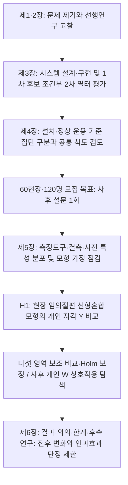

# 제1장 서론

> **작성 상태:** 2026.09.13 지도에 따른 현장 작동성 중심 압축. 현장 임의절편 선형혼합모형 두 집단 비교 설계 유지.
> **분량 목표:** 제1절 1∼2p, 제2절 1p 이내, 제3절 1p + 흐름도.

---

## 제1절 연구의 배경 및 필요성

중소규모 건설현장의 안전관리에서는 위험을 알아차리는 일과 이를 현장 조치로 옮기는 일 사이의 간극이 핵심 문제이다. 고용노동부(2025)의 2024년 산업재해 통계에서 건설업은 업무상사고 사망자가 가장 많은 업종이다(<표 1-1>). 중소규모 현장은 인력·예산·전문역량의 제약으로 지속적인 위험 확인과 대응에 어려움을 겪는다(김용선, 2022; 윤영석, 2025). 따라서 예방 필요성의 확인을 넘어, 제한된 관리 여건에서 위험 신호가 담당자의 확인과 조치로 이어지도록 지원할 필요가 있다. 본 연구에서 ‘현장 작동성’은 이러한 연결 과정에 비추어 안전관리 실효성을 설명하는 관점이며, 별도의 변수나 새로운 설문 척도를 뜻하지 않는다.

기술을 활용한 대응에도 도입 비용과 오경보라는 제약이 따른다. 중소 건설현장의 스마트 안전장비 연구는 비용 부담과 지원 필요성을 지적하였고(이준호, 2024), 스마트 건설기술 수용 연구는 기술 비용과 도입 의향의 부정적 관계를 보고하였다(Zhou et al., 2023). 도입한 시스템도 불필요한 경보를 반복하면 관리자의 확인 부담과 경보 무시 가능성이 커질 수 있다. 의료 모니터링의 경보 피로도 연구(Cvach, 2012)는 이 메커니즘의 이론적 근거이지만, 해당 분야의 경보 비율을 건설현장 수치로 일반화할 수는 없다. 이러한 제약 때문에 비용 부담을 낮추는 구성과 경보의 문맥 검증을 함께 검토할 필요가 있다.

선행연구는 위험 탐지 성능과 기술수용을 설명하였으나, 이 성과만으로 현장 안전관리의 실효성을 판단하기는 어렵다. YOLO 기반 연구는 위험 객체·행동의 탐지를 다루었고(류수영, 2023; 박종학, 2025), 시각-언어 모델 연구는 위험 판단을 보완하는 구조를 제안하였다(김윤헌, 2026; Kim et al., 2025; Wu et al., 2025). 스마트 안전장비 수용 연구도 도입 의향의 조건을 제시하였다(이동건, 2024; Chong et al., 2023). 하이브리드 관제 사례와 적용 현장·일반 현장을 비교한 사례가 이미 있지만(김현수, 2026; 류정·박인선, 2025), 두 집단에 동일한 일반형 척도를 적용해 관리자가 지각하는 현재 실효성을 측정하고 현장 군집과 관측된 응답자·현장 특성을 함께 조정한 비교 근거를 보완할 필요가 있다.

이에 본 연구는 일반 PC와 기존 카메라를 활용하는 YOLO-LLM 안전관제 시스템을 개발하고, 도입 현장과 미도입 현장의 안전관리 실효성을 비교한다. 시스템은 YOLO의 위험 후보 탐지, LLM의 문맥 검증, 담당자 알림을 연결하여 현장 대응을 지원한다. 평가에서는 기술 성능과 관리자가 지각하는 실효성을 구분한다. 운영 로그에서는 오경보 감소와 실제 위험 경보 손실을 함께 검토하고, 설문에서는 두 집단의 현재 안전관리 수행 수준을 비교한다. 이러한 개발·비교를 통해 중소규모 현장이 참고할 수 있는 구현 절차와 도입 판단의 근거를 마련하고자 한다. 다만 횡단 비교 결과를 도입 전후의 변화나 인과효과로 단정하지 않는다.

<표 1-1> 연구 배경의 건설업 사망재해 근거와 해석 범위

| 근거 지표 | 2024년 값 | 해석 범위 |
| --- | --- | --- |
| 건설업 업무상사고 사망자 | 328명 | 건설업 전체 집계이며 중소규모 현장만의 수치가 아님 |
| 전 산업 업무상사고 사망자 대비 건설업 구성비 | 39.66%(328명/827명) | 산업 간 분포이며 건설업 내 규모별 집중도를 뜻하지 않음 |

자료: 고용노동부(2025), 『2024 산업재해현황분석』의 산업별 업무상사고 사망재해 비교표.

주: 산재보상 승인자료 기준이다. 표는 건설업의 재해 부담을 보여주며, 중소규모 현장의 제약은 이 표가 아니라 본문에 제시한 선행연구에 근거한다. [CITE_TODO: 건설업 내 공사금액 또는 근로자 규모별 사망재해 원표와 분모 확인 필요. 확인 전 규모별 집중도 수치 미제시]

---

## 제2절 연구의 목적

본 연구의 목적은 중소규모 건설현장에서 활용할 수 있는 저비용 YOLO-LLM 안전관제 시스템을 개발하고, 도입 현장과 미도입 현장의 안전관리 실효성을 비교하는 데 있다. 연구 대상은 한국농어촌공사 경기지역본부 산하 현장에서 안전관리 업무를 수행하는 관리자와 안전관리자이다. 동일 기관의 관리 체계 안에서 두 집단을 조사하여, 기술의 탐지 성능과 별도로 현장 관리자가 지각하는 현재 업무 수행 수준의 차이를 확인하고자 한다.

개발에서는 YOLO 1차 탐지와 LLM 2차 문맥 검증을 결합하고 담당자에게 위험 정보를 전달하는 구조를 구현한다. 현장 운영 로그에서 YOLO가 1차로 검출한 후보만을 대상으로 LLM 2차 필터의 성능을 평가하여, 오경보 감소와 실제 위험 경보 손실 사이의 상충을 검토한다. 실증에서는 조기인지·대응 신속성·원격 파악·순찰부담 경감·위험 통제력에 관한 공통 8문항으로 안전관리 실효성 Y를 측정한다. 현장 작동성은 이 다섯 업무 영역을 연결하여 해석하는 설명 관점이다.

주가설 H1에서는 응답자·현장 특성을 조정한 뒤 도입 집단이 지각한 현재 안전관리 실효성이 미도입 집단보다 높은지를 검증한다. H2는 조사 시점에 예산 제약을 크게 지각하는 응답자일수록 집단 차이가 더 큰지를 탐색하는 보조가설이다. 응답자가 지각한 이 예산 제약성은 객관적 예산 수준이나 사전에 도입 현장을 정한 배치 기준을 뜻하지 않는다. 경보 피로도 완화 인식은 도입 집단의 참고용 기술통계로만 다룬다. 구체적인 가설·측정 근거와 분석 절차는 제4장에 제시한다. 연구 결과가 뒷받침하는 범위에서 시스템 도입·운용과 후속 연구에 필요한 기초 자료를 제공하고자 한다.

---

## 제3절 연구의 범위 및 방법

연구 범위는 한국농어촌공사 경기지역본부 산하 중소규모 건설현장 60개소(도입 30개소·미도입 30개소)이며, 현장당 2명씩 총 120명을 모집 목표로 한다. 이 수치는 계획값이며, 실제 확보한 표본이나 검정력의 충분성을 뜻하지 않는다. 두 집단의 시공사·발주청 관계자를 동일한 안전관리 직무 범위에서 조사하며, 설치·사전 정상 운용을 확인한 현장을 도입 집단으로 구분한다. 정상 운용 중 알림이 없었던 현장도 도입에 포함하고 알림 경험은 별도로 기록한다. 미도입 비교 대상에는 CCTV가 없는 현장도 포함되므로 기존 CCTV·원격열람·다른 스마트 안전장비의 보유 조건과 도입 현장의 운용 설정을 함께 기록한다. 조사는 2026년 하반기에 사후 설문으로 1회 실시할 계획이다[확정 필요: 최소 운용 기간·두 집단 공통 기준기간·설문 실시 월·중소규모 현장 포함 기준].

연구는 문헌 고찰, 시스템 개발과 운영 로그 평가, 공통 척도 검토, 두 집단 설문 비교 순으로 진행한다. jamovi GAMLj의 현장 임의절편 선형혼합모형으로 동일 현장 응답자의 군집을 반영하고 조정 평균을 비교한다. 소속·성별·연령·경력·직위와 현장 공사금액 규모는 범주형 고정요인 또는 더미로 조정한다. H1·H2의 검정력이 충분한지는 아직 확인하지 않았다. 척도 검토·결측 처리·모형 진단과 보조 분석의 세부 기준은 제4장을 따른다. 비교 대상은 시스템 도입 현장과 통상적 안전관리 현장에서 관리자가 지각한 현재 실효성의 차이이며, 기존 영상 인프라의 차이와 LLM 검증 기능 자체의 추가 효과는 분리하지 않는다. 무작위 배정과 사전 측정이 없으므로 선정 편향과 미측정 교란이 남으며, 운용이 설문에 선행해도 실효성의 형성이 도입 이후임을 확인하지는 못한다.

본 논문은 연구 필요성과 이론적 근거를 다루는 제1·2장, 시스템 개발과 연구설계를 제시하는 제3·4장, 실증분석 결과와 결론을 다루는 제5·6장으로 구성된다. 전체 연구 절차는 <그림 1-1>과 같다.

&lt;그림 1-1&gt; 연구의 흐름도

이상에서 제시한 연구의 배경, 목적, 범위 및 방법을 바탕으로, 제2장에서는 스마트 건설 안전관리, 안전관리 실효성, 경보 피로도와 스마트 안전기술 도입 효과에 관한 국내·외 선행연구를 고찰하여 본 연구의 이론적 근거를 정리한다.

---

## 작성 메모(제출 전 확인 사항 — 본문 아님)

- [x] **윤영석 연도 불일치:** 해결됨(2026-07-12 원문 대조 완료) — 윤영석(2025, 경기대학교 공학대학원 건축·안전공학전공 석사학위논문, 지도교수 박종용)로 확정, 2·3·4·5장 표기를 2025로 일괄 통일함
- [x] **박종학 인용 연도 재확정(2026-07-12 표지·제출면 재대조):** 표지는 "2024학년도 석사학위논문"이나 제출면이 "2025년 6월"이므로 인용 연도는 수여·발행 연도 기준 **박종학(2025)**로 최종 확정(경기대학교 공학대학원 건축·안전공학전공, 지도교수 문유미). 이전 "2024 확정" 기록은 표지 학년도만 본 오판이었음. 전 장 표기를 2025로 통일 완료(학회논문 참고문헌 [05]의 2025와도 일치)
- [ ] [확정 필요: 최소 운용 기간·공통 기준기간·설문 실시 월·중소규모 포함 기준, 미도입 현장 모집 수, 측정 구조 확인 방법을 제4장과 동시에 확정]
- [x] 배경 통계는 고용노동부(2025) 원문 추출자료에서 확인한 2024년 업무상사고 사망자 328명·827명·구성비 39.66%만 사용하였다. 전 산업의 50인 미만 사업장 통계는 건설업 규모별 근거로 사용하지 않았다.
- [ ] [확정 필요: 상황실 구축비의 원문 항목·구성·포함 범위] 비용 비교의 상세 검토는 제2장 <표 2-4>를 따른다.
- [x] 연구흐름도(&lt;그림 1-1&gt;)의 구 ANCOVA PNG 연결을 현행 혼합모형 Mermaid 도식으로 대체함(2026-09-13 MD 수정). HWPX 반영은 별도 작업이다.

