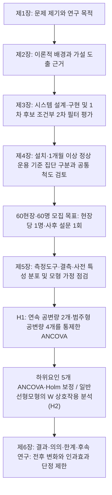

# 제1장 서론

> **작성 상태:** 2026.09.13 지도의 현장 작동성 논지를 유지하고, 2026.10.04 지도에 따라 제1절을 '주장 → 근거(표) → 문제점·필요성 → 개발' 4단으로, 제2절을 목적 문장으로 끝나는 6문단으로, 제3절을 범위·방법과 장별 구성표로 다시 썼다(2026.10.07).
> **분량 목표:** 제1절 2p, 제2절 1p, 제3절 2p(표·흐름도 포함).

---

## 제1절 연구의 배경 및 필요성

중소규모 건설현장 안전관리의 핵심 문제는 위험을 알아차리는 일과 이를 현장 조치로 옮기는 일 사이의 간극에 있다. 현장의 위험은 공정과 장비 이동에 따라 수시로 바뀌지만, 소수의 관리자가 넓은 현장을 직접 순찰하며 이를 모두 확인하기는 어렵다. 한 사람이 여러 공정을 함께 맡는 현장에서는 순찰과 순찰 사이에 생긴 위험이 다음 순찰까지 드러나지 않을 수 있다. 위험을 늦게 알아차리면 조치도 늦어지고, 알아차리더라도 담당자에게 제때 전달되지 않으면 조치로 이어지지 않는다. 따라서 중소규모 현장에 필요한 것은 예방이 중요하다는 원칙의 재확인이 아니라, 위험 신호가 담당자의 확인과 조치로 끊기지 않고 이어지도록 돕는 수단이다.

이러한 판단은 재해 통계로 뒷받침된다. 고용노동부(2025a)의 2024년 산업재해 통계에서 건설업은 업무상사고 사망자가 328명으로 전 산업 가운데 가장 많은 업종이다. 건설업 안에서도 사망자는 규모가 작은 현장에 몰려 있다. <표 1-1>과 같이 공사금액 120억 원 미만 현장의 사망자는 235명으로 전체의 71.6%를 차지하며, 3억 원 미만 현장만으로도 34.8%에 이른다. 같은 자료의 공사금액별 사망만인율도 3억 원 미만 현장이 4.92‱로 1,000억 원 이상 현장(0.80‱)의 약 6배였다. 다만 이 만인율은 업무상사고가 아닌 전체 사망자를 기준으로 하므로 <표 1-1>과 분모가 다르다. 두 지표 모두 사망재해 예방의 성과가 중소규모 현장의 안전관리 수준에 크게 달려 있음을 보여준다.

<표 1-1> 건설업 공사금액 규모별 업무상사고 사망자 분포(2024년)

| 공사금액 구간 | 사망자(명) | 비율(%) | 누적(%) |
| --- | ---: | ---: | ---: |
| 3억 원 미만 | 114 | 34.8 | 34.8 |
| 3억 원 이상∼20억 원 미만 | 62 | 18.9 | 53.7 |
| 20억 원 이상∼50억 원 미만 | 36 | 11.0 | 64.6 |
| 50억 원 이상∼120억 원 미만 | 23 | 7.0 | 71.6 |
| 120억 원 이상∼300억 원 미만 | 19 | 5.8 | 77.4 |
| 300억 원 이상 | 63 | 19.2 | 96.6 |
| 분류불능 | 11 | 3.4 | 100.0 |
| 계 | 328 | 100.0 | — |

자료: 고용노동부(2025a), 『2024 산업재해 현황분석』 인쇄 336쪽의 건설공사금액별·발생형태별 업무상사고 사망자 표.

주: 1) 산재보상 승인자료 기준이며, 분류불능은 건설기계관리사업 등 공사금액이 없는 경우이다(원표 주). 2) 비율과 누적 비율은 원표의 사망자 수로 연구자가 계산하였다. 300억 원 이상은 원표의 300억 원 이상∼500억 원 미만(16명), 500억 원 이상∼1,000억 원 미만(14명), 1,000억 원 이상(33명)을 합한 값이다. 3) 본 연구 설문의 총공사비 구간(20억 원 미만, 20억 원 이상∼50억 원 미만, 50억 원 이상∼120억 원 미만, 120억 원 이상)은 이 통계의 구간 경계에 맞춘 것이며, 이 기준에서 120억 원 미만 현장이 전체 사망자의 71.6%를 차지한다.

사망자가 몰린 중소규모 현장은 안전관리 여건의 제약도 크다. 이들 현장은 안전관리 인력과 예산이 적고, 위험을 지속적으로 확인할 전문역량도 부족하다(김용선, 2022). 인력이 부족하면 순찰 간격이 길어져 위험을 늦게 알아차리고, 전문역량이 부족하면 알아차린 위험을 어떤 조치로 옮길지 판단하기 어렵다. 영상관제나 스마트 안전장비가 대안으로 거론되지만 도입 비용이 부담이 되고(이준호, 2024), 도입한 뒤에도 불필요한 경보가 반복되면 관리자의 확인 부담이 늘고 경보가 무시될 수 있다. 따라서 중소규모 현장에는 비용 부담을 낮추면서 경보의 정확도를 함께 확보하는 기술이 필요하다.

또한 기술의 탐지 성능만으로는 현장의 안전관리 실효성을 판단하기 어렵다. 지금까지의 연구는 주로 위험 객체·행동을 얼마나 정확히 탐지하는지, 관리자가 기술을 받아들일 의향이 있는지에 초점을 두었다. 그러나 탐지 정확도가 높더라도 관리자가 위험을 더 빨리 알아차리고 대응하는지는 별개의 질문이다. 적용 현장과 일반 현장을 비교한 사례도 일부 있으나, 두 집단에 같은 척도를 적용하고 응답자·현장 특성을 통제하여 관리자가 지각한 현재 안전관리 실효성을 비교한 근거는 보완할 필요가 있다. 기술 성능과 수용 의향, 현장 비교를 다룬 선행연구의 구체적 내용과 한계는 제2장에서 고찰한다.

이에 본 연구는 범용 PC와 기존 카메라를 활용하는 YOLO-LLM 안전관제 시스템을 개발하였다. 범용 PC와 기존 카메라를 쓰는 구성은 별도 관제 설비를 갖추기 어려운 현장의 비용 부담을 낮추기 위한 것이다. 시스템은 YOLO가 위험 후보를 1차로 탐지하고, LLM이 영상의 문맥을 2차로 검증한 뒤, 확정된 경보를 담당자에게 즉시 전달한다. 이 구성은 위험을 알아차리는 단계와 조치로 옮기는 단계를 잇는 '현장 작동성'의 관점에서 설계하였으며, 현장 작동성은 별도의 변수가 아니라 안전관리 실효성을 해석하는 관점이다. 나아가 이 시스템을 도입한 현장과 도입하지 않은 현장의 안전관리 실효성을 비교하여, 기술 성능만으로는 알 수 없는 안전관리 수행 수준의 차이를 확인한다. 다만 단일 시점의 횡단 비교이므로 그 결과를 도입 전후의 변화나 인과효과로 단정하지 않는다.

---

## 제2절 연구의 목적

건설업의 업무상사고 사망자는 공사금액 120억 원 미만의 중소규모 현장에 집중되어 있다. 이들 현장은 인력·예산·전문역량의 제약으로 위험을 지속적으로 확인하고 이를 조치로 옮기는 데 어려움을 겪는다.

본 연구가 YOLO와 LLM을 결합한 하이브리드 구조를 택한 이유는 비용과 경보 정확도라는 두 제약을 함께 다루기 위해서이다. YOLO는 범용 PC에서 기존 카메라 영상을 빠르게 처리할 수 있으나 오경보가 남는다. LLM은 문맥을 판단할 수 있으나 모든 영상을 맡기면 처리 비용과 지연이 커진다. 따라서 YOLO가 위험 후보를 고르고 LLM이 그 후보만 검증하는 구성이 중소규모 현장의 여건에 맞는다고 판단하였다.

본 연구는 먼저 이 시스템을 설계·구현하고, 현장 운영 로그에서 YOLO가 1차로 검출한 후보를 대상으로 LLM 2차 검증의 오경보 감소와 실제 위험 경보 손실을 함께 평가한다. 이어서 A공사(공공 발주기관, 기관명 비공개) 경기지역본부 산하 도입 현장과 미도입 현장의 관리자에게 설문을 실시하여, 조기인지·대응 신속성·원격 파악·순찰부담 경감·위험 통제력으로 구성한 안전관리 실효성을 측정한다. 이를 통해 기술 성능과 안전관리 실효성의 두 측면에서 결과를 얻고자 한다.

첫째 연구 문제는 두 집단, 곧 YOLO-LLM 안전관제 시스템 도입집단과 미도입집단의 관리자가 지각한 현재 안전관리 실효성이 응답자·현장 특성(공변량)을 통제한 후에도 차이가 있는가이다. 이에 대하여 도입집단의 관리자가 지각한 안전관리 실효성은 응답자·현장 특성을 통제한 후에도 미도입집단보다 높을 것이라는 가설(H1)을 설정한다.

둘째 연구 문제는 두 집단 간 안전관리 실효성 차이가 응답자가 조사 시점에 지각한 안전관리 예산 제약성 수준에 따라 달라지는가이다. 이에 대하여 조사 시점에 안전관리 예산 제약성을 크게 지각하는 응답자일수록 두 집단 간 차이가 더 클 것이라는 가설(H2)을 설정한다. 여기서 예산 제약성은 응답자가 지각한 수준이며, 객관적 예산 수준이나 도입 현장을 정한 배치 기준을 뜻하지 않는다. 가설의 근거와 분석 절차는 제4장에 제시한다.

본 연구의 목적은 중소규모 건설현장을 위한 YOLO-LLM 안전관제 시스템을 개발하고, 도입 현장과 미도입 현장의 안전관리 실효성 차이를 실증적으로 검증하는 데 있다. 연구 결과가 뒷받침하는 범위에서 시스템의 도입·운용과 후속 연구에 필요한 기초 자료를 제공한다.

---

## 제3절 연구의 범위 및 방법

**공간적 범위.** 본 연구의 공간적 범위는 A공사 경기지역본부 산하 건설현장이다. 시스템 도입 현장 30개소와 미도입 현장 30개소, 총 60개소를 조사 대상으로 하며, 현장당 1명씩 총 60명을 모집 목표로 한다. 이 수치는 모집 계획값으로, 실제 확보한 표본이나 충분한 검정력을 뜻하지 않는다. 응답자는 두 집단의 시공사·발주청 관계자 중 담당 현장의 안전관리 예산·지원 여건을 파악하는 사람으로, 동일한 안전관리 직무 범위에서 선정한다. 한 기관의 관리 체계 아래 있는 현장끼리 비교하여 발주기관의 관리 방식에서 오는 차이를 줄이고자 하였다.

**시간적 범위.** 조사는 2026년 10월에 사후 설문으로 1회 실시한다. 도입 집단은 설치 후 응답일 현재 1개월 이상 정상 운용을 확인한 현장으로 구분하며, 정상 운용 중 알림이 없었던 현장도 포함하고 알림 경험은 별도로 기록한다. 두 집단 모두 안전관리 실효성과 예산 제약성 문항은 설문 응답일 직전 1개월의 실태와 여건을 기준으로 평가하며, 사후 설문 1회이므로 도입 전 상태는 측정하지 않는다.

**내용적 범위.** 내용적 범위는 두 집단의 안전관리 실효성 차이와, 그 차이가 안전관리 예산 제약성에 따라 달라지는지이다. 안전관리 실효성은 조기인지, 대응 신속성, 원격 파악, 순찰부담 경감, 위험 통제력의 5개 하위요인으로 측정하며, 경보 피로도 완화 인식은 도입 집단에만 묻는 참고용 기술통계로 다룬다. 응답자·현장 특성을 통제하기 위해 만 나이와 건설현장 경력(년)을 연속 공변량으로, 소속·성별·역할·총공사비 4구간을 범주형 공변량으로 포함한다. 시스템은 중소규모 현장의 제약을 고려해 개발하되, 조사에는 총공사비 120억 원 이상 현장도 포함하며 공사비 상한을 두지 않는다. 따라서 개발이 지향하는 범위와 조사 범위를 구분하고, 결과는 실제 규모 분포와 두 집단의 공통 관측범위 안에서 해석한다. 미도입 현장에는 CCTV가 없는 현장도 포함되므로 기존 CCTV·원격열람·다른 스마트 안전장비의 보유 조건과 도입 현장의 운용 설정을 함께 기록한다.

**연구 방법.** 연구는 문헌 고찰, 시스템 개발과 운영 로그 평가, 설문조사, 통계 분석의 순서로 진행한다. 문헌 고찰로 변수와 가설의 근거를 정리하고, 시스템 개발 단계에서는 현장 운영 로그로 LLM 2차 검증의 성능을 평가하며, 설문조사에서는 두 집단에 같은 척도를 적용한다. 설문 자료는 jamovi 공분산분석(ANCOVA)으로 연속 공변량 2개와 범주형 공변량 4개를 통제하여 두 집단의 조정 평균을 비교하고(H1), 집단과 안전관리 예산 제약성의 상호작용은 일반선형모형으로 분석한다(H2). 현장 ID는 중복 방지와 명부 연결에만 사용하며, 척도 검토·결측 처리·가정 점검의 세부 기준은 제4장을 따른다. 장별 구성은 <표 1-2>와 같다.

<표 1-2> 연구의 방법과 장별 구성

| 장 | 내용 | 방법·자료 |
| --- | --- | --- |
| 제1장 서론 | 연구의 배경과 필요성(문제 제기), 연구의 목적, 연구의 범위와 방법 | 재해 통계 검토 |
| 제2장 이론적 배경 | 개념 정의, 시스템의 기술 특성, 안전관리 실효성의 하위요인, 안전관리 예산 제약성, 선행연구와 가설 도출 근거 | 문헌 고찰 |
| 제3장 시스템 개발 | 요구사항, 설계, 구현, 시스템 개발의 효과 분석 | 시스템 개발, 운영 로그 평가 |
| 제4장 연구설계 | 연구 모형, 가설, 조작적 정의, 설문 설계, 표본, 분석 절차 | 두 집단 ANCOVA 설계(jamovi) |
| 제5장 실증분석 결과 | 인구통계학적 특성, 신뢰도·타당도, 기술통계, 가설 검정, 연구 결과 및 논의 | 설문조사(60명 모집 목표), ANCOVA·일반선형모형 |
| 제6장 결론 | 연구 요약, 시사점, 한계, 향후 연구 방향 | 결과 종합 |

<표 1-2>와 같이 제1장은 문제 제기와 연구 목적을, 제2장은 그 이론적 근거를 맡도록 두 장의 역할을 나누었다. 제3장에서 개발한 시스템의 설치·운용이 제4장의 집단 구분 기준이 되고, 제5장의 실증분석 결과가 제6장 결론의 근거가 된다.

본 연구는 무작위 배정과 사전 측정이 없는 횡단 비교이므로 기존 영상 인프라와 LLM 검증 기능의 차이를 분리하지 못하며, 선정 편향과 시간적 우선성의 한계가 남는다. 이러한 한계와 검정력 문제는 제6장에서 자세히 제시한다. 전체 연구 절차는 <그림 1-1>과 같다.

&lt;그림 1-1&gt; 연구의 흐름도

제2장에서는 앞서 제시한 연구의 배경, 목적, 범위 및 방법을 바탕으로 건설산업 스마트 안전관리와 AI 영상관제 기술, 시스템의 기술 특성, 안전관리 실효성, 예산 제약성, 스마트 안전기술 활용과 안전관리 실효성에 관한 선행연구를 고찰하여 본 연구의 이론적 근거를 정리한다.

---

## 작성 메모(제출 전 확인 사항 — 본문 아님)

- [ ] **윤영석 발행연도 재확인(2026-09-30):** 원문에서 2025학년도와 2025년 12월 제출·인준을 확인하였다(경기대학교 공학대학원 건축·안전공학전공 석사학위논문, 지도교수 박종용). 과거에는 제출일만으로 인용 연도를 2025로 확정했으나, 학위수여·발행연도는 공식 서지에서 추가 확인해야 한다. [확정 필요: 윤영석 학위수여·발행연도 — 현행 2025 표기는 잠정 유지]
- [x] **박종학 인용 연도 재확정(2026-07-12 표지·제출면 재대조):** 표지는 "2024학년도 석사학위논문"이나 제출면이 "2025년 6월"이므로 인용 연도는 수여·발행 연도 기준 **박종학(2025)**로 최종 확정(경기대학교 공학대학원 건축·안전공학전공, 지도교수 문유미). 이전 "2024 확정" 기록은 표지 학년도만 본 오판이었음. 전 장 표기를 2025로 통일 완료(학회논문 참고문헌 [05]의 2025와도 일치)
- [ ] [확정 필요: 실제 미도입 현장 확보 수, 측정 구조 확인 방법을 제4장과 동시에 확정]
- [x] 배경 통계는 고용노동부(2025a) 원문 추출자료에서 확인한 2024년 업무상사고 사망자 328명·827명과 그 구성비만 사용하였다. 전 산업의 50인 미만 사업장 통계는 건설업 규모별 근거로 사용하지 않았다. (2026-10-07 표 교체로 구성비 수치는 본문에서 뺐다 — 아래 항목 참조)
- [x] 상황실 구축 1,200만 원은 국토교통부·국토안전관리원(2024) 가이드라인 인쇄 23쪽(PDF 27쪽)에서 서버·네트워크·방송시설 포함 단가로 확인하였다. 월간 요금의 출처와 대안별 총비용 비교의 잔여 확인 사항은 제2장 제4절 제1항의 [확정 필요] 표기와 제3장 <표 3-9>를 따른다.
- [x] 연구흐름도(&lt;그림 1-1&gt;)의 구 ANCOVA PNG 연결을 당시 혼합모형 Mermaid 도식으로 대체함(2026-09-13 MD 수정). 2026-10-03에는 현장당 1명·60명과 ANCOVA를 반영하여 위 Mermaid 도식을 수정하였다. HWPX 반영은 별도 작업이다.
- [x] **2026-10-04 지도 반영(2026-10-07 MD 수정):** <표 1-1>을 '건설업 공사금액 규모별 업무상사고 사망자 분포(2024년)'로 교체하였다(고용노동부 2025a 인쇄 336쪽 원표, 비율은 연구자 계산, 120억 원 미만 누적 71.6%). 이로써 종전 표 주에 남아 있던 규모별 원표 확인 표기(CITE_TODO)를 해소하였다. 김석기(2026)의 2023년 68.5%는 재인용하지 않는다. 제1절은 인용 없는 주장 문단으로 시작하고 선행연구 인용 9건을 요약 서술로 바꾸었으며(해당 문헌은 제2장에 있음), Zhou et al.(2023)의 통계 불일치 논평은 제2장 <표 2-5>·작성 메모로 넘겼다. 제2절은 6문단으로 바꾸고 마지막 문단을 확정 목적 문장으로 시작하였다. 제3절은 공간·시간·내용 범위와 <표 1-2> 장별 구성을 신설하고 흐름도의 제1장·제2장 노드를 분리하였다. 한계 서술은 제6장으로 넘기고 두 문장만 남겼다. HWPX 반영과 00_목차의 표 목차·초록 목적 문장 동기화는 별도 작업이다.
