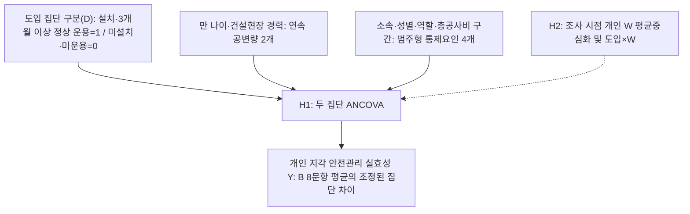

# 제4장 연구설계

## 제1절 연구 모형 설계

본 연구의 목적은 중소규모 건설현장을 위한 YOLO-LLM 안전관제 시스템을 개발하고, 도입 현장과 미도입 현장의 안전관리 실효성 차이를 실증적으로 검증하는 데 있다. 고가 서버와 VMS(Video Management System)에 의존하는 기존 스마트 안전관제 시스템은 안전관리 예산이 제한된 중소규모 현장에서 도입하기 어렵다(이준호, 2024). 본 연구는 일반 사무용 PC와 기존 현장 카메라(ONVIF)로 운용할 수 있는 저비용 시스템을 그 대안으로 제시한다.

두 집단의 비교에는 사후 설문 1회를 이용하는 횡단적 준실험 설계를 적용한다. 도입 집단은 A공사 경기지역본부 산하 조사대상 건설현장 가운데 시스템 설치와 응답일 현재 3개월 이상 정상 운용이 확인된 현장으로 구성하고, 미도입 집단은 같은 관할 범위에서 미설치·미운용이 확인된 현장으로 구성한다. 정상 운용 중 알림이 없었던 현장도 도입 집단에 포함한다. 독립변수는 현장 단위의 YOLO-LLM 안전관제 시스템 도입이며, 종속변수는 관리자가 지각한 현재 안전관리 업무의 실질적 수행 수준이다.

시스템 개발은 안전관리 자원이 부족한 중소규모 현장을 지향하지만, 조사 표본에는 총공사비 120억 원 이상 현장도 포함한다. 개발 대상과 조사 표본의 범위를 구분하며, 조사에 포함된 모든 현장을 중소규모라고 정의하지 않는다. 현장별 한 명의 응답은 해당 관리자의 지각을 나타내므로 현장 전체의 객관적 안전관리 실효성을 완전하게 대표하지 않는다.

가설의 방향은 기술수용 연구와 안전관리 업무 지원 기제를 연결하여 설정한다. 기술수용모델(Davis, 1989)과 스마트 안전기술의 수용·채택 의도 연구(이동건, 2024; Chong et al., 2023)는 기술을 받아들이는 조건을 설명할 뿐 실제 안전 성과를 직접 입증하지 않는다. 따라서 본 연구는 저비용 인프라의 도입 가능성(이준호, 2024)과 위험정보 전달·대응 지원 기제를 바탕으로 관리자가 지각한 안전관리 실효성의 집단 차이를 검토하며, 그 근거는 제2장 제5절에서 고찰하였다.

본 연구는 인과관계의 세 조건인 공변성, 시간적 우선성, 외생변수 통제를 각각 어디까지 충족하는지 구분하여 제시한다(Shadish, Cook, & Campbell, 2002). 공변성을 확인하기 위해서는 응답자와 현장 특성을 조정하여 집단 평균을 비교하는 공분산분석(ANCOVA)을 사용한다. 시간적 우선성에 대해서는 시스템 운용이 사후 측정보다 앞서도록 한다. 다만 도입 전 안전관리 실효성을 측정하지 않으므로, 현재 수준이 도입 후에 형성되었는지까지는 확인할 수 없다.

외생변수를 통제하기 위해 여섯 특성을 조정하고 사전 특성의 분포·균형을 진단한다. 만 나이와 건설현장 경력은 연속 공변량으로, 소속 구분·성별·역할·총공사비 구간은 범주형 통제요인으로 투입한다. 공변량은 집단 비교에서 함께 조정하는 연속 특성을 뜻하며, 두 집단의 분포와 공통 관측범위를 확인한다. 이하 가설 문장의 ‘공변량’은 연속 공변량과 범주형 통제요인을 통칭한다. 비무작위 선정에 따른 편향과 측정하지 않은 교란요인의 영향은 조정 후에도 남을 수 있으므로, 결과는 관리자가 지각한 안전관리 실효성의 조정된 집단 차이로 해석하며 인과 효과를 단정하지 않는다.

비교 조건의 범위도 미리 한정한다. 미도입 집단에는 CCTV를 운용하는 현장과 운용하지 않는 현장이 함께 포함된다. 따라서 주 비교에서는 본 시스템 운용 현장과 통상적인 방식으로 안전관리를 수행하는 현장의 관리자가 현재 업무 수준을 어떻게 다르게 지각하는지 살펴본다. 이 차이는 기존 영상 인프라의 기여와 LLM 후단 검증·모바일 알림 등 추가 기능의 기여를 분리한 인과 효과가 아니다. 기존 인프라와 도입 현장의 운용 설정은 조사 명부에 기록하여 분포를 보고하며, 주 모형의 통제변수는 위 여섯 특성으로 유지한다.

이상의 설계를 토대로 연구변수를 구성하면 <표 4-1>과 같다.

<표 4-1> 연구변수의 구성

| 변수 구분 | 변수 및 하위요인 | 구성과 역할 |
|:---:|:---|:---|
| 독립변수 | YOLO-LLM 안전관제 시스템 도입 | 설치·3개월 이상 정상 운용 확인 도입=1, 미설치·미운용 확인 미도입=0 |
| 종속변수 | 안전관리 실효성 | 관리자 개인이 지각한 현재 안전관리 업무 수준. 조기인지, 대응 신속성, 원격 파악, 순찰부담 경감, 위험 통제력의 5개 하위요인 |
| 조정변수 | 응답자·현장 특성 | 연속 공변량: 만 나이·건설현장 경력; 범주형 통제요인: 소속 구분·성별·역할·총공사비 구간 |
| 상호작용 변수 W | 안전관리 예산 제약성 | 집단×예산 제약성 상호작용의 방향과 효과크기를 검토하는 공통 응답 변수 |
| 참고 변수 | 현장 운영 특성(두 집단 공통), 시스템 특성 인식·경보 피로도 완화 인식(도입 집단) | 주 분석에 투입하지 않는 응답 변수. 현장 운영 특성은 위험 인지 경로·시점·지시 전달 소요시간의 집단별 교차표를 보고하고 A-7·A-8 운용 실태 확인(민감도 분석 부분집단), A-9 <표 4-6> 해석에 쓰며, 시스템 특성 인식·경보 피로도 완화 인식은 도입 집단의 기술통계만 보고 |

연구 모형은 도입 집단 구분(D)에 따른 두 집단의 안전관리 실효성 조정 평균을 비교하는 단순 모형으로 설정하였다.

주: 화살표는 모형의 분석 관계이며 인과관계 입증을 뜻하지 않는다. 알림 경험은 도입 분류와 별도로 기록한다.

<그림 4-1> 연구 모형

주 분석은 <그림 4-1>의 비교 모형으로 수행하며, 주 결론은 H1의 집단 간 조정 평균 차이를 근거로 도출한다. 예산 제약성과 집단의 상호작용은 H2의 상호작용 분석으로 검토한다. 모집 목표는 현장당 1명, 집단별 30명, 총 60명이지만, 이 규모로 H1과 H2에 충분한 검정력을 확보할 수 있는지는 아직 검증하지 않았다. 따라서 유의성 판정과 함께 차이의 방향·크기·신뢰구간을 보고한다. 다음 절에서는 이 모형에 근거한 연구 문제와 연구 가설을 제시한다.

## 제2절 연구 문제 및 연구 가설

본 연구는 제1절의 연구 모형에 따라 두 개의 연구 문제와 이에 대응하는 연구 가설을 설정한다. 각 가설의 이론적 근거와 선행연구는 제2장 제5절 제1항(H1)·제2항(H2)에서 고찰하였다.

**연구 문제 1.** 두 집단(YOLO-LLM 안전관제 시스템 도입집단, 미도입집단)의 관리자가 지각한 현재 안전관리 실효성은 응답자·현장 특성(공변량)을 통제한 후에도 차이가 있는가.

**연구 가설 1(H1).** 두 집단(YOLO-LLM 안전관제 시스템 도입집단, 미도입집단) 중 도입집단의 관리자가 지각한 안전관리 실효성은 응답자·현장 특성(공변량)을 통제한 후에도 미도입집단보다 높을 것이다.

H1은 안전관리 실효성 8문항 평균점수의 조정 평균 차이로 검정한다. 비교 대상은 통상적인 방식으로 안전관리를 수행하는 미도입 현장이며, 제1절에서 한정한 대로 기존 인프라와 추가 기능의 기여는 분리하지 않는다. 조기인지·대응 신속성·원격 파악·순찰부담 경감·위험 통제력의 하위요인별 차이는 H1의 해석을 보완하는 분석으로 제시한다.

**연구 문제 2.** 두 집단 간 안전관리 실효성 차이는 응답자가 조사 시점에 지각한 안전관리 예산 제약성 수준에 따라 달라지는가.

**연구 가설 2(H2).** 두 집단 간 안전관리 실효성 차이는 조사 시점에 안전관리 예산 제약성을 크게 지각하는 응답자일수록 더 클 것이다.

H2는 H1과 같은 조정변수에 W와 집단의 상호작용항을 더한 일반선형모형으로 검정한다. 다만 모집 목표 60명에서 상호작용 검정력은 아직 확인하지 않았으므로, 유의확률과 함께 상호작용 추정치와 95% 신뢰구간을 보고하고, 유의하지 않은 결과를 상호작용이 없다는 증거로 단정하지 않는다.

이상의 연구 가설을 종합하면 <표 4-2>와 같다.

<표 4-2> 연구 가설 종합

| 가설 | 가설 내용 | 분석 관계 |
|:---:|:---|:---:|
| H1 | 두 집단(YOLO-LLM 안전관제 시스템 도입집단, 미도입집단) 중 도입집단의 관리자가 지각한 안전관리 실효성은 응답자·현장 특성(공변량)을 통제한 후에도 미도입집단보다 높을 것이다. | 집단 → Y |
| H2 | 두 집단 간 안전관리 실효성 차이는 조사 시점에 안전관리 예산 제약성을 크게 지각하는 응답자일수록 더 클 것이다. | 집단 × W → Y |

제3절에서는 가설 검정에 사용하는 변수의 조작적 정의와 측정도구의 구성을 제시한다.

## 제3절 변수의 조작적 정의 및 측정도구 구성

### 제1항 변수의 조작적 정의

본 연구의 변수는 제2장에서 고찰한 개념을 토대로 조작적으로 정의하였으며, 변수별 하위요인과 측정방법은 <표 4-3>과 같다.

<표 4-3> 변수의 조작적 정의와 측정도구의 구성

| 변수명 | 하위요인 | 조작적 정의 | 측정방법 |
|:---|:---|:---|:---|
| 독립변수: YOLO-LLM 안전관제 시스템 도입(D) | — | 시스템 설치와 응답일 현재 3개월 이상 정상 운용이 확인된 현장(도입=1)과 미설치·미운용이 확인된 현장(미도입=0)의 구분. 알림 경험은 별도 기록 | 조사 명부에 따른 이분형 집단 구분 |
| 종속변수: 안전관리 실효성(Y) | 조기인지 | 현장 관리자가 자기 현장에서 위험 징후를 사고로 이어지기 전에 발견한다고 지각하는 수준 | 5점 리커트척도(B-1) |
| | 대응 신속성 | 위험 상황을 인지한 뒤 초동 대응을 빠르게 지시한다고 지각하는 수준 | 5점 리커트척도(B-2) |
| | 원격 파악 | 현장에 직접 가지 않고도 위험 상황을 파악하고 위험 정보와 조치 필요사항을 공유한다고 지각하는 수준 | 5점 리커트척도(B-3·B-4) |
| | 순찰부담 경감 | 제한된 인력으로 순찰·확인 업무를 효율적으로 수행하고 불필요한 확인보다 실제 위험 대응에 집중한다고 지각하는 수준 | 5점 리커트척도(B-5·B-6) |
| | 위험 통제력 | 시정·작업중지 등 통제 조치를 신속하게 시행하여 위험요인을 실질적으로 통제한다고 지각하는 수준 | 5점 리커트척도(B-7·B-8) |
| 상호작용 변수: 안전관리 예산 제약성(W) | — | 조사 시점에 고가 스마트 안전장비나 관제 시스템을 도입하기에 안전관리 예산과 산업안전보건관리비·본사·발주청 지원이 부족하다고 지각하는 정도 | 5점 리커트척도(C-1∼C-4) |
| 참고 변수: 시스템 특성 인식(도입 집단) | 인프라 범용성 | 일반 사무용 PC와 기존 카메라로 구동되어 별도 장비 투자 부담이 적다고 경험한 정도 | 5점 리커트척도(D-1·D-2), 비해당 허용 |
| | 탐지·제어 안정성 | 알림이 몰리거나 통신 상태가 좋지 않아도 안정적으로 작동한다고 경험한 정도 | 5점 리커트척도(D-3·D-4), 비해당 허용 |
| | 오탐 필터링 | 배경이나 정상 작업을 위험으로 잘못 알리는 일이 드물다고 경험한 정도 | 5점 리커트척도(D-5·D-6), 비해당 허용 |
| | 알림 전파 즉각성 | 위험 요약과 이미지가 모바일 메신저로 신속하게 전달되고 이를 통해 현장 상황을 파악한다고 경험한 정도 | 5점 리커트척도(D-7·D-8), 비해당 허용 |
| 참고 변수: 경보 피로도 완화 인식(도입 집단) | — | 오탐 필터링으로 잦은 경보 확인에 따른 스트레스·둔감화와 불필요한 확인 부담이 줄었다고 회고적으로 지각하는 정도 | 5점 리커트척도(E-1∼E-4), 비해당 허용 |
| 참고 변수: 현장 운영 특성 | — | 담당자 부재 시 위험 인지 경로, 순찰 간 위험 인지 시점, 인지 후 지시 전달 소요시간 | 보기 선택(A-7·A-8: 운용 실태 확인, A-9: 과정 지표), 응답일 직전 1개월 |
| 조정변수: 응답자·현장 특성 | 연속 공변량 | 만 나이(세), 건설현장 경력(년) | 숫자 기입(A-3·A-4) |
| | 범주형 통제요인 | 소속 구분, 성별, 역할, 총공사비 구간(4구간) | 명목척도(A-1·A-2·A-5·A-6) |

주: 안전관리 실효성 하위요인의 정의는 제2장 제3절 제1∼5항을 따른다. 문항별 근거는 별도의 근거 대조표로 관리하며 문항 전문은 부록(도입 현장용·미도입 현장용 설문지)에 수록한다.

<표 4-3>에서 독립변수는 현장 단위의 시스템 도입 집단 구분이고, 종속변수는 다섯 하위요인으로 구성한 관리자의 현재 안전관리 업무 수준이다. 종속변수를 특정 시스템의 기능이나 만족도가 아닌 현장 일반의 업무 수준으로 정의한 것은, 미도입 현장 관리자도 같은 기준으로 응답하게 하여 두 집단을 비교하기 위해서이다. 시스템 특성 인식과 경보 피로도 완화 인식은 도입 집단만 응답할 수 있으므로 가설 검정에 투입하지 않고 도입 집단의 경험을 기술하는 참고 변수로 둔다. 현장 운영 특성은 두 집단이 함께 응답하지만 지각 점수가 아닌 사실 응답이므로, 가설 검정에 투입하지 않고 운용 실태 확인(A-7·A-8)과 H1 결과 해석(A-9)에 쓰는 참고 변수로 둔다. 조정변수는 비무작위 집단 구성에서 생길 수 있는 응답자·현장 구성 차이를 조정하기 위해 사전에 지정하였다.

YOLO-LLM 안전관제 시스템 도입(D)은 정상 운용 중 알림이 없었던 현장도 1로 코딩하며, 실제 알림 수신과 응답자의 확인 경험은 별도로 기록한다. 정상 운용은 해당 기간의 가동 기록·로그 등 객관 자료와 현장 담당자 확인을 대조하여 판단한다. 정상 운용 기간은 시스템 설치일부터 세며, 운용 중 1차 검출 가중치의 갱신은 검출 대상 범주가 같은 가중치 교체이므로 운용 중단으로 보지 않는다. 현장별 적용 가중치 판본은 제5절 제1항의 조사 명부에 1차 검출 가중치 판본으로 기록한다. 정상 운용 기간이 3개월 미만이거나, 자료를 확보하지 못했거나, 두 확인 내용이 일치하지 않거나, 중단·장애가 있는 현장은 미도입으로 재분류하지 않고 도입 모집 요건 미충족 또는 분류 유보로 기록한다. 도입 현장의 사용 모델·프롬프트·RAG 사용 등 운용 설정은 동일하다고 가정하지 않고 조사 명부에 기록한다. [확정 필요: 정상 가동의 세부 판정 기준과 중단·장애 현장의 포함·제외 기준을 조사 전에 확정]

설치 직후에는 카메라 등록·임계값 조정·알림 수신자 설정 같은 초기 설정과 적응 과정이 이어지므로, 이 기간의 지각은 안정된 운용 상태를 반영하지 못할 수 있다. 따라서 응답일 현재 3개월 이상 정상 운용을 도입 요건으로 두어, 초기 설정·적응 기간이 지난 뒤의 B·C 문항 기준기간(응답일 직전 1개월) 전체가 안정된 운용 기간에 포함되도록 설계하였다. 운용 안정화에 필요한 기간을 보고한 문헌은 확인하지 못했다[CITE_TODO: 스마트 안전장비·영상관제 도입 후 운용 안정화 기간 근거]. 이 요건은 설치 후 2개월 안에 초기 설정과 적응이 끝난다는 가정에 기댄다.

안전관리 실효성(Y)과 안전관리 예산 제약성(W)은 두 집단 모두 설문 응답일 직전 1개월을 기준으로 응답한다. W는 점수가 높을수록 예산 제약을 크게 지각한다는 뜻이다. 다만 W는 조사 시점의 개인 지각이므로 현장의 객관적 예산이나 도입 전 조건과 같지 않고, 도입 경험이 사후 인식과 관련될 가능성도 남는다. 그러므로 W 수준에 따른 조건부 차이를 어느 현장에 먼저 도입할지 정하는 인과적 기준으로 해석하지 않는다.

현재 채점안은 안전관리 실효성 점수(Y)를 8문항의 동일 가중 평균으로 산출한다. 하위요인별 문항 수가 1·1·2·2·2개이므로 2문항 하위요인은 1문항 하위요인보다 전체 점수에서 두 배의 비중을 차지하며(12.5%·12.5%·25%·25%·25%), 이 평균점수는 단일 잠재요인으로 검증된 점수가 아니라 다섯 하위요인을 포괄하는 합성점수이다. Y와 W는 기본 채점 규칙에 따라 해당 척도 전 문항에 응답한 경우 평균을 산출하며, 부분 무응답을 임의 평균이나 0점으로 채우지 않는다. 내용타당도 검토·예비조사·척도 구조 확인은 예정 절차이고 Cronbach's α만으로 단일차원성이나 타당도를 확보했다고 판단하지 않는다. 단일 문항 하위요인에는 α를 산출하지 않으며, 채점안은 H1 결과를 보기 전에 고정한다.

경보 피로도 완화 인식은 같은 현장에서 도입 전 자동 알림과 현재 본 시스템의 알림을 직접 확인한 전반적인 경험을 비교한 회고적 인식이며, 비교 기간의 길이는 따로 정하지 않는다. 따라서 이 점수는 실제 사전·사후 변화량이나 인과 효과를 측정한 값이 아니다. 시스템 특성 인식과 함께 주 분석에는 투입하지 않고 도입 집단의 기술통계만 보고한다.

현장 운영 특성(A-7∼A-9)은 Y·W에 포함하지 않고 공변량이나 범주형 통제요인으로도 투입하지 않는다. 이 변수는 안전관리 담당자가 현장에 없을 때 위험 상황을 알게 되는 주된 경로, 순찰 사이에 생긴 위험 상황을 알게 되는 시점, 위험을 안 뒤 조치 지시가 현장에 전달되기까지의 소요시간을 응답일 직전 1개월의 실제 상황으로 묻는다. 위험 인지 경로·시점·소요시간은 시스템 도입의 결과이자 도입이 안전관리 실효성과 관련되는 기제일 수 있다. 이를 공변량으로 통제하면 추정하려는 집단 차이의 일부를 스스로 지우는 과잉통제가 되므로, 주 모형의 조정변수는 여섯 특성으로 유지한다.

이 문항은 지각 점수만으로는 판별하기 어려운 응답 편향을 점검하기 위해 둔다. 미도입 현장 관리자는 비교할 기준이 없어 자기 현장의 위험 파악과 조치 수준을 높게 평가할 수 있고, 도입 현장 관리자는 연구자와의 관계를 의식해 후하게 응답할 수 있다(제5절 제1항). 두 편향은 집단 차이에 반대 방향으로 작용하므로 서로 상쇄된다고 가정할 수 없다. 이에 응답 형식을 달리하여 측정 방법을 분리하는 절차적 처방(Podsakoff et al., 2003)[UNVERIFIED: Podsakoff et al.(2003)의 측정 방법 분리 처방의 원문 쪽수·표현 대조 필요]을 참고하여, 평가가 아닌 사실을 보기 선택으로 묻는 문항을 리커트 지각 척도와 따로 두었다. 사실 문항은 척도가 아니므로 Cronbach's α를 산출하지 않으며, 집단별 빈도·비율 교차표로 보고한다.

세 문항은 역할이 다르다. A-7(담당자 부재 시 위험 인지 경로)과 A-8(순찰 간 위험 인지 시점)은 운용 실태 확인 지표이다. 도입 현장에서는 시스템이 관리자의 위험 인지 경로가 되었는지를, 미도입 현장에서는 다른 알림 수단을 갖추었는지를 보여 주는 서술 지표이다. 자동 알림과 발생 직후 알림은 시스템 기능 자체에 해당하므로 두 문항의 집단 차이는 설계상 거의 보장된다. 이처럼 현장 운영 특성의 집단 차이, 특히 A-7·A-8의 차이는 설계상 예상되므로 그 자체를 안전관리 실효성의 근거로 쓰지 않으며, H1 결과를 판별하는 조합에도 사용하지 않는다. A-9(인지 후 지시 전달 소요시간)만 위험을 안 뒤의 대응 과정을 나타내는 과정 지표로 두어 H1 결과와 짝지어 해석한다(제5절 제2항).

운용 실태 확인은 결과를 보기 전에 정한 다음 규칙을 따른다. 본 시스템은 PC용 데스크톱 뷰어와 모바일 메신저 알림으로 위험 정보를 전달하므로, 도입 현장 응답자가 A-7에서 ③ 또는 ④(CCTV 화면 직접 확인 또는 자동 알림)를 고르고 A-8에서 ③(발생 직후 알림)을 골랐으면 시스템 경로가 작동한 것으로 본다. A-7이 ①·②이거나 A-8이 ③이 아니면 시스템이 그 관리자의 위험 인지 경로가 되지 못한 현장으로 기록한다. [확정 필요: A-7 ⑤(기타) 응답의 운용 실태 판정 기준] 이 기록은 정상 운용 확인 결과와 함께 읽으며, 해당 현장을 미도입으로 재분류하지 않는다.

조정변수 가운데 만 나이와 건설현장 경력은 구간으로 바꾸지 않고 연속값으로 투입한다. 경력은 안전관리·공사감독·시공관리 등 건설현장 업무 경력을 합한 기간이며, 같은 기간에 여러 현장을 담당한 경력은 중복하여 더하지 않는다. 소속 구분·성별·역할·총공사비 구간은 jamovi의 고정요인으로 지정하고 기준범주 대비 더미변수로 표현한다. 총공사비는 조사 대상으로 정한 현장 전체의 응답일 현재 최신 확정 금액(부가가치세와 관급자재비 포함)을 기준으로 한 조사용 네 구간이며, 법적 규모 분류가 아니므로 구간 코드를 등간 연속값이나 실제 공사비로 처리하지 않는다.

이 변수들은 업무·책임 범위, 위험 판단과 업무 경험, 자원·관리 여건에서 나타나는 구성 차이를 조정하기 위해 투입하며, 성별 자체의 안전관리 능력 차이는 가정하지 않는다. 이는 연구자의 선정 논리이며, 각 변수가 집단과 Y 양쪽에 관련된다는 선행 근거는 보완이 필요하다[CITE_TODO: 여섯 통제변수별 교란 조정의 이론적 근거 보완]. 도입 후 값이 바뀌었을 가능성은 잔여 교란 또는 과잉조정의 한계로 보고하며, 통제변수 계수는 H1의 실질적 성과로 해석하지 않는다.

### 제2항 측정도구의 구성 및 설문 문항 도출 출처

본 연구의 측정도구는 표준화된 기존 척도를 그대로 사용하지 않고, 선행연구의 개념을 근거로 연구자가 작성한 구 설계 문항을 새 비교 설계에 맞게 수정한 연구자 수정·개발 척도이다. 안전관리 실효성 B-1∼B-8은 구 설계의 시스템 귀속형 안전관리 실효성 8문항을 두 집단이 같은 기준으로 응답할 수 있는 현장 일반형으로 수정한 문항이다. 예산 제약성 C-1∼C-4는 구 예산 제약성 4문항을 바탕으로 하되, 조사 전 표현 점검(2026-09-30)에서 지시어·용어·부정문 표현을 다듬었다. 시스템 특성 인식 D-1∼D-8은 구 시스템 특성 16문항에서 하위특성별 대표 2문항을 선별하여 일부 표현을 다듬었고, 경보 피로도 완화 E-1∼E-4는 구 경보 피로도 4문항을 도입 현장 전용부로 옮기면서 응답자가 이해하기 쉽게 표현을 고쳤다. 현장 운영 특성 A-7∼A-9는 기존 문항을 옮기지 않고 연구자가 새로 작성한 사실 문항이다. 따라서 문항의 내용타당도와 집단 간 해석 가능성은 제4절의 절차로 조사 전에 확인해야 한다.

문항의 개념은 다음 선행연구에서 도출하였다. 안전관리 실효성 문항은 위험 인지·초동 대응, 원격 파악·정보 공유, 순찰·확인 부담, 위험 통제에 관한 연구에 근거한다(김민기·박성호, 2026; 김용선, 2022; 김태헌, 2026; 김현수, 2026; 이동건, 2024; 이창남, 2025; 황병복, 2026; Chong et al., 2023; Cvach, 2012; Wu et al., 2025). 예산 제약성 문항은 중소현장의 산업안전보건관리비 실태와 기술 비용을 도입 제약으로 다룬 논의에 근거한다(김용선, 2022; 윤영석, 2025; 이준호, 2024; 조도빈, 2026; Zhou et al., 2023). 시스템 특성 인식 문항은 인프라 범용성·탐지 안정성·오탐 필터링·알림 전파에 관한 연구와 가이드라인에 근거하며(국토교통부·국토안전관리원, 2024; 김민기·박성호, 2026; 김용선, 2022; 김태헌, 2026; 김현수, 2026; 류수영, 2023; 이동건, 2024; 이준호, 2024; 이창남, 2025; Chong et al., 2023; Cvach, 2012; Kim et al., 2025; Wu et al., 2025), 경보 피로도 완화 인식 문항은 알람 피로 이론과 하이브리드 관제 연구에 근거한다(김현수, 2026; Cvach, 2012). 현장 운영 특성 문항은 제2장 제3절의 현장 작동성 관점과 <표 2-2>의 전달 기능, 제3장 제1절 제2항의 전담 안전관리자 부재 제약과 적시성 요구사항(R5)에서 묻는 상황을 정하였으며, 담당자 부재 시 원격 파악과 순찰 보완을 다룬 연구를 참고하였다(김용선, 2022; 이창남, 2025).

리커트 문항은 모두 1점 ‘전혀 그렇지 않다’부터 5점 ‘매우 그렇다’까지의 5점 척도로 측정한다. 인구통계 문항 중 만 나이와 건설현장 경력은 숫자형으로, 소속·성별·역할·총공사비 구간은 범주형으로 수집하며, 집단은 조사 명부의 설치·3개월 이상 정상 운용 확인 결과로 구분한다. 현장 운영 특성 A-7∼A-9는 리커트 척도가 아니라 보기 하나를 고르는 사실 문항으로 수집한다. 문항은 전문가 내용타당도 검증과 예비조사를 거쳐 최종 확정한다.

제4절에서는 측정도구를 확정하기 위한 조사 절차와 설문지의 최종 구성을 제시한다.

## 제4절 설문조사 설계 및 척도 검증

### 제1항 설문조사의 개요 및 절차

본 설문조사는 도입 현장과 미도입 현장의 안전관리 실효성을 동일한 기준으로 측정하기 위한 횡단 조사이다. 모든 응답자는 공통부인 인구통계·현장 운영 특성, 안전관리 실효성, 예산 제약성 문항에 응답하고, 도입 현장 응답자는 시스템 특성 인식과 경보 피로도 문항에 추가로 응답한다. 도입 현장은 응답일 현재 3개월 이상 정상 운용 요건을 충족하도록 조사 시점을 정한다. 두 집단의 B·C는 설문 응답일 직전 1개월의 현장 안전관리 실태·여건을 평가하도록 안내를 통일한다. B의 안내에는 순찰과 순찰 사이나 안전관리 담당자가 현장에 없는 시간대에 생긴 위험 상황까지 포함하도록 평가 상황을 고정하는 문장을 두 양식에 같게 두며, 한쪽 양식에만 시스템을 소개하는 유도를 피하기 위해 시스템 이름과 기능은 언급하지 않는다. A는 각 문항의 기준시점·기간을 따르고, D·E는 문항별 직접 경험을 기준으로 응답한다. B·C의 1개월 기준기간을 D·E의 경험 비교 기간에 일괄 적용하지 않는다.

측정도구는 다음의 4단계 절차로 개발하고 검증한다. 이 절차는 두 집단에 적용하는 일반형 안전관리 실효성 문항의 내용타당도와 집단 간 해석 가능성을 조사 전에 확보하는 데 목적이 있다.

- **1단계. 선행연구 고찰 및 초기 문항 풀 구성.** 제2장의 이론적 배경과 제3절의 조작적 정의를 토대로 변수별 초기 문항 풀을 구성한다. 기존 문항은 새 집단 비교 맥락에 맞게 수정하되 문항별 출처를 유지한다. 두 집단 공통의 현장 운영 특성 A-7∼A-9는 지각이 아닌 사실을 묻는 문항으로 문항 풀에 함께 포함하고, 제2장 제3절의 현장 작동성 관점과 제3장 제1절 제2항의 현장 요구사항에서 도출한다.
- **2단계. 국내 관계 법령 및 건설 실무 지표 대조.** 초기 문항을 산업안전보건법령의 산업안전보건관리비 기준과 스마트 안전장비 활용 가이드라인 등 국내 제도·실무 지표와 대조하여 현장 용어에 맞게 정비한다(국토교통부·국토안전관리원, 2024).
- **3단계. 전문가 필수성 평정.** 시공사 안전관리 담당자, 발주청 공사감독, 안전보건 전문가와 지도교수로 양 집단의 실무를 대표하는 전문가 집단을 구성한다. 전문가는 리커트 24문항과 현장 운영 특성 사실 문항 3개(A-7∼A-9)를 각각 ‘필수적’, ‘유용하나 필수적이지 않음’, ‘불필요’로 평정하고, 연구자는 문항별 내용타당도 비율(CVR)을 산출하여 전문가 인원수에 맞는 채택 기준과 비교한다(Lawshe, 1975). 사실 문항은 보기 범주와 A-9의 시간 구간이 현장 실무에 맞는지에 대한 의견도 함께 받는다. 표적집단면접에서는 평정과 함께 수집한 문구 의견을 검토한다. [확정 필요: 전문가 수·구성과 그 인원수에 따른 CVR 채택 기준] 현 단계에서는 24개 리커트 문항과 3개 사실 문항의 번호와 문항 수를 유지하며, 검토 결과에 따른 문항 변경은 별도 이력으로 관리한다.
- **4단계. 인지면접·예비조사 및 채점안 고정.** 도입·미도입 집단별로 소수의 응답자에게 문항을 읽고 이해한 뜻을 말하게 하는 인지면접을 실시한다. 공통부를 시스템 경험이 아닌 담당 현장의 현재 업무 수준으로 이해하는지, B-3의 ‘안전관리 담당자’와 D·E의 비해당 안내를 의도대로 해석하는지 확인한다. A-7∼A-9의 보기 경계와 Part B 안내에 고정한 평가 상황(순찰 사이·담당자 부재 시간대 포함)을 두 집단이 같은 뜻으로 이해하는지도 확인한다. 이어 본 조사 대상과 동질적인 응답자 약 30명에게 예비조사를 실시하여 천장·바닥효과, 문항 변별력, Cronbach's α를 점검한다. A-7∼A-9는 척도가 아닌 사실 문항이므로 α 산출 대상에서 제외하고 보기별 응답 분포만 점검한다. 응답 소요 시간은 별도로 측정한 경우에 한해 검토한다. α만으로 단일차원성이나 타당도·측정동일성 확보를 선언하지 않는다. 본 조사 자료를 확인하기 전에 최종 문항, Y·W 채점 규칙, 결측·비해당·불성실 응답 기준을 문서로 고정하고 고정일을 기록한다. 고정 후 변경이 필요한 경우에는 그 사유와 시점을 기록하고, 이를 결과와 함께 공개한다. [확정 필요: 인지면접 대상 수, 예비조사 일정과 채점안 고정일]

기존의 모의 설문 문항 점검은 표현을 검토한 참고 작업이며, 실제 응답자를 대상으로 한 인지면접·예비조사·본 조사 결과에 포함하지 않는다. 위 절차의 실시 여부와 결과는 실제 조사 기록으로 확인하여 보고한다.

### 제2항 본 설문지의 최종 구성

본 설문지는 공통부 21문항과 도입 현장 전용부 12문항으로 구성하며, 문항 전문은 부록에 수록하였다. 공통부 A의 A-7∼A-9는 현장 운영 특성을 묻는 사실 문항이며 주 분석에 투입하지 않는다. 미도입 집단은 공통부 21문항에 응답하고, 도입 집단은 현행 초안 기준으로 공통부와 전용부를 합한 33문항에 응답한다. D·E블록은 모두 도입 집단의 참고용 기술 척도로 유지한다. 해당 운용·알림 경험이 없어 판단할 수 없는 문항에는 비해당을 허용하고 일반 무응답 및 0점과 구분한다. D·E의 문항별 응답 수·비해당 수를 보고하며, 비해당 때문에 공통부의 유효 응답을 제외하지 않는다.

<표 4-4> 설문지의 최종 구성

| 구분 | 변수명 | 내용 | 응답 대상 | 문항수 | 문항번호 |
|:---:|:---|:---|:---:|:---:|:---:|
| 공통부 A | 인구통계학적 특성 및 현장 운영 특성 | 소속·성별·만 나이(세)·건설현장 경력(년)·역할·총공사비 구간, 위험 인지 경로·시점·지시 전달 소요시간(참고 변수) | 전체 | 9 | A-1∼A-9 |
| 공통부 B | 안전관리 실효성 | 조기인지·대응 신속성·원격 파악·순찰부담 경감·위험 통제력 | 전체 | 8 | B-1∼B-8 |
| 공통부 C | 안전관리 예산 제약성 | 예산 부족과 제도적·조직적 지원 제약 | 전체 | 4 | C-1∼C-4 |
| **공통부 소계** | | | **전체** | **21** | |
| 전용부 D | 시스템 특성 인식 | 범용성·안정성·오탐 필터링·알림 전파 | 도입 집단 | 8 | D-1∼D-8 |
| 전용부 E | 경보 피로도 완화 인식 | 스트레스·둔감화·확인 부담 완화(참고용 기술 척도) | 도입 집단 | 4 | E-1∼E-4 |
| **전용부 소계** | | | **도입 집단** | **12** | |
| **현행안 합계** | 미도입 집단 21문항, 도입 집단 33문항 | | | **21 또는 33** | |

주: 21·33문항은 측정 문항 수이며, 조사 관리용 배포코드·성명 2개 입력 항목은 제외한다. A-7∼A-9는 리커트 척도가 아닌 보기 선택형 사실 문항으로 주 분석에 투입하지 않는다. 배포코드·성명 두 입력 항목은 명부 연결과 중복 제출 확인에 사용하며 점수나 공변량으로 투입하지 않는다. D-6은 LLM이 입력받는 원본 프레임 이미지에 나타난 작업 상황을 범위로 하며 영상의 시간적 전후 관계를 판단한다는 뜻이 아니다. D-7은 알림 전달이 신속하다고 지각한 정도를 묻는 문항으로 실제 지연 시간의 측정치가 아니다.

제5절에서는 이 설문지를 적용할 표본과 자료 수집 방식, 가설 검정 절차를 제시한다.

## 제5절 자료 수집과 분석방법

### 제1항 데이터 수집 표본 설계

본 연구의 조사대상은 A공사 경기지역본부 산하 건설현장에서 안전관리 업무를 수행하는 현장 관리자이다. 응답자는 두 집단 모두 시공사 측 현장소장·안전관리자·관리감독자와 발주청 측 공사감독·감리원 가운데 담당 현장의 안전관리 예산·지원 여건을 판단할 수 있는 사람으로 정하고, 현장당 1명을 모집하되 동일인의 중복 응답을 막기 위해 담당 현장 하나를 사전에 지정한다. 총공사비 120억 원 이상 현장도 포함하며, 네 공사비 구간은 표본 분포를 기술하고 조정하기 위한 조사용 분류이다. 결과의 적용 범위는 실제 모집된 현장의 규모 분포와 공통 관측범위로 한정한다.

비교 대상은 도입 현장 30개소와 미도입 현장 30개소, 총 60개소이며 현장당 1명씩 총 60명을 모집 목표로 한다. 현장은 같은 관할 범위에서 공사금액 규모와 주요 특성이 유사한 곳을 우선 확보하되, 무작위 배정을 전제하지는 않는다. [확정 필요: 도입·미도입 현장의 구체적 추출 절차, 규모 매칭 여부와 기준] 모집 목표 60명은 검정력 충분성을 검증한 결과가 아니다. [UNVERIFIED: H1·H2의 최소 관심 효과크기·목표 검정력·조정변수 분포·탈락 가정을 반영한 검정력 또는 검출가능 효과 산정 결과 미확보]

도입 현장의 후보 명부는 경기지역본부 안전관제 시스템의 카메라 등록 백업 자료로 파악한 등록 90개소·108대이며, 이는 모집 목표나 분석 표본이 아닌 조사 후보의 범위이다. 등록 현장과 분석 현장 단위의 대응 및 응답일 현재 3개월 이상 정상 운용을 확인한 현장에서 도입 표본을 선정하고, 전 현장의 기존 CCTV·스마트 안전장비와, 도입 현장의 활성 탐지 클래스, 1차 검출 가중치 판본, 2차 검증 모델 ID, 프롬프트 판본, RAG 사용 여부, 쿨다운 키와 시간, 알림 채널, 운용 기간(설치일·운용 개시일), 설정 변경일은 조사 명부에 기록한다. [확정 필요: 등록 현장과 분석 현장 단위의 대응 기준] [확정 필요: 인프라·운용 조건의 보고 형식과 해석 범위, 설정 확인에 쓸 지원 자료, 추가 분석 수행 여부를 H1 결과 확인 전에 확정]

자료 수집은 2026년 10월 Google Forms를 이용한 온라인 자기응답 설문 1회로 계획하며, 확인된 현장 명부에 따라 도입용 33문항과 미도입용 21문항의 링크를 각각 안내한다. Google 계정 로그인과 이메일 수집을 사용하지 않고, 배포코드와 성명으로 명부를 대조하여 중복 제출을 확인한 뒤 성명을 제거한 통계분석용 사본으로 분석하며, 필수 입력 설정과 별개로 결측·이상값을 검토한다. 공통 B·C의 기준기간은 두 집단 모두 설문 응답일 직전 1개월이며, 알림 수신 여부는 조사 참여 조건으로 사용하지 않는다. [확정 필요: Google Forms 관리 계정·권한의 구체 설정, 성명을 제거한 통계분석용 사본의 이용 범위, 자료 보관 기간, 소속 기관의 연구윤리 심의 대상 여부 확인]

연구자는 비교 대상 시스템을 개발하였고 현장 관리에도 관여하므로, 응답자가 연구자와의 관계를 의식하여 응답할 가능성이 있다. 이를 줄이기 위해 안내문에 연구자의 역할, 자발적 참여와 중단 가능성, 개별 응답의 비공개를 밝히되, 연구자가 식별 원자료를 열람할 수 있으므로 완전한 익명성을 보장한다고 표현하지 않는다. 표본 설계의 세부 내용은 <표 4-5>와 같다.

<표 4-5> 자료 수집 개요

| 구분 | 내용 |
|:---:|:---|
| 조사대상 | A공사 경기지역본부 산하 조사대상 건설현장의 현장 관리자·안전관리자, 총공사비 120억 원 이상도 포함 |
| 비교 집단 | 설치·3개월 이상 정상 운용 확인 도입 30현장과 미설치·미운용 확인 미도입 30현장, 총 60현장 |
| 선정 기준 | 동일 관할의 주요 특성 유사 현장 우선 확보, 구체적 추출·매칭 절차 확정 필요 |
| 도입 후보 명부 | 카메라 등록 백업 자료와 식별값 없는 1대의 별도 현장 확인으로 파악한 등록 90개소·108대(1대 77개소, 2대 8개소, 3대 5개소), 모집 목표가 아닌 후보 범위이며 현장 대응·3개월 이상 정상 운용 확인과 공사비 구간 기록 후 도입 표본 선정. 카메라별 원격 알림 허용 설정은 정상 운용의 증거로 쓰지 않음 |
| 정상 운용 확인 | 해당 기간의 가동 기록·로그 등 객관 자료와 현장 담당자 확인을 대조하고 자료의 참조 위치·포괄 기간·확인일·결과를 명부에 기록, 불일치·자료 없음은 분류 유보 |
| 응답자 기준 | 양 집단 동일 직무 범위 및 담당 현장의 안전관리 예산·지원 여건 파악, 모집 전 확인 결과·참여 기준 충족 여부 기록, 현장당 1명·담당 현장 사전 지정으로 개인 중복 응답 방지, 알림 경험 별도 기록 |
| 비교 조건 기록 | 전 현장의 기존 CCTV 보유·대수, 원격 열람, 다른 스마트 안전장비, 공종, 가능한 경우 안전관리 담당 인력; 도입 현장의 활성 탐지 클래스, 1차 검출 가중치 판본, 2차 검증 모델 ID, 프롬프트 판본, RAG 사용 여부, 쿨다운 키와 시간, 알림 채널, 운용 기간(설치일·운용 개시일), 설정 변경일. 이 기록으로 모집 제외나 공변량 추가를 하지 않음 |
| 조사 설계 | 사후 설문 1회의 횡단적 두 집단 비교 준실험 설계 |
| 조사 방식 | Google Forms 온라인 자기응답, 확인된 현장 명부에 따라 도입·미도입용 링크 안내 후 응답자가 직접 제출, 배포코드·성명과 집단별 적용 문항 필수 입력, D·E 비해당 허용 |
| 자료 관리 | 성명이 포함된 원응답·CSV 원자료와 코드·성명 대응표·현장 명부는 연구자 본인만 열람, 통계분석용 사본과 분리 보관 |
| 조사 시기·기준기간 | 2026년 10월 예정, 공통 B·C는 두 집단 모두 설문 응답일 직전 1개월, 도입 현장은 응답일 현재 3개월 이상 정상 운용 확인 |
| 목표 표본 | 현장당 1명, 집단별 응답 30건, 총 60부(검정력 충분성 미검증) |
| 분석 단위 | 개인 응답자, 한 현장 한 명의 자료로 두 집단 ANCOVA; 현장 ID는 중복 방지·명부 연결용 |

### 제2항 분석 절차

본 연구는 예비조사, 본 조사, 자료 정제·채점, 기술통계와 측정도구 점검, 사전 특성 분포·균형 진단, 공분산분석 가정 점검, 가설 검정 순으로 분석한다. 주 분석에는 jamovi의 ANCOVA를 사용하며, 집단 검정에는 Type III 제곱합과 부분 η²를 적용하고 조정 평균을 산출한다([jamovi ANCOVA 공식 문서](https://docs.jamovi.org/jmv/jmv_ancova.html), 2026-10-03 확인). 계수 신뢰구간·잔차·공선성·영향점은 같은 사례·변수·모형식을 지정한 jamovi 선형회귀 출력으로 확인한다([jamovi Linear Regression 공식 문서](https://docs.jamovi.org/jmv/jmv_linReg.html), 2026-10-03 확인). [확정 필요: 실제 jamovi 버전, Type III 제곱합·부분 η²·계수 및 조정 평균 신뢰구간·가중 옵션의 적용과 저장, 선형회귀 출력의 동일 모형 지정 여부를 설치 환경에서 확인하고 분석 전에 기록]

**1. 자료 정제, 주요 변수 기술통계와 측정도구 점검.** Y와 W는 제3절 제1항의 채점 규칙에 따라 산출하며, H1은 Y·집단·여섯 조정변수가 완전한 사례를, H2는 추가로 W가 완전한 사례를 사용한다. 일반 무응답과 D·E의 비해당을 구분하고, 비해당이나 일렬응답만으로 자동 제외하지 않으며, 문항·변수별 결측률과 집단별 제외 사유를 보고한다. [확정 필요: 예비조사 후 집단별 설문 길이를 반영한 불성실 응답 기준을 본 조사 전에 확정] 결측 민감도 분석의 필요성과 방법은 그 가정·근거를 기록하여 결정한다. 주요 변수 기술통계로 Y·하위요인·W의 집단별 평균·표준편차·왜도·첨도와 참고 척도(D·E)의 문항별 응답 상태·평균을 제시한다. Y·W의 Cronbach's α는 전체 및 집단별 내적 일관성 정보로 사용하고, 2문항 하위요인에는 문항 간 상관을 함께 제시한다. [확정 필요: 구조 확인을 위한 탐색적 요인분석의 적용 가능성, 추출·회전·요인 수 결정 기준을 표본·문항 구조에 맞게 사전 확정]

**2. 사전 특성 진단과 가정 점검.** 만 나이와 건설현장 경력은 집단별 평균·표준편차와 표준화 차이로, 범주형 특성은 빈도·비율로 기술하고 공통 관측범위를 확인한다. 범주형 통제요인의 기준범주는 소속=시공사, 성별=남성, 역할=공사감독, 총공사비=20억 원 미만으로 두며, 기준범주가 관측되지 않으면 대체 기준과 사유를 분석 전에 기록한다. 관리감독자·감리원은 A-5 보기 체계에서 ‘기타’로 분류하며, 범주형 통제요인 ‘역할’은 A-5 보기 그대로 4수준으로 투입한다. 비유의한 검정을 동질성 확보의 증거로 사용하지 않는다. 현장 운영 특성 A-7∼A-9는 조정변수가 아니므로 집단별 빈도·비율 교차표로 제5장 제1절의 표본 특성과 함께 기술하고, 모집 목표 60명의 규모를 고려하여 Fisher 정확검정은 참고값으로만 보고한다. [확정 필요: 2×2를 넘는 교차표(A-7 5개 보기, A-8·A-9 4개 보기)의 Fisher 정확검정을 실제 jamovi 버전에서 산출할 수 있는지 확인] 도입 집단의 A-7·A-8 응답은 제3절 제1항의 운용 실태 확인 규칙(A-7이 ③ 또는 ④이고 A-8이 ③이면 시스템 경로 작동)에 따라 따로 집계한다.

가정 점검 항목은 두 연속 공변량과 Y의 선형 관계, D×나이·D×경력에 대한 회귀기울기 동질성, 잔차 정규성과 등분산성, 영향점, 공선성과 희소범주에 따른 식별성, 현장·담당자 중복 방지에 근거한 관측의 독립성이다. 단일 검정의 비유의만으로 가정 충족을 선언하지 않으며, 유의확률을 보고 조정변수를 선택·삭제하거나 범주를 통합하지 않는다. [확정 필요: 가정 위반·영향점·식별 불가가 발생했을 때 적용할 대안과 민감도 분석의 기준·구현 옵션을 분석 전에 확정]

**3. H1의 공분산분석과 하위요인별 분석.** H1은 응답자 i에 대해 다음의 일반선형모형으로 검정한다.

Y_i = β₀ + β_D D_i + β_A Age_i + β_E Exp_i + Σ γ_k Z_ki + ε_i

D_i는 도입=1·미도입=0, Age_i는 만 나이(세), Exp_i는 건설현장 경력(년), Z_ki는 소속·성별·역할·총공사비 구간의 더미, ε_i는 개인 잔차이며, β_D는 다른 조정변수의 조건이 같을 때의 도입−미도입 집단 차이를 나타낸다. 유의수준은 α=.05의 양측 검정이며, 차이가 양수이고 p<.05일 때 H1을 지지하는 결과로 판단한다. 보고 지표는 집단 항의 F·자유도·p·부분 η², 집단별 조정 평균, 도입−미도입 차이와 그 95% 신뢰구간이다. 부분 η²는 다른 조정변수를 포함한 상태에서 집단 항이 설명하는 변동의 비율이고, 조정 평균은 두 집단에 같은 공변량 값과 범주형 기준분포를 적용한 예측 평균이다. [확정 필요: 조정 평균의 범주형 기준분포·가중 방식을 결과 확인 전에 정하고 실제 적용값을 저장] 비유의 결과를 차이가 없다는 증거로 단정하지 않는다. 사전 지정 민감도 분석으로, 운용 실태 확인에서 시스템 경로가 작동하지 않은 도입 현장을 제외한 부분집단으로 H1을 재추정하되, 주 결과는 전체 표본이며 민감도 분석은 참고로 보고한다. 제외 기준은 결과를 확인하기 전에 정한 제3절 제1항의 규칙이며, 결과를 본 뒤 부분집단을 고르지 않는다. 다만 이 기준은 같은 응답자의 보고에 근거하므로 부분집단 결과에도 선택 편향이 남을 수 있다.

하위요인별 분석은 다섯 하위요인 점수에 H1과 같은 모형을 각각 적용하고, 다섯 집단 효과의 p값을 하나의 검정군으로 묶어 Holm 보정을 적용한다.

**4. H2의 상호작용 분석.** H2는 H2 완전사례 전체의 평균으로 W를 평균중심화한 W_c와 D×W_c를 H1 모형에 더한 일반선형모형으로 검정하고, 상호작용 계수의 부호·SE·95% 신뢰구간과 F·p를 보고한다. 평균 및 평균±1표준편차에서의 조건부 집단 차이는 양 집단의 공통 관측범위 안에 있는 수준에만 제시하며, 이 결과를 객관적 예산 효과나 인과적 조절효과로 해석하지 않는다.

**5. 결과 해석 순서(사전 지정).** H1 결과는 과정 지표인 지시 전달 소요시간(A-9)의 집단 차이와 짝지어 해석하며, 조합별 해석 순서는 결과를 확인하기 전에 <표 4-6>과 같이 정한다. 지각 점수의 집단 차이만으로는 미도입 집단의 참조 기준 부재에 따른 자평 상향과 도입 집단의 호의 응답을 구별할 수 없기 때문이다. A-7·A-8은 집단 차이가 설계상 예상되는 운용 실태 확인 지표이므로 이 조합에 쓰지 않는다. A-9의 ‘차이 있음’은 도입 집단의 응답이 짧은 소요시간 구간 쪽으로 미도입 집단보다 많이 분포하는 경우를 뜻한다. [확정 필요: A-9 보기 분포의 ‘차이 있음’ 판정 기준(보기별 비율 차이의 최소 크기와 Fisher 정확검정 참고값의 사용 방식)을 H1 결과 확인 전에 확정] H1의 ‘차이 있음’은 3의 지지 판정 기준(차이가 양수이고 p<.05)을 충족한 경우이며, 조합 판정은 해석 순서를 정할 뿐 H1의 판정 자체를 바꾸지 않는다. 집단 차이가 역방향(미도입 집단의 소요시간 구간이 더 짧거나 조정 평균이 더 높음)으로 유의하면 ‘없음’으로 분류하지 않고 ‘역방향 차이’로 따로 보고하며, <표 4-6>의 해석 순서 대신 미도입 현장의 대체 알림 수단과 측정 편향 가능성을 먼저 논의한다.

<표 4-6> H1 결과와 과정 지표의 조합별 해석 순서

| 지시 전달 소요시간(A-9) 집단 차이 | H1(Y 조정 평균) 집단 차이 | 해석 순서 |
|:---:|:---:|:---|
| 있음 | 있음 | 대응 과정(지시 전달 소요시간)과 결과(지각 실효성)가 일치. 횡단 설계의 한계 안에서 H1 지지로 보고 |
| 있음 | 없음 | 지시 전달 과정은 다르나 지각 실효성 차이 미확인. ① 미도입 집단의 참조 기준 부재로 자평 상향 ② 도입 집단의 평가 기준 엄격화 ③ 지시가 빨리 전달되어도 현장 조치·통제로 이어지지 않아 체감 차이가 실제로 없음 ④ 검정력 부족 — 이 순서로 논의. 판별 단서: 하위요인 패턴(원격 파악·순찰부담 경감만 차이 → ①), D·E 분포(알림 즉각성·피로 완화는 높은데 B가 안 높음 → ②·③), 효과크기 신뢰구간 폭(→ ④) |
| 없음 | 있음 | 지시 전달 과정의 차이 없이 지각 실효성만 차이. 도입 집단의 호의 응답(연구자 관계) 가능성을 먼저 점검. 운용 실태(정상 운용 확인과 A-7·A-8)와 D 응답 대조 후 H1을 조건부로 해석 |
| 없음 | 없음 | 지시 전달 과정과 지각 실효성 모두 차이 미확인. A-7·A-8의 운용 실태 확인에서 시스템이 인지 경로로 작동하지 않은 도입 현장이 많으면 정상 운용·3개월 요건을 재검토하고, ‘실효성 차이 미확인’으로 결론 |

주: A-7·A-8의 집단 차이는 설계상 예상되므로 이 표의 조합 판정에 쓰지 않는다. 해석 순서는 대안 설명을 논의하는 순서이며, 각 설명은 하위요인·D·E 분포와 운용 기록으로 확인한 범위에서만 채택한다. 어느 조합도 횡단 설계의 한계를 넘어 도입의 인과 효과를 입증하지 않는다. 역방향 유의 차이는 ‘없음’이 아니라 ‘역방향 차이’로 따로 보고한다(제5절 제2항).

이상의 연구 모형, 측정도구, 표본 설계와 분석 절차에 따라 제5장에서는 조사 대상의 특성과 현장 운영 특성 분포, 측정도구의 신뢰도와 타당도, 기술통계와 사전 특성 분포·균형을 먼저 제시한다. 이어 제4절 가설 검정에서 공분산분석 가정 점검(제1항), H1의 공분산분석(제2항), 하위요인별 공분산분석(제3항), H2의 상호작용 분석(제4항)을 차례로 보고하고, 제5절 연구 결과 및 논의에서 <표 4-6>의 해석 순서에 따라 그 의미를 해석한다.
