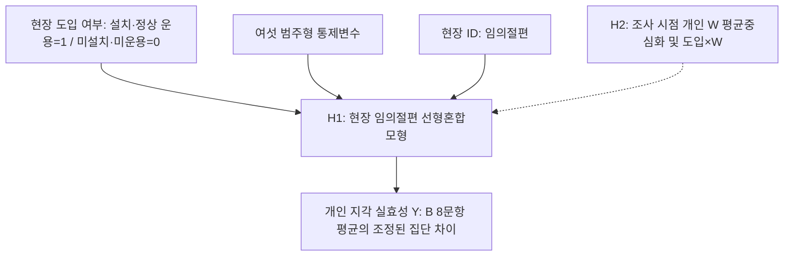

# 제4장 연구설계

## 제1절 연구 모형 설계

본 연구는 YOLO-LLM 하이브리드 안전관제 시스템 도입 현장과 미도입 현장의 안전관리 실효성을 비교하는 데 목적이 있다. 고가 서버와 VMS(Video Management System)에 의존하는 기존 스마트 안전관제 시스템은 안전관리 예산이 제한된 중소규모 현장에서 도입하기 어렵다(이준호, 2024). 본 연구는 일반 사무용 PC와 기존 현장 카메라(ONVIF)로 운용할 수 있는 저비용 시스템을 대안으로 제시하고, 도입·미도입 현장 관리자가 지각한 안전관리 실효성의 차이를 검증한다.

본 연구는 사후 설문 1회로 두 집단을 비교하는 횡단적 준실험 설계를 채택한다. 도입 집단은 한국농어촌공사 경기지역본부 산하 중소규모 건설현장 가운데 조사 전에 시스템 설치와 정상 운용이 모두 확인된 현장으로 구성하고, 미도입 집단은 같은 관할 범위에서 미설치·미운용이 확인된 현장으로 구성한다. 정상 운용 중 알림이 없었던 현장도 도입 집단에 포함한다. 독립변수는 현장 단위 도입 여부이며, 종속변수는 관리자가 지각한 현재 안전관리 업무의 실질적 수행 수준이다.

시스템 도입에 따른 실효성 차이의 가설은 기술수용 연구와 안전관리 업무 지원 기제를 연결하여 설정한다. 기술수용모델은 지각된 유용성과 사용 용이성을 기술수용 및 사용과 연결하며(Davis, 1989), 이동건(2024)과 Chong et al.(2023)은 스마트 안전기술의 수용·채택 의도에 관련된 요인을 제시하였다. 본 연구는 이러한 수용의도 연구가 실제 안전 성과를 직접 입증한다고 해석하지 않는다. 관리자가 지각한 실효성의 집단 차이는 저비용 인프라의 도입 가능성(이준호, 2024)과 위험정보 전달·대응 지원 기제를 바탕으로 별도로 검토한다.

본 연구는 인과관계의 세 조건인 공변성, 시간적 우선성, 외생변수 통제를 각각 어디까지 충족하는지 구분하여 제시한다(Shadish, Cook, & Campbell, 2002). 공변성은 응답자와 현장 특성을 조정한 뒤에도 관리자 개인이 지각한 실효성에 집단 차이가 나타나는지로 확인하며, 이 차이는 현장 임의절편 선형혼합모형으로 검토한다. 시간적 우선성에 대해서는 시스템 운용이 사후 측정보다 앞서도록 한다. 다만 도입 전 실효성을 측정하지 않으므로, 현재 수준이 도입 후에 형성되었는지까지는 확인할 수 없다.

외생변수 통제는 여섯 특성의 조정과 사전 특성 분포·균형 진단으로 구현한다. 소속 구분·성별·연령·경력·직위·현장 공사금액 규모를 범주형 통제변수로 투입하고, 두 집단의 범주별 분포와 공통 관측범위를 확인한다. 비무작위 선정에 따른 편향과 측정하지 않은 교란요인의 영향은 조정 후에도 남을 수 있으므로, 결과는 관리자가 지각한 실효성의 조정된 집단 차이로 해석하며 인과 효과를 단정하지 않는다.

비교 조건의 범위도 미리 한정한다. 미도입 집단에는 CCTV를 운용하는 현장과 운용하지 않는 현장이 함께 포함된다. 따라서 주 비교는 본 시스템을 운용하는 현장과 통상적인 방식으로 안전관리를 수행하는 현장 간에 관리자가 지각한 현재 업무 수준의 차이를 대상으로 한다. 이 차이는 기존 영상 인프라의 기여와 LLM 후단 검증·모바일 알림 등 추가 기능의 기여를 분리한 인과 효과가 아니다. 기존 인프라와 도입 현장의 운용 설정은 조사 명부에 기록하여 분포를 보고하며, 주 모형의 통제변수는 위 여섯 특성으로 유지한다.

이상의 설계를 토대로 연구변수를 구성하면 <표 4-1>과 같다.

<표 4-1> 연구변수의 구성

| 변수 구분 | 변수 및 하위영역 | 구성과 역할 |
|:---:|:---|:---|
| 독립변수 | AI 관제 시스템 도입 여부 | 설치·정상 운용 확인 도입=1, 미설치·미운용 확인 미도입=0 |
| 종속변수 | 안전관리 실효성 | 관리자 개인이 지각한 현재 안전관리 업무 수준. 조기인지, 대응 신속성, 원격 파악, 순찰부담 경감, 위험 통제력의 5개 하위영역 |
| 공변량 | 응답자·현장 특성 | 소속 구분, 성별, 연령, 경력, 직위, 현장 공사금액 규모 |
| 탐색 변수 W | 안전관리 예산 제약성 | 집단×예산 제약성 상호작용의 방향과 효과크기를 검토하는 공통 응답 변수 |
| 참고 변수 | 시스템 특성 인식·경보 피로도 완화 인식 | 주 분석에 투입하지 않고 도입 집단의 기술통계만 보고하는 전용 응답 변수 |

연구 모형은 도입 여부에 따른 두 집단의 안전관리 실효성 조정 평균을 비교하는 단순 모형으로 설정하였다.

주: 화살표는 모형의 분석 관계이며 인과관계 입증을 뜻하지 않는다. 알림 경험은 도입 분류와 별도로 기록한다.

<그림 4-1> 연구 모형

주 분석은 <그림 4-1>의 단순 비교 모형으로 수행하며, 주 결론은 H1의 집단 간 조정 평균 차이를 근거로 도출한다. 예산 제약성과 도입 여부의 상호작용은 H2의 탐색적 보조 분석으로 검토한다. 모집 목표로 정한 120명은 H1과 H2에 충분한 검정력을 확보하는지 아직 검증하지 않은 규모이다. 따라서 유의성 판정보다 효과의 방향과 크기를 중심으로 결과를 보고한다. 다음 절에서는 이 모형에 근거한 연구 문제와 연구 가설을 제시한다.

## 제2절 연구 문제 및 연구 가설

본 연구는 두 집단의 안전관리 실효성 차이를 검증하는 주 연구 문제와 예산 제약성에 따른 차이를 탐색하는 보조 연구 문제를 설정한다. 각 가설은 제2장에서 고찰한 이론과 선행연구를 근거로 방향을 설정하였다.

**1. 연구 문제 1. 시스템 도입에 따른 안전관리 실효성 차이.**

스마트 안전기술은 위험정보의 탐지와 전파를 통해 현장 관리자의 판단과 대응을 지원할 수 있다. 이동건(2024)과 Chong et al.(2023)의 수용·채택 의도 연구는 기술을 받아들이는 조건을 설명하며, 그 자체로 안전 성과의 차이를 입증하지는 않는다. 본 연구는 스마트 건설기술 활용과 성과에 관한 선행연구(황병복, 2026) 및 본 시스템의 저비용 인프라·오탐 필터링·모바일 알림 전파 기제를 바탕으로 도입 현장 관리자가 지각한 실효성이 미도입 현장 관리자가 지각한 수준보다 높을 가능성을 검토한다.

**연구 문제 1. 공변량을 통제한 상태에서 AI 관제 시스템 도입 현장과 미도입 현장의 관리자가 지각한 현재 안전관리 업무 수준(안전관리 실효성)에 차이가 있는가.**

**연구 가설 1(H1). 공변량을 통제한 후, AI 관제 시스템 도입 현장 관리자가 지각한 현재 안전관리 업무 수준(안전관리 실효성)은 미도입 현장 관리자가 지각한 수준보다 높을 것이다.**

H1은 안전관리 실효성 8문항 평균점수의 조정 평균 차이로 검정한다. 비교 대상은 통상적인 방식으로 안전관리를 수행하는 미도입 현장이며, 제1절에서 한정한 대로 기존 인프라와 추가 기능의 기여를 분리하지 않는다. 조기인지·대응 신속성·원격 파악·순찰부담 경감·위험 통제력의 하위영역별 차이는 주가설의 해석을 보완하는 분석으로 제시한다.

**2. 탐색적 연구 문제 2. 안전관리 예산 제약성과 도입 여부의 상호작용.**

자원 제약 환경에서는 저비용 기술이 제공하는 상대적 효익이 크게 인식될 수 있다. 스마트 건설기술 도입 연구는 비용을 주요 도입 제약으로 논의하였으며(Zhou et al., 2023), 중소규모 현장은 산업안전보건관리비 계상 기준과 조직의 지원 여건 때문에 첨단 안전기술 도입에 제약을 받는다(윤영석, 2025; 이준호, 2024). 다만 Zhou 등의 비용 관련 통계 보고에는 내부 불일치가 있으므로 비용 효과의 크기나 유의성을 이 연구로 확정하지 않는다. 이 논의를 바탕으로 조사 시점에 예산 제약을 크게 지각하는 응답자일수록 도입·미도입 집단 간 지각된 안전관리 실효성 차이가 더 클 가능성을 탐색한다.

**연구 문제 2. 조사 시점에 지각한 안전관리 예산 제약성에 따라 도입·미도입 집단 간 지각된 안전관리 실효성 차이가 달라지는가.**

**연구 가설 2(H2). 조사 시점에 안전관리 예산 제약을 크게 지각하는 응답자일수록 도입·미도입 집단 간 지각된 안전관리 실효성 차이가 더 클 것이다.**

H2는 목표 표본의 상호작용 검정력 제약을 고려하여 탐색적으로 다룬다. 따라서 H2의 결과는 주 결론의 근거로 사용하지 않으며, 상호작용의 방향과 효과크기 및 신뢰구간을 중심으로 해석한다.

이상의 연구 가설을 종합하면 <표 4-2>와 같다.

<표 4-2> 연구 가설 종합

| 가설 | 구분 | 가설 내용 | 분석 관계 |
|:---:|:---:|:---|:---:|
| H1 | 주가설 | 공변량을 통제한 후, 도입 현장 관리자가 지각한 현재 안전관리 업무 수준(안전관리 실효성)은 미도입 현장 관리자가 지각한 수준보다 높을 것이다. | 집단 → Y |
| H2 | 탐색적·보조 | 조사 시점에 예산 제약을 크게 지각하는 응답자일수록 도입·미도입 집단 간 지각된 안전관리 실효성 차이가 더 클 것이다. | 집단 × W → Y |

제3절에서는 가설 검정에 사용하는 변수의 조작적 정의와 측정도구의 구성을 제시한다.

## 제3절 변수의 조작적 정의 및 측정도구 구성

### 제1항 변수의 조작적 정의

AI 관제 시스템 도입 여부(D)는 조사 전 설치와 정상 운용이 확인된 현장을 1, 미설치·미운용이 확인된 현장을 0으로 코딩한다. 정상 운용 중 무알림인 현장도 D=1이며, 실제 알림 수신과 응답자의 확인 경험은 별도로 기록한다. 설치했으나 정상 운용 여부를 확인할 수 없거나 중단·장애가 있는 현장은 미도입으로 재분류하지 않고 분류 유보로 기록한다. 도입 현장의 사용 모델·프롬프트·RAG 사용 등 운용 설정은 현장마다 다를 수 있으므로 동일하다고 가정하지 않고 조사 명부에 기록한다. [확정 필요: 최소 운용 기간, 정상 가동 확인 자료·판정 기준, 중단·장애 현장의 포함·제외 기준 및 두 집단 공통 기준기간을 조사 전에 확정]

안전관리 실효성(Y)은 현장 관리자가 지각한 현재 안전관리 업무의 실질적 수행 수준으로 정의한다. 특정 시스템의 기능이나 만족도를 직접 묻지 않는 일반형 B-1∼B-8로 측정하며, 전 문항에 응답한 경우 8문항의 동일 가중 평균을 산출한다. 이 평균점수는 현재 초안의 다섯 업무 영역을 포괄하는 다영역 합성점수이며, 단일 잠재요인으로 검증되었다는 뜻은 아니다.

조기인지·대응 신속성·원격 파악·순찰부담 경감·위험 통제력의 문항 수는 각각 1·1·2·2·2개다. 문항 동일 가중은 각 업무 진술을 같은 비중으로 반영하는 선택이므로 영역 가중치는 각각 12.5%·12.5%·25%·25%·25%가 되어 영역 동일 가중과 다르다. 전문가 내용타당도 검토와 예비조사에서 이 구성의 대표성을 검토하고, 문항 간 관련성과 구조를 확인할 계획이다. 타당도와 집단 간 비교 가능성이 확보되었다고 미리 전제하지 않으며, 채점안은 H1 결과를 보기 전에 고정한다.

안전관리 예산 제약성(W)은 현장이 고가 스마트 안전장비나 관제 시스템을 도입하기에 안전관리 예산이 부족하고, 산업안전보건관리비 또는 본사·발주청 지원만으로 이러한 장비·시스템을 도입하기 어려운 정도로 정의한다. 이 변수는 조사 시점의 개인 지각을 반영한다. C-1∼C-4 전 문항에 응답한 경우 네 문항의 동일 가중 평균으로 점수를 산출하며, 점수가 높을수록 제약을 크게 지각한다는 뜻이다. 이 점수는 현장의 객관적 예산이나 도입 전 조건과 같지 않다. 도입 경험·지원이 사후 인식과 관련될 가능성을 배제할 수 없으므로 W 수준에 따른 조건부 차이를 어느 현장에 먼저 도입할지 정하는 인과적 기준으로 해석하지 않는다. 조작적 정의는 기술 비용을 도입 제약으로 다룬 논의와 중소현장의 산업안전보건관리비 실태에 관한 연구에 근거한다(윤영석, 2025; 이준호, 2024; Zhou et al., 2023).

경보 피로도 완화 인식은 AI 알림의 오탐 필터링으로 잦은 경보 확인에 따른 스트레스와 둔감화 경향이 줄고, 불필요한 확인 시간이 감소하여 핵심 업무에 집중할 수 있다고 인식하는 정도로 정의한다. 이 참고 변수는 실제 알림을 경험한 도입 집단만 응답하며, 피로도 완화 방향으로 측정하여 점수가 높을수록 경보 부담이 낮은 상태를 의미한다. 주 분석에는 투입하지 않고 도입 집단의 기술통계만 보고한다. 이 정의는 알람 피로 이론과 하이브리드 관제 연구에 근거한다(김현수, 2026; Cvach, 2012).

통제변수(공변량)는 소속 구분·성별·연령·경력·직위·현장 공사금액 규모의 여섯 특성이다. 현행 설문은 여섯 통제변수를 모두 범주형으로 측정하므로, jamovi에서는 이를 고정요인으로 지정하고 기준범주 대비 더미변수로 표현한다. 연령·경력·금액의 구간 코드 1∼5를 등간 연속값으로 투입하지 않는다. 경력은 건설현장 안전관리 또는 공사감독 경력으로 통일한다.

소속과 직위, 연령과 경력, 공사금액 규모는 각각 업무·책임 범위, 위험 판단과 업무 경험, 자원·관리 여건에서 나타나는 구성 차이를 조정하기 위해 투입한다. 성별은 응답자 구성 차이를 조정하는 변수로 유지하며 성별 자체의 안전관리 능력 차이를 가정하지 않는다. 이는 연구자의 선정 논리이며, 각 변수가 도입 여부와 Y 양쪽에 관련된다는 선행 근거는 보완이 필요하다[CITE_TODO: 여섯 통제변수별 교란 조정의 이론적 근거 보완]. 조사 시점에 수집한 값이 도입 전에 이미 정해져 있었는지와 그 변경 이력을 명부로 확인하고, 도입 후 값이 바뀌었을 가능성은 잔여 교란 또는 과잉조정의 한계로 보고한다. 통제변수 계수는 주가설의 실질적 성과로 해석하지 않는다.

### 제2항 측정도구의 구성 및 설문 문항 도출 출처

측정도구는 표준화된 기존 척도를 그대로 사용한 것이 아니다. 선행연구의 개념을 근거로 연구자가 작성한 구 설계 문항을 새 비교 설계에 맞게 수정한 연구자 수정·개발 척도이며, 도출 경로는 다음과 같다. 안전관리 실효성 B-1∼B-8은 구 설계의 시스템 귀속형 실효성 8문항을 두 집단이 같은 기준으로 응답할 수 있는 현장 일반형으로 수정한 문항이다. 예산 제약성 C-1∼C-4는 구 예산 제약성 4문항을 바탕으로 하되, 조사 전 표현 점검(2026-09-30)에서 지시어·용어·부정문 표현을 다듬었다. 시스템 특성 인식 D-1∼D-8은 구 시스템 특성 16문항에서 하위특성별 대표 2문항을 선별하여 일부 표현을 다듬었고, 경보 피로도 완화 E-1∼E-4는 구 경보 피로도 4문항을 도입 현장 전용부로 옮기고 응답자가 이해하기 쉬운 표현으로 다듬었다. 따라서 문항의 내용타당도와 집단 간 해석 가능성은 제4절의 절차로 조사 전에 확인해야 한다.

리커트 문항은 모두 1점 ‘전혀 그렇지 않다’부터 5점 ‘매우 그렇다’까지의 5점 척도로 측정한다. 인구통계 문항은 명목척도와 서열척도를 사용하며, 도입 여부는 조사 명부의 설치·정상 운용 확인 결과로 구분한다. 문항은 전문가 내용타당도 검증과 예비조사를 거쳐 최종 확정한다.

<표 4-3> 변수의 조작적 정의와 측정도구의 구성

| 변수명 | 조작적 정의 | 응답 대상 | 문항수 | 측정방법 | 출처 |
|:---|:---|:---:|:---:|:---:|:---|
| AI 관제 시스템 도입 여부 | 조사 전 설치·정상 운용 확인 여부(알림 경험 별도 기록) | 전체 현장 | 1 | 이분형 집단 구분 | 연구설계에 따른 조사 명부 |
| 안전관리 실효성(Y) | 현장 관리자가 지각한 현재 안전관리 업무의 실질적 수행 수준 | 전체 응답자 | 8 | Likert 5점 | (김현수, 2026; 이동건, 2024; Chong et al., 2023) |
| 안전관리 예산 제약성(W) | 조사 시점 개인이 지각한 스마트 안전장비 예산·지원의 제약 정도 | 전체 응답자 | 4 | Likert 5점 | (윤영석, 2025; 이준호, 2024; Zhou et al., 2023) |
| 시스템 특성 인식 | 범용성·안정성·오탐 필터링·알림 전파를 경험한 정도 | 도입 집단 | 8 | Likert 5점 | (류수영, 2023; 이창남, 2025; 이동건, 2024; 김현수, 2026; 국토교통부·국토안전관리원, 2024) |
| 경보 피로도 완화 인식 | 경보 스트레스·둔감화·불필요한 확인 부담이 감소한 정도를 측정하는 참고 척도(도입 집단 전용, 기술통계용) | 도입 집단 | 4 | Likert 5점 | (김현수, 2026; Cvach, 2012) |
| 공변량 | 소속 구분·성별·연령·경력·직위·현장 공사금액 규모 | 전체 응답자 | 6 | 명목·서열 | 연구자 구성 |

주: 출처 열은 조작적 정의의 대표 근거이며, 문항별 전체 근거는 제4절 제2항의 문항표에 제시한다.

제4절에서는 측정도구를 확정하기 위한 조사 절차와 변수별 설문 문항을 제시한다.

## 제4절 설문조사 설계 및 척도 검증

### 제1항 설문조사의 개요 및 절차

본 설문조사는 도입 현장과 미도입 현장의 안전관리 실효성을 동일한 기준으로 측정하기 위한 횡단 조사이다. 모든 응답자는 공통부인 인구통계, 안전관리 실효성, 예산 제약성 문항에 응답하고, 도입 현장 응답자는 시스템 특성 인식과 경보 피로도 문항에 추가로 응답한다. 도입 현장에서는 시스템 운용이 설문 응답보다 앞서도록 조사 시점을 정한다. 두 집단의 공통부 안내는 같은 기준기간의 현장 안전관리 실태·여건을 평가하도록 통일하며, 시스템 경험 안내는 D·E 전용부에만 둔다.

측정도구는 다음의 4단계 절차로 개발하고 검증한다. 이 절차는 두 집단에 적용하는 일반형 실효성 문항의 내용타당도와 집단 간 해석 가능성을 조사 전에 확보하는 데 목적이 있다.

- **1단계. 선행연구 고찰 및 초기 문항 풀 구성.** 제2장의 이론적 배경과 제3절의 조작적 정의를 토대로 변수별 초기 문항 풀을 구성한다. 기존 문항은 새 집단 비교 맥락에 맞게 수정하되 문항별 출처를 유지한다.
- **2단계. 국내 관계 법령 및 건설 실무 지표 매핑.** 초기 문항을 산업안전보건법령의 산업안전보건관리비 기준과 스마트 안전장비 활용 가이드라인 등 국내 제도·실무 지표와 대조하여 현장 용어에 맞게 정비한다(국토교통부·국토안전관리원, 2024).
- **3단계. 전문가 필수성 평정.** 시공사 안전관리 담당자, 발주청 공사감독, 안전보건 전문가와 지도교수로 양 집단의 실무를 대표하는 전문가 집단을 구성한다. 전문가는 리커트 24문항을 각각 ‘필수적’, ‘유용하나 필수적이지 않음’, ‘불필요’로 평정하고, 연구자는 문항별 내용타당도 비율(CVR)을 산출하여 전문가 인원수에 맞는 채택 기준과 비교한다(Lawshe, 1975). 평정과 함께 받은 문구 의견은 표적집단면접에서 검토한다. [확정 필요: 전문가 수·구성과 그 인원수에 따른 CVR 채택 기준] 현 단계에서는 24개 리커트 문항의 번호와 문항 수를 유지하며, 검토 결과에 따른 문항 변경은 별도 이력으로 관리한다.
- **4단계. 인지면접·예비조사 및 채점안 고정.** 도입·미도입 집단별로 소수의 응답자에게 문항을 읽고 이해한 뜻을 말하게 하는 인지면접을 실시한다. 공통부를 시스템 경험이 아닌 담당 현장의 현재 업무 수준으로 이해하는지, B-3의 ‘안전관리 담당자’와 D·E의 비해당 안내를 의도대로 해석하는지 확인한다. 이어 본 조사 대상과 동질적인 응답자 약 30명에게 예비조사를 실시하여 응답 소요 시간, 천장·바닥효과, 문항 변별력, Cronbach's α를 점검한다. α만으로 단일차원성이나 타당도·측정동일성 확보를 선언하지 않는다. 본 조사 자료를 확인하기 전에 최종 문항, Y·W 채점 규칙, 결측·비해당·불성실 응답 기준을 문서로 고정하고 고정일을 기록한다. 고정 후 변경이 필요하면 사유와 시점을 기록하여 결과와 함께 공개한다. [확정 필요: 인지면접 대상 수, 예비조사 일정과 채점안 고정일]

### 제2항 변수별 설문 문항 요약

설문 문항은 전체 응답자가 작성하는 공통부와 도입 현장 응답자만 작성하는 전용부로 구분한다. 근거 열에는 문항의 개념을 도출한 선행연구를 저자·연도로 표기하였다. 문항별 쪽수와 근거 요약은 별도의 근거 매핑 자료로 관리하고 논문 본문에는 수록하지 않는다.

**1. 공통부 A. 인구통계학적 특성 6문항.**

| 구분 | 조사 항목 | 분석 용도 |
|:---:|:---|:---|
| A-1 | 소속 구분 | 범주형 통제변수 및 사전 특성 분포·균형 진단 |
| A-2 | 성별 | 범주형 통제변수 및 사전 특성 분포·균형 진단 |
| A-3 | 연령 | 범주형 통제변수 및 사전 특성 분포·균형 진단 |
| A-4 | 건설현장 안전관리 또는 공사감독 경력 | 범주형 통제변수 및 사전 특성 분포·균형 진단 |
| A-5 | 직위 | 범주형 통제변수 및 사전 특성 분포·균형 진단 |
| A-6 | 현장 공사금액 규모 | 범주형 통제변수 및 사전 특성 분포·균형 진단 |

**2. 공통부 B. 안전관리 실효성 일반형 8문항.**

| 구분 | 문항 | 하위영역 | 근거 |
|:---:|:---|:---:|:---:|
| B-1 | 우리 현장에서는 위험 상황을 조기에 인지한다. | 조기인지 | (김민기·박성호, 2026; 김태헌, 2026) |
| B-2 | 우리 현장에서는 위험 상황을 인지하면 초동 대응을 빠르게 지시한다. | 대응 신속성 | (김민기·박성호, 2026; 김태헌, 2026) |
| B-3 | 우리 현장에서는 안전관리 담당자가 현장 밖에서도 위험 상황을 신속하게 파악한다. | 원격 파악 | (이동건, 2024; 이창남, 2025; Chong et al., 2023) |
| B-4 | 우리 현장에서는 멀리 떨어진 곳에서도 위험 정보와 조치 필요사항을 원활하게 공유한다. | 원격 파악 | (이동건, 2024; 황병복, 2026; Chong et al., 2023) |
| B-5 | 우리 현장에서는 제한된 인력으로도 현장 순찰과 위험 확인 업무를 효율적으로 수행한다. | 순찰부담 경감 | (김용선, 2022; 이창남, 2025) |
| B-6 | 우리 현장에서는 불필요한 확인 업무에 쫓기지 않고 실제 위험 대응에 집중한다. | 순찰부담 경감 | (김현수, 2026; Cvach, 2012; Wu et al., 2025) |
| B-7 | 우리 현장에서는 필요한 경우 시정·작업중지 등 통제 조치를 신속하게 시행한다. | 위험 통제력 | (이동건, 2024; 황병복, 2026; Chong et al., 2023) |
| B-8 | 우리 현장에서는 사고로 이어질 수 있는 위험요인을 실질적으로 통제한다. | 위험 통제력 | (이동건, 2024; 황병복, 2026; Chong et al., 2023) |

주: B-1부터 B-8까지는 기존 시스템 귀속형 Y 문항을 두 집단 공통의 현장 일반형 문항으로 전환한 초안이며, 4단계 척도 검증을 거쳐 확정한다. B-3의 ‘안전관리 담당자’는 선임된 안전관리자에 한정하지 않고, 전담 안전관리자가 없는 현장에서 안전관리 업무를 맡는 사람을 포함한다.

**3. 공통부 C. 안전관리 예산 제약성 4문항.**

| 구분 | 문항 | 근거 |
|:---:|:---|:---:|
| C-1 | 우리 현장은 고가의 스마트 안전장비를 도입하기에는 예산이 부족하다. | (윤영석, 2025; 이준호, 2024; 조도빈, 2026) |
| C-2 | 우리 현장은 스마트 안전장비나 관제 시스템 도입에 쓸 안전관리 예산이 부족하게 편성되어 있다. | (김용선, 2022; 이준호, 2024; Zhou et al., 2023) |
| C-3 | 우리 현장은 산업안전보건관리비 계상 기준만으로는 스마트 안전장비나 관제 시스템을 도입하기 어렵다. | (윤영석, 2025; 조도빈, 2026) |
| C-4 | 우리 현장은 소속 기관인 본사나 발주청으로부터 스마트 안전장비나 관제 시스템 도입 예산을 별도로 지원받기 어렵다. | (윤영석, 2025; 이준호, 2024) |

주: C블록은 두 집단의 현장 여건을 기술하는 공통 문항으로 유지하며, H2의 탐색적 상호작용 분석에 투입한다.

**4. 도입 현장 전용부 D. 시스템 특성 인식 8문항.**

| 구분 | 문항 | 하위특성 | 근거 |
|:---:|:---|:---:|:---:|
| D-1 | 본 시스템은 일반 사무용 PC로 구동되어 고가 AI 서버 등 별도 장비에 대한 투자 부담이 적다. | 인프라 범용성 | (김용선, 2022; 이준호, 2024) |
| D-2 | 본 시스템은 제조사가 다른 기존 현장 카메라와도 호환되어 카메라를 교체하지 않고 도입할 수 있다. | 인프라 범용성 | (국토교통부·국토안전관리원, 2024; 류수영, 2023) |
| D-3 | 본 시스템은 짧은 시간에 알림이 몰려도 같은 알림의 반복 발송을 제한하여 느려지거나 멈추지 않고 안정적으로 작동한다. | 탐지·제어 안정성 | (류수영, 2023; Cvach, 2012) |
| D-4 | 본 시스템은 통신 상태가 좋지 않은 현장에서도 위험 여부를 가려내는 기능이 안정적으로 작동한다. | 탐지·제어 안정성 | (국토교통부·국토안전관리원, 2024; 김용선, 2022) |
| D-5 | 본 시스템은 현장의 나무나 그림자 같은 배경을 사람이나 위험 요소로 잘못 알리는 일이 드물다. | 오탐 필터링 | (김태헌, 2026; Kim et al., 2025; Wu et al., 2025) |
| D-6 | 본 시스템은 촬영 장면 속 작업 상황의 맥락을 파악하여 정상 작업을 위험으로 잘못 알리는 일이 드물다. | 오탐 필터링 | (김현수, 2026; Kim et al., 2025; Wu et al., 2025) |
| D-7 | 위험 상황이 발생하면 위험 요약과 이미지가 모바일 메신저로 신속하게 전달된다. | 알림 전파 즉각성 | (김민기·박성호, 2026; 김태헌, 2026; 이창남, 2025) |
| D-8 | 모바일 메신저로 받은 알림만으로도 현장 상황을 쉽게 파악할 수 있다. | 알림 전파 즉각성 | (이동건, 2024; Chong et al., 2023) |

주: D블록은 독립변수가 아니라 도입 집단의 시스템 경험을 기술하는 참고용 척도이다. 주 분석인 현장 임의절편 선형혼합모형에는 투입하지 않는다. D-6은 LLM이 입력받는 원본 프레임 이미지에 나타난 작업 상황을 범위로 하며 영상의 시간적 전후 관계를 판단한다는 뜻이 아니다. D-7은 알림 전달이 신속하다고 지각한 정도를 묻는 문항으로 실제 지연 시간의 측정치가 아니다.

**5. 도입 현장 전용부 E. 경보 피로도 완화 인식 4문항(참고용 기술 척도).**

| 구분 | 문항 | 근거 |
|:---:|:---|:---:|
| E-1 | 본 시스템이 위험이 아닌 상황을 걸러 주어 잦은 알림 확인에 따른 스트레스가 줄었다. | (김현수, 2026; Cvach, 2012) |
| E-2 | 불필요한 알림을 확인하는 시간이 줄어 핵심 업무에 더 집중하게 되었다. | (김현수, 2026; Cvach, 2012) |
| E-3 | 알림이 오면 ‘또 잘못 온 알림’으로 여겨 무시하기보다 바로 확인하는 경우가 늘었다. | (Cvach, 2012) |
| E-4 | 본 시스템 도입 이후 알림으로 인한 피로감이 줄었다. | (김현수, 2026; Cvach, 2012) |

주: 전용부 E의 E-1∼E-4는 설문지에 유지하되 주 분석에는 투입하지 않으며, 도입 집단의 경보 피로도 완화 인식을 설명하는 기술통계만 보고한다.

### 제3항 본 설문지의 최종 구성

본 설문지는 공통부 18문항과 도입 현장 전용부 12문항으로 구성한다. 미도입 집단은 공통부 18문항에 응답하고, 도입 집단은 현행 초안 기준으로 공통부와 전용부를 합한 30문항에 응답한다. D·E블록은 모두 도입 집단의 참고용 기술 척도로 유지한다. 해당 운용·알림 경험이 없어 판단할 수 없는 문항에는 비해당을 허용하고 일반 무응답 및 0점과 구분한다. D·E의 문항별 응답 수·비해당 수를 보고하며, 비해당 때문에 공통부의 유효 응답을 제외하지 않는다.

<표 4-4> 설문지의 최종 구성

| 구분 | 변수명 | 내용 | 응답 대상 | 문항수 | 문항번호 |
|:---:|:---|:---|:---:|:---:|:---:|
| 공통부 A | 인구통계학적 특성 | 소속·성별·연령·경력·직위·공사금액 규모 | 전체 | 6 | A-1∼A-6 |
| 공통부 B | 안전관리 실효성 | 조기인지·대응 신속성·원격 파악·순찰부담 경감·위험 통제력 | 전체 | 8 | B-1∼B-8 |
| 공통부 C | 안전관리 예산 제약성 | 예산 부족과 제도적·조직적 지원 제약 | 전체 | 4 | C-1∼C-4 |
| **공통부 소계** | | | **전체** | **18** | |
| 전용부 D | 시스템 특성 인식 | 범용성·안정성·오탐 필터링·알림 전파 | 도입 집단 | 8 | D-1∼D-8 |
| 전용부 E | 경보 피로도 완화 인식 | 스트레스·둔감화·확인 부담 완화(참고용 기술 척도) | 도입 집단 | 4 | E-1∼E-4 |
| **전용부 소계** | | | **도입 집단** | **12** | |
| **현행안 합계** | 미도입 집단 18문항, 도입 집단 30문항 | | | **18 또는 30** | |

제5절에서는 이 설문지를 적용할 표본과 자료 수집 방식, 가설 검정 절차를 제시한다.

## 제5절 자료 수집과 분석방법

### 제1항 데이터 수집 표본 설계

본 연구의 모집단은 한국농어촌공사 경기지역본부 산하 중소규모 건설현장에서 안전관리 업무를 수행하는 현장 관리자와 안전관리자이다. 양 집단의 응답자 범위는 시공사 측 현장소장·안전관리자·관리감독자와 발주청 측 공사감독·감리원으로 동일하게 정한다. [확정 필요: 중소규모 현장의 포함·제외 기준과 공사금액 구간의 일치 여부] 서론의 취약 현장 사례를 모집단의 확정 상한으로 삼지 않는다.

비교 대상은 설치·정상 운용 확인 도입 현장 30개소와 미설치·미운용 확인 미도입 현장 30개소, 총 60개소로 계획한다. 같은 관할 범위에서 공사금액 규모와 주요 특성이 유사한 현장을 우선 확보하되 무작위 배정을 전제하지 않는다. [확정 필요: 도입·미도입 현장의 구체적 추출 절차, 규모 매칭 여부와 기준] 선정 과정과 집단 간 분포 차이는 제5장에 공개한다.

도입 현장의 후보 명부는 경기지역본부 안전관제 시스템의 카메라 등록 백업 자료를 근거로 작성한다. 사업 식별값이 있는 카메라 107대는 89개 사업에 대응하며, 식별값이 없는 나머지 1대도 별도 현장으로 확인되어 등록 규모는 총 90개소·108대이다. 현장별 등록 대수는 1대가 77개소, 2대가 8개소, 3대가 5개소이다. [확정 필요: 등록 현장과 분석 현장 단위의 대응 기준]

108대 모두 카메라별 원격 알림 허용 항목이 활성으로 기록되어 있다. 그러나 이는 허용 설정일 뿐 정상 운용, 실제 알림 수신, 탐지 추론, LLM·RAG 활성화를 보여 주는 증거는 아니다. 사용 모델·활성 탐지 클래스·프롬프트·RAG·쿨다운 설정은 운용 PC에 별도로 저장되어 이 백업으로 확인할 수 없으므로, 명부의 운용 조건은 도입 현장별로 따로 확인한다.

따라서 등록된 90개소는 조사 후보의 범위이며 모집 목표나 분석 표본이 아니다. 등록 현장과 분석 현장 단위의 대응, 정상 운용, 규모 요건을 확인한 현장에서 도입 표본을 선정하며, 모집 목표는 위의 30개소를 유지한다.

표본은 현장당 2명, 집단별 60명, 총 120명 모집을 목표로 한다. 120명은 검정력 충분성을 검증한 결과가 아니다. 범주형 코딩의 실제 계수 수, 집단별 현장 수와 군집 크기, 최소 관심 효과크기, ICC 및 탈락·결측을 반영한 H1 검정력 또는 검출가능 효과 산정이 필요하며 H2 충분성도 미검증이다. [UNVERIFIED: H1·H2의 효과크기·유의수준·목표 검정력·ICC·탈락 가정과 군집 설계를 반영한 산정 결과 미확보] 개인 수만으로 표본의 충분성을 단정하지 않는다.

조사 명부는 현장 ID, 설치 여부, 가동 시작일·기간, 정상 가동 확인, 실제 알림 수신 이력, 응답자의 확인 경험, 중단·장애 이력을 구분하여 관리한다. 배포코드를 현장 ID에 연결하고 응답자료에는 개인 식별정보 대신 분석용 코드를 사용한다. 명부와 응답자료의 접근을 분리하며, 동일인이 여러 현장에 중복 응답하지 않도록 사전에 담당 현장 하나를 지정한다. 현장별 두 응답자의 직무·선정 과정을 기록하여 편의 선정의 범위를 보고한다.

미도입 집단에 CCTV가 없는 현장도 포함되므로 명부에는 비교 조건을 함께 기록한다. 모든 현장에 대해 기존 CCTV 보유 여부와 대수, 원격 열람 가능 여부, 다른 스마트 안전장비 사용 여부, 공종을 기록하고, 확인이 가능한 경우 안전관리 담당 인력의 배치 형태도 기록한다. 도입 현장에는 사용 모델, 프롬프트 판본, RAG 사용 여부, 활성 탐지 클래스, 알림 채널, 쿨다운 설정과 운용 기간을 추가로 기록한다. 이 기록은 CCTV 유무에 따른 모집 제외나 주 모형의 공변량 추가에 사용하지 않는다. [확정 필요: 인프라·운용 조건의 보고 형식과 해석 범위, 설정 확인에 쓸 지원 자료, 추가 분석 수행 여부를 H1 결과 확인 전에 확정]

연구자는 비교 대상 시스템의 개발자이자 현장 관리에 관여하는 위치에 있으므로, 응답자가 연구자와의 관계를 의식하여 응답할 가능성이 있다. 이를 줄이기 위해 설문 안내문에 연구 목적과 연구자의 역할을 밝히고, 참여가 자발적이며 언제든 응답을 중단할 수 있고 개별 응답을 소속 기관·현장 관계자에게 공개하지 않는다는 점을 안내한다. 설문지의 배포와 회수는 분리하여 연구자가 개별 응답지를 응답자와 직접 대조하지 않도록 계획한다. 다만 명부의 현장 ID와 인구통계 문항이 있으므로 완전한 익명성을 보장한다고 표현하지 않는다. [확정 필요: 배포·회수 담당 주체와 회수 방식, 소속 기관의 연구윤리 심의 대상 여부 확인]

자료 수집은 2026년 하반기 사후 설문 1회로 계획하며 대면·온라인 조사를 병행한다. [확정 필요: 설문 실시 월, 두 집단 공통 기준기간, 도입 현장 최소 운용 기간] 알림 수신 여부는 조사 참여 조건으로 사용하지 않는다. 정상 운용을 확인할 수 없는 현장은 분류 유보 상태와 그 사유를 남기고, 조사 전 확정한 운용 판정 규칙에 따라 분석 포함 여부를 결정한다.

<표 4-5> 자료 수집 개요

| 구분 | 내용 |
|:---:|:---|
| 모집단 | 한국농어촌공사 경기지역본부 산하 중소규모 건설현장의 현장 관리자·안전관리자(규모 기준 확정 필요) |
| 비교 집단 | 설치·정상 운용 확인 도입 30현장과 미설치·미운용 확인 미도입 30현장, 총 60현장 |
| 선정 기준 | 동일 관할의 주요 특성 유사 현장 우선 확보, 구체적 추출·매칭 절차 확정 필요 |
| 도입 후보 명부 | 카메라 등록 백업 자료와 식별값 없는 1대의 별도 현장 확인으로 파악한 등록 90개소·108대, 모집 목표가 아닌 후보 범위이며 현장 대응·정상 운용·규모 요건 확인 후 도입 표본 선정 |
| 응답자 기준 | 양 집단 동일 직무 범위, 현장당 2명·개인 중복 응답 방지, 알림 경험 별도 기록 |
| 비교 조건 기록 | 전 현장의 기존 CCTV 보유·대수, 원격 열람, 다른 스마트 안전장비, 공종, 가능한 경우 안전관리 담당 인력; 도입 현장의 모델·프롬프트·RAG·활성 클래스·알림 채널·쿨다운·운용 기간 |
| 조사 설계 | 사후 설문 1회의 횡단적 두 집단 비교 준실험 설계 |
| 조사 방식 | 현장 방문 대면 조사와 온라인 설문 병행 |
| 조사 시기 | 2026년 하반기 [확정 필요: 설문 실시 월·공통 기준기간·최소 운용 기간] |
| 목표 표본 | 현장당 2명, 집단별 응답 60건, 총 120부(검정력 충분성 미검증) |
| 분석 단위 | 개인 응답자, 현장 ID를 군집으로 하는 현장 임의절편 선형혼합모형 |

### 제2항 분석 절차

본 연구는 예비조사, 본 조사, 자료 정제·채점, 사전 특성 분포·균형 진단, 혼합모형 가정 점검, 가설 검정 순으로 분석한다. jamovi와 GAMLj의 선형혼합모형을 사용하며 현장 ID를 군집 변수, 현장 임의절편을 임의효과로 지정한다. GAMLj가 혼합모형을 지원한다는 서술은 공식 문서에 근거하며, 실제 설치나 분석 완료를 뜻하지 않는다([GAMLj Mixed Models 공식 문서](https://gamlj.github.io/mixed.html)). 공식 문서에서 지원하는 제한최대우도(REML) 추정과 Satterthwaite 분모 자유도 방식을 H1·영역별 보조 분석·H2에 적용할 계획이다. [확정 필요: 실제 jamovi·GAMLj 버전, REML·Satterthwaite 옵션 적용·저장, 검정통계량·신뢰구간 방식 및 조정 평균 산출 옵션을 설치 환경에서 확인하고 분석 전에 기록] 실제 자유도 수치와 분석 성공 여부는 실행 근거 없이 확정하지 않는다.

**1. 자료 정제·채점과 결측 처리.** B 8문항과 C 4문항에서는 각 척도의 모든 문항에 응답한 경우에만 채점하는 것을 기본 규칙으로 하며, 두 척도의 평균점수를 각각 Y와 W로 산출한다. 일부 문항에 응답하지 않은 경우, 그 결측을 응답한 문항만의 평균이나 0점으로 임의 대체하지 않는다. H1은 Y·도입 여부·현장 ID·여섯 통제변수가 완전한 사례, H2는 추가로 W가 완전한 사례를 사용한다. 영역별 보조 분석은 해당 영역 전 문항과 모형 변수가 완전한 사례를 사용하여 분석별 개인 수·현장 수·자유도를 별도 보고한다.

일반 무응답, 설계상 비해당, 경험 부재의 비해당을 구분한다. D·E는 주 분석에 투입하지 않으며, 전용부의 비해당을 불성실 응답으로 판정하지 않는다. 일렬응답만으로 자동 제외하지 않고 응답 패턴·소요시간·누락 양상을 함께 검토한다. [확정 필요: 예비조사 후 집단별 설문 길이와 대면·온라인 방식 차이를 반영한 불성실 응답 기준을 본 조사 전에 확정] 문항·변수별 결측률, 집단별 제외 사유와 손실, 제외 전후 특성을 보고한다. 완전사례 분석의 선택 편향을 점검하고, 결측 정도·양상에 따른 민감도 분석의 필요성과 방법은 그 가정·근거를 기록하여 결정한다. 근거 없는 결측 임계값이나 대체 규칙을 적용하지 않는다.

**2. 기술통계와 측정도구 점검.** 집단별 문항 분포, Y·W의 평균·표준편차·왜도·첨도, 문항 간 관련성을 보고한다. Y·W의 Cronbach's α는 전체 및 집단별 내적 일관성 정보로 사용한다. 단일 문항 영역인 조기인지와 대응 신속성은 α를 산출하지 않고, 2문항인 원격 파악·순찰부담 경감·위험 통제력 세 영역은 문항 간 상관 등 짧은 척도의 정보를 함께 제시한다. α로 단일차원성이나 타당도의 증거를 대신하지 않는다. [확정 필요: 구조 확인을 위한 탐색적 요인분석의 적용 가능성, 추출·회전·요인 수 결정 기준을 표본·문항 구조에 맞게 사전 확정] 두 집단 인지면접과 내용타당도 검토를 함께 보고하며 통계적 측정동일성을 확인하지 못하면 그 한계를 명시한다.

**3. 범주형 코딩과 조정 변수.** 여섯 특성을 유의확률에 따른 변수선택 없이 사전 지정 고정요인으로 포함한다. 기준범주는 현행 설문의 첫 범주인 소속=시공사, 성별=남성, 연령=20대, 경력=3년 미만, 직위=공사감독, 공사금액=20억 원 미만으로 둔다. 이는 계수 표현의 기준이며 우열을 뜻하지 않는다. 금액 구간 확정 후 해당 기준도 확인하고, 기준범주가 관측되지 않으면 대체 기준과 사유를 분석 전에 기록한다.

범주 수가 K인 요인은 기준범주를 제외한 K−1개 더미로 표현한다. 현행 모든 범주가 관측되고 독립적으로 식별될 때 도입 계수를 포함한 절편 제외 고정효과 계수는 18개이며, 실제 계수 수는 자료에서 관측된 범주와 설계행렬의 계수(rank)로 확인해야 한다. 소속×직위와 연령×경력의 중복, 희소범주 및 공선성을 점검한다. 추정 불가능한 범주는 의미상 통합 가능성과 식별 여부를 먼저 검토하고 처리 이유를 기록하며, p값을 낮추기 위한 삭제·통합은 하지 않는다. 현장 ID는 모든 현장의 고정 더미로 추가하지 않는다.

**4. 사전 특성 분포·균형 진단.** 범주별 빈도·백분율, 집단 간 비율 차이와 표준화 차이, 공통 관측범위를 제시한다. 현장 공사금액 등 현장 특성은 현장당 한 번 집계하여 동일 현장 두 응답을 독립 현장처럼 중복 검정하지 않는다. 개인 특성은 응답자 단위로 기술하되 현장 군집을 고려하여 해석한다. 비유의한 검정을 동질성 확보의 증거로 사용하지 않으며, 현행 범주 코드를 연속값으로 간주한 t 검정도 적용하지 않는다. 분포가 충분히 겹치지 않는 범주에서는 조정 비교에 외삽 위험이 있음을 명시한다. 명부에 기록한 인프라·운용 조건은 현장 단위로 집단별 분포를 기술하되 주 모형에 투입하지 않는다.

**5. H1의 현장 임의절편 선형혼합모형.** 현장 j의 응답자 i에 대해 다음의 평균·오차 구조를 사용한다.

Y_ij = β₀ + β_D D_j + Σ β_k X_kij + u_j + ε_ij

D_j는 도입=1·미도입=0, X_kij는 여섯 특성의 더미들, u_j는 현장 임의절편, ε_ij는 개인 잔차이다. 현장 금액 더미는 같은 현장의 응답자에게 동일하게 연결한다. 기본 모형에서는 u_j와 ε_ij가 평균이 0이고 분산이 각각 τ²(현장 분산)와 σ²(잔차 분산)인 정규분포를 따른다고 설정한다. 서로 다른 현장의 오차는 독립이고, 같은 현장의 두 응답은 공유 임의절편을 통해 상관되며 임의절편 조건부 잔차는 독립이라고 가정한다. 임의절편과 포함 설명변수 간 독립 가정도 검토하며, 임의절편이 미측정 현장 교란을 자동 제거한다고 해석하지 않는다.

현장별 응답 수와 군집 크기 분포, 현장·잔차 분산 및 ICC=τ²/(τ²+σ²)를 보고한다. 평균구조의 적합성, 집단별 잔차 분포·등분산성·정규성, 현장 임의효과 분포, 개인·현장 영향점, 수렴과 특이적합을 점검한다. H2에서는 W와 결과의 선형 관계 및 상호작용 적합성도 확인한다. [확정 필요: 가정 위반·수렴 실패·특이적합 시 군집 구조를 유지하는 대안과 민감도 분석의 구현 옵션을 분석 전에 확정] 진단 실패에 유의수준을 임의로 낮추는 방식으로 대응하지 않으며, 실패가 해결되지 않으면 주 분석의 추론 한계를 보고한다.

H1은 β_D의 부호와 조정 평균 차이로 판단한다. 집단별 조정 평균, 도입−미도입 차이, 비표준화 B·SE·95% 신뢰구간·검정통계량·자유도·p, 분석 개인 수·현장 수 및 두 분산 성분을 보고한다. 방향 가설과 함께 양측 95% 신뢰구간을 제시하며 유의수준은 위 사전 분석 설정에서 확정한다. 조정 평균은 현장 임의효과를 평균 0으로 둔 고정효과 예측에 근거하고, 양 집단에 동일한 범주형 요인 기준분포·가중 방식을 적용한다. [확정 필요: GAMLj의 주변평균 가중 옵션과 공통 기준분포의 실제 구현·기록] 혼합모형의 추론값을 개인 수 기준 잔차 자유도나 일반 분산분석의 SS·MS·부분 η²로 대신하지 않는다.

**6. 다섯 영역의 보조 비교.** 조기인지=B-1, 대응 신속성=B-2, 원격 파악=(B-3+B-4)/2, 순찰부담 경감=(B-5+B-6)/2, 위험 통제력=(B-7+B-8)/2로 채점한다. 각 영역에 H1과 같은 고정효과·현장 임의절편 구조를 적용한다. 다섯 영역의 집단효과 p값을 하나의 검정군으로 지정하여 Holm 보정을 적용하고, 비보정·보정 p와 추정 차이·95% 신뢰구간·분석별 n·현장 수·자유도를 보고한다. 이 신뢰구간은 개별 비교의 비보정 구간임을 명시한다. 단일 주가설 H1과 탐색적 H2는 이 다섯 검정의 보정군에 혼합하지 않는다.

**7. H2의 탐색적 상호작용.** H2 완전사례 전체의 W 평균으로 W를 평균중심화하여 W_cij를 만들고 그 평균값을 기록한다. H1과 동일한 현장 임의절편 및 여섯 특성에 D_j, W_cij와 D_j×W_cij를 함께 포함한다.

Y_ij = β₀ + β_D D_j + β_W W_cij + β_DW(D_j×W_cij) + Σ β_k X_kij + u_j + ε_ij

상호작용 항에 대해서는 부호를 포함한 B=β_DW와 SE·95% 신뢰구간·검정통계량·자유도·p를 함께 보고한다. W_c=w에서 도입−미도입 조건부 차이는 β_D+β_DW w로 표현한다. 평균 및 평균±1표준편차의 조건부 비교는 양 집단의 공통 관측범위 안에 있는 수준에만 제시하며, 범위를 벗어나면 그 수준은 제외하고 사용한 W값을 명시한다. F만으로 방향을 판정하거나 비유의를 차이 없음으로 확정하지 않는다. 이 분석이 보여 주는 것은 사후에 측정한 개인 지각 W에 따른 차이이다. 따라서 이를 객관적 현장 예산 효과나 현장 내·현장 간 조절효과를 각각 식별한 결과로 해석하지 않는다. 검정력이 검증되지 않았음을 밝히고 신뢰구간을 중심으로 탐색적으로 보고하며, 정책 우선배치 규칙을 도출하지 않는다.

이상의 연구 모형, 측정도구, 표본 설계와 분석 절차에 따라 제5장에서는 조사 대상의 특성과 측정도구 점검, 사전 특성 분포·균형 진단 및 혼합모형 가정 점검을 제시한 뒤 H1의 조정된 집단 차이와 다섯 영역의 보조 결과, H2의 탐색적 상호작용을 보고한다.
