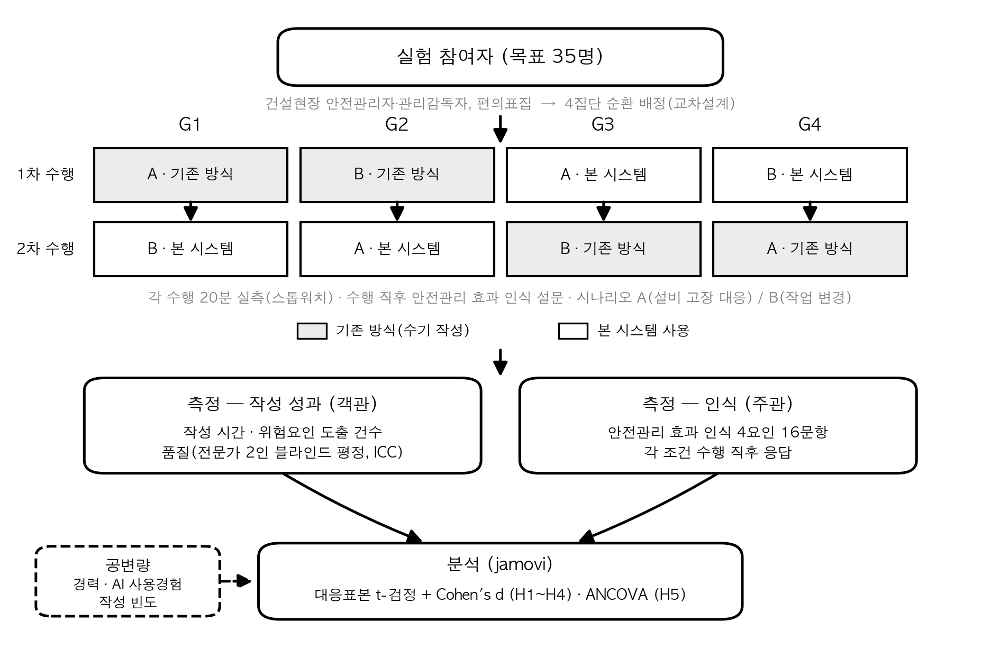

<!-- 제4장 연구설계: 실험 기반 효과성 검증 설계(대응표본 2조건×시나리오 2종 교차) -->

# 제4장 연구설계

본 장은 제3장에서 개발한 건설현장 불시·단발성 작업 위험성평가 AI 자동생성 시스템(이하 "본 시스템")의 효과성을 실험으로 검증하기 위한 연구설계를 제시한다. 본 연구는 동일 참여자가 기존 방식과 본 시스템 사용의 두 조건에서 각각 위험성평가서를 작성하게 하고, 조건 간 작성 성과와 안전관리 효과 인식의 차이를 검정하는 유사실험 설계를 채택한다. 이하에서 연구모형과 가설, 실험설계, 실험 대상과 표본, 실험 과제와 절차, 측정도구, 분석방법을 순서대로 기술한다.

---

## 제 1 절 연구모형 및 가설

> [작성 가이드] 이 절은 실험 조건을 처치로 하는 연구모형을 제시하고 H1~H6을 진술한 뒤, 각 가설의 논거를 제3장 시스템 특성과 제2장 이론적 배경에서 끌어온다. 주 주장이 작성 성과(H1~H3)이고 안전관리 효과(H4)는 인식 수준에 한정된다는 점을 명시한다. 심사위원 예상 질문은 "왜 설문이 아니라 실험인가", "인식 측정만으로 안전관리 효과를 주장할 수 있는가", "개인 특성을 왜 통제변수가 아니라 조절변수로 두었는가"이다.

본 연구의 연구모형은 다음과 같다. 동일 참여자가 두 조건(기존 방식 / 본 시스템 사용)에서 불시·단발성 작업 위험성평가서를 각각 작성하고, 조건 간 작성 성과와 안전관리 효과 인식의 차이를 검정한다. 여기에 더해 조건의 효과 크기가 참여자의 개인 특성과 참여 현장의 특성에 따라 달라지는지를 조절효과로 확인한다.

이 모형에서 독립변수는 작성 조건이라는 처치이고, 종속변수는 조건별로 산출된 작성 성과 3종(작성 소요시간, 위험요인 도출 건수, 평가서 품질)과 안전관리 효과 인식이다. 참여자가 두 조건을 모두 수행하므로 개인 역량의 차이는 설계 단계에서 이미 제거된다.

개인 특성과 현장 특성은 통제변수가 아니라 조절변수로 둔다. 같은 사람이 두 조건을 모두 수행하는 피험자 내 설계에서는 개인 수준의 특성이 조건 간 차이값을 구하는 과정에서 소거되므로, 그 특성을 공변량으로 투입하여 통제하더라도 조건 효과의 점추정치는 달라지지 않는다. 통제 후에도 효과가 유지되는지를 묻는 물음은 이 설계에서 동어반복이 된다. 따라서 본 연구는 물음을 바꾸어, 효과가 있는지가 아니라 효과의 크기가 누구에게서 그리고 어떤 현장에서 더 크게 나타나는지를 확인한다. 이것이 인과관계 성립의 세 번째 조건인 통제를 포기한다는 뜻은 아니다. 통제는 동일인 반복측정이라는 설계 자체로 충족하며, 조절효과는 그 위에서 효과의 경계 조건을 밝히는 별도의 물음이다.

**<그림 4-1> 실험설계 모형**

연구가설은 다음과 같다.

> H1. 본 시스템을 사용하면 기존 방식보다 불시·단발성 작업 위험성평가서 작성 시간이 단축될 것이다.
> H2. 본 시스템을 사용하면 기존 방식보다 도출되는 위험요인의 수가 증가할 것이다.
> H3. 본 시스템을 사용하면 기존 방식보다 위험성평가서의 품질이 향상될 것이다.
> H4. 본 시스템을 사용할 때 기존 방식보다 안전관리 효과 인식이 높게 나타날 것이다.
> H5. 본 시스템 사용의 효과 크기는 참여자의 개인 특성(직책, 안전관리 경력, AI·생성형 도구 사용경험)에 따라 달라질 것이다.
> H6. 본 시스템 사용의 효과 크기는 참여 현장의 특성(안전관리자 배치 유무)에 따라 달라질 것이다.

**H1의 논거.** 불시·단발성 작업은 사전 공정계획에 포함되지 않아 준비된 평가서가 없는 상태에서 평가서를 새로 작성해야 하므로, 작성에 드는 시간이 곧 착수 지연으로 이어진다. 제3장에서 본 시스템은 작업 정보를 입력하면 검색 증강 생성을 거쳐 위험요인과 감소대책 초안을 즉시 산출하도록 구현되었다. 작성자가 백지에서 항목을 구성하는 대신 산출된 초안을 검토·수정하는 작업으로 전환되므로, 조건 간 작성 시간에 차이가 나타날 것으로 예상한다.

**H2의 논거.** 위험요인 도출의 폭은 작성자가 기억에서 인출할 수 있는 위험 유형의 범위에 좌우된다. 제3장에서 본 시스템은 법령·지침과 재해사례를 지식베이스로 검색해 유사 작업의 위험요인을 함께 제시하도록 설계되었다. 작성자가 개인 경험만으로 떠올리기 어려운 위험요인이 후보로 노출되므로, 시스템 사용 조건에서 도출 건수가 증가할 것으로 예상한다.

**H3의 논거.** 평가서의 품질은 위험요인이 작업 실태에 맞게 특정되었는지, 감소대책이 실행 가능한지, 법규·기준에 부합하는지, 양식이 완결되었는지로 판단할 수 있다. 제3장에서 본 시스템은 근거 조문과 양식 구조를 함께 산출하도록 구성되었으므로, 작성자가 개별적으로 법규를 확인하고 양식을 채우는 부담이 줄어든다. 이에 시스템 사용 조건에서 품질 평정 점수가 높게 나타날 것으로 예상한다.

**H4의 논거.** 안전관리 효과 인식은 사고예방 효과, 위험인지 향상, 안전행동 개선, 관리효율성 향상의 네 요인으로 구성되며, 이는 제2장 제3절 제2항에서 검토한 안전 성과 인식 측정의 계보를 따른다. 작성 과정에서 위험요인을 폭넓게 확인하고 근거를 함께 제시받은 경험은 위험 인지와 관리 효율에 대한 지각을 높일 수 있다. 다만 인식은 실제 안전 성과와 구별되는 층위이므로, 본 가설은 지각 수준의 차이에 한정해 설정한다.

**H5의 논거.** 시스템이 주는 이득의 크기는 작성자가 원래 갖고 있던 역량에 따라 다를 수 있다. 위험성평가 작성에 익숙하지 않거나 안전관리 경력이 짧은 작성자는 백지에서 항목을 구성하는 부담이 크므로 초안 제공에서 얻는 이득이 클 수 있는 반면, 숙련된 작성자는 이미 자신의 절차를 갖추고 있어 이득이 작을 수 있다. 생성형 도구 사용경험도 같은 방향으로 작동할 수 있다. 도구에 익숙한 참여자는 산출된 초안을 빠르게 검토·수정하는 반면, 처음 접하는 참여자는 도구 조작 자체에 시간을 쓸 수 있다. 직책 또한 평가서 작성의 책임 범위와 숙련도를 가르는 지표가 된다. 이에 조건 간 차이값을 종속변수로 두고 직책을 요인으로, 안전관리 경력과 AI·생성형 도구 사용경험을 공변량으로 투입하여 효과 크기의 차이를 확인한다.

**H6의 논거.** 같은 시스템이라도 현장의 안전관리 여건에 따라 체감 이득이 다를 수 있다. 안전관리자가 배치된 현장은 위험성평가 절차와 서식이 이미 정비되어 있어 작성자가 참고할 기준이 존재하는 반면, 배치되지 않은 현장은 작성자가 절차와 내용을 스스로 구성해야 한다. 따라서 시스템이 제공하는 근거 조문과 양식 구조의 효용은 배치되지 않은 현장에서 더 클 것으로 예상한다. 본 연구는 현장당 2~3명씩 다수 현장에서 참여자를 모집하므로, 현장 수준 특성이 효과 크기를 가르는지를 검토할 수 있다. 다만 참여자가 같은 현장에 속한 데서 오는 군집 구조를 고려하여, H6은 현장별 차이값 평균을 사례로 두고 현장을 분석 단위로 검정한다(제6절 참조).

효과의 층위를 분명히 해 둔다. 본 연구의 주 주장은 작성 성과(H1~H3)다. 안전관리 효과(H4)는 인식 수준에서 확인하는 것으로 한정하며, 실제 사고 감소는 본 설계로 검증할 수 없다. 이 한계는 제6장 제3절에서 다시 다룬다.

---

## 제 2 절 실험설계

> [작성 가이드] 이 절은 대응표본(피험자 내) 설계를 택한 이유, 조건과 시나리오를 교차한 배정 방식, 순서·학습효과의 통제 논리, 기대 편향 방지책을 제시한다. 심사위원 예상 질문은 "왜 대응표본인가", "순서효과는 어떻게 통제했나", "참여자가 연구 목적을 알고 시스템에 유리하게 응답한 것은 아닌가"이다.

본 연구는 대응표본(피험자 내) 2조건 × 시나리오 2종 교차 설계를 채택한다. 각 참여자는 기존 방식과 본 시스템 사용의 두 조건을 모두 수행하며, 두 조건에서 서로 다른 시나리오를 배정받는다.

대응표본 설계를 택한 이유는 세 가지다. 첫째, 위험성평가서 작성 성과는 작성자의 경력과 문서 작성 역량에 크게 좌우되는데, 같은 사람을 두 조건에서 관찰하면 이 개인차가 설계 단계에서 제거된다. 둘째, 동일한 표본 규모에서 피험자 간 설계보다 높은 검정력을 확보할 수 있어, 현장 실무자를 모집해야 하는 본 연구의 조건에 적합하다. 셋째, 건설현장 안전관리자·관리감독자 중 실험 참여가 가능한 인원이 제한적이므로, 두 집단을 각각 확보하는 방식은 현실적으로 어렵다.

동일 참여자가 두 조건을 수행하면 앞선 수행이 뒤따르는 수행에 영향을 주는 순서효과와, 같은 시나리오를 반복하며 익숙해지는 학습효과가 발생할 수 있다. 본 연구는 두 가지 장치로 이를 통제한다. 첫째, 조건 수행 순서를 균형 배치(counterbalancing)하여 참여자의 절반은 기존 방식을 먼저, 나머지 절반은 시스템 사용을 먼저 수행하게 한다. 둘째, 두 조건에 서로 다른 시나리오를 배정하여 동일 과제의 반복 수행을 차단한다. 조건과 시나리오, 수행 순서를 교차하면 <표 4-1>의 4개 집단이 구성된다.

**<표 4-1> 실험 조건 배정**

| 집단 | 1차 | 2차 |
|---|---|---|
| G1 | A-기존 | B-시스템 |
| G2 | B-기존 | A-시스템 |
| G3 | A-시스템 | B-기존 |
| G4 | B-시스템 | A-기존 |

참여자는 4개 집단에 각 8~10명씩 배정한다. 이 배정에서 시나리오 A와 B는 각 조건에 동일한 빈도로 나타나고, 시스템 사용 조건도 1차와 2차에 동일한 빈도로 나타난다. 따라서 조건의 효과가 특정 시나리오의 난이도나 특정 수행 순서에 실려 나타나는 문제를 배정 단계에서 상쇄한다. 잔여 효과는 제6절의 혼합 반복측정 분석으로 사후 점검한다.

기대 편향도 통제한다. 참여자에게는 연구 목적을 "작성 방식 두 가지의 비교"로만 안내하고, 본 시스템의 우수성을 검증한다는 취지는 사전에 밝히지 않는다. 안내문과 동의서에도 동일한 표현을 사용하여, 참여자가 특정 조건에 유리하게 응답할 유인을 줄인다.

---

## 제 3 절 실험 대상 및 표본

> [작성 가이드] 이 절은 참여 요건, 표본 규모와 산정 근거, 다현장 모집 방식, 표집 방법의 한계, 연구윤리 절차를 제시한다. 심사위원 예상 질문은 "표본 52명으로 충분한가", "다중검정을 보정하고도 검정력이 확보되는가", "편의표집의 대표성 문제를 어떻게 다루는가", "한 현장에서 여러 명을 뽑았는데 군집효과는 어떻게 처리했는가", "IRB 심의는 받았는가"이다. 규모 산정의 산출값과 IRB 해당 여부는 [확정 필요] 상태다.

실험 참여자는 건설현장의 안전관리자와 관리감독자로서 위험성평가서 작성 경험이 있는 자로 한정한다. 위험성평가서 작성 경험을 요건으로 두는 이유는, 기존 방식 조건이 참여자의 통상적 작성 절차를 재현하는 것을 전제로 하기 때문이다. 작성 경험이 없는 참여자는 기존 방식 조건에서 과제를 수행하지 못하므로 조건 간 비교가 성립하지 않는다.

표본 규모는 최소 52명으로 설정한다. 산정 근거는 다음과 같다. 본 연구는 H1~H3의 세 가설을 같은 표본에서 함께 검정하므로 다중검정에 따른 제1종 오류 팽창을 Holm 절차로 보정한다(제6절 참조). 보정을 적용하면 개별 검정에 요구되는 유의수준이 낮아져 필요한 표본이 늘어나므로, 보정 전 기준이 아니라 보정 후 기준으로 규모를 산정하였다. 대응표본 t-검정을 기준으로 양측 유의수준 .05, 검정력 .80을 두고 Holm 보정 후에도 d ≈ 0.45의 효과를 감지할 수 있는 규모가 52명이다. 기준 효과크기를 d = 0.45로 둔 것은 Cohen(1988)의 해석 관례(d ≈ .20 작음, .50 중간, .80 큼)에서 중간 효과에 조금 못 미치는 보수적 값을 택한 것으로, 실제 효과가 중간 수준이라면 검정력에 여유가 생긴다. 중도 이탈과 불성실 응답을 감안하여 모집 인원은 이보다 여유 있게 확보한다. 검정력 분석은 G*Power를 사용한다(Faul, Erdfelder, Lang, & Buchner, 2007). G*Power를 이용한 정확한 산출값과 그 출력 결과는 [확정 필요]이다.

참여자는 다수 현장에서 나누어 모집한다. 한 현장에서 52명을 확보하는 것은 현실적으로 어렵고, 한 현장에 표본이 몰리면 그 현장의 고유한 안전관리 여건이 결과 전체에 섞여 들어간다. 이에 현장당 2~3명씩 모집하며, 이 경우 참여 현장은 17~26곳이 된다. 다현장 모집은 결과의 적용 범위를 넓히는 동시에, 현장 특성이 효과 크기를 가르는지를 검토할 수 있게 한다(H6). 다만 같은 현장에 속한 참여자들의 응답이 서로 닮는 군집 구조가 생기므로, 현장 수준 가설인 H6은 현장별 차이값 평균을 사례로 두어 군집을 제거한 뒤 검정한다(제6절 참조).

집단 배정은 현장 순회 순서에 따라 G1~G4를 순환 배정한다. 현장당 참여자가 2~3명이므로 한 현장에서 네 집단을 모두 채울 수 없고, 이를 방치하면 현장과 배정 집단이 얽혀 조건 효과와 현장 효과가 분리되지 않는다. 배정표는 현장 방문 전에 확정하며, 현장에서 즉흥적으로 배정하지 않는다.

표집은 편의표집으로 한다. 본 시스템을 실험 환경에서 사용할 수 있고 지정된 시간에 대면 세션에 참여할 수 있는 인원으로 대상이 제한되므로, 확률표집을 적용하기 어렵다. 따라서 본 연구의 결과는 참여자 집단을 넘어 건설업 전체로 일반화하기 어렵다. 이 제약은 제6장 제3절에서 한계로 명시하고, 참여자의 개인 특성 분포와 참여 현장의 특성 분포를 제5장 제1절에 보고하여 독자가 적용 범위를 판단할 수 있게 한다.

현장 특성은 참여자에게 묻지 않는다. 공사금액이나 총 근로자 수와 같은 항목은 개별 참여자의 자기보고가 부정확할 수 있기 때문이다. 이에 현장 정보 시트(A4 1장)를 별도로 마련하여 현장 담당자에게서 직접 수집한다. 시트의 서식은 부록에 수록한다.

연구윤리는 다음과 같이 준수한다. 참여는 자발적이며, 참여자는 언제든 중단할 수 있다. 수집 자료는 익명으로 처리하여 개인과 소속 현장을 식별할 수 없게 하고, 산출물과 설문 응답은 무작위 코드로만 연결한다. 기관생명윤리위원회(IRB) 심의 대상 여부는 [확정 필요 — 경기대 IRB 확인]이며, 심의 대상에 해당하면 승인 후 자료를 수집한다.

---

## 제 4 절 실험 과제 및 절차

> [작성 가이드] 이 절은 두 시나리오의 설계 원칙, 세션 진행 절차, 예비조사 계획, 시간 제한과 중단 처리 규칙을 제시한다. 심사위원 예상 질문은 "두 시나리오의 난이도가 같다고 어떻게 보장하는가", "20분 제한의 근거는 무엇인가"이다. 시나리오 원문은 부록 1에 수록한다.

실험 과제는 불시·단발성 작업 위험성평가서 작성이다. 시나리오는 2종으로 구성한다. 시나리오 A는 설비 고장 대응으로, 타워크레인 유압 계통 이상에 따른 긴급 점검·보수 작업이다. 시나리오 B는 작업 변경으로, 우천으로 공정이 변경되어 당일 결정된 지하층 배수·양수 작업이다.

두 시나리오는 세 가지 원칙에 따라 설계한다. 첫째, 제2장에서 정의한 불시·단발성 2요건, 즉 발생 시점이 계획에 없다는 불시성과 1회성·비반복이라는 단발성을 모두 충족하게 구성한다. 둘째, 「사업장 위험성평가에 관한 지침」(고용노동부고시 제2024-76호) 제15조 제2항의 수시평가 사유에 부합하도록 상황을 설정하여, 과제가 제도상 실제로 요구되는 평가 상황을 재현하게 한다. 셋째, 두 시나리오의 난이도를 동등하게 설계한다. 작업 단계 수, 관련 설비·공종의 수, 제시 정보의 분량을 맞추고, 난이도 동등성은 예비조사에서 확인한다.

세션은 1인당 약 65분으로 운영하며, 절차는 <표 4-2>와 같다.

**<표 4-2> 실험 세션 절차**

| 순서 | 단계 | 소요 시간 | 주요 내용 |
|---|---|---|---|
| 1 | 설명·동의 | 5분 | 연구 안내("작성 방식 두 가지의 비교"), 동의서 서명 |
| 2 | 사전 설문 | 5분 | 개인 특성(경력·AI 사용경험·작성 빈도) 응답 |
| 3 | 1차 조건 수행 | 20분 | 배정된 조건·시나리오로 위험성평가서 작성 |
| 4 | 1차 직후 인식 설문 | 5분 | 안전관리 효과 인식 16문항 응답 |
| 5 | 휴식 | 5분 | 이월 효과 완화 |
| 6 | 2차 조건 수행 | 20분 | 나머지 조건·시나리오로 위험성평가서 작성 |
| 7 | 2차 직후 인식 설문 | 5분 | 안전관리 효과 인식 16문항 응답 |
| 8 | 개방형 의견 | 5분 | 개선점·우려점 자유 기술 |

각 조건의 수행 시간은 스톱워치로 실측한다. 참여자가 평가서 작성을 마쳤다고 알린 시점까지의 시간을 기록하며, 20분을 초과하면 수행을 중단하고 중단 여부를 별도로 기록한다. 시간 제한을 두는 이유는 두 가지다. 첫째, 불시·단발성 작업은 착수 지연을 최소화해야 하는 상황이므로, 제한 없는 작성 시간은 실제 사용 맥락과 맞지 않는다. 둘째, 제한이 없으면 소요시간의 분산이 과제 몰입도에 좌우되어 조건 간 비교가 흐려진다. 중단 사례는 분석에서 별도로 표시하고, 그 처리 방식은 제6절에 따른다.

예비조사는 본조사 전 2~3명을 대상으로 실시한다. 예비조사에서는 두 시나리오의 난이도 동등성, 조건별 소요시간이 20분 제한 안에서 현실적인지, 인식 설문 문항의 이해도에 문제가 없는지를 점검한다. 점검 결과에 따라 시나리오의 정보 분량과 문항 표현을 조정한다. 예비조사 참여자는 본조사에서 제외한다.

---

## 제 5 절 측정도구

> [작성 가이드] 이 절은 객관 성과 3종과 주관 인식 1종, 조절변수(개인 특성·현장 특성)의 측정 방법을 제시한다. 심사위원 예상 질문은 "품질 평정의 객관성은 어떻게 확보했는가", "평정자가 조건을 알고 평정한 것은 아닌가", "인식 문항은 어디서 가져왔는가"이다. 평정자 구성과 신뢰도 산출 결과는 제5장에 보고한다.

본 연구는 객관 성과 3종과 안전관리 효과 인식 1종을 측정하고, 조절변수로 개인 특성 5종과 현장 특성 4종을 함께 측정한다. 측정변수의 정의와 측정방법은 <표 4-3>과 같다.

**<표 4-3> 측정변수의 정의와 측정방법**

| 구분 | 변수 | 정의 | 측정방법 | 측정 시점 |
|---|---|---|---|---|
| 객관 성과 | 작성 소요시간 | 조건별 위험성평가서 작성에 소요된 시간(분) | 스톱워치 실측, 20분 초과 시 중단 기록 | 각 조건 수행 중 |
| | 위험요인 도출 건수 | 작성된 평가서에 기재된 위험요인의 수(개) | 산출물 계수 | 각 조건 수행 후 |
| | 평가서 품질 | 위험요인의 적정성·감소대책의 실효성·법규 부합도·양식 완결성의 평균 | 전문가 2인의 블라인드 4항목 5점 평정 | 전 세션 종료 후 |
| 주관 인식 | 안전관리 효과 인식 | 사고예방 효과·위험인지 향상·안전행동 개선·관리효율성 향상에 대한 지각 | 4요인 16문항, 5점 리커트 | 각 조건 수행 직후 |
| 개인 특성 | 직책 | 현장에서 수행하는 직무상 지위 | 자기보고(명목척도) | 사전 설문 |
| | 안전관리 경력 | 안전관리 업무 종사 기간(년) | 자기보고 | 사전 설문 |
| | AI·생성형 도구 사용경험 | 생성형 인공지능 도구 사용 정도 | 5점 척도 자기보고 | 사전 설문 |
| | 위험성평가 작성 빈도 | 위험성평가서 작성 빈도 | 자기보고 | 사전 설문 |
| | 성별 | 참여자의 성별 | 자기보고(명목척도) | 사전 설문 |
| 현장 특성 | 안전관리자 배치 유무 | 해당 현장의 안전관리자 선임 여부 | 현장 정보 시트 | 현장 방문 시 |
| | 공사금액 | 해당 현장의 총 공사금액 | 현장 정보 시트 | 현장 방문 시 |
| | 주 공종 | 해당 현장의 주된 공사 종류 | 현장 정보 시트 | 현장 방문 시 |
| | 총 근로자 수 | 해당 현장의 상시 근로자 수 | 현장 정보 시트 | 현장 방문 시 |

### 제 1 항 객관 성과의 측정

작성 소요시간은 각 조건의 작성 시작 시점부터 참여자가 완료를 알린 시점까지를 스톱워치로 실측한다. 자기보고가 아니라 실측을 사용하므로 회상 오류가 개입하지 않는다. 20분 초과로 중단한 사례는 소요시간을 20분으로 기록하고 중단 사실을 함께 남긴다.

위험요인 도출 건수는 산출된 평가서에 기재된 위험요인의 수로 측정한다. 계수 규칙은 사전에 정한다. 동일한 위험요인을 표현만 달리해 중복 기재한 경우는 1건으로 계수하고, 하나의 항목에 성격이 다른 위험이 함께 기술된 경우는 분리해 계수한다. 계수는 연구자가 수행하되, 판단이 갈리는 항목은 품질 평정자와 협의해 확정하고 그 처리 내역을 기록한다.

평가서 품질은 전문가 2인이 블라인드로 평정한다. 평정 항목은 위험요인의 적정성, 감소대책의 실효성, 법규·기준 부합도, 양식 완결성의 4개이며, 각 항목을 5점으로 평정한 평균을 품질 점수로 사용한다. 평정의 객관성은 다음 절차로 확보한다. 첫째, 모든 산출물을 동일한 양식으로 전사하여 필체와 작성 방식의 흔적을 제거한다. 둘째, 각 산출물에 무작위 코드를 부여하여 어느 조건에서 작성되었는지, 어느 참여자의 것인지를 평정자가 알 수 없게 한다. 셋째, 평정 순서를 무작위로 배열한다. 넷째, 평정자는 안전관리 실무 경력자 또는 관련 전공자로 구성하며, 자격 요건과 경력을 제5장에 보고한다. 평정자간 신뢰도는 급내상관계수(ICC)로 산출하며 .75 이상을 기준으로 한다. 이 기준은 ICC .5 미만을 낮음, .5~.75를 보통, .75~.9를 양호, .9 초과를 매우 우수로 해석하는 Koo와 Li(2016)의 지침에서 "양호(good)" 이상에 해당하는 값이다. Koo와 Li(2016)은 판정을 ICC 점추정치가 아니라 95% 신뢰구간을 기준으로 내리도록 권고하므로, 본 연구도 신뢰구간의 하한이 판정 구간의 어디에 놓이는지를 함께 확인한다. 아울러 ICC는 산출 형태에 따라 값이 달라지므로, 사용한 모형(model)·형태(type)·정의(definition)와 산출 소프트웨어를 제5장에 명시해 보고한다. 기준에 미달하면 평정 기준을 재조정해 재평정한다.

### 제 2 항 안전관리 효과 인식의 측정

안전관리 효과 인식은 사고예방 효과, 위험인지 향상, 안전행동 개선, 관리효율성 향상의 4요인 16문항으로 측정한다. 문항은 기존에 구성한 안전관리 효과 문항을 그대로 사용하며, 5점 리커트 척도(① 전혀 그렇지 않다 ~ ⑤ 매우 그렇다)로 응답하게 한다. 문항 원문은 부록 1에 수록하고, 각 문항의 근거는 부록 2에 매핑한다.

요인별 문항의 출처는 다음과 같다. 안전행동 개선은 Griffin과 Neal(2000)이 안전성과의 구별되는 두 차원으로 확립한 안전순응(safety compliance)과 안전참여(safety participation)를 참조하여 문항을 구성하였으며, 안전행동의 향상이 후속 사고 감소로 이어진다는 종단 근거는 Neal과 Griffin(2006)에서 확인할 수 있다. 위험인지 향상은 Man, Chan과 Alabdulkarim(2019)이 건설근로자를 대상으로 개발·타당화한 위험인지 척도(CoWoRP)의 가능성·중대성·걱정 3차원을 이론적 기반으로 삼아 문항을 자체 개발하였다. 다만 이 척도는 작업자 본인의 위험 지각 수준을 재는 도구인 반면 본 연구의 문항은 작성 방식 사용에 따른 위험 인식 향상이라는 개입 효과 지각을 재므로, 문항을 번안한 것이 아니라 개념 차원만 참조하였다. 관리효율성 향상은 Davis(1989)의 지각된 유용성(perceived usefulness) 문항 가운데 업무 신속화·생산성 향상·업무 용이화에 해당하는 항목을 위험성평가 맥락으로 부분 번안하고, 한정된 인력 대응이라는 현장 특수 문항은 자체 개발하여 보완하였다. 지각된 유용성을 성과기대(performance expectancy)로 통합·확장한 Venkatesh, Morris, Davis와 Davis(2003)의 논의도 함께 참조하였다. 사고예방 효과는 지각된 사고예방 효과를 직접 측정하는 표준 원척도를 확인하지 못하여, 「산업안전보건법」 시행규칙의 위험성평가 규정과 사고예방 목적 조항에 정박하여 문항을 자체 개발하였다 [CITE_TODO: 사고예방 효과 인식 척도 — 원척도 부재, 전문가 내용타당도 검증으로 보완].

측정 시점은 각 조건의 수행 직후로 둔다. 두 조건을 모두 마친 뒤 한 번에 회고적으로 응답하게 하면 나중 조건의 인상이 앞선 조건의 응답을 덮어쓸 수 있으므로, 조건별로 분리해 측정한다. 척도의 내적 일관성은 Cronbach's α로 확인하며 .70 이상을 기준으로 한다(Nunnally & Bernstein, 1994).

### 제 3 항 개인 특성의 측정

개인 특성은 직책, 안전관리 경력(년), AI·생성형 도구 사용경험(5점), 위험성평가 작성 빈도, 성별의 5종이며, 세션 시작 전 사전 설문에서 자기보고로 측정한다. 이 변수들은 시스템 사용 조건에서 얻는 이득의 크기를 다르게 만들 수 있는 요인이므로, 통제변수가 아니라 조절변수로 다룬다(제1절 참조).

측정한 개인 특성을 모두 분석에 투입하지는 않는다. 세 층으로 나누어 쓴다. 첫째, 제5장 제1절에는 측정한 전 항목의 분포를 기술 보고한다. 둘째, H5 검정에 투입하는 것은 직책, 안전관리 경력, AI·생성형 도구 사용경험의 3종이다. 셋째, 성별은 기술 보고에만 사용한다. 표본 규모에 견주어 하위 집단의 사례 수가 부족하여 안정적인 추정을 기대하기 어렵기 때문이다.

### 제 4 항 현장 특성의 측정

현장 특성은 안전관리자 배치 유무, 공사금액, 주 공종, 총 근로자 수의 4종이며, 현장 정보 시트로 현장 담당자에게서 직접 수집한다. 참여자 자기보고를 쓰지 않는 이유는 공사금액이나 근로자 수와 같은 항목을 개별 참여자가 정확히 알기 어렵기 때문이다.

현장 특성 역시 전 항목을 분석에 투입하지 않는다. H6 검정에 투입하는 것은 안전관리자 배치 유무 하나이며, 나머지는 제5장 제1절에 기술 보고한다. 주 공종은 참여 현장 수에 견주어 범주별 사례가 흩어져 검정이 어렵다. 공사금액은 법령상 안전관리자 선임 기준과 연동되어 배치 유무와 상당 부분 겹치므로, 두 변수를 함께 투입하지 않고 배치 유무만 사용한다`[확정 필요: 시행령 금액 기준 원문 확인]`.

측정한 개인 특성과 현장 특성은 조절효과 확인을 목적으로 투입하며, 그 밖의 변수는 개별 계수를 해석하지 않는다. 이 원칙은 제6절의 분석 절차에도 그대로 적용한다.

---

## 제 6 절 분석방법

> [작성 가이드] 이 절은 jamovi 기반 분석 절차와 판정 기준을 순서대로 제시한다. 심사위원 예상 질문은 "왜 분산분석이 아니라 t-검정인가", "가설이 여섯 개인데 다중검정 보정을 했는가", "정규성이 위배되면 어떻게 하는가", "순서효과가 유의하면 결과 해석이 달라지는가", "20분에 걸려 중단된 평가서로 품질을 재는 것이 타당한가", "같은 현장에서 여러 명을 뽑았는데 군집효과를 어떻게 처리했는가"이다. 판정 기준 중 출처가 확인되지 않은 것은 [CITE_TODO]로 남긴다.

본 연구는 통계 프로그램 jamovi를 사용하여 다음 아홉 단계로 자료를 분석한다.

첫째, 빈도분석과 기술통계를 실시한다. 빈도분석으로 참여자의 일반적 특성 분포를 확인하고, 기술통계로 각 측정치의 평균·표준편차와 함께 왜도·첨도를 산출한다(왜도 절댓값 2, 첨도 절댓값 7 기준; West et al., 1995).

둘째, 정규성을 검정한다. 대응표본 검정의 전제는 조건 간 차이값의 정규성이므로, 각 종속변수의 조건 간 차이값에 대해 Shapiro-Wilk 검정을 실시한다.

셋째, 측정도구의 신뢰도를 확인한다. 안전관리 효과 인식 척도는 Cronbach's α를 산출하여 .70 이상인지 확인하고(Nunnally & Bernstein, 1994), 품질 평정은 평정자간 급내상관계수(ICC)를 산출하여 .75 이상인지 확인한다(Koo & Li, 2016). 판정은 점추정치가 아니라 95% 신뢰구간을 기준으로 하고, 산출에 사용한 ICC 모형·형태·정의를 함께 보고한다.

넷째, 중단 사례를 처리한다. 작성 시간에 20분의 상한을 두므로 상한에 걸려 중단된 평가서가 나올 수 있는데, 이 산출물은 미완성 상태에서 위험요인 도출 건수와 품질을 재게 된다. 이를 그대로 두면 조건 간 차이의 일부가 시스템의 효과가 아니라 한쪽 조건에서만 문서를 끝냈다는 사실에서 생긴다. 이에 조건별 중단 건수를 제5장 제1절에 보고하고, 중단 사례를 제외한 자료로 H2와 H3을 다시 검정하는 민감도 분석을 함께 실시한다. 두 결과의 방향과 유의성이 일치하면 중단이 결론을 좌우하지 않았다고 판단하고, 어긋나면 그 사실을 제5장 제6절에 명시하고 해석의 범위를 좁힌다.

다섯째, H1~H4를 대응표본 t-검정으로 검증한다. 작성 소요시간, 위험요인 도출 건수, 평가서 품질, 안전관리 효과 인식의 네 종속변수에 대해 조건 간 평균 차이를 검정하고, 효과크기 Cohen's d를 함께 보고한다(Cohen, 1988). 주 분석으로 분산분석이 아니라 대응표본 t-검정을 택한 까닭은 비교 조건이 두 개이기 때문이다. 피험자 내 요인의 수준이 둘일 때 반복측정 분산분석의 검정통계량은 대응표본 t-검정과 동치(F = t²)여서 두 방법의 판정이 달라지지 않으므로, 결과 보고가 간명한 t-검정을 주 분석으로 삼는다. 분산분석은 조건과 수행 순서·시나리오의 상호작용을 점검하는 일곱째 단계에서 제 역할을 갖는다. 정규성이 위배된 변수는 Wilcoxon 부호순위 검정으로 대체하고, 효과크기는 rank-biserial 상관으로 보고한다. 검정 방향은 전 가설에 걸쳐 양측으로 통일한다. 기대 방향이 분명한 가설이라도 반대 방향의 결과가 나올 가능성을 열어 두어야 하며, 가설마다 검정 방향을 달리하면 판정 기준이 일관되지 않기 때문이다.

여섯째, 다중검정을 보정한다. 주 주장에 해당하는 작성 성과 세 가설(H1~H3)은 같은 표본에서 함께 검정하므로 제1종 오류가 팽창한다. 이에 세 검정의 p값에 Holm 절차를 적용하여 보정한다. Holm 절차는 Bonferroni 절차와 같은 수준으로 집단별 오류율을 통제하면서도 검정력의 손실이 적다. 안전관리 효과 인식(H4)은 전체 평균에 대한 단일 검정이므로 보정 대상에 넣지 않으며, H4의 네 하위요인별 결과는 탐색적 성격으로 보아 보정 없이 보고하되 탐색적임을 명시한다.

일곱째, 순서효과와 시나리오 효과를 점검한다. 조건을 피험자 내 요인으로, 수행 순서를 피험자 간 요인으로 하는 2×2 혼합 반복측정 분산분석을 실시하여 상호작용의 유의성을 확인한다. 상호작용이 유의하지 않으면 제2절의 균형 배치가 순서효과를 상쇄했다고 판단하고, 유의하면 그 양상을 제5장 제6절에 보고하고 해석에 반영한다.

여덟째, H5와 H6을 공분산분석(ANCOVA)으로 검증한다. 두 가설 모두 조건의 효과가 있는지가 아니라 효과의 크기가 달라지는지를 묻는 조절효과 가설이므로, 조건 간 차이값을 종속변수로 둔다. H5는 직책을 요인으로, 안전관리 경력과 AI·생성형 도구 사용경험을 공변량으로 투입하여 개인 특성에 따라 효과 크기가 달라지는지 확인한다. 분석 단위는 참여자다. H6은 안전관리자 배치 유무를 요인으로 하는 일원 공분산분석으로 검증하되, 분석 단위를 현장으로 바꾼다. 같은 현장에 속한 참여자들의 응답이 서로 닮는 군집 구조가 있어 참여자를 사례로 두면 표준오차가 과소 추정되기 때문이다. 이에 현장별로 참여자들의 차이값을 평균 내어 그 값을 하나의 사례로 두고 검정한다. 이때 사례 수는 참여 현장 수가 되므로 검정력이 낮고, 결과는 확증이 아니라 탐색적 근거로 해석한다. 투입한 변수 가운데 조절효과 확인을 목적으로 하지 않는 것은 개별 계수를 해석하지 않는다.

아홉째, 모든 검정의 유의수준은 .05로 하고 양측으로 검정한다.

이상의 연구설계에 따라 다음 제5장에서는 실험으로 수집한 자료를 jamovi로 분석하여 참여자의 일반적 특성과 참여 현장의 특성, 측정도구의 신뢰도, 기술통계와 정규성 검정 결과, 작성 성과와 안전관리 효과 인식에 대한 조건의 효과, 개인 특성과 현장 특성에 따른 효과 크기의 차이, 순서·시나리오 효과와 중단 사례 민감도 점검 결과를 순서대로 제시한다.
