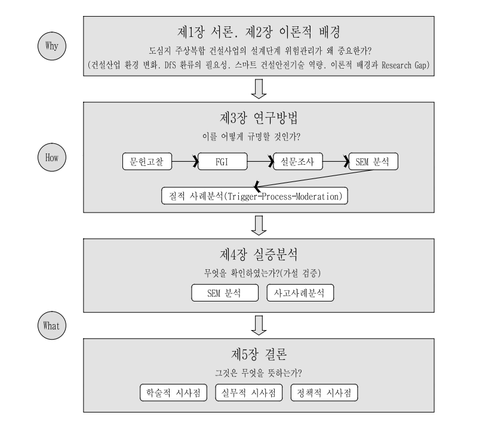

<!-- hwpx-p idx=313 -->

<h1>제 1 장 서  론</h1>

<!-- /hwpx-p idx=313 -->

<!-- hwpx-p idx=314 -->

<!-- /hwpx-p idx=314 -->

<!-- hwpx-p idx=315 -->

<h2>제 1 절 연구 배경 및 필요성</h2>

<!-- /hwpx-p idx=315 -->

<!-- hwpx-p idx=316 -->

<!-- /hwpx-p idx=316 -->

<!-- hwpx-p idx=317 -->

<h3>제 1 항 도심지 주상복합 건설의 특수성</h3>

<!-- /hwpx-p idx=317 -->

<!-- hwpx-p idx=318 -->

<!-- /hwpx-p idx=318 -->

<!-- hwpx-p idx=319 -->

  우리나라에서는 1960년대 세운상가아파트를 시작으로 상업시설과 주거기능이 결합된 주상복합건물이 등장하였다. IMF 이후 경제 활성화를 위한 법규 완화로 1990년대 후반부터 도심지 주상복합아파트 건립이 지속적으로 확대되고 있다(한용호 외, 2011). 최근에는 주택의 공급이 위축됨에도 수도권에는 공급이 몰리고 있어, 주상복합아파트처럼 제한된 부지 안에서 주거와 상업 수요를 동시에 수용하는 고밀 복합개발의 비중은 더욱 커지는 추세이다(제2장 제2절 제1항 참조).

<!-- /hwpx-p idx=319 -->

<!-- hwpx-p idx=320 -->

  도심지 주상복합은 일반 공동주택과 구조물의 형태와 주변 여건이 상이하여 복합적인 위험요인이 발생할 수 있다(인접 대지 간 물리적 간섭, 초고층 가설·구조공사, 양중·고소작업 동선, 복합용도 인터페이스, 민원·규제 등). 이러한 조건에서 설계단계에서 위험요인을 형식적으로 검토하고 도면 작업이 이루어지면 공사 중에 위험요인이 발견되어 설계변경과 공정 지연, 대형 안전사고로 이어질 수 있다. 건설업은 사고사망자가 가장 많은 업종이므로(고용노동부, 2026) 반드시 설계단계에서부터 안전관리를 시작해야 한다.

<!-- /hwpx-p idx=320 -->

<!-- hwpx-p idx=321 -->

  건설공사의 안전관리는 기존에는 시공단계에서 안전사고가 난 이후 대응하는 방식이었으나 현재는 설계단계부터 위험요인을 미리 없애는 방식으로 전환되어 왔다. 우리나라에도 2016년 설계안전성검토(Design for Safety, DfS)가 도입되었고 이후 안전보건대장이 더해져 두 가지 제도가 운영되고 있다. 이 두 제도는 설계단계에서 위험요인을 식별하여 문서로 남기고 다음 단계로 넘기는 것이다.

<!-- /hwpx-p idx=321 -->

<!-- hwpx-p idx=322 -->

  그러나 현행 DfS는 넘겨준 정보가 시공에서 이행되었는지, 그 결과 무엇이 달라졌는지를 확인하여 설계로 되돌리는 단계를 규정하지 않고 있다. 현장에서는 식별한 위험요인이 문서 작성에 그치거나, 현장 담당자가 위험정보를 인지하지 못한 채 시공이 진행되거나, 설계변경 후에도 위험정보가 갱신되지 않는 문제가 나타난다.

<!-- /hwpx-p idx=322 -->

<!-- hwpx-p idx=323 -->

  이러한 문제는 제도의 존재나 형식적 이행만으로 풀리지 않는다. 필요한 것은 설계의 안전 의도가 현장에서 실행되었는지 확인하고 그 결과를 다시 설계와 시공에 반영하는 순환이며, 본 연구는 이를 DfS 환류(Feedback)라 부른다. DfS 환류는 계획·실행·확인·조치의 한 바퀴가 돌아 무엇이 달라졌는지를 확인하는 과정으로, ISO 45001이 요구하는 지속적 개선의 구조와 같다(제2장 제1절 제4항 참조).

<!-- /hwpx-p idx=323 -->

<!-- hwpx-p idx=324 -->

  건설현장의 안전관리성과는 단순한 사고 발생 여부만으로 판단하기 어렵다. 설계단계에서 위험요인을 찾아 개선하고, 이를 실제 시공에 반영하는 과정이 중요하다. 위험성 검토가 형식적으로 이루어지거나 개선사항이 현장에 적용되지 않으면 DfS의 효과를 기대하기 어렵다. 또한 시공과정에서 축적된 경험과 개선사항이 후속 설계에 반영되지 않으면 유사한 위험이 반복될 수 있다. 따라서 DfS는 위험요인 검토에 그치지 않고, 현장의 개선사항과 시공 경험이 다시 설계에 반영되는 환류체계를 구축할 때 실질적인 안전관리성과로 이어질 수 있다.

<!-- /hwpx-p idx=324 -->

<!-- hwpx-p idx=325 -->

  이와 동시에 BIM, IoT, AI 등의 스마트 건설기술은 설계와 시공의 위험관리를 지원할 수 있다. BIM은 3차원 모델로 공종 간 간섭과 시공순서를 사전에 검토하고, 설계단계의 위험요인을 조기에 확인하도록 한다. IoT 센서와 AI 기술은 시공과정에서 작업자의 위치와 위험구역 접근, 작업 이행상태 등을 실시간으로 확인하여 현장 정보를 관리하도록 한다. 이러한 기술은 DfS 환류 과정의 정보 단절을 보완하고, 시공에서 확인된 정보를 후속 설계에 활용하는 데 기여할 수 있다.

<!-- /hwpx-p idx=325 -->

<!-- hwpx-p idx=326 -->

  그러나 스마트 건설안전기술이 안전관리성과로 이어지기 위해서는 기술 도입만으로 충분하지 않다. 설계와 시공에서 생성되는 정보를 연계하고 활용할 조직의 실행 역량이 함께 뒷받침되어야 한다. 이에 본 연구에서는 기술 도입 여부보다 조직의 활용 역량이 DfS 환류와 안전관리성과의 관계에 영향을 미칠 것으로 보고, 스마트 건설안전기술 역량을 조절변수로 설정하였다.

<!-- /hwpx-p idx=326 -->

<!-- hwpx-p idx=327 -->

<h3>제 2 항 문제 제기 및 연구의 차별성</h3>

<!-- /hwpx-p idx=327 -->

<!-- hwpx-p idx=328 -->

<!-- /hwpx-p idx=328 -->

<!-- hwpx-p idx=329 -->

  선행연구 검토 결과, 설계단계 위험관리, DfS, 스마트 건설기술 및 안전관리 성과에 관한 연구는 각 영역별로 꾸준히 수행되어 왔다. 설계단계 리스크가 시공 중 재해로 이어지는 인과관계는 DfS 도입 초기부터 지적되어 왔으며, 국내에서도 설계단계 위험요인 발굴과 평가에 관한 실증 연구가 축적되어 왔다.

<!-- /hwpx-p idx=329 -->

<!-- hwpx-p idx=330 -->

  그러나 기존 선행연구는 네 가지 공백을 남기고 있다. 첫째는 설계단계 위험요인의 안전관리성과에 대한 구조적 영향 규명 미흡, 둘째는 DfS 환류역량 실증 부재, 셋째는 스마트 기술역량의 조절효과 검증 부족, 마지막으로는 이 네 변수를 묶은 통합 구조모형의 부재이다. 대다수 연구가 단일 기법 효과에 머물러, 설계의 결정이 환류를 거쳐 시공 성과로 이어지는 전이 경로는 실증되지 않았다.

<!-- /hwpx-p idx=330 -->

<!-- hwpx-p idx=331 -->

  이러한 공백은 도심지 주상복합 건설사업의 특성을 반영한 통합 인과모형의 실증을 요구한다. 도심지 주상복합은 협소한 부지와 복합용도, 다수의 이해관계자로 인해 설계와 시공 간 정보 괴리가 발생하기 쉬우므로 이 경로를 검증하기에 최적이다. 시공에 선행하는 설계단계의 특성상 위험요인을 선행변수로 설정하는 것은 타당하며, 이 관계를 DfS 환류 중심으로 규명하는 연구가 시급하다.

<!-- /hwpx-p idx=331 -->

<!-- hwpx-p idx=332 -->

  본 연구의 차별성은 도심지 주상복합아파트 건설사업을 대상으로 설계단계 위험요인, DfS 환류역량, 스마트 기술역량, 안전관리성과를 단일한 구조방정식모형(SEM)<a id="ref-fn-1" href="#fn-1">1)</a>〔각주 1: <!-- hwpx-p idx=333 --> 구조방정식모형(Structural Equation Modeling, SEM)은 측정문항으로 잠재변수를 구성하는 측정모형과 잠재변수 간 인과관계를 설정하는 구조모형을 결합하여, 측정오차를 통제하면서 변수 간의 구조적 관계를 동시에 추정하는 다변량 통계기법이다.<!-- /hwpx-p idx=333 --> <a href="#ref-fn-1">↩</a>〕으로 통합하여 그 구조적 관계를 규명한다는 데 있다. 이는 개별 요인 중심의 기존 연구를 통합 구조로 확장하고, 도심지 주상복합에 적용할 예방 중심의 설계안전관리 체계를 제시한다는 점에서 의의가 크다. 선행연구의 한계와 본 연구의 차별성을 정리하면 &lt;표 1-1&gt;과 같다.

<!-- /hwpx-p idx=332 -->

<!-- hwpx-p idx=334 -->

<!-- /hwpx-p idx=334 -->

<!-- hwpx-p idx=335 -->

<!-- /hwpx-p idx=335 -->

<!-- hwpx-p idx=336 -->

&lt;표 1-1&gt; 선행연구의 한계와 본 연구의 차별성

<!-- /hwpx-p idx=336 -->

<!-- hwpx-p idx=337 -->

<table data-hwpx-table="9">
<tr>
<td rowspan="1" colspan="1" data-row="0" data-col="0">
<!-- hwpx-p idx=338 -->
구분
<!-- /hwpx-p idx=338 -->
</td>
<td rowspan="1" colspan="1" data-row="0" data-col="1">
<!-- hwpx-p idx=339 -->
기존 연구의 접근
<!-- /hwpx-p idx=339 -->
</td>
<td rowspan="1" colspan="1" data-row="0" data-col="2">
<!-- hwpx-p idx=340 -->
한계
<!-- /hwpx-p idx=340 -->
</td>
<td rowspan="1" colspan="1" data-row="0" data-col="3">
<!-- hwpx-p idx=341 -->
본 연구의 접근
<!-- /hwpx-p idx=341 -->
</td>
</tr>
<tr>
<td rowspan="1" colspan="1" data-row="1" data-col="0">
<!-- hwpx-p idx=342 -->
설계단계 위험관리
<!-- /hwpx-p idx=342 -->
</td>
<td rowspan="1" colspan="1" data-row="1" data-col="1">
<!-- hwpx-p idx=343 -->
설계단계 위험요인과 시공 중 사망사고의 연결 규명(Behm, 2005), 설계·시공 단계별 위험요인 선정과 설계단계 위험성평가의 실증(한병수 외, 2007, 원유진·강경식, 2019)
<!-- /hwpx-p idx=343 -->
</td>
<td rowspan="1" colspan="1" data-row="1" data-col="2">
<!-- hwpx-p idx=344 -->
설계단계 위험요인이 시공단계 안전관리성과에 미치는 구조적 영향을 통합적으로 분석한 연구가 부족
<!-- /hwpx-p idx=344 -->
</td>
<td rowspan="1" colspan="1" data-row="1" data-col="3">
<!-- hwpx-p idx=345 -->
설계단계 위험요인을 체계적으로 도출하여 안전관리성과의 선행변수로 설정하고 직접효과를 검증
<!-- /hwpx-p idx=345 -->
</td>
</tr>
<tr>
<td rowspan="1" colspan="1" data-row="2" data-col="0">
<!-- hwpx-p idx=346 -->
DfS
<!-- /hwpx-p idx=346 -->
</td>
<td rowspan="1" colspan="1" data-row="2" data-col="1">
<!-- hwpx-p idx=347 -->
DfS 개념의 창시 문헌 이후 제도와 개념에 관한 연구가 지속적으로 수행
<!-- /hwpx-p idx=347 -->
</td>
<td rowspan="1" colspan="1" data-row="2" data-col="2">
<!-- hwpx-p idx=348 -->
DfS를 환류역량 관점에서 실증한 연구가 제한적
<!-- /hwpx-p idx=348 -->
</td>
<td rowspan="1" colspan="1" data-row="2" data-col="3">
<!-- hwpx-p idx=349 -->
DfS 환류역량을 매개변수로 설정하여 매개효과를 실증적으로 검증
<!-- /hwpx-p idx=349 -->
</td>
</tr>
<tr>
<td rowspan="1" colspan="1" data-row="3" data-col="0">
<!-- hwpx-p idx=350 -->
스마트 건설안전기술
<!-- /hwpx-p idx=350 -->
</td>
<td rowspan="1" colspan="1" data-row="3" data-col="1">
<!-- hwpx-p idx=351 -->
스마트 건설기술과 안전관리성과에 관한 연구가 지속적으로 수행
<!-- /hwpx-p idx=351 -->
</td>
<td rowspan="1" colspan="1" data-row="3" data-col="2">
<!-- hwpx-p idx=352 -->
스마트 건설안전기술을 기술역량으로 개념화하여 조절효과를 분석한 연구가 부족
<!-- /hwpx-p idx=352 -->
</td>
<td rowspan="1" colspan="1" data-row="3" data-col="3">
<!-- hwpx-p idx=353 -->
스마트 건설안전기술 역량을 조절변수로 설정하여 조절효과를 규명
<!-- /hwpx-p idx=353 -->
</td>
</tr>
<tr>
<td rowspan="1" colspan="1" data-row="4" data-col="0">
<!-- hwpx-p idx=354 -->
변수 간 통합 구조
<!-- /hwpx-p idx=354 -->
</td>
<td rowspan="1" colspan="1" data-row="4" data-col="1">
<!-- hwpx-p idx=355 -->
개별 요인을 중심으로 
<!-- /hwpx-p idx=355 -->
<!-- hwpx-p idx=356 -->
연구가 이루어짐
<!-- /hwpx-p idx=356 -->
</td>
<td rowspan="1" colspan="1" data-row="4" data-col="2">
<!-- hwpx-p idx=357 -->
설계단계 위험요인(X)·DfS 환류역량(M)·스마트 건설안전기술 역량(W)·안전관리성과(Y)를 하나의 구조모형으로 통합하여 검증한 연구가 
<!-- /hwpx-p idx=357 -->
<!-- hwpx-p idx=358 -->
매우 제한적
<!-- /hwpx-p idx=358 -->
</td>
<td rowspan="1" colspan="1" data-row="4" data-col="3">
<!-- hwpx-p idx=359 -->
도심지 주상복합 건설사업을 대상으로 
<!-- /hwpx-p idx=359 -->
<!-- hwpx-p idx=360 -->
네 변수를 구조방정식모형(SEM)
<!-- /hwpx-p idx=360 -->
<!-- hwpx-p idx=361 -->
으로 통합하여 검증
<!-- /hwpx-p idx=361 -->
</td>
</tr>
</table>

<!-- /hwpx-p idx=337 -->

<!-- hwpx-p idx=362 -->

<!-- /hwpx-p idx=362 -->

<!-- hwpx-p idx=363 -->

자료: 연구자 작성

<!-- /hwpx-p idx=363 -->

<!-- hwpx-p idx=364 -->

<!-- /hwpx-p idx=364 -->

<!-- hwpx-p idx=365 -->

  &lt;표 1-1&gt;에서 알 수 있듯이 변수마다 연구는 축적되었으나 변수를 잇는 구조는 검증되지 않았고, 이 논의는 하나의 주장으로 모인다. 도심지 주상복합아파트의 설계안전성검토는 지금까지 환류되지 못하였다. 위험요인을 검토하여 문서로 넘기는 절차는 두 부처의 제도로 갖추어져 있으나, 그 결과를 시공에서 확인하여 다시 설계로 되돌리는 고리는 제도에도 현장에도 자리 잡지 못하였다. 따라서 DfS는 계획·실행·확인·조치가 순환하는 과정으로 운영되어야 하며, 그 순환을 수행하는 DfS 환류역량을 실증적으로 규명할 필요가 있다.

<!-- /hwpx-p idx=365 -->

<!-- hwpx-p idx=366 -->

<h2>제 2 절 연구의 목적</h2>

<!-- /hwpx-p idx=366 -->

<!-- hwpx-p idx=367 -->

<!-- /hwpx-p idx=367 -->

<!-- hwpx-p idx=368 -->

  설계안전성검토(DfS) 제도는 2016년 「건설기술 진흥법」 시행령 개정 이후 10년 가까이 운영되어 왔으나, 검토된 위험정보가 시공단계로 이어지지 못해 현장에 온전히 정착하지 못하고 있다. 그렇다면 도심지 주상복합 건설현장의 재해는 왜 반복되는가? 문제는 제도의 유무나 형식적 이행이 아니라, 설계단계의 위험정보를 시공단계까지 환류시키는 조직의 역량에 있는 것은 아닌가? 본 연구는 이러한 비판적 문제의식에서 출발한다.

<!-- /hwpx-p idx=368 -->

<!-- hwpx-p idx=369 -->

  본 연구는 도심지 주상복합아파트 건설사업을 대상으로 설계단계의 위험요인이 시공단계 안전관리성과로 전이되는 구조적 인과관계를 규명하는 데 목적이 있다. 특히 형식적 이행에 머무는 DfS 제도를 실질적인 환류역량(Feedback Capacity)으로 재정립하고, 스마트 건설안전기술 역량이 이 환류의 효과를 좌우하는 조건임을 밝히는 통합 모형을 구축하고자 한다.

<!-- /hwpx-p idx=369 -->

<!-- hwpx-p idx=370 -->

  구체적인 목적은 다음과 같다. 

<!-- /hwpx-p idx=370 -->

<!-- hwpx-p idx=371 -->

  첫째, 주상복합 특성을 반영한 설계단계 위험요인의 하위요인을 확정하고 성과에 미치는 직접효과를 규명한다. 

<!-- /hwpx-p idx=371 -->

<!-- hwpx-p idx=372 -->

  둘째, 위험요인이 DfS 환류역량을 거쳐 성과에 이르는 매개효과를 분석하여 위험이 성과로 전이되는 전 과정에서 환류가 수행하는 핵심적 역할을 밝힌다.

<!-- /hwpx-p idx=372 -->

<!-- hwpx-p idx=373 -->

  셋째, DfS 환류역량이 성과로 전환되는 관계에서 스마트 건설안전기술 역량이 갖는 조절효과를 파악한다. 

<!-- /hwpx-p idx=373 -->

<!-- hwpx-p idx=374 -->

  넷째, 이 조절이 전체 매개경로에 미치는 조절된 매개효과를 엄밀히 검증한다. 네 가지 목적은 연구문제 1&#126;4에 대응하며 구체적인 가설은 제3장 제2절에서 제시한다.

<!-- /hwpx-p idx=374 -->

<!-- hwpx-p idx=375 -->

  본 연구의 결과는 학술적·실무적·정책적 시사점을 제공하며, 국토교통부의 설계안전성검토와 고용노동부의 안전보건대장이 본 연구의 환류 체계를 검증하고 활용할 수 있는 실효성 있는 근거를 제시하는 데 기여할 것이다.

<!-- /hwpx-p idx=375 -->

<!-- hwpx-p idx=376 -->

근거를 제시하는 데 기여할 것이다.

<!-- /hwpx-p idx=376 -->

<!-- hwpx-p idx=377 -->

<!-- /hwpx-p idx=377 -->

<!-- hwpx-p idx=378 -->

<h2>제 3 절 연구의 범위 및 방법</h2>

<!-- /hwpx-p idx=378 -->

<!-- hwpx-p idx=379 -->

<!-- /hwpx-p idx=379 -->

<!-- hwpx-p idx=380 -->

<h3>제 1 항 연구의 범위</h3>

<!-- /hwpx-p idx=380 -->

<!-- hwpx-p idx=381 -->

<!-- /hwpx-p idx=381 -->

<!-- hwpx-p idx=382 -->

  내용적 범위는 도심지 주상복합아파트 신축공사를 대상으로 설계단계 위험요인, DfS 환류역량, 스마트 건설안전기술 역량 및 안전관리성과 간의 구조적 관계를 분석하는 것이다. 여기서 도심지란 「국토의 계획 및 이용에 관한 법률」상 상업지역 또는 준주거지역<a id="ref-fn-2" href="#fn-2">2)</a>〔각주 2: <!-- hwpx-p idx=383 --> 「국토의 계획 및 이용에 관한 법률」상 상업지역은 상업과 업무 편익의 증진을 위하여, 준주거지역은 주거기능을 위주로 상업·업무기능의 보완이 필요할 때 지정하는 지역으로, 두 지역 모두 주거와 상업의 복합 개발이 허용된다.<!-- /hwpx-p idx=383 --> <a href="#ref-fn-2">↩</a>〕으로 지정되어 상업시설과 주거시설이 복합적으로 개발되는 지역을 말한다. 아울러 양적 분석을 보완하기 위하여 국토교통부 CSI<a id="ref-fn-3" href="#fn-3">3)</a>〔각주 3: <!-- hwpx-p idx=384 --> CSI(건설공사 안전관리 종합정보망)는 건설사고 신고와 사고조사 결과 등 건설안전 정보를 통합 관리하는 국토교통부의 정보시스템이다(「건설기술 진흥법」 제62조 제15항).<!-- /hwpx-p idx=384 --> <a href="#ref-fn-3">↩</a>〕 사고사례와 법원 판례에 근거한 도심지 주상복합 사고사례 2건의 질적 사례분석을 함께 수행한다.

<!-- /hwpx-p idx=382 -->

<!-- hwpx-p idx=385 -->

  시간적 범위는 「중대재해 처벌 등에 관한 법률」 시행(2022년)과 「스마트 건설 활성화 방안」(국토교통부, 2022c) 발표를 전후한 2021년부터 2026년까지 수행된 도심지 주상복합아파트 건설사업이다. 이 기간은 스마트 안전장비 도입과 중대재해 예방 제도가 현장에 정착되어 온 시기로, 제도 변화가 반영된 자료를 확보할 수 있다. 설문 자료는 2026년 O월부터 O월까지 수집한다.

<!-- /hwpx-p idx=385 -->

<!-- hwpx-p idx=386 -->

　대상적 범위는 국내 종합건설업체<a id="ref-fn-4" href="#fn-4">4)</a>〔각주 4: <!-- hwpx-p idx=387 --> 「건설산업기본법」상 종합공사 업종으로 등록하여 시설물 전체의 시공을 계획·관리·조정하는 건설사업자로, 일부 공종만 시공하는 전문건설업체와 구분된다.<!-- /hwpx-p idx=387 --> <a href="#ref-fn-4">↩</a>〕가 시공하는 공사금액 50억 원 이상, 스마트 안전장비(IoT 등)<a id="ref-fn-5" href="#fn-5">5)</a>〔각주 5: <!-- hwpx-p idx=388 --> IoT 센서, 지능형 CCTV, 웨어러블 기기 등 정보통신기술로 건설현장의 위험을 감지·경보하는 장비로, 「건설기술 진흥법」 제62조의3에 따라 도입 비용을 지원받을 수 있다.<!-- /hwpx-p idx=388 --> <a href="#ref-fn-5">↩</a>〕를 도입한 도심지 주상복합아파트 신축현장에서 안전관리 업무를 수행하는 실무자이다. 공사금액 기준은 「산업안전보건법」상 안전보건대장 작성 대상과 같으며, 세부 표본 설계는 제3장 제5절에서 다룬다.

<!-- /hwpx-p idx=386 -->

<!-- hwpx-p idx=389 -->

  내용적·시간적·대상적 범위를 정리하면 &lt;표 1-2&gt;와 같다.

<!-- /hwpx-p idx=389 -->

<!-- hwpx-p idx=390 -->

<!-- /hwpx-p idx=390 -->

<!-- hwpx-p idx=391 -->

&lt;표 1-2&gt; 연구의 범위

<!-- /hwpx-p idx=391 -->

<!-- hwpx-p idx=392 -->

<table data-hwpx-table="10">
<tr>
<td rowspan="1" colspan="1" data-row="0" data-col="0">
<!-- hwpx-p idx=393 -->
구분
<!-- /hwpx-p idx=393 -->
</td>
<td rowspan="1" colspan="1" data-row="0" data-col="1">
<!-- hwpx-p idx=394 -->
범위
<!-- /hwpx-p idx=394 -->
</td>
<td rowspan="1" colspan="1" data-row="0" data-col="2">
<!-- hwpx-p idx=395 -->
설정 근거
<!-- /hwpx-p idx=395 -->
</td>
</tr>
<tr>
<td rowspan="1" colspan="1" data-row="1" data-col="0">
<!-- hwpx-p idx=396 -->
내용적 범위
<!-- /hwpx-p idx=396 -->
</td>
<td rowspan="1" colspan="1" data-row="1" data-col="1">
<!-- hwpx-p idx=397 -->
도심지 주상복합아파트 신축공사를 대상으로 설계단계 위험요인, DfS 환류역량, 스마트 건설안전기술 역량 및 안전관리성과 간의 구조적 관계를 분석하고, 사고사례 2건의 질적 사례분석을 병행
<!-- /hwpx-p idx=397 -->
</td>
<td rowspan="1" colspan="1" data-row="1" data-col="2">
<!-- hwpx-p idx=398 -->
도심지는 「국토의 계획 및 이용에 관한 법률」상 상업지역 또는 준주거지역으로 지정되어 상업시설과 주거시설이 복합적으로 개발되는 지역으로 한정하며, 양적 분석을 보완하기 위하여 국토교통부 CSI 사고사례와 법원 판례를 함께 검토
<!-- /hwpx-p idx=398 -->
</td>
</tr>
<tr>
<td rowspan="1" colspan="1" data-row="2" data-col="0">
<!-- hwpx-p idx=399 -->
시간적 범위
<!-- /hwpx-p idx=399 -->
</td>
<td rowspan="1" colspan="1" data-row="2" data-col="1">
<!-- hwpx-p idx=400 -->
2021년부터 2026년까지 수행된 
<!-- /hwpx-p idx=400 -->
<!-- hwpx-p idx=401 -->
도심지 주상복합아파트 건설사업
<!-- /hwpx-p idx=401 -->
<!-- hwpx-p idx=402 -->
(설문 자료는 2026년 O월부터 O월까지 수집)
<!-- /hwpx-p idx=402 -->
</td>
<td rowspan="1" colspan="1" data-row="2" data-col="2">
<!-- hwpx-p idx=403 -->
「중대재해 처벌 등에 관한 법률」 시행(2022년)과 「스마트 건설 활성화 방안」(국토교통부, 2022c) 발표 이후 스마트 안전장비 도입과 중대재해 예방 제도가 정착되어 온 기간과 맞물려, 제도 변화가 현장에 반영된 시점의 자료를 확보
<!-- /hwpx-p idx=403 -->
</td>
</tr>
<tr>
<td rowspan="1" colspan="1" data-row="3" data-col="0">
<!-- hwpx-p idx=404 -->

<!-- /hwpx-p idx=404 -->
<!-- hwpx-p idx=405 -->
대상적 범위(현장)
<!-- /hwpx-p idx=405 -->
</td>
<td rowspan="1" colspan="1" data-row="3" data-col="1">
<!-- hwpx-p idx=406 -->
국내 종합건설업체가 시공하는 공사금액 50억 원 이상, 스마트 안전장비(IoT 등)를 도입한 도심지 주상복합아파트 신축현장
<!-- /hwpx-p idx=406 -->
</td>
<td rowspan="1" colspan="1" data-row="3" data-col="2">
<!-- hwpx-p idx=407 -->
50억 원 이상 현장은 스마트 안전기술 도입 비율이 높아 조절변수가 실질적으로 작동하는 조건을 갖추며, 신축공사로 한정하면 설계단계부터 시공단계까지 위험관리의 흐름을 일관되게 관찰 가능
<!-- /hwpx-p idx=407 -->
</td>
</tr>
<tr>
<td rowspan="1" colspan="1" data-row="4" data-col="0">
<!-- hwpx-p idx=408 -->
대상적 범위(응답자)
<!-- /hwpx-p idx=408 -->
</td>
<td rowspan="1" colspan="1" data-row="4" data-col="1">
<!-- hwpx-p idx=409 -->
해당 현장에서 안전관리 업무를 수행하는 실무자로, 안전관리자를 중심으로 현장소장·관리감독자, 공사·공무 담당자, 설계·기술지원 인력이 해당
<!-- /hwpx-p idx=409 -->
</td>
<td rowspan="1" colspan="1" data-row="4" data-col="2">
<!-- hwpx-p idx=410 -->
DfS 환류역량 측정문항이 설계도서 검토, 위험성 평가, 저감대책 선정과 같은 설계단계 절차의 이행 여부를 묻기 때문에 안전관리 업무 수행자라야 현장에서 관측 가능(응답자 일반 특성 문항으로 적격성 사후 확인)
<!-- /hwpx-p idx=410 -->
</td>
</tr>
</table>

<!-- /hwpx-p idx=392 -->

<!-- hwpx-p idx=411 -->

<!-- /hwpx-p idx=411 -->

<!-- hwpx-p idx=412 -->

자료: 연구자 작성

<!-- /hwpx-p idx=412 -->

<!-- hwpx-p idx=413 -->

<!-- /hwpx-p idx=413 -->

<!-- hwpx-p idx=414 -->

  &lt;표 1-2&gt;에서 알 수 있듯이 내용·시간·대상의 세 범위는 하나의 기준으로 묶여 있다. 각 경계는 자료 수집의 편의가 아니라 설계단계에서 시공단계로 이어지는 위험관리의 흐름을 일관되게 관찰하고, 조절변수가 실제로 작동하는 현장의 자료만 분석에 포함하기 위한 조건이다.

<!-- /hwpx-p idx=414 -->

<!-- hwpx-p idx=415 -->

<!-- /hwpx-p idx=415 -->

<!-- hwpx-p idx=416 -->

<h3>제 2 항 연구방법</h3>

<!-- /hwpx-p idx=416 -->

<!-- hwpx-p idx=417 -->

<!-- /hwpx-p idx=417 -->

<!-- hwpx-p idx=418 -->

  본 연구는 질적 접근으로 핵심 변수와 분석 틀을 정립하고, 이를 양적 분석으로 검증하는 혼합연구방법을 적용하여 설계단계 위험요인과 안전관리 성과 간의 구조적 관계를 규명한다.

<!-- /hwpx-p idx=418 -->

<!-- hwpx-p idx=419 -->

  먼저 문헌고찰을 통해 선행연구와 건설안전 관련 법령, 설계안전성검토(DfS) 제도 및 스마트 건설기술 정책을 검토하여 연구모형과 변수의 이론적 근거를 설정한다. 다음으로 건설안전 분야 전문인력 7인을 대상으로 초점집단면접(FGI)을 실시하여 최종 하위요인을 확정하고, 내용타당도(CVR) 검증과 예비조사를 거쳐 측정문항을 확정한다(제3장 제4절 참조). 이후 정부 사고조사 보고서와 사법부 판례에 기록된 도심지 주상복합 재해사례 2건을 분석하여 설계단계 위험이 시공단계 사고로 전이되는 과정을 Trigger-Process-Moderation<a id="ref-fn-6" href="#fn-6">6)</a>〔각주 6: <!-- hwpx-p idx=420 --> 설계단계에서 형성된 위험이 시공단계의 사고로 이어지는 과정을 촉발 조건(Trigger), 전개 과정(Process), 조절 조건(Moderation)의 세 국면으로 나누어 분석하는 틀로, 본 연구의 연구모형에 대응시켜 구성하였다. 세부 적용은 제4장에서 제시한다.<!-- /hwpx-p idx=420 --> <a href="#ref-fn-6">↩</a>〕의 세 국면으로 구분하고 연구모형과 연계하여 분석한다(제4장 참조).

<!-- /hwpx-p idx=419 -->

<!-- hwpx-p idx=421 -->

  다음으로 확정된 측정문항을 활용하여 설문지를 구성하고, 도심지 주상복합 현장의 안전 실무자를 대상으로 온·오프라인 본조사를 실시한다. 응답자의 특성과 자격을 검토하여 연구목적에 부합하는 표본을 선정한 후, 확인적 요인분석(CFA)을 통해 측정도구의 신뢰성과 타당성을 검증한다. 이어 구조방정식모형(SEM)을 통해 연구가설을 검증하고, 부트스트래핑<a id="ref-fn-7" href="#fn-7">7)</a>〔각주 7: <!-- hwpx-p idx=422 --> 부트스트래핑(Bootstrapping)은 관측된 표본에서 반복 재표집(Resampling)으로 통계량의 경험적 표집분포를 추정하는 비모수적 방법이다. 매개효과 검증에서는 간접효과의 신뢰구간을 산출하여 유의성을 판정하는 표준 절차로 사용된다.<!-- /hwpx-p idx=422 --> <a href="#ref-fn-7">↩</a>〕으로 매개 및 조절된 매개효과의 간접효과를 검증하며 상호작용항을 투입하여 조절효과를 확인한다(제3장 제5절 참조).

<!-- /hwpx-p idx=421 -->

<!-- hwpx-p idx=423 -->

  마지막으로 목적표집(Purposive Sampling)을 적용하여 응답 자격을 엄격히 제한함으로써 외생적 영향을 통제한다. 통계적 일반화에는 한계가 있으나, 스마트 기술이 실제 적용되는 현장의 특성을 반영할 수 있다는 장점이 있다.

<!-- /hwpx-p idx=423 -->

<!-- hwpx-p idx=424 -->

<!-- /hwpx-p idx=424 -->

<!-- hwpx-p idx=425 -->

<h3>제 3 항 연구절차</h3>

<!-- /hwpx-p idx=425 -->

<!-- hwpx-p idx=426 -->

<!-- /hwpx-p idx=426 -->

<!-- hwpx-p idx=427 -->

  본 연구는 Why→How→What의 흐름에 따라 전개된다. 제1장과 제2장에서는 도심지 주상복합 건설사업의 설계단계 위험관리 필요성과 근거를 제시하고(Why), 제3장에서는 연구모형과 가설을 설정하고 FGI·CVR 및 예비조사를 통해 검증방법을 제시한다(How). 제4장에서는 CFA와 SEM으로 가설을 검증하고, 사고사례 분석으로 위험의 사고 전이과정을 확인한다. 제5장에서는 결과를 종합하여 학술적·실무적·정책적 시사점을 제시한다(What). 본 절차와 방법은 &lt;그림 1-1&gt;과 같다.

<!-- /hwpx-p idx=427 -->

<!-- hwpx-p idx=428 -->

<!-- /hwpx-p idx=428 -->

<!-- hwpx-p idx=429 -->

&lt;그림 1-1&gt; 연구 절차 및 방법

<!-- /hwpx-p idx=429 -->

<!-- hwpx-p idx=430 -->

<figure data-hwpx-picture="1">

원본 그림 객체 설명
<pre>그림입니다.
원본 그림의 이름: CLP0000213c0001.bmp
원본 그림의 크기: 가로 839pixel, 세로 722pixel</pre>
</figure>

<!-- /hwpx-p idx=430 -->

<!-- hwpx-p idx=431 -->

자료: 연구자 작성

<!-- /hwpx-p idx=431 -->

