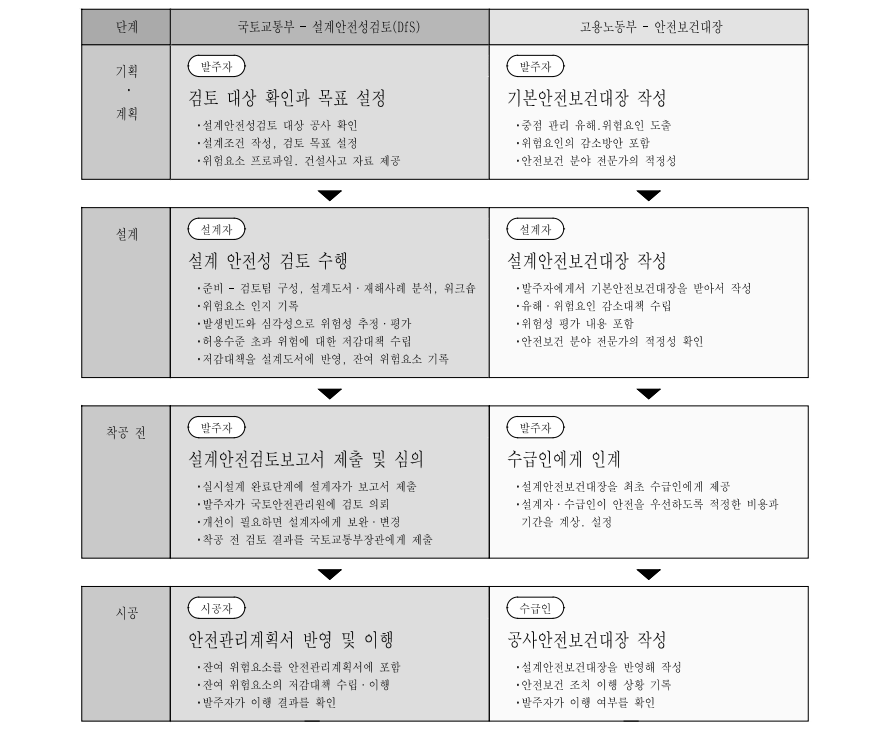
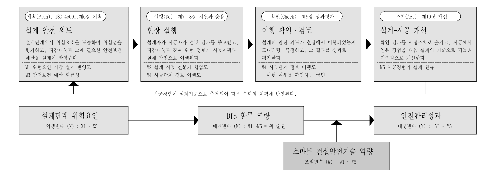

<!-- hwpx-p idx=432 -->

<h1>제 2 장 이론적 고찰 및 선행연구 검토</h1>

<!-- /hwpx-p idx=432 -->

<!-- hwpx-p idx=433 -->

<!-- /hwpx-p idx=433 -->

<!-- hwpx-p idx=434 -->

<h2>제 1 절 이론적 근거</h2>

<!-- /hwpx-p idx=434 -->

<!-- hwpx-p idx=435 -->

<!-- /hwpx-p idx=435 -->

<!-- hwpx-p idx=436 -->

  본 절은 본 연구의 이론적 기반을 검토한다. 설계단계 위험요인(X), DfS 환류역량(M), 스마트 건설안전기술 역량(W) 및 안전관리성과(Y)는 서로 다른 변수이지만, 이들을 하나의 인과모형으로 연결하는 이론적 논리는 연계된다.

<!-- /hwpx-p idx=436 -->

<!-- hwpx-p idx=437 -->

  이론을 변수별로 나누지 않고 한 절에 통합한 이유는 두 가지이다. 하나는 사회기술시스템 관점이나 Safety-II처럼 동일한 이론이 여러 변수에 걸쳐 작용하므로, 변수별로 나누면 같은 설명을 여러 절에서 되풀이하게 되기 때문이다. 다른 하나는 네 변수를 연결하는 논리가 개별 근거의 합이 아니라, 재해가 어디에서 형성되는가에서 출발하여 언제 제거할 것인가, 남은 변동은 어떻게 감당하는가, 그 경험은 어떻게 환류되는가, 무엇이 그 효율을 변화시키는가, 결과를 무엇으로 측정하는가로 이어지는 하나의 물음의 연쇄이기 때문이다.

<!-- /hwpx-p idx=437 -->

<!-- hwpx-p idx=438 -->

  이 연쇄가 이론의 선정 기준이 되었다. 이에 재해의 인과 구조(제1항), 설계단계의 예방 논리(제2항), 변동에 대한 적응(제3항), 정보의 환류(제4항), 자원과 역량(제5항) 및 성과의 측정 관점(제6항)을 차례로 살펴본 뒤 제7항에서 종합한다. 각 이론이 개별 변수의 하위요인으로 연결되는 방식은 제2절부터 제5절까지의 해당 항에서 다룬다.

<!-- /hwpx-p idx=438 -->

<!-- hwpx-p idx=439 -->

  재해의 인과 구조에 관한 이론은 설계단계 위험요인(X)이 형성되는 구조를, 설계단계 예방 이론과 조직학습·지식관리 이론은 DfS 환류역량(M)이 그 위험을 줄이는 경로를 설명한다. 자원·역량 관점과 기술수용모형은 스마트 건설안전기술 역량(W)이 환류의 효율을 바꾸는 조건을, 성과 측정 관점은 안전관리성과(Y)를 과정과 결과로 나누어 측정하는 근거를 제공한다. 각 이론이 개별 변수의 하위요인으로 연결되는 방식은 제2절부터 제5절까지의 해당 항에서 다룬다.

<!-- /hwpx-p idx=439 -->

<!-- hwpx-p idx=440 -->

<!-- /hwpx-p idx=440 -->

<!-- hwpx-p idx=441 -->

<h3>제 1 항 건설재해의 인과 구조와 잠재적 결함</h3>

<!-- /hwpx-p idx=441 -->

<!-- hwpx-p idx=442 -->

<!-- /hwpx-p idx=442 -->

<!-- hwpx-p idx=443 -->

  건설재해의 원인을 어디에서 찾을 것인가는 오랫동안 안전관리의 출발점이었다. Heinrich(1931)의 도미노 이론은 재해를 사회적 환경, 개인적 결함, 불안전한 행동과 상태, 사고, 상해로 이어지는 연쇄로 파악하고, 그중 중간 고리를 제거하면 연쇄가 끊어진다고 보았다. 이 관점은 예방의 실천적 방향을 제시하였으나, 불안전한 행동이 왜 발생하는가에 대해서는 설명하지 못한다. 그 행동이 부주의가 아니라 그렇게 행동할 수밖에 없는 조건에서 비롯된다면, 행동의 교정만으로는 동일한 재해가 반복될 수 있다.

<!-- /hwpx-p idx=443 -->

<!-- hwpx-p idx=444 -->

  Reason(1997)의 스위스 치즈 모델(Swiss Cheese Model)은 이러한 물음에 조직의 층위에서 답한다. 그는 조직을 여러 겹의 방어층(Defense Layers)으로 이루어진 치즈 조각에 비유하고, 각 층에 존재하는 구멍을 조직 내 잠재적 결함(Latent Conditions)과 현장의 활성오류(Active Failures)<a id="ref-fn-8" href="#fn-8">8)</a>〔각주 8: <!-- hwpx-p idx=445 --> 활성오류(Active Failures)는 현장에서 직접 사고로 이어지는 작업자와 관리자의 불안전한 행동이나 판단 착오를 말한다.<!-- /hwpx-p idx=445 --> <a href="#ref-fn-8">↩</a>〕로 구분하였다. 평상시에는 한 층의 결함을 다른 층이 막아 주지만, 여러 방어층의 구멍이 일직선으로 정렬되는 순간 사고가 발생한다. 이 모델의 전환점은 사고의 원인을 행위 자체가 아니라 그 이전에 형성된 조건에서 찾도록 한 데 있다.

<!-- /hwpx-p idx=444 -->

<!-- hwpx-p idx=446 -->

  잠재적 결함은 현장이 아닌 상류의 의사결정 과정에서 형성된다. 도면 검토의 누락, 하중 산정의 오류, 인접 대지와의 이격거리 미검토는 그 자체로 사고를 일으키지 않지만, 시공단계에서 근로자의 불안전한 행동이나 관리감독의 소홀과 결합할 때 재해로 표면화될 수 있다. 활성오류는 결과가 즉시 나타나므로 행동의 교정으로 다룰 수 있지만, 잠재적 결함은 사고가 발생하기 전까지 드러나지 않으므로 그 조건 자체를 제거하는 접근이 필요하다.

<!-- /hwpx-p idx=446 -->

<!-- hwpx-p idx=447 -->

  다만 이 모델은 방어층의 구멍이 어떤 과정을 거쳐 형성되고 왜 특정 시점에 정렬되는지를 충분히 설명하지 못한다는 한계가 지적되어 왔다. 사고 발생 후 원인을 추적하는 데에는 유용하지만, 아직 정렬되지 않은 구멍을 사전에 발견하는 데에는 별도의 접근이 필요하다. 본 연구가 잠재적 결함을 추상적 개념으로 두지 않고, 설계자가 무엇을 검토하지 못하였는가의 관점에서 구체화하여 다섯 하위요인으로 설정한 이유가 여기에 있다.

<!-- /hwpx-p idx=447 -->

<!-- hwpx-p idx=448 -->

  잠재적 결함이 형성되는 조건은 사회기술시스템(Socio-Technical System) 관점에서 설명할 수 있다. Emery와 Trist(1960)는 조직을 기술적 요소와 사회·조직적 요소가 상호작용하는 체계로 보고, 어느 한쪽만 최적화해서는 전체 성과를 향상시키기 어렵다고 제시하였다. 건설 프로젝트는 발주자, 설계자, 시공자 및 감리자가 서로 다른 목표와 정보를 가지고 하나의 결과물을 만들어 내는 전형적인 사회기술시스템이므로, 기술적으로 타당한 설계라도 조직 간 정보가 단절되면 안전으로 구현되지 못할 수 있다. 앞에서 살펴본 활성오류와 잠재적 결함의 특성을 비교하면 &lt;표 2-1&gt;과 같다.

<!-- /hwpx-p idx=448 -->

<!-- hwpx-p idx=449 -->

<!-- /hwpx-p idx=449 -->

<!-- hwpx-p idx=450 -->

&lt;표 2-1&gt; 활성오류와 잠재적 결함의 대조

<!-- /hwpx-p idx=450 -->

<!-- hwpx-p idx=451 -->

<table data-hwpx-table="11">
<tr>
<td rowspan="1" colspan="1" data-row="0" data-col="0">
<!-- hwpx-p idx=452 -->
구분
<!-- /hwpx-p idx=452 -->
</td>
<td rowspan="1" colspan="1" data-row="0" data-col="1">
<!-- hwpx-p idx=453 -->
활성오류
<!-- /hwpx-p idx=453 -->
</td>
<td rowspan="1" colspan="1" data-row="0" data-col="2">
<!-- hwpx-p idx=454 -->
잠재적 결함
<!-- /hwpx-p idx=454 -->
</td>
</tr>
<tr>
<td rowspan="1" colspan="1" data-row="1" data-col="0">
<!-- hwpx-p idx=455 -->
개념
<!-- /hwpx-p idx=455 -->
</td>
<td rowspan="1" colspan="1" data-row="1" data-col="1">
<!-- hwpx-p idx=456 -->
사고로 직접 이어지는 작업자와 관리자의 불안전한 행동이나 
<!-- /hwpx-p idx=456 -->
<!-- hwpx-p idx=457 -->
판단 착오
<!-- /hwpx-p idx=457 -->
</td>
<td rowspan="1" colspan="1" data-row="1" data-col="2">
<!-- hwpx-p idx=458 -->
도면 검토의 누락과 하중 산정의 오류처럼 그 자체로는 사고를 일으키지 않는 조건
<!-- /hwpx-p idx=458 -->
</td>
</tr>
<tr>
<td rowspan="1" colspan="1" data-row="2" data-col="0">
<!-- hwpx-p idx=459 -->
형성 지점
<!-- /hwpx-p idx=459 -->
</td>
<td rowspan="1" colspan="1" data-row="2" data-col="1">
<!-- hwpx-p idx=460 -->
현장
<!-- /hwpx-p idx=460 -->
</td>
<td rowspan="1" colspan="1" data-row="2" data-col="2">
<!-- hwpx-p idx=461 -->
상류의 의사결정
<!-- /hwpx-p idx=461 -->
</td>
</tr>
<tr>
<td rowspan="1" colspan="1" data-row="3" data-col="0">
<!-- hwpx-p idx=462 -->
표면화 시점
<!-- /hwpx-p idx=462 -->
</td>
<td rowspan="1" colspan="1" data-row="3" data-col="1">
<!-- hwpx-p idx=463 -->
결과가 즉시 드러난다
<!-- /hwpx-p idx=463 -->
</td>
<td rowspan="1" colspan="1" data-row="3" data-col="2">
<!-- hwpx-p idx=464 -->
시공단계에서 근로자의 불안전한 행동이나 관리감독의 소홀과 결합할 때 비로소 드러난다
<!-- /hwpx-p idx=464 -->
</td>
</tr>
<tr>
<td rowspan="1" colspan="1" data-row="4" data-col="0">
<!-- hwpx-p idx=465 -->
대응의 초점
<!-- /hwpx-p idx=465 -->
</td>
<td rowspan="1" colspan="1" data-row="4" data-col="1">
<!-- hwpx-p idx=466 -->
불안전한 행동의 교정
<!-- /hwpx-p idx=466 -->
</td>
<td rowspan="1" colspan="1" data-row="4" data-col="2">
<!-- hwpx-p idx=467 -->
불안전한 행동을 강요하는 조건의 제거
<!-- /hwpx-p idx=467 -->
</td>
</tr>
</table>

<!-- /hwpx-p idx=451 -->

<!-- hwpx-p idx=468 -->

<!-- /hwpx-p idx=468 -->

<!-- hwpx-p idx=469 -->

자료: Reason(1997)을 바탕으로 연구자 재구성

<!-- /hwpx-p idx=469 -->

<!-- hwpx-p idx=470 -->

<!-- /hwpx-p idx=470 -->

<!-- hwpx-p idx=471 -->

  &lt;표 2-1&gt;에서 알 수 있듯이 두 오류는 형성되는 지점과 드러나는 시점이 다르며, 그 차이가 대응의 초점을 가른다. 본 연구가 주목하는 것은 즉시 드러나는 활성오류가 아니라, 상류의 의사결정에 남아 있다가 다른 조건과 결합할 때 재해로 이어지는 잠재적 결함이다.

<!-- /hwpx-p idx=471 -->

<!-- hwpx-p idx=472 -->

  결함의 이동 경로는 일반시스템이론이 설명한다. Bertalanffy(1968)는 한 하위요소의 변화가 다른 하위요소로 전파되어 전체 성과에 영향을 미친다고 보았다. 설계단계의 조건은 시공단계로 전이되므로, 시공단계의 관리가 내려온 위험을 막는 일이라면 설계단계의 검토는 그 위험을 미리 없애는 일이다.

<!-- /hwpx-p idx=472 -->

<!-- hwpx-p idx=473 -->

<h3>제 2 항 설계단계 예방 이론</h3>

<!-- /hwpx-p idx=473 -->

<!-- hwpx-p idx=474 -->

<!-- /hwpx-p idx=474 -->

<!-- hwpx-p idx=475 -->

  위험은 시공단계에서 통제하기보다 설계단계에서 제거하는 것이 효과적이다. 이를 이론적으로 정식화한 것이 Prevention through Design(PtD)이다. Gambatese et al.(1997)은 설계단계의 의사결정이 시공단계의 안전성과에 영향을 미친다고 제시하였고, Behm(2005)은 위험요인의 설계적 제거(Design-out)가 재해 예방에 효과적임을 사망사고 자료로 확인하였다.

<!-- /hwpx-p idx=475 -->

<!-- hwpx-p idx=476 -->

각국은 이러한 문제의식을 제도화하였다. 미국은 NIOSH<a id="ref-fn-9" href="#fn-9">9)</a>〔각주 9: <!-- hwpx-p idx=477 --> NIOSH(National Institute for Occupational Safety and Health)는 미국 질병통제예방센터(CDC) 소속의 국립산업안전보건연구원이다.<!-- /hwpx-p idx=477 --> <a href="#ref-fn-9">↩</a>〕를 중심으로 국가 이니셔티브를 추진하였고(NIOSH, 2010), 영국은 CDM Regulations<a id="ref-fn-10" href="#fn-10">10)</a>〔각주 10: <!-- hwpx-p idx=478 --> CDM(Construction Design and Management) Regulations는 건설공사 전 과정에서 발주자·설계자·시공자의 안전보건 책임을 규정한 영국 법령이다. 현행본(SI 2015/51) 제12조는 보건안전파일의 작성·갱신과 시공 중 주시공자의 설계자에 대한 정보 제공 의무를 규정한다.<!-- /hwpx-p idx=478 --> <a href="#ref-fn-10">↩</a>〕로 설계자에게 시공단계 안전의 법적 책임을 부여하였다. 우리나라는 「건설기술 진흥법」의 설계안전성검토(DfS)와 「산업안전보건법」의 안전보건대장으로 설계자와 발주자에게 설계단계의 안전 책임을 부과하였다.

<!-- /hwpx-p idx=476 -->

<!-- hwpx-p idx=479 -->

PtD의 핵심은 위험 통제의 시점을 앞당기는 데 있다. 시공단계의 안전관리는 확정된 설계조건을 전제로 하므로 방호설비<a id="ref-fn-11" href="#fn-11">11)</a>〔각주 11: <!-- hwpx-p idx=480 --> 방호설비는 안전난간, 안전방망, 개구부 덮개 등 위험과 작업자 사이를 물리적으로 차단하는 가설 안전설비로, 위험의 원인을 제거하는 설계단계의 조치와는 성격이 다르다.<!-- /hwpx-p idx=480 --> <a href="#ref-fn-11">↩</a>〕의 설치나 작업방법 개선처럼 위험을 남겨 둔 채 관리하는 수단에 의존하기 쉽다. 반면 설계단계에서는 위험의 원인을 제거하거나 줄일 수 있어 위험통제계층(Hierarchy of Controls) 상위의 근원적 통제가 가능하다.

<!-- /hwpx-p idx=479 -->

<!-- hwpx-p idx=481 -->

시공성(Constructability)은 이러한 예방을 실행하는 방법을 제시한다. CII(1986)는 시공 지식을 설계 초기부터 반영할 때 안전성과 생산성이 함께 향상된다고 보았고, Gambatese et al.(2008)은 설계자가 시공 순서, 작업공간, 자재 동선, 장비 접근성을 사전에 검토하면 시공단계의 위험을 예방할 수 있다고 하였다. PtD가 확인된 위험을 설계에서 제거·저감하는 데, 시공성은 시공 과정을 사전에 검토하여 잠재 위험을 발견하는 데 초점을 둔다. 주요 국가의 제도화 사례는 &lt;표 2-2&gt;와 같다.

<!-- /hwpx-p idx=481 -->

<!-- hwpx-p idx=482 -->

&lt;표 2-2&gt; 설계단계 안전 제도·지침의 국제 비교

<!-- /hwpx-p idx=482 -->

<!-- hwpx-p idx=483 -->

<table data-hwpx-table="12">
<tr>
<td rowspan="1" colspan="1" data-row="0" data-col="0">
<!-- hwpx-p idx=484 -->
구분
<!-- /hwpx-p idx=484 -->
</td>
<td rowspan="1" colspan="1" data-row="0" data-col="1">
<!-- hwpx-p idx=485 -->
제도·지침
<!-- /hwpx-p idx=485 -->
</td>
<td rowspan="1" colspan="1" data-row="0" data-col="2">
<!-- hwpx-p idx=486 -->
주요 내용
<!-- /hwpx-p idx=486 -->
</td>
</tr>
<tr>
<td rowspan="1" colspan="1" data-row="1" data-col="0">
<!-- hwpx-p idx=487 -->
미국
<!-- /hwpx-p idx=487 -->
</td>
<td rowspan="1" colspan="1" data-row="1" data-col="1">
<!-- hwpx-p idx=488 -->
NIOSH 주도의 PtD 국가 이니셔티브(NIOSH, 2010)
<!-- /hwpx-p idx=488 -->
</td>
<td rowspan="1" colspan="1" data-row="1" data-col="2">
<!-- hwpx-p idx=489 -->
연구기관의 권고와 국가 이니셔티브를 통한 자율적 확산
<!-- /hwpx-p idx=489 -->
</td>
</tr>
<tr>
<td rowspan="1" colspan="1" data-row="2" data-col="0">
<!-- hwpx-p idx=490 -->
유럽연합
<!-- /hwpx-p idx=490 -->
</td>
<td rowspan="1" colspan="1" data-row="2" data-col="1">
<!-- hwpx-p idx=491 -->
이사회 지침 92/57/EEC(1992)
<!-- /hwpx-p idx=491 -->
</td>
<td rowspan="1" colspan="1" data-row="2" data-col="2">
<!-- hwpx-p idx=492 -->
설계·시공 단계별 안전보건 조정자와 후속 공사용 안전보건 파일을 요구
<!-- /hwpx-p idx=492 -->
</td>
</tr>
<tr>
<td rowspan="1" colspan="1" data-row="3" data-col="0">
<!-- hwpx-p idx=493 -->
영국
<!-- /hwpx-p idx=493 -->
</td>
<td rowspan="1" colspan="1" data-row="3" data-col="1">
<!-- hwpx-p idx=494 -->
CDM Regulations(2015)
<!-- /hwpx-p idx=494 -->
</td>
<td rowspan="1" colspan="1" data-row="3" data-col="2">
<!-- hwpx-p idx=495 -->
설계자에게 시공단계 안전에 대한 법적 책임을 부과하고, 시공 중 확인된 정보를 설계자에게 되돌리도록 규정
<!-- /hwpx-p idx=495 -->
</td>
</tr>
<tr>
<td rowspan="1" colspan="1" data-row="4" data-col="0">
<!-- hwpx-p idx=496 -->
싱가포르
<!-- /hwpx-p idx=496 -->
</td>
<td rowspan="1" colspan="1" data-row="4" data-col="1">
<!-- hwpx-p idx=497 -->
「산업안전보건(설계안전) 규정」(2015)
<!-- /hwpx-p idx=497 -->
</td>
<td rowspan="1" colspan="1" data-row="4" data-col="2">
<!-- hwpx-p idx=498 -->
발주자·설계자·시공자에 DfS 의무를 부과하고 설계위험 등록부의 상시 갱신·공유를 요구
<!-- /hwpx-p idx=498 -->
</td>
</tr>
<tr>
<td rowspan="2" colspan="1" data-row="5" data-col="0">
<!-- hwpx-p idx=499 -->
한국
<!-- /hwpx-p idx=499 -->
</td>
<td rowspan="1" colspan="1" data-row="5" data-col="1">
<!-- hwpx-p idx=500 -->
「건설기술 진흥법」상 설계안전성검토(DfS)
<!-- /hwpx-p idx=500 -->
</td>
<td rowspan="1" colspan="1" data-row="5" data-col="2">
<!-- hwpx-p idx=501 -->
설계단계 위험요인 검토와 시공단계 이관을 절차로 제도화
<!-- /hwpx-p idx=501 -->
</td>
</tr>
<tr>
<td rowspan="1" colspan="1" data-row="6" data-col="1">
<!-- hwpx-p idx=502 -->
「산업안전보건법」상 안전보건대장
<!-- /hwpx-p idx=502 -->
</td>
<td rowspan="1" colspan="1" data-row="6" data-col="2">
<!-- hwpx-p idx=503 -->
발주자에게 기획·설계·시공 단계별 안전보건 관리 의무 부과
<!-- /hwpx-p idx=503 -->
</td>
</tr>
</table>

<!-- /hwpx-p idx=483 -->

<!-- hwpx-p idx=504 -->

<!-- /hwpx-p idx=504 -->

<!-- hwpx-p idx=505 -->

주) 한국의 두 제도는 본 연구가 DfS 환류역량(M)으로 다루는 활동의 제도적 근거이나, 국외 제도와 달리 시공에서 설계로 되돌리는 환류를 법령으로 규정하지 않는다(제3절 제1항).

<!-- /hwpx-p idx=505 -->

<!-- hwpx-p idx=506 -->

자료: NIOSH(2010), 유럽연합 이사회 지침 92/57/EEC, 영국 CDM 2015, WSH Council(2022), 「건설기술 진흥법」 및 「산업안전보건법」을 바탕으로 연구자 작성

<!-- /hwpx-p idx=506 -->

<!-- hwpx-p idx=507 -->

<!-- /hwpx-p idx=507 -->

<!-- hwpx-p idx=508 -->

 &lt;표 2-2&gt;와 같이 PtD와 시공성은 각국 제도에 반영된 실천적 원칙이며, 본 연구는 이를 설계단계 위험요인(X)의 하위요인 도출 기준으로 삼는다. PtD는 인접 대지 간섭, 초고층 가설·구조처럼 설계에서 제거·저감할 수 있는 위험을, 시공성은 양중·고소작업 동선, 복합용도 인터페이스처럼 시공 과정을 사전에 검토해야 드러나는 위험을 식별하는 근거가 된다. 다만 두 이론은 예방적 관점에 서 있어 시공 중 하중·공정·환경의 변동까지 설명하기는 어렵다. 이를 보완하는 Safety-II의 관점에서 X는 고정된 위험목록이 아니라 현장 조건과 상호작용하며 변화하는 위험조건으로 이해되며, 설계의 위험정보와 시공의 대응 경험이 연계·환류되어야 한다는 점에서 X와 안전관리성과(Y)의 관계에 DfS 환류역량(M)이 필요한 이론적 근거가 된다.

<!-- /hwpx-p idx=508 -->

<!-- hwpx-p idx=509 -->

<!-- /hwpx-p idx=509 -->

<!-- hwpx-p idx=510 -->

<h3>제 3 항 Safety-II와 회복탄력성</h3>

<!-- /hwpx-p idx=510 -->

<!-- hwpx-p idx=511 -->

<!-- /hwpx-p idx=511 -->

<!-- hwpx-p idx=512 -->

  안전은 단순히 사고가 없는 상태가 아니라, 변화하는 조건 속에서도 업무를 성공적으로 수행할 수 있는 능력이다. Hollnagel(2014a)은 사고의 부재를 안전으로 보는 기존 관점을 Safety-I로, 다양한 조건에서도 일상 업무가 성공적으로 이루어지는 능력에 주목하는 관점을 Safety-II로 구분하였다. Safety-I이 실패한 소수의 사례를 분석한다면, Safety-II는 대다수의 성공을 가능하게 하는 조정과 적응에 주목한다. 이러한 전환은 안전관리의 초점을 사고 자체에서 업무가 수행되는 방식으로 옮긴다.

<!-- /hwpx-p idx=512 -->

<!-- hwpx-p idx=513 -->

  Safety-II가 중시하는 핵심 역량은 회복탄력성<a id="ref-fn-12" href="#fn-12">12)</a>〔각주 12: <!-- hwpx-p idx=514 --> 회복탄력성(Resilience)은 시스템이 예상하지 못한 교란을 겪은 뒤에도 필수 기능을 유지하거나 신속히 회복하는 능력을 뜻한다. 안전관리에서는 사고를 막는 능력만이 아니라 조건이 변동하는 상황에서 업무를 성공적으로 이어 가는 능력까지 포함하는 개념으로 쓴다.<!-- /hwpx-p idx=514 --> <a href="#ref-fn-12">↩</a>〕이다. Hollnagel(2014b)은 복잡한 사회기술시스템에서 실패를 줄이는 것보다, 예상된 조건과 예상하지 못한 조건 모두에서 기능을 유지할 수 있는 적응역량(Adaptive Capacity)<a id="ref-fn-13" href="#fn-13">13)</a>〔각주 13: <!-- hwpx-p idx=515 --> 적응역량(Adaptive Capacity)은 조직이 변동하는 조건에 맞추어 업무 방식을 조정하여 기능을 지속하는 능력을 말한다.<!-- /hwpx-p idx=515 --> <a href="#ref-fn-13">↩</a>〕을 확보하는 것이 더 중요하다고 설명하였다.

<!-- /hwpx-p idx=513 -->

<!-- hwpx-p idx=516 -->

  조직이 상황에 대응하고, 변화를 모니터링하며, 경험으로부터 학습하고, 앞으로의 변동을 예견하는 능력을 갖출 때 시스템은 교란을 견딜 수 있다. 즉, 안전은 한 번 확보해 보관하는 상태가 아니라 지속적으로 수행해야 하는 활동이다.

<!-- /hwpx-p idx=516 -->

<!-- hwpx-p idx=517 -->

  이 관점은 건설공사의 특성과도 잘 부합한다. 건설현장은 공정이 진행됨에 따라 구조와 하중, 작업공간, 참여 인력이 계속 변화하는 미완성 시스템이다. 특히 초고층 공사에서는 구조체가 완성되기 전까지 하중경로와 횡력저항체계가 설계 의도와 다른 상태로 존재하며, 풍하중과 양중 조건 역시 매일 달라진다. 설계도서가 전제한 조건과 현장의 실제 조건 사이에는 항상 간극이 존재하며, 이를 메우는 것은 현장의 조정 능력이다.

<!-- /hwpx-p idx=517 -->

<!-- hwpx-p idx=518 -->

  지금까지 살펴본 Safety-I과 Safety-II의 관점 차이는 &lt;표 2-3&gt;과 같이 정리할 수 있다.

<!-- /hwpx-p idx=518 -->

<!-- hwpx-p idx=519 -->

<!-- /hwpx-p idx=519 -->

<!-- hwpx-p idx=520 -->

&lt;표 2-3&gt; Safety-I과 Safety-II의 관점 대조

<!-- /hwpx-p idx=520 -->

<!-- hwpx-p idx=521 -->

<table data-hwpx-table="13">
<tr>
<td rowspan="1" colspan="1" data-row="0" data-col="0">
<!-- hwpx-p idx=522 -->
구분
<!-- /hwpx-p idx=522 -->
</td>
<td rowspan="1" colspan="1" data-row="0" data-col="1">
<!-- hwpx-p idx=523 -->
Safety-I
<!-- /hwpx-p idx=523 -->
</td>
<td rowspan="1" colspan="1" data-row="0" data-col="2">
<!-- hwpx-p idx=524 -->
Safety-II
<!-- /hwpx-p idx=524 -->
</td>
</tr>
<tr>
<td rowspan="1" colspan="1" data-row="1" data-col="0">
<!-- hwpx-p idx=525 -->
안전의 정의
<!-- /hwpx-p idx=525 -->
</td>
<td rowspan="1" colspan="1" data-row="1" data-col="1">
<!-- hwpx-p idx=526 -->
사고가 없는 상태
<!-- /hwpx-p idx=526 -->
</td>
<td rowspan="1" colspan="1" data-row="1" data-col="2">
<!-- hwpx-p idx=527 -->
변동하는 조건에서도 일이 성공적으로 수행되는 능력
<!-- /hwpx-p idx=527 -->
</td>
</tr>
<tr>
<td rowspan="1" colspan="1" data-row="2" data-col="0">
<!-- hwpx-p idx=528 -->
분석의 대상
<!-- /hwpx-p idx=528 -->
</td>
<td rowspan="1" colspan="1" data-row="2" data-col="1">
<!-- hwpx-p idx=529 -->
실패한 소수의 사례
<!-- /hwpx-p idx=529 -->
</td>
<td rowspan="1" colspan="1" data-row="2" data-col="2">
<!-- hwpx-p idx=530 -->
대다수의 성공을 만들어 내는 조정과 적응
<!-- /hwpx-p idx=530 -->
</td>
</tr>
<tr>
<td rowspan="1" colspan="1" data-row="3" data-col="0">
<!-- hwpx-p idx=531 -->
관리의 대상
<!-- /hwpx-p idx=531 -->
</td>
<td rowspan="1" colspan="1" data-row="3" data-col="1">
<!-- hwpx-p idx=532 -->
사고 그 자체
<!-- /hwpx-p idx=532 -->
</td>
<td rowspan="1" colspan="1" data-row="3" data-col="2">
<!-- hwpx-p idx=533 -->
업무의 수행 방식
<!-- /hwpx-p idx=533 -->
</td>
</tr>
<tr>
<td rowspan="1" colspan="1" data-row="4" data-col="0">
<!-- hwpx-p idx=534 -->
관리의 지향점
<!-- /hwpx-p idx=534 -->
</td>
<td rowspan="1" colspan="1" data-row="4" data-col="1">
<!-- hwpx-p idx=535 -->
실패의 수를 줄이는 데 둔다
<!-- /hwpx-p idx=535 -->
</td>
<td rowspan="1" colspan="1" data-row="4" data-col="2">
<!-- hwpx-p idx=536 -->
예상한 조건과 예상하지 못한 조건 모두에서 기능을 지속하는 적응역량을 확보하는 데 둔다
<!-- /hwpx-p idx=536 -->
</td>
</tr>
</table>

<!-- /hwpx-p idx=521 -->

<!-- hwpx-p idx=537 -->

<!-- /hwpx-p idx=537 -->

<!-- hwpx-p idx=538 -->

자료: Hollnagel(2014a)을 바탕으로 연구자 재구성

<!-- /hwpx-p idx=538 -->

<!-- hwpx-p idx=539 -->

<!-- /hwpx-p idx=539 -->

<!-- hwpx-p idx=540 -->

  &lt;표 2-3&gt;에서 확인할 수 있듯이 두 관점은 안전을 정의하는 지점에서 구분되며, 이러한 차이는 분석과 관리의 대상에도 이어진다. 사고의 부재를 확인하는 데만 머무를 경우, 일상 업무를 성공으로 이끄는 조정과 적응은 관리 대상에서 제외될 수 있다. Safety-II가 관리의 초점을 업무의 수행 방식으로 옮긴 이유도 여기에 있다.

<!-- /hwpx-p idx=540 -->

<!-- hwpx-p idx=541 -->

  Safety-II는 앞서 살펴본 예방 이론을 부정하는 것이 아니라 이를 보완하는 관점이다. 설계단계에서 위험을 제거하는 일과 남아 있는 변동에 현장에서 적응하는 일은 양자택일의 문제가 아니다. 오히려 설계가 예측하지 못한 조건이 현장에서 드러났을 때, 그 경험을 다시 설계에 반영할 수 있어야 두 접근이 하나의 체계로 작동할 수 있다.

<!-- /hwpx-p idx=541 -->

<!-- hwpx-p idx=542 -->

  따라서 Safety-II 관점은 안전관리 성과에 사고의 부재뿐 아니라 조건 변화에 대응하는 능력까지 포함해야 한다는 요구이다. 동시에 이는 다음 항에서 살펴볼 환류의 필요성을 제기하는 관점이기도 하다.

<!-- /hwpx-p idx=542 -->

<!-- hwpx-p idx=543 -->

<!-- /hwpx-p idx=543 -->

<!-- hwpx-p idx=544 -->

<!-- /hwpx-p idx=544 -->

<!-- hwpx-p idx=545 -->

<!-- /hwpx-p idx=545 -->

<!-- hwpx-p idx=546 -->

<!-- /hwpx-p idx=546 -->

<!-- hwpx-p idx=547 -->

<h3>제 4 항 조직학습과 지식의 환류</h3>

<!-- /hwpx-p idx=547 -->

<!-- hwpx-p idx=548 -->

<!-- /hwpx-p idx=548 -->

<!-- hwpx-p idx=549 -->

  경험이 성과 향상으로 이어지려면 현장에서 얻은 정보가 조직에 환류되어야 한다. Argyris와 Schön(1978)은 조직학습을 두 가지 층위로 구분하였다. 단일고리 학습(Single-loop Learning)은 발생한 오류를 기존의 목표와 절차 안에서 시정하는 데 그치지만, 이중고리 학습(Double-loop Learning)은 오류를 발생시킨 의사결정 체계와 그 기반이 되는 전제 자체를 수정한다.

<!-- /hwpx-p idx=549 -->

<!-- hwpx-p idx=550 -->

  같은 유형의 사고가 반복되는 조직은 대체로 단일고리 학습에 머물 가능성이 높다. 지속적 성과 향상은 단순히 오류를 바로잡는 데서가 아니라, 그 오류를 만든 전제와 판단 기준을 재검토하고 수정하는 데서 가능하다.

<!-- /hwpx-p idx=550 -->

<!-- hwpx-p idx=551 -->

　환류되는 지식의 성격은 지식관리이론이 설명한다. Nonaka와 Takeuchi(1995)의 지식창조이론(SECI Model)<a id="ref-fn-14" href="#fn-14">14)</a>〔각주 14: <!-- hwpx-p idx=552 --> SECI Model은 지식이 공동화(Socialization), 표출화(Externalization), 연결화(Combination), 내면화(Internalization)의 네 국면을 거치며 암묵지와 형식지 사이를 순환한다고 보는 지식창조 모형이다.<!-- /hwpx-p idx=552 --> <a href="#ref-fn-14">↩</a>〕에 따르면 조직의 역량은 암묵지(Tacit Knowledge)와 형식지(Explicit Knowledge)가 서로 전환되며 순환할 때 축적된다. 문서와 도면으로 표현되는 검토 결과는 형식지에 해당하고, 현장에서 몸으로 익힌 대응 경험은 암묵지에 해당한다. 형식지가 현장에 전달되기만 하고 현장의 암묵지가 문서로 되돌아오지 않으면 순환은 한 방향에서 멈춘다.

<!-- /hwpx-p idx=551 -->

<!-- hwpx-p idx=553 -->

　환류는 안전관리의 부수적 절차가 아니라 기본 원리로 다루어져 왔다. Kjellén과 Albrechtsen(2017)은 안전관리의 이론적 원리로 피드백 통제 체계와 데밍의 PDCA 순환, 경험의 환류와 조직학습을 함께 제시하였다. 이는 앞의 두 이론이 설명한 학습의 순환이 안전관리 분야에서 이미 관리 원칙으로 자리 잡았음을 보여준다.

<!-- /hwpx-p idx=553 -->

<!-- hwpx-p idx=554 -->

　건설 분야의 제도 논의도 같은 요구를 제기한다. 신주열(2017, 2019)은 설계단계 안전관리가 실효를 거두려면 공종별 위험요소 정보를 갱신하고 계획·실시·평가·조치(PDCA)가 순환하는 환류 구조를 구현해야 하며, 설계단계의 검토가 문서 제출에 머물지 않고 시공과 준공 단계까지 환류될 때 제도의 목적이 달성된다고 지적하였다. 이는 학습의 순환을 건설공사의 단계 구조에 적용한 논의이다.

<!-- /hwpx-p idx=554 -->

<!-- hwpx-p idx=555 -->

　환류의 관점은 설계와 시공의 관계를 다시 규정한다. 설계에서 시공으로 정보가 한 번 전달되고 끝나는 선형 구조에서는 설계자가 시공의 결과를 알지 못한 채 다음 프로젝트를 시작한다. 반면 시공의 경험이 설계로 되돌아오는 순환 구조에서는 한 프로젝트의 학습이 다음 프로젝트의 설계 조건을 바꾼다. 두 구조는 같은 제도를 운영하더라도 시간이 지날수록 서로 다른 안전 수준에 도달한다.

<!-- /hwpx-p idx=555 -->

<!-- hwpx-p idx=556 -->

　앞에서 살펴본 학습과 환류의 세 국면을 환류가 멈춘 상태와 이루어진 상태로 대조하면 &lt;표 2-4&gt;와 같다.

<!-- /hwpx-p idx=556 -->

<!-- hwpx-p idx=557 -->

<!-- /hwpx-p idx=557 -->

<!-- hwpx-p idx=558 -->

&lt;표 2-4&gt; 지식 환류가 멈추는 지점과 이어지는 지점

<!-- /hwpx-p idx=558 -->

<!-- hwpx-p idx=559 -->

<table data-hwpx-table="14">
<tr>
<td rowspan="1" colspan="1" data-row="0" data-col="0">
<!-- hwpx-p idx=560 -->
구분
<!-- /hwpx-p idx=560 -->
</td>
<td rowspan="1" colspan="1" data-row="0" data-col="1">
<!-- hwpx-p idx=561 -->
환류가 멈춘 상태
<!-- /hwpx-p idx=561 -->
</td>
<td rowspan="1" colspan="1" data-row="0" data-col="2">
<!-- hwpx-p idx=562 -->
환류가 이루어진 상태
<!-- /hwpx-p idx=562 -->
</td>
</tr>
<tr>
<td rowspan="1" colspan="1" data-row="1" data-col="0">
<!-- hwpx-p idx=563 -->
학습의 층위
<!-- /hwpx-p idx=563 -->
</td>
<td rowspan="1" colspan="1" data-row="1" data-col="1">
<!-- hwpx-p idx=564 -->
단일고리 학습으로 드러난 오류를 기존의 목표와 절차 안에서 바로잡는 데 그친다
<!-- /hwpx-p idx=564 -->
</td>
<td rowspan="1" colspan="1" data-row="1" data-col="2">
<!-- hwpx-p idx=565 -->
이중고리 학습으로 오류를 낳은 의사결정 체계와 전제 자체를 수정한다
<!-- /hwpx-p idx=565 -->
</td>
</tr>
<tr>
<td rowspan="1" colspan="1" data-row="2" data-col="0">
<!-- hwpx-p idx=566 -->
지식의 순환
<!-- /hwpx-p idx=566 -->
</td>
<td rowspan="1" colspan="1" data-row="2" data-col="1">
<!-- hwpx-p idx=567 -->
형식지가 현장에 전달되기만 하고 현장의 암묵지가 문서로 되돌아오지 않는다
<!-- /hwpx-p idx=567 -->
</td>
<td rowspan="1" colspan="1" data-row="2" data-col="2">
<!-- hwpx-p idx=568 -->
암묵지와 형식지가 서로 전환되며 순환하여 조직의 역량이 축적된다
<!-- /hwpx-p idx=568 -->
</td>
</tr>
<tr>
<td rowspan="1" colspan="1" data-row="3" data-col="0">
<!-- hwpx-p idx=569 -->
단계 간 정보 흐름
<!-- /hwpx-p idx=569 -->
</td>
<td rowspan="1" colspan="1" data-row="3" data-col="1">
<!-- hwpx-p idx=570 -->
설계에서 시공으로 정보가 한 번 전달되고 끝나 설계자가 시공의 결과를 알지 못한다
<!-- /hwpx-p idx=570 -->
</td>
<td rowspan="1" colspan="1" data-row="3" data-col="2">
<!-- hwpx-p idx=571 -->
시공의 경험이 설계로 되돌아와 한 프로젝트의 학습이 다음 프로젝트의 설계 조건을 바꾼다
<!-- /hwpx-p idx=571 -->
</td>
</tr>
</table>

<!-- /hwpx-p idx=559 -->

<!-- hwpx-p idx=572 -->

<!-- /hwpx-p idx=572 -->

<!-- hwpx-p idx=573 -->

주) 단계 간 정보 흐름은 앞의 두 이론을 설계-시공 관계에 적용하여 본 연구가 구성한 것이다.

<!-- /hwpx-p idx=573 -->

<!-- hwpx-p idx=574 -->

자료: Argyris &amp; Schön(1978)과 Nonaka &amp; Takeuchi(1995)를 바탕으로 연구자 재구성

<!-- /hwpx-p idx=574 -->

<!-- hwpx-p idx=575 -->

<!-- /hwpx-p idx=575 -->

<!-- hwpx-p idx=576 -->

  &lt;표 2-4&gt;에서 알 수 있듯이 세 국면은 다루는 대상은 서로 다르지만, 정보가 한 방향에서 멈추는지 또는 되돌아와 다음 결정을 바꾸는지라는 하나의 기준으로 구분된다. 어느 쪽에 놓이는지는 제도의 존재 여부가 아니라 조직이 그 순환을 실제로 작동시키는 역량에 달려 있다. 그리고 그 역량이 성과로 전환되는 과정에는 또 하나의 조건이 개입한다. 다음 항에서 살펴볼 조직의 기술 자원과 이를 활용하는 역량이다.

<!-- /hwpx-p idx=576 -->

<!-- hwpx-p idx=577 -->

<h3>제 5 항 자원·역량 관점과 기술수용</h3>

<!-- /hwpx-p idx=577 -->

<!-- hwpx-p idx=578 -->

<!-- /hwpx-p idx=578 -->

<!-- hwpx-p idx=579 -->

  기술을 보유하는 일과 이를 활용하는 일은 다르다. Barney(1991)의 자원기반관점(Resource-Based View)은 조직이 보유한 자원 자체보다 이를 결합·운용하는 역량이 성과를 결정한다고 설명한다. Teece et al.(1997)의 동적역량(Dynamic Capability)은 환경이 빠르게 변할 때 조직이 보유 자원을 재구성하고 새로운 기술을 지속적으로 흡수하는 능력을 의미한다.

<!-- /hwpx-p idx=579 -->

<!-- hwpx-p idx=580 -->

  이러한 기술 자원의 특성은 BIM 이론에서도 확인할 수 있다. Eastman et al.(2011)은 BIM을 통한 설계정보의 통합이 시공단계의 오류와 재작업을 줄여 안전성과 생산성을 함께 높인다고 보았다. Succar(2009)는 BIM을 단순한 모델링 기술이 아니라 프로젝트 전 생애주기의 협업과 정보공유를 지원하는 통합 플랫폼으로 규정하였다.

<!-- /hwpx-p idx=580 -->

<!-- hwpx-p idx=581 -->

  BIM의 가치는 도면을 3차원으로 표현하는 데 있지 않고, 서로 다른 주체가 같은 정보를 바탕으로 판단하게 하는 데 있다. 또한 Succar(2009)가 BIM 성숙단계를 객체모델링, 모델 협업, 네트워크 통합으로 구분한 것은 도구의 보유 여부가 아니라 협업의 범위가 성숙도를 결정함을 보여 준다.

<!-- /hwpx-p idx=581 -->

<!-- hwpx-p idx=582 -->

  그러나 기술이 실제 업무에서 활용되는지는 별개의 문제이다. Davis(1989)의 기술수용모형(Technology Acceptance Model)은 구성원이 인식하는 유용성과 사용 용이성이 기술 수용과 실제 사용 행동을 결정한다고 설명한다. 아무리 우수한 장비와 플랫폼을 갖추더라도 구성원이 필요성을 인정하지 않거나 사용하지 않으면 기술은 성과로 이어지지 않는다. 국내에서도 조용현 외(2016)와 차희성 외(2021)는 동일한 기술을 도입하더라도 조직의 준비도와 업무 표준화 수준에 따라 적용 성과가 달라진다는 점을 확인하였다.

<!-- /hwpx-p idx=582 -->

<!-- hwpx-p idx=583 -->

  결국 기술 역량은 장비 목록이 아니라, 조직이 기술을 업무에 통합해 상시적으로 활용하는 수준으로 측정해야 한다. 이상의 관점과 본 연구에서의 함의는 &lt;표 2-5&gt;와 같이 정리할 수 있다.

<!-- /hwpx-p idx=583 -->

<!-- hwpx-p idx=584 -->

<!-- /hwpx-p idx=584 -->

<!-- hwpx-p idx=585 -->

<!-- /hwpx-p idx=585 -->

<!-- hwpx-p idx=586 -->

<!-- /hwpx-p idx=586 -->

<!-- hwpx-p idx=587 -->

&lt;표 2-5&gt; 자원·역량 관점과 기술수용 이론의 핵심 명제

<!-- /hwpx-p idx=587 -->

<!-- hwpx-p idx=588 -->

<table data-hwpx-table="15">
<tr>
<td rowspan="1" colspan="1" data-row="0" data-col="0">
<!-- hwpx-p idx=589 -->
이론·관점
<!-- /hwpx-p idx=589 -->
</td>
<td rowspan="1" colspan="1" data-row="0" data-col="1">
<!-- hwpx-p idx=590 -->
핵심 명제
<!-- /hwpx-p idx=590 -->
</td>
<td rowspan="1" colspan="1" data-row="0" data-col="2">
<!-- hwpx-p idx=591 -->
대표학자
<!-- /hwpx-p idx=591 -->
</td>
</tr>
<tr>
<td rowspan="1" colspan="1" data-row="1" data-col="0">
<!-- hwpx-p idx=592 -->
자원기반관점
<!-- /hwpx-p idx=592 -->
</td>
<td rowspan="1" colspan="1" data-row="1" data-col="1">
<!-- hwpx-p idx=593 -->
자원의 보유가 아니라 이를 결합하고 운용하는 역량이 성과를 결정한다
<!-- /hwpx-p idx=593 -->
</td>
<td rowspan="1" colspan="1" data-row="1" data-col="2">
<!-- hwpx-p idx=594 -->
Barney(1991)
<!-- /hwpx-p idx=594 -->
</td>
</tr>
<tr>
<td rowspan="1" colspan="1" data-row="2" data-col="0">
<!-- hwpx-p idx=595 -->
동적역량
<!-- /hwpx-p idx=595 -->
</td>
<td rowspan="1" colspan="1" data-row="2" data-col="1">
<!-- hwpx-p idx=596 -->
환경이 빠르게 변할 때 자원을 재구성하고 새 기술을 흡수하는 능력이 필요하다
<!-- /hwpx-p idx=596 -->
</td>
<td rowspan="1" colspan="1" data-row="2" data-col="2">
<!-- hwpx-p idx=597 -->
Teece et al.(1997)
<!-- /hwpx-p idx=597 -->
</td>
</tr>
<tr>
<td rowspan="1" colspan="1" data-row="3" data-col="0">
<!-- hwpx-p idx=598 -->
BIM 이론
<!-- /hwpx-p idx=598 -->
</td>
<td rowspan="1" colspan="1" data-row="3" data-col="1">
<!-- hwpx-p idx=599 -->
BIM은 모델링 기술이 아니라 전 생애주기의 협업과 정보공유를 지원하는 플랫폼이다
<!-- /hwpx-p idx=599 -->
</td>
<td rowspan="1" colspan="1" data-row="3" data-col="2">
<!-- hwpx-p idx=600 -->
Eastman et al.(2011), Succar(2009)
<!-- /hwpx-p idx=600 -->
</td>
</tr>
<tr>
<td rowspan="1" colspan="1" data-row="4" data-col="0">
<!-- hwpx-p idx=601 -->
기술수용모형
<!-- /hwpx-p idx=601 -->
</td>
<td rowspan="1" colspan="1" data-row="4" data-col="1">
<!-- hwpx-p idx=602 -->
구성원이 인식하는 유용성과 사용 용이성이 실제 사용 행동을 결정한다
<!-- /hwpx-p idx=602 -->
</td>
<td rowspan="1" colspan="1" data-row="4" data-col="2">
<!-- hwpx-p idx=603 -->
Davis(1989)
<!-- /hwpx-p idx=603 -->
</td>
</tr>
</table>

<!-- /hwpx-p idx=588 -->

<!-- hwpx-p idx=604 -->

<!-- /hwpx-p idx=604 -->

<!-- hwpx-p idx=605 -->

자료: 연구자 작성

<!-- /hwpx-p idx=605 -->

<!-- hwpx-p idx=606 -->

<!-- /hwpx-p idx=606 -->

<!-- hwpx-p idx=607 -->

  &lt;표 2-5&gt;의 네 관점은 기술을 다루는 층위가 다르지만 하나의 결론으로 모인다. 성과를 가르는 것은 무엇을 보유했는가가 아니라 그것을 업무에 어떻게 결합했는가이다. 본 연구가 스마트 건설안전기술 역량을 장비와 소프트웨어의 도입 여부가 아니라 조직 수준의 활용 역량으로 측정하는 근거가 여기에 있다.

<!-- /hwpx-p idx=607 -->

<!-- hwpx-p idx=608 -->

　자원기반관점과 동적역량 이론은 자원 상보성(Resource Complementarity)<a id="ref-fn-15" href="#fn-15">15)</a>〔각주 15: <!-- hwpx-p idx=609 --> 자원 상보성(Resource Complementarity)은 한 자원의 효과가 다른 자원의 수준에 따라 달라지는 관계로, 통계모형에서는 두 변수의 상호작용(조절)으로 나타난다.<!-- /hwpx-p idx=609 --> <a href="#ref-fn-15">↩</a>〕의 논리로 이어진다. 기술 기반은 그 자체로 성과를 만들어 내지 않는다. 성과는 조직의 제도와 프로세스에서 비롯되며, 기술은 이러한 활동의 정확성·속도·현장 도달률을 높여 성과 전환의 효율을 변화시킨다. 두 자원을 함께 갖출 때 각각의 합을 넘어서는 가치가 발생하는데, 이러한 결합 효과가 곧 상호작용이다. 이는 본 연구에서 스마트 건설안전기술 역량을 조절변수로 설정하는 이론적 근거가 된다.

<!-- /hwpx-p idx=608 -->

<!-- hwpx-p idx=610 -->

　다만 기술이 변화시키는 것은 성과에 이르는 과정의 효율이며, 그 과정이 도달해야 할 성과의 기준은 아직 규정되지 않았다. 다음 항에서는 안전관리성과를 어떠한 지표로 측정할 것인지 살펴본다.

<!-- /hwpx-p idx=610 -->

<!-- hwpx-p idx=611 -->

<h3>제 6 항 안전관리성과의 측정 관점</h3>

<!-- /hwpx-p idx=611 -->

<!-- hwpx-p idx=612 -->

<!-- /hwpx-p idx=612 -->

<!-- hwpx-p idx=613 -->

  성과는 하나의 결과지표로 환원될 수 없다. Kaplan과 Norton(1992)은 균형성과표(Balanced Scorecard)<a id="ref-fn-16" href="#fn-16">16)</a>〔각주 16: <!-- hwpx-p idx=614 --> 균형성과표(Balanced Scorecard)는 조직의 성과를 재무 관점 하나로 평가하지 않고 고객, 내부 프로세스, 학습과 성장의 관점을 함께 측정하는 성과관리 도구이다.<!-- /hwpx-p idx=614 --> <a href="#ref-fn-16">↩</a>〕를 제시하며, 재무적 결과만으로 조직성과를 설명할 수 없고 성과를 만들어 내는 과정과 학습의 국면까지 함께 측정해야 한다고 보았다. 이후 이를 전략 실행을 위한 관리체계로 확장하였다(Kaplan &amp; Norton, 1996).

<!-- /hwpx-p idx=613 -->

<!-- hwpx-p idx=615 -->

  건설안전 분야에서도 Hinze(2006)는 재해율과 같은 결과지표만으로 현장의 안전수준을 사전에 판단하기 어렵기 때문에, 안전점검·안전교육·위험성평가의 수행 정도와 같은 과정지표를 함께 관리해야 한다고 제시하였다. 국내에서도 안전관리성과는 재해율 감소뿐 아니라 안전관리 활동 수준과 안전문화의 정착 정도를 포함하는 다차원적 지표로 평가해야 한다는 논의가 이어져 왔다(홍정석 외, 2005; 박환표·한재구, 2019b).

<!-- /hwpx-p idx=615 -->

<!-- hwpx-p idx=616 -->

재해가 발생하는 경로는 제1항에서 검토한 재해연쇄이론으로 설명할 수 있다. 불안전한 행동과 상태를 제거하면 재해의 연쇄가 끊어지므로, 개구부·단부·양중 하부와 같은 불안전한 상태를 설계와 가설계획 단계에서 차단한 정도는 재해 발생 이전에 확인할 수 있는 성과이다.

<!-- /hwpx-p idx=616 -->

<!-- hwpx-p idx=617 -->

　관리자 차원의 성과는 상황인식이론으로 설명할 수 있다. Endsley(1995)는 동적 작업환경에서의 상황인식(Situation Awareness)을 상황 요소의 지각, 그 의미의 이해, 가까운 미래에 대한 예측의 세 수준으로 구분하였다. 또한 이러한 인지 수준이 이후의 의사결정과 수행을 좌우한다고 설명하였다. 관리자가 현장의 위험을 얼마나 이른 시점에 파악하고 해석하여 조치로 연결하는지는 재해 건수와 구별되는 독립적인 성과 국면이다.

<!-- /hwpx-p idx=617 -->

<!-- hwpx-p idx=618 -->

　근로자의 국면은 안전문화이론과 행동기반 안전관리가 설명한다. Cooper(2000)는 안전문화를 구성원의 태도와 인식, 관찰 가능한 안전행동, 이를 뒷받침하는 관리시스템이 서로 영향을 주고받는 구조로 모형화하여 안전문화를 행동으로 측정할 수 있음을 제시하였다. Geller(1996)의 행동기반 안전관리(Behavior-Based Safety)는 안전행동을 관찰과 피드백의 순환으로 형성할 수 있는 대상으로 보고 근로자의 자발적 참여를 행동 변화의 관건으로 보았다. 앞에서 살펴본 성과 측정의 관점을 지표의 성격에 따라 대조하면 &lt;표 2-6&gt;과 같다.

<!-- /hwpx-p idx=618 -->

<!-- hwpx-p idx=619 -->

<!-- /hwpx-p idx=619 -->

<!-- hwpx-p idx=620 -->

&lt;표 2-6&gt; 안전관리성과 측정 관점의 대조

<!-- /hwpx-p idx=620 -->

<!-- hwpx-p idx=621 -->

<table data-hwpx-table="16">
<tr>
<td rowspan="1" colspan="1" data-row="0" data-col="0">
<!-- hwpx-p idx=622 -->
관점
<!-- /hwpx-p idx=622 -->
</td>
<td rowspan="1" colspan="1" data-row="0" data-col="1">
<!-- hwpx-p idx=623 -->
측정 대상
<!-- /hwpx-p idx=623 -->
</td>
<td rowspan="1" colspan="1" data-row="0" data-col="2">
<!-- hwpx-p idx=624 -->
대표 지표
<!-- /hwpx-p idx=624 -->
</td>
<td rowspan="1" colspan="1" data-row="0" data-col="3">
<!-- hwpx-p idx=625 -->
본 연구에서의 취급
<!-- /hwpx-p idx=625 -->
</td>
</tr>
<tr>
<td rowspan="1" colspan="1" data-row="1" data-col="0">
<!-- hwpx-p idx=626 -->
결과지표
<!-- /hwpx-p idx=626 -->
<!-- hwpx-p idx=627 -->
(후행지표)
<!-- /hwpx-p idx=627 -->
</td>
<td rowspan="1" colspan="1" data-row="1" data-col="1">
<!-- hwpx-p idx=628 -->
이미 발생한 재해의 결과
<!-- /hwpx-p idx=628 -->
</td>
<td rowspan="1" colspan="1" data-row="1" data-col="2">
<!-- hwpx-p idx=629 -->
재해율, 사고 발생 건수
<!-- /hwpx-p idx=629 -->
</td>
<td rowspan="1" colspan="1" data-row="1" data-col="3">
<!-- hwpx-p idx=630 -->
성과를 이 지표로 환원하지 않고 정량적·정성적 통합성과(Y5)의 일부로만 반영
<!-- /hwpx-p idx=630 -->
</td>
</tr>
<tr>
<td rowspan="1" colspan="1" data-row="2" data-col="0">
<!-- hwpx-p idx=631 -->
과정지표
<!-- /hwpx-p idx=631 -->
<!-- hwpx-p idx=632 -->
(선행지표)
<!-- /hwpx-p idx=632 -->
</td>
<td rowspan="1" colspan="1" data-row="2" data-col="1">
<!-- hwpx-p idx=633 -->
재해 발생 이전의 예방 활동 수행 정도
<!-- /hwpx-p idx=633 -->
</td>
<td rowspan="1" colspan="1" data-row="2" data-col="2">
<!-- hwpx-p idx=634 -->
안전점검·교육·위험성평가의 수행, 관리자의 위험 인지와 조치, 근로자의 안전행동과 참여
<!-- /hwpx-p idx=634 -->
</td>
<td rowspan="1" colspan="1" data-row="2" data-col="3">
<!-- hwpx-p idx=635 -->
공정·공종·관리자·근로자의 네 하위요인(Y1&#126;Y4)으로 측정
<!-- /hwpx-p idx=635 -->
</td>
</tr>
<tr>
<td rowspan="1" colspan="1" data-row="3" data-col="0">
<!-- hwpx-p idx=636 -->
통합관점
<!-- /hwpx-p idx=636 -->
<!-- hwpx-p idx=637 -->
(균형성과표 계열)
<!-- /hwpx-p idx=637 -->
</td>
<td rowspan="1" colspan="1" data-row="3" data-col="1">
<!-- hwpx-p idx=638 -->
결과와 그 결과를 만들어 내는 과정 및 학습
<!-- /hwpx-p idx=638 -->
</td>
<td rowspan="1" colspan="1" data-row="3" data-col="2">
<!-- hwpx-p idx=639 -->
결과지표와 선행지표를 함께 배치한 다면 지표
<!-- /hwpx-p idx=639 -->
</td>
<td rowspan="1" colspan="1" data-row="3" data-col="3">
<!-- hwpx-p idx=640 -->
다섯 하위요인(Y1&#126;Y5)을 함께 반영하는 다차원 개념으로 안전관리성과(Y)를 구성
<!-- /hwpx-p idx=640 -->
</td>
</tr>
</table>

<!-- /hwpx-p idx=621 -->

<!-- hwpx-p idx=641 -->

<!-- /hwpx-p idx=641 -->

<!-- hwpx-p idx=642 -->

자료: Kaplan &amp; Norton(1992)과 Hinze(2006)을 바탕으로 연구자 재구성

<!-- /hwpx-p idx=642 -->

<!-- hwpx-p idx=643 -->

<!-- /hwpx-p idx=643 -->

<!-- hwpx-p idx=644 -->

  &lt;표 2-6&gt;에서 알 수 있듯이 세 관점은 경쟁하는 대안이 아니라 측정의 시점이 서로 다른 층위이다. 결과지표는 재해가 발생한 뒤에야 관측되므로 예방의 판단 근거로 삼기 어렵고, 과정지표는 재해 이전에 관측할 수 있으나 그것만으로 성과의 총량을 말하지 못한다. 따라서 안전관리성과는 공정·공종·관리자·근로자와 통합지표를 함께 반영하는 다차원 개념으로 이해하여야 하며, 본 연구가 안전관리성과를 다섯 하위요인으로 구성하는 근거가 여기에 있다.

<!-- /hwpx-p idx=644 -->

<!-- hwpx-p idx=645 -->

　이로써 제1절에서 살펴본 이론적 근거의 검토를 마친다. 다음 항에서는 여섯 항의 논의가 본 연구의 네 변수와 어떻게 대응하는지를 종합한다.

<!-- /hwpx-p idx=645 -->

<!-- hwpx-p idx=646 -->

<!-- /hwpx-p idx=646 -->

<!-- hwpx-p idx=647 -->

<!-- /hwpx-p idx=647 -->

<!-- hwpx-p idx=648 -->

<!-- /hwpx-p idx=648 -->

<!-- hwpx-p idx=649 -->

<h3>제 7 항 이론적 근거의 종합</h3>

<!-- /hwpx-p idx=649 -->

<!-- hwpx-p idx=650 -->

<!-- /hwpx-p idx=650 -->

<!-- hwpx-p idx=651 -->

  앞의 여섯 항은 하나의 논리로 이어진다. 재해는 상류의 잠재적 결함이 하류로 전이되어 나타나므로 예방의 지점은 설계단계이며, 이는 PtD와 시공성으로 구체화된다. 설계가 예측하지 못한 변동은 남으므로 현장의 적응과 경험의 환류가 필요하고, 기술 자원은 그 환류의 효율을 좌우하며, 성과는 결과와 과정을 함께 보아야 한다. 위험의 형성과 예방·환류에 관한 이론은 &lt;표 2-7&gt;과 같다.

<!-- /hwpx-p idx=651 -->

<!-- hwpx-p idx=652 -->

<!-- /hwpx-p idx=652 -->

<!-- hwpx-p idx=653 -->

&lt;표 2-7&gt; 위험의 형성과 예방·환류에 관한 이론

<!-- /hwpx-p idx=653 -->

<!-- hwpx-p idx=654 -->

<table data-hwpx-table="17">
<tr>
<td rowspan="1" colspan="1" data-row="0" data-col="0">
<!-- hwpx-p idx=655 -->
이론·관점
<!-- /hwpx-p idx=655 -->
</td>
<td rowspan="1" colspan="1" data-row="0" data-col="1">
<!-- hwpx-p idx=656 -->
핵심 내용
<!-- /hwpx-p idx=656 -->
</td>
<td rowspan="1" colspan="1" data-row="0" data-col="2">
<!-- hwpx-p idx=657 -->
대표학자
<!-- /hwpx-p idx=657 -->
</td>
<td rowspan="1" colspan="1" data-row="0" data-col="3">
<!-- hwpx-p idx=658 -->
본 연구에서의 역할
<!-- /hwpx-p idx=658 -->
</td>
</tr>
<tr>
<td rowspan="1" colspan="1" data-row="1" data-col="0">
<!-- hwpx-p idx=659 -->
Swiss Cheese Model
<!-- /hwpx-p idx=659 -->
</td>
<td rowspan="1" colspan="1" data-row="1" data-col="1">
<!-- hwpx-p idx=660 -->
잠재적 결함과 활성오류의 결합으로 재해가 발생
<!-- /hwpx-p idx=660 -->
</td>
<td rowspan="1" colspan="1" data-row="1" data-col="2">
<!-- hwpx-p idx=661 -->
Reason(1997)
<!-- /hwpx-p idx=661 -->
</td>
<td rowspan="1" colspan="1" data-row="1" data-col="3">
<!-- hwpx-p idx=662 -->
X: 설계단계 위험요인을 잠재적 결함으로 규정
<!-- /hwpx-p idx=662 -->
</td>
</tr>
<tr>
<td rowspan="1" colspan="1" data-row="2" data-col="0">
<!-- hwpx-p idx=663 -->
Socio-Technical System
<!-- /hwpx-p idx=663 -->
</td>
<td rowspan="1" colspan="1" data-row="2" data-col="1">
<!-- hwpx-p idx=664 -->
기술 요소와 사회·조직 요소가 맞물려 작동하는 체계
<!-- /hwpx-p idx=664 -->
</td>
<td rowspan="1" colspan="1" data-row="2" data-col="2">
<!-- hwpx-p idx=665 -->
Emery &amp; Trist(1960), Trist(1981)
<!-- /hwpx-p idx=665 -->
</td>
<td rowspan="1" colspan="1" data-row="2" data-col="3">
<!-- hwpx-p idx=666 -->
X: 다주체 간섭 구조 / W: 기술과 조직의 통합 운영
<!-- /hwpx-p idx=666 -->
</td>
</tr>
<tr>
<td rowspan="1" colspan="1" data-row="3" data-col="0">
<!-- hwpx-p idx=667 -->
Systems Theory
<!-- /hwpx-p idx=667 -->
</td>
<td rowspan="1" colspan="1" data-row="3" data-col="1">
<!-- hwpx-p idx=668 -->
상류 요소의 변화가 하류로 전이되어 성과에 영향
<!-- /hwpx-p idx=668 -->
</td>
<td rowspan="1" colspan="1" data-row="3" data-col="2">
<!-- hwpx-p idx=669 -->
Bertalanffy(1968)
<!-- /hwpx-p idx=669 -->
</td>
<td rowspan="1" colspan="1" data-row="3" data-col="3">
<!-- hwpx-p idx=670 -->
X: 설계에서 시공으로의 위험 전이
<!-- /hwpx-p idx=670 -->
</td>
</tr>
<tr>
<td rowspan="1" colspan="1" data-row="4" data-col="0">
<!-- hwpx-p idx=671 -->
Prevention through Design
<!-- /hwpx-p idx=671 -->
</td>
<td rowspan="1" colspan="1" data-row="4" data-col="1">
<!-- hwpx-p idx=672 -->
위험요인을 시공이 아닌 설계에서 제거·저감
<!-- /hwpx-p idx=672 -->
</td>
<td rowspan="1" colspan="1" data-row="4" data-col="2">
<!-- hwpx-p idx=673 -->
Gambatese et al.(1997), Behm(2005)
<!-- /hwpx-p idx=673 -->
</td>
<td rowspan="1" colspan="1" data-row="4" data-col="3">
<!-- hwpx-p idx=674 -->
X: 설계 의사결정의 선행성 / M: 저감 설계 반영
<!-- /hwpx-p idx=674 -->
</td>
</tr>
<tr>
<td rowspan="1" colspan="1" data-row="5" data-col="0">
<!-- hwpx-p idx=675 -->
Constructability
<!-- /hwpx-p idx=675 -->
</td>
<td rowspan="1" colspan="1" data-row="5" data-col="1">
<!-- hwpx-p idx=676 -->
시공 지식의 설계 전 단계 반영으로 위험 저감
<!-- /hwpx-p idx=676 -->
</td>
<td rowspan="1" colspan="1" data-row="5" data-col="2">
<!-- hwpx-p idx=677 -->
CII(1986), Gambatese et al.(2008)
<!-- /hwpx-p idx=677 -->
</td>
<td rowspan="1" colspan="1" data-row="5" data-col="3">
<!-- hwpx-p idx=678 -->
X: 공종 간섭·동선 위험 / M: 설계-시공 협업
<!-- /hwpx-p idx=678 -->
</td>
</tr>
<tr>
<td rowspan="1" colspan="1" data-row="6" data-col="0">
<!-- hwpx-p idx=679 -->
Safety-II
<!-- /hwpx-p idx=679 -->
</td>
<td rowspan="1" colspan="1" data-row="6" data-col="1">
<!-- hwpx-p idx=680 -->
조건 변동 속에서 기능을 지속하는 적응역량
<!-- /hwpx-p idx=680 -->
</td>
<td rowspan="1" colspan="1" data-row="6" data-col="2">
<!-- hwpx-p idx=681 -->
Hollnagel(2014a; 2014b)
<!-- /hwpx-p idx=681 -->
</td>
<td rowspan="1" colspan="1" data-row="6" data-col="3">
<!-- hwpx-p idx=682 -->
X: 하중·공정 변동 위험 / M: 시공경험의 환류 / Y: 적응 성과
<!-- /hwpx-p idx=682 -->
</td>
</tr>
<tr>
<td rowspan="1" colspan="1" data-row="7" data-col="0">
<!-- hwpx-p idx=683 -->
Organizational Learning 
<!-- /hwpx-p idx=683 -->
</td>
<td rowspan="1" colspan="1" data-row="7" data-col="1">
<!-- hwpx-p idx=684 -->
전제까지 수정하는 이중고리 학습
<!-- /hwpx-p idx=684 -->
</td>
<td rowspan="1" colspan="1" data-row="7" data-col="2">
<!-- hwpx-p idx=685 -->
Argyris &amp; Schön(1978)
<!-- /hwpx-p idx=685 -->
</td>
<td rowspan="1" colspan="1" data-row="7" data-col="3">
<!-- hwpx-p idx=686 -->
M: 환류가 성과로 이어지는 기제
<!-- /hwpx-p idx=686 -->
</td>
</tr>
<tr>
<td rowspan="1" colspan="1" data-row="8" data-col="0">
<!-- hwpx-p idx=687 -->
Knowledge Management 
<!-- /hwpx-p idx=687 -->
</td>
<td rowspan="1" colspan="1" data-row="8" data-col="1">
<!-- hwpx-p idx=688 -->
암묵지와 형식지의 순환을 통한 조직역량 축적
<!-- /hwpx-p idx=688 -->
</td>
<td rowspan="1" colspan="1" data-row="8" data-col="2">
<!-- hwpx-p idx=689 -->
Nonaka &amp; Takeuchi(1995)
<!-- /hwpx-p idx=689 -->
</td>
<td rowspan="1" colspan="1" data-row="8" data-col="3">
<!-- hwpx-p idx=690 -->
M: 설계-시공 간 정보 이행
<!-- /hwpx-p idx=690 -->
</td>
</tr>
</table>

<!-- /hwpx-p idx=654 -->

<!-- hwpx-p idx=691 -->

<!-- /hwpx-p idx=691 -->

<!-- hwpx-p idx=692 -->

자료: 연구자 작성

<!-- /hwpx-p idx=692 -->

<!-- hwpx-p idx=693 -->

<!-- /hwpx-p idx=693 -->

<!-- hwpx-p idx=694 -->

  이 이론들은 설계에서 내린 결정이 어떻게 현장의 안전으로 이어지는가라는 하나의 물음에 답한다. 그 가운데 환류가 성과로 전환되는 효율을 바꾸는 조건과 성과의 측정 관점은 &lt;표 2-8&gt;과 같다.

<!-- /hwpx-p idx=694 -->

<!-- hwpx-p idx=695 -->

<!-- /hwpx-p idx=695 -->

<!-- hwpx-p idx=696 -->

&lt;표 2-8&gt; 기술 역량과 성과 측정에 관한 이론

<!-- /hwpx-p idx=696 -->

<!-- hwpx-p idx=697 -->

<table data-hwpx-table="18">
<tr>
<td rowspan="1" colspan="1" data-row="0" data-col="0">
<!-- hwpx-p idx=698 -->
이론·관점
<!-- /hwpx-p idx=698 -->
</td>
<td rowspan="1" colspan="1" data-row="0" data-col="1">
<!-- hwpx-p idx=699 -->
핵심 내용
<!-- /hwpx-p idx=699 -->
</td>
<td rowspan="1" colspan="1" data-row="0" data-col="2">
<!-- hwpx-p idx=700 -->
대표학자
<!-- /hwpx-p idx=700 -->
</td>
<td rowspan="1" colspan="1" data-row="0" data-col="3">
<!-- hwpx-p idx=701 -->
본 연구에서의 역할
<!-- /hwpx-p idx=701 -->
</td>
</tr>
<tr>
<td rowspan="1" colspan="1" data-row="1" data-col="0">
<!-- hwpx-p idx=702 -->
Resource-Based View
<!-- /hwpx-p idx=702 -->
</td>
<td rowspan="1" colspan="1" data-row="1" data-col="1">
<!-- hwpx-p idx=703 -->
자원 자체보다 활용 역량이 성과를 결정
<!-- /hwpx-p idx=703 -->
</td>
<td rowspan="1" colspan="1" data-row="1" data-col="2">
<!-- hwpx-p idx=704 -->
Barney(1991)
<!-- /hwpx-p idx=704 -->
</td>
<td rowspan="1" colspan="1" data-row="1" data-col="3">
<!-- hwpx-p idx=705 -->
W: 기술 보유가 아닌 활용 역량으로 측정
<!-- /hwpx-p idx=705 -->
</td>
</tr>
<tr>
<td rowspan="1" colspan="1" data-row="2" data-col="0">
<!-- hwpx-p idx=706 -->
Dynamic Capability
<!-- /hwpx-p idx=706 -->
</td>
<td rowspan="1" colspan="1" data-row="2" data-col="1">
<!-- hwpx-p idx=707 -->
환경 변화에 맞춘 자원의 재구성과 흡수
<!-- /hwpx-p idx=707 -->
</td>
<td rowspan="1" colspan="1" data-row="2" data-col="2">
<!-- hwpx-p idx=708 -->
Teece et al.(1997)
<!-- /hwpx-p idx=708 -->
</td>
<td rowspan="1" colspan="1" data-row="2" data-col="3">
<!-- hwpx-p idx=709 -->
W: 기술의 지속적 통합과 활용
<!-- /hwpx-p idx=709 -->
</td>
</tr>
<tr>
<td rowspan="1" colspan="1" data-row="3" data-col="0">
<!-- hwpx-p idx=710 -->
BIM Theory
<!-- /hwpx-p idx=710 -->
</td>
<td rowspan="1" colspan="1" data-row="3" data-col="1">
<!-- hwpx-p idx=711 -->
설계정보 통합과 생애주기 협업 플랫폼
<!-- /hwpx-p idx=711 -->
</td>
<td rowspan="1" colspan="1" data-row="3" data-col="2">
<!-- hwpx-p idx=712 -->
Eastman et al.(2011), Succar(2009)
<!-- /hwpx-p idx=712 -->
</td>
<td rowspan="1" colspan="1" data-row="3" data-col="3">
<!-- hwpx-p idx=713 -->
W: 간섭 체크·시뮬레이션·데이터 통합
<!-- /hwpx-p idx=713 -->
</td>
</tr>
<tr>
<td rowspan="1" colspan="1" data-row="4" data-col="0">
<!-- hwpx-p idx=714 -->
Technology Acceptance 
<!-- /hwpx-p idx=714 -->
</td>
<td rowspan="1" colspan="1" data-row="4" data-col="1">
<!-- hwpx-p idx=715 -->
유용성·사용 용이성 인식이 기술 사용을 결정
<!-- /hwpx-p idx=715 -->
</td>
<td rowspan="1" colspan="1" data-row="4" data-col="2">
<!-- hwpx-p idx=716 -->
Davis(1989)
<!-- /hwpx-p idx=716 -->
</td>
<td rowspan="1" colspan="1" data-row="4" data-col="3">
<!-- hwpx-p idx=717 -->
W: 조직의 기술 수용도
<!-- /hwpx-p idx=717 -->
</td>
</tr>
<tr>
<td rowspan="1" colspan="1" data-row="5" data-col="0">
<!-- hwpx-p idx=718 -->
Performance Management·BSC
<!-- /hwpx-p idx=718 -->
</td>
<td rowspan="1" colspan="1" data-row="5" data-col="1">
<!-- hwpx-p idx=719 -->
결과·과정지표를 함께 보는 다차원 성과 측정
<!-- /hwpx-p idx=719 -->
</td>
<td rowspan="1" colspan="1" data-row="5" data-col="2">
<!-- hwpx-p idx=720 -->
Kaplan &amp; Norton(1992, 1996), Hinze(2006)
<!-- /hwpx-p idx=720 -->
</td>
<td rowspan="1" colspan="1" data-row="5" data-col="3">
<!-- hwpx-p idx=721 -->
Y: 통합성과와 과정지표의 구성
<!-- /hwpx-p idx=721 -->
</td>
</tr>
<tr>
<td rowspan="1" colspan="1" data-row="6" data-col="0">
<!-- hwpx-p idx=722 -->
Domino Theory
<!-- /hwpx-p idx=722 -->
</td>
<td rowspan="1" colspan="1" data-row="6" data-col="1">
<!-- hwpx-p idx=723 -->
불안전한 행동·상태의 연쇄 차단으로 재해 예방
<!-- /hwpx-p idx=723 -->
</td>
<td rowspan="1" colspan="1" data-row="6" data-col="2">
<!-- hwpx-p idx=724 -->
Heinrich(1931)
<!-- /hwpx-p idx=724 -->
</td>
<td rowspan="1" colspan="1" data-row="6" data-col="3">
<!-- hwpx-p idx=725 -->
Y: 고위험 공정의 추락·낙하 제어
<!-- /hwpx-p idx=725 -->
</td>
</tr>
<tr>
<td rowspan="1" colspan="1" data-row="7" data-col="0">
<!-- hwpx-p idx=726 -->
Situation Awareness
<!-- /hwpx-p idx=726 -->
</td>
<td rowspan="1" colspan="1" data-row="7" data-col="1">
<!-- hwpx-p idx=727 -->
지각·이해·예측의 인지 수준이 대응을 좌우
<!-- /hwpx-p idx=727 -->
</td>
<td rowspan="1" colspan="1" data-row="7" data-col="2">
<!-- hwpx-p idx=728 -->
Endsley(1995)
<!-- /hwpx-p idx=728 -->
</td>
<td rowspan="1" colspan="1" data-row="7" data-col="3">
<!-- hwpx-p idx=729 -->
Y: 관리자의 위험 인지·대응
<!-- /hwpx-p idx=729 -->
</td>
</tr>
<tr>
<td rowspan="1" colspan="1" data-row="8" data-col="0">
<!-- hwpx-p idx=730 -->
Safety Culture
<!-- /hwpx-p idx=730 -->
</td>
<td rowspan="1" colspan="1" data-row="8" data-col="1">
<!-- hwpx-p idx=731 -->
태도·행동·관리시스템의 상호적 형성
<!-- /hwpx-p idx=731 -->
</td>
<td rowspan="1" colspan="1" data-row="8" data-col="2">
<!-- hwpx-p idx=732 -->
Cooper(2000)
<!-- /hwpx-p idx=732 -->
</td>
<td rowspan="1" colspan="1" data-row="8" data-col="3">
<!-- hwpx-p idx=733 -->
Y: 근로자 행동안전과 참여
<!-- /hwpx-p idx=733 -->
</td>
</tr>
<tr>
<td rowspan="1" colspan="1" data-row="9" data-col="0">
<!-- hwpx-p idx=734 -->
Behavior-Based Safety
<!-- /hwpx-p idx=734 -->
</td>
<td rowspan="1" colspan="1" data-row="9" data-col="1">
<!-- hwpx-p idx=735 -->
관찰·피드백을 통한 안전행동 형성과 참여
<!-- /hwpx-p idx=735 -->
</td>
<td rowspan="1" colspan="1" data-row="9" data-col="2">
<!-- hwpx-p idx=736 -->
Geller(1996)
<!-- /hwpx-p idx=736 -->
</td>
<td rowspan="1" colspan="1" data-row="9" data-col="3">
<!-- hwpx-p idx=737 -->
Y: 근로자 행동안전과 참여
<!-- /hwpx-p idx=737 -->
</td>
</tr>
</table>

<!-- /hwpx-p idx=697 -->

<!-- hwpx-p idx=738 -->

<!-- /hwpx-p idx=738 -->

<!-- hwpx-p idx=739 -->

자료: 연구자 작성

<!-- /hwpx-p idx=739 -->

<!-- hwpx-p idx=740 -->

<!-- /hwpx-p idx=740 -->

<!-- hwpx-p idx=741 -->

  두 표와 같이 하나의 이론이 하나의 변수에만 대응하지는 않는다. Safety-II는 변동 위험의 성격, 환류의 방향, 성과의 범위에 모두 관여한다. 이는 네 변수가 하나의 이론적 흐름 위에서 하나의 구조모형으로 묶일 수 있음을 보여 준다. 다만 이론은 변수의 존재와 관계의 방향을 설명할 뿐 하위요인의 구성까지 정하지는 않는다. 제2절에서는 도심지 주상복합아파트의 특성을 검토하고, 이론이 설계단계 위험요인(X)의 하위요인으로 이어지는 과정을 논의한다.

<!-- /hwpx-p idx=741 -->

<!-- hwpx-p idx=742 -->

<h2>제 2 절 설계단계 위험요인</h2>

<!-- /hwpx-p idx=742 -->

<!-- hwpx-p idx=743 -->

<!-- /hwpx-p idx=743 -->

<!-- hwpx-p idx=744 -->

<h3>제 1 항 개념 및 정의</h3>

<!-- /hwpx-p idx=744 -->

<!-- hwpx-p idx=745 -->

<!-- /hwpx-p idx=745 -->

<!-- hwpx-p idx=746 -->

  도심지 주상복합아파트는 「건축법」상 공동주택과 판매·업무시설이 하나의 건축물에 결합된 복합건축물로, 주로 상업지역과 준주거지역에 건립된다. 제한된 도심 공간에서 주거와 상업 기능을 동시에 구현해야 하므로, 협소한 대지와 초고층 구조, 복합용도, 다수의 이해관계자, 강화된 도시규제가 하나의 현장에 중첩된다.

<!-- /hwpx-p idx=746 -->

<!-- hwpx-p idx=747 -->

　이러한 현장은 늘고 있다. 2025년 전국 주택 인허가실적이 전년 대비 12.7% 감소하는 동안 수도권은 4.9% 감소에 그쳐 전국의 58.6%를 차지하였다(국토교통부, 2026). 같은 해 사고사망자 605명 가운데 건설업은 286명(47.3%)으로 가장 큰 비중을 차지하였다(고용노동부, 2026). 주택 공급이 위축되는 가운데 고밀 복합개발의 비중이 커진다는 것은, 위험 조건이 겹치는 현장이 그만큼 늘고 있음을 뜻한다. 도심지 주상복합아파트의 특성을 정리하면 &lt;표 2-9&gt;와 같다.

<!-- /hwpx-p idx=747 -->

<!-- hwpx-p idx=748 -->

  

<!-- /hwpx-p idx=748 -->

<!-- hwpx-p idx=749 -->

&lt;표 2-9&gt; 도심지 주상복합아파트의 특성

<!-- /hwpx-p idx=749 -->

<!-- hwpx-p idx=750 -->

<table data-hwpx-table="19">
<tr>
<td rowspan="1" colspan="1" data-row="0" data-col="0">
<!-- hwpx-p idx=751 -->
특성
<!-- /hwpx-p idx=751 -->
</td>
<td rowspan="1" colspan="1" data-row="0" data-col="1">
<!-- hwpx-p idx=752 -->
내용
<!-- /hwpx-p idx=752 -->
</td>
<td rowspan="1" colspan="1" data-row="0" data-col="2">
<!-- hwpx-p idx=753 -->
설계단계 위험과의 연결
<!-- /hwpx-p idx=753 -->
</td>
</tr>
<tr>
<td rowspan="1" colspan="1" data-row="1" data-col="0">
<!-- hwpx-p idx=754 -->
공간적 제약
<!-- /hwpx-p idx=754 -->
</td>
<td rowspan="1" colspan="1" data-row="1" data-col="1">
<!-- hwpx-p idx=755 -->
인접 건물·도로·매설물과 근접하여 적치·장비 공간이 부족
<!-- /hwpx-p idx=755 -->
</td>
<td rowspan="1" colspan="1" data-row="1" data-col="2">
<!-- hwpx-p idx=756 -->
굴착·양중·동선 계획 미흡 시 시공 위험으로 전이
<!-- /hwpx-p idx=756 -->
</td>
</tr>
<tr>
<td rowspan="1" colspan="1" data-row="2" data-col="0">
<!-- hwpx-p idx=757 -->
기술적 복잡성
<!-- /hwpx-p idx=757 -->
</td>
<td rowspan="1" colspan="1" data-row="2" data-col="1">
<!-- hwpx-p idx=758 -->
상가·주거의 수직 결합으로 전이층<a id="ref-fn-17" href="#fn-17">17)</a>〔각주 17: <!-- hwpx-p idx=759 --> 전이층(Transfer Floor)은 상부 주거와 하부 상가처럼 구조형식이 바뀌는 위치에서 상부 하중을 하부 구조로 전달하도록 계획하는 층으로, 구조보강과 설비계통이 몰려 있어 설계·시공 난도가 높다.<!-- /hwpx-p idx=759 --> <a href="#ref-fn-17">↩</a>〕·특수구조·다공종 적용
<!-- /hwpx-p idx=758 -->
</td>
<td rowspan="1" colspan="1" data-row="2" data-col="2">
<!-- hwpx-p idx=760 -->
구조 안정성과 공종 간 인터페이스 관리 부담 증가
<!-- /hwpx-p idx=760 -->
</td>
</tr>
<tr>
<td rowspan="1" colspan="1" data-row="3" data-col="0">
<!-- hwpx-p idx=761 -->
사회·제도적 제약
<!-- /hwpx-p idx=761 -->
</td>
<td rowspan="1" colspan="1" data-row="3" data-col="1">
<!-- hwpx-p idx=762 -->
소음·진동·일조·교통 규제와 민원
<!-- /hwpx-p idx=762 -->
</td>
<td rowspan="1" colspan="1" data-row="3" data-col="2">
<!-- hwpx-p idx=763 -->
설계변경과 공기 압박으로 안전관리에 영향
<!-- /hwpx-p idx=763 -->
</td>
</tr>
</table>

<!-- /hwpx-p idx=750 -->

<!-- hwpx-p idx=764 -->

<!-- /hwpx-p idx=764 -->

<!-- hwpx-p idx=765 -->

자료: 연구자 작성

<!-- /hwpx-p idx=765 -->

<!-- hwpx-p idx=766 -->

  &lt;표 2-9&gt;에서 알 수 있듯이 세 특성은 물리적 조건, 구조와 공종의 결합, 현장 외부의 환경이라는 서로 다른 영역에서 비롯되지만, 모두 설계단계에서 확정되는 조건으로 모인다. 굴착·양중 계획, 구조 안정성과 인터페이스 관리, 설계변경과 공기 압박이라는 서로 다른 경로를 거쳐 시공단계의 안전위험으로 이어진다. 따라서 도심지 주상복합은 일반 공동주택보다 설계단계에서 고려할 위험요인이 다양하며, 설계단계의 의사결정이 안전관리성과를 좌우한다.

<!-- /hwpx-p idx=766 -->

<!-- hwpx-p idx=767 -->

　본 연구에서 설계단계 위험요인이란 설계단계에서 안전 위협원으로 식별되어 시공단계의 안전관리성과에 직·간접적으로 영향을 미치는 잠재적 결함을 말한다. 이 정의는 사고의 근본원인을 작업자의 실수가 아니라 조직 내 잠재적 결함(Latent Conditions)에서 찾은 Reason(1997)에 근거한다. 또한 설계단계의 의사결정을 시공단계 안전의 가장 앞선 선행요인으로 본 Gambatese et al.(1997)과 Behm(2005)에도 근거한다.

<!-- /hwpx-p idx=767 -->

<!-- hwpx-p idx=768 -->

　잠재적 결함은 현장에서 즉시 드러나는 활성오류와 달리, 사고 이전부터 설계와 계획에 내재한다. 이러한 결함은 시공단계의 작업 조건과 결합할 때 비로소 재해로 나타난다. 이 관점은 사고를 개인의 부주의가 아니라 설계·조직 차원의 구조적 문제로 본다는 점에서, 위험요인을 설계단계에서 특정해야 하는 근거가 된다.

<!-- /hwpx-p idx=768 -->

<!-- hwpx-p idx=769 -->

　한편 설계단계 위험요인을 어떤 단위로 볼 것인가는 연구마다 달랐다. 한병수 외(2007)는 설계자가 익숙한 공간과 부위, 공종과 작업으로 위험요소를 분류하고 발생확률과 강도로 위험수준을 산정하였다. 원유진·강경식(2019)은 지반굴착공사의 위험요소 15개를 기획(설계)·시공초기·시공중·제도의 네 단계로 구분하였다. 그러나 설계도서상의 위치와 공사의 진행 단계라는 두 기준은 모두 특정 공종이나 공사 유형을 전제한다. 그래서 대지와 용도, 규제가 함께 작용하는 도심지 주상복합에는 그대로 적용하기 어렵다.

<!-- /hwpx-p idx=769 -->

<!-- hwpx-p idx=770 -->

　이에 본 연구는 설계단계 위험요인을 하나의 단일 개념이 아니라, 도심지 주상복합 건설사업의 특성을 반영한 여러 하위요인으로 구성되는 다차원적 개념으로 정의한다. &lt;표 2-9&gt;의 세 특성은 하위요인을 찾는 분석 범주가 되며, 구체적인 하위요인은 제2항에서 이론적 근거를 검토한 뒤 제3항에서 도출·확정한다.

<!-- /hwpx-p idx=770 -->

<!-- hwpx-p idx=771 -->

<h3>제 2 항 하위요인 선정의 이론적 근거</h3>

<!-- /hwpx-p idx=771 -->

<!-- hwpx-p idx=772 -->

<!-- /hwpx-p idx=772 -->

<!-- hwpx-p idx=773 -->

  제1항이 도심지 주상복합 건설사업의 특성과 설계단계 위험요인의 정의를 제시하였다면, 본 항은 그 위험요인을 측정할 다섯 하위요인의 이론적 근거를 제시한다. 제1절 제1항의 스위스 치즈 모델은 설계자가 검토하지 못한 조건을 시공단계 사고에 앞서 존재하는 잠재적 결함으로 규정한다. 이에 따라 본 연구는 협소한 대지에서 인접 시설물과의 간섭을 검토하지 못한 상태를 도심지 인접 대지 간섭위험으로, 특수 가설구조물과 구조시스템의 검토 미흡을 초고층 가설 및 구조위험으로 구체화하였다.

<!-- /hwpx-p idx=773 -->

<!-- hwpx-p idx=774 -->

　이러한 조건을 잠재적 결함으로 보는 이유는 결함이 형성되는 시점과 위험으로 드러나는 시점이 다르기 때문이다. 설계가 확정되는 순간 결함은 이미 내재하지만, 위험은 작업이 시작된 뒤에야 나타난다. 시공자는 스스로 만들지 않은 조건을 넘겨받아 그 범위 안에서 작업을 배치한다. 따라서 본 연구는 두 하위요인을 사고가 발생하는 시공단계가 아니라, 결함이 처음 형성되는 설계단계의 위험요인으로 분류하였다.

<!-- /hwpx-p idx=774 -->

<!-- hwpx-p idx=775 -->

　다만 두 위험은 검토 대상이 서로 달라 구분하였다. 앞의 위험은 대지 주변의 인접 시설물과의 관계에서, 뒤의 위험은 건물 자체의 구조시스템과 특수 가설구조물에서 비롯된다. 이를 하나로 묶으면 설계자가 무엇을 검토하지 못했는지가 불분명해질 수 있다.

<!-- /hwpx-p idx=775 -->

<!-- hwpx-p idx=776 -->

<h2>　제1절 제2항의 시공성은 시공 순서, 작업공간, 자재 반입 동선 및 장비 접근성을 설계단계에서 사전에 검토하도록 요구한다. 이에 대응하는 하위요인은 양중 및 고소작업 동선위험과 복합용도 인터페이스 위험이다. 도심지 주상복합아파트는 협소한 대지에서 양중장비와 작업자 동선이 중첩되고, 저층 상업시설과 상부 주거시설의 경계에서 공종이 교차한다. 따라서 두 위험은 설계단계에서 확정되는 조건이며, 배치와 층 구성이 정해지는 순간 장비의 작업반경과 공종 간 교차 지점도 함께 결정된다.</h2>

<!-- /hwpx-p idx=776 -->

<!-- hwpx-p idx=777 -->

<h2>　제1절 제1항의 사회기술시스템 관점은 위험이 기술적 조건에서만 생기지 않음을 보여 준다. 도심지 건설사업은 인근 주민과 행정기관을 포함한 다수의 이해관계자가 설계 조건에 영향을 미치므로, 본 연구는 민원과 규제에 따른 설계변경과 공기압박을 도심지 민원 및 규제위험으로 설정하였다.</h2>

<!-- /hwpx-p idx=777 -->

<!-- hwpx-p idx=778 -->

　또한 제1절 제3항의 Safety-II 관점은 하중과 공정이 계속 달라지는 초고층 공사의 변동성을 초고층 가설 및 구조위험의 성격으로 이해하게 한다. 즉 이 하위요인은 검토 미흡이라는 정태적 결함과 조건 변동이라는 동태적 성격을 함께 지니며, 다섯 하위요인 가운데 유일하게 두 이론적 근거에 걸쳐 있다.

<!-- /hwpx-p idx=778 -->

<!-- hwpx-p idx=779 -->

　앞에서 검토한 이론적 근거와 다섯 하위요인의 대응을 정리하면 &lt;표 2-10&gt;과 같다.

<!-- /hwpx-p idx=779 -->

<!-- hwpx-p idx=780 -->

<!-- /hwpx-p idx=780 -->

<!-- hwpx-p idx=781 -->

&lt;표 2-10&gt; 이론적 근거와 설계단계 위험요인 하위요인의 대응

<!-- /hwpx-p idx=781 -->

<!-- hwpx-p idx=782 -->

<table data-hwpx-table="20">
<tr>
<td rowspan="1" colspan="1" data-row="0" data-col="0">
<!-- hwpx-p idx=783 -->
하위요인
<!-- /hwpx-p idx=783 -->
</td>
<td rowspan="1" colspan="1" data-row="0" data-col="1">
<!-- hwpx-p idx=784 -->
근거 이론·관점
<!-- /hwpx-p idx=784 -->
</td>
<td rowspan="1" colspan="1" data-row="0" data-col="2">
<!-- hwpx-p idx=785 -->
도출 논리
<!-- /hwpx-p idx=785 -->
</td>
</tr>
<tr>
<td rowspan="1" colspan="1" data-row="1" data-col="0">
<!-- hwpx-p idx=786 -->
도심지 인접 대지 간섭위험(X1)
<!-- /hwpx-p idx=786 -->
</td>
<td rowspan="1" colspan="1" data-row="1" data-col="1">
<!-- hwpx-p idx=787 -->
스위스 치즈 모델
<!-- /hwpx-p idx=787 -->
<!-- hwpx-p idx=788 -->
(제1절 제1항)
<!-- /hwpx-p idx=788 -->
</td>
<td rowspan="1" colspan="1" data-row="1" data-col="2">
<!-- hwpx-p idx=789 -->
인접 시설물과의 간섭을 검토하지 못한 상태를 시공단계 사고에 앞서 존재하는 잠재적 결함으로 규정
<!-- /hwpx-p idx=789 -->
</td>
</tr>
<tr>
<td rowspan="1" colspan="1" data-row="2" data-col="0">
<!-- hwpx-p idx=790 -->
초고층 가설 및 구조위험(X2)
<!-- /hwpx-p idx=790 -->
</td>
<td rowspan="1" colspan="1" data-row="2" data-col="1">
<!-- hwpx-p idx=791 -->
스위스 치즈 모델, Safety-II
<!-- /hwpx-p idx=791 -->
<!-- hwpx-p idx=792 -->
(제1절 제1·3항)
<!-- /hwpx-p idx=792 -->
</td>
<td rowspan="1" colspan="1" data-row="2" data-col="2">
<!-- hwpx-p idx=793 -->
가설구조물과 구조시스템의 검토 미흡을 잠재적 결함으로 보되, 하중과 공정의 변동성을 그 위험의 성격으로 함께 이해
<!-- /hwpx-p idx=793 -->
</td>
</tr>
<tr>
<td rowspan="1" colspan="1" data-row="3" data-col="0">
<!-- hwpx-p idx=794 -->
양중 및 고소작업 동선위험(X3)
<!-- /hwpx-p idx=794 -->
</td>
<td rowspan="1" colspan="1" data-row="3" data-col="1">
<!-- hwpx-p idx=795 -->
시공성
<!-- /hwpx-p idx=795 -->
<!-- hwpx-p idx=796 -->
(제1절 제2항)
<!-- /hwpx-p idx=796 -->
</td>
<td rowspan="1" colspan="1" data-row="3" data-col="2">
<!-- hwpx-p idx=797 -->
작업공간과 자재 반입 동선 및 장비 접근성을 설계에서 미리 검토하도록 요구
<!-- /hwpx-p idx=797 -->
</td>
</tr>
<tr>
<td rowspan="1" colspan="1" data-row="4" data-col="0">
<!-- hwpx-p idx=798 -->
복합용도 인터페이스 위험(X4)
<!-- /hwpx-p idx=798 -->
</td>
<td rowspan="1" colspan="1" data-row="4" data-col="1">
<!-- hwpx-p idx=799 -->
시공성
<!-- /hwpx-p idx=799 -->
<!-- hwpx-p idx=800 -->
(제1절 제2항)
<!-- /hwpx-p idx=800 -->
</td>
<td rowspan="1" colspan="1" data-row="4" data-col="2">
<!-- hwpx-p idx=801 -->
상업시설과 주거시설의 경계에서 교차하는 공종의 시공 순서를 설계에서 미리 검토하도록 요구
<!-- /hwpx-p idx=801 -->
</td>
</tr>
<tr>
<td rowspan="1" colspan="1" data-row="5" data-col="0">
<!-- hwpx-p idx=802 -->
도심지 민원 및 규제위험(X5)
<!-- /hwpx-p idx=802 -->
</td>
<td rowspan="1" colspan="1" data-row="5" data-col="1">
<!-- hwpx-p idx=803 -->
사회기술시스템 관점(제1절 제1항)
<!-- /hwpx-p idx=803 -->
</td>
<td rowspan="1" colspan="1" data-row="5" data-col="2">
<!-- hwpx-p idx=804 -->
인근 주민과 행정기관이 설계 조건에 영향을 미치므로 민원과 규제에 따른 설계변경과 공기압박을 위험으로 설정
<!-- /hwpx-p idx=804 -->
</td>
</tr>
</table>

<!-- /hwpx-p idx=782 -->

<!-- hwpx-p idx=805 -->

<!-- /hwpx-p idx=805 -->

<!-- hwpx-p idx=806 -->

자료: 연구자 작성

<!-- /hwpx-p idx=806 -->

<!-- hwpx-p idx=807 -->

<!-- /hwpx-p idx=807 -->

<!-- hwpx-p idx=808 -->

  &lt;표 2-10&gt;에서 알 수 있듯이 다섯 하위요인은 하나의 이론에서 기계적으로 구분된 것이 아니라 세 이론에 걸쳐 배치되어 있으며, 초고층 가설 및 구조위험만 두 이론에 동시에 해당한다. 이에 본 연구는 이러한 이론적 근거를 바탕으로 다섯 하위요인을 외생변수(X)의 구성요인으로 설정하였다. 그 도출 과정은 다음 항에서 체계적 문헌고찰과 전문가 FGI를 통해 구체적으로 제시한다.

<!-- /hwpx-p idx=808 -->

<!-- hwpx-p idx=809 -->

<!-- /hwpx-p idx=809 -->

<!-- hwpx-p idx=810 -->

<h3>제 3 항 하위요인 도출 및 확정</h3>

<!-- /hwpx-p idx=810 -->

<!-- hwpx-p idx=811 -->

<!-- /hwpx-p idx=811 -->

<!-- hwpx-p idx=812 -->

  설계단계 위험요인의 하위요인은 체계적 문헌고찰을 통해 후보요인을 도출한 후, 전문가 FGI로 검증하여 확정하였다.

<!-- /hwpx-p idx=812 -->

<!-- hwpx-p idx=813 -->

<!-- /hwpx-p idx=813 -->

<!-- hwpx-p idx=814 -->

1. 하위요인 도출 절차

<!-- /hwpx-p idx=814 -->

<!-- hwpx-p idx=815 -->

  1) 체계적 문헌고찰

<!-- /hwpx-p idx=815 -->

<!-- hwpx-p idx=816 -->

　국내외 KCI 등재 학술지와 SCI(E)급 논문, 국토안전관리원의 『설계의 안전성 검토 업무 매뉴얼』(2026) 등을 수집하고, 도심지 건설현장의 재해 유형과 설계단계 결함 요인을 다룬 선행연구를 분석하여 핵심 키워드와 분석 범주를 설정하였다. 검색어와 포함·배제 기준은 검색 전에 정하였다.

<!-- /hwpx-p idx=816 -->

<!-- hwpx-p idx=817 -->

　2) 후보 하위요인 도출

<!-- /hwpx-p idx=817 -->

<!-- hwpx-p idx=818 -->

　핵심 키워드를 바탕으로 현장에서 빈번하게 경험하는 위험을 후보 하위요인으로 구성하였으며, 학술 용어는 현장 용어로 전환하고 유사·중복 항목은 통합하였다.

<!-- /hwpx-p idx=818 -->

<!-- hwpx-p idx=819 -->

　3) 전문가 FGI 검증

<!-- /hwpx-p idx=819 -->

<!-- hwpx-p idx=820 -->

　설계·건설사업관리·시공·감리·엔지니어링 분야의 건설안전 전문가 7명을 대상으로 반구조화된 질문지를 활용한 FGI를 실시하였다. 평가기준은 대표성, 이해도, 중복성, 현장 적합성, 측정 가능성의 다섯 가지이며, 각 기준은 충족(O) 또는 미흡(△)으로 평정하였다(중복성은 다른 후보요인과 개념이 겹치지 않으면 충족). 기준별로 4명 이상이 충족으로 평정하면 해당 기준을 충족한 것으로 보고, 다섯 기준을 모두 충족한 요인만 채택하였다.

<!-- /hwpx-p idx=820 -->

<!-- hwpx-p idx=821 -->

이 절차는 나머지 세 변수(제3절&#126;제5절)에도 동일하게 적용하였다. 후보 하위요인은 안전관리성과가 8개, 나머지 세 변수가 각 7개이며, 네 변수 모두 FGI를 거쳐 5개를 확정하였다.

<!-- /hwpx-p idx=821 -->

<!-- hwpx-p idx=822 -->

<!-- /hwpx-p idx=822 -->

<!-- hwpx-p idx=823 -->

<!-- /hwpx-p idx=823 -->

<!-- hwpx-p idx=824 -->

<!-- /hwpx-p idx=824 -->

<!-- hwpx-p idx=825 -->

2. 후보 하위요인 도출 및 전문가 FGI 결과

<!-- /hwpx-p idx=825 -->

<!-- hwpx-p idx=826 -->

　체계적 문헌고찰 결과, 도심지 주상복합 건설사업의 특성을 중심으로 국내·외 선행연구를 종합하여 7개의 후보 하위요인을 도출하였다. 각 후보 하위요인의 주요 출처와 FGI 평정 결과는 &lt;표 2-11&gt;과 같다.

<!-- /hwpx-p idx=826 -->

<!-- hwpx-p idx=827 -->

<!-- /hwpx-p idx=827 -->

<!-- hwpx-p idx=828 -->

&lt;표 2-11&gt; 설계단계 위험요인 후보 하위요인과 전문가 FGI 결과

<!-- /hwpx-p idx=828 -->

<!-- hwpx-p idx=829 -->

<table data-hwpx-table="21">
<tr>
<td rowspan="1" colspan="1" data-row="0" data-col="0">
<!-- hwpx-p idx=830 -->
후보 하위요인
<!-- /hwpx-p idx=830 -->
</td>
<td rowspan="1" colspan="1" data-row="0" data-col="1">
<!-- hwpx-p idx=831 -->
주요 출처
<!-- /hwpx-p idx=831 -->
</td>
<td rowspan="1" colspan="1" data-row="0" data-col="2">
<!-- hwpx-p idx=832 -->
대표성
<!-- /hwpx-p idx=832 -->
</td>
<td rowspan="1" colspan="1" data-row="0" data-col="3">
<!-- hwpx-p idx=833 -->
이해도
<!-- /hwpx-p idx=833 -->
</td>
<td rowspan="1" colspan="1" data-row="0" data-col="4">
<!-- hwpx-p idx=834 -->
중복성
<!-- /hwpx-p idx=834 -->
</td>
<td rowspan="1" colspan="1" data-row="0" data-col="5">
<!-- hwpx-p idx=835 -->
현장 적합성
<!-- /hwpx-p idx=835 -->
</td>
<td rowspan="1" colspan="1" data-row="0" data-col="6">
<!-- hwpx-p idx=836 -->
측정 가능성
<!-- /hwpx-p idx=836 -->
</td>
<td rowspan="1" colspan="1" data-row="0" data-col="7">
<!-- hwpx-p idx=837 -->
최종 선정
<!-- /hwpx-p idx=837 -->
</td>
</tr>
<tr>
<td rowspan="1" colspan="1" data-row="1" data-col="0">
<!-- hwpx-p idx=838 -->
도심지 인접 대지 간섭위험
<!-- /hwpx-p idx=838 -->
</td>
<td rowspan="1" colspan="1" data-row="1" data-col="1">
<!-- hwpx-p idx=839 -->
한병수 외(2007), 이선재 외(2005), 김학문(2015), Behm(2005)
<!-- /hwpx-p idx=839 -->
</td>
<td rowspan="1" colspan="1" data-row="1" data-col="2">
<!-- hwpx-p idx=840 -->
7
<!-- /hwpx-p idx=840 -->
</td>
<td rowspan="1" colspan="1" data-row="1" data-col="3">
<!-- hwpx-p idx=841 -->
7
<!-- /hwpx-p idx=841 -->
</td>
<td rowspan="1" colspan="1" data-row="1" data-col="4">
<!-- hwpx-p idx=842 -->
7
<!-- /hwpx-p idx=842 -->
</td>
<td rowspan="1" colspan="1" data-row="1" data-col="5">
<!-- hwpx-p idx=843 -->
7
<!-- /hwpx-p idx=843 -->
</td>
<td rowspan="1" colspan="1" data-row="1" data-col="6">
<!-- hwpx-p idx=844 -->
7
<!-- /hwpx-p idx=844 -->
</td>
<td rowspan="1" colspan="1" data-row="1" data-col="7">
<!-- hwpx-p idx=845 -->
채택
<!-- /hwpx-p idx=845 -->
</td>
</tr>
<tr>
<td rowspan="1" colspan="1" data-row="2" data-col="0">
<!-- hwpx-p idx=846 -->
초고층 가설 및 구조위험
<!-- /hwpx-p idx=846 -->
</td>
<td rowspan="1" colspan="1" data-row="2" data-col="1">
<!-- hwpx-p idx=847 -->
김재요(2009), 황영진·김재요(2015), Gambatese et al.(2008)
<!-- /hwpx-p idx=847 -->
</td>
<td rowspan="1" colspan="1" data-row="2" data-col="2">
<!-- hwpx-p idx=848 -->
7
<!-- /hwpx-p idx=848 -->
</td>
<td rowspan="1" colspan="1" data-row="2" data-col="3">
<!-- hwpx-p idx=849 -->
7
<!-- /hwpx-p idx=849 -->
</td>
<td rowspan="1" colspan="1" data-row="2" data-col="4">
<!-- hwpx-p idx=850 -->
7
<!-- /hwpx-p idx=850 -->
</td>
<td rowspan="1" colspan="1" data-row="2" data-col="5">
<!-- hwpx-p idx=851 -->
7
<!-- /hwpx-p idx=851 -->
</td>
<td rowspan="1" colspan="1" data-row="2" data-col="6">
<!-- hwpx-p idx=852 -->
7
<!-- /hwpx-p idx=852 -->
</td>
<td rowspan="1" colspan="1" data-row="2" data-col="7">
<!-- hwpx-p idx=853 -->
채택
<!-- /hwpx-p idx=853 -->
</td>
</tr>
<tr>
<td rowspan="1" colspan="1" data-row="3" data-col="0">
<!-- hwpx-p idx=854 -->
양중 및 고소작업 동선위험
<!-- /hwpx-p idx=854 -->
</td>
<td rowspan="1" colspan="1" data-row="3" data-col="1">
<!-- hwpx-p idx=855 -->
김남균(2012), 손승현 외(2022), Zhang et al.(2015)
<!-- /hwpx-p idx=855 -->
</td>
<td rowspan="1" colspan="1" data-row="3" data-col="2">
<!-- hwpx-p idx=856 -->
7
<!-- /hwpx-p idx=856 -->
</td>
<td rowspan="1" colspan="1" data-row="3" data-col="3">
<!-- hwpx-p idx=857 -->
7
<!-- /hwpx-p idx=857 -->
</td>
<td rowspan="1" colspan="1" data-row="3" data-col="4">
<!-- hwpx-p idx=858 -->
6
<!-- /hwpx-p idx=858 -->
</td>
<td rowspan="1" colspan="1" data-row="3" data-col="5">
<!-- hwpx-p idx=859 -->
7
<!-- /hwpx-p idx=859 -->
</td>
<td rowspan="1" colspan="1" data-row="3" data-col="6">
<!-- hwpx-p idx=860 -->
7
<!-- /hwpx-p idx=860 -->
</td>
<td rowspan="1" colspan="1" data-row="3" data-col="7">
<!-- hwpx-p idx=861 -->
채택
<!-- /hwpx-p idx=861 -->
</td>
</tr>
<tr>
<td rowspan="1" colspan="1" data-row="4" data-col="0">
<!-- hwpx-p idx=862 -->
복합용도 인터페이스 위험
<!-- /hwpx-p idx=862 -->
</td>
<td rowspan="1" colspan="1" data-row="4" data-col="1">
<!-- hwpx-p idx=863 -->
서장우·강경인(2009), 유용흠·김진욱(2014), Eastman et al.(2011)
<!-- /hwpx-p idx=863 -->
</td>
<td rowspan="1" colspan="1" data-row="4" data-col="2">
<!-- hwpx-p idx=864 -->
5
<!-- /hwpx-p idx=864 -->
</td>
<td rowspan="1" colspan="1" data-row="4" data-col="3">
<!-- hwpx-p idx=865 -->
7
<!-- /hwpx-p idx=865 -->
</td>
<td rowspan="1" colspan="1" data-row="4" data-col="4">
<!-- hwpx-p idx=866 -->
6
<!-- /hwpx-p idx=866 -->
</td>
<td rowspan="1" colspan="1" data-row="4" data-col="5">
<!-- hwpx-p idx=867 -->
7
<!-- /hwpx-p idx=867 -->
</td>
<td rowspan="1" colspan="1" data-row="4" data-col="6">
<!-- hwpx-p idx=868 -->
6
<!-- /hwpx-p idx=868 -->
</td>
<td rowspan="1" colspan="1" data-row="4" data-col="7">
<!-- hwpx-p idx=869 -->
채택
<!-- /hwpx-p idx=869 -->
</td>
</tr>
<tr>
<td rowspan="1" colspan="1" data-row="5" data-col="0">
<!-- hwpx-p idx=870 -->
도심지 민원 및 규제위험
<!-- /hwpx-p idx=870 -->
</td>
<td rowspan="1" colspan="1" data-row="5" data-col="1">
<!-- hwpx-p idx=871 -->
건설교통부(2002), 김자연·김의식(2010), 홍성우 외(2009)
<!-- /hwpx-p idx=871 -->
</td>
<td rowspan="1" colspan="1" data-row="5" data-col="2">
<!-- hwpx-p idx=872 -->
7
<!-- /hwpx-p idx=872 -->
</td>
<td rowspan="1" colspan="1" data-row="5" data-col="3">
<!-- hwpx-p idx=873 -->
7
<!-- /hwpx-p idx=873 -->
</td>
<td rowspan="1" colspan="1" data-row="5" data-col="4">
<!-- hwpx-p idx=874 -->
7
<!-- /hwpx-p idx=874 -->
</td>
<td rowspan="1" colspan="1" data-row="5" data-col="5">
<!-- hwpx-p idx=875 -->
7
<!-- /hwpx-p idx=875 -->
</td>
<td rowspan="1" colspan="1" data-row="5" data-col="6">
<!-- hwpx-p idx=876 -->
5
<!-- /hwpx-p idx=876 -->
</td>
<td rowspan="1" colspan="1" data-row="5" data-col="7">
<!-- hwpx-p idx=877 -->
채택
<!-- /hwpx-p idx=877 -->
</td>
</tr>
<tr>
<td rowspan="1" colspan="1" data-row="6" data-col="0">
<!-- hwpx-p idx=878 -->
마감재 간섭위험
<!-- /hwpx-p idx=878 -->
</td>
<td rowspan="1" colspan="1" data-row="6" data-col="1">
<!-- hwpx-p idx=879 -->
서장우·강경인(2009)
<!-- /hwpx-p idx=879 -->
</td>
<td rowspan="1" colspan="1" data-row="6" data-col="2">
<!-- hwpx-p idx=880 -->
3
<!-- /hwpx-p idx=880 -->
</td>
<td rowspan="1" colspan="1" data-row="6" data-col="3">
<!-- hwpx-p idx=881 -->
5
<!-- /hwpx-p idx=881 -->
</td>
<td rowspan="1" colspan="1" data-row="6" data-col="4">
<!-- hwpx-p idx=882 -->
4
<!-- /hwpx-p idx=882 -->
</td>
<td rowspan="1" colspan="1" data-row="6" data-col="5">
<!-- hwpx-p idx=883 -->
6
<!-- /hwpx-p idx=883 -->
</td>
<td rowspan="1" colspan="1" data-row="6" data-col="6">
<!-- hwpx-p idx=884 -->
5
<!-- /hwpx-p idx=884 -->
</td>
<td rowspan="1" colspan="1" data-row="6" data-col="7">
<!-- hwpx-p idx=885 -->
제외
<!-- /hwpx-p idx=885 -->
</td>
</tr>
<tr>
<td rowspan="1" colspan="1" data-row="7" data-col="0">
<!-- hwpx-p idx=886 -->
근로자 복지공간 부족 및 정보전달 단절
<!-- /hwpx-p idx=886 -->
</td>
<td rowspan="1" colspan="1" data-row="7" data-col="1">
<!-- hwpx-p idx=887 -->
Kiviniemi et al.(2011), 실무 전문가 검토 의견
<!-- /hwpx-p idx=887 -->
</td>
<td rowspan="1" colspan="1" data-row="7" data-col="2">
<!-- hwpx-p idx=888 -->
1
<!-- /hwpx-p idx=888 -->
</td>
<td rowspan="1" colspan="1" data-row="7" data-col="3">
<!-- hwpx-p idx=889 -->
3
<!-- /hwpx-p idx=889 -->
</td>
<td rowspan="1" colspan="1" data-row="7" data-col="4">
<!-- hwpx-p idx=890 -->
4
<!-- /hwpx-p idx=890 -->
</td>
<td rowspan="1" colspan="1" data-row="7" data-col="5">
<!-- hwpx-p idx=891 -->
3
<!-- /hwpx-p idx=891 -->
</td>
<td rowspan="1" colspan="1" data-row="7" data-col="6">
<!-- hwpx-p idx=892 -->
1
<!-- /hwpx-p idx=892 -->
</td>
<td rowspan="1" colspan="1" data-row="7" data-col="7">
<!-- hwpx-p idx=893 -->
제외
<!-- /hwpx-p idx=893 -->
</td>
</tr>
</table>

<!-- /hwpx-p idx=829 -->

<!-- hwpx-p idx=894 -->

<!-- /hwpx-p idx=894 -->

<!-- hwpx-p idx=895 -->

주) 수치는 해당 기준을 충족(O)으로 평정한 전문가 수(n=7)이다.

<!-- /hwpx-p idx=895 -->

<!-- hwpx-p idx=896 -->

자료: 연구자 작성

<!-- /hwpx-p idx=896 -->

<!-- hwpx-p idx=897 -->

<!-- /hwpx-p idx=897 -->

<!-- hwpx-p idx=898 -->

  &lt;표 2-11&gt;에서 알 수 있듯이 일곱 후보요인은 공간·구조·동선·공종·외부환경의 다섯 축에 분포하며, FGI에서 다섯 기준을 모두 충족한 다섯 요인을 최종 하위요인으로 채택하였다. 채택 요인 가운데 복합용도 인터페이스 위험은 대표성에서, 도심지 민원 및 규제위험은 측정 가능성에서 5인의 동의에 그쳤으나 판정 기준인 4인을 넘었다.

<!-- /hwpx-p idx=898 -->

<!-- hwpx-p idx=899 -->

  나머지 채택 요인 가운데 도심지 인접 대지 간섭위험과 초고층 가설 및 구조위험은 다섯 기준 모두에서 7인 전원이 충족으로 평정하였고, 양중 및 고소작업 동선위험은 중복성에서만 6인이었다. 대지와 구조처럼 설계도서에서 직접 확인되는 조건일수록 합의 수준이 높았다.

<!-- /hwpx-p idx=899 -->

<!-- hwpx-p idx=900 -->

  마감재 간섭위험과 근로자 복지공간 부족 및 정보전달 단절은 단일 문헌 또는 전문가 의견에 근거한 후보로서 FGI에서도 기준에 미달하여 제외하였다. 마감재 간섭위험은 설계단계보다 마감공사 단계의 문제이며 복합용도 인터페이스 위험과 개념이 겹친다는 의견에 따라 대표성이 3인에 그쳤다. 근로자 복지공간 부족 및 정보전달 단절은 서로 다른 두 문제가 섞여 있고 현장 운영으로 해결되는 사안이라는 지적에 따라 대표성·측정 가능성 각 1인, 이해도·현장 적합성 각 3인으로 네 기준에서 미달하였다.

<!-- /hwpx-p idx=900 -->

<!-- hwpx-p idx=901 -->

<!-- /hwpx-p idx=901 -->

<!-- hwpx-p idx=902 -->

3. 하위요인 확정

<!-- /hwpx-p idx=902 -->

<!-- hwpx-p idx=903 -->

  이상과 같이 설계단계 위험요인의 하위요인을 도심지 인접 대지 간섭위험(X1), 초고층 가설 및 구조위험(X2), 양중 및 고소작업 동선위험(X3), 복합용도 인터페이스 위험(X4), 도심지 민원 및 규제위험(X5)으로 확정하였다. 각 하위요인의 정의와 근거는 제4항&#126;제8항에서 제시한다.

<!-- /hwpx-p idx=903 -->

<!-- hwpx-p idx=904 -->

  X1은 부지 조건에서, X2와 X3은 수직적 규모에서, X4는 용도의 결합에서, X5는 사업 외부의 요구에서 비롯되어 발생 층위가 서로 다르다. 그러나 모두 설계단계의 결정이 시공단계의 안전관리 여건을 규정한다는 공통 경로를 갖는다.

<!-- /hwpx-p idx=904 -->

<!-- hwpx-p idx=905 -->

  다섯 하위요인은 서로 독립된 위험이 아니라 설계단계에서 연계되어 나타나는 복합위험의 구성요인이다. 이에 각 하위요인을 5개 측정문항으로 측정되는 1차 요인으로 설정하고, 이들이 수렴하는 상위 개념을 2차 요인 잠재변수로 구성하였다(제3장 제1절 제1항, 제3절 참조).

<!-- /hwpx-p idx=905 -->

<!-- hwpx-p idx=906 -->

<h3>제 4 항 도심지 인접 대지 간섭위험(X1)</h3>

<!-- /hwpx-p idx=906 -->

<!-- hwpx-p idx=907 -->

<!-- /hwpx-p idx=907 -->

<!-- hwpx-p idx=908 -->

  도심지 인접 대지 간섭위험은 협소한 대지에서 굴착·가설공사와 인접 건축물·지하매설물 사이의 간섭으로 발생하는 설계단계 위험요인이다. 도심지 주상복합은 대지 경계까지 수직 굴착하면서 인접 시설물을 피해 장비를 운용해야 하므로, 공법의 적용 가능 여부가 설계단계 사전조사에 좌우된다.

<!-- /hwpx-p idx=908 -->

<!-- hwpx-p idx=909 -->

  Reason(1997)의 잠재적 결함 개념에 따라 이를 설계단계의 검토 미흡이 시공단계의 위험노출을 증가시키는 잠재결함(Latent Condition)으로 규정하였다.   인접 시설물 조건과 흙막이 지지구조의 대지 침범 여부, 장비 반입·작업 동선, 작업공간에 대한 검토가 미흡하면 시공단계에서 공법 변경, 가시설<a id="ref-fn-18" href="#fn-18">18)</a>〔각주 18: <!-- hwpx-p idx=910 --> 가시설은 본 구조물 시공을 위해 임시로 설치한 뒤 해체하는 시설(흙막이 벽체와 지지구조, 비계, 동바리, 작업발판 등)로, 공사 중의 하중과 지반 압력을 직접 지지한다.<!-- /hwpx-p idx=910 --> <a href="#ref-fn-18">↩</a>〕계획 수정, 동선 충돌로 드러난다. 관련 선행연구는 &lt;표 2-12&gt;와 같다.

<!-- /hwpx-p idx=909 -->

<!-- hwpx-p idx=911 -->

<!-- /hwpx-p idx=911 -->

<!-- hwpx-p idx=912 -->

&lt;표 2-12&gt; 도심지 인접 대지 간섭위험(X1) 관련 선행연구

<!-- /hwpx-p idx=912 -->

<!-- hwpx-p idx=913 -->

<table data-hwpx-table="22">
<tr>
<td rowspan="1" colspan="1" data-row="0" data-col="0">
<!-- hwpx-p idx=914 -->
연구자(연도)
<!-- /hwpx-p idx=914 -->
</td>
<td rowspan="1" colspan="1" data-row="0" data-col="1">
<!-- hwpx-p idx=915 -->
연구 대상
<!-- /hwpx-p idx=915 -->
</td>
<td rowspan="1" colspan="1" data-row="0" data-col="2">
<!-- hwpx-p idx=916 -->
연구 방법
<!-- /hwpx-p idx=916 -->
</td>
<td rowspan="1" colspan="1" data-row="0" data-col="3">
<!-- hwpx-p idx=917 -->
주요 결과
<!-- /hwpx-p idx=917 -->
</td>
</tr>
<tr>
<td rowspan="1" colspan="1" data-row="1" data-col="0">
<!-- hwpx-p idx=918 -->
한병수 외(2007)
<!-- /hwpx-p idx=918 -->
</td>
<td rowspan="1" colspan="1" data-row="1" data-col="1">
<!-- hwpx-p idx=919 -->
국내 건축공사 설계도서
<!-- /hwpx-p idx=919 -->
</td>
<td rowspan="1" colspan="1" data-row="1" data-col="2">
<!-- hwpx-p idx=920 -->
문헌고찰
<!-- /hwpx-p idx=920 -->
</td>
<td rowspan="1" colspan="1" data-row="1" data-col="3">
<!-- hwpx-p idx=921 -->
공종·부위별 위험위치를 식별하는 설계단계 평가 체크리스트 개발
<!-- /hwpx-p idx=921 -->
</td>
</tr>
<tr>
<td rowspan="1" colspan="1" data-row="2" data-col="0">
<!-- hwpx-p idx=922 -->
원유진·강경식
<!-- /hwpx-p idx=922 -->
<!-- hwpx-p idx=923 -->
(2019)
<!-- /hwpx-p idx=923 -->
</td>
<td rowspan="1" colspan="1" data-row="2" data-col="1">
<!-- hwpx-p idx=924 -->
발주자·설계자·시공자 65인
<!-- /hwpx-p idx=924 -->
</td>
<td rowspan="1" colspan="1" data-row="2" data-col="2">
<!-- hwpx-p idx=925 -->
설문조사
<!-- /hwpx-p idx=925 -->
<!-- hwpx-p idx=926 -->
(AHP)
<!-- /hwpx-p idx=926 -->
</td>
<td rowspan="1" colspan="1" data-row="2" data-col="3">
<!-- hwpx-p idx=927 -->
설계단계 최고위험은 부정확한 지반조사로 나타남
<!-- /hwpx-p idx=927 -->
</td>
</tr>
<tr>
<td rowspan="1" colspan="1" data-row="3" data-col="0">
<!-- hwpx-p idx=928 -->
Behm(2005)
<!-- /hwpx-p idx=928 -->
</td>
<td rowspan="1" colspan="1" data-row="3" data-col="1">
<!-- hwpx-p idx=929 -->
미국 건설 사망사고 224건
<!-- /hwpx-p idx=929 -->
</td>
<td rowspan="1" colspan="1" data-row="3" data-col="2">
<!-- hwpx-p idx=930 -->
사례분석
<!-- /hwpx-p idx=930 -->
</td>
<td rowspan="1" colspan="1" data-row="3" data-col="3">
<!-- hwpx-p idx=931 -->
사망사고의 42%가 설계 의사결정과 연결됨을 확인
<!-- /hwpx-p idx=931 -->
</td>
</tr>
</table>

<!-- /hwpx-p idx=913 -->

<!-- hwpx-p idx=932 -->

<!-- /hwpx-p idx=932 -->

<!-- hwpx-p idx=933 -->

주) 여덟 편 중 핵심 근거만 제시하였으며, 성주현 외(2011)도 같은 맥락이다.

<!-- /hwpx-p idx=933 -->

<!-- hwpx-p idx=934 -->

자료: 연구자 작성

<!-- /hwpx-p idx=934 -->

<!-- hwpx-p idx=935 -->

<!-- /hwpx-p idx=935 -->

<!-- hwpx-p idx=936 -->

　도심지 인접 대지 간섭위험은 공법 변경과 작업공간 부족을 초래하고 그 조건이 설계단계에서 확정되므로, 이를 안전관리성과에 부(−)의 영향을 미치는 외생변수(X)의 하위요인(X1)으로 설정하였다.

<!-- /hwpx-p idx=936 -->

<!-- hwpx-p idx=937 -->

<h3>제 5 항 초고층 가설 및 구조위험(X2)</h3>

<!-- /hwpx-p idx=937 -->

<!-- hwpx-p idx=938 -->

<!-- /hwpx-p idx=938 -->

<!-- hwpx-p idx=939 -->

  초고층 가설 및 구조위험은 ACS(Auto Climbing System), 시스템폼, 타워크레인 등 특수 가설구조물과 구조시스템의 설계 복잡성으로 발생하는 구조적 안정성 위험이다. 주상복합은 하부 상업시설의 큰 스팬과 상부 벽식 구조가 전이층에서 만나 특수 가설구조물의 적용 빈도가 높다.

<!-- /hwpx-p idx=939 -->

<!-- hwpx-p idx=940 -->

Reason(1997)의 잠재적 결함 개념에 따라 이를 설계단계의 구조적 불확실성이 시공단계의 안전성을 저해하는 잠재결함(Latent Condition)으로 규정하였다. 구조·가설 계획의 검토가 미흡하면 시공 중 붕괴와 낙하로 이어진다.

<!-- /hwpx-p idx=940 -->

<!-- hwpx-p idx=941 -->

선행연구에 따르면 완공 상태를 전제한 해석으로는 시공 중의 취약성을 파악하기 어려워 아웃리거 지연접합<a id="ref-fn-19" href="#fn-19">19)</a>〔각주 19: <!-- hwpx-p idx=942 --> 아웃리거는 초고층 건물의 중앙 코어와 외곽 기둥을 연결하여 횡력에 저항하는 구조요소이다. 코어와 기둥의 축소량 차이(부등축소)로 인한 응력 누적을 피하기 위해 접합을 일정 공정 이후로 미루는 것을 지연접합이라 한다.<!-- /hwpx-p idx=942 --> <a href="#ref-fn-19">↩</a>〕등을 시공순서에 따라 검토해야 하며, 가설구조물은 하중 조건이 계속 변하므로 가설엔지니어링을 설계단계부터 통합해야 한다(강경인, 2016). 핵심 선행연구는 &lt;표 2-13&gt;과 같다.

<!-- /hwpx-p idx=941 -->

<!-- hwpx-p idx=943 -->

<!-- /hwpx-p idx=943 -->

<!-- hwpx-p idx=944 -->

&lt;표 2-13&gt; 초고층 가설 및 구조위험(X2) 관련 선행연구

<!-- /hwpx-p idx=944 -->

<!-- hwpx-p idx=945 -->

<table data-hwpx-table="23">
<tr>
<td rowspan="1" colspan="1" data-row="0" data-col="0">
<!-- hwpx-p idx=946 -->
연구자(연도)
<!-- /hwpx-p idx=946 -->
</td>
<td rowspan="1" colspan="1" data-row="0" data-col="1">
<!-- hwpx-p idx=947 -->
연구 대상
<!-- /hwpx-p idx=947 -->
</td>
<td rowspan="1" colspan="1" data-row="0" data-col="2">
<!-- hwpx-p idx=948 -->
연구 방법
<!-- /hwpx-p idx=948 -->
</td>
<td rowspan="1" colspan="1" data-row="0" data-col="3">
<!-- hwpx-p idx=949 -->
주요 결과
<!-- /hwpx-p idx=949 -->
</td>
</tr>
<tr>
<td rowspan="1" colspan="1" data-row="1" data-col="0">
<!-- hwpx-p idx=950 -->
황영진·김재요
<!-- /hwpx-p idx=950 -->
<!-- hwpx-p idx=951 -->
(2015)
<!-- /hwpx-p idx=951 -->
</td>
<td rowspan="1" colspan="1" data-row="1" data-col="1">
<!-- hwpx-p idx=952 -->
60층 RC 주상복합
<!-- /hwpx-p idx=952 -->
</td>
<td rowspan="1" colspan="1" data-row="1" data-col="2">
<!-- hwpx-p idx=953 -->
구조해석
<!-- /hwpx-p idx=953 -->
</td>
<td rowspan="1" colspan="1" data-row="1" data-col="3">
<!-- hwpx-p idx=954 -->
아웃리거 지연 구간은 시공 중 
<!-- /hwpx-p idx=954 -->
<!-- hwpx-p idx=955 -->
별도 검토 필요
<!-- /hwpx-p idx=955 -->
</td>
</tr>
<tr>
<td rowspan="1" colspan="1" data-row="2" data-col="0">
<!-- hwpx-p idx=956 -->
김수용 외(2016)
<!-- /hwpx-p idx=956 -->
</td>
<td rowspan="1" colspan="1" data-row="2" data-col="1">
<!-- hwpx-p idx=957 -->
초고층 전문가 설문
<!-- /hwpx-p idx=957 -->
</td>
<td rowspan="1" colspan="1" data-row="2" data-col="2">
<!-- hwpx-p idx=958 -->
PROMETHEE
<!-- /hwpx-p idx=958 -->
</td>
<td rowspan="1" colspan="1" data-row="2" data-col="3">
<!-- hwpx-p idx=959 -->
아웃리거·벨트트러스 시공이 고위험
<!-- /hwpx-p idx=959 -->
</td>
</tr>
<tr>
<td rowspan="1" colspan="1" data-row="3" data-col="0">
<!-- hwpx-p idx=960 -->
Gambatese et al.(2008)
<!-- /hwpx-p idx=960 -->
</td>
<td rowspan="1" colspan="1" data-row="3" data-col="1">
<!-- hwpx-p idx=961 -->
설계 전문가 18인
<!-- /hwpx-p idx=961 -->
</td>
<td rowspan="1" colspan="1" data-row="3" data-col="2">
<!-- hwpx-p idx=962 -->
전문가조사
<!-- /hwpx-p idx=962 -->
</td>
<td rowspan="1" colspan="1" data-row="3" data-col="3">
<!-- hwpx-p idx=963 -->
설계-사고 연계 판정 71% 일치
<!-- /hwpx-p idx=963 -->
</td>
</tr>
</table>

<!-- /hwpx-p idx=945 -->

<!-- hwpx-p idx=964 -->

<!-- /hwpx-p idx=964 -->

<!-- hwpx-p idx=965 -->

주) 아홉 편 중 핵심 근거만 제시하였으며, 비심사 자료도 함께 검토하였다.

<!-- /hwpx-p idx=965 -->

<!-- hwpx-p idx=966 -->

자료: 연구자 작성

<!-- /hwpx-p idx=966 -->

<!-- hwpx-p idx=967 -->

<!-- /hwpx-p idx=967 -->

<!-- hwpx-p idx=968 -->

　이 위험은 붕괴·낙하 사고 가능성을 높이므로, 안전관리성과에 부(−)의 영향을 미치는 외생변수(X)의 하위요인(X2)으로 설정하였다.

<!-- /hwpx-p idx=968 -->

<!-- hwpx-p idx=969 -->

<h3>제 6 항 양중 및 고소작업 동선위험(X3)</h3>

<!-- /hwpx-p idx=969 -->

<!-- hwpx-p idx=970 -->

<!-- /hwpx-p idx=970 -->

<!-- hwpx-p idx=971 -->

  양중 및 고소작업 동선위험은 타워크레인 등 양중장비의 설치·운용 과정에서 작업자 이동 동선과 자재 운반 동선이 중첩되거나 교차하여 발생하는 위험이다. 도심지 주상복합 현장은 협소한 작업공간과 초고층 구조로 수직·수평 작업이 동시에 이루어져 동선 간 간섭 가능성이 높다.

<!-- /hwpx-p idx=971 -->

<!-- hwpx-p idx=972 -->

  Reason(1997)의 잠재적 결함 개념에 따라 이를 설계단계에서 작업공간과 동선을 고려하지 못해 시공단계의 위험노출을 높이는 잠재결함(Latent Condition)으로 규정하였다. 사전 검토가 부족하면 작업자와 장비의 경로가 충돌하고, 동선이 공기 중심으로 계획되면 작업자가 위험한 경로를 택하게 된다.

<!-- /hwpx-p idx=972 -->

<!-- hwpx-p idx=973 -->

  선행연구는 양중작업에 재해가 집중되며, 그 위험을 동선의 사전 검토와 BIM 기반 안전계획으로 설계단계에서 통제할 수 있음을 보인다. 핵심 선행연구는 &lt;표 2-14&gt;와 같다.

<!-- /hwpx-p idx=973 -->

<!-- hwpx-p idx=974 -->

<!-- /hwpx-p idx=974 -->

<!-- hwpx-p idx=975 -->

&lt;표 2-14&gt; 양중 및 고소작업 동선위험(X3) 관련 선행연구

<!-- /hwpx-p idx=975 -->

<!-- hwpx-p idx=976 -->

<table data-hwpx-table="24">
<tr>
<td rowspan="1" colspan="1" data-row="0" data-col="0">
<!-- hwpx-p idx=977 -->
연구자(연도)
<!-- /hwpx-p idx=977 -->
</td>
<td rowspan="1" colspan="1" data-row="0" data-col="1">
<!-- hwpx-p idx=978 -->
연구 대상
<!-- /hwpx-p idx=978 -->
</td>
<td rowspan="1" colspan="1" data-row="0" data-col="2">
<!-- hwpx-p idx=979 -->
연구 방법
<!-- /hwpx-p idx=979 -->
</td>
<td rowspan="1" colspan="1" data-row="0" data-col="3">
<!-- hwpx-p idx=980 -->
주요 결과
<!-- /hwpx-p idx=980 -->
</td>
</tr>
<tr>
<td rowspan="1" colspan="1" data-row="1" data-col="0">
<!-- hwpx-p idx=981 -->
김남균(2012)
<!-- /hwpx-p idx=981 -->
</td>
<td rowspan="1" colspan="1" data-row="1" data-col="1">
<!-- hwpx-p idx=982 -->
초고층 양중계획 실패유형
<!-- /hwpx-p idx=982 -->
</td>
<td rowspan="1" colspan="1" data-row="1" data-col="2">
<!-- hwpx-p idx=983 -->
설문조사(FMEA)
<!-- /hwpx-p idx=983 -->
</td>
<td rowspan="1" colspan="1" data-row="1" data-col="3">
<!-- hwpx-p idx=984 -->
리프트카 자재 이동동선 검토 미흡이 최우선 리스크
<!-- /hwpx-p idx=984 -->
</td>
</tr>
<tr>
<td rowspan="1" colspan="1" data-row="2" data-col="0">
<!-- hwpx-p idx=985 -->
손승현 외(2022)
<!-- /hwpx-p idx=985 -->
</td>
<td rowspan="1" colspan="1" data-row="2" data-col="1">
<!-- hwpx-p idx=986 -->
타워크레인 재해 260건
<!-- /hwpx-p idx=986 -->
</td>
<td rowspan="1" colspan="1" data-row="2" data-col="2">
<!-- hwpx-p idx=987 -->
통계분석
<!-- /hwpx-p idx=987 -->
</td>
<td rowspan="1" colspan="1" data-row="2" data-col="3">
<!-- hwpx-p idx=988 -->
인양작업 45%, 추락 35.8%, 작업방법 불량 38.8%로 최다
<!-- /hwpx-p idx=988 -->
</td>
</tr>
<tr>
<td rowspan="1" colspan="1" data-row="3" data-col="0">
<!-- hwpx-p idx=989 -->
Zhang et al.(2015)
<!-- /hwpx-p idx=989 -->
</td>
<td rowspan="1" colspan="1" data-row="3" data-col="1">
<!-- hwpx-p idx=990 -->
핀란드 오피스·주거 2개 현장
<!-- /hwpx-p idx=990 -->
</td>
<td rowspan="1" colspan="1" data-row="3" data-col="2">
<!-- hwpx-p idx=991 -->
사례분석
<!-- /hwpx-p idx=991 -->
</td>
<td rowspan="1" colspan="1" data-row="3" data-col="3">
<!-- hwpx-p idx=992 -->
슬래브 단부·개구부 추락위험을 시공 전 자동 식별·계획
<!-- /hwpx-p idx=992 -->
</td>
</tr>
</table>

<!-- /hwpx-p idx=976 -->

<!-- hwpx-p idx=993 -->

<!-- /hwpx-p idx=993 -->

<!-- hwpx-p idx=994 -->

주) 여덟 편 가운데 핵심 근거만 제시하였다.

<!-- /hwpx-p idx=994 -->

<!-- hwpx-p idx=995 -->

자료: 연구자 작성

<!-- /hwpx-p idx=995 -->

<!-- hwpx-p idx=996 -->

<!-- /hwpx-p idx=996 -->

<!-- hwpx-p idx=997 -->

 　이 위험은 충돌·낙하물·추락사고 가능성을 높이므로, 안전관리성과에 부(−)의 영향을 미치는 외생변수(X)의 하위요인(X3)으로 설정하였다.

<!-- /hwpx-p idx=997 -->

<!-- hwpx-p idx=998 -->

<h3>제 7 항 복합용도 인터페이스 위험(X4)</h3>

<!-- /hwpx-p idx=998 -->

<!-- hwpx-p idx=999 -->

<!-- /hwpx-p idx=999 -->

<!-- hwpx-p idx=1000 -->

  복합용도 인터페이스 위험은 상업시설과 주거시설이 하나의 건축물에 결합되어 공종 간 인터페이스가 복잡해지면서 발생하는 설계단계 위험요인이다. 상부 주거와 하부 상업은 구조형식, 설비계통, 마감체계가 달라 전이층과 설비 연결부에 간섭이 집중된다.

<!-- /hwpx-p idx=1000 -->

<!-- hwpx-p idx=1001 -->

  시공성 관점에서 이를 설계단계 검토가 미흡하여 시공단계의 위험노출을 높이는 잠재결함(Latent Condition)으로 규정하였다. 전이층과 연결부의 설계 오류는 재작업과 공종 간 충돌로 이어지고, 분야 간 정보 교환이 미흡하면 설계도서의 전제가 어긋나며 위험 관리의 책임 주체도 불분명해진다.

<!-- /hwpx-p idx=1001 -->

<!-- hwpx-p idx=1002 -->

  선행연구는 마감·설비 접점의 공간·공종 상관관계, 복합위험 분석 절차, 간섭 체크의 효과로 이를 뒷받침한다. 핵심 선행연구는 &lt;표 2-15&gt;와 같다.

<!-- /hwpx-p idx=1002 -->

<!-- hwpx-p idx=1003 -->

<!-- /hwpx-p idx=1003 -->

<!-- hwpx-p idx=1004 -->

&lt;표 2-15&gt; 복합용도 인터페이스 위험(X4) 관련 선행연구

<!-- /hwpx-p idx=1004 -->

<!-- hwpx-p idx=1005 -->

<table data-hwpx-table="25">
<tr>
<td rowspan="1" colspan="1" data-row="0" data-col="0">
<!-- hwpx-p idx=1006 -->
연구자(연도)
<!-- /hwpx-p idx=1006 -->
</td>
<td rowspan="1" colspan="1" data-row="0" data-col="1">
<!-- hwpx-p idx=1007 -->
연구 대상
<!-- /hwpx-p idx=1007 -->
</td>
<td rowspan="1" colspan="1" data-row="0" data-col="2">
<!-- hwpx-p idx=1008 -->
연구 방법
<!-- /hwpx-p idx=1008 -->
</td>
<td rowspan="1" colspan="1" data-row="0" data-col="3">
<!-- hwpx-p idx=1009 -->
주요 결과
<!-- /hwpx-p idx=1009 -->
</td>
</tr>
<tr>
<td rowspan="1" colspan="1" data-row="1" data-col="0">
<!-- hwpx-p idx=1010 -->
서장우·강경인
<!-- /hwpx-p idx=1010 -->
<!-- hwpx-p idx=1011 -->
(2009)
<!-- /hwpx-p idx=1011 -->
</td>
<td rowspan="1" colspan="1" data-row="1" data-col="1">
<!-- hwpx-p idx=1012 -->
38층 이상 주상복합 4개 단지
<!-- /hwpx-p idx=1012 -->
</td>
<td rowspan="1" colspan="1" data-row="1" data-col="2">
<!-- hwpx-p idx=1013 -->
통계분석
<!-- /hwpx-p idx=1013 -->
</td>
<td rowspan="1" colspan="1" data-row="1" data-col="3">
<!-- hwpx-p idx=1014 -->
마감·설비 접점 하자는 공간·공종 상관관계를 함께 관리
<!-- /hwpx-p idx=1014 -->
</td>
</tr>
<tr>
<td rowspan="1" colspan="1" data-row="2" data-col="0">
<!-- hwpx-p idx=1015 -->
Eastman et al.(2011)
<!-- /hwpx-p idx=1015 -->
</td>
<td rowspan="1" colspan="1" data-row="2" data-col="1">
<!-- hwpx-p idx=1016 -->
BIM 도입 프로세스와 사례
<!-- /hwpx-p idx=1016 -->
</td>
<td rowspan="1" colspan="1" data-row="2" data-col="2">
<!-- hwpx-p idx=1017 -->
문헌고찰
<!-- /hwpx-p idx=1017 -->
</td>
<td rowspan="1" colspan="1" data-row="2" data-col="3">
<!-- hwpx-p idx=1018 -->
충돌검토·4D 통합이 설계오류와 시공단계 위험을 저감
<!-- /hwpx-p idx=1018 -->
</td>
</tr>
<tr>
<td rowspan="1" colspan="1" data-row="3" data-col="0">
<!-- hwpx-p idx=1019 -->
유용흠·김진욱
<!-- /hwpx-p idx=1019 -->
<!-- hwpx-p idx=1020 -->
(2014)
<!-- /hwpx-p idx=1020 -->
</td>
<td rowspan="1" colspan="1" data-row="3" data-col="1">
<!-- hwpx-p idx=1021 -->
복합건축물 방재 전문가 7인
<!-- /hwpx-p idx=1021 -->
</td>
<td rowspan="1" colspan="1" data-row="3" data-col="2">
<!-- hwpx-p idx=1022 -->
전문가조사
<!-- /hwpx-p idx=1022 -->
</td>
<td rowspan="1" colspan="1" data-row="3" data-col="3">
<!-- hwpx-p idx=1023 -->
설계단계 복합위험 분석 5단계 절차와 평가항목을 제시
<!-- /hwpx-p idx=1023 -->
</td>
</tr>
</table>

<!-- /hwpx-p idx=1005 -->

<!-- hwpx-p idx=1024 -->

<!-- /hwpx-p idx=1024 -->

<!-- hwpx-p idx=1025 -->

주) 여덟 편 가운데 핵심 근거만 제시하였다.

<!-- /hwpx-p idx=1025 -->

<!-- hwpx-p idx=1026 -->

자료: 연구자 작성

<!-- /hwpx-p idx=1026 -->

<!-- hwpx-p idx=1027 -->

<!-- /hwpx-p idx=1027 -->

<!-- hwpx-p idx=1028 -->

　이 위험은 공종 간 작업 간섭과 설계변경을 증가시키므로, 안전관리성과에 부(−)의 영향을 미치는 외생변수(X)의 하위요인(X4)으로 설정하였다.

<!-- /hwpx-p idx=1028 -->

<!-- hwpx-p idx=1029 -->

<!-- /hwpx-p idx=1029 -->

<!-- hwpx-p idx=1030 -->

<!-- /hwpx-p idx=1030 -->

<!-- hwpx-p idx=1031 -->

<h3>제 8 항 도심지 민원 및 규제위험(X5)</h3>

<!-- /hwpx-p idx=1031 -->

<!-- hwpx-p idx=1032 -->

<!-- /hwpx-p idx=1032 -->

<!-- hwpx-p idx=1033 -->

  도심지 민원 및 규제위험은 소음, 진동, 분진, 일조권 등 외부환경 관련 민원과 행정규제로 설계변경, 공정 조정, 공기 압박이 발생하는 설계단계 위험요인이다. 도심지 주상복합은 주변 주거지와 인접하여 민원 발생 가능성이 높다.

<!-- /hwpx-p idx=1033 -->

<!-- hwpx-p idx=1034 -->

사회기술시스템 관점(Emery &amp; Trist, 1960)에 따라 이를 외부 이해관계자의 요구가 설계 조건을 변경시켜 시공단계의 안전관리 여건을 압박하는 잠재결함(Latent Condition)으로 규정하였다. 설계가 변경되면 시공·안전관리계획도 조정되어야 하고, 작업기간이 줄면 무리한 공정 추진으로 이어진다.

<!-- /hwpx-p idx=1034 -->

<!-- hwpx-p idx=1035 -->

  선행연구는 두 경로를 제시한다. 민원·설계변경이 공기를 제약하여 야간작업 위험으로 이어지는 경로(김자연·김의식, 2010)와, 형식적 서류규제와 발주자 책임의 불명확성이 안전활동을 위축시키는 경로(김정해·오윤경, 2023; 최민제 외, 2025)이다. 핵심 선행연구는 &lt;표 2-16&gt;과 같다.

<!-- /hwpx-p idx=1035 -->

<!-- hwpx-p idx=1036 -->

<!-- /hwpx-p idx=1036 -->

<!-- hwpx-p idx=1037 -->

&lt;표 2-16&gt; 도심지 민원 및 규제위험(X5) 관련 선행연구

<!-- /hwpx-p idx=1037 -->

<!-- hwpx-p idx=1038 -->

<table data-hwpx-table="26">
<tr>
<td rowspan="1" colspan="1" data-row="0" data-col="0">
<!-- hwpx-p idx=1039 -->
연구자(연도)
<!-- /hwpx-p idx=1039 -->
</td>
<td rowspan="1" colspan="1" data-row="0" data-col="1">
<!-- hwpx-p idx=1040 -->
연구 대상
<!-- /hwpx-p idx=1040 -->
</td>
<td rowspan="1" colspan="1" data-row="0" data-col="2">
<!-- hwpx-p idx=1041 -->
연구 방법
<!-- /hwpx-p idx=1041 -->
</td>
<td rowspan="1" colspan="1" data-row="0" data-col="3">
<!-- hwpx-p idx=1042 -->
주요 결과
<!-- /hwpx-p idx=1042 -->
</td>
</tr>
<tr>
<td rowspan="1" colspan="1" data-row="1" data-col="0">
<!-- hwpx-p idx=1043 -->
Assaf &amp; Al-Hejji(2006)
<!-- /hwpx-p idx=1043 -->
</td>
<td rowspan="1" colspan="1" data-row="1" data-col="1">
<!-- hwpx-p idx=1044 -->
사우디 대형 건설공사 참여자 57인
<!-- /hwpx-p idx=1044 -->
</td>
<td rowspan="1" colspan="1" data-row="1" data-col="2">
<!-- hwpx-p idx=1045 -->
설문조사
<!-- /hwpx-p idx=1045 -->
</td>
<td rowspan="1" colspan="1" data-row="1" data-col="3">
<!-- hwpx-p idx=1046 -->
지연 원인 73개 중 세 주체 공통 최다 원인은 설계변경
<!-- /hwpx-p idx=1046 -->
</td>
</tr>
<tr>
<td rowspan="1" colspan="1" data-row="2" data-col="0">
<!-- hwpx-p idx=1047 -->
조태제·최종수
<!-- /hwpx-p idx=1047 -->
<!-- hwpx-p idx=1048 -->
(2011)
<!-- /hwpx-p idx=1048 -->
</td>
<td rowspan="1" colspan="1" data-row="2" data-col="1">
<!-- hwpx-p idx=1049 -->
공기지연 아파트 3개 현장
<!-- /hwpx-p idx=1049 -->
</td>
<td rowspan="1" colspan="1" data-row="2" data-col="2">
<!-- hwpx-p idx=1050 -->
사례분석
<!-- /hwpx-p idx=1050 -->
</td>
<td rowspan="1" colspan="1" data-row="2" data-col="3">
<!-- hwpx-p idx=1051 -->
민원·기후와 도면검토 지연이 착공 후 주요 지연원인
<!-- /hwpx-p idx=1051 -->
</td>
</tr>
<tr>
<td rowspan="1" colspan="1" data-row="3" data-col="0">
<!-- hwpx-p idx=1052 -->
홍성우 외(2009)
<!-- /hwpx-p idx=1052 -->
</td>
<td rowspan="1" colspan="1" data-row="3" data-col="1">
<!-- hwpx-p idx=1053 -->
주상복합 개발 실무 전문가
<!-- /hwpx-p idx=1053 -->
</td>
<td rowspan="1" colspan="1" data-row="3" data-col="2">
<!-- hwpx-p idx=1054 -->
설문조사(AHP)
<!-- /hwpx-p idx=1054 -->
</td>
<td rowspan="1" colspan="1" data-row="3" data-col="3">
<!-- hwpx-p idx=1055 -->
급격한 정책변화가 개발사업 리스크의 최상위 요인
<!-- /hwpx-p idx=1055 -->
</td>
</tr>
</table>

<!-- /hwpx-p idx=1038 -->

<!-- hwpx-p idx=1056 -->

<!-- /hwpx-p idx=1056 -->

<!-- hwpx-p idx=1057 -->

주) 열 편 가운데 핵심 근거만 제시하였다.

<!-- /hwpx-p idx=1057 -->

<!-- hwpx-p idx=1058 -->

자료: 연구자 작성

<!-- /hwpx-p idx=1058 -->

<!-- hwpx-p idx=1059 -->

<!-- /hwpx-p idx=1059 -->

<!-- hwpx-p idx=1060 -->

  이 위험은 설계변경과 공정 조정을 반복시켜 안전관리 여건을 축소하므로, 안전관리성과에 부(−)의 영향을 미치는 외생변수(X)의 하위요인(X5)으로 설정하였다. 다섯 하위요인의 측정문항과 근거 문헌은 제3장 &lt;표 3-4&gt;와 같다.

<!-- /hwpx-p idx=1060 -->

<!-- hwpx-p idx=1061 -->

<!-- /hwpx-p idx=1061 -->

<!-- hwpx-p idx=1062 -->

<h2>제 3 절 DfS 환류역량</h2>

<!-- /hwpx-p idx=1062 -->

<!-- hwpx-p idx=1063 -->

<!-- /hwpx-p idx=1063 -->

<!-- hwpx-p idx=1064 -->

<h3>제 1 항 개념 및 정의</h3>

<!-- /hwpx-p idx=1064 -->

<!-- hwpx-p idx=1065 -->

<!-- /hwpx-p idx=1065 -->

<!-- hwpx-p idx=1066 -->

　DfS는 우리나라에서 설계안전성검토라는 법정 절차로 운영된다. 「건설기술 진흥법」 시행령 제75조의2는 설계자가 시공 중 발생할 위험요소를 도출하고 위험성을 평가하여, 허용수준을 넘는 위험에 저감대책을 수립하고 설계도서에 반영하도록 규정한다. 한편 「산업안전보건법」 제67조는 발주자에게 계획·설계·시공 단계별로 기본·설계·공사 안전보건대장을 작성하게 하고 그 이행을 확인하도록 규정한다.<a id="ref-fn-20" href="#fn-20">20)</a>〔각주 20: <!-- hwpx-p idx=1067 --> 국토교통부 제도는 「건설기술 진흥법」 제62조 제18항, 같은 법 시행령 제75조의2 및 국토안전관리원(2026)에, 고용노동부 제도는 「산업안전보건법」 제67조(건설공사발주자의 산업재해 예방 조치) 제1항 각 호 및 제3항에 각각 근거한다.<!-- /hwpx-p idx=1067 --> <a href="#ref-fn-20">↩</a>〕

<!-- /hwpx-p idx=1066 -->

<!-- hwpx-p idx=1068 -->

　두 제도는 규율하는 축이 다르다. 설계안전성검토가 설계자에게 위험요소의 도출과 저감대책 수립을 요구하는 기술적 검토 절차라면, 안전보건대장은 발주자에게 각 단계의 안전보건 조치를 문서로 남기고 이행을 확인하도록 하는 관리 책임의 절차이다. 도심지 주상복합아파트와 같은 대형 건축공사에서는 두 제도가 함께 작동하며, 단계별 절차는 &lt;그림 2-1&gt;과 같다.

<!-- /hwpx-p idx=1068 -->

<!-- hwpx-p idx=1069 -->

  두 제도는 설계단계의 검토와 문서화를 규정하지만, 그 결과가 시공을 거쳐 다시 설계로 환류되는 과정까지는 규정하지 않는다. 설계안전성검토는 잔여 위험요소의 이행 확인까지를, 안전보건대장은 대장의 작성과 확인까지를 절차로 정할 뿐이다. 환류가 제도적 요구가 아니라 조직의 실행 역량에 달려 있다는 점이 본 연구에서 DfS를 환류역량으로 다루는 이유이다.

<!-- /hwpx-p idx=1069 -->

<!-- hwpx-p idx=1070 -->

  DfS 환류역량은 설계안전성검토에서 도출된 위험요인과 개선사항이 설계도서와 시공계획에 반영되어 시공단계의 안전관리 활동으로 전이·활용되는 조직의 실행역량을 의미한다. 이는 설계단계에서 생산된 안전정보가 설계자·시공자·안전관리자의 협업과 피드백을 거쳐 현장 안전관리로 연결되고, 그 결과가 다시 후속 설계에 반영되는 순환 구조를 전제로 한다.

<!-- /hwpx-p idx=1070 -->

<!-- hwpx-p idx=1071 -->

<!-- /hwpx-p idx=1071 -->

<!-- hwpx-p idx=1072 -->

&lt;그림 2-1&gt; 설계단계 안전관리 제도의 단계별 절차

<!-- /hwpx-p idx=1072 -->

<!-- hwpx-p idx=1073 -->

<!-- /hwpx-p idx=1073 -->

<!-- hwpx-p idx=1074 -->

<figure data-hwpx-picture="2">

원본 그림 객체 설명
<pre>그림입니다.
원본 그림의 이름: CLP00003f140001.bmp
원본 그림의 크기: 가로 877pixel, 세로 739pixel</pre>
</figure>

<!-- /hwpx-p idx=1074 -->

<!-- hwpx-p idx=1075 -->

<!-- /hwpx-p idx=1075 -->

<!-- hwpx-p idx=1076 -->

자료: 「건설기술 진흥법」 시행령 제75조의2, 「산업안전보건법」 제67조 및 국토안전관리원(2026)을 토대로 연구자 작성

<!-- /hwpx-p idx=1076 -->

<!-- hwpx-p idx=1077 -->

<!-- /hwpx-p idx=1077 -->

<!-- hwpx-p idx=1078 -->

  국외 제도는 이 환류를 조직의 재량이 아니라 법령상 의무로 규정한다. 유럽연합 이사회 지침 92/57/EEC는 설계단계 조정자가 후속 공사에 필요한 안전보건 정보를 담은 파일을 작성하고(제5조 (c)), 시공단계 조정자가 공사 중의 변경을 반영하여 이를 수정하게 한다(제6조 (c)). 시공단계의 변화가 설계단계 산출물로 되돌아가는 구조를 1992년에 이미 명문화한 것이다. 영국 CDM 2015 제12조는 주설계자가 보건안전파일을 작성하고(제5항) 공사 중의 변경을 반영하여 갱신하며(제6항), 주시공자는 자신이 보유한 정보를 주설계자에게 제공하도록(제7항) 명시한다.

<!-- /hwpx-p idx=1078 -->

<!-- hwpx-p idx=1079 -->

  싱가포르 「산업안전보건(설계안전) 규정」도 시공자가 예견되는 설계위험을 알리도록 하고, 설계자와 시공자가 함께 참석하는 검토회의를 거쳐 잔여 설계위험 등록부를 상시 갱신하도록 요구한다(WSH Council, 2022). 반면 우리나라의 두 제도에는 시공 중 확인된 문제를 설계자에게 되돌릴 의무도, 그 기록을 후속 프로젝트로 넘기는 통로도 없다. 이 대비가 본 연구가 환류를 제도 이행이 아니라 조직의 역량으로 측정하는 근거이다.

<!-- /hwpx-p idx=1079 -->

<!-- hwpx-p idx=1080 -->

  환류를 DfS의 독립된 영역으로 보는 관점은 국제 문헌에서도 확인된다. Che Ibrahim et al.(2026)은 DfS 연구 96편을 고찰하여 도출한 여섯 협업영역의 하나로 연구와 환류를 통한 적응적 학습을 제시하였다. Kjellén과 Albrechtsen(2017)의 경험 환류 논의도 같은 방향을 가리킨다. 따라서 DfS 환류역량은 본 연구가 새로 만든 개념이 아니라, 국제 문헌이 이미 독립 영역으로 식별한 활동을 국내 제도 맥락에서 측정 가능한 변수로 조작화한 것이다.

<!-- /hwpx-p idx=1080 -->

<!-- hwpx-p idx=1081 -->

  매개변수(M)로 설정하는 근거는 이 역량이 위치한 경로에 있다. 설계단계 위험정보가 저감설계, 예산, 시공정보로 이행되는 환류 과정은 위험요인(X)의 영향이 안전관리성과(Y)로 이어지는 경로 자체이며, 설계에서 시공으로 이어지는 시간적 순서를 따른다. 스마트 건설안전기술 역량(W)이 프로젝트 이전부터 보유한 기술적 기반으로서 환류의 효율을 바꾸는 조건이라면, DfS 환류역량은 해당 프로젝트에서 환류 활동이 실제로 실행된 정도를 뜻한다.

<!-- /hwpx-p idx=1081 -->

<!-- hwpx-p idx=1082 -->

  환류는 계획(Plan)·실행(Do)·확인(Check)·조치(Act)가 되풀이되는 순환이며, ISO 45001도 이 순환을 관리 구조로 요구한다.<a id="ref-fn-21" href="#fn-21">21)</a>〔각주 21: <!-- hwpx-p idx=1083 --> ISO 45001은 계획·실행·확인·조치의 각 국면을 기획(제6장), 지원과 운용(제7장·제8장), 성과평가(제9장), 개선(제10장)에 대응시킨다.<!-- /hwpx-p idx=1083 --> <a href="#ref-fn-21">↩</a>〕 다섯 하위요인은 이 순환의 각 국면에 대응하며, 그 대응은 &lt;그림 2-2&gt;와 같다. 계획 국면에는 위험요인 저감 설계 반영도(M1)와 안전보건 예산 환류성(M3), 실행 국면에는 설계-시공 전문가 협업도(M2)와 시공단계 정보 이행도(M4), 조치 국면에는 시공경험의 설계 환류(M5)가 놓이며, M4는 이행 확인을 포함하므로 확인 국면에도 걸친다.

<!-- /hwpx-p idx=1082 -->

<!-- hwpx-p idx=1084 -->

<!-- /hwpx-p idx=1084 -->

<!-- hwpx-p idx=1085 -->

 &lt;그림 2-2&gt; DfS 환류역량과 PDCA 순환의 대응
<figure data-hwpx-picture="3">

원본 그림 객체 설명
<pre>그림입니다.
원본 그림의 이름: CLP0000213c0002.bmp
원본 그림의 크기: 가로 1465pixel, 세로 522pixel</pre>
</figure>
   자료: 연구자 작성

<!-- /hwpx-p idx=1085 -->

<!-- hwpx-p idx=1086 -->

<!-- /hwpx-p idx=1086 -->

<!-- hwpx-p idx=1087 -->

  환류체계가 필요한 첫 번째 이유는 설계단계와 시공단계 사이의 정보 비대칭이다. 설계자는 저감대책이 실제 작업조건에서 어떻게 작동하는지 알기 어렵고, 시공자는 설계자가 어떤 위험을 전제로 대안을 선택했는지 알지 못한 채 도서를 넘겨받는다. 두 주체가 단절되면 설계안전검토보고서는 작성 의무를 이행한 문서로 남고, 저감대책은 잔여 위험으로 방치된다.

<!-- /hwpx-p idx=1087 -->

<!-- hwpx-p idx=1088 -->

  두 번째 이유는 조직의 학습이 축적되지 않는 데 있다. 시공 중 확인된 설계상 문제가 설계자에게 환류되지 않으면 같은 검토와 누락이 후속 프로젝트에서 되풀이된다. 반대로 환류가 작동하는 조직에서는 시공경험이 설계기준으로 축적되어 위험요소 도출의 정확도와 저감대책의 실효성이 높아진다. DfS 환류역량은 이처럼 개별 프로젝트의 검토 경험을 조직의 안전지식으로 전환하는 기제이다.

<!-- /hwpx-p idx=1088 -->

<!-- hwpx-p idx=1089 -->

  한편 설계단계 위험요인이 클수록 DfS 환류역량의 발현은 오히려 저해될 수 있다. 위험항목이 늘고 공기와 예산의 압박이 커질수록 저감설계 반영(M1)과 예산 환류(M3)가 부실해지고, 공종 간 간섭과 정보량 증가는 협업(M2)과 정보 이행(M4)의 병목을 유발하며, 민원과 규제 대응 부담은 설계 환류(M5)의 여력을 줄인다. 이는 설계단계 위험요인(X)이 DfS 환류역량(M)에 부(−)의 영향을 미칠 것이라는 가설의 근거가 된다.

<!-- /hwpx-p idx=1089 -->

<!-- hwpx-p idx=1090 -->

<h3>제 2 항 하위요인 선정의 이론적 근거</h3>

<!-- /hwpx-p idx=1090 -->

<!-- hwpx-p idx=1091 -->

<!-- /hwpx-p idx=1091 -->

<!-- hwpx-p idx=1092 -->

  DfS 환류역량의 하위요인은 제1절에서 검토한 예방 이론과 학습 이론에서 도출하였다. 제1항이 다섯 하위요인을 PDCA 순환상의 위치로 배치하였다면 본 항은 그 이론적 근거를 제시하며, 대응 관계는 &lt;표 2-17&gt;과 같다.

<!-- /hwpx-p idx=1092 -->

<!-- hwpx-p idx=1093 -->

<!-- /hwpx-p idx=1093 -->

<!-- hwpx-p idx=1094 -->

&lt;표 2-17&gt; 이론적 근거와 DfS 환류역량 하위요인의 대응

<!-- /hwpx-p idx=1094 -->

<!-- hwpx-p idx=1095 -->

<table data-hwpx-table="27">
<tr>
<td rowspan="1" colspan="1" data-row="0" data-col="0">
<!-- hwpx-p idx=1096 -->
하위요인
<!-- /hwpx-p idx=1096 -->
</td>
<td rowspan="1" colspan="1" data-row="0" data-col="1">
<!-- hwpx-p idx=1097 -->
근거 이론·관점
<!-- /hwpx-p idx=1097 -->
</td>
<td rowspan="1" colspan="1" data-row="0" data-col="2">
<!-- hwpx-p idx=1098 -->
도출 논리
<!-- /hwpx-p idx=1098 -->
</td>
</tr>
<tr>
<td rowspan="1" colspan="1" data-row="1" data-col="0">
<!-- hwpx-p idx=1099 -->
위험요인 저감 설계 반영도(M1)
<!-- /hwpx-p idx=1099 -->
</td>
<td rowspan="1" colspan="1" data-row="1" data-col="1">
<!-- hwpx-p idx=1100 -->
PtD
<!-- /hwpx-p idx=1100 -->
<!-- hwpx-p idx=1101 -->
(제1절 제2항)
<!-- /hwpx-p idx=1101 -->
</td>
<td rowspan="1" colspan="1" data-row="1" data-col="2">
<!-- hwpx-p idx=1102 -->
설계단계에서 위험을 제거·저감하도록 요구하므로, 그 요구가 설계도서에 반영된 정도를 설정
<!-- /hwpx-p idx=1102 -->
</td>
</tr>
<tr>
<td rowspan="1" colspan="1" data-row="2" data-col="0">
<!-- hwpx-p idx=1103 -->
설계-시공 전문가 협업도(M2)
<!-- /hwpx-p idx=1103 -->
</td>
<td rowspan="1" colspan="1" data-row="2" data-col="1">
<!-- hwpx-p idx=1104 -->
지식관리이론
<!-- /hwpx-p idx=1104 -->
<!-- hwpx-p idx=1105 -->
(제1절 제4항)
<!-- /hwpx-p idx=1105 -->
</td>
<td rowspan="1" colspan="1" data-row="2" data-col="2">
<!-- hwpx-p idx=1106 -->
형식지와 암묵지의 순환을 조직역량의 조건으로 보므로, 검토 결과와 현장 경험을 주고받는 수준을 설정
<!-- /hwpx-p idx=1106 -->
</td>
</tr>
<tr>
<td rowspan="1" colspan="1" data-row="3" data-col="0">
<!-- hwpx-p idx=1107 -->
안전보건 예산 환류성(M3)
<!-- /hwpx-p idx=1107 -->
</td>
<td rowspan="1" colspan="1" data-row="3" data-col="1">
<!-- hwpx-p idx=1108 -->
조직학습이론
<!-- /hwpx-p idx=1108 -->
<!-- hwpx-p idx=1109 -->
(제1절 제4항)
<!-- /hwpx-p idx=1109 -->
</td>
<td rowspan="1" colspan="1" data-row="3" data-col="2">
<!-- hwpx-p idx=1110 -->
학습 결과가 자원 배분으로 이어질 때 의사결정 체계가 개선되므로, 위험 수준에 맞춘 예산 편성·집행 정도를 설정
<!-- /hwpx-p idx=1110 -->
</td>
</tr>
<tr>
<td rowspan="1" colspan="1" data-row="4" data-col="0">
<!-- hwpx-p idx=1111 -->
시공단계 정보 이행도(M4)
<!-- /hwpx-p idx=1111 -->
</td>
<td rowspan="1" colspan="1" data-row="4" data-col="1">
<!-- hwpx-p idx=1112 -->
지식관리이론
<!-- /hwpx-p idx=1112 -->
<!-- hwpx-p idx=1113 -->
(제1절 제4항)
<!-- /hwpx-p idx=1113 -->
</td>
<td rowspan="1" colspan="1" data-row="4" data-col="2">
<!-- hwpx-p idx=1114 -->
같은 근거에서 안전정보가 시공계획과 작업절차로 옮겨진 정도를 설정
<!-- /hwpx-p idx=1114 -->
</td>
</tr>
<tr>
<td rowspan="1" colspan="1" data-row="5" data-col="0">
<!-- hwpx-p idx=1115 -->
시공경험의 설계 환류(M5)
<!-- /hwpx-p idx=1115 -->
</td>
<td rowspan="1" colspan="1" data-row="5" data-col="1">
<!-- hwpx-p idx=1116 -->
조직학습이론·Safety-II(제1절 제4·3항)
<!-- /hwpx-p idx=1116 -->
</td>
<td rowspan="1" colspan="1" data-row="5" data-col="2">
<!-- hwpx-p idx=1117 -->
오류를 낳은 전제까지 고치는 학습과 현장 경험의 되먹임을 요구하므로 설정
<!-- /hwpx-p idx=1117 -->
</td>
</tr>
</table>

<!-- /hwpx-p idx=1095 -->

<!-- hwpx-p idx=1118 -->

<!-- /hwpx-p idx=1118 -->

<!-- hwpx-p idx=1119 -->

자료: 연구자 작성

<!-- /hwpx-p idx=1119 -->

<!-- hwpx-p idx=1120 -->

<!-- /hwpx-p idx=1120 -->

<!-- hwpx-p idx=1121 -->

  M2와 M4는 같은 지식관리이론에서 도출되었으나 측정 대상이 다르다. 협업도는 설계자와 시공자 간 정보 교류의 과정을, 정보 이행도는 그 결과가 시공계획과 작업절차에 반영된 결과를 측정하므로, 하나로 묶으면 협업은 활발하지만 이행은 이루어지지 않은 상태를 구분할 수 없다.

<!-- /hwpx-p idx=1121 -->

<!-- hwpx-p idx=1122 -->

  다섯 하위요인은 환류의 한 순환을 이루며, 국내 제도 논의(신주열, 2017, 2019)도 같은 순환을 요구한다.

<!-- /hwpx-p idx=1122 -->

<!-- hwpx-p idx=1123 -->

<h3>제 3 항 하위요인 도출 및 확정</h3>

<!-- /hwpx-p idx=1123 -->

<!-- hwpx-p idx=1124 -->

<!-- /hwpx-p idx=1124 -->

<!-- hwpx-p idx=1125 -->

  DfS 환류역량의 하위요인은 제2절 제3항의 절차에 따라 도출·확정하였다.

<!-- /hwpx-p idx=1125 -->

<!-- hwpx-p idx=1126 -->

<!-- /hwpx-p idx=1126 -->

<!-- hwpx-p idx=1127 -->

1. 후보 하위요인 도출 및 전문가 FGI 결과

<!-- /hwpx-p idx=1127 -->

<!-- hwpx-p idx=1128 -->

  체계적 문헌고찰 결과 7개의 후보 하위요인을 도출하였으며, 각 요인의 주요 출처와 FGI 평정 결과는 &lt;표 2-18&gt;과 같다.

<!-- /hwpx-p idx=1128 -->

<!-- hwpx-p idx=1129 -->

<!-- /hwpx-p idx=1129 -->

<!-- hwpx-p idx=1130 -->

&lt;표 2-18&gt; DfS 환류역량 후보 하위요인과 전문가 FGI 결과

<!-- /hwpx-p idx=1130 -->

<!-- hwpx-p idx=1131 -->

<table data-hwpx-table="28">
<tr>
<td rowspan="1" colspan="1" data-row="0" data-col="0">
<!-- hwpx-p idx=1132 -->
후보 하위요인
<!-- /hwpx-p idx=1132 -->
</td>
<td rowspan="1" colspan="1" data-row="0" data-col="1">
<!-- hwpx-p idx=1133 -->
주요 출처
<!-- /hwpx-p idx=1133 -->
</td>
<td rowspan="1" colspan="1" data-row="0" data-col="2">
<!-- hwpx-p idx=1134 -->
대표성
<!-- /hwpx-p idx=1134 -->
</td>
<td rowspan="1" colspan="1" data-row="0" data-col="3">
<!-- hwpx-p idx=1135 -->
이해도
<!-- /hwpx-p idx=1135 -->
</td>
<td rowspan="1" colspan="1" data-row="0" data-col="4">
<!-- hwpx-p idx=1136 -->
중복성
<!-- /hwpx-p idx=1136 -->
</td>
<td rowspan="1" colspan="1" data-row="0" data-col="5">
<!-- hwpx-p idx=1137 -->
현장 적합성
<!-- /hwpx-p idx=1137 -->
</td>
<td rowspan="1" colspan="1" data-row="0" data-col="6">
<!-- hwpx-p idx=1138 -->
측정 가능성
<!-- /hwpx-p idx=1138 -->
</td>
<td rowspan="1" colspan="1" data-row="0" data-col="7">
<!-- hwpx-p idx=1139 -->
최종 선정
<!-- /hwpx-p idx=1139 -->
</td>
</tr>
<tr>
<td rowspan="1" colspan="1" data-row="1" data-col="0">
<!-- hwpx-p idx=1140 -->
위험요인 저감 설계 반영도
<!-- /hwpx-p idx=1140 -->
</td>
<td rowspan="1" colspan="1" data-row="1" data-col="1">
<!-- hwpx-p idx=1141 -->
Behm(2005), Gambatese et al.(1997), 한병수 외(2007)
<!-- /hwpx-p idx=1141 -->
</td>
<td rowspan="1" colspan="1" data-row="1" data-col="2">
<!-- hwpx-p idx=1142 -->
7
<!-- /hwpx-p idx=1142 -->
</td>
<td rowspan="1" colspan="1" data-row="1" data-col="3">
<!-- hwpx-p idx=1143 -->
7
<!-- /hwpx-p idx=1143 -->
</td>
<td rowspan="1" colspan="1" data-row="1" data-col="4">
<!-- hwpx-p idx=1144 -->
7
<!-- /hwpx-p idx=1144 -->
</td>
<td rowspan="1" colspan="1" data-row="1" data-col="5">
<!-- hwpx-p idx=1145 -->
7
<!-- /hwpx-p idx=1145 -->
</td>
<td rowspan="1" colspan="1" data-row="1" data-col="6">
<!-- hwpx-p idx=1146 -->
7
<!-- /hwpx-p idx=1146 -->
</td>
<td rowspan="1" colspan="1" data-row="1" data-col="7">
<!-- hwpx-p idx=1147 -->
채택
<!-- /hwpx-p idx=1147 -->
</td>
</tr>
<tr>
<td rowspan="1" colspan="1" data-row="2" data-col="0">
<!-- hwpx-p idx=1148 -->
설계-시공 전문가 협업도
<!-- /hwpx-p idx=1148 -->
</td>
<td rowspan="1" colspan="1" data-row="2" data-col="1">
<!-- hwpx-p idx=1149 -->
Toole &amp; Gambatese(2008), 이치주(2025)
<!-- /hwpx-p idx=1149 -->
</td>
<td rowspan="1" colspan="1" data-row="2" data-col="2">
<!-- hwpx-p idx=1150 -->
7
<!-- /hwpx-p idx=1150 -->
</td>
<td rowspan="1" colspan="1" data-row="2" data-col="3">
<!-- hwpx-p idx=1151 -->
7
<!-- /hwpx-p idx=1151 -->
</td>
<td rowspan="1" colspan="1" data-row="2" data-col="4">
<!-- hwpx-p idx=1152 -->
7
<!-- /hwpx-p idx=1152 -->
</td>
<td rowspan="1" colspan="1" data-row="2" data-col="5">
<!-- hwpx-p idx=1153 -->
7
<!-- /hwpx-p idx=1153 -->
</td>
<td rowspan="1" colspan="1" data-row="2" data-col="6">
<!-- hwpx-p idx=1154 -->
7
<!-- /hwpx-p idx=1154 -->
</td>
<td rowspan="1" colspan="1" data-row="2" data-col="7">
<!-- hwpx-p idx=1155 -->
채택
<!-- /hwpx-p idx=1155 -->
</td>
</tr>
<tr>
<td rowspan="1" colspan="1" data-row="3" data-col="0">
<!-- hwpx-p idx=1156 -->
안전보건 예산 환류성
<!-- /hwpx-p idx=1156 -->
</td>
<td rowspan="1" colspan="1" data-row="3" data-col="1">
<!-- hwpx-p idx=1157 -->
최민제 외(2025), 김정해·오윤경(2023)
<!-- /hwpx-p idx=1157 -->
</td>
<td rowspan="1" colspan="1" data-row="3" data-col="2">
<!-- hwpx-p idx=1158 -->
4
<!-- /hwpx-p idx=1158 -->
</td>
<td rowspan="1" colspan="1" data-row="3" data-col="3">
<!-- hwpx-p idx=1159 -->
4
<!-- /hwpx-p idx=1159 -->
</td>
<td rowspan="1" colspan="1" data-row="3" data-col="4">
<!-- hwpx-p idx=1160 -->
6
<!-- /hwpx-p idx=1160 -->
</td>
<td rowspan="1" colspan="1" data-row="3" data-col="5">
<!-- hwpx-p idx=1161 -->
5
<!-- /hwpx-p idx=1161 -->
</td>
<td rowspan="1" colspan="1" data-row="3" data-col="6">
<!-- hwpx-p idx=1162 -->
4
<!-- /hwpx-p idx=1162 -->
</td>
<td rowspan="1" colspan="1" data-row="3" data-col="7">
<!-- hwpx-p idx=1163 -->
채택
<!-- /hwpx-p idx=1163 -->
</td>
</tr>
<tr>
<td rowspan="1" colspan="1" data-row="4" data-col="0">
<!-- hwpx-p idx=1164 -->
시공단계 정보 이행도
<!-- /hwpx-p idx=1164 -->
</td>
<td rowspan="1" colspan="1" data-row="4" data-col="1">
<!-- hwpx-p idx=1165 -->
Winge et al.(2019), 이동건(2015)
<!-- /hwpx-p idx=1165 -->
</td>
<td rowspan="1" colspan="1" data-row="4" data-col="2">
<!-- hwpx-p idx=1166 -->
7
<!-- /hwpx-p idx=1166 -->
</td>
<td rowspan="1" colspan="1" data-row="4" data-col="3">
<!-- hwpx-p idx=1167 -->
7
<!-- /hwpx-p idx=1167 -->
</td>
<td rowspan="1" colspan="1" data-row="4" data-col="4">
<!-- hwpx-p idx=1168 -->
7
<!-- /hwpx-p idx=1168 -->
</td>
<td rowspan="1" colspan="1" data-row="4" data-col="5">
<!-- hwpx-p idx=1169 -->
7
<!-- /hwpx-p idx=1169 -->
</td>
<td rowspan="1" colspan="1" data-row="4" data-col="6">
<!-- hwpx-p idx=1170 -->
7
<!-- /hwpx-p idx=1170 -->
</td>
<td rowspan="1" colspan="1" data-row="4" data-col="7">
<!-- hwpx-p idx=1171 -->
채택
<!-- /hwpx-p idx=1171 -->
</td>
</tr>
<tr>
<td rowspan="1" colspan="1" data-row="5" data-col="0">
<!-- hwpx-p idx=1172 -->
시공경험의 설계 환류
<!-- /hwpx-p idx=1172 -->
</td>
<td rowspan="1" colspan="1" data-row="5" data-col="1">
<!-- hwpx-p idx=1173 -->
Argyris &amp; Schön(1978), Henderson et al.(2013), 신주열(2017, 2019)
<!-- /hwpx-p idx=1173 -->
</td>
<td rowspan="1" colspan="1" data-row="5" data-col="2">
<!-- hwpx-p idx=1174 -->
7
<!-- /hwpx-p idx=1174 -->
</td>
<td rowspan="1" colspan="1" data-row="5" data-col="3">
<!-- hwpx-p idx=1175 -->
7
<!-- /hwpx-p idx=1175 -->
</td>
<td rowspan="1" colspan="1" data-row="5" data-col="4">
<!-- hwpx-p idx=1176 -->
6
<!-- /hwpx-p idx=1176 -->
</td>
<td rowspan="1" colspan="1" data-row="5" data-col="5">
<!-- hwpx-p idx=1177 -->
7
<!-- /hwpx-p idx=1177 -->
</td>
<td rowspan="1" colspan="1" data-row="5" data-col="6">
<!-- hwpx-p idx=1178 -->
6
<!-- /hwpx-p idx=1178 -->
</td>
<td rowspan="1" colspan="1" data-row="5" data-col="7">
<!-- hwpx-p idx=1179 -->
채택
<!-- /hwpx-p idx=1179 -->
</td>
</tr>
<tr>
<td rowspan="1" colspan="1" data-row="6" data-col="0">
<!-- hwpx-p idx=1180 -->
행정적 완료도
<!-- /hwpx-p idx=1180 -->
</td>
<td rowspan="1" colspan="1" data-row="6" data-col="1">
<!-- hwpx-p idx=1181 -->
국토안전관리원(2026)
<!-- /hwpx-p idx=1181 -->
</td>
<td rowspan="1" colspan="1" data-row="6" data-col="2">
<!-- hwpx-p idx=1182 -->
2
<!-- /hwpx-p idx=1182 -->
</td>
<td rowspan="1" colspan="1" data-row="6" data-col="3">
<!-- hwpx-p idx=1183 -->
5
<!-- /hwpx-p idx=1183 -->
</td>
<td rowspan="1" colspan="1" data-row="6" data-col="4">
<!-- hwpx-p idx=1184 -->
5
<!-- /hwpx-p idx=1184 -->
</td>
<td rowspan="1" colspan="1" data-row="6" data-col="5">
<!-- hwpx-p idx=1185 -->
6
<!-- /hwpx-p idx=1185 -->
</td>
<td rowspan="1" colspan="1" data-row="6" data-col="6">
<!-- hwpx-p idx=1186 -->
5
<!-- /hwpx-p idx=1186 -->
</td>
<td rowspan="1" colspan="1" data-row="6" data-col="7">
<!-- hwpx-p idx=1187 -->
제외
<!-- /hwpx-p idx=1187 -->
</td>
</tr>
<tr>
<td rowspan="1" colspan="1" data-row="7" data-col="0">
<!-- hwpx-p idx=1188 -->
피드백 처리 속도
<!-- /hwpx-p idx=1188 -->
</td>
<td rowspan="1" colspan="1" data-row="7" data-col="1">
<!-- hwpx-p idx=1189 -->
Hollnagel(2014b)
<!-- /hwpx-p idx=1189 -->
</td>
<td rowspan="1" colspan="1" data-row="7" data-col="2">
<!-- hwpx-p idx=1190 -->
3
<!-- /hwpx-p idx=1190 -->
</td>
<td rowspan="1" colspan="1" data-row="7" data-col="3">
<!-- hwpx-p idx=1191 -->
6
<!-- /hwpx-p idx=1191 -->
</td>
<td rowspan="1" colspan="1" data-row="7" data-col="4">
<!-- hwpx-p idx=1192 -->
4
<!-- /hwpx-p idx=1192 -->
</td>
<td rowspan="1" colspan="1" data-row="7" data-col="5">
<!-- hwpx-p idx=1193 -->
6
<!-- /hwpx-p idx=1193 -->
</td>
<td rowspan="1" colspan="1" data-row="7" data-col="6">
<!-- hwpx-p idx=1194 -->
5
<!-- /hwpx-p idx=1194 -->
</td>
<td rowspan="1" colspan="1" data-row="7" data-col="7">
<!-- hwpx-p idx=1195 -->
제외
<!-- /hwpx-p idx=1195 -->
</td>
</tr>
</table>

<!-- /hwpx-p idx=1131 -->

<!-- hwpx-p idx=1196 -->

<!-- /hwpx-p idx=1196 -->

<!-- hwpx-p idx=1197 -->

주) 수치는 충족(O)으로 평정한 전문가 수(n=7)이며, 기준은 제2절 제3항과 같다.

<!-- /hwpx-p idx=1197 -->

<!-- hwpx-p idx=1198 -->

자료: 연구자 작성

<!-- /hwpx-p idx=1198 -->

<!-- hwpx-p idx=1199 -->

<!-- /hwpx-p idx=1199 -->

<!-- hwpx-p idx=1200 -->

  일곱 후보요인은 설계 반영·협업·자원 배분·정보 전달·되먹임의 다섯 축에 분포한다. 행정적 완료도와 피드백 처리 속도는 단일 문헌에 근거하므로 추가 검토 대상으로 두었다.

<!-- /hwpx-p idx=1200 -->

<!-- hwpx-p idx=1201 -->

  다섯 기준을 모두 충족한 다섯 요인을 채택하였다. 행정적 완료도는 문서의 작성·제출 여부를 보는 절차적 이행지표여서 환류역량과 성격이 다르다는 의견에 따라, 피드백 처리 속도는 신속성만으로 환류 수준을 대변하기 어렵다는 의견에 따라 대표성이 각각 2인과 3인에 그쳐 제외하였다.

<!-- /hwpx-p idx=1201 -->

<!-- hwpx-p idx=1202 -->

  채택된 요인 가운데 위험요인 저감 설계 반영도, 설계-시공 전문가 협업도, 시공단계 정보 이행도는 다섯 기준 모두에서 7인 전원이 충족으로 평정하였고, 시공경험의 설계 환류는 중복성과 측정 가능성에서 6인이 동의하였다. 설계 반영·협업·정보 이행처럼 현장에서 직접 확인되는 활동일수록 합의 수준이 높았다.

<!-- /hwpx-p idx=1202 -->

<!-- hwpx-p idx=1203 -->

  안전보건 예산 환류성은 대표성·이해도·측정 가능성이 각각 4인으로 판정 기준을 겨우 충족하였다. 예산의 편성과 집행을 설문으로 묻기 어렵다는 지적과 현장의 자원 배분과 연계가 약하다는 지적이 있었으나, 조직학습이론상 근거가 분명하고 내생변수의 유사 요인(안전관리비 적정 집행)이 제외되어 개념 중복도 해소되므로 채택하였다.

<!-- /hwpx-p idx=1203 -->

<!-- hwpx-p idx=1204 -->

<!-- /hwpx-p idx=1204 -->

<!-- hwpx-p idx=1205 -->

2. 하위요인 확정

<!-- /hwpx-p idx=1205 -->

<!-- hwpx-p idx=1206 -->

  이상과 같이 DfS 환류역량의 하위요인을 위험요인 저감 설계 반영도(M1), 설계-시공 전문가 협업도(M2), 안전보건 예산 환류성(M3), 시공단계 정보 이행도(M4), 시공경험의 설계 환류(M5)로 확정하였다. 각 하위요인의 정의와 근거는 제4항&#126;제8항에서 제시한다.

<!-- /hwpx-p idx=1206 -->

<!-- hwpx-p idx=1207 -->

  M1과 M3은 계획 단계에, M2는 실행 단계에, M4는 실행과 확인 단계에, M5는 조치 단계에 해당하며, 조치의 결과는 다음 순환의 계획에 다시 반영된다. 어느 한 단계라도 끊기면 환류가 완결되지 않는다.

<!-- /hwpx-p idx=1207 -->

<!-- hwpx-p idx=1208 -->

  다섯 하위요인은 계획·실행·확인·조치로 이어지는 하나의 순환을 이루므로(제1항), 각 하위요인을 3개 측정문항으로 측정되는 1차 요인으로 설정하고 이들이 수렴하는 2차 요인 잠재변수로 DfS 환류역량을 구성하였다(제3장 제1절 제1항, 제3절 참조).

<!-- /hwpx-p idx=1208 -->

<!-- hwpx-p idx=1209 -->

<h3>제 4 항 위험요인 저감 설계 반영도(M1)</h3>

<!-- /hwpx-p idx=1209 -->

<!-- hwpx-p idx=1210 -->

<!-- /hwpx-p idx=1210 -->

<!-- hwpx-p idx=1211 -->

  위험요인 저감 설계 반영도는 DfS 과정에서 도출된 위험요인이 설계도면과 시방서, 시공계획에 반영되어 시공단계의 위험을 제거하거나 저감하는 수준을 의미한다.

<!-- /hwpx-p idx=1211 -->

<!-- hwpx-p idx=1212 -->

  PtD에 따라 이를 설계단계에서 위험을 제거하는 근원적 위험통제 기제로 규정하였다. 이 기제는 식별된 위험을 설계도서에 반영하여 설계자의 안전 의도를 현장까지 전달하고(정보 비대칭의 해소), 설계변경으로 위험 자체를 제거·대체하여 관리적 통제에 대한 의존을 줄인다(근원적 제거).

<!-- /hwpx-p idx=1212 -->

<!-- hwpx-p idx=1213 -->

  선행연구는 설계제안 지식베이스, 위험의 설계적 제거, 설계단계 체크리스트로 이를 뒷받침한다. 다만 현장경험 부족으로 저감대책 발굴이 어렵다는 지적도 있다(신원상·손창백, 2019; 이소림 외, 2019). 관련 선행연구는 &lt;표 2-19&gt;와 같다.

<!-- /hwpx-p idx=1213 -->

<!-- hwpx-p idx=1214 -->

<!-- /hwpx-p idx=1214 -->

<!-- hwpx-p idx=1215 -->

&lt;표 2-19&gt; 위험요인 저감 설계 반영도(M1) 관련 선행연구

<!-- /hwpx-p idx=1215 -->

<!-- hwpx-p idx=1216 -->

<table data-hwpx-table="29">
<tr>
<td rowspan="1" colspan="1" data-row="0" data-col="0">
<!-- hwpx-p idx=1217 -->
연구자(연도)
<!-- /hwpx-p idx=1217 -->
</td>
<td rowspan="1" colspan="1" data-row="0" data-col="1">
<!-- hwpx-p idx=1218 -->
연구 대상
<!-- /hwpx-p idx=1218 -->
</td>
<td rowspan="1" colspan="1" data-row="0" data-col="2">
<!-- hwpx-p idx=1219 -->
연구 방법
<!-- /hwpx-p idx=1219 -->
</td>
<td rowspan="1" colspan="1" data-row="0" data-col="3">
<!-- hwpx-p idx=1220 -->
주요 결과
<!-- /hwpx-p idx=1220 -->
</td>
</tr>
<tr>
<td rowspan="1" colspan="1" data-row="1" data-col="0">
<!-- hwpx-p idx=1221 -->
한병수 외(2007)
<!-- /hwpx-p idx=1221 -->
</td>
<td rowspan="1" colspan="1" data-row="1" data-col="1">
<!-- hwpx-p idx=1222 -->
국내 건축공사 공종·부위
<!-- /hwpx-p idx=1222 -->
</td>
<td rowspan="1" colspan="1" data-row="1" data-col="2">
<!-- hwpx-p idx=1223 -->
문헌고찰
<!-- /hwpx-p idx=1223 -->
</td>
<td rowspan="1" colspan="1" data-row="1" data-col="3">
<!-- hwpx-p idx=1224 -->
설계단계 위험성평가 체크리스트 개발
<!-- /hwpx-p idx=1224 -->
</td>
</tr>
<tr>
<td rowspan="1" colspan="1" data-row="2" data-col="0">
<!-- hwpx-p idx=1225 -->
Behm(2005)
<!-- /hwpx-p idx=1225 -->
</td>
<td rowspan="1" colspan="1" data-row="2" data-col="1">
<!-- hwpx-p idx=1226 -->
미국 건설 사망사고 224건
<!-- /hwpx-p idx=1226 -->
</td>
<td rowspan="1" colspan="1" data-row="2" data-col="2">
<!-- hwpx-p idx=1227 -->
사례분석
<!-- /hwpx-p idx=1227 -->
</td>
<td rowspan="1" colspan="1" data-row="2" data-col="3">
<!-- hwpx-p idx=1228 -->
사망사고 42%가 설계 의사결정과 연계
<!-- /hwpx-p idx=1228 -->
</td>
</tr>
<tr>
<td rowspan="1" colspan="1" data-row="3" data-col="0">
<!-- hwpx-p idx=1229 -->
Gambatese et al.(1997)
<!-- /hwpx-p idx=1229 -->
</td>
<td rowspan="1" colspan="1" data-row="3" data-col="1">
<!-- hwpx-p idx=1230 -->
발주자·설계자·시공자·CM
<!-- /hwpx-p idx=1230 -->
</td>
<td rowspan="1" colspan="1" data-row="3" data-col="2">
<!-- hwpx-p idx=1231 -->
시스템 개발
<!-- /hwpx-p idx=1231 -->
</td>
<td rowspan="1" colspan="1" data-row="3" data-col="3">
<!-- hwpx-p idx=1232 -->
설계제안 430건의 지식베이스 구축
<!-- /hwpx-p idx=1232 -->
</td>
</tr>
</table>

<!-- /hwpx-p idx=1216 -->

<!-- hwpx-p idx=1233 -->

<!-- /hwpx-p idx=1233 -->

<!-- hwpx-p idx=1234 -->

주) 여덟 편 가운데 핵심 근거만 제시하였다.

<!-- /hwpx-p idx=1234 -->

<!-- hwpx-p idx=1235 -->

자료: 연구자 작성

<!-- /hwpx-p idx=1235 -->

<!-- hwpx-p idx=1236 -->

<!-- /hwpx-p idx=1236 -->

<!-- hwpx-p idx=1237 -->

<!-- /hwpx-p idx=1237 -->

<!-- hwpx-p idx=1238 -->

  설계 반영 수준이 높을수록 위험이 근원에서 제거되므로, 안전관리성과(Y)에 정(+)의 영향을 미치는 매개변수(M)의 하위요인(M1)으로 설정하였다.

<!-- /hwpx-p idx=1238 -->

<!-- hwpx-p idx=1239 -->

<h3>제 5 항 설계-시공 전문가 협업도(M2)</h3>

<!-- /hwpx-p idx=1239 -->

<!-- hwpx-p idx=1240 -->

<!-- /hwpx-p idx=1240 -->

<!-- hwpx-p idx=1241 -->

  설계-시공 전문가 협업도는 프로젝트 초기부터 설계자·시공자·안전관리자가 설계 및 안전정보를 공유하고, 식별된 위험요인을 공동으로 검토·조정하는 수준을 의미한다.

<!-- /hwpx-p idx=1241 -->

<!-- hwpx-p idx=1242 -->

  지식관리이론에 근거하여 이를 참여주체 간 정보와 경험을 연결하는 적응적 협업체계로 규정하였다. 설계자는 구조적 안전성과 법규 적합성을, 시공자는 작업여건과 시공성을 중시하므로, 협업이 부족하면 관점 차이가 정보단절로 이어져 위험요인이 현장에 잔존할 수 있다.

<!-- /hwpx-p idx=1242 -->

<!-- hwpx-p idx=1243 -->

  선행연구도 프로젝트 초기부터 시공 전문성을 참여시키는 것을 DfS의 핵심 조건으로 든다. 다만 공유모델만으로는 설계의도가 전달되기 어려워(Abdelmohsen, 2011) 협업의 성과는 상호작용의 질에 좌우되며, 시공 전 단계부터 위험저감 개입이 요구된다(Manu et al., 2012). 관련 선행연구는 &lt;표 2-20&gt;과 같다.

<!-- /hwpx-p idx=1243 -->

<!-- hwpx-p idx=1244 -->

<!-- /hwpx-p idx=1244 -->

<!-- hwpx-p idx=1245 -->

&lt;표 2-20&gt; 설계-시공 전문가 협업도(M2) 관련 선행연구

<!-- /hwpx-p idx=1245 -->

<!-- hwpx-p idx=1246 -->

<table data-hwpx-table="30">
<tr>
<td rowspan="1" colspan="1" data-row="0" data-col="0">
<!-- hwpx-p idx=1247 -->
연구자(연도)
<!-- /hwpx-p idx=1247 -->
</td>
<td rowspan="1" colspan="1" data-row="0" data-col="1">
<!-- hwpx-p idx=1248 -->
연구 대상
<!-- /hwpx-p idx=1248 -->
</td>
<td rowspan="1" colspan="1" data-row="0" data-col="2">
<!-- hwpx-p idx=1249 -->
연구 방법
<!-- /hwpx-p idx=1249 -->
</td>
<td rowspan="1" colspan="1" data-row="0" data-col="3">
<!-- hwpx-p idx=1250 -->
주요 결과
<!-- /hwpx-p idx=1250 -->
</td>
</tr>
<tr>
<td rowspan="1" colspan="1" data-row="1" data-col="0">
<!-- hwpx-p idx=1251 -->
Toole &amp; Gambatese(2008)
<!-- /hwpx-p idx=1251 -->
</td>
<td rowspan="1" colspan="1" data-row="1" data-col="1">
<!-- hwpx-p idx=1252 -->
건설 PtD의 발전 경로
<!-- /hwpx-p idx=1252 -->
</td>
<td rowspan="1" colspan="1" data-row="1" data-col="2">
<!-- hwpx-p idx=1253 -->
문헌고찰
<!-- /hwpx-p idx=1253 -->
</td>
<td rowspan="1" colspan="1" data-row="1" data-col="3">
<!-- hwpx-p idx=1254 -->
설계시공 통합 발주와 발주자 지원이 확산의 선도 조건
<!-- /hwpx-p idx=1254 -->
</td>
</tr>
<tr>
<td rowspan="1" colspan="1" data-row="2" data-col="0">
<!-- hwpx-p idx=1255 -->
이치주(2025)
<!-- /hwpx-p idx=1255 -->
</td>
<td rowspan="1" colspan="1" data-row="2" data-col="1">
<!-- hwpx-p idx=1256 -->
국내 DfS 활성화 방안 9개
<!-- /hwpx-p idx=1256 -->
</td>
<td rowspan="1" colspan="1" data-row="2" data-col="2">
<!-- hwpx-p idx=1257 -->
설문조사
<!-- /hwpx-p idx=1257 -->
</td>
<td rowspan="1" colspan="1" data-row="2" data-col="3">
<!-- hwpx-p idx=1258 -->
협업 강화와 시공사 조기 참여 발주방식 확대를 방안으로 제시
<!-- /hwpx-p idx=1258 -->
</td>
</tr>
<tr>
<td rowspan="1" colspan="1" data-row="3" data-col="0">
<!-- hwpx-p idx=1259 -->
Abdelmohsen(2011)
<!-- /hwpx-p idx=1259 -->
</td>
<td rowspan="1" colspan="1" data-row="3" data-col="1">
<!-- hwpx-p idx=1260 -->
건축 프로젝트 8개월 관찰
<!-- /hwpx-p idx=1260 -->
</td>
<td rowspan="1" colspan="1" data-row="3" data-col="2">
<!-- hwpx-p idx=1261 -->
참여관찰
<!-- /hwpx-p idx=1261 -->
</td>
<td rowspan="1" colspan="1" data-row="3" data-col="3">
<!-- hwpx-p idx=1262 -->
공유모델만으로는 설계의도가 전달되지 않음을 확인
<!-- /hwpx-p idx=1262 -->
</td>
</tr>
</table>

<!-- /hwpx-p idx=1246 -->

<!-- hwpx-p idx=1263 -->

<!-- /hwpx-p idx=1263 -->

<!-- hwpx-p idx=1264 -->

주) 여덟 편 가운데 핵심 근거만 제시하였다.

<!-- /hwpx-p idx=1264 -->

<!-- hwpx-p idx=1265 -->

자료: 연구자 작성

<!-- /hwpx-p idx=1265 -->

<!-- hwpx-p idx=1266 -->

<!-- /hwpx-p idx=1266 -->

<!-- hwpx-p idx=1267 -->

  협업 수준이 높을수록 설계단계에서 식별한 위험이 시공계획에 반영되므로, 안전관리성과(Y)에 정(+)의 영향을 미치는 매개변수(M)의 하위요인(M2)으로 설정하였다.

<!-- /hwpx-p idx=1267 -->

<!-- hwpx-p idx=1268 -->

<!-- /hwpx-p idx=1268 -->

<!-- hwpx-p idx=1269 -->

<h3>제 6 항 안전보건 예산 환류성(M3)</h3>

<!-- /hwpx-p idx=1269 -->

<!-- hwpx-p idx=1270 -->

<!-- /hwpx-p idx=1270 -->

<!-- hwpx-p idx=1271 -->

  안전보건 예산 환류성은 DfS로 도출된 위험요인의 제거·저감에 필요한 안전관리비와 자원을 예산에 반영하고, 그 결과가 공사비 및 안전관리 예산의 편성·집행으로 연계되는 수준을 의미한다. 조직학습이론에 따라 이를 조직의 안전의지를 실제 투자로 전환하는 경영적 환류체계로 규정하였다.

<!-- /hwpx-p idx=1271 -->

<!-- hwpx-p idx=1272 -->

  선행연구는 현장 안전관리비와 DfS 수행대가의 두 층위로 구분된다. 전자에서는 위험도를 고려한 안전보건관리비 계상과 고위험 영역 우선 배분, 적정 공사비·공기 확보가 제시되었고, 후자에서는 DfS 적정대가의 반영이 과제로 확인되었다(이소림 외, 2019). 다만 위험 수준에 연동한 예산의 편성과 집행을 하나의 역량으로 측정한 연구는 확인되지 않는다. 관련 선행연구는 &lt;표 2-21&gt;과 같다.

<!-- /hwpx-p idx=1272 -->

<!-- hwpx-p idx=1273 -->

<!-- /hwpx-p idx=1273 -->

<!-- hwpx-p idx=1274 -->

&lt;표 2-21&gt; 안전보건 예산 환류성(M3) 관련 선행연구

<!-- /hwpx-p idx=1274 -->

<!-- hwpx-p idx=1275 -->

<table data-hwpx-table="31">
<tr>
<td rowspan="1" colspan="1" data-row="0" data-col="0">
<!-- hwpx-p idx=1276 -->
연구자(연도)
<!-- /hwpx-p idx=1276 -->
</td>
<td rowspan="1" colspan="1" data-row="0" data-col="1">
<!-- hwpx-p idx=1277 -->
연구 대상
<!-- /hwpx-p idx=1277 -->
</td>
<td rowspan="1" colspan="1" data-row="0" data-col="2">
<!-- hwpx-p idx=1278 -->
연구 방법
<!-- /hwpx-p idx=1278 -->
</td>
<td rowspan="1" colspan="1" data-row="0" data-col="3">
<!-- hwpx-p idx=1279 -->
주요 결과
<!-- /hwpx-p idx=1279 -->
</td>
</tr>
<tr>
<td rowspan="1" colspan="1" data-row="1" data-col="0">
<!-- hwpx-p idx=1280 -->
배규식 외(2013)
<!-- /hwpx-p idx=1280 -->
</td>
<td rowspan="1" colspan="1" data-row="1" data-col="1">
<!-- hwpx-p idx=1281 -->
중소 건설사업장 산업재해
<!-- /hwpx-p idx=1281 -->
</td>
<td rowspan="1" colspan="1" data-row="1" data-col="2">
<!-- hwpx-p idx=1282 -->
제도분석
<!-- /hwpx-p idx=1282 -->
</td>
<td rowspan="1" colspan="1" data-row="1" data-col="3">
<!-- hwpx-p idx=1283 -->
난이도·위험도를 고려한 안전보건관리비 계상방안을 제시
<!-- /hwpx-p idx=1283 -->
</td>
</tr>
<tr>
<td rowspan="1" colspan="1" data-row="2" data-col="0">
<!-- hwpx-p idx=1284 -->
김정해·오윤경
<!-- /hwpx-p idx=1284 -->
<!-- hwpx-p idx=1285 -->
(2023)
<!-- /hwpx-p idx=1285 -->
</td>
<td rowspan="1" colspan="1" data-row="2" data-col="1">
<!-- hwpx-p idx=1286 -->
국내 산업재해 통계·관련 법제
<!-- /hwpx-p idx=1286 -->
</td>
<td rowspan="1" colspan="1" data-row="2" data-col="2">
<!-- hwpx-p idx=1287 -->
제도분석
<!-- /hwpx-p idx=1287 -->
</td>
<td rowspan="1" colspan="1" data-row="2" data-col="3">
<!-- hwpx-p idx=1288 -->
예산·감독 자원을 고위험 영역에 우선 배분할 필요를 제기
<!-- /hwpx-p idx=1288 -->
</td>
</tr>
<tr>
<td rowspan="1" colspan="1" data-row="3" data-col="0">
<!-- hwpx-p idx=1289 -->
최민제 외(2025)
<!-- /hwpx-p idx=1289 -->
</td>
<td rowspan="1" colspan="1" data-row="3" data-col="1">
<!-- hwpx-p idx=1290 -->
민간 발주 건설공사
<!-- /hwpx-p idx=1290 -->
</td>
<td rowspan="1" colspan="1" data-row="3" data-col="2">
<!-- hwpx-p idx=1291 -->
제도분석
<!-- /hwpx-p idx=1291 -->
</td>
<td rowspan="1" colspan="1" data-row="3" data-col="3">
<!-- hwpx-p idx=1292 -->
발주자의 적정 공사비·공기 확보를 안전관리의 전제로 제시
<!-- /hwpx-p idx=1292 -->
</td>
</tr>
</table>

<!-- /hwpx-p idx=1275 -->

<!-- hwpx-p idx=1293 -->

<!-- /hwpx-p idx=1293 -->

<!-- hwpx-p idx=1294 -->

주) 일곱 편 가운데 핵심 근거만 제시하였다.

<!-- /hwpx-p idx=1294 -->

<!-- hwpx-p idx=1295 -->

자료: 연구자 작성

<!-- /hwpx-p idx=1295 -->

<!-- hwpx-p idx=1296 -->

<!-- /hwpx-p idx=1296 -->

<!-- hwpx-p idx=1297 -->

  위험 수준에 맞추어 예산이 편성되고 집행되는 조직일수록 저감대책이 문서에 머무르지 않으므로, 안전관리성과(Y)에 정(+)의 영향을 미치는 매개변수(M)의 하위요인(M3)으로 설정하였다.

<!-- /hwpx-p idx=1297 -->

<!-- hwpx-p idx=1298 -->

<!-- /hwpx-p idx=1298 -->

<!-- hwpx-p idx=1299 -->

<h3>제 7 항 시공단계 정보 이행도(M4)</h3>

<!-- /hwpx-p idx=1299 -->

<!-- hwpx-p idx=1300 -->

<!-- /hwpx-p idx=1300 -->

<!-- hwpx-p idx=1301 -->

  시공단계 정보 이행도는 설계단계에서 식별된 위험요인과 안전설계 정보가 설계도서와 시공계획을 거쳐 현장 관리자와 작업자에게 정확히 전달되고, 실제 작업의 안전관리 활동으로 실행되는 수준을 의미한다. 지식관리이론에 따라 이를 설계단계 안전정보가 시공단계까지 연결되는 정보전이 체계로 규정하였다.

<!-- /hwpx-p idx=1301 -->

<!-- hwpx-p idx=1302 -->

  설계단계 검토 결과는 형식지이고 현장 대응 경험은 암묵지이므로, 두 지식이 상호 전환되고 순환할 때 조직의 안전역량으로 축적된다(Nonaka &amp; Takeuchi, 1995). 선행연구는 위험정보의 미전달·미소통이 빈번한 사고 기여 요인임을 보였다. 다만 전달된 안전정보가 실제 작업으로 이행되는 수준을 조직역량으로 측정한 연구는 확인되지 않는다. 관련 선행연구는 &lt;표 2-22&gt;와 같다.

<!-- /hwpx-p idx=1302 -->

<!-- hwpx-p idx=1303 -->

<!-- /hwpx-p idx=1303 -->

<!-- hwpx-p idx=1304 -->

&lt;표 2-22&gt; 시공단계 정보 이행도(M4) 관련 선행연구

<!-- /hwpx-p idx=1304 -->

<!-- hwpx-p idx=1305 -->

<table data-hwpx-table="32">
<tr>
<td rowspan="1" colspan="1" data-row="0" data-col="0">
<!-- hwpx-p idx=1306 -->
연구자(연도)
<!-- /hwpx-p idx=1306 -->
</td>
<td rowspan="1" colspan="1" data-row="0" data-col="1">
<!-- hwpx-p idx=1307 -->
연구 대상
<!-- /hwpx-p idx=1307 -->
</td>
<td rowspan="1" colspan="1" data-row="0" data-col="2">
<!-- hwpx-p idx=1308 -->
연구 방법
<!-- /hwpx-p idx=1308 -->
</td>
<td rowspan="1" colspan="1" data-row="0" data-col="3">
<!-- hwpx-p idx=1309 -->
주요 결과
<!-- /hwpx-p idx=1309 -->
</td>
</tr>
<tr>
<td rowspan="1" colspan="1" data-row="1" data-col="0">
<!-- hwpx-p idx=1310 -->
이동건(2015)
<!-- /hwpx-p idx=1310 -->
</td>
<td rowspan="1" colspan="1" data-row="1" data-col="1">
<!-- hwpx-p idx=1311 -->
국내 건설현장 문서정보와 BIM
<!-- /hwpx-p idx=1311 -->
</td>
<td rowspan="1" colspan="1" data-row="1" data-col="2">
<!-- hwpx-p idx=1312 -->
시스템 개발
<!-- /hwpx-p idx=1312 -->
</td>
<td rowspan="1" colspan="1" data-row="1" data-col="3">
<!-- hwpx-p idx=1313 -->
문서 표준분류·공간분류 연계로 
<!-- /hwpx-p idx=1313 -->
<!-- hwpx-p idx=1314 -->
설계-시공 정보 축적 가능
<!-- /hwpx-p idx=1314 -->
</td>
</tr>
<tr>
<td rowspan="1" colspan="1" data-row="2" data-col="0">
<!-- hwpx-p idx=1315 -->
Winge et al
<!-- /hwpx-p idx=1315 -->
<!-- hwpx-p idx=1316 -->
.(2019)
<!-- /hwpx-p idx=1316 -->
</td>
<td rowspan="1" colspan="1" data-row="2" data-col="1">
<!-- hwpx-p idx=1317 -->
노르웨이 중대 건설사고 176건
<!-- /hwpx-p idx=1317 -->
</td>
<td rowspan="1" colspan="1" data-row="2" data-col="2">
<!-- hwpx-p idx=1318 -->
사례분석
<!-- /hwpx-p idx=1318 -->
</td>
<td rowspan="1" colspan="1" data-row="2" data-col="3">
<!-- hwpx-p idx=1319 -->
위험정보 미전달·미소통이 빈번한 
<!-- /hwpx-p idx=1319 -->
<!-- hwpx-p idx=1320 -->
사고 기여 요인으로 확인
<!-- /hwpx-p idx=1320 -->
</td>
</tr>
<tr>
<td rowspan="1" colspan="1" data-row="3" data-col="0">
<!-- hwpx-p idx=1321 -->
김용구(2019)
<!-- /hwpx-p idx=1321 -->
</td>
<td rowspan="1" colspan="1" data-row="3" data-col="1">
<!-- hwpx-p idx=1322 -->
국내외 DfS 제도·운영 실태
<!-- /hwpx-p idx=1322 -->
</td>
<td rowspan="1" colspan="1" data-row="3" data-col="2">
<!-- hwpx-p idx=1323 -->
제도분석
<!-- /hwpx-p idx=1323 -->
</td>
<td rowspan="1" colspan="1" data-row="3" data-col="3">
<!-- hwpx-p idx=1324 -->
DfS 결과를 안전관리계획·시공계획과 연계할 것을 제안
<!-- /hwpx-p idx=1324 -->
</td>
</tr>
</table>

<!-- /hwpx-p idx=1305 -->

<!-- hwpx-p idx=1325 -->

<!-- /hwpx-p idx=1325 -->

<!-- hwpx-p idx=1326 -->

주) 일곱 편 가운데 핵심 근거만 제시하였다.

<!-- /hwpx-p idx=1326 -->

<!-- hwpx-p idx=1327 -->

자료: 연구자 작성

<!-- /hwpx-p idx=1327 -->

<!-- hwpx-p idx=1328 -->

<!-- /hwpx-p idx=1328 -->

<!-- hwpx-p idx=1329 -->

  안전정보가 작업절차로 전환되고 이행 여부가 확인될수록 설계단계의 위험저감이 현장에서 실현되므로, 안전관리성과(Y)에 정(+)의 영향을 미치는 매개변수(M)의 하위요인(M4)으로 설정하였다.

<!-- /hwpx-p idx=1329 -->

<!-- hwpx-p idx=1330 -->

<h3>제 8 항 시공경험의 설계 환류(M5)</h3>

<!-- /hwpx-p idx=1330 -->

<!-- hwpx-p idx=1331 -->

<!-- /hwpx-p idx=1331 -->

<!-- hwpx-p idx=1332 -->

  시공경험의 설계 환류는 시공에서 확인된 설계상의 문제가 설계 개선으로 이어지고 조직의 설계기준으로 축적되는 역량으로, 설계에서 시공으로 가는 앞의 네 요인과 달리 설계로 돌아오는 되먹임이다.

<!-- /hwpx-p idx=1332 -->

<!-- hwpx-p idx=1333 -->

조직학습이론과 Safety-II 관점에 따라 이를 조직학습 되먹임 체계로 규정하였다. 선행연구는 이중고리 학습, 설계-시공 환류고리의 필요성, 순환하는 환류 구조로 이를 뒷받침하며, 관련 선행연구는 &lt;표 2-23&gt;과 같다.

<!-- /hwpx-p idx=1333 -->

<!-- hwpx-p idx=1334 -->

<!-- /hwpx-p idx=1334 -->

<!-- hwpx-p idx=1335 -->

&lt;표 2-23&gt; 시공경험의 설계 환류(M5) 관련 선행연구

<!-- /hwpx-p idx=1335 -->

<!-- hwpx-p idx=1336 -->

<table data-hwpx-table="33">
<tr>
<td rowspan="1" colspan="1" data-row="0" data-col="0">
<!-- hwpx-p idx=1337 -->
연구자(연도)
<!-- /hwpx-p idx=1337 -->
</td>
<td rowspan="1" colspan="1" data-row="0" data-col="1">
<!-- hwpx-p idx=1338 -->
연구 대상
<!-- /hwpx-p idx=1338 -->
</td>
<td rowspan="1" colspan="1" data-row="0" data-col="2">
<!-- hwpx-p idx=1339 -->
연구 방법
<!-- /hwpx-p idx=1339 -->
</td>
<td rowspan="1" colspan="1" data-row="0" data-col="3">
<!-- hwpx-p idx=1340 -->
주요 결과
<!-- /hwpx-p idx=1340 -->
</td>
</tr>
<tr>
<td rowspan="1" colspan="1" data-row="1" data-col="0">
<!-- hwpx-p idx=1341 -->
Argyris &amp; Schön(1978)
<!-- /hwpx-p idx=1341 -->
</td>
<td rowspan="1" colspan="1" data-row="1" data-col="1">
<!-- hwpx-p idx=1342 -->
조직학습의 단일·이중고리
<!-- /hwpx-p idx=1342 -->
</td>
<td rowspan="1" colspan="1" data-row="1" data-col="2">
<!-- hwpx-p idx=1343 -->
문헌고찰
<!-- /hwpx-p idx=1343 -->
</td>
<td rowspan="1" colspan="1" data-row="1" data-col="3">
<!-- hwpx-p idx=1344 -->
오류를 낳은 전제까지 고치는 이중고리 학습을 제시
<!-- /hwpx-p idx=1344 -->
</td>
</tr>
<tr>
<td rowspan="1" colspan="1" data-row="2" data-col="0">
<!-- hwpx-p idx=1345 -->
Henderson et al.(2013)
<!-- /hwpx-p idx=1345 -->
</td>
<td rowspan="1" colspan="1" data-row="2" data-col="1">
<!-- hwpx-p idx=1346 -->
기획·설계·시공·유지관리 실무자
<!-- /hwpx-p idx=1346 -->
</td>
<td rowspan="1" colspan="1" data-row="2" data-col="2">
<!-- hwpx-p idx=1347 -->
설문조사
<!-- /hwpx-p idx=1347 -->
</td>
<td rowspan="1" colspan="1" data-row="2" data-col="3">
<!-- hwpx-p idx=1348 -->
설계-시공 환류 고리의 필요성과 형성 장애 요인을 규명
<!-- /hwpx-p idx=1348 -->
</td>
</tr>
<tr>
<td rowspan="1" colspan="1" data-row="3" data-col="0">
<!-- hwpx-p idx=1349 -->
신주열(2017)
<!-- /hwpx-p idx=1349 -->
</td>
<td rowspan="1" colspan="1" data-row="3" data-col="1">
<!-- hwpx-p idx=1350 -->
국내 DfS 법령·업무지침
<!-- /hwpx-p idx=1350 -->
</td>
<td rowspan="1" colspan="1" data-row="3" data-col="2">
<!-- hwpx-p idx=1351 -->
제도분석
<!-- /hwpx-p idx=1351 -->
</td>
<td rowspan="1" colspan="1" data-row="3" data-col="3">
<!-- hwpx-p idx=1352 -->
계획-실시-평가-조치가 순환하는 환류 구조 구현을 제시
<!-- /hwpx-p idx=1352 -->
</td>
</tr>
<tr>
<td rowspan="1" colspan="1" data-row="4" data-col="0">
<!-- hwpx-p idx=1353 -->
신주열(2019)
<!-- /hwpx-p idx=1353 -->
</td>
<td rowspan="1" colspan="1" data-row="4" data-col="1">
<!-- hwpx-p idx=1354 -->
국내 DfS 제도 운영 현황
<!-- /hwpx-p idx=1354 -->
</td>
<td rowspan="1" colspan="1" data-row="4" data-col="2">
<!-- hwpx-p idx=1355 -->
제도분석
<!-- /hwpx-p idx=1355 -->
</td>
<td rowspan="1" colspan="1" data-row="4" data-col="3">
<!-- hwpx-p idx=1356 -->
DfS가 시공·준공 단계까지 환류되어야 목적이 달성됨
<!-- /hwpx-p idx=1356 -->
</td>
</tr>
</table>

<!-- /hwpx-p idx=1336 -->

<!-- hwpx-p idx=1357 -->

<!-- /hwpx-p idx=1357 -->

<!-- hwpx-p idx=1358 -->

주) 여덟 편 중 설계-시공 환류를 직접 측정한 실증연구는 Henderson et al.(2013)뿐이다.

<!-- /hwpx-p idx=1358 -->

<!-- hwpx-p idx=1359 -->

자료: 연구자 작성

<!-- /hwpx-p idx=1359 -->

<!-- hwpx-p idx=1360 -->

<!-- /hwpx-p idx=1360 -->

<!-- hwpx-p idx=1361 -->

  국외 제도는 이 되먹임을 법령상 의무로 삼는다. 영국 CDM 2015 제12조 제7항은 주시공자가 주설계자에게 보건안전파일 관련 정보를 제공하도록 규정하며, 이는 본 하위요인이 측정하려는 활동에 그대로 대응한다.

<!-- /hwpx-p idx=1361 -->

<!-- hwpx-p idx=1362 -->

  시공경험을 설계로 되돌릴 통로를 갖춘 조직일수록 같은 결함이 반복되지 않으므로, 안전관리성과(Y)에 정(+)의 영향을 미치는 매개변수(M)의 하위요인(M5)으로 설정하였다. 측정문항과 근거 문헌은 제3장 &lt;표 3-5&gt;와 같다.

<!-- /hwpx-p idx=1362 -->

<!-- hwpx-p idx=1363 -->

<h2>제 4 절 스마트 건설안전기술 역량</h2>

<!-- /hwpx-p idx=1363 -->

<!-- hwpx-p idx=1364 -->

<!-- /hwpx-p idx=1364 -->

<!-- hwpx-p idx=1365 -->

<h3>제 1 항 개념 및 정의</h3>

<!-- /hwpx-p idx=1365 -->

<!-- hwpx-p idx=1366 -->

<!-- /hwpx-p idx=1366 -->

<!-- hwpx-p idx=1367 -->

  스마트 건설안전기술은 BIM(Building Information Modeling), IoT(Internet of Things), AI(Artificial Intelligence), 디지털 트윈 등 디지털 기술을 활용하여 건설공사 전 생애주기의 안전정보를 수집·분석·공유·관리하는 기술체계를 의미한다.

<!-- /hwpx-p idx=1367 -->

<!-- hwpx-p idx=1368 -->

BIM은 설계정보를 단일 모델로 통합하여 시공 이전에 간섭과 공정 충돌을 식별하고, IoT와 AI는 시공 중 현장 조건을 실시간으로 감지하며, 데이터 플랫폼은 분산된 안전정보를 축적하여 후속 프로젝트로 이행한다. 종래의 점검·교육 중심 접근이 사후 대응에 의존하였다면, 이 기술은 설계도서와 현장 데이터를 근거로 위험을 사전에 예측하고 그 결과를 의사결정에 환류한다.

<!-- /hwpx-p idx=1368 -->

<!-- hwpx-p idx=1369 -->

스마트 건설안전기술의 활용은 제도적으로도 뒷받침된다. 「건설기술 진흥법」 제62조의3<a id="ref-fn-22" href="#fn-22">22)</a>〔각주 22: <!-- hwpx-p idx=1370 --> 「건설기술 진흥법」 제62조의3(스마트 안전관리 보조·지원)은 2021년 3월 16일 신설되었으며, 지원 대상은 무선안전장비와 융·복합건설기술을 활용한 스마트 안전장비 및 안전관리시스템의 구축·운영 비용이다.<!-- /hwpx-p idx=1370 --> <a href="#ref-fn-22">↩</a>〕은 스마트 안전장비 및 안전관리시스템의 구축·운영 비용을 보조·지원할 수 있도록 규정한다. 다만 제도는 지원의 근거를 마련할 뿐 활용의 수준을 규율하지는 않아, 동일한 장비를 갖추고도 조직에 따라 활용 정도가 달라진다.

<!-- /hwpx-p idx=1369 -->

<!-- hwpx-p idx=1371 -->

이러한 편차가 이 역량을 기술의 보유가 아니라 조직의 활용 수준으로 측정하는 근거이다. 본 연구에서 스마트 건설안전기술 역량은 BIM 기반의 설계정보와 시공단계의 안전정보를 통합·분석·활용하는 조직의 기술적 활용 수준으로 정의한다. 측정 대상은 모델과 소프트웨어, 센서·플랫폼 인프라, 전문인력과 운용 프로세스를 갖추고 상시 활용하는 조직 수준의 역량이며, 이 점에서 환류 활동의 실행 수준을 측정하는 DfS 환류역량(M)과 구분된다.

<!-- /hwpx-p idx=1371 -->

<!-- hwpx-p idx=1372 -->

이 역량은 세 가지 특성으로 구성된다. 통합역량은 BIM 이론(Eastman et al., 2011)에, 적응역량은 Safety-II 관점(Hollnagel, 2014a)에, 학습역량은 조직학습이론(Argyris &amp; Schön, 1978)에 각각 대응하며, 그 내용은 &lt;표 2-24&gt;와 같다.

<!-- /hwpx-p idx=1372 -->

<!-- hwpx-p idx=1373 -->

<!-- /hwpx-p idx=1373 -->

<!-- hwpx-p idx=1374 -->

<table data-hwpx-table="34">
<caption><!-- hwpx-p idx=1375 -->
&lt;표 2-24&gt; 스마트 건설안전기술 역량의 세 가지 구성 특성
<!-- /hwpx-p idx=1375 -->
</caption>
<tr>
<td rowspan="1" colspan="1" data-row="0" data-col="0">
<!-- hwpx-p idx=1376 -->
구성 특성
<!-- /hwpx-p idx=1376 -->
</td>
<td rowspan="1" colspan="1" data-row="0" data-col="1">
<!-- hwpx-p idx=1377 -->
활용하는 정보·기술
<!-- /hwpx-p idx=1377 -->
</td>
<td rowspan="1" colspan="1" data-row="0" data-col="2">
<!-- hwpx-p idx=1378 -->
발휘되는 능력
<!-- /hwpx-p idx=1378 -->
</td>
</tr>
<tr>
<td rowspan="1" colspan="1" data-row="1" data-col="0">
<!-- hwpx-p idx=1379 -->
통합역량(Integration Capability)
<!-- /hwpx-p idx=1379 -->
</td>
<td rowspan="1" colspan="1" data-row="1" data-col="1">
<!-- hwpx-p idx=1380 -->
설계단계의 BIM 정보와 시공단계의 다양한 안전정보
<!-- /hwpx-p idx=1380 -->
</td>
<td rowspan="1" colspan="1" data-row="1" data-col="2">
<!-- hwpx-p idx=1381 -->
위험요인을 체계적으로 관리하고 설계와 시공 간 정보의 단절을 최소화한다
<!-- /hwpx-p idx=1381 -->
</td>
</tr>
<tr>
<td rowspan="1" colspan="1" data-row="2" data-col="0">
<!-- hwpx-p idx=1382 -->
적응역량(Adaptive Capability)
<!-- /hwpx-p idx=1382 -->
</td>
<td rowspan="1" colspan="1" data-row="2" data-col="1">
<!-- hwpx-p idx=1383 -->
IoT 및 AI 기반의 실시간 모니터링 기술
<!-- /hwpx-p idx=1383 -->
</td>
<td rowspan="1" colspan="1" data-row="2" data-col="2">
<!-- hwpx-p idx=1384 -->
변화하는 작업환경에서 위험을 신속하게 감지·대응하여 시스템의 회복탄력성을 향상시킨다
<!-- /hwpx-p idx=1384 -->
</td>
</tr>
<tr>
<td rowspan="1" colspan="1" data-row="3" data-col="0">
<!-- hwpx-p idx=1385 -->
학습역량(Learning Capability)
<!-- /hwpx-p idx=1385 -->
</td>
<td rowspan="1" colspan="1" data-row="3" data-col="1">
<!-- hwpx-p idx=1386 -->
프로젝트 수행과정에서 축적된 안전데이터와 사고정보
<!-- /hwpx-p idx=1386 -->
</td>
<td rowspan="1" colspan="1" data-row="3" data-col="2">
<!-- hwpx-p idx=1387 -->
지속적인 분석·공유로 조직의 안전관리체계를 개선하고 후속 프로젝트의 설계 및 시공에 반영한다
<!-- /hwpx-p idx=1387 -->
</td>
</tr>
</table>

<!-- /hwpx-p idx=1374 -->

<!-- hwpx-p idx=1388 -->

<!-- /hwpx-p idx=1388 -->

<!-- hwpx-p idx=1389 -->

자료: 연구자 작성

<!-- /hwpx-p idx=1389 -->

<!-- hwpx-p idx=1390 -->

<!-- /hwpx-p idx=1390 -->

<!-- hwpx-p idx=1391 -->

 이 역량을 조절변수(W)로 설정한 것은 인과적 위치 때문이다. 이 역량은 설계단계 위험요인(X)의 영향으로 형성되는 변수가 아니라 착수 이전부터 보유한 기술적 조건이므로 X→W 경로를 상정하지 않으며, DfS 환류역량(M)이 안전관리성과(Y)로 전환되는 효율을 변화시키는 조건이다. 동일한 수준의 저감대책을 수립하더라도 간섭 검토와 공정 검증을 모델에서 수행하는 조직은 결과의 정확도가 높고, 모니터링과 통합 플랫폼을 갖춘 조직은 위험정보가 현장에 더 빠르게 전달된다.

<!-- /hwpx-p idx=1391 -->

<!-- hwpx-p idx=1392 -->

  한편 기술 기반을 갖춘 조직일수록 저감 설계 반영과 협업, 정보 이행이 원활하므로 이 역량은 M에 정(+)의 직접효과도 미친다. 따라서 이 역량은 M→Y 경로를 정(+)으로 조절하고, 나아가 X의 간접효과 크기를 조절하는 조절된 매개(Moderated Mediation)로 작동한다.

<!-- /hwpx-p idx=1392 -->

<!-- hwpx-p idx=1393 -->

<!-- /hwpx-p idx=1393 -->

<!-- hwpx-p idx=1394 -->

<!-- /hwpx-p idx=1394 -->

<!-- hwpx-p idx=1395 -->

<h3>제 2 항 측정항목의 이론적 근거</h3>

<!-- /hwpx-p idx=1395 -->

<!-- hwpx-p idx=1396 -->

<!-- /hwpx-p idx=1396 -->

<!-- hwpx-p idx=1397 -->

  스마트 건설안전기술 역량은 하위요인을 두지 않고 다섯 측정항목으로 구성하였다. 자원기반관점과 동적역량 이론은 기술의 보유가 아니라 활용 역량이 성과를 좌우한다고 보므로(제1절 제5항), 조직이 상시적으로 갖춘 기술 기반을 측정 대상으로 삼았다. 이론과 측정항목의 대응 관계는 &lt;표 2-25&gt;와 같다.

<!-- /hwpx-p idx=1397 -->

<!-- hwpx-p idx=1398 -->

<!-- /hwpx-p idx=1398 -->

<!-- hwpx-p idx=1399 -->

&lt;표 2-25&gt; 이론적 근거와 스마트 건설안전기술 역량 측정항목의 대응

<!-- /hwpx-p idx=1399 -->

<!-- hwpx-p idx=1400 -->

<table data-hwpx-table="35">
<tr>
<td rowspan="1" colspan="1" data-row="0" data-col="0">
<!-- hwpx-p idx=1401 -->
측정항목
<!-- /hwpx-p idx=1401 -->
</td>
<td rowspan="1" colspan="1" data-row="0" data-col="1">
<!-- hwpx-p idx=1402 -->
근거 이론·관점
<!-- /hwpx-p idx=1402 -->
</td>
<td rowspan="1" colspan="1" data-row="0" data-col="2">
<!-- hwpx-p idx=1403 -->
도출 논리
<!-- /hwpx-p idx=1403 -->
</td>
</tr>
<tr>
<td rowspan="1" colspan="1" data-row="1" data-col="0">
<!-- hwpx-p idx=1404 -->
BIM 기반 3D 간섭 체크 역량(W1)
<!-- /hwpx-p idx=1404 -->
</td>
<td rowspan="1" colspan="1" data-row="1" data-col="1">
<!-- hwpx-p idx=1405 -->
BIM 이론
<!-- /hwpx-p idx=1405 -->
<!-- hwpx-p idx=1406 -->
(제1절 제5항)
<!-- /hwpx-p idx=1406 -->
</td>
<td rowspan="1" colspan="1" data-row="1" data-col="2">
<!-- hwpx-p idx=1407 -->
설계정보의 통합과 생애주기 협업을 기술의 핵심 가치로 규정하므로, 공종 간 간섭을 모델에서 
<!-- /hwpx-p idx=1407 -->
<!-- hwpx-p idx=1408 -->
확인하는 역량을 설정
<!-- /hwpx-p idx=1408 -->
</td>
</tr>
<tr>
<td rowspan="1" colspan="1" data-row="2" data-col="0">
<!-- hwpx-p idx=1409 -->
4D 시뮬레이션 활용 역량(W2)
<!-- /hwpx-p idx=1409 -->
</td>
<td rowspan="1" colspan="1" data-row="2" data-col="1">
<!-- hwpx-p idx=1410 -->
BIM 이론
<!-- /hwpx-p idx=1410 -->
<!-- hwpx-p idx=1411 -->
(제1절 제5항)
<!-- /hwpx-p idx=1411 -->
</td>
<td rowspan="1" colspan="1" data-row="2" data-col="2">
<!-- hwpx-p idx=1412 -->
같은 근거에서 공정 충돌과 동선 간섭을 시간축에서 검증하는 역량을 설정
<!-- /hwpx-p idx=1412 -->
</td>
</tr>
<tr>
<td rowspan="1" colspan="1" data-row="3" data-col="0">
<!-- hwpx-p idx=1413 -->
IoT/AI 기반 실시간 모니터링 역량(W3)
<!-- /hwpx-p idx=1413 -->
</td>
<td rowspan="1" colspan="1" data-row="3" data-col="1">
<!-- hwpx-p idx=1414 -->
Safety-II 관점
<!-- /hwpx-p idx=1414 -->
<!-- hwpx-p idx=1415 -->
(제1절 제3항)
<!-- /hwpx-p idx=1415 -->
</td>
<td rowspan="1" colspan="1" data-row="3" data-col="2">
<!-- hwpx-p idx=1416 -->
변동하는 현장 조건을 실시간으로 감지하고 대응할 것을 요구하므로 설정
<!-- /hwpx-p idx=1416 -->
</td>
</tr>
<tr>
<td rowspan="1" colspan="1" data-row="4" data-col="0">
<!-- hwpx-p idx=1417 -->
스마트 데이터 통합 플랫폼 역량(W4)
<!-- /hwpx-p idx=1417 -->
</td>
<td rowspan="1" colspan="1" data-row="4" data-col="1">
<!-- hwpx-p idx=1418 -->
BIM 이론
<!-- /hwpx-p idx=1418 -->
<!-- hwpx-p idx=1419 -->
(제1절 제5항)
<!-- /hwpx-p idx=1419 -->
</td>
<td rowspan="1" colspan="1" data-row="4" data-col="2">
<!-- hwpx-p idx=1420 -->
같은 근거에서 분산된 안전정보를 하나의 기반에서 관리하는 역량을 설정
<!-- /hwpx-p idx=1420 -->
</td>
</tr>
<tr>
<td rowspan="1" colspan="1" data-row="5" data-col="0">
<!-- hwpx-p idx=1421 -->
조직의 스마트 기술 수용도(W5)
<!-- /hwpx-p idx=1421 -->
</td>
<td rowspan="1" colspan="1" data-row="5" data-col="1">
<!-- hwpx-p idx=1422 -->
기술수용모형
<!-- /hwpx-p idx=1422 -->
<!-- hwpx-p idx=1423 -->
(제1절 제5항)
<!-- /hwpx-p idx=1423 -->
</td>
<td rowspan="1" colspan="1" data-row="5" data-col="2">
<!-- hwpx-p idx=1424 -->
구성원이 유용성과 사용 용이성을 인식할 때 비로소 기술이 쓰인다고 보므로 설정
<!-- /hwpx-p idx=1424 -->
</td>
</tr>
</table>

<!-- /hwpx-p idx=1400 -->

<!-- hwpx-p idx=1425 -->

<!-- /hwpx-p idx=1425 -->

<!-- hwpx-p idx=1426 -->

자료: 연구자 작성

<!-- /hwpx-p idx=1426 -->

<!-- hwpx-p idx=1427 -->

<!-- /hwpx-p idx=1427 -->

<!-- hwpx-p idx=1428 -->

  다섯 항목은 제1항의 세 구성 특성과도 대응한다. W1과 W2는 통합역량에, W3은 적응역량에, W4와 W5는 학습역량에 놓인다. 간섭 검토와 공정 검증이 계획의 정확도를 높이고, 모니터링과 통합 플랫폼이 위험정보의 현장 도달을 앞당기며, 구성원의 수용도가 이들의 실행을 좌우하므로 다섯 항목은 하나의 조절기제로 묶인다.

<!-- /hwpx-p idx=1428 -->

<!-- hwpx-p idx=1429 -->

<!-- /hwpx-p idx=1429 -->

<!-- hwpx-p idx=1430 -->

<h3>제 3 항 측정항목 도출 및 확정</h3>

<!-- /hwpx-p idx=1430 -->

<!-- hwpx-p idx=1431 -->

<!-- /hwpx-p idx=1431 -->

<!-- hwpx-p idx=1432 -->

  스마트 건설안전기술 역량의 측정항목은 제2절 제3항의 절차에 따라 도출·확정하였다.

<!-- /hwpx-p idx=1432 -->

<!-- hwpx-p idx=1433 -->

<!-- /hwpx-p idx=1433 -->

<!-- hwpx-p idx=1434 -->

1. 후보 항목 도출 및 전문가 FGI 결과

<!-- /hwpx-p idx=1434 -->

<!-- hwpx-p idx=1435 -->

  체계적 문헌고찰 결과 7개의 후보 항목을 도출하였다. 앞의 다섯 후보는 제2항의 근거 이론과 일대일로 대응하나, 디지털 트윈 활용 역량과 스마트 안전교육 및 훈련 역량은 대응하는 이론 없이 문헌상의 논의만으로 제시된 후보이다. 주요 출처와 FGI 평정 결과는 &lt;표 2-26&gt;과 같다.

<!-- /hwpx-p idx=1435 -->

<!-- hwpx-p idx=1436 -->

<!-- /hwpx-p idx=1436 -->

<!-- hwpx-p idx=1437 -->

&lt;표 2-26&gt; 스마트 건설안전기술 역량 후보 항목과 전문가 FGI 결과

<!-- /hwpx-p idx=1437 -->

<!-- hwpx-p idx=1438 -->

<table data-hwpx-table="36">
<tr>
<td rowspan="1" colspan="1" data-row="0" data-col="0">
<!-- hwpx-p idx=1439 -->
후보 항목
<!-- /hwpx-p idx=1439 -->
</td>
<td rowspan="1" colspan="1" data-row="0" data-col="1">
<!-- hwpx-p idx=1440 -->
주요 출처
<!-- /hwpx-p idx=1440 -->
</td>
<td rowspan="1" colspan="1" data-row="0" data-col="2">
<!-- hwpx-p idx=1441 -->
대표성
<!-- /hwpx-p idx=1441 -->
</td>
<td rowspan="1" colspan="1" data-row="0" data-col="3">
<!-- hwpx-p idx=1442 -->
이해도
<!-- /hwpx-p idx=1442 -->
</td>
<td rowspan="1" colspan="1" data-row="0" data-col="4">
<!-- hwpx-p idx=1443 -->
중복성
<!-- /hwpx-p idx=1443 -->
</td>
<td rowspan="1" colspan="1" data-row="0" data-col="5">
<!-- hwpx-p idx=1444 -->
현장 적합성
<!-- /hwpx-p idx=1444 -->
</td>
<td rowspan="1" colspan="1" data-row="0" data-col="6">
<!-- hwpx-p idx=1445 -->
측정 가능성
<!-- /hwpx-p idx=1445 -->
</td>
<td rowspan="1" colspan="1" data-row="0" data-col="7">
<!-- hwpx-p idx=1446 -->
최종 선정
<!-- /hwpx-p idx=1446 -->
</td>
</tr>
<tr>
<td rowspan="1" colspan="1" data-row="1" data-col="0">
<!-- hwpx-p idx=1447 -->
BIM 기반 3D 간섭 체크 역량
<!-- /hwpx-p idx=1447 -->
</td>
<td rowspan="1" colspan="1" data-row="1" data-col="1">
<!-- hwpx-p idx=1448 -->
Eastman et al.(2011), Succar(2009), 
<!-- /hwpx-p idx=1448 -->
<!-- hwpx-p idx=1449 -->
황재웅 외(2024)
<!-- /hwpx-p idx=1449 -->
</td>
<td rowspan="1" colspan="1" data-row="1" data-col="2">
<!-- hwpx-p idx=1450 -->
7
<!-- /hwpx-p idx=1450 -->
</td>
<td rowspan="1" colspan="1" data-row="1" data-col="3">
<!-- hwpx-p idx=1451 -->
7
<!-- /hwpx-p idx=1451 -->
</td>
<td rowspan="1" colspan="1" data-row="1" data-col="4">
<!-- hwpx-p idx=1452 -->
7
<!-- /hwpx-p idx=1452 -->
</td>
<td rowspan="1" colspan="1" data-row="1" data-col="5">
<!-- hwpx-p idx=1453 -->
7
<!-- /hwpx-p idx=1453 -->
</td>
<td rowspan="1" colspan="1" data-row="1" data-col="6">
<!-- hwpx-p idx=1454 -->
7
<!-- /hwpx-p idx=1454 -->
</td>
<td rowspan="1" colspan="1" data-row="1" data-col="7">
<!-- hwpx-p idx=1455 -->
채택
<!-- /hwpx-p idx=1455 -->
</td>
</tr>
<tr>
<td rowspan="1" colspan="1" data-row="2" data-col="0">
<!-- hwpx-p idx=1456 -->
4D 시뮬레이션 활용 역량
<!-- /hwpx-p idx=1456 -->
</td>
<td rowspan="1" colspan="1" data-row="2" data-col="1">
<!-- hwpx-p idx=1457 -->
Zhang et al.(2015), Eastman et al.(2011), 이경하 외(2009)
<!-- /hwpx-p idx=1457 -->
</td>
<td rowspan="1" colspan="1" data-row="2" data-col="2">
<!-- hwpx-p idx=1458 -->
7
<!-- /hwpx-p idx=1458 -->
</td>
<td rowspan="1" colspan="1" data-row="2" data-col="3">
<!-- hwpx-p idx=1459 -->
7
<!-- /hwpx-p idx=1459 -->
</td>
<td rowspan="1" colspan="1" data-row="2" data-col="4">
<!-- hwpx-p idx=1460 -->
7
<!-- /hwpx-p idx=1460 -->
</td>
<td rowspan="1" colspan="1" data-row="2" data-col="5">
<!-- hwpx-p idx=1461 -->
7
<!-- /hwpx-p idx=1461 -->
</td>
<td rowspan="1" colspan="1" data-row="2" data-col="6">
<!-- hwpx-p idx=1462 -->
7
<!-- /hwpx-p idx=1462 -->
</td>
<td rowspan="1" colspan="1" data-row="2" data-col="7">
<!-- hwpx-p idx=1463 -->
채택
<!-- /hwpx-p idx=1463 -->
</td>
</tr>
<tr>
<td rowspan="1" colspan="1" data-row="3" data-col="0">
<!-- hwpx-p idx=1464 -->
IoT/AI 기반 실시간 모니터링 역량
<!-- /hwpx-p idx=1464 -->
</td>
<td rowspan="1" colspan="1" data-row="3" data-col="1">
<!-- hwpx-p idx=1465 -->
Teizer &amp; Cheng(2015), 이슬 외(2022), 강휘진 외(2024)
<!-- /hwpx-p idx=1465 -->
</td>
<td rowspan="1" colspan="1" data-row="3" data-col="2">
<!-- hwpx-p idx=1466 -->
7
<!-- /hwpx-p idx=1466 -->
</td>
<td rowspan="1" colspan="1" data-row="3" data-col="3">
<!-- hwpx-p idx=1467 -->
7
<!-- /hwpx-p idx=1467 -->
</td>
<td rowspan="1" colspan="1" data-row="3" data-col="4">
<!-- hwpx-p idx=1468 -->
6
<!-- /hwpx-p idx=1468 -->
</td>
<td rowspan="1" colspan="1" data-row="3" data-col="5">
<!-- hwpx-p idx=1469 -->
7
<!-- /hwpx-p idx=1469 -->
</td>
<td rowspan="1" colspan="1" data-row="3" data-col="6">
<!-- hwpx-p idx=1470 -->
7
<!-- /hwpx-p idx=1470 -->
</td>
<td rowspan="1" colspan="1" data-row="3" data-col="7">
<!-- hwpx-p idx=1471 -->
채택
<!-- /hwpx-p idx=1471 -->
</td>
</tr>
<tr>
<td rowspan="1" colspan="1" data-row="4" data-col="0">
<!-- hwpx-p idx=1472 -->
스마트 데이터 통합 플랫폼 역량
<!-- /hwpx-p idx=1472 -->
</td>
<td rowspan="1" colspan="1" data-row="4" data-col="1">
<!-- hwpx-p idx=1473 -->
Succar(2009), Collinge et al.(2022), 이재용·김수동(2024)
<!-- /hwpx-p idx=1473 -->
</td>
<td rowspan="1" colspan="1" data-row="4" data-col="2">
<!-- hwpx-p idx=1474 -->
7
<!-- /hwpx-p idx=1474 -->
</td>
<td rowspan="1" colspan="1" data-row="4" data-col="3">
<!-- hwpx-p idx=1475 -->
7
<!-- /hwpx-p idx=1475 -->
</td>
<td rowspan="1" colspan="1" data-row="4" data-col="4">
<!-- hwpx-p idx=1476 -->
6
<!-- /hwpx-p idx=1476 -->
</td>
<td rowspan="1" colspan="1" data-row="4" data-col="5">
<!-- hwpx-p idx=1477 -->
6
<!-- /hwpx-p idx=1477 -->
</td>
<td rowspan="1" colspan="1" data-row="4" data-col="6">
<!-- hwpx-p idx=1478 -->
6
<!-- /hwpx-p idx=1478 -->
</td>
<td rowspan="1" colspan="1" data-row="4" data-col="7">
<!-- hwpx-p idx=1479 -->
채택
<!-- /hwpx-p idx=1479 -->
</td>
</tr>
<tr>
<td rowspan="1" colspan="1" data-row="5" data-col="0">
<!-- hwpx-p idx=1480 -->
조직의 스마트 기술 수용도
<!-- /hwpx-p idx=1480 -->
</td>
<td rowspan="1" colspan="1" data-row="5" data-col="1">
<!-- hwpx-p idx=1481 -->
Davis(1989), Teece et al.(1997), 
<!-- /hwpx-p idx=1481 -->
<!-- hwpx-p idx=1482 -->
차희성 외(2021)
<!-- /hwpx-p idx=1482 -->
</td>
<td rowspan="1" colspan="1" data-row="5" data-col="2">
<!-- hwpx-p idx=1483 -->
5
<!-- /hwpx-p idx=1483 -->
</td>
<td rowspan="1" colspan="1" data-row="5" data-col="3">
<!-- hwpx-p idx=1484 -->
7
<!-- /hwpx-p idx=1484 -->
</td>
<td rowspan="1" colspan="1" data-row="5" data-col="4">
<!-- hwpx-p idx=1485 -->
6
<!-- /hwpx-p idx=1485 -->
</td>
<td rowspan="1" colspan="1" data-row="5" data-col="5">
<!-- hwpx-p idx=1486 -->
7
<!-- /hwpx-p idx=1486 -->
</td>
<td rowspan="1" colspan="1" data-row="5" data-col="6">
<!-- hwpx-p idx=1487 -->
6
<!-- /hwpx-p idx=1487 -->
</td>
<td rowspan="1" colspan="1" data-row="5" data-col="7">
<!-- hwpx-p idx=1488 -->
채택
<!-- /hwpx-p idx=1488 -->
</td>
</tr>
<tr>
<td rowspan="1" colspan="1" data-row="6" data-col="0">
<!-- hwpx-p idx=1489 -->
디지털 트윈 활용 역량
<!-- /hwpx-p idx=1489 -->
</td>
<td rowspan="1" colspan="1" data-row="6" data-col="1">
<!-- hwpx-p idx=1490 -->
Boje et al.(2020)
<!-- /hwpx-p idx=1490 -->
</td>
<td rowspan="1" colspan="1" data-row="6" data-col="2">
<!-- hwpx-p idx=1491 -->
4
<!-- /hwpx-p idx=1491 -->
</td>
<td rowspan="1" colspan="1" data-row="6" data-col="3">
<!-- hwpx-p idx=1492 -->
4
<!-- /hwpx-p idx=1492 -->
</td>
<td rowspan="1" colspan="1" data-row="6" data-col="4">
<!-- hwpx-p idx=1493 -->
5
<!-- /hwpx-p idx=1493 -->
</td>
<td rowspan="1" colspan="1" data-row="6" data-col="5">
<!-- hwpx-p idx=1494 -->
2
<!-- /hwpx-p idx=1494 -->
</td>
<td rowspan="1" colspan="1" data-row="6" data-col="6">
<!-- hwpx-p idx=1495 -->
3
<!-- /hwpx-p idx=1495 -->
</td>
<td rowspan="1" colspan="1" data-row="6" data-col="7">
<!-- hwpx-p idx=1496 -->
제외
<!-- /hwpx-p idx=1496 -->
</td>
</tr>
<tr>
<td rowspan="1" colspan="1" data-row="7" data-col="0">
<!-- hwpx-p idx=1497 -->
스마트 안전교육 및 훈련 역량
<!-- /hwpx-p idx=1497 -->
</td>
<td rowspan="1" colspan="1" data-row="7" data-col="1">
<!-- hwpx-p idx=1498 -->
황재웅 외(2024)
<!-- /hwpx-p idx=1498 -->
</td>
<td rowspan="1" colspan="1" data-row="7" data-col="2">
<!-- hwpx-p idx=1499 -->
2
<!-- /hwpx-p idx=1499 -->
</td>
<td rowspan="1" colspan="1" data-row="7" data-col="3">
<!-- hwpx-p idx=1500 -->
5
<!-- /hwpx-p idx=1500 -->
</td>
<td rowspan="1" colspan="1" data-row="7" data-col="4">
<!-- hwpx-p idx=1501 -->
6
<!-- /hwpx-p idx=1501 -->
</td>
<td rowspan="1" colspan="1" data-row="7" data-col="5">
<!-- hwpx-p idx=1502 -->
4
<!-- /hwpx-p idx=1502 -->
</td>
<td rowspan="1" colspan="1" data-row="7" data-col="6">
<!-- hwpx-p idx=1503 -->
4
<!-- /hwpx-p idx=1503 -->
</td>
<td rowspan="1" colspan="1" data-row="7" data-col="7">
<!-- hwpx-p idx=1504 -->
제외
<!-- /hwpx-p idx=1504 -->
</td>
</tr>
</table>

<!-- /hwpx-p idx=1438 -->

<!-- hwpx-p idx=1505 -->

<!-- /hwpx-p idx=1505 -->

<!-- hwpx-p idx=1506 -->

주) 수치는 충족(O)으로 평정한 전문가 수(n=7)이며, 기준은 제2절 제3항과 같다.

<!-- /hwpx-p idx=1506 -->

<!-- hwpx-p idx=1507 -->

자료: 연구자 작성

<!-- /hwpx-p idx=1507 -->

<!-- hwpx-p idx=1508 -->

  다섯 기준을 모두 충족한 다섯 항목을 채택하였다. 디지털 트윈 활용 역량은 국내 현장의 운용 사례가 드물다는 의견에 따라 현장 적합성 2인, 측정 가능성 3인에 그쳤고, 스마트 안전교육 및 훈련 역량은 설계 위험정보의 전달과 성격이 달라 조절변수의 범위를 벗어난다는 의견에 따라 대표성이 2인에 그쳐 제외하였다. 조직의 스마트 기술 수용도는 대표성이 5인으로 다른 항목보다 낮았으나 판정 기준을 넘었다.

<!-- /hwpx-p idx=1508 -->

<!-- hwpx-p idx=1509 -->

  채택된 항목 가운데 BIM 기반 3D 간섭 체크 역량과 4D 시뮬레이션 활용 역량은 다섯 기준 모두에서 7인 전원이 충족으로 평정하였고, IoT/AI 기반 실시간 모니터링 역량은 중복성에서만 6인이었다. 스마트 데이터 통합 플랫폼 역량은 중복성·현장 적합성·측정 가능성에서 각 6인이 동의하였다. 설계 검증에 쓰이는 기술일수록 합의 수준이 높았고, 정보 축적과 구성원 수용에 관한 항목은 평정이 다소 갈렸다.

<!-- /hwpx-p idx=1509 -->

<!-- hwpx-p idx=1510 -->

<!-- /hwpx-p idx=1510 -->

<!-- hwpx-p idx=1511 -->

2. 측정항목 확정

<!-- /hwpx-p idx=1511 -->

<!-- hwpx-p idx=1512 -->

  이상과 같이 스마트 건설안전기술 역량의 측정항목을 BIM 기반 3D 간섭 체크 역량(W1), 4D 시뮬레이션 활용 역량(W2), IoT/AI 기반 실시간 모니터링 역량(W3), 스마트 데이터 통합 플랫폼 역량(W4), 조직의 스마트 기술 수용도(W5)로 확정하였다.

<!-- /hwpx-p idx=1512 -->

<!-- hwpx-p idx=1513 -->

  W1과 W2는 설계 검증에, W3은 현장 감지에, W4는 정보 축적에 쓰이는 기술이며, W5는 이들 기술의 실제 활용을 좌우하는 구성원의 수용도이다. 따라서 다섯 항목은 기술의 보유 여부가 아니라 설계단계 위험정보가 현장에 전달·활용되는 수준을 함께 나타낸다.

<!-- /hwpx-p idx=1513 -->

<!-- hwpx-p idx=1514 -->

  조절변수는 상호작용항의 투입이 분석의 목적이므로 하위요인과 2차 요인 구조를 두지 않고, 다섯 항목을 각각 하나의 문항으로 측정하는 단일 요인으로 구성하였다. 이는 응답 부담을 줄이는 이점도 있다. 측정문항의 구성은 제3장 제3절에 제시하였다.

<!-- /hwpx-p idx=1514 -->

<!-- hwpx-p idx=1515 -->

<h2>제 5 절 안전관리성과</h2>

<!-- /hwpx-p idx=1515 -->

<!-- hwpx-p idx=1516 -->

<!-- /hwpx-p idx=1516 -->

<!-- hwpx-p idx=1517 -->

<h3>제 1 항 개념 및 정의</h3>

<!-- /hwpx-p idx=1517 -->

<!-- hwpx-p idx=1518 -->

<!-- /hwpx-p idx=1518 -->

<!-- hwpx-p idx=1519 -->

  안전관리성과는 건설 프로젝트 수행 과정에서 안전관리 활동이 목표한 수준으로 실행되어 산업재해를 예방하고 조직의 안전목표를 달성한 정도를 의미한다. 이는 재해율<a id="ref-fn-23" href="#fn-23">23)</a>〔각주 23: <!-- hwpx-p idx=1520 --> 재해율은 재해자 수를 상시근로자 수로 나눈 값에 100을 곱한 지표로, 이미 발생한 사고를 집계하는 후행지표여서 예방활동의 수준을 직접 보여주지는 못한다.<!-- /hwpx-p idx=1520 --> <a href="#ref-fn-23">↩</a>〕과 같은 결과지표뿐 아니라 설계단계부터 시공단계까지 수행된 안전관리 활동의 효과성을 함께 반영하는 개념이다.

<!-- /hwpx-p idx=1519 -->

<!-- hwpx-p idx=1521 -->

  본 연구에서는 안전관리성과를 예방, 적응, 결과의 세 국면에 걸친 다섯 하위요인으로 나타나는 조직의 종합적 안전관리 성과로 정의하였으며, 그 구성은 &lt;표 2-27&gt;과 같다.

<!-- /hwpx-p idx=1521 -->

<!-- hwpx-p idx=1522 -->

<!-- /hwpx-p idx=1522 -->

<!-- hwpx-p idx=1523 -->

&lt;표 2-27&gt; 안전관리성과의 세 국면과 하위요인

<!-- /hwpx-p idx=1523 -->

<!-- hwpx-p idx=1524 -->

<table data-hwpx-table="37">
<tr>
<td rowspan="1" colspan="1" data-row="0" data-col="0">
<!-- hwpx-p idx=1525 -->
국면
<!-- /hwpx-p idx=1525 -->
</td>
<td rowspan="1" colspan="1" data-row="0" data-col="1">
<!-- hwpx-p idx=1526 -->
내용
<!-- /hwpx-p idx=1526 -->
</td>
<td rowspan="1" colspan="1" data-row="0" data-col="2">
<!-- hwpx-p idx=1527 -->
해당 하위요인
<!-- /hwpx-p idx=1527 -->
</td>
</tr>
<tr>
<td rowspan="1" colspan="1" data-row="1" data-col="0">
<!-- hwpx-p idx=1528 -->
예방
<!-- /hwpx-p idx=1528 -->
</td>
<td rowspan="1" colspan="1" data-row="1" data-col="1">
<!-- hwpx-p idx=1529 -->
위험요인을 설계단계에서 사전에 제거
<!-- /hwpx-p idx=1529 -->
</td>
<td rowspan="1" colspan="1" data-row="1" data-col="2">
<!-- hwpx-p idx=1530 -->
설계 변경 및 공기 안정성(Y1), 고위험 공정 추락·낙하 제어(Y2)
<!-- /hwpx-p idx=1530 -->
</td>
</tr>
<tr>
<td rowspan="1" colspan="1" data-row="2" data-col="0">
<!-- hwpx-p idx=1531 -->
적응
<!-- /hwpx-p idx=1531 -->
</td>
<td rowspan="1" colspan="1" data-row="2" data-col="1">
<!-- hwpx-p idx=1532 -->
예측하지 못한 조건에 현장이 대응
<!-- /hwpx-p idx=1532 -->
</td>
<td rowspan="1" colspan="1" data-row="2" data-col="2">
<!-- hwpx-p idx=1533 -->
관리자 위험 인지·대응(Y3), 근로자 행동안전 및 참여(Y4)
<!-- /hwpx-p idx=1533 -->
</td>
</tr>
<tr>
<td rowspan="1" colspan="1" data-row="3" data-col="0">
<!-- hwpx-p idx=1534 -->
결과
<!-- /hwpx-p idx=1534 -->
</td>
<td rowspan="1" colspan="1" data-row="3" data-col="1">
<!-- hwpx-p idx=1535 -->
예방과 적응의 결과가 재해지표와 안전관리체계의 성숙도로 나타남
<!-- /hwpx-p idx=1535 -->
</td>
<td rowspan="1" colspan="1" data-row="3" data-col="2">
<!-- hwpx-p idx=1536 -->
정량적·정성적 통합성과(Y5)
<!-- /hwpx-p idx=1536 -->
</td>
</tr>
</table>

<!-- /hwpx-p idx=1524 -->

<!-- hwpx-p idx=1537 -->

<!-- /hwpx-p idx=1537 -->

<!-- hwpx-p idx=1538 -->

자료: 연구자 작성

<!-- /hwpx-p idx=1538 -->

<!-- hwpx-p idx=1539 -->

<!-- /hwpx-p idx=1539 -->

<!-- hwpx-p idx=1540 -->

  안전관리성과를 재해율과 같은 객관적 지표가 아닌 응답자의 인식으로 측정한 것도 이 때문이다. 재해 통계는 현장 규모와 공종에 따라 편차가 크고 보고 누락의 영향을 받아, 예방활동의 수준까지 반영하기 어렵다.

<!-- /hwpx-p idx=1540 -->

<!-- hwpx-p idx=1541 -->

<h3>제 2 항 하위요인 선정의 이론적 근거</h3>

<!-- /hwpx-p idx=1541 -->

<!-- hwpx-p idx=1542 -->

<!-- /hwpx-p idx=1542 -->

<!-- hwpx-p idx=1543 -->

  안전관리성과의 하위요인은 성과 측정 관점(제1절 제6항)에서 도출하였다. 재해율과 같은 결과지표는 사고가 발생한 뒤에야 확인되어 그것만으로는 안전수준을 미리 판단할 수 없다(Kaplan &amp; Norton, 1992; Hinze, 2006). 이에 본 연구는 사고 이전의 관리 수준을 보여 주는 과정지표와 그 산출인 결과지표를 함께 측정하였으며, 하위요인과의 대응 관계는 &lt;표 2-28&gt;과 같다.

<!-- /hwpx-p idx=1543 -->

<!-- hwpx-p idx=1544 -->

<!-- /hwpx-p idx=1544 -->

<!-- hwpx-p idx=1545 -->

&lt;표 2-28&gt; 이론적 근거와 안전관리성과 하위요인의 대응

<!-- /hwpx-p idx=1545 -->

<!-- hwpx-p idx=1546 -->

<table data-hwpx-table="38">
<tr>
<td rowspan="1" colspan="1" data-row="0" data-col="0">
<!-- hwpx-p idx=1547 -->
하위요인
<!-- /hwpx-p idx=1547 -->
</td>
<td rowspan="1" colspan="1" data-row="0" data-col="1">
<!-- hwpx-p idx=1548 -->
근거 이론·관점
<!-- /hwpx-p idx=1548 -->
</td>
<td rowspan="1" colspan="1" data-row="0" data-col="2">
<!-- hwpx-p idx=1549 -->
도출 논리
<!-- /hwpx-p idx=1549 -->
</td>
</tr>
<tr>
<td rowspan="1" colspan="1" data-row="1" data-col="0">
<!-- hwpx-p idx=1550 -->
설계 변경 및 공기 안정성(Y1)
<!-- /hwpx-p idx=1550 -->
</td>
<td rowspan="1" colspan="1" data-row="1" data-col="1">
<!-- hwpx-p idx=1551 -->
과정지표 관점
<!-- /hwpx-p idx=1551 -->
<!-- hwpx-p idx=1552 -->
(제1절 제6항)
<!-- /hwpx-p idx=1552 -->
</td>
<td rowspan="1" colspan="1" data-row="1" data-col="2">
<!-- hwpx-p idx=1553 -->
결과지표만으로 안전수준을 판단할 수 없으므로, 재해에 앞서 관측되는 공정의 안정성을 선행 국면으로 설정
<!-- /hwpx-p idx=1553 -->
</td>
</tr>
<tr>
<td rowspan="1" colspan="1" data-row="2" data-col="0">
<!-- hwpx-p idx=1554 -->
고위험 공정 추락·낙하 제어(Y2)
<!-- /hwpx-p idx=1554 -->
</td>
<td rowspan="1" colspan="1" data-row="2" data-col="1">
<!-- hwpx-p idx=1555 -->
재해연쇄이론
<!-- /hwpx-p idx=1555 -->
<!-- hwpx-p idx=1556 -->
(제1절 제6항)
<!-- /hwpx-p idx=1556 -->
</td>
<td rowspan="1" colspan="1" data-row="2" data-col="2">
<!-- hwpx-p idx=1557 -->
불안전한 상태를 제거하면 재해의 연쇄가 끊어지므로, 그 상태를 사전에 차단한 정도를 성과로 설정
<!-- /hwpx-p idx=1557 -->
</td>
</tr>
<tr>
<td rowspan="1" colspan="1" data-row="3" data-col="0">
<!-- hwpx-p idx=1558 -->
관리자 위험 인지·대응(Y3)
<!-- /hwpx-p idx=1558 -->
</td>
<td rowspan="1" colspan="1" data-row="3" data-col="1">
<!-- hwpx-p idx=1559 -->
상황인식이론
<!-- /hwpx-p idx=1559 -->
<!-- hwpx-p idx=1560 -->
(제1절 제6항)
<!-- /hwpx-p idx=1560 -->
</td>
<td rowspan="1" colspan="1" data-row="3" data-col="2">
<!-- hwpx-p idx=1561 -->
위험을 지각·해석하여 조치로 옮기는 인지 수준이 대응을 좌우하므로 설정
<!-- /hwpx-p idx=1561 -->
</td>
</tr>
<tr>
<td rowspan="1" colspan="1" data-row="4" data-col="0">
<!-- hwpx-p idx=1562 -->
근로자 행동안전 및 참여(Y4)
<!-- /hwpx-p idx=1562 -->
</td>
<td rowspan="1" colspan="1" data-row="4" data-col="1">
<!-- hwpx-p idx=1563 -->
안전문화이론·행동기반 안전관리(제1절 제6항)
<!-- /hwpx-p idx=1563 -->
</td>
<td rowspan="1" colspan="1" data-row="4" data-col="2">
<!-- hwpx-p idx=1564 -->
구성원의 안전행동과 자발적 참여를 안전문화의 발현으로 보므로 설정
<!-- /hwpx-p idx=1564 -->
</td>
</tr>
<tr>
<td rowspan="1" colspan="1" data-row="5" data-col="0">
<!-- hwpx-p idx=1565 -->
정량적·정성적 통합성과(Y5)
<!-- /hwpx-p idx=1565 -->
</td>
<td rowspan="1" colspan="1" data-row="5" data-col="1">
<!-- hwpx-p idx=1566 -->
균형성과표
<!-- /hwpx-p idx=1566 -->
<!-- hwpx-p idx=1567 -->
(제1절 제6항)
<!-- /hwpx-p idx=1567 -->
</td>
<td rowspan="1" colspan="1" data-row="5" data-col="2">
<!-- hwpx-p idx=1568 -->
결과지표와 과정지표를 함께 보아야 하므로 이를 통합하는 성과를 설정
<!-- /hwpx-p idx=1568 -->
</td>
</tr>
</table>

<!-- /hwpx-p idx=1546 -->

<!-- hwpx-p idx=1569 -->

<!-- /hwpx-p idx=1569 -->

<!-- hwpx-p idx=1570 -->

주) 잠재적 결함·Safety-II 관점은 측정 범위 전체를 규정하므로 표에서 제외하였다.

<!-- /hwpx-p idx=1570 -->

<!-- hwpx-p idx=1571 -->

자료: 연구자 작성

<!-- /hwpx-p idx=1571 -->

<!-- hwpx-p idx=1572 -->

<!-- /hwpx-p idx=1572 -->

<!-- hwpx-p idx=1573 -->

  Y2, Y3, Y4는 각각 공종, 관리자, 근로자라는 서로 다른 주체를 측정한다. 세 수준은 함께 움직이지 않으므로, 하나의 지표로 묶으면 어느 층위에서 성과가 나는지를 구분할 수 없다.

<!-- /hwpx-p idx=1573 -->

<!-- hwpx-p idx=1574 -->

<!-- /hwpx-p idx=1574 -->

<!-- hwpx-p idx=1575 -->

<h3>제 3 항 하위요인 도출 및 확정</h3>

<!-- /hwpx-p idx=1575 -->

<!-- hwpx-p idx=1576 -->

<!-- /hwpx-p idx=1576 -->

<!-- hwpx-p idx=1577 -->

  안전관리성과의 하위요인은 제2절 제3항의 절차에 따라 공정·관리자·근로자·통합지표로 나누어 도출·확정하였다.

<!-- /hwpx-p idx=1577 -->

<!-- hwpx-p idx=1578 -->

<!-- /hwpx-p idx=1578 -->

<!-- hwpx-p idx=1579 -->

1. 후보 하위요인 도출 및 전문가 FGI 결과

<!-- /hwpx-p idx=1579 -->

<!-- hwpx-p idx=1580 -->

  체계적 문헌고찰 결과 8개의 후보 하위요인을 도출하였다. 안전보건 교육 이수율, 안전관리비 적정 집행, 민원 발생 감소율은 대응 이론 없이 개별 관리활동을 지표로 옮긴 후보이다. 출처와 FGI 결과는 &lt;표 2-29&gt;와 같다.

<!-- /hwpx-p idx=1580 -->

<!-- hwpx-p idx=1581 -->

<!-- /hwpx-p idx=1581 -->

<!-- hwpx-p idx=1582 -->

&lt;표 2-29&gt; 안전관리성과 후보 하위요인과 전문가 FGI 결과

<!-- /hwpx-p idx=1582 -->

<!-- hwpx-p idx=1583 -->

<table data-hwpx-table="39">
<tr>
<td rowspan="1" colspan="1" data-row="0" data-col="0">
<!-- hwpx-p idx=1584 -->
후보 하위요인
<!-- /hwpx-p idx=1584 -->
</td>
<td rowspan="1" colspan="1" data-row="0" data-col="1">
<!-- hwpx-p idx=1585 -->
주요 출처
<!-- /hwpx-p idx=1585 -->
</td>
<td rowspan="1" colspan="1" data-row="0" data-col="2">
<!-- hwpx-p idx=1586 -->
대표성
<!-- /hwpx-p idx=1586 -->
</td>
<td rowspan="1" colspan="1" data-row="0" data-col="3">
<!-- hwpx-p idx=1587 -->
이해도
<!-- /hwpx-p idx=1587 -->
</td>
<td rowspan="1" colspan="1" data-row="0" data-col="4">
<!-- hwpx-p idx=1588 -->
중복성
<!-- /hwpx-p idx=1588 -->
</td>
<td rowspan="1" colspan="1" data-row="0" data-col="5">
<!-- hwpx-p idx=1589 -->
현장 적합성
<!-- /hwpx-p idx=1589 -->
</td>
<td rowspan="1" colspan="1" data-row="0" data-col="6">
<!-- hwpx-p idx=1590 -->
측정 가능성
<!-- /hwpx-p idx=1590 -->
</td>
<td rowspan="1" colspan="1" data-row="0" data-col="7">
<!-- hwpx-p idx=1591 -->
최종 선정
<!-- /hwpx-p idx=1591 -->
</td>
</tr>
<tr>
<td rowspan="1" colspan="1" data-row="1" data-col="0">
<!-- hwpx-p idx=1592 -->
설계 변경 및 공기 안정성
<!-- /hwpx-p idx=1592 -->
</td>
<td rowspan="1" colspan="1" data-row="1" data-col="1">
<!-- hwpx-p idx=1593 -->
Hinze(2006), 조태제·최종수(2011)
<!-- /hwpx-p idx=1593 -->
</td>
<td rowspan="1" colspan="1" data-row="1" data-col="2">
<!-- hwpx-p idx=1594 -->
7
<!-- /hwpx-p idx=1594 -->
</td>
<td rowspan="1" colspan="1" data-row="1" data-col="3">
<!-- hwpx-p idx=1595 -->
7
<!-- /hwpx-p idx=1595 -->
</td>
<td rowspan="1" colspan="1" data-row="1" data-col="4">
<!-- hwpx-p idx=1596 -->
7
<!-- /hwpx-p idx=1596 -->
</td>
<td rowspan="1" colspan="1" data-row="1" data-col="5">
<!-- hwpx-p idx=1597 -->
7
<!-- /hwpx-p idx=1597 -->
</td>
<td rowspan="1" colspan="1" data-row="1" data-col="6">
<!-- hwpx-p idx=1598 -->
7
<!-- /hwpx-p idx=1598 -->
</td>
<td rowspan="1" colspan="1" data-row="1" data-col="7">
<!-- hwpx-p idx=1599 -->
채택
<!-- /hwpx-p idx=1599 -->
</td>
</tr>
<tr>
<td rowspan="1" colspan="1" data-row="2" data-col="0">
<!-- hwpx-p idx=1600 -->
고위험 공정 추락·낙하 제어
<!-- /hwpx-p idx=1600 -->
</td>
<td rowspan="1" colspan="1" data-row="2" data-col="1">
<!-- hwpx-p idx=1601 -->
Heinrich(1931), Hollnagel(2014a), 최두호(2019)
<!-- /hwpx-p idx=1601 -->
</td>
<td rowspan="1" colspan="1" data-row="2" data-col="2">
<!-- hwpx-p idx=1602 -->
7
<!-- /hwpx-p idx=1602 -->
</td>
<td rowspan="1" colspan="1" data-row="2" data-col="3">
<!-- hwpx-p idx=1603 -->
7
<!-- /hwpx-p idx=1603 -->
</td>
<td rowspan="1" colspan="1" data-row="2" data-col="4">
<!-- hwpx-p idx=1604 -->
7
<!-- /hwpx-p idx=1604 -->
</td>
<td rowspan="1" colspan="1" data-row="2" data-col="5">
<!-- hwpx-p idx=1605 -->
7
<!-- /hwpx-p idx=1605 -->
</td>
<td rowspan="1" colspan="1" data-row="2" data-col="6">
<!-- hwpx-p idx=1606 -->
7
<!-- /hwpx-p idx=1606 -->
</td>
<td rowspan="1" colspan="1" data-row="2" data-col="7">
<!-- hwpx-p idx=1607 -->
채택
<!-- /hwpx-p idx=1607 -->
</td>
</tr>
<tr>
<td rowspan="1" colspan="1" data-row="3" data-col="0">
<!-- hwpx-p idx=1608 -->
관리자 위험 인지·대응
<!-- /hwpx-p idx=1608 -->
</td>
<td rowspan="1" colspan="1" data-row="3" data-col="1">
<!-- hwpx-p idx=1609 -->
Mohamed(2002), Fang et al.(2004), 홍정석 외(2005)
<!-- /hwpx-p idx=1609 -->
</td>
<td rowspan="1" colspan="1" data-row="3" data-col="2">
<!-- hwpx-p idx=1610 -->
7
<!-- /hwpx-p idx=1610 -->
</td>
<td rowspan="1" colspan="1" data-row="3" data-col="3">
<!-- hwpx-p idx=1611 -->
7
<!-- /hwpx-p idx=1611 -->
</td>
<td rowspan="1" colspan="1" data-row="3" data-col="4">
<!-- hwpx-p idx=1612 -->
6
<!-- /hwpx-p idx=1612 -->
</td>
<td rowspan="1" colspan="1" data-row="3" data-col="5">
<!-- hwpx-p idx=1613 -->
7
<!-- /hwpx-p idx=1613 -->
</td>
<td rowspan="1" colspan="1" data-row="3" data-col="6">
<!-- hwpx-p idx=1614 -->
7
<!-- /hwpx-p idx=1614 -->
</td>
<td rowspan="1" colspan="1" data-row="3" data-col="7">
<!-- hwpx-p idx=1615 -->
채택
<!-- /hwpx-p idx=1615 -->
</td>
</tr>
<tr>
<td rowspan="1" colspan="1" data-row="4" data-col="0">
<!-- hwpx-p idx=1616 -->
근로자 행동안전 및 참여
<!-- /hwpx-p idx=1616 -->
</td>
<td rowspan="1" colspan="1" data-row="4" data-col="1">
<!-- hwpx-p idx=1617 -->
Geller(1996), Cooper(2000), 김진동·김광희(2019)
<!-- /hwpx-p idx=1617 -->
</td>
<td rowspan="1" colspan="1" data-row="4" data-col="2">
<!-- hwpx-p idx=1618 -->
6
<!-- /hwpx-p idx=1618 -->
</td>
<td rowspan="1" colspan="1" data-row="4" data-col="3">
<!-- hwpx-p idx=1619 -->
7
<!-- /hwpx-p idx=1619 -->
</td>
<td rowspan="1" colspan="1" data-row="4" data-col="4">
<!-- hwpx-p idx=1620 -->
6
<!-- /hwpx-p idx=1620 -->
</td>
<td rowspan="1" colspan="1" data-row="4" data-col="5">
<!-- hwpx-p idx=1621 -->
6
<!-- /hwpx-p idx=1621 -->
</td>
<td rowspan="1" colspan="1" data-row="4" data-col="6">
<!-- hwpx-p idx=1622 -->
6
<!-- /hwpx-p idx=1622 -->
</td>
<td rowspan="1" colspan="1" data-row="4" data-col="7">
<!-- hwpx-p idx=1623 -->
채택
<!-- /hwpx-p idx=1623 -->
</td>
</tr>
<tr>
<td rowspan="1" colspan="1" data-row="5" data-col="0">
<!-- hwpx-p idx=1624 -->
정량적·정성적 통합성과
<!-- /hwpx-p idx=1624 -->
</td>
<td rowspan="1" colspan="1" data-row="5" data-col="1">
<!-- hwpx-p idx=1625 -->
Kaplan &amp; Norton(1992), Hinze(2006), 박환표·한재구(2019b)
<!-- /hwpx-p idx=1625 -->
</td>
<td rowspan="1" colspan="1" data-row="5" data-col="2">
<!-- hwpx-p idx=1626 -->
5
<!-- /hwpx-p idx=1626 -->
</td>
<td rowspan="1" colspan="1" data-row="5" data-col="3">
<!-- hwpx-p idx=1627 -->
7
<!-- /hwpx-p idx=1627 -->
</td>
<td rowspan="1" colspan="1" data-row="5" data-col="4">
<!-- hwpx-p idx=1628 -->
4
<!-- /hwpx-p idx=1628 -->
</td>
<td rowspan="1" colspan="1" data-row="5" data-col="5">
<!-- hwpx-p idx=1629 -->
5
<!-- /hwpx-p idx=1629 -->
</td>
<td rowspan="1" colspan="1" data-row="5" data-col="6">
<!-- hwpx-p idx=1630 -->
4
<!-- /hwpx-p idx=1630 -->
</td>
<td rowspan="1" colspan="1" data-row="5" data-col="7">
<!-- hwpx-p idx=1631 -->
채택
<!-- /hwpx-p idx=1631 -->
</td>
</tr>
<tr>
<td rowspan="1" colspan="1" data-row="6" data-col="0">
<!-- hwpx-p idx=1632 -->
안전보건 교육 이수율
<!-- /hwpx-p idx=1632 -->
</td>
<td rowspan="1" colspan="1" data-row="6" data-col="1">
<!-- hwpx-p idx=1633 -->
Hinze(2006)
<!-- /hwpx-p idx=1633 -->
</td>
<td rowspan="1" colspan="1" data-row="6" data-col="2">
<!-- hwpx-p idx=1634 -->
2
<!-- /hwpx-p idx=1634 -->
</td>
<td rowspan="1" colspan="1" data-row="6" data-col="3">
<!-- hwpx-p idx=1635 -->
6
<!-- /hwpx-p idx=1635 -->
</td>
<td rowspan="1" colspan="1" data-row="6" data-col="4">
<!-- hwpx-p idx=1636 -->
7
<!-- /hwpx-p idx=1636 -->
</td>
<td rowspan="1" colspan="1" data-row="6" data-col="5">
<!-- hwpx-p idx=1637 -->
5
<!-- /hwpx-p idx=1637 -->
</td>
<td rowspan="1" colspan="1" data-row="6" data-col="6">
<!-- hwpx-p idx=1638 -->
5
<!-- /hwpx-p idx=1638 -->
</td>
<td rowspan="1" colspan="1" data-row="6" data-col="7">
<!-- hwpx-p idx=1639 -->
제외
<!-- /hwpx-p idx=1639 -->
</td>
</tr>
<tr>
<td rowspan="1" colspan="1" data-row="7" data-col="0">
<!-- hwpx-p idx=1640 -->
안전관리비 적정 집행
<!-- /hwpx-p idx=1640 -->
</td>
<td rowspan="1" colspan="1" data-row="7" data-col="1">
<!-- hwpx-p idx=1641 -->
Hinze(2006)
<!-- /hwpx-p idx=1641 -->
</td>
<td rowspan="1" colspan="1" data-row="7" data-col="2">
<!-- hwpx-p idx=1642 -->
1
<!-- /hwpx-p idx=1642 -->
</td>
<td rowspan="1" colspan="1" data-row="7" data-col="3">
<!-- hwpx-p idx=1643 -->
5
<!-- /hwpx-p idx=1643 -->
</td>
<td rowspan="1" colspan="1" data-row="7" data-col="4">
<!-- hwpx-p idx=1644 -->
4
<!-- /hwpx-p idx=1644 -->
</td>
<td rowspan="1" colspan="1" data-row="7" data-col="5">
<!-- hwpx-p idx=1645 -->
5
<!-- /hwpx-p idx=1645 -->
</td>
<td rowspan="1" colspan="1" data-row="7" data-col="6">
<!-- hwpx-p idx=1646 -->
5
<!-- /hwpx-p idx=1646 -->
</td>
<td rowspan="1" colspan="1" data-row="7" data-col="7">
<!-- hwpx-p idx=1647 -->
제외
<!-- /hwpx-p idx=1647 -->
</td>
</tr>
<tr>
<td rowspan="1" colspan="1" data-row="8" data-col="0">
<!-- hwpx-p idx=1648 -->
민원 발생 감소율
<!-- /hwpx-p idx=1648 -->
</td>
<td rowspan="1" colspan="1" data-row="8" data-col="1">
<!-- hwpx-p idx=1649 -->
Hinze(2006)
<!-- /hwpx-p idx=1649 -->
</td>
<td rowspan="1" colspan="1" data-row="8" data-col="2">
<!-- hwpx-p idx=1650 -->
0
<!-- /hwpx-p idx=1650 -->
</td>
<td rowspan="1" colspan="1" data-row="8" data-col="3">
<!-- hwpx-p idx=1651 -->
5
<!-- /hwpx-p idx=1651 -->
</td>
<td rowspan="1" colspan="1" data-row="8" data-col="4">
<!-- hwpx-p idx=1652 -->
5
<!-- /hwpx-p idx=1652 -->
</td>
<td rowspan="1" colspan="1" data-row="8" data-col="5">
<!-- hwpx-p idx=1653 -->
4
<!-- /hwpx-p idx=1653 -->
</td>
<td rowspan="1" colspan="1" data-row="8" data-col="6">
<!-- hwpx-p idx=1654 -->
3
<!-- /hwpx-p idx=1654 -->
</td>
<td rowspan="1" colspan="1" data-row="8" data-col="7">
<!-- hwpx-p idx=1655 -->
제외
<!-- /hwpx-p idx=1655 -->
</td>
</tr>
</table>

<!-- /hwpx-p idx=1583 -->

<!-- hwpx-p idx=1656 -->

<!-- /hwpx-p idx=1656 -->

<!-- hwpx-p idx=1657 -->

주) 수치는 충족(O)으로 평정한 전문가 수(n=7)이며, 기준은 제2절 제3항과 같다.

<!-- /hwpx-p idx=1657 -->

<!-- hwpx-p idx=1658 -->

자료: 연구자 작성

<!-- /hwpx-p idx=1658 -->

<!-- hwpx-p idx=1659 -->

  다섯 기준을 모두 충족한 다섯 요인을 채택하였다. 제외된 세 요인은 모두 대표성에서 미달하였다. 안전보건 교육 이수율은 법정 의무로 현장 간 차이가 없고, 안전관리비 적정 집행은 안전보건 예산 환류성(M3)과 겹치며, 민원 발생 감소율은 도심지 민원 및 규제위험(X5)의 결과지표에 가깝기 때문이다.

<!-- /hwpx-p idx=1659 -->

<!-- hwpx-p idx=1660 -->

채택된 요인 가운데 설계 변경 및 공기 안정성과 고위험 공정 추락·낙하 제어는 다섯 기준 모두에서 7인 전원이 충족으로 평정하였고, 관리자 위험 인지·대응은 중복성에서만 6인이었다. 근로자 행동안전 및 참여는 이해도를 제외한 네 기준에서 6인이 동의하였다. 공정과 재해예방에 관한 요인은 합의 수준이 높았고, 사람과 조직에 관한 요인은 평정이 다소 갈렸다.

<!-- /hwpx-p idx=1660 -->

<!-- hwpx-p idx=1661 -->

정량적·정성적 통합성과(Y5)는 중복성과 측정 가능성이 각각 4인으로 기준선에 걸쳤다. 정량 지표가 다른 요인과 부분적으로 겹치고 안전문화 성숙도의 계량화가 쉽지 않다는 지적이 있었으나, 성과를 조직 차원에서 통합하는 요인이 없으면 개념적 범위가 좁아지므로 채택하였다.

<!-- /hwpx-p idx=1661 -->

<!-- hwpx-p idx=1662 -->

<!-- /hwpx-p idx=1662 -->

<!-- hwpx-p idx=1663 -->

2. 하위요인 확정

<!-- /hwpx-p idx=1663 -->

<!-- hwpx-p idx=1664 -->

  이상과 같이 안전관리성과의 하위요인을 설계 변경 및 공기 안정성(Y1), 고위험 공정 추락·낙하 제어(Y2), 관리자 위험 인지·대응(Y3), 근로자 행동안전 및 참여(Y4), 정량적·정성적 통합성과(Y5)로 확정하였다. 각 하위요인의 정의와 근거는 제4항&#126;제8항에서 제시한다.

<!-- /hwpx-p idx=1664 -->

<!-- hwpx-p idx=1665 -->

  Y1과 Y2는 위험을 사전에 제거하는 예방 국면에, Y3과 Y4는 변화하는 조건에 대응하는 적응 국면에 해당하며, Y5는 예방과 적응의 결과가 지표로 나타나는 결과 국면에 해당한다. 세 국면을 함께 측정해야 재해율만으로는 드러나지 않는 관리 수준의 차이를 파악할 수 있다.

<!-- /hwpx-p idx=1665 -->

<!-- hwpx-p idx=1666 -->

  다섯 하위요인은 예방, 적응, 결과의 세 국면이 맞물려 안전관리성과를 형성하므로, 각 하위요인을 5개 측정문항으로 측정되는 1차 요인으로 설정하고 이들이 수렴하는 2차 요인 잠재변수로 구성하였다. 측정문항과 측정모형의 구성은 제3장 제3절과 제1절 제1항에 제시하였다.

<!-- /hwpx-p idx=1666 -->

<!-- hwpx-p idx=1667 -->

<h3>제 4 항 설계 변경 및 공기 안정성(Y1)</h3>

<!-- /hwpx-p idx=1667 -->

<!-- hwpx-p idx=1668 -->

<!-- /hwpx-p idx=1668 -->

<!-- hwpx-p idx=1669 -->

  설계 변경 및 공기 안정성은 설계단계의 위험요인을 사전에 관리하여 불필요한 설계 변경과 공기 지연을 줄이고 계획된 시공 일정을 안정적으로 유지하는 성과를 의미한다.

<!-- /hwpx-p idx=1669 -->

<!-- hwpx-p idx=1670 -->

과정지표 관점에 따라 이를 예방적 안전관리 성과로 규정하였다. 설계단계의 검토가 미흡하면 시공단계에서 설계 변경과 공정 재조정이 반복되어 작업자가 파악한 현장 조건이 계속 무효가 되고, 계획된 공정이 유지되면 작업 간 간섭이 줄어 안전관리 활동이 체계적으로 수행된다.

<!-- /hwpx-p idx=1670 -->

<!-- hwpx-p idx=1671 -->

선행연구는 설계 변경과 공기 지연이 안전위험으로 전이되는 경로를 제시한다. 잦은 설계변경과 공기단축은 야간작업 위험을 수반하고(김자연·김의식, 2010), 지연의 주원인은 착공 전 설계·상세의 미확정에 있다. 관련 선행연구는 &lt;표 2-30&gt;과 같다.

<!-- /hwpx-p idx=1671 -->

<!-- hwpx-p idx=1672 -->

<!-- /hwpx-p idx=1672 -->

<!-- hwpx-p idx=1673 -->

&lt;표 2-30&gt; 설계 변경 및 공기 안정성(Y1) 관련 선행연구

<!-- /hwpx-p idx=1673 -->

<!-- hwpx-p idx=1674 -->

<table data-hwpx-table="40">
<tr>
<td rowspan="1" colspan="1" data-row="0" data-col="0">
<!-- hwpx-p idx=1675 -->
연구자(연도)
<!-- /hwpx-p idx=1675 -->
</td>
<td rowspan="1" colspan="1" data-row="0" data-col="1">
<!-- hwpx-p idx=1676 -->
연구 대상
<!-- /hwpx-p idx=1676 -->
</td>
<td rowspan="1" colspan="1" data-row="0" data-col="2">
<!-- hwpx-p idx=1677 -->
연구 방법
<!-- /hwpx-p idx=1677 -->
</td>
<td rowspan="1" colspan="1" data-row="0" data-col="3">
<!-- hwpx-p idx=1678 -->
주요 결과
<!-- /hwpx-p idx=1678 -->
</td>
</tr>
<tr>
<td rowspan="1" colspan="1" data-row="1" data-col="0">
<!-- hwpx-p idx=1679 -->
Hinze(2006)
<!-- /hwpx-p idx=1679 -->
</td>
<td rowspan="1" colspan="1" data-row="1" data-col="1">
<!-- hwpx-p idx=1680 -->
건설안전관리 체계
<!-- /hwpx-p idx=1680 -->
</td>
<td rowspan="1" colspan="1" data-row="1" data-col="2">
<!-- hwpx-p idx=1681 -->
문헌고찰
<!-- /hwpx-p idx=1681 -->
</td>
<td rowspan="1" colspan="1" data-row="1" data-col="3">
<!-- hwpx-p idx=1682 -->
결과지표만으로는 안전수준을 미리 판단할 수 없어 과정지표의 병행 관리 필요
<!-- /hwpx-p idx=1682 -->
</td>
</tr>
<tr>
<td rowspan="1" colspan="1" data-row="2" data-col="0">
<!-- hwpx-p idx=1683 -->
조태제·최종수
<!-- /hwpx-p idx=1683 -->
<!-- hwpx-p idx=1684 -->
(2011)
<!-- /hwpx-p idx=1684 -->
</td>
<td rowspan="1" colspan="1" data-row="2" data-col="1">
<!-- hwpx-p idx=1685 -->
공기지연 아파트 현장 3곳
<!-- /hwpx-p idx=1685 -->
</td>
<td rowspan="1" colspan="1" data-row="2" data-col="2">
<!-- hwpx-p idx=1686 -->
사례분석
<!-- /hwpx-p idx=1686 -->
</td>
<td rowspan="1" colspan="1" data-row="2" data-col="3">
<!-- hwpx-p idx=1687 -->
1층 골조가 최대 지연부위, 착공 전 설계·상세 미확정이 주원인
<!-- /hwpx-p idx=1687 -->
</td>
</tr>
<tr>
<td rowspan="1" colspan="1" data-row="3" data-col="0">
<!-- hwpx-p idx=1688 -->
이명도 외(2018)
<!-- /hwpx-p idx=1688 -->
</td>
<td rowspan="1" colspan="1" data-row="3" data-col="1">
<!-- hwpx-p idx=1689 -->
시공단계 BIM 적용 RFI 127건
<!-- /hwpx-p idx=1689 -->
</td>
<td rowspan="1" colspan="1" data-row="3" data-col="2">
<!-- hwpx-p idx=1690 -->
사례분석
<!-- /hwpx-p idx=1690 -->
</td>
<td rowspan="1" colspan="1" data-row="3" data-col="3">
<!-- hwpx-p idx=1691 -->
재시공 방지효과 약 3.7억 원, RFI당 평균 398만 원
<!-- /hwpx-p idx=1691 -->
</td>
</tr>
</table>

<!-- /hwpx-p idx=1674 -->

<!-- hwpx-p idx=1692 -->

<!-- /hwpx-p idx=1692 -->

<!-- hwpx-p idx=1693 -->

주) 열한 편 가운데 핵심 근거만 제시하였다.

<!-- /hwpx-p idx=1693 -->

<!-- hwpx-p idx=1694 -->

자료: 연구자 작성

<!-- /hwpx-p idx=1694 -->

<!-- hwpx-p idx=1695 -->

<!-- /hwpx-p idx=1695 -->

<!-- hwpx-p idx=1696 -->

  설계 변경이 감소하고 공정이 유지될수록 작업환경의 예측 가능성이 높아지므로, 이를 안전관리성과(Y)의 하위요인(Y1)으로 설정하였다.

<!-- /hwpx-p idx=1696 -->

<!-- hwpx-p idx=1697 -->

<!-- /hwpx-p idx=1697 -->

<!-- hwpx-p idx=1698 -->

<h3>제 5 항 고위험 공정 추락·낙하 제어(Y2)</h3>

<!-- /hwpx-p idx=1698 -->

<!-- hwpx-p idx=1699 -->

<!-- /hwpx-p idx=1699 -->

<!-- hwpx-p idx=1700 -->

  고위험 공정 추락·낙하 제어는 고소작업, 양중작업, 가설공사 등 고위험 공정에서 추락과 낙하 재해를 예방하고 통제하는 성과를 의미한다.

<!-- /hwpx-p idx=1700 -->

<!-- hwpx-p idx=1701 -->

  재해연쇄이론에 따라 이를 고위험 작업의 예방적 안전관리 성과로 규정하였다. 초고층 주상복합은 ACS, 갱폼<a id="ref-fn-24" href="#fn-24">24)</a>〔각주 24: <!-- hwpx-p idx=1702 -->  갱폼(Gang Form)은 외벽 거푸집과 작업발판·케이지를 일체화하여 크레인으로 인양하며 반복 사용하는 대형 거푸집으로, 고층 건축물의 외벽 공사에 널리 사용된다.<!-- /hwpx-p idx=1702 --> <a href="#ref-fn-24">↩</a>〕, 타워크레인 등 고위험 공정이 함께 수행되어 설계단계의 검토 미흡이 곧 추락·낙하 위험으로 이어지며, 불안전한 상태를 실시간으로 통제할 때 사고 가능성이 낮아진다.

<!-- /hwpx-p idx=1701 -->

<!-- hwpx-p idx=1703 -->

  선행연구는 불안전한 행동과 상태를 제거하면 재해의 연쇄가 끊어진다고 보며, 달비계 재해와 추락예방 법령의 분석에서 구명줄과 안전대 부착설비 기준의 미흡을 확인하였다. 관련 선행연구는 &lt;표 2-31&gt;과 같다.

<!-- /hwpx-p idx=1703 -->

<!-- hwpx-p idx=1704 -->

<!-- /hwpx-p idx=1704 -->

<!-- hwpx-p idx=1705 -->

&lt;표 2-31&gt; 고위험 공정 추락·낙하 제어(Y2) 관련 선행연구

<!-- /hwpx-p idx=1705 -->

<!-- hwpx-p idx=1706 -->

<table data-hwpx-table="41">
<tr>
<td rowspan="1" colspan="1" data-row="0" data-col="0">
<!-- hwpx-p idx=1707 -->
연구자(연도)
<!-- /hwpx-p idx=1707 -->
</td>
<td rowspan="1" colspan="1" data-row="0" data-col="1">
<!-- hwpx-p idx=1708 -->
연구 대상
<!-- /hwpx-p idx=1708 -->
</td>
<td rowspan="1" colspan="1" data-row="0" data-col="2">
<!-- hwpx-p idx=1709 -->
연구 방법
<!-- /hwpx-p idx=1709 -->
</td>
<td rowspan="1" colspan="1" data-row="0" data-col="3">
<!-- hwpx-p idx=1710 -->
주요 결과
<!-- /hwpx-p idx=1710 -->
</td>
</tr>
<tr>
<td rowspan="1" colspan="1" data-row="1" data-col="0">
<!-- hwpx-p idx=1711 -->
Heinrich(1931)
<!-- /hwpx-p idx=1711 -->
</td>
<td rowspan="1" colspan="1" data-row="1" data-col="1">
<!-- hwpx-p idx=1712 -->
산업재해의 발생 연쇄
<!-- /hwpx-p idx=1712 -->
</td>
<td rowspan="1" colspan="1" data-row="1" data-col="2">
<!-- hwpx-p idx=1713 -->
문헌고찰
<!-- /hwpx-p idx=1713 -->
</td>
<td rowspan="1" colspan="1" data-row="1" data-col="3">
<!-- hwpx-p idx=1714 -->
불안전한 행동·상태를 제거하면 재해의 연쇄가 끊어짐
<!-- /hwpx-p idx=1714 -->
</td>
</tr>
<tr>
<td rowspan="1" colspan="1" data-row="2" data-col="0">
<!-- hwpx-p idx=1715 -->
Hollnagel(2014b)
<!-- /hwpx-p idx=1715 -->
</td>
<td rowspan="1" colspan="1" data-row="2" data-col="1">
<!-- hwpx-p idx=1716 -->
건조환경·사회기술
<!-- /hwpx-p idx=1716 -->
<!-- hwpx-p idx=1717 -->
시스템
<!-- /hwpx-p idx=1717 -->
</td>
<td rowspan="1" colspan="1" data-row="2" data-col="2">
<!-- hwpx-p idx=1718 -->
문헌고찰
<!-- /hwpx-p idx=1718 -->
</td>
<td rowspan="1" colspan="1" data-row="2" data-col="3">
<!-- hwpx-p idx=1719 -->
회복탄력성을 대응·모니터링·학습·예견의 네 능력으로 정의
<!-- /hwpx-p idx=1719 -->
</td>
</tr>
<tr>
<td rowspan="1" colspan="1" data-row="3" data-col="0">
<!-- hwpx-p idx=1720 -->
최두호(2019)
<!-- /hwpx-p idx=1720 -->
</td>
<td rowspan="1" colspan="1" data-row="3" data-col="1">
<!-- hwpx-p idx=1721 -->
달비계 재해 242건·현장 실무자
<!-- /hwpx-p idx=1721 -->
</td>
<td rowspan="1" colspan="1" data-row="3" data-col="2">
<!-- hwpx-p idx=1722 -->
사례분석
<!-- /hwpx-p idx=1722 -->
</td>
<td rowspan="1" colspan="1" data-row="3" data-col="3">
<!-- hwpx-p idx=1723 -->
수직구명줄 미설치·미체결이 핵심 원인, 로프·고정점 관리 미흡
<!-- /hwpx-p idx=1723 -->
</td>
</tr>
<tr>
<td rowspan="1" colspan="1" data-row="4" data-col="0">
<!-- hwpx-p idx=1724 -->
김대영 외(2020)
<!-- /hwpx-p idx=1724 -->
</td>
<td rowspan="1" colspan="1" data-row="4" data-col="1">
<!-- hwpx-p idx=1725 -->
한국 등 5개국 추락예방 법령
<!-- /hwpx-p idx=1725 -->
</td>
<td rowspan="1" colspan="1" data-row="4" data-col="2">
<!-- hwpx-p idx=1726 -->
제도분석
<!-- /hwpx-p idx=1726 -->
</td>
<td rowspan="1" colspan="1" data-row="4" data-col="3">
<!-- hwpx-p idx=1727 -->
개구부 규격·지붕작업 자격·안전대 부착설비 기준이 미흡
<!-- /hwpx-p idx=1727 -->
</td>
</tr>
</table>

<!-- /hwpx-p idx=1706 -->

<!-- hwpx-p idx=1728 -->

<!-- /hwpx-p idx=1728 -->

<!-- hwpx-p idx=1729 -->

주) 열한 편 가운데 핵심 근거만 제시하였다.

<!-- /hwpx-p idx=1729 -->

<!-- hwpx-p idx=1730 -->

자료: 연구자 작성

<!-- /hwpx-p idx=1730 -->

<!-- hwpx-p idx=1731 -->

<!-- /hwpx-p idx=1731 -->

<!-- hwpx-p idx=1732 -->

  추락과 낙하는 건설재해 중 사망사고 비중이 높은 유형이므로, 이를 안전관리성과(Y)의 하위요인(Y2)으로 설정하였다.

<!-- /hwpx-p idx=1732 -->

<!-- hwpx-p idx=1733 -->

<h3>제 6 항 관리자 위험 인지·대응(Y3)</h3>

<!-- /hwpx-p idx=1733 -->

<!-- hwpx-p idx=1734 -->

<!-- /hwpx-p idx=1734 -->

<!-- hwpx-p idx=1735 -->

  관리자 위험 인지·대응은 현장관리자가 작업환경의 위험요인을 신속하게 인지·판단하여 적절한 안전관리 조치를 수행함으로써 사고를 예방하는 성과를 의미한다.

<!-- /hwpx-p idx=1735 -->

<!-- hwpx-p idx=1736 -->

  상황인식이론에 따라 이를 적응적 안전관리 성과로 규정하였다. 도심지 주상복합 공사는 공정 간 간섭과 협소한 작업공간으로 예기치 못한 위험상황이 빈번하므로 관리자의 신속한 인지와 대응이 사고 가능성을 낮추며, 위험정보를 실시간으로 분석할 수 있으면 그 판단이 더 정확해진다.

<!-- /hwpx-p idx=1736 -->

<!-- hwpx-p idx=1737 -->

  선행연구는 관리자의 위험 인지·대응을 개인의 경험이 아니라 정보체계가 뒷받침하는 역량으로 다룬다. 지각·이해·예측의 세 수준이 의사결정을 좌우하며, 관리감독자의 역량이 작업자의 안전준수행동에 가장 큰 영향을 미친다(윤이중·김옥규, 2020). 관련 선행연구는 &lt;표 2-32&gt;와 같다.

<!-- /hwpx-p idx=1737 -->

<!-- hwpx-p idx=1738 -->

<!-- /hwpx-p idx=1738 -->

<!-- hwpx-p idx=1739 -->

&lt;표 2-32&gt; 관리자 위험 인지·대응(Y3) 관련 선행연구

<!-- /hwpx-p idx=1739 -->

<!-- hwpx-p idx=1740 -->

<table data-hwpx-table="42">
<tr>
<td rowspan="1" colspan="1" data-row="0" data-col="0">
<!-- hwpx-p idx=1741 -->
연구자(연도)
<!-- /hwpx-p idx=1741 -->
</td>
<td rowspan="1" colspan="1" data-row="0" data-col="1">
<!-- hwpx-p idx=1742 -->
연구 대상
<!-- /hwpx-p idx=1742 -->
</td>
<td rowspan="1" colspan="1" data-row="0" data-col="2">
<!-- hwpx-p idx=1743 -->
연구 방법
<!-- /hwpx-p idx=1743 -->
</td>
<td rowspan="1" colspan="1" data-row="0" data-col="3">
<!-- hwpx-p idx=1744 -->
주요 결과
<!-- /hwpx-p idx=1744 -->
</td>
</tr>
<tr>
<td rowspan="1" colspan="1" data-row="1" data-col="0">
<!-- hwpx-p idx=1745 -->
Endsley(1995)
<!-- /hwpx-p idx=1745 -->
</td>
<td rowspan="1" colspan="1" data-row="1" data-col="1">
<!-- hwpx-p idx=1746 -->
동적 작업환경의 상황인식
<!-- /hwpx-p idx=1746 -->
</td>
<td rowspan="1" colspan="1" data-row="1" data-col="2">
<!-- hwpx-p idx=1747 -->
문헌고찰
<!-- /hwpx-p idx=1747 -->
</td>
<td rowspan="1" colspan="1" data-row="1" data-col="3">
<!-- hwpx-p idx=1748 -->
지각·이해·예측의 세 수준이 의사결정과 수행을 좌우
<!-- /hwpx-p idx=1748 -->
</td>
</tr>
<tr>
<td rowspan="1" colspan="1" data-row="2" data-col="0">
<!-- hwpx-p idx=1749 -->
이현수 외(2009)
<!-- /hwpx-p idx=1749 -->
</td>
<td rowspan="1" colspan="1" data-row="2" data-col="1">
<!-- hwpx-p idx=1750 -->
공종별 재해 DB·전문가 설문
<!-- /hwpx-p idx=1750 -->
</td>
<td rowspan="1" colspan="1" data-row="2" data-col="2">
<!-- hwpx-p idx=1751 -->
통계분석
<!-- /hwpx-p idx=1751 -->
</td>
<td rowspan="1" colspan="1" data-row="2" data-col="3">
<!-- hwpx-p idx=1752 -->
관리자 입력 영향요소와 공종 위험도를 결합한 3단계 산정절차
<!-- /hwpx-p idx=1752 -->
</td>
</tr>
<tr>
<td rowspan="1" colspan="1" data-row="3" data-col="0">
<!-- hwpx-p idx=1753 -->
박환표·한재구
<!-- /hwpx-p idx=1753 -->
<!-- hwpx-p idx=1754 -->
(2019a)
<!-- /hwpx-p idx=1754 -->
</td>
<td rowspan="1" colspan="1" data-row="3" data-col="1">
<!-- hwpx-p idx=1755 -->
공단 재해통계·건축공사 공종
<!-- /hwpx-p idx=1755 -->
</td>
<td rowspan="1" colspan="1" data-row="3" data-col="2">
<!-- hwpx-p idx=1756 -->
통계분석
<!-- /hwpx-p idx=1756 -->
</td>
<td rowspan="1" colspan="1" data-row="3" data-col="3">
<!-- hwpx-p idx=1757 -->
공종별 위험평가지수와 익일·모레 사고위험 예측시스템 설계
<!-- /hwpx-p idx=1757 -->
</td>
</tr>
</table>

<!-- /hwpx-p idx=1740 -->

<!-- hwpx-p idx=1758 -->

<!-- /hwpx-p idx=1758 -->

<!-- hwpx-p idx=1759 -->

주) 열 편 가운데 핵심 근거만 제시하였다.

<!-- /hwpx-p idx=1759 -->

<!-- hwpx-p idx=1760 -->

자료: 연구자 작성

<!-- /hwpx-p idx=1760 -->

<!-- hwpx-p idx=1761 -->

<!-- /hwpx-p idx=1761 -->

<!-- hwpx-p idx=1762 -->

  현장관리자의 위험 인지와 대응 수준이 높을수록 사고 가능성이 낮아지므로, 이를 안전관리성과(Y)의 하위요인(Y3)으로 설정하였다.

<!-- /hwpx-p idx=1762 -->

<!-- hwpx-p idx=1763 -->

<h3>제 7 항 근로자 행동안전 및 참여(Y4)</h3>

<!-- /hwpx-p idx=1763 -->

<!-- hwpx-p idx=1764 -->

<!-- /hwpx-p idx=1764 -->

<!-- hwpx-p idx=1765 -->

  근로자 행동안전 및 참여는 근로자가 안전수칙 준수를 넘어 위험요인을 스스로 인지하고 안전활동에 참여하며, 동료와 협력하여 불안전한 행동과 작업환경을 개선하는 성과를 의미한다.

<!-- /hwpx-p idx=1765 -->

<!-- hwpx-p idx=1766 -->

안전문화이론과 행동기반 안전관리에 따라 이를 능동적 안전문화 성과로 규정하였다. 근로자가 위험요인을 적극 신고할수록 조기 발견과 개선이 가능하고, 안전문화가 정착되면 안전을 조직 공동의 가치로 인식한다.

<!-- /hwpx-p idx=1766 -->

<!-- hwpx-p idx=1767 -->

선행연구는 안전행동을 규정 준수의 결과가 아니라 참여의 산물로 본다. 다만 근로자와 관리감독자의 인식차와 위험을 동료에게 알리지 않는 행동(Winge et al., 2019)이 사고 기여요인으로 확인되었다. 관련 선행연구는 &lt;표 2-33&gt;과 같다.

<!-- /hwpx-p idx=1767 -->

<!-- hwpx-p idx=1768 -->

<!-- /hwpx-p idx=1768 -->

<!-- hwpx-p idx=1769 -->

&lt;표 2-33&gt; 근로자 행동안전 및 참여(Y4) 관련 선행연구

<!-- /hwpx-p idx=1769 -->

<!-- hwpx-p idx=1770 -->

<table data-hwpx-table="43">
<tr>
<td rowspan="1" colspan="1" data-row="0" data-col="0">
<!-- hwpx-p idx=1771 -->
연구자(연도)
<!-- /hwpx-p idx=1771 -->
</td>
<td rowspan="1" colspan="1" data-row="0" data-col="1">
<!-- hwpx-p idx=1772 -->
연구 대상
<!-- /hwpx-p idx=1772 -->
</td>
<td rowspan="1" colspan="1" data-row="0" data-col="2">
<!-- hwpx-p idx=1773 -->
연구 방법
<!-- /hwpx-p idx=1773 -->
</td>
<td rowspan="1" colspan="1" data-row="0" data-col="3">
<!-- hwpx-p idx=1774 -->
주요 결과
<!-- /hwpx-p idx=1774 -->
</td>
</tr>
<tr>
<td rowspan="1" colspan="1" data-row="1" data-col="0">
<!-- hwpx-p idx=1775 -->
Geller(1996)
<!-- /hwpx-p idx=1775 -->
</td>
<td rowspan="1" colspan="1" data-row="1" data-col="1">
<!-- hwpx-p idx=1776 -->
행동기반 안전관리 이론
<!-- /hwpx-p idx=1776 -->
</td>
<td rowspan="1" colspan="1" data-row="1" data-col="2">
<!-- hwpx-p idx=1777 -->
문헌고찰
<!-- /hwpx-p idx=1777 -->
</td>
<td rowspan="1" colspan="1" data-row="1" data-col="3">
<!-- hwpx-p idx=1778 -->
자발적 안전행동과 참여가 재해 예방·안전문화 형성의 핵심
<!-- /hwpx-p idx=1778 -->
</td>
</tr>
<tr>
<td rowspan="1" colspan="1" data-row="2" data-col="0">
<!-- hwpx-p idx=1779 -->
Cooper(2000)
<!-- /hwpx-p idx=1779 -->
</td>
<td rowspan="1" colspan="1" data-row="2" data-col="1">
<!-- hwpx-p idx=1780 -->
안전문화의 구성 요소
<!-- /hwpx-p idx=1780 -->
</td>
<td rowspan="1" colspan="1" data-row="2" data-col="2">
<!-- hwpx-p idx=1781 -->
문헌고찰
<!-- /hwpx-p idx=1781 -->
</td>
<td rowspan="1" colspan="1" data-row="2" data-col="3">
<!-- hwpx-p idx=1782 -->
조직 가치·구성원 행동·관리시스템의 상호작용으로 설명
<!-- /hwpx-p idx=1782 -->
</td>
</tr>
<tr>
<td rowspan="1" colspan="1" data-row="3" data-col="0">
<!-- hwpx-p idx=1783 -->
김진동·김광희
<!-- /hwpx-p idx=1783 -->
<!-- hwpx-p idx=1784 -->
(2019)
<!-- /hwpx-p idx=1784 -->
</td>
<td rowspan="1" colspan="1" data-row="3" data-col="1">
<!-- hwpx-p idx=1785 -->
현장 근로자·관리감독자
<!-- /hwpx-p idx=1785 -->
</td>
<td rowspan="1" colspan="1" data-row="3" data-col="2">
<!-- hwpx-p idx=1786 -->
설문조사
<!-- /hwpx-p idx=1786 -->
</td>
<td rowspan="1" colspan="1" data-row="3" data-col="3">
<!-- hwpx-p idx=1787 -->
작업환경·안전문화 요인에서 
<!-- /hwpx-p idx=1787 -->
<!-- hwpx-p idx=1788 -->
두 집단의 인식차가 최대
<!-- /hwpx-p idx=1788 -->
</td>
</tr>
<tr>
<td rowspan="1" colspan="1" data-row="4" data-col="0">
<!-- hwpx-p idx=1789 -->
윤이중·김옥규
<!-- /hwpx-p idx=1789 -->
<!-- hwpx-p idx=1790 -->
(2020)
<!-- /hwpx-p idx=1790 -->
</td>
<td rowspan="1" colspan="1" data-row="4" data-col="1">
<!-- hwpx-p idx=1791 -->
아파트 현장 작업자 357명
<!-- /hwpx-p idx=1791 -->
</td>
<td rowspan="1" colspan="1" data-row="4" data-col="2">
<!-- hwpx-p idx=1792 -->
설문조사
<!-- /hwpx-p idx=1792 -->
</td>
<td rowspan="1" colspan="1" data-row="4" data-col="3">
<!-- hwpx-p idx=1793 -->
안전의식이 안전준수행동에 강한 정(+)의 영향
<!-- /hwpx-p idx=1793 -->
</td>
</tr>
</table>

<!-- /hwpx-p idx=1770 -->

<!-- hwpx-p idx=1794 -->

<!-- /hwpx-p idx=1794 -->

<!-- hwpx-p idx=1795 -->

주) 열두 편 가운데 핵심 근거만 제시하였다.

<!-- /hwpx-p idx=1795 -->

<!-- hwpx-p idx=1796 -->

자료: 연구자 작성

<!-- /hwpx-p idx=1796 -->

<!-- hwpx-p idx=1797 -->

<!-- /hwpx-p idx=1797 -->

<!-- hwpx-p idx=1798 -->

  안전참여 수준이 높을수록 위험요인의 조기 발견과 예방이 활성화되므로, 이를 안전관리성과(Y)의 하위요인(Y4)으로 설정하였다.

<!-- /hwpx-p idx=1798 -->

<!-- hwpx-p idx=1799 -->

<!-- /hwpx-p idx=1799 -->

<!-- hwpx-p idx=1800 -->

<h3>제 8 항 정량적·정성적 통합성과(Y5)</h3>

<!-- /hwpx-p idx=1800 -->

<!-- hwpx-p idx=1801 -->

<!-- /hwpx-p idx=1801 -->

<!-- hwpx-p idx=1802 -->

  정량적·정성적 통합성과는 재해율·사고 건수 등 정량적 성과와 안전문화 수준·위험관리체계 성숙도 등 정성적 성과를 종합하여 평가하는 성과를 의미한다.

<!-- /hwpx-p idx=1802 -->

<!-- hwpx-p idx=1803 -->

균형성과표에 따라 이를 통합적 안전관리 성과로 규정하였다. 재해율이나 사고 건수만으로는 조직의 실제 안전관리 수준을 반영하기 어렵고, 안전문화나 관리역량만으로는 객관적 평가에 한계가 있기 때문이다.

<!-- /hwpx-p idx=1803 -->

<!-- hwpx-p idx=1804 -->

선행연구는 성과를 단일 지표로 환원하지 않고 빈도와 강도를 결합하는 방향으로 발전해 왔으며, 지속적 성과평가와 수행데이터의 축적을 그 전제로 제시한다. 관련 선행연구는 &lt;표 2-34&gt;와 같다.

<!-- /hwpx-p idx=1804 -->

<!-- hwpx-p idx=1805 -->

<!-- /hwpx-p idx=1805 -->

<!-- hwpx-p idx=1806 -->

&lt;표 2-34&gt; 정량적·정성적 통합성과(Y5) 관련 선행연구

<!-- /hwpx-p idx=1806 -->

<!-- hwpx-p idx=1807 -->

<table data-hwpx-table="44">
<tr>
<td rowspan="1" colspan="1" data-row="0" data-col="0">
<!-- hwpx-p idx=1808 -->
연구자(연도)
<!-- /hwpx-p idx=1808 -->
</td>
<td rowspan="1" colspan="1" data-row="0" data-col="1">
<!-- hwpx-p idx=1809 -->
연구 대상
<!-- /hwpx-p idx=1809 -->
</td>
<td rowspan="1" colspan="1" data-row="0" data-col="2">
<!-- hwpx-p idx=1810 -->
연구 방법
<!-- /hwpx-p idx=1810 -->
</td>
<td rowspan="1" colspan="1" data-row="0" data-col="3">
<!-- hwpx-p idx=1811 -->
주요 결과
<!-- /hwpx-p idx=1811 -->
</td>
</tr>
<tr>
<td rowspan="1" colspan="1" data-row="1" data-col="0">
<!-- hwpx-p idx=1812 -->
Kaplan &amp; Norton(1992)
<!-- /hwpx-p idx=1812 -->
</td>
<td rowspan="1" colspan="1" data-row="1" data-col="1">
<!-- hwpx-p idx=1813 -->
조직 성과평가 체계
<!-- /hwpx-p idx=1813 -->
</td>
<td rowspan="1" colspan="1" data-row="1" data-col="2">
<!-- hwpx-p idx=1814 -->
문헌고찰
<!-- /hwpx-p idx=1814 -->
</td>
<td rowspan="1" colspan="1" data-row="1" data-col="3">
<!-- hwpx-p idx=1815 -->
재무·고객·내부프로세스·학습성장의 균형적 평가를 제시
<!-- /hwpx-p idx=1815 -->
</td>
</tr>
<tr>
<td rowspan="1" colspan="1" data-row="2" data-col="0">
<!-- hwpx-p idx=1816 -->
홍정석 외(2005)
<!-- /hwpx-p idx=1816 -->
</td>
<td rowspan="1" colspan="1" data-row="2" data-col="1">
<!-- hwpx-p idx=1817 -->
안전관리 우수사례 27개
<!-- /hwpx-p idx=1817 -->
</td>
<td rowspan="1" colspan="1" data-row="2" data-col="2">
<!-- hwpx-p idx=1818 -->
사례분석
<!-- /hwpx-p idx=1818 -->
</td>
<td rowspan="1" colspan="1" data-row="2" data-col="3">
<!-- hwpx-p idx=1819 -->
인센티브와 지속적 성과평가가 안전활동 작동의 핵심
<!-- /hwpx-p idx=1819 -->
</td>
</tr>
<tr>
<td rowspan="1" colspan="1" data-row="3" data-col="0">
<!-- hwpx-p idx=1820 -->
이현수 외(2009)
<!-- /hwpx-p idx=1820 -->
</td>
<td rowspan="1" colspan="1" data-row="3" data-col="1">
<!-- hwpx-p idx=1821 -->
재해 DB·현장 위험영향요소
<!-- /hwpx-p idx=1821 -->
</td>
<td rowspan="1" colspan="1" data-row="3" data-col="2">
<!-- hwpx-p idx=1822 -->
통계분석
<!-- /hwpx-p idx=1822 -->
</td>
<td rowspan="1" colspan="1" data-row="3" data-col="3">
<!-- hwpx-p idx=1823 -->
공종 위험도에 현장조건을 결합해 시점별 위험도를 지수화
<!-- /hwpx-p idx=1823 -->
</td>
</tr>
<tr>
<td rowspan="1" colspan="1" data-row="4" data-col="0">
<!-- hwpx-p idx=1824 -->
박환표·한재구(2019b)
<!-- /hwpx-p idx=1824 -->
</td>
<td rowspan="1" colspan="1" data-row="4" data-col="1">
<!-- hwpx-p idx=1825 -->
건축공사 공종별 사고통계
<!-- /hwpx-p idx=1825 -->
</td>
<td rowspan="1" colspan="1" data-row="4" data-col="2">
<!-- hwpx-p idx=1826 -->
통계분석
<!-- /hwpx-p idx=1826 -->
</td>
<td rowspan="1" colspan="1" data-row="4" data-col="3">
<!-- hwpx-p idx=1827 -->
발생비율과 인적손해 강도를 결합한 위험도 평가지수 개발
<!-- /hwpx-p idx=1827 -->
</td>
</tr>
</table>

<!-- /hwpx-p idx=1807 -->

<!-- hwpx-p idx=1828 -->

<!-- /hwpx-p idx=1828 -->

<!-- hwpx-p idx=1829 -->

주) 열 편 가운데 핵심 근거만 제시하였다.

<!-- /hwpx-p idx=1829 -->

<!-- hwpx-p idx=1830 -->

자료: 연구자 작성

<!-- /hwpx-p idx=1830 -->

<!-- hwpx-p idx=1831 -->

<!-- /hwpx-p idx=1831 -->

<!-- hwpx-p idx=1832 -->

  정량과 정성 성과가 함께 향상될수록 안전관리가 효과적으로 운영되므로, 안전관리성과(Y)의 하위요인(Y5)으로 설정하였다. 측정문항과 근거 문헌은 제3장 &lt;표 3-7&gt;과 같다.

<!-- /hwpx-p idx=1832 -->

<!-- hwpx-p idx=1833 -->

<h2>제 6 절 소결</h2>

<!-- /hwpx-p idx=1833 -->

<!-- hwpx-p idx=1834 -->

<!-- /hwpx-p idx=1834 -->

<!-- hwpx-p idx=1835 -->

  설계단계 위험관리, DfS, 스마트 건설기술, 안전관리성과에 관한 연구는 각 영역에서 축적되어 왔으나 이들을 하나의 인과구조로 통합하여 설명한 연구는 부족하다. 이에 본 장에서는 이론적 근거와 선행연구, 전문가 FGI를 검토하여 네 변수의 구성을 확정하였다.

<!-- /hwpx-p idx=1835 -->

<!-- hwpx-p idx=1836 -->

  설계단계 위험요인(X)은 설계단계의 결정이 시공 여건을 규정한다는 공통 경로를 갖는 다섯 하위요인으로, DfS 환류역량(M)은 계획·실행·확인·조치의 순환을 이루는 다섯 하위요인으로, 안전관리성과(Y)는 예방·적응·결과의 세 국면에 걸친 다섯 하위요인으로 구성하였고, 스마트 건설안전기술 역량(W)은 하위요인 없이 다섯 측정항목으로 구성하였다.

<!-- /hwpx-p idx=1836 -->

<!-- hwpx-p idx=1837 -->

  선행연구에 남은 공백과 본 연구의 대응은 &lt;표 2-35&gt;와 같다.

<!-- /hwpx-p idx=1837 -->

<!-- hwpx-p idx=1838 -->

<!-- /hwpx-p idx=1838 -->

<!-- hwpx-p idx=1839 -->

&lt;표 2-35&gt; 선행연구의 공백과 본 연구의 대응

<!-- /hwpx-p idx=1839 -->

<!-- hwpx-p idx=1840 -->

<table data-hwpx-table="45">
<tr>
<td rowspan="1" colspan="1" data-row="0" data-col="0">
<!-- hwpx-p idx=1841 -->
연구 공백
<!-- /hwpx-p idx=1841 -->
</td>
<td rowspan="1" colspan="1" data-row="0" data-col="1">
<!-- hwpx-p idx=1842 -->
제2장에서 확인한 근거
<!-- /hwpx-p idx=1842 -->
</td>
<td rowspan="1" colspan="1" data-row="0" data-col="2">
<!-- hwpx-p idx=1843 -->
본 연구의 대응
<!-- /hwpx-p idx=1843 -->
</td>
</tr>
<tr>
<td rowspan="1" colspan="1" data-row="1" data-col="0">
<!-- hwpx-p idx=1844 -->
1) 위험요인과 성과의 구조적 영향관계
<!-- /hwpx-p idx=1844 -->
</td>
<td rowspan="1" colspan="1" data-row="1" data-col="1">
<!-- hwpx-p idx=1845 -->
제2절·제5절의 선행연구가 위험요인 도출과 성과 측정을 각각 다루었을 뿐 둘을 잇지 않음
<!-- /hwpx-p idx=1845 -->
</td>
<td rowspan="1" colspan="1" data-row="1" data-col="2">
<!-- hwpx-p idx=1846 -->
2차 요인 측정모형으로 상위 
<!-- /hwpx-p idx=1846 -->
<!-- hwpx-p idx=1847 -->
개념 간 영향을 검증
<!-- /hwpx-p idx=1847 -->
</td>
</tr>
<tr>
<td rowspan="1" colspan="1" data-row="2" data-col="0">
<!-- hwpx-p idx=1848 -->
2) 환류의 구성개념 조작화
<!-- /hwpx-p idx=1848 -->
</td>
<td rowspan="1" colspan="1" data-row="2" data-col="1">
<!-- hwpx-p idx=1849 -->
제3절에서 국내 문헌이 제도 운영과 적용 방안에 머무름을 확인
<!-- /hwpx-p idx=1849 -->
</td>
<td rowspan="1" colspan="1" data-row="2" data-col="2">
<!-- hwpx-p idx=1850 -->
DfS를 환류역량으로 개념화하고 측정문항을 직접 개발
<!-- /hwpx-p idx=1850 -->
</td>
</tr>
<tr>
<td rowspan="1" colspan="1" data-row="3" data-col="0">
<!-- hwpx-p idx=1851 -->
3) 기술역량의 조절효과
<!-- /hwpx-p idx=1851 -->
</td>
<td rowspan="1" colspan="1" data-row="3" data-col="1">
<!-- hwpx-p idx=1852 -->
제4절에서 기술 도입 여부 중심의 연구가 축적되었음을 확인
<!-- /hwpx-p idx=1852 -->
</td>
<td rowspan="1" colspan="1" data-row="3" data-col="2">
<!-- hwpx-p idx=1853 -->
기술역량을 조절변수로 설정하여 상호작용 효과를 검증
<!-- /hwpx-p idx=1853 -->
</td>
</tr>
<tr>
<td rowspan="1" colspan="1" data-row="4" data-col="0">
<!-- hwpx-p idx=1854 -->
4) 네 변수의 통합 구조모형
<!-- /hwpx-p idx=1854 -->
</td>
<td rowspan="1" colspan="1" data-row="4" data-col="1">
<!-- hwpx-p idx=1855 -->
네 변수의 경로를 하나의 모형으로 검증한 선행연구가 없음
<!-- /hwpx-p idx=1855 -->
</td>
<td rowspan="1" colspan="1" data-row="4" data-col="2">
<!-- hwpx-p idx=1856 -->
네 변수를 하나의 구조모형으로 구성하여 동시 검증
<!-- /hwpx-p idx=1856 -->
</td>
</tr>
</table>

<!-- /hwpx-p idx=1840 -->

<!-- hwpx-p idx=1857 -->

<!-- /hwpx-p idx=1857 -->

<!-- hwpx-p idx=1858 -->

자료: 연구자 작성

<!-- /hwpx-p idx=1858 -->

<!-- hwpx-p idx=1859 -->

<!-- /hwpx-p idx=1859 -->

<!-- hwpx-p idx=1860 -->

   공백 1)과 4)는 변수 간 관계를 통합적으로 검증할 모형이 없음을, 공백 2)와 3)은 그 모형에 투입할 매개변수와 조절변수가 개념화되지 않았음을 가리킨다. 제3장에서는 이를 바탕으로 연구모형과 연구가설을 설정한다.

<!-- /hwpx-p idx=1860 -->

