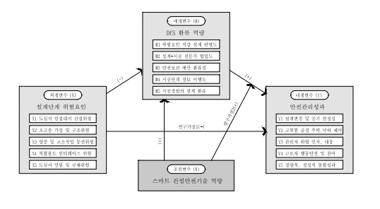

<!-- hwpx-p idx=1861 -->

<h1>제 3 장 연구방법(Research Methodology)</h1>

<!-- /hwpx-p idx=1861 -->

<!-- hwpx-p idx=1862 -->

<!-- /hwpx-p idx=1862 -->

<!-- hwpx-p idx=1863 -->

<h2>제 1 절 연구모형 설계</h2>

<!-- /hwpx-p idx=1863 -->

<!-- hwpx-p idx=1864 -->

<!-- /hwpx-p idx=1864 -->

<!-- hwpx-p idx=1865 -->

<h3>제 1 항 연구모형의 구성</h3>

<!-- /hwpx-p idx=1865 -->

<!-- hwpx-p idx=1866 -->

<!-- /hwpx-p idx=1866 -->

<!-- hwpx-p idx=1867 -->

  연구모형은 설계단계 위험요인이 안전관리성과에 직접 영향을 미치는 동시에 DfS 환류역량을 거쳐 간접적으로 영향을 미치고, 스마트 건설안전기술 역량이 이 관계를 조절하는 구조로 설계하였다. 네 잠재변수의 구성은 &lt;표 3-1&gt;과 같다.

<!-- /hwpx-p idx=1867 -->

<!-- hwpx-p idx=1868 -->

<!-- /hwpx-p idx=1868 -->

<!-- hwpx-p idx=1869 -->

&lt;표 3-1&gt; 연구모형의 변수 구성

<!-- /hwpx-p idx=1869 -->

<!-- hwpx-p idx=1870 -->

<table data-hwpx-table="46">
<tr>
<td rowspan="1" colspan="1" data-row="0" data-col="0">
<!-- hwpx-p idx=1871 -->
변수 구분
<!-- /hwpx-p idx=1871 -->
</td>
<td rowspan="1" colspan="1" data-row="0" data-col="1">
<!-- hwpx-p idx=1872 -->
잠재변수(기호)
<!-- /hwpx-p idx=1872 -->
</td>
<td rowspan="1" colspan="1" data-row="0" data-col="2">
<!-- hwpx-p idx=1873 -->
하위요인·측정항목
<!-- /hwpx-p idx=1873 -->
</td>
</tr>
<tr>
<td rowspan="1" colspan="1" data-row="1" data-col="0">
<!-- hwpx-p idx=1874 -->
외생변수
<!-- /hwpx-p idx=1874 -->
</td>
<td rowspan="1" colspan="1" data-row="1" data-col="1">
<!-- hwpx-p idx=1875 -->
설계단계 위험요인(X)
<!-- /hwpx-p idx=1875 -->
</td>
<td rowspan="1" colspan="1" data-row="1" data-col="2">
<!-- hwpx-p idx=1876 -->
도심지 인접 대지 간섭위험(X1), 초고층 가설 및 구조위험(X2), 양중 및 고소작업 동선위험(X3), 복합용도 인터페이스 위험(X4), 도심지 민원 및 규제위험(X5)
<!-- /hwpx-p idx=1876 -->
</td>
</tr>
<tr>
<td rowspan="1" colspan="1" data-row="2" data-col="0">
<!-- hwpx-p idx=1877 -->
매개변수
<!-- /hwpx-p idx=1877 -->
</td>
<td rowspan="1" colspan="1" data-row="2" data-col="1">
<!-- hwpx-p idx=1878 -->
DfS 환류역량(M)
<!-- /hwpx-p idx=1878 -->
</td>
<td rowspan="1" colspan="1" data-row="2" data-col="2">
<!-- hwpx-p idx=1879 -->
위험요인 저감 설계 반영도(M1), 설계-시공 전문가 협업도(M2), 안전보건 예산 환류성(M3), 시공단계 정보 이행도(M4), 시공경험의 설계 환류(M5)
<!-- /hwpx-p idx=1879 -->
</td>
</tr>
<tr>
<td rowspan="1" colspan="1" data-row="3" data-col="0">
<!-- hwpx-p idx=1880 -->
조절변수
<!-- /hwpx-p idx=1880 -->
</td>
<td rowspan="1" colspan="1" data-row="3" data-col="1">
<!-- hwpx-p idx=1881 -->
스마트 건설안전기술 역량(W)
<!-- /hwpx-p idx=1881 -->
</td>
<td rowspan="1" colspan="1" data-row="3" data-col="2">
<!-- hwpx-p idx=1882 -->
(측정항목) BIM 기반 3D 간섭 체크 역량(W1), 4D 시뮬레이션 활용 역량(W2), IoT/AI 기반 실시간 모니터링 역량(W3), 스마트 데이터 통합 플랫폼 역량(W4), 조직의 스마트 기술 수용도(W5)
<!-- /hwpx-p idx=1882 -->
</td>
</tr>
<tr>
<td rowspan="1" colspan="1" data-row="4" data-col="0">
<!-- hwpx-p idx=1883 -->
내생변수
<!-- /hwpx-p idx=1883 -->
</td>
<td rowspan="1" colspan="1" data-row="4" data-col="1">
<!-- hwpx-p idx=1884 -->
안전관리성과(Y)
<!-- /hwpx-p idx=1884 -->
</td>
<td rowspan="1" colspan="1" data-row="4" data-col="2">
<!-- hwpx-p idx=1885 -->
설계 변경 및 공기 안정성(Y1), 고위험 공정 추락·낙하 제어(Y2), 관리자 위험 인지·대응(Y3), 근로자 행동안전 및 참여(Y4), 정량적·정성적 통합성과(Y5)
<!-- /hwpx-p idx=1885 -->
</td>
</tr>
</table>

<!-- /hwpx-p idx=1870 -->

<!-- hwpx-p idx=1886 -->

<!-- /hwpx-p idx=1886 -->

<!-- hwpx-p idx=1887 -->

자료: 연구자 작성

<!-- /hwpx-p idx=1887 -->

<!-- hwpx-p idx=1888 -->

  설계단계 위험요인(X)은 인과구조의 최초 원인인 외생변수로, 잠재적 결함 관점과 PtD에 근거한다. DfS 환류역량(M)은 X의 영향을 받는 동시에 이를 안전관리성과(Y)로 전달하는 매개변수로, 조직학습이론과 지식관리이론에 근거한다. 스마트 건설안전기술 역량(W)은 착수 이전부터 보유하는 기술적 조건이어서 X의 영향을 받지 않으며, M이 Y로 전환되는 정도를 바꾸는 조절변수이자 M에 직접 영향을 미치는 변수이다. Y는 모든 경로가 수렴하는 내생변수로, 결과지표에 국한하지 않고 예방과 적응을 포함하는 통합적 성과로 규정하였다.

<!-- /hwpx-p idx=1888 -->

<!-- hwpx-p idx=1889 -->

  측정층의 구성은 변수마다 가설의 층위에 맞추었다. X는 연구가설 1-1&#126;1-5와 2-1&#126;2-5가 하위요인별로 설정되어 있으므로 다섯 하위요인을 각각 1차 요인으로 두어 구조모형에 개별 투입하고, 하위요인마다 5개 문항을 그대로 지표로 쓴다. 2차 요인으로 묶으면 X→Y 구조경로가 하나가 되어 하위요인별 가설을 검정할 수 없기 때문이다. 이 선택은 하위요인 간 다중공선성을 모형 안으로 들여오므로 분산팽창지수(VIF)와 공차한계로 진단하고, 기준을 넘는 경우 하위요인별 개별 모형을 보조 분석으로 함께 보고한다(제5절 제2항).

<!-- /hwpx-p idx=1889 -->

<!-- hwpx-p idx=1890 -->

  M과 Y는 상위개념 수준의 관계가 관심이므로 다섯 하위요인이 수렴하는 2차 요인으로 두었다. 하위요인 간 상관이 높아 개별 잠재변수로 투입하면 다중공선성이 발생할 수 있고, 2차 요인으로 구성하면 추정 모수를 줄여 모형의 간명성을 확보할 수 있기 때문이다. 관측지표로는 하위요인별 문항 평균(M은 3문항, Y는 5문항)을 쓰는 문항꾸러미 방식을 적용하였다(Marsh &amp; Hocevar, 1985; Little et al., 2002). W는 하위요인을 두지 않고 다섯 문항을 지표로 하는 단일 요인으로 구성하였다.

<!-- /hwpx-p idx=1890 -->

<!-- hwpx-p idx=1891 -->

  그 결과 관측지표는 X 25개, M과 Y 각 5개, W 5개로 모두 40개이며, 잠재요인당 3&#126;5개 지표가 적절하다는 권고(Kline, 2016)에도 부합한다. 연구모형이 상정하는 경로는 모두 일곱 개다. 네 개의 직접효과(X→Y, X→M, M→Y, W→M)와 W가 M→Y를 조절하는 상호작용효과가 개별 경로로 설정되며, 매개효과와 조절된 매개효과는 이들의 결합에서 도출된다.

<!-- /hwpx-p idx=1891 -->

<!-- hwpx-p idx=1892 -->

<!-- /hwpx-p idx=1892 -->

<!-- hwpx-p idx=1893 -->

<!-- /hwpx-p idx=1893 -->

<!-- hwpx-p idx=1894 -->

<h3>제 2 항 변수 간 인과관계의 메커니즘</h3>

<!-- /hwpx-p idx=1894 -->

<!-- hwpx-p idx=1895 -->

<!-- /hwpx-p idx=1895 -->

<!-- hwpx-p idx=1896 -->

   본 연구는 인과관계 성립의 세 조건인 공변성, 시간적 우선성, 통제를 충족하도록 연구모형을 설계하였으며, 그 충족 방식은 &lt;표 3-2&gt;와 같다.

<!-- /hwpx-p idx=1896 -->

<!-- hwpx-p idx=1897 -->

<!-- /hwpx-p idx=1897 -->

<!-- hwpx-p idx=1898 -->

&lt;표 3-2&gt; 인과관계 성립 조건의 충족 방식

<!-- /hwpx-p idx=1898 -->

<!-- hwpx-p idx=1899 -->

<table data-hwpx-table="47">
<tr>
<td rowspan="1" colspan="1" data-row="0" data-col="0">
<!-- hwpx-p idx=1900 -->
조건
<!-- /hwpx-p idx=1900 -->
</td>
<td rowspan="1" colspan="1" data-row="0" data-col="1">
<!-- hwpx-p idx=1901 -->
요구되는 내용
<!-- /hwpx-p idx=1901 -->
</td>
<td rowspan="1" colspan="1" data-row="0" data-col="2">
<!-- hwpx-p idx=1902 -->
본 연구의 충족 방식
<!-- /hwpx-p idx=1902 -->
</td>
</tr>
<tr>
<td rowspan="1" colspan="1" data-row="1" data-col="0">
<!-- hwpx-p idx=1903 -->
공변성
<!-- /hwpx-p idx=1903 -->
</td>
<td rowspan="1" colspan="1" data-row="1" data-col="1">
<!-- hwpx-p idx=1904 -->
원인이 변할 때 결과가 함께 변동
<!-- /hwpx-p idx=1904 -->
</td>
<td rowspan="1" colspan="1" data-row="1" data-col="2">
<!-- hwpx-p idx=1905 -->
네 경로(X→Y, X→M, M→Y, W→M)와 W의 M→Y 조절에 대한 이론적 근거 제시
<!-- /hwpx-p idx=1905 -->
</td>
</tr>
<tr>
<td rowspan="1" colspan="1" data-row="2" data-col="0">
<!-- hwpx-p idx=1906 -->
시간적 우선성
<!-- /hwpx-p idx=1906 -->
</td>
<td rowspan="1" colspan="1" data-row="2" data-col="1">
<!-- hwpx-p idx=1907 -->
원인이 결과보다 시간적으로 선행
<!-- /hwpx-p idx=1907 -->
</td>
<td rowspan="1" colspan="1" data-row="2" data-col="2">
<!-- hwpx-p idx=1908 -->
설계단계(X)가 시공단계의 환류(M)와 성과(Y)에 선행하는 프로젝트 진행 순서
<!-- /hwpx-p idx=1908 -->
</td>
</tr>
<tr>
<td rowspan="1" colspan="1" data-row="3" data-col="0">
<!-- hwpx-p idx=1909 -->
통제
<!-- /hwpx-p idx=1909 -->
</td>
<td rowspan="1" colspan="1" data-row="3" data-col="1">
<!-- hwpx-p idx=1910 -->
관계를 왜곡하는 혼란 요인의 배제
<!-- /hwpx-p idx=1910 -->
</td>
<td rowspan="1" colspan="1" data-row="3" data-col="2">
<!-- hwpx-p idx=1911 -->
1차로 목적표집과 응답 적격성 선별, 2차로 응답자 일반 특성의 통제변수 투입
<!-- /hwpx-p idx=1911 -->
</td>
</tr>
</table>

<!-- /hwpx-p idx=1899 -->

<!-- hwpx-p idx=1912 -->

<!-- /hwpx-p idx=1912 -->

<!-- hwpx-p idx=1913 -->

자료: 연구자 작성

<!-- /hwpx-p idx=1913 -->

<!-- hwpx-p idx=1914 -->

<!-- /hwpx-p idx=1914 -->

<!-- hwpx-p idx=1915 -->

  공변성은 경로별 이론적 근거로 확보하였다. X→Y는 설계단계의 잠재적 결함이 시공단계의 재해로 발현된다는 점(Reason, 1997; Behm, 2005), M→Y는 환류가 위험을 근원적으로 제거하는 기제라는 점(Argyris &amp; Schön, 1978; Winge et al., 2019)에 근거한다. W→M과 W의 M→Y 조절은 기술 기반이 환류활동을 촉진하고 정보의 정확성과 현장 도달률을 높인다는 점에 근거한다(Teece et al., 1997; Eastman et al., 2011).

<!-- /hwpx-p idx=1915 -->

<!-- hwpx-p idx=1916 -->

  X→M은 위험항목이 많고 얽힌 사업일수록 저감대책을 설계에 반영하기 어렵고(신원상·손창백, 2019), 공기 압박과 복잡한 사업 특성이 협업과 이행 확인을 약화시킨다는 점(Manu et al., 2012)에 근거한다. DfS 환류역량은 사전에 보유한 능력이 아니라 응답 현장에서 발현된 실행 수준이고 그 실행이 위험 조건 이후에 이루어지므로, 조절변수가 아닌 매개변수로 두었다.

<!-- /hwpx-p idx=1916 -->

<!-- hwpx-p idx=1917 -->

  시간적 우선성은 건설 프로젝트의 진행 순서에 근거한다. 횡단자료를 사용하지만 설계가 확정된 이후 시공이 진행되고 그 과정에서 성과가 나타나므로 역방향 인과를 상정하기 어렵다.

<!-- /hwpx-p idx=1917 -->

<!-- hwpx-p idx=1918 -->

  통제는 2단으로 설계하였다. 1차로 목적표집과 응답자 특성 문항을 이용하여 도심지 주상복합아파트 신축현장 근무 경험, 국내 종합건설업체 시공 현장, 공사금액 50억 원 이상, 스마트 안전장비 도입 현장, 안전관리 업무 수행의 다섯 조건을 충족하는 응답만 분석에 포함하고, 2차로 연령·경력·직종·공사금액 규모를 통제변수로 투입한다. 이 가운데 스마트 안전장비 도입 현장 조건은 조절변수(W)를 측정할 최소 조건이며, 측정 대상이 도입 여부가 아니라 활용 역량의 수준이므로 표본을 한정해도 조절변수의 분산은 유지된다.

<!-- /hwpx-p idx=1918 -->

<!-- hwpx-p idx=1919 -->

  이상의 조건을 충족하도록 설계한 연구모형은 &lt;그림 3-1&gt;과 같다.

<!-- /hwpx-p idx=1919 -->

<!-- hwpx-p idx=1920 -->

<!-- /hwpx-p idx=1920 -->

<!-- hwpx-p idx=1921 -->

&lt;그림 3-1&gt; 연구모형

<!-- /hwpx-p idx=1921 -->

<!-- hwpx-p idx=1922 -->

<!-- /hwpx-p idx=1922 -->

<!-- hwpx-p idx=1923 -->

<figure data-hwpx-picture="4">

원본 그림 객체 설명
<pre>그림입니다.
원본 그림의 이름: CLP000017840001.bmp
원본 그림의 크기: 가로 538pixel, 세로 296pixel</pre>
</figure>

<!-- /hwpx-p idx=1923 -->

<!-- hwpx-p idx=1924 -->

주) 연구가설 2(매개)와 4-1(조절된 매개)은 개별 경로의 결합에서 도출되므로 별도 경로로 표시하지 않았다.

<!-- /hwpx-p idx=1924 -->

<!-- hwpx-p idx=1925 -->

자료: 연구자 작성

<!-- /hwpx-p idx=1925 -->

<!-- hwpx-p idx=1926 -->

<h2>제 2 절 연구문제 및 연구가설</h2>

<!-- /hwpx-p idx=1926 -->

<!-- hwpx-p idx=1927 -->

<!-- /hwpx-p idx=1927 -->

<!-- hwpx-p idx=1928 -->

  본 연구는 제1절의 연구모형에 따라 네 가지 연구문제를 설정하고, 각 연구문제 아래에 연구가설을 둔다. 연구문제 1과 2는 설계단계 위험요인의 다섯 하위요인별로, 연구문제 3은 스마트 건설안전기술 역량의 다섯 측정항목별로 가설을 세우고, 연구문제 4는 변수 수준에서 가설을 세운다. 각 경로의 이론적 근거는 제1절 제2항에 제시하였다.

<!-- /hwpx-p idx=1928 -->

<!-- hwpx-p idx=1929 -->

  &#91;연구문제 1&#93; 설계단계 위험요인은 안전관리성과에 영향을 미치는가?

<!-- /hwpx-p idx=1929 -->

<!-- hwpx-p idx=1930 -->

　설계단계에서 제거되지 못한 잠재적 결함은 시공단계의 재해로 발현되므로, 각 하위요인은 안전관리성과에 부(−)의 영향을 미칠 것으로 예상한다.

<!-- /hwpx-p idx=1930 -->

<!-- hwpx-p idx=1931 -->

  연구가설 1-1: 도심지 인접 대지 간섭위험은 안전관리성과에 부(−)의 영향을 미칠 것이다.

<!-- /hwpx-p idx=1931 -->

<!-- hwpx-p idx=1932 -->

  연구가설 1-2: 초고층 가설 및 구조위험은 안전관리성과에 부(−)의 영향을 미칠 것이다.

<!-- /hwpx-p idx=1932 -->

<!-- hwpx-p idx=1933 -->

  연구가설 1-3: 양중 및 고소작업 동선위험은 안전관리성과에 부(−)의 영향을 미칠 것이다.

<!-- /hwpx-p idx=1933 -->

<!-- hwpx-p idx=1934 -->

  연구가설 1-4: 복합용도 인터페이스 위험은 안전관리성과에 부(−)의 영향을 미칠 것이다.

<!-- /hwpx-p idx=1934 -->

<!-- hwpx-p idx=1935 -->

  연구가설 1-5: 도심지 민원 및 규제위험은 안전관리성과에 부(−)의 영향을 미칠 것이다.

<!-- /hwpx-p idx=1935 -->

<!-- hwpx-p idx=1936 -->

  &#91;연구문제 2&#93; 설계단계 위험요인은 DfS 환류역량을 매개로 안전관리성과에 영향을 미치는가?

<!-- /hwpx-p idx=1936 -->

<!-- hwpx-p idx=1937 -->

　설계단계 위험요인은 환류 활동을 제약하고 DfS 환류역량은 안전관리성과를 높이므로 간접효과는 부(−)로 예상하며, 전제가 되는 두 경로도 함께 추정한다.

<!-- /hwpx-p idx=1937 -->

<!-- hwpx-p idx=1938 -->

  연구가설 2-1: 도심지 인접 대지 간섭위험은 DfS 환류역량을 매개로 안전관리성과에 부(−)의 영향을 미칠 것이다.

<!-- /hwpx-p idx=1938 -->

<!-- hwpx-p idx=1939 -->

  연구가설 2-2: 초고층 가설 및 구조위험은 DfS 환류역량을 매개로 안전관리성과에 부(−)의 영향을 미칠 것이다.

<!-- /hwpx-p idx=1939 -->

<!-- hwpx-p idx=1940 -->

  연구가설 2-3: 양중 및 고소작업 동선위험은 DfS 환류역량을 매개로 안전관리성과에 부(−)의 영향을 미칠 것이다.

<!-- /hwpx-p idx=1940 -->

<!-- hwpx-p idx=1941 -->

  연구가설 2-4: 복합용도 인터페이스 위험은 DfS 환류역량을 매개로 안전관리성과에 부(−)의 영향을 미칠 것이다.

<!-- /hwpx-p idx=1941 -->

<!-- hwpx-p idx=1942 -->

  연구가설 2-5: 도심지 민원 및 규제위험은 DfS 환류역량을 매개로 안전관리성과에 부(−)의 영향을 미칠 것이다.

<!-- /hwpx-p idx=1942 -->

<!-- hwpx-p idx=1943 -->

  &#91;연구문제 3&#93; 스마트 건설안전기술 역량은 DfS 환류역량과 안전관리성과의 관계에서 조절효과가 있는가?

<!-- /hwpx-p idx=1943 -->

<!-- hwpx-p idx=1944 -->

　기술 기반을 갖춘 조직일수록 환류가 성과로 전환되는 효율이 높아지므로 각 측정항목은 정(+)의 조절효과를 가질 것으로 예상하며, 스마트 건설안전기술 역량이 DfS 환류역량에 미치는 직접효과도 함께 추정한다.

<!-- /hwpx-p idx=1944 -->

<!-- hwpx-p idx=1945 -->

  연구가설 3-1: BIM 기반 3D 간섭 체크 역량은 DfS 환류역량과 안전관리성과의 관계에 정(+)의 조절효과를 미칠 것이다.

<!-- /hwpx-p idx=1945 -->

<!-- hwpx-p idx=1946 -->

  연구가설 3-2: 4D 시뮬레이션 활용 역량은 DfS 환류역량과 안전관리성과의 관계에 정(+)의 조절효과를 미칠 것이다.

<!-- /hwpx-p idx=1946 -->

<!-- hwpx-p idx=1947 -->

  연구가설 3-3: IoT/AI 기반 실시간 모니터링 역량은 DfS 환류역량과 안전관리성과의 관계에 정(+)의 조절효과를 미칠 것이다.

<!-- /hwpx-p idx=1947 -->

<!-- hwpx-p idx=1948 -->

  연구가설 3-4: 스마트 데이터 통합 플랫폼 역량은 DfS 환류역량과 안전관리성과의 관계에 정(+)의 조절효과를 미칠 것이다.

<!-- /hwpx-p idx=1948 -->

<!-- hwpx-p idx=1949 -->

  연구가설 3-5: 조직의 스마트 기술 수용도는 DfS 환류역량과 안전관리성과의 관계에 정(+)의 조절효과를 미칠 것이다.

<!-- /hwpx-p idx=1949 -->

<!-- hwpx-p idx=1950 -->

  &#91;연구문제 4&#93; 스마트 건설안전기술 역량은 설계단계 위험요인이 DfS 환류역량을 거쳐 안전관리성과에 이르는 매개효과를 조절하는가?

<!-- /hwpx-p idx=1950 -->

<!-- hwpx-p idx=1951 -->

　연구가설 4-1: 스마트 건설안전기술 역량은 설계단계 위험요인이 DfS 환류역량을 거쳐 안전관리성과에 이르는 부(−)의 간접효과를 강화하는 조절효과를 미칠 것이다.

<!-- /hwpx-p idx=1951 -->

<!-- hwpx-p idx=1952 -->

  여기서 강화는 기술 역량이 높을수록 환류 저하의 영향이 커진다는 뜻이다. 연구문제 4의 조절된 매개는 연구문제 2의 매개와 연구문제 3의 조절이 함께 성립할 때 성립하므로, 앞의 연구문제부터 순차적으로 검증한다.

<!-- /hwpx-p idx=1952 -->

<!-- hwpx-p idx=1953 -->

<h2>제 3 절 변수의 조작적 정의 및 측정도구 구성</h2>

<!-- /hwpx-p idx=1953 -->

<!-- hwpx-p idx=1954 -->

<!-- /hwpx-p idx=1954 -->

<!-- hwpx-p idx=1955 -->

  본 절은 네 잠재변수의 조작적 정의와 측정도구 구성을 제시한다. 외생변수(X)와 내생변수(Y)는 하위요인마다 5개 문항을 두어 각 25문항으로, 매개변수(M)는 하위요인마다 3개 문항을 두어 15문항으로, 조절변수(W)는 하위요인 없이 5문항으로 측정하므로 본문항은 모두 70문항이다. 모든 문항은 리커트 5점 척도(1점 '전혀 그렇지 않다'&#126;5점 '매우 그렇다')로 측정하며, 요인구조의 왜곡을 피하기 위해 역문항은 두지 않는다. 네 잠재변수의 조작적 정의와 이론적 출처는 &lt;표 3-3&gt;과 같다.

<!-- /hwpx-p idx=1955 -->

<!-- hwpx-p idx=1956 -->

<!-- /hwpx-p idx=1956 -->

<!-- hwpx-p idx=1957 -->

&lt;표 3-3&gt; 변수의 조작적 정의와 측정도구 총괄

<!-- /hwpx-p idx=1957 -->

<!-- hwpx-p idx=1958 -->

<table data-hwpx-table="48">
<tr>
<td rowspan="1" colspan="1" data-row="0" data-col="0">
<!-- hwpx-p idx=1959 -->
변수구분
<!-- /hwpx-p idx=1959 -->
</td>
<td rowspan="1" colspan="1" data-row="0" data-col="1">
<!-- hwpx-p idx=1960 -->
잠재변수명
<!-- /hwpx-p idx=1960 -->
</td>
<td rowspan="1" colspan="1" data-row="0" data-col="2">
<!-- hwpx-p idx=1961 -->
조작적 정의
<!-- /hwpx-p idx=1961 -->
</td>
<td rowspan="1" colspan="1" data-row="0" data-col="3">
<!-- hwpx-p idx=1962 -->
측정도구의 이론적 출처
<!-- /hwpx-p idx=1962 -->
</td>
</tr>
<tr>
<td rowspan="1" colspan="1" data-row="1" data-col="0">
<!-- hwpx-p idx=1963 -->
외생변수 (X)
<!-- /hwpx-p idx=1963 -->
</td>
<td rowspan="1" colspan="1" data-row="1" data-col="1">
<!-- hwpx-p idx=1964 -->
설계단계 위험요인
<!-- /hwpx-p idx=1964 -->
</td>
<td rowspan="1" colspan="1" data-row="1" data-col="2">
<!-- hwpx-p idx=1965 -->
도심지 주상복합아파트 설계단계에서 인접 대지 간섭, 구조·가설, 양중 동선, 용도 간 인터페이스, 민원·규제 등 잠재적 결함으로 식별되는 위험의 인식 정도
<!-- /hwpx-p idx=1965 -->
</td>
<td rowspan="1" colspan="1" data-row="1" data-col="3">
<!-- hwpx-p idx=1966 -->
Reason(1997), Behm(2005), Gambatese et al.(2008), 국토안전관리원(2026)
<!-- /hwpx-p idx=1966 -->
</td>
</tr>
<tr>
<td rowspan="1" colspan="1" data-row="2" data-col="0">
<!-- hwpx-p idx=1967 -->
매개변수 (M)
<!-- /hwpx-p idx=1967 -->
</td>
<td rowspan="1" colspan="1" data-row="2" data-col="1">
<!-- hwpx-p idx=1968 -->
DfS 환류역량
<!-- /hwpx-p idx=1968 -->
</td>
<td rowspan="1" colspan="1" data-row="2" data-col="2">
<!-- hwpx-p idx=1969 -->
설계 검토로 확인한 위험을 설계에 반영하고, 협업과 자원 배분, 시공단계 정보 이행을 거쳐 그 결과가 다시 설계로 되돌아오는 조직의 순환적 실행역량
<!-- /hwpx-p idx=1969 -->
</td>
<td rowspan="1" colspan="1" data-row="2" data-col="3">
<!-- hwpx-p idx=1970 -->
Argyris &amp; Schön(1978), Nonaka &amp; Takeuchi(1995), 「건설기술 진흥법」 시행령, 국토안전관리원(2026)
<!-- /hwpx-p idx=1970 -->
</td>
</tr>
<tr>
<td rowspan="1" colspan="1" data-row="3" data-col="0">
<!-- hwpx-p idx=1971 -->
조절변수 (W)
<!-- /hwpx-p idx=1971 -->
</td>
<td rowspan="1" colspan="1" data-row="3" data-col="1">
<!-- hwpx-p idx=1972 -->
스마트 건설안전기술 역량
<!-- /hwpx-p idx=1972 -->
</td>
<td rowspan="1" colspan="1" data-row="3" data-col="2">
<!-- hwpx-p idx=1973 -->
BIM 간섭 체크, 4D 시뮬레이션, IoT 센서, 데이터 플랫폼 등 스마트 기술을 현장 안전에 활용하는 조직의 활용 수준
<!-- /hwpx-p idx=1973 -->
</td>
<td rowspan="1" colspan="1" data-row="3" data-col="3">
<!-- hwpx-p idx=1974 -->
Barney(1991), Teece et al.(1997), Davis(1989), Succar(2009)
<!-- /hwpx-p idx=1974 -->
</td>
</tr>
<tr>
<td rowspan="1" colspan="1" data-row="4" data-col="0">
<!-- hwpx-p idx=1975 -->
내생변수 (Y)
<!-- /hwpx-p idx=1975 -->
</td>
<td rowspan="1" colspan="1" data-row="4" data-col="1">
<!-- hwpx-p idx=1976 -->
안전관리
<!-- /hwpx-p idx=1976 -->
<!-- hwpx-p idx=1977 -->
성과
<!-- /hwpx-p idx=1977 -->
</td>
<td rowspan="1" colspan="1" data-row="4" data-col="2">
<!-- hwpx-p idx=1978 -->
설계 변경과 공기 안정성, 추락·낙하 통제, 관리자의 위험 인지·대응, 근로자 행동안전과 참여, 통합성과로 나타나는 조직의 종합적 안전관리 성과
<!-- /hwpx-p idx=1978 -->
</td>
<td rowspan="1" colspan="1" data-row="4" data-col="3">
<!-- hwpx-p idx=1979 -->
Heinrich(1931), Endsley(1995), Kaplan &amp; Norton(1992), Hinze(2006)
<!-- /hwpx-p idx=1979 -->
</td>
</tr>
</table>

<!-- /hwpx-p idx=1958 -->

<!-- hwpx-p idx=1980 -->

<!-- /hwpx-p idx=1980 -->

<!-- hwpx-p idx=1981 -->

자료: 연구자 작성

<!-- /hwpx-p idx=1981 -->

<!-- hwpx-p idx=1982 -->

<h3>제 1 항 설계단계 위험요인</h3>

<!-- /hwpx-p idx=1982 -->

<!-- hwpx-p idx=1983 -->

<!-- /hwpx-p idx=1983 -->

<!-- hwpx-p idx=1984 -->

  설계단계 위험요인(X)은 도심지 주상복합아파트의 설계단계에서 식별되어 시공단계 안전관리성과에 영향을 미치는 잠재적 결함(Latent Conditions)의 인식 정도로 정의한다(Reason, 1997). 이는 작업자의 불안전한 행동에 앞서 설계 의사결정 단계에 내재하는 결함을 가리키며, 점수가 높을수록 응답 현장의 설계단계 위험요인이 크다고 인식함을 의미한다. 다섯 하위요인의 문항 수와 문항 번호, 조작적 정의, 근거 문헌은 &lt;표 3-4&gt;와 같다.

<!-- /hwpx-p idx=1984 -->

<!-- hwpx-p idx=1985 -->

<!-- /hwpx-p idx=1985 -->

<!-- hwpx-p idx=1986 -->

&lt;표 3-4&gt; 외생변수(X) 설계단계 위험요인의 측정도구 구성

<!-- /hwpx-p idx=1986 -->

<!-- hwpx-p idx=1987 -->

<table data-hwpx-table="49">
<tr>
<td rowspan="1" colspan="1" data-row="0" data-col="0">
<!-- hwpx-p idx=1988 -->
하위요인
<!-- /hwpx-p idx=1988 -->
</td>
<td rowspan="1" colspan="1" data-row="0" data-col="1">
<!-- hwpx-p idx=1989 -->
문항 수
<!-- /hwpx-p idx=1989 -->
</td>
<td rowspan="1" colspan="1" data-row="0" data-col="2">
<!-- hwpx-p idx=1990 -->
문항 번호
<!-- /hwpx-p idx=1990 -->
</td>
<td rowspan="1" colspan="1" data-row="0" data-col="3">
<!-- hwpx-p idx=1991 -->
조작적 정의 요약
<!-- /hwpx-p idx=1991 -->
</td>
<td rowspan="1" colspan="1" data-row="0" data-col="4">
<!-- hwpx-p idx=1992 -->
근거 문헌(저자, 연도)
<!-- /hwpx-p idx=1992 -->
</td>
</tr>
<tr>
<td rowspan="1" colspan="1" data-row="1" data-col="0">
<!-- hwpx-p idx=1993 -->
X1 도심지 인접 대지 간섭위험
<!-- /hwpx-p idx=1993 -->
</td>
<td rowspan="1" colspan="1" data-row="1" data-col="1">
<!-- hwpx-p idx=1994 -->
5
<!-- /hwpx-p idx=1994 -->
</td>
<td rowspan="1" colspan="1" data-row="1" data-col="2">
<!-- hwpx-p idx=1995 -->
X1-1&#126;X1-5
<!-- /hwpx-p idx=1995 -->
</td>
<td rowspan="1" colspan="1" data-row="1" data-col="3">
<!-- hwpx-p idx=1996 -->
협소한 대지·인접 시설물·지하매설물과의 공간적·구조적 간섭 위험
<!-- /hwpx-p idx=1996 -->
</td>
<td rowspan="1" colspan="1" data-row="1" data-col="4">
<!-- hwpx-p idx=1997 -->
Behm(2005), 한병수 외(2007), 원유진·강경식(2019)
<!-- /hwpx-p idx=1997 -->
</td>
</tr>
<tr>
<td rowspan="1" colspan="1" data-row="2" data-col="0">
<!-- hwpx-p idx=1998 -->
X2 초고층 가설 및 구조위험
<!-- /hwpx-p idx=1998 -->
</td>
<td rowspan="1" colspan="1" data-row="2" data-col="1">
<!-- hwpx-p idx=1999 -->
5
<!-- /hwpx-p idx=1999 -->
</td>
<td rowspan="1" colspan="1" data-row="2" data-col="2">
<!-- hwpx-p idx=2000 -->
X2-1&#126;X2-5
<!-- /hwpx-p idx=2000 -->
</td>
<td rowspan="1" colspan="1" data-row="2" data-col="3">
<!-- hwpx-p idx=2001 -->
특수 가설구조물과 구조시스템의 설계 복잡성에 따른 구조적 안정성 위험
<!-- /hwpx-p idx=2001 -->
</td>
<td rowspan="1" colspan="1" data-row="2" data-col="4">
<!-- hwpx-p idx=2002 -->
Gambatese et al.(2008), 황영진·김재요(2015), 김수용 외(2016)
<!-- /hwpx-p idx=2002 -->
</td>
</tr>
<tr>
<td rowspan="1" colspan="1" data-row="3" data-col="0">
<!-- hwpx-p idx=2003 -->
X3 양중 및 고소작업 동선위험
<!-- /hwpx-p idx=2003 -->
</td>
<td rowspan="1" colspan="1" data-row="3" data-col="1">
<!-- hwpx-p idx=2004 -->
5
<!-- /hwpx-p idx=2004 -->
</td>
<td rowspan="1" colspan="1" data-row="3" data-col="2">
<!-- hwpx-p idx=2005 -->
X3-1&#126;X3-5
<!-- /hwpx-p idx=2005 -->
</td>
<td rowspan="1" colspan="1" data-row="3" data-col="3">
<!-- hwpx-p idx=2006 -->
양중장비 작업반경과 작업자·자재 동선의 중첩으로 인한 낙하·충돌·추락 위험
<!-- /hwpx-p idx=2006 -->
</td>
<td rowspan="1" colspan="1" data-row="3" data-col="4">
<!-- hwpx-p idx=2007 -->
Zhang et al.(2015), 김남균(2012), 손승현 외(2022)
<!-- /hwpx-p idx=2007 -->
</td>
</tr>
<tr>
<td rowspan="1" colspan="1" data-row="4" data-col="0">
<!-- hwpx-p idx=2008 -->
X4 복합용도 인터페이스 위험
<!-- /hwpx-p idx=2008 -->
</td>
<td rowspan="1" colspan="1" data-row="4" data-col="1">
<!-- hwpx-p idx=2009 -->
5
<!-- /hwpx-p idx=2009 -->
</td>
<td rowspan="1" colspan="1" data-row="4" data-col="2">
<!-- hwpx-p idx=2010 -->
X4-1&#126;X4-5
<!-- /hwpx-p idx=2010 -->
</td>
<td rowspan="1" colspan="1" data-row="4" data-col="3">
<!-- hwpx-p idx=2011 -->
전이층·설비 연결부의 공종 간 간섭과 설계 불일치 위험
<!-- /hwpx-p idx=2011 -->
</td>
<td rowspan="1" colspan="1" data-row="4" data-col="4">
<!-- hwpx-p idx=2012 -->
Eastman et al.(2011), 서장우·강경인(2009), 유용흠·김진욱(2014)
<!-- /hwpx-p idx=2012 -->
</td>
</tr>
<tr>
<td rowspan="1" colspan="1" data-row="5" data-col="0">
<!-- hwpx-p idx=2013 -->
X5 도심지 민원 및 규제위험
<!-- /hwpx-p idx=2013 -->
</td>
<td rowspan="1" colspan="1" data-row="5" data-col="1">
<!-- hwpx-p idx=2014 -->
5
<!-- /hwpx-p idx=2014 -->
</td>
<td rowspan="1" colspan="1" data-row="5" data-col="2">
<!-- hwpx-p idx=2015 -->
X5-1&#126;X5-5
<!-- /hwpx-p idx=2015 -->
</td>
<td rowspan="1" colspan="1" data-row="5" data-col="3">
<!-- hwpx-p idx=2016 -->
민원과 행정규제로 인한 설계변경·공기압박 위험
<!-- /hwpx-p idx=2016 -->
</td>
<td rowspan="1" colspan="1" data-row="5" data-col="4">
<!-- hwpx-p idx=2017 -->
Assaf &amp; Al-Hejji(2006), 조태제·최종수(2011), 홍성우 외(2009)
<!-- /hwpx-p idx=2017 -->
</td>
</tr>
<tr>
<td rowspan="1" colspan="1" data-row="6" data-col="0">
<!-- hwpx-p idx=2018 -->
계
<!-- /hwpx-p idx=2018 -->
</td>
<td rowspan="1" colspan="1" data-row="6" data-col="1">
<!-- hwpx-p idx=2019 -->
25
<!-- /hwpx-p idx=2019 -->
</td>
<td rowspan="1" colspan="1" data-row="6" data-col="2">
<!-- hwpx-p idx=2020 -->
X1-1&#126;X5-5
<!-- /hwpx-p idx=2020 -->
</td>
<td rowspan="1" colspan="1" data-row="6" data-col="3">
<!-- hwpx-p idx=2021 -->
-
<!-- /hwpx-p idx=2021 -->
</td>
<td rowspan="1" colspan="1" data-row="6" data-col="4">
<!-- hwpx-p idx=2022 -->
-
<!-- /hwpx-p idx=2022 -->
</td>
</tr>
</table>

<!-- /hwpx-p idx=1987 -->

<!-- hwpx-p idx=2023 -->

<!-- /hwpx-p idx=2023 -->

<!-- hwpx-p idx=2024 -->

자료: 연구자 작성

<!-- /hwpx-p idx=2024 -->

<!-- hwpx-p idx=2025 -->

<!-- /hwpx-p idx=2025 -->

<!-- hwpx-p idx=2026 -->

<h3>제 2 항 DfS 환류역량</h3>

<!-- /hwpx-p idx=2026 -->

<!-- hwpx-p idx=2027 -->

<!-- /hwpx-p idx=2027 -->

<!-- hwpx-p idx=2028 -->

  DfS 환류역량(M)은 DfS로 도출한 위험정보가 저감대책으로 설계에 반영되고, 협업과 자원 배분을 거쳐 시공단계의 정보 이행으로 연결되며, 그 결과가 다시 후속 설계에 반영되는 조직의 순환적 실행역량으로 정의한다(Argyris &amp; Schön, 1978; Nonaka &amp; Takeuchi, 1995). 다섯 하위요인의 문항 수와 문항 번호, 조작적 정의, 근거 문헌은 &lt;표 3-5&gt;와 같다.

<!-- /hwpx-p idx=2028 -->

<!-- hwpx-p idx=2029 -->

<!-- /hwpx-p idx=2029 -->

<!-- hwpx-p idx=2030 -->

&lt;표 3-5&gt; 매개변수(M) DfS 환류역량의 측정도구 구성

<!-- /hwpx-p idx=2030 -->

<!-- hwpx-p idx=2031 -->

<table data-hwpx-table="50">
<tr>
<td rowspan="1" colspan="1" data-row="0" data-col="0">
<!-- hwpx-p idx=2032 -->
하위요인
<!-- /hwpx-p idx=2032 -->
</td>
<td rowspan="1" colspan="1" data-row="0" data-col="1">
<!-- hwpx-p idx=2033 -->
문항 수
<!-- /hwpx-p idx=2033 -->
</td>
<td rowspan="1" colspan="1" data-row="0" data-col="2">
<!-- hwpx-p idx=2034 -->
문항 번호
<!-- /hwpx-p idx=2034 -->
</td>
<td rowspan="1" colspan="1" data-row="0" data-col="3">
<!-- hwpx-p idx=2035 -->
조작적 정의 요약
<!-- /hwpx-p idx=2035 -->
</td>
<td rowspan="1" colspan="1" data-row="0" data-col="4">
<!-- hwpx-p idx=2036 -->
근거 문헌(저자, 연도)
<!-- /hwpx-p idx=2036 -->
</td>
</tr>
<tr>
<td rowspan="1" colspan="1" data-row="1" data-col="0">
<!-- hwpx-p idx=2037 -->
M1 위험요인 저감 설계 반영도
<!-- /hwpx-p idx=2037 -->
</td>
<td rowspan="1" colspan="1" data-row="1" data-col="1">
<!-- hwpx-p idx=2038 -->
3
<!-- /hwpx-p idx=2038 -->
</td>
<td rowspan="1" colspan="1" data-row="1" data-col="2">
<!-- hwpx-p idx=2039 -->
M1-1&#126;M1-3
<!-- /hwpx-p idx=2039 -->
</td>
<td rowspan="1" colspan="1" data-row="1" data-col="3">
<!-- hwpx-p idx=2040 -->
DfS로 도출한 위험의 저감대책을 설계도서에 반영하여 위험을 근원적으로 제거·저감하는 수준
<!-- /hwpx-p idx=2040 -->
</td>
<td rowspan="1" colspan="1" data-row="1" data-col="4">
<!-- hwpx-p idx=2041 -->
Behm(2005), Gambatese et al.(1997), 한병수 외(2007)
<!-- /hwpx-p idx=2041 -->
</td>
</tr>
<tr>
<td rowspan="1" colspan="1" data-row="2" data-col="0">
<!-- hwpx-p idx=2042 -->
M2 설계-시공 전문가 협업도
<!-- /hwpx-p idx=2042 -->
</td>
<td rowspan="1" colspan="1" data-row="2" data-col="1">
<!-- hwpx-p idx=2043 -->
3
<!-- /hwpx-p idx=2043 -->
</td>
<td rowspan="1" colspan="1" data-row="2" data-col="2">
<!-- hwpx-p idx=2044 -->
M2-1&#126;M2-3
<!-- /hwpx-p idx=2044 -->
</td>
<td rowspan="1" colspan="1" data-row="2" data-col="3">
<!-- hwpx-p idx=2045 -->
설계자·시공자·안전관리자의 조기 참여와 정보공유·공동검토 수준
<!-- /hwpx-p idx=2045 -->
</td>
<td rowspan="1" colspan="1" data-row="2" data-col="4">
<!-- hwpx-p idx=2046 -->
Toole &amp; Gambatese(2008), 
<!-- /hwpx-p idx=2046 -->
<!-- hwpx-p idx=2047 -->
이치주(2025), 국토안전관리원(2026)
<!-- /hwpx-p idx=2047 -->
</td>
</tr>
<tr>
<td rowspan="1" colspan="1" data-row="3" data-col="0">
<!-- hwpx-p idx=2048 -->
M3 안전보건 예산 환류성
<!-- /hwpx-p idx=2048 -->
</td>
<td rowspan="1" colspan="1" data-row="3" data-col="1">
<!-- hwpx-p idx=2049 -->
3
<!-- /hwpx-p idx=2049 -->
</td>
<td rowspan="1" colspan="1" data-row="3" data-col="2">
<!-- hwpx-p idx=2050 -->
M3-1&#126;M3-3
<!-- /hwpx-p idx=2050 -->
</td>
<td rowspan="1" colspan="1" data-row="3" data-col="3">
<!-- hwpx-p idx=2051 -->
DfS 결과가 위험 수준에 따른 안전관리비·자원 배분으로 연계되는 수준
<!-- /hwpx-p idx=2051 -->
</td>
<td rowspan="1" colspan="1" data-row="3" data-col="4">
<!-- hwpx-p idx=2052 -->
배규식 외(2013), 김정해·오윤경(2023), 최민제 외(2025)
<!-- /hwpx-p idx=2052 -->
</td>
</tr>
<tr>
<td rowspan="1" colspan="1" data-row="4" data-col="0">
<!-- hwpx-p idx=2053 -->
M4 시공단계 정보 이행도
<!-- /hwpx-p idx=2053 -->
</td>
<td rowspan="1" colspan="1" data-row="4" data-col="1">
<!-- hwpx-p idx=2054 -->
3
<!-- /hwpx-p idx=2054 -->
</td>
<td rowspan="1" colspan="1" data-row="4" data-col="2">
<!-- hwpx-p idx=2055 -->
M4-1&#126;M4-3
<!-- /hwpx-p idx=2055 -->
</td>
<td rowspan="1" colspan="1" data-row="4" data-col="3">
<!-- hwpx-p idx=2056 -->
설계 안전정보가 현장에 정확히 전달되어 실제 작업으로 실행되고 이행이 확인되는 수준
<!-- /hwpx-p idx=2056 -->
</td>
<td rowspan="1" colspan="1" data-row="4" data-col="4">
<!-- hwpx-p idx=2057 -->
Winge et al.(2019), 이동건(2015), 국토안전관리원(2026), 영국 CDM 2015 제12조
<!-- /hwpx-p idx=2057 -->
</td>
</tr>
<tr>
<td rowspan="1" colspan="1" data-row="5" data-col="0">
<!-- hwpx-p idx=2058 -->
M5 시공경험의 설계 환류
<!-- /hwpx-p idx=2058 -->
</td>
<td rowspan="1" colspan="1" data-row="5" data-col="1">
<!-- hwpx-p idx=2059 -->
3
<!-- /hwpx-p idx=2059 -->
</td>
<td rowspan="1" colspan="1" data-row="5" data-col="2">
<!-- hwpx-p idx=2060 -->
M5-1&#126;M5-3
<!-- /hwpx-p idx=2060 -->
</td>
<td rowspan="1" colspan="1" data-row="5" data-col="3">
<!-- hwpx-p idx=2061 -->
시공에서 확인된 설계상의 문제가 설계 개선으로 이어지고 조직의 설계기준으로 축적되는 수준
<!-- /hwpx-p idx=2061 -->
</td>
<td rowspan="1" colspan="1" data-row="5" data-col="4">
<!-- hwpx-p idx=2062 -->
Argyris &amp; Schön(1978), Henderson et al.(2013), 신주열(2017, 2019), Che Ibrahim et al.(2026), 영국 CDM 2015 제12조
<!-- /hwpx-p idx=2062 -->
</td>
</tr>
<tr>
<td rowspan="1" colspan="1" data-row="6" data-col="0">
<!-- hwpx-p idx=2063 -->
계
<!-- /hwpx-p idx=2063 -->
</td>
<td rowspan="1" colspan="1" data-row="6" data-col="1">
<!-- hwpx-p idx=2064 -->
15
<!-- /hwpx-p idx=2064 -->
</td>
<td rowspan="1" colspan="1" data-row="6" data-col="2">
<!-- hwpx-p idx=2065 -->
M1-1&#126;M5-3
<!-- /hwpx-p idx=2065 -->
</td>
<td rowspan="1" colspan="1" data-row="6" data-col="3">
<!-- hwpx-p idx=2066 -->
-
<!-- /hwpx-p idx=2066 -->
</td>
<td rowspan="1" colspan="1" data-row="6" data-col="4">
<!-- hwpx-p idx=2067 -->
-
<!-- /hwpx-p idx=2067 -->
</td>
</tr>
</table>

<!-- /hwpx-p idx=2031 -->

<!-- hwpx-p idx=2068 -->

<!-- /hwpx-p idx=2068 -->

<!-- hwpx-p idx=2069 -->

자료: 연구자 작성

<!-- /hwpx-p idx=2069 -->

<!-- hwpx-p idx=2070 -->

<h3>제 3 항 스마트 건설안전기술 역량</h3>

<!-- /hwpx-p idx=2070 -->

<!-- hwpx-p idx=2071 -->

<!-- /hwpx-p idx=2071 -->

<!-- hwpx-p idx=2072 -->

  스마트 건설안전기술 역량(W)은 BIM·IoT·AI 등 스마트 기술을 활용하여 설계단계 위험정보를 시공단계까지 전달하는 조직의 활용 수준으로 정의한다(Barney, 1991; Davis, 1989). 하위요인 없이 다섯 항목을 각각 한 문항으로 측정하며, 항목별 조절효과(연구가설 3-1&#126;3-5)에는 각 문항을 단일 지표로, 조절된 매개효과(연구가설 4-1)에는 다섯 문항을 한 요인으로 투입한다. 단일 지표의 측정오차 한계는 제4장에서 점검하며, 측정도구의 구성은 &lt;표 3-6&gt;과 같다.

<!-- /hwpx-p idx=2072 -->

<!-- hwpx-p idx=2073 -->

<!-- /hwpx-p idx=2073 -->

<!-- hwpx-p idx=2074 -->

&lt;표 3-6&gt; 조절변수(W) 스마트 건설안전기술 역량의 측정도구 구성

<!-- /hwpx-p idx=2074 -->

<!-- hwpx-p idx=2075 -->

<table data-hwpx-table="51">
<tr>
<td rowspan="1" colspan="1" data-row="0" data-col="0">
<!-- hwpx-p idx=2076 -->
측정항목
<!-- /hwpx-p idx=2076 -->
</td>
<td rowspan="1" colspan="1" data-row="0" data-col="1">
<!-- hwpx-p idx=2077 -->
문항 수
<!-- /hwpx-p idx=2077 -->
</td>
<td rowspan="1" colspan="1" data-row="0" data-col="2">
<!-- hwpx-p idx=2078 -->
문항 번호
<!-- /hwpx-p idx=2078 -->
</td>
<td rowspan="1" colspan="1" data-row="0" data-col="3">
<!-- hwpx-p idx=2079 -->
조작적 정의 요약
<!-- /hwpx-p idx=2079 -->
</td>
<td rowspan="1" colspan="1" data-row="0" data-col="4">
<!-- hwpx-p idx=2080 -->
근거 문헌(저자, 연도)
<!-- /hwpx-p idx=2080 -->
</td>
</tr>
<tr>
<td rowspan="1" colspan="1" data-row="1" data-col="0">
<!-- hwpx-p idx=2081 -->
W1 BIM 기반 3D 간섭 체크 역량
<!-- /hwpx-p idx=2081 -->
</td>
<td rowspan="1" colspan="1" data-row="1" data-col="1">
<!-- hwpx-p idx=2082 -->
1
<!-- /hwpx-p idx=2082 -->
</td>
<td rowspan="1" colspan="1" data-row="1" data-col="2">
<!-- hwpx-p idx=2083 -->
W1
<!-- /hwpx-p idx=2083 -->
</td>
<td rowspan="1" colspan="1" data-row="1" data-col="3">
<!-- hwpx-p idx=2084 -->
BIM 3D 모델로 구조·설비·마감 간 간섭을 사전에 식별·제거하는 역량
<!-- /hwpx-p idx=2084 -->
</td>
<td rowspan="1" colspan="1" data-row="1" data-col="4">
<!-- hwpx-p idx=2085 -->
Eastman et al.(2011), Succar(2009), 황재웅 외(2024)
<!-- /hwpx-p idx=2085 -->
</td>
</tr>
<tr>
<td rowspan="1" colspan="1" data-row="2" data-col="0">
<!-- hwpx-p idx=2086 -->
W2 4D 시뮬레이션 활용 역량
<!-- /hwpx-p idx=2086 -->
</td>
<td rowspan="1" colspan="1" data-row="2" data-col="1">
<!-- hwpx-p idx=2087 -->
1
<!-- /hwpx-p idx=2087 -->
</td>
<td rowspan="1" colspan="1" data-row="2" data-col="2">
<!-- hwpx-p idx=2088 -->
W2
<!-- /hwpx-p idx=2088 -->
</td>
<td rowspan="1" colspan="1" data-row="2" data-col="3">
<!-- hwpx-p idx=2089 -->
공정일정을 연계하여 시공순서·작업동선의 충돌을 가상으로 검증하는 역량
<!-- /hwpx-p idx=2089 -->
</td>
<td rowspan="1" colspan="1" data-row="2" data-col="4">
<!-- hwpx-p idx=2090 -->
Zhang et al.(2015), 이경하 외(2009)
<!-- /hwpx-p idx=2090 -->
</td>
</tr>
<tr>
<td rowspan="1" colspan="1" data-row="3" data-col="0">
<!-- hwpx-p idx=2091 -->
W3 IoT/AI 기반 실시간 모니터링 역량
<!-- /hwpx-p idx=2091 -->
</td>
<td rowspan="1" colspan="1" data-row="3" data-col="1">
<!-- hwpx-p idx=2092 -->
1
<!-- /hwpx-p idx=2092 -->
</td>
<td rowspan="1" colspan="1" data-row="3" data-col="2">
<!-- hwpx-p idx=2093 -->
W3
<!-- /hwpx-p idx=2093 -->
</td>
<td rowspan="1" colspan="1" data-row="3" data-col="3">
<!-- hwpx-p idx=2094 -->
센서와 영상분석으로 위험을 실시간 감지·전달·대응하는 역량
<!-- /hwpx-p idx=2094 -->
</td>
<td rowspan="1" colspan="1" data-row="3" data-col="4">
<!-- hwpx-p idx=2095 -->
Teizer &amp; Cheng(2015), 이슬 외(2022), 강휘진 외(2024)
<!-- /hwpx-p idx=2095 -->
</td>
</tr>
<tr>
<td rowspan="1" colspan="1" data-row="4" data-col="0">
<!-- hwpx-p idx=2096 -->
W4 스마트 데이터 통합 플랫폼 역량
<!-- /hwpx-p idx=2096 -->
</td>
<td rowspan="1" colspan="1" data-row="4" data-col="1">
<!-- hwpx-p idx=2097 -->
1
<!-- /hwpx-p idx=2097 -->
</td>
<td rowspan="1" colspan="1" data-row="4" data-col="2">
<!-- hwpx-p idx=2098 -->
W4
<!-- /hwpx-p idx=2098 -->
</td>
<td rowspan="1" colspan="1" data-row="4" data-col="3">
<!-- hwpx-p idx=2099 -->
위험정보·사고사례·센서데이터를 통합·분석하고 설계에 환류하는 역량
<!-- /hwpx-p idx=2099 -->
</td>
<td rowspan="1" colspan="1" data-row="4" data-col="4">
<!-- hwpx-p idx=2100 -->
Succar(2009), 이동건(2015), Collinge et al.(2022)
<!-- /hwpx-p idx=2100 -->
</td>
</tr>
<tr>
<td rowspan="1" colspan="1" data-row="5" data-col="0">
<!-- hwpx-p idx=2101 -->
W5 조직의 스마트 기술 수용도
<!-- /hwpx-p idx=2101 -->
</td>
<td rowspan="1" colspan="1" data-row="5" data-col="1">
<!-- hwpx-p idx=2102 -->
1
<!-- /hwpx-p idx=2102 -->
</td>
<td rowspan="1" colspan="1" data-row="5" data-col="2">
<!-- hwpx-p idx=2103 -->
W5
<!-- /hwpx-p idx=2103 -->
</td>
<td rowspan="1" colspan="1" data-row="5" data-col="3">
<!-- hwpx-p idx=2104 -->
구성원의 기술 유용성·사용용이성 인식 및 지속적 활용 수준
<!-- /hwpx-p idx=2104 -->
</td>
<td rowspan="1" colspan="1" data-row="5" data-col="4">
<!-- hwpx-p idx=2105 -->
Davis(1989), Teece et al.(1997), 차희성 외(2021)
<!-- /hwpx-p idx=2105 -->
</td>
</tr>
<tr>
<td rowspan="1" colspan="1" data-row="6" data-col="0">
<!-- hwpx-p idx=2106 -->
계
<!-- /hwpx-p idx=2106 -->
</td>
<td rowspan="1" colspan="1" data-row="6" data-col="1">
<!-- hwpx-p idx=2107 -->
5
<!-- /hwpx-p idx=2107 -->
</td>
<td rowspan="1" colspan="1" data-row="6" data-col="2">
<!-- hwpx-p idx=2108 -->
W1&#126;W5
<!-- /hwpx-p idx=2108 -->
</td>
<td rowspan="1" colspan="1" data-row="6" data-col="3">
<!-- hwpx-p idx=2109 -->
-
<!-- /hwpx-p idx=2109 -->
</td>
<td rowspan="1" colspan="1" data-row="6" data-col="4">
<!-- hwpx-p idx=2110 -->
-
<!-- /hwpx-p idx=2110 -->
</td>
</tr>
</table>

<!-- /hwpx-p idx=2075 -->

<!-- hwpx-p idx=2111 -->

<!-- /hwpx-p idx=2111 -->

<!-- hwpx-p idx=2112 -->

자료: 연구자 작성

<!-- /hwpx-p idx=2112 -->

<!-- hwpx-p idx=2113 -->

<!-- /hwpx-p idx=2113 -->

<!-- hwpx-p idx=2114 -->

<h3>제 4 항 안전관리성과</h3>

<!-- /hwpx-p idx=2114 -->

<!-- hwpx-p idx=2115 -->

<!-- /hwpx-p idx=2115 -->

<!-- hwpx-p idx=2116 -->

  안전관리성과(Y)는 설계 변경과 공기 안정성, 고위험 공정의 추락·낙하 통제, 관리자의 위험 인지·대응, 근로자 행동안전과 참여, 통합성과로 나타나는 조직의 종합적 안전관리 성과로 정의하며, 결과지표에 국한하지 않고 예방과 적응을 포함한다. 점수가 높을수록 응답 현장의 안전관리성과가 높다고 인식함을 의미한다. 다섯 하위요인의 문항 수와 문항 번호, 조작적 정의, 근거 문헌은 &lt;표 3-7&gt;과 같다.

<!-- /hwpx-p idx=2116 -->

<!-- hwpx-p idx=2117 -->

<!-- /hwpx-p idx=2117 -->

<!-- hwpx-p idx=2118 -->

&lt;표 3-7&gt; 내생변수(Y) 안전관리성과의 측정도구 구성

<!-- /hwpx-p idx=2118 -->

<!-- hwpx-p idx=2119 -->

<table data-hwpx-table="52">
<tr>
<td rowspan="1" colspan="1" data-row="0" data-col="0">
<!-- hwpx-p idx=2120 -->
하위요인
<!-- /hwpx-p idx=2120 -->
</td>
<td rowspan="1" colspan="1" data-row="0" data-col="1">
<!-- hwpx-p idx=2121 -->
문항 수
<!-- /hwpx-p idx=2121 -->
</td>
<td rowspan="1" colspan="1" data-row="0" data-col="2">
<!-- hwpx-p idx=2122 -->
문항 번호
<!-- /hwpx-p idx=2122 -->
</td>
<td rowspan="1" colspan="1" data-row="0" data-col="3">
<!-- hwpx-p idx=2123 -->
조작적 정의 요약
<!-- /hwpx-p idx=2123 -->
</td>
<td rowspan="1" colspan="1" data-row="0" data-col="4">
<!-- hwpx-p idx=2124 -->
근거 문헌(저자, 연도)
<!-- /hwpx-p idx=2124 -->
</td>
</tr>
<tr>
<td rowspan="1" colspan="1" data-row="1" data-col="0">
<!-- hwpx-p idx=2125 -->
Y1 설계 변경 및 공기 안정성
<!-- /hwpx-p idx=2125 -->
</td>
<td rowspan="1" colspan="1" data-row="1" data-col="1">
<!-- hwpx-p idx=2126 -->
5
<!-- /hwpx-p idx=2126 -->
</td>
<td rowspan="1" colspan="1" data-row="1" data-col="2">
<!-- hwpx-p idx=2127 -->
Y1-1&#126;Y1-5
<!-- /hwpx-p idx=2127 -->
</td>
<td rowspan="1" colspan="1" data-row="1" data-col="3">
<!-- hwpx-p idx=2128 -->
불필요한 설계변경·공기지연을 최소화하고 공정을 안정적으로 유지하는 성과
<!-- /hwpx-p idx=2128 -->
</td>
<td rowspan="1" colspan="1" data-row="1" data-col="4">
<!-- hwpx-p idx=2129 -->
Hinze(2006), 조태제·최종수(2011), 이명도 외(2018)
<!-- /hwpx-p idx=2129 -->
</td>
</tr>
<tr>
<td rowspan="1" colspan="1" data-row="2" data-col="0">
<!-- hwpx-p idx=2130 -->
Y2 고위험 공정 추락·낙하 제어
<!-- /hwpx-p idx=2130 -->
</td>
<td rowspan="1" colspan="1" data-row="2" data-col="1">
<!-- hwpx-p idx=2131 -->
5
<!-- /hwpx-p idx=2131 -->
</td>
<td rowspan="1" colspan="1" data-row="2" data-col="2">
<!-- hwpx-p idx=2132 -->
Y2-1&#126;Y2-5
<!-- /hwpx-p idx=2132 -->
</td>
<td rowspan="1" colspan="1" data-row="2" data-col="3">
<!-- hwpx-p idx=2133 -->
고소·가설 등 고위험 공정의 추락·낙하 재해를 예방·통제하는 성과
<!-- /hwpx-p idx=2133 -->
</td>
<td rowspan="1" colspan="1" data-row="2" data-col="4">
<!-- hwpx-p idx=2134 -->
Heinrich(1931), 최두호(2019), 김대영 외(2020)
<!-- /hwpx-p idx=2134 -->
</td>
</tr>
<tr>
<td rowspan="1" colspan="1" data-row="3" data-col="0">
<!-- hwpx-p idx=2135 -->
Y3 관리자 위험 인지·대응
<!-- /hwpx-p idx=2135 -->
</td>
<td rowspan="1" colspan="1" data-row="3" data-col="1">
<!-- hwpx-p idx=2136 -->
5
<!-- /hwpx-p idx=2136 -->
</td>
<td rowspan="1" colspan="1" data-row="3" data-col="2">
<!-- hwpx-p idx=2137 -->
Y3-1&#126;Y3-5
<!-- /hwpx-p idx=2137 -->
</td>
<td rowspan="1" colspan="1" data-row="3" data-col="3">
<!-- hwpx-p idx=2138 -->
현장관리자가 위험을 신속히 인지·판단하고 안전조치를 수행하는 성과
<!-- /hwpx-p idx=2138 -->
</td>
<td rowspan="1" colspan="1" data-row="3" data-col="4">
<!-- hwpx-p idx=2139 -->
Endsley(1995), 이현수 외(2009), 박환표·한재구(2019a)
<!-- /hwpx-p idx=2139 -->
</td>
</tr>
<tr>
<td rowspan="1" colspan="1" data-row="4" data-col="0">
<!-- hwpx-p idx=2140 -->
Y4 근로자 행동안전 및 참여
<!-- /hwpx-p idx=2140 -->
</td>
<td rowspan="1" colspan="1" data-row="4" data-col="1">
<!-- hwpx-p idx=2141 -->
5
<!-- /hwpx-p idx=2141 -->
</td>
<td rowspan="1" colspan="1" data-row="4" data-col="2">
<!-- hwpx-p idx=2142 -->
Y4-1&#126;Y4-5
<!-- /hwpx-p idx=2142 -->
</td>
<td rowspan="1" colspan="1" data-row="4" data-col="3">
<!-- hwpx-p idx=2143 -->
근로자가 안전수칙을 자발적으로 준수하고 안전활동에 참여하는 성과
<!-- /hwpx-p idx=2143 -->
</td>
<td rowspan="1" colspan="1" data-row="4" data-col="4">
<!-- hwpx-p idx=2144 -->
Geller(1996), Cooper(2000), 김진동·김광희(2019)
<!-- /hwpx-p idx=2144 -->
</td>
</tr>
<tr>
<td rowspan="1" colspan="1" data-row="5" data-col="0">
<!-- hwpx-p idx=2145 -->
Y5 정량적·정성적 통합성과
<!-- /hwpx-p idx=2145 -->
</td>
<td rowspan="1" colspan="1" data-row="5" data-col="1">
<!-- hwpx-p idx=2146 -->
5
<!-- /hwpx-p idx=2146 -->
</td>
<td rowspan="1" colspan="1" data-row="5" data-col="2">
<!-- hwpx-p idx=2147 -->
Y5-1&#126;Y5-5
<!-- /hwpx-p idx=2147 -->
</td>
<td rowspan="1" colspan="1" data-row="5" data-col="3">
<!-- hwpx-p idx=2148 -->
정량 지표와 안전문화·관리체계 성숙도를 통합한 성과
<!-- /hwpx-p idx=2148 -->
</td>
<td rowspan="1" colspan="1" data-row="5" data-col="4">
<!-- hwpx-p idx=2149 -->
Kaplan &amp; Norton(1992), 홍정석 외(2005), 박환표·한재구(2019b)
<!-- /hwpx-p idx=2149 -->
</td>
</tr>
<tr>
<td rowspan="1" colspan="1" data-row="6" data-col="0">
<!-- hwpx-p idx=2150 -->
계
<!-- /hwpx-p idx=2150 -->
</td>
<td rowspan="1" colspan="1" data-row="6" data-col="1">
<!-- hwpx-p idx=2151 -->
25
<!-- /hwpx-p idx=2151 -->
</td>
<td rowspan="1" colspan="1" data-row="6" data-col="2">
<!-- hwpx-p idx=2152 -->
Y1-1&#126;Y5-5
<!-- /hwpx-p idx=2152 -->
</td>
<td rowspan="1" colspan="1" data-row="6" data-col="3">
<!-- hwpx-p idx=2153 -->
-
<!-- /hwpx-p idx=2153 -->
</td>
<td rowspan="1" colspan="1" data-row="6" data-col="4">
<!-- hwpx-p idx=2154 -->
-
<!-- /hwpx-p idx=2154 -->
</td>
</tr>
</table>

<!-- /hwpx-p idx=2119 -->

<!-- hwpx-p idx=2155 -->

<!-- /hwpx-p idx=2155 -->

<!-- hwpx-p idx=2156 -->

자료: 연구자 작성

<!-- /hwpx-p idx=2156 -->

<!-- hwpx-p idx=2157 -->

<!-- /hwpx-p idx=2157 -->

<!-- hwpx-p idx=2158 -->

<h2>제 4 절 설문조사 설계 및 척도 검증</h2>

<!-- /hwpx-p idx=2158 -->

<!-- hwpx-p idx=2159 -->

<!-- /hwpx-p idx=2159 -->

<!-- hwpx-p idx=2160 -->

<h3>제 1 항 설문조사 개요 및 절차</h3>

<!-- /hwpx-p idx=2160 -->

<!-- hwpx-p idx=2161 -->

<!-- /hwpx-p idx=2161 -->

<!-- hwpx-p idx=2162 -->

  본 연구의 측정문항 도출과 척도 정제는 다음의 4단계 절차를 통해 신뢰도와 타당도를 확보한다.

<!-- /hwpx-p idx=2162 -->

<!-- hwpx-p idx=2163 -->

　&#91;1단계&#93; 문항 풀(Item Pool) 구성: 국내외 학술지 및 선행연구에서 검증된 구성개념과 측정 사례를 수집·참조하여 1차 문항 풀을 구축하고, 제2장의 조작적 정의와 &lt;표 3-4&gt;&#126;&lt;표 3-7&gt;의 근거 문헌에 대응하도록 문항을 배치한다. 유사 구성개념을 측정한 선행 문항이 있는 경우 이를 수정·보완하고, 그 외에는 문헌의 개념적 근거에 기반하여 문항을 자체 개발한다(문항별 도출 방식은 「부록. 설문지」의 부표 2 참조).

<!-- /hwpx-p idx=2163 -->

<!-- hwpx-p idx=2164 -->

　&#91;2단계&#93; 국내 법령 및 실무 지표 매핑: 「건설기술 진흥법」의 DfS 기준과 「중대재해 처벌 등에 관한 법률」의 요건에 맞추어 문항의 법적·실무적 표현을 조정한다.

<!-- /hwpx-p idx=2164 -->

<!-- hwpx-p idx=2165 -->

　&#91;3단계&#93; 전문가 내용타당도(CVR) 검증: 학계 및 건설안전 실무 전문가 10인 내외로 패널을 구성하여 내용타당도 비율(Content Validity Ratio, CVR) 검증을 실시하고, 타당성이 낮은 문항을 수정하거나 배제한다(세부 방법은 제2항 참조).

<!-- /hwpx-p idx=2165 -->

<!-- hwpx-p idx=2166 -->

　&#91;4단계&#93; 예비조사(Pilot Test) 및 최종 확정: 실무자 20인 내외를 대상으로 예비 설문조사를 시행하여 문항의 이해도와 신뢰성을 점검한 후 본 설문문항을 최종 확정한다.

<!-- /hwpx-p idx=2166 -->

<!-- hwpx-p idx=2167 -->

<!-- /hwpx-p idx=2167 -->

<!-- hwpx-p idx=2168 -->

<!-- /hwpx-p idx=2168 -->

<!-- hwpx-p idx=2169 -->

<!-- /hwpx-p idx=2169 -->

<!-- hwpx-p idx=2170 -->

<!-- /hwpx-p idx=2170 -->

<!-- hwpx-p idx=2171 -->

<!-- /hwpx-p idx=2171 -->

<!-- hwpx-p idx=2172 -->

<!-- /hwpx-p idx=2172 -->

<!-- hwpx-p idx=2173 -->

<h3>제 2 항 전문가 내용타당도(CVR) 검증</h3>

<!-- /hwpx-p idx=2173 -->

<!-- hwpx-p idx=2174 -->

<!-- /hwpx-p idx=2174 -->

<!-- hwpx-p idx=2175 -->

　본 항은 측정문항의 내용타당도를 확보하기 위한 CVR 검증 방법을 기술한다. 내용타당도는 각 문항이 측정하고자 하는 구성개념을 적절히 대표하는지를 전문가 판단에 근거하여 평가하는 절차로서, 본 연구는 Lawshe(1975)가 제안한 내용타당도 비율(CVR)을 적용한다.

<!-- /hwpx-p idx=2175 -->

<!-- hwpx-p idx=2176 -->

　CVR은 다음 식으로 산출한다.

<!-- /hwpx-p idx=2176 -->

<!-- hwpx-p idx=2177 -->

CVR = (nₑ − N/2) / (N/2)

<!-- /hwpx-p idx=2177 -->

<!-- hwpx-p idx=2178 -->

　여기서 N은 평가에 참여한 전체 전문가 수, nₑ는 해당 문항을 "필수적(적합)"이라고 응답한 전문가 수이다. CVR은 −1에서 +1의 값을 가지며, 값이 클수록 문항의 필수성에 대한 전문가 간 합의 수준이 높음을 의미한다.

<!-- /hwpx-p idx=2178 -->

<!-- hwpx-p idx=2179 -->

　전문가 패널은 건설안전 분야의 학계 전문가와 설계·시공·안전관리 실무 전문가로 구성할 계획이며, 패널 규모는 10인 내외를 목표로 한다. 이 패널은 제2장의 하위요인 확정을 위한 FGI 패널(7인)과 별도로 구성한다. FGI가 하위요인의 채택 여부를 판정하는 절차였다면, CVR은 확정된 하위요인을 측정하는 개별 문항의 적절성을 판정하는 절차이므로 평가 대상과 시점이 다르기 때문이다.

<!-- /hwpx-p idx=2179 -->

<!-- hwpx-p idx=2180 -->

　각 문항의 채택 여부는 패널 규모(N)에 따라 달라지는 CVR 최소 기준값을 적용하여 판정한다.<a id="ref-fn-25" href="#fn-25">25)</a>〔각주 25: <!-- hwpx-p idx=2181 --> Lawshe(1975) 원표의 임계값 산정 근거와 표기 방식에 대해서는 재계산 논쟁이 있으나(Wilson, Pan, &amp; Schumsky, 2012; Ayre &amp; Scally, 2014), 본 연구는 내용타당도 연구에서 관례적으로 통용되는 Lawshe(1975)의 원표 임계값을 적용한다.<!-- /hwpx-p idx=2181 --> <a href="#ref-fn-25">↩</a>〕 Lawshe(1975)가 제시한 패널 규모별 최소 기준값은 &lt;표 3-8&gt;과 같다.

<!-- /hwpx-p idx=2180 -->

<!-- hwpx-p idx=2182 -->

&lt;표 3-8&gt; 전문가 패널 규모별 CVR 최소 기준값

<!-- /hwpx-p idx=2182 -->

<!-- hwpx-p idx=2183 -->

<table data-hwpx-table="53">
<tr>
<td rowspan="1" colspan="1" data-row="0" data-col="0">
<!-- hwpx-p idx=2184 -->
패널 수(N)
<!-- /hwpx-p idx=2184 -->
</td>
<td rowspan="1" colspan="1" data-row="0" data-col="1">
<!-- hwpx-p idx=2185 -->
5
<!-- /hwpx-p idx=2185 -->
</td>
<td rowspan="1" colspan="1" data-row="0" data-col="2">
<!-- hwpx-p idx=2186 -->
6
<!-- /hwpx-p idx=2186 -->
</td>
<td rowspan="1" colspan="1" data-row="0" data-col="3">
<!-- hwpx-p idx=2187 -->
7
<!-- /hwpx-p idx=2187 -->
</td>
<td rowspan="1" colspan="1" data-row="0" data-col="4">
<!-- hwpx-p idx=2188 -->
8
<!-- /hwpx-p idx=2188 -->
</td>
<td rowspan="1" colspan="1" data-row="0" data-col="5">
<!-- hwpx-p idx=2189 -->
9
<!-- /hwpx-p idx=2189 -->
</td>
<td rowspan="1" colspan="1" data-row="0" data-col="6">
<!-- hwpx-p idx=2190 -->
10
<!-- /hwpx-p idx=2190 -->
</td>
<td rowspan="1" colspan="1" data-row="0" data-col="7">
<!-- hwpx-p idx=2191 -->
11
<!-- /hwpx-p idx=2191 -->
</td>
<td rowspan="1" colspan="1" data-row="0" data-col="8">
<!-- hwpx-p idx=2192 -->
12
<!-- /hwpx-p idx=2192 -->
</td>
<td rowspan="1" colspan="1" data-row="0" data-col="9">
<!-- hwpx-p idx=2193 -->
13
<!-- /hwpx-p idx=2193 -->
</td>
<td rowspan="1" colspan="1" data-row="0" data-col="10">
<!-- hwpx-p idx=2194 -->
14
<!-- /hwpx-p idx=2194 -->
</td>
<td rowspan="1" colspan="1" data-row="0" data-col="11">
<!-- hwpx-p idx=2195 -->
15
<!-- /hwpx-p idx=2195 -->
</td>
</tr>
<tr>
<td rowspan="1" colspan="1" data-row="1" data-col="0">
<!-- hwpx-p idx=2196 -->
CVR 최소값
<!-- /hwpx-p idx=2196 -->
</td>
<td rowspan="1" colspan="1" data-row="1" data-col="1">
<!-- hwpx-p idx=2197 -->
.99
<!-- /hwpx-p idx=2197 -->
</td>
<td rowspan="1" colspan="1" data-row="1" data-col="2">
<!-- hwpx-p idx=2198 -->
.99
<!-- /hwpx-p idx=2198 -->
</td>
<td rowspan="1" colspan="1" data-row="1" data-col="3">
<!-- hwpx-p idx=2199 -->
.99
<!-- /hwpx-p idx=2199 -->
</td>
<td rowspan="1" colspan="1" data-row="1" data-col="4">
<!-- hwpx-p idx=2200 -->
.75
<!-- /hwpx-p idx=2200 -->
</td>
<td rowspan="1" colspan="1" data-row="1" data-col="5">
<!-- hwpx-p idx=2201 -->
.78
<!-- /hwpx-p idx=2201 -->
</td>
<td rowspan="1" colspan="1" data-row="1" data-col="6">
<!-- hwpx-p idx=2202 -->
.62
<!-- /hwpx-p idx=2202 -->
</td>
<td rowspan="1" colspan="1" data-row="1" data-col="7">
<!-- hwpx-p idx=2203 -->
.59
<!-- /hwpx-p idx=2203 -->
</td>
<td rowspan="1" colspan="1" data-row="1" data-col="8">
<!-- hwpx-p idx=2204 -->
.56
<!-- /hwpx-p idx=2204 -->
</td>
<td rowspan="1" colspan="1" data-row="1" data-col="9">
<!-- hwpx-p idx=2205 -->
.54
<!-- /hwpx-p idx=2205 -->
</td>
<td rowspan="1" colspan="1" data-row="1" data-col="10">
<!-- hwpx-p idx=2206 -->
.51
<!-- /hwpx-p idx=2206 -->
</td>
<td rowspan="1" colspan="1" data-row="1" data-col="11">
<!-- hwpx-p idx=2207 -->
.49
<!-- /hwpx-p idx=2207 -->
</td>
</tr>
</table>

<!-- /hwpx-p idx=2183 -->

<!-- hwpx-p idx=2208 -->

<!-- /hwpx-p idx=2208 -->

<!-- hwpx-p idx=2209 -->

주) N=10일 때의 기준값 .62를 본 연구의 문항 채택 기준으로 적용한다.

<!-- /hwpx-p idx=2209 -->

<!-- hwpx-p idx=2210 -->

자료: 연구자 작성

<!-- /hwpx-p idx=2210 -->

<!-- hwpx-p idx=2211 -->

<!-- /hwpx-p idx=2211 -->

<!-- hwpx-p idx=2212 -->

<h3>제 3 항 본 설문지 최종 구성</h3>

<!-- /hwpx-p idx=2212 -->

<!-- hwpx-p idx=2213 -->

<!-- /hwpx-p idx=2213 -->

<!-- hwpx-p idx=2214 -->

  본 설문지는 본문항 70문항과 응답자 일반 특성 10문항의 총 80문항으로 구성하였다. 본문항은 외생변수와 내생변수를 각각 다섯 개 하위요인으로 나누어 하위요인마다 5개 문항씩 변수당 25문항을 배분하고, 매개변수는 하위요인마다 3개 문항씩 15문항을, 조절변수는 다섯 측정항목을 각각 하나의 문항으로 하여 5문항을 배분하였으며, 모두 5점 리커트 척도로 측정한다.

<!-- /hwpx-p idx=2214 -->

<!-- hwpx-p idx=2215 -->

　응답자 일반 특성 문항은 표본의 구성을 기술하고 하위집단별 분포를 확인하는 동시에, 응답 적격성을 사후에 확인하여 본 연구의 모집단에 해당하지 않는 응답을 분석에서 제외하는 데 사용한다. 이 가운데 스마트 안전기술·장비 사용 경험은 복수응답으로 측정한다. 설문지의 최종 구성은 &lt;표 3-9&gt;와 같다.

<!-- /hwpx-p idx=2215 -->

<!-- hwpx-p idx=2216 -->

&lt;표 3-9&gt; 본 설문지 최종 구성

<!-- /hwpx-p idx=2216 -->

<!-- hwpx-p idx=2217 -->

<table data-hwpx-table="54">
<tr>
<td rowspan="1" colspan="1" data-row="0" data-col="0">
<!-- hwpx-p idx=2218 -->
구분
<!-- /hwpx-p idx=2218 -->
</td>
<td rowspan="1" colspan="1" data-row="0" data-col="1">
<!-- hwpx-p idx=2219 -->
변수
<!-- /hwpx-p idx=2219 -->
</td>
<td rowspan="1" colspan="1" data-row="0" data-col="2">
<!-- hwpx-p idx=2220 -->
문항 수
<!-- /hwpx-p idx=2220 -->
</td>
<td rowspan="1" colspan="1" data-row="0" data-col="3">
<!-- hwpx-p idx=2221 -->
문항 번호
<!-- /hwpx-p idx=2221 -->
</td>
</tr>
<tr>
<td rowspan="1" colspan="1" data-row="1" data-col="0">
<!-- hwpx-p idx=2222 -->
외생변수(X)
<!-- /hwpx-p idx=2222 -->
</td>
<td rowspan="1" colspan="1" data-row="1" data-col="1">
<!-- hwpx-p idx=2223 -->
설계단계 위험요인(하위요인 5 × 각 5문항)
<!-- /hwpx-p idx=2223 -->
</td>
<td rowspan="1" colspan="1" data-row="1" data-col="2">
<!-- hwpx-p idx=2224 -->
25
<!-- /hwpx-p idx=2224 -->
</td>
<td rowspan="1" colspan="1" data-row="1" data-col="3">
<!-- hwpx-p idx=2225 -->
X1-1&#126;X5-5
<!-- /hwpx-p idx=2225 -->
</td>
</tr>
<tr>
<td rowspan="1" colspan="1" data-row="2" data-col="0">
<!-- hwpx-p idx=2226 -->
매개변수(M)
<!-- /hwpx-p idx=2226 -->
</td>
<td rowspan="1" colspan="1" data-row="2" data-col="1">
<!-- hwpx-p idx=2227 -->
DfS 환류역량(하위요인 5 × 각 3문항)
<!-- /hwpx-p idx=2227 -->
</td>
<td rowspan="1" colspan="1" data-row="2" data-col="2">
<!-- hwpx-p idx=2228 -->
15
<!-- /hwpx-p idx=2228 -->
</td>
<td rowspan="1" colspan="1" data-row="2" data-col="3">
<!-- hwpx-p idx=2229 -->
M1-1&#126;M5-3
<!-- /hwpx-p idx=2229 -->
</td>
</tr>
<tr>
<td rowspan="1" colspan="1" data-row="3" data-col="0">
<!-- hwpx-p idx=2230 -->
조절변수(W)
<!-- /hwpx-p idx=2230 -->
</td>
<td rowspan="1" colspan="1" data-row="3" data-col="1">
<!-- hwpx-p idx=2231 -->
스마트 건설안전기술 역량(측정항목 5 × 각 1문항)
<!-- /hwpx-p idx=2231 -->
</td>
<td rowspan="1" colspan="1" data-row="3" data-col="2">
<!-- hwpx-p idx=2232 -->
5
<!-- /hwpx-p idx=2232 -->
</td>
<td rowspan="1" colspan="1" data-row="3" data-col="3">
<!-- hwpx-p idx=2233 -->
W1&#126;W5
<!-- /hwpx-p idx=2233 -->
</td>
</tr>
<tr>
<td rowspan="1" colspan="1" data-row="4" data-col="0">
<!-- hwpx-p idx=2234 -->
내생변수(Y)
<!-- /hwpx-p idx=2234 -->
</td>
<td rowspan="1" colspan="1" data-row="4" data-col="1">
<!-- hwpx-p idx=2235 -->
안전관리성과(하위요인 5 × 각 5문항)
<!-- /hwpx-p idx=2235 -->
</td>
<td rowspan="1" colspan="1" data-row="4" data-col="2">
<!-- hwpx-p idx=2236 -->
25
<!-- /hwpx-p idx=2236 -->
</td>
<td rowspan="1" colspan="1" data-row="4" data-col="3">
<!-- hwpx-p idx=2237 -->
Y1-1&#126;Y5-5
<!-- /hwpx-p idx=2237 -->
</td>
</tr>
<tr>
<td rowspan="1" colspan="1" data-row="5" data-col="0">
<!-- hwpx-p idx=2238 -->
응답자 일반 특성
<!-- /hwpx-p idx=2238 -->
</td>
<td rowspan="1" colspan="1" data-row="5" data-col="1">
<!-- hwpx-p idx=2239 -->
주상복합 신축현장 근무 경험·시공사 유형·성별·연령대·총 경력·응답 현장 근무기간·직종·소속 조직·공사금액 규모·스마트 안전기술·장비 사용 경험
<!-- /hwpx-p idx=2239 -->
</td>
<td rowspan="1" colspan="1" data-row="5" data-col="2">
<!-- hwpx-p idx=2240 -->
10
<!-- /hwpx-p idx=2240 -->
</td>
<td rowspan="1" colspan="1" data-row="5" data-col="3">
<!-- hwpx-p idx=2241 -->
1&#126;10
<!-- /hwpx-p idx=2241 -->
</td>
</tr>
<tr>
<td rowspan="1" colspan="1" data-row="6" data-col="0">
<!-- hwpx-p idx=2242 -->
합계
<!-- /hwpx-p idx=2242 -->
</td>
<td rowspan="1" colspan="1" data-row="6" data-col="1">
<!-- hwpx-p idx=2243 -->

<!-- /hwpx-p idx=2243 -->
</td>
<td rowspan="1" colspan="1" data-row="6" data-col="2">
<!-- hwpx-p idx=2244 -->
80
<!-- /hwpx-p idx=2244 -->
</td>
<td rowspan="1" colspan="1" data-row="6" data-col="3">
<!-- hwpx-p idx=2245 -->
—
<!-- /hwpx-p idx=2245 -->
</td>
</tr>
</table>

<!-- /hwpx-p idx=2217 -->

<!-- hwpx-p idx=2246 -->

<!-- /hwpx-p idx=2246 -->

<!-- hwpx-p idx=2247 -->

주) 본문항 70문항은 모두 5점 리커트 척도로 측정한다. 조절변수는 다섯 측정항목을 각각 하나의 문항으로 측정한다.

<!-- /hwpx-p idx=2247 -->

<!-- hwpx-p idx=2248 -->

자료: 연구자 작성

<!-- /hwpx-p idx=2248 -->

<!-- hwpx-p idx=2249 -->

　각 변수의 세부 측정문항 전문은 「부록. 설문지」에 수록하였다. CVR 검증 결과 문항의 표현이 수정되는 경우 그 결과를 반영하여 부록의 설문지를 본조사용 확정판으로 갱신한다.

<!-- /hwpx-p idx=2249 -->

<!-- hwpx-p idx=2250 -->

<h2>제 5 절 자료수집과 분석방법</h2>

<!-- /hwpx-p idx=2250 -->

<!-- hwpx-p idx=2251 -->

<!-- /hwpx-p idx=2251 -->

<!-- hwpx-p idx=2252 -->

<h3>제 1 항 자료수집 및 표본 설계</h3>

<!-- /hwpx-p idx=2252 -->

<!-- hwpx-p idx=2253 -->

<!-- /hwpx-p idx=2253 -->

<!-- hwpx-p idx=2254 -->

  모집단은 국내 도심지 주상복합아파트 공사에서 안전관리 업무를 수행하는 실무자이다. 구체적으로 안전관리자, 현장소장·관리감독자, 공사·공무 담당자 및 설계·기술지원 인력을 포함한다. 표본은 비확률 표본추출법 중 목적표집(Purposive Sampling)을 적용하여 설문 대상의 전문성과 대표성을 보장한다.

<!-- /hwpx-p idx=2254 -->

<!-- hwpx-p idx=2255 -->

　응답자의 적격성은 응답자 일반 특성 문항을 통해 ① 도심지 주상복합아파트 신축현장 근무 경험, ② 국내 종합건설업체가 시공한 현장, ③ 공사금액 50억 원 이상, ④ 스마트 안전장비(IoT 등) 도입 현장, ⑤ 해당 현장의 안전관리 업무 수행이라는 다섯 조건을 모두 충족하는 경우만 분석 대상에 포함하는 방식으로 확인한다.

<!-- /hwpx-p idx=2255 -->

<!-- hwpx-p idx=2256 -->

　표본을 안전관리 업무 수행자로 한정한 근거는 측정문항의 관측 가능성에 있다. 본 연구의 DfS 환류역량(M) 측정문항은 설계도서 검토, 위험성 평가, 저감대책 선정과 같은 설계단계 절차의 이행 여부를 묻고, 스마트 건설안전기술 역량(W) 측정문항은 조직의 기술 운용 상태를 묻는다. 이는 안전관리 업무를 수행하는 자가 직접 관측할 수 있는 사항이므로, 응답 가능성을 확보하고 관측 범위 밖의 응답에서 발생하는 측정오차를 줄이기 위하여 표본을 한정하였다.

<!-- /hwpx-p idx=2256 -->

<!-- hwpx-p idx=2257 -->

　자료수집은 오프라인 및 모바일 설문 도구를 병행하여 2026년 &#91;　&#93;월부터 &#91;　&#93;월까지 실시한다.

<!-- /hwpx-p idx=2257 -->

<!-- hwpx-p idx=2258 -->

　분석에 필요한 표본수는 모형의 구조에서 산정하였다. 본 연구의 구조방정식모형은 설계단계 위험요인의 다섯 하위요인을 각각 1차 요인으로 투입하고, DfS 환류역량과 안전관리성과를 각각 다섯 개 하위요인이 구성하는 2차 요인으로 두며, 스마트 건설안전기술 역량을 다섯 개 문항으로 측정한다. 측정문항은 70개이다. 추정 단계에서는 2차 요인 두 변수에 하위요인별 문항 평균을 관측지표로 투입하는 문항꾸러미 방식을 적용하므로(제1절 제1항) 관측지표는 모두 40개다 — 설계단계 위험요인 25개, DfS 환류역량과 안전관리성과 각 5개, 스마트 건설안전기술 역량 5개다. 외생변수를 하위요인별로 투입하는 만큼 추정 모수가 2차 요인 통합 모형보다 늘어난다.

<!-- /hwpx-p idx=2258 -->

<!-- hwpx-p idx=2259 -->

　이에 구조방정식모형 연구에서 통상적 기준으로 통용되는 200부 이상(Kline, 2016)을 유효 표본의 하한으로 삼고, 추정 모수 대비 표본 수 5:1 이상의 권고(Bentler &amp; Chou, 1987)를 함께 고려한다. 다만 설계단계 위험요인·DfS 환류역량·안전관리성과의 하위요인 15개 각각의 신뢰도와 단일차원성, 조절변수 5문항 척도의 신뢰도, 그리고 외생변수 하위요인 간 다중공선성을 문항 수준에서 먼저 확인해야 하므로, 문항 수준 분석의 안정성을 확보하기 위하여 300부 내외를 목표 표본으로 설정한다. 최종 유효 표본 규모는 설문 회수 결과에 따라 확정한다.

<!-- /hwpx-p idx=2259 -->

<!-- hwpx-p idx=2260 -->

　끝으로 자료의 신뢰성을 확보하기 위하여 회수한 응답 중 불성실 응답을 사전에 제거한다. 모든 문항에 동일한 번호로 응답한 일괄 동일 응답, 결측이 과다한 응답, 응답시간이 비정상적으로 짧은 응답 등을 불성실 응답으로 판정하여 분석에서 제외하며, 제외 기준과 제외 건수는 자료 수집 후 제4장에 제시한다.

<!-- /hwpx-p idx=2260 -->

<!-- hwpx-p idx=2261 -->

<!-- /hwpx-p idx=2261 -->

<!-- hwpx-p idx=2262 -->

<!-- /hwpx-p idx=2262 -->

<!-- hwpx-p idx=2263 -->

<!-- /hwpx-p idx=2263 -->

<!-- hwpx-p idx=2264 -->

<!-- /hwpx-p idx=2264 -->

<!-- hwpx-p idx=2265 -->

<!-- /hwpx-p idx=2265 -->

<!-- hwpx-p idx=2266 -->

<!-- /hwpx-p idx=2266 -->

<!-- hwpx-p idx=2267 -->

<!-- /hwpx-p idx=2267 -->

<!-- hwpx-p idx=2268 -->

<!-- /hwpx-p idx=2268 -->

<!-- hwpx-p idx=2269 -->

<!-- /hwpx-p idx=2269 -->

<!-- hwpx-p idx=2270 -->

<!-- /hwpx-p idx=2270 -->

<!-- hwpx-p idx=2271 -->

<!-- /hwpx-p idx=2271 -->

<!-- hwpx-p idx=2272 -->

<!-- /hwpx-p idx=2272 -->

<!-- hwpx-p idx=2273 -->

<!-- /hwpx-p idx=2273 -->

<!-- hwpx-p idx=2274 -->

<h3>제 2 항 분석 절차 및 통계 프로그램</h3>

<!-- /hwpx-p idx=2274 -->

<!-- hwpx-p idx=2275 -->

<!-- /hwpx-p idx=2275 -->

<!-- hwpx-p idx=2276 -->

  본 연구는 수집된 자료의 분석을 위해 통계 프로그램 jamovi(v2.3 이상)를 활용하며, 구조모형과 조절된 매개효과의 추정에는 jamovi의 SEM 구문(lavaan) 모드를 이용한다. 분석은 다음의 순서로 진행한다.

<!-- /hwpx-p idx=2276 -->

<!-- hwpx-p idx=2277 -->

　먼저 기술통계와 정규성을 확인한다. 빈도분석을 통해 표본의 인구통계학적 특성을 파악하고, 왜도 절댓값 2, 첨도 절댓값 7을 초과하지 않는지를 기준으로 정규분포 적합성을 확인한다(West, Finch, &amp; Curran, 1995).

<!-- /hwpx-p idx=2277 -->

<!-- hwpx-p idx=2278 -->

　다음으로 신뢰도와 측정모형을 검증한다. 측정모형을 먼저 검증한 후 구조모형을 분석하는 2단계 접근(Anderson &amp; Gerbing, 1988)에 따라, ① 2차 요인 세 변수의 하위요인 15개와 조절변수 5문항 척도에 대하여 Cronbach's α(Cronbach, 1951)와 문항-총점 상관을 확인하고 탐색적 요인분석으로 단일차원성을 점검하여 부적합 문항을 정제하며, ② DfS 환류역량과 안전관리성과는 상위 개념별로 다섯 개 하위요인이 수렴하는 2차 요인 확인적 요인분석(CFA)을 실시하여 1차 요인적재량과 2차 요인적재량을 함께 검증하고, 설계단계 위험요인은 다섯 하위요인을 1차 요인 다섯 개로 두는 확인적 요인분석으로, 조절변수는 다섯 문항이 수렴하는 단일 요인 확인적 요인분석으로 검증한다. 아울러 외생변수 하위요인을 개별 투입하므로 분산팽창지수(VIF)와 공차한계로 다중공선성을 진단하며, VIF 10(보수적으로는 5) 이상이거나 공차한계 .1 이하인 하위요인이 있으면 해당 하위요인을 단독으로 투입한 개별 모형을 보조 분석으로 함께 보고한다.

<!-- /hwpx-p idx=2278 -->

<!-- hwpx-p idx=2279 -->

　③ 이어 하위요인별 문항 평균을 관측지표로 산출하여, 네 상위 잠재변수의 상관을 허용한 측정모형의 적합도를 확인한다. 잠재변수별로 집중타당도(AVE·CR; Fornell &amp; Larcker, 1981; Bagozzi &amp; Yi, 1988)를 확인하고, 잠재변수 간 판별타당도는 Fornell-Larcker 기준과 HTMT(Henseler et al., 2015)로 검증한다.

<!-- /hwpx-p idx=2279 -->

<!-- hwpx-p idx=2280 -->

　측정모형이 확보되면 구조모형을 분석한다. 네 개 잠재변수로 구성된 구조모형의 적합도(CFI, TLI, RMSEA, SRMR; Hu &amp; Bentler, 1999)를 평가하고 연구가설 1-1&#126;1-5의 직접효과와 매개의 전제 경로(X→M, M→Y) 및 W→M 경로의 경로계수를 검정한다.

<!-- /hwpx-p idx=2280 -->

<!-- hwpx-p idx=2281 -->

　이어 매개효과와 조절효과를 분석한다. 매개효과(연구가설 2-1&#126;2-5)는 부트스트래핑(Bootstrapping, 5,000회 추출) 방법으로 간접효과의 통계적 유의성을 검정한다(Preacher &amp; Hayes, 2008). 조절효과(연구가설 3-1&#126;3-5)는 스마트 건설안전기술 역량의 다섯 측정항목을 각각 조절변수로 두고 측정항목별로 검정한다. 다중공선성 방지를 위해 평균 중심화(Mean Centering)를 수행한 후 다섯 개의 상호작용항(M×W1 &#126; M×W5)을 구조식에 투입하여 각각의 유의성을 확인하며, 유의한 측정항목에 대해 단순기울기(Simple Slope)를 플로팅하여 해석한다(Aiken &amp; West, 1991). 조절된 매개효과(연구가설 4)는 조절된 매개지수(Index of Moderated Mediation; Hayes, 2015)를 도출하여 검증한다.

<!-- /hwpx-p idx=2281 -->

<!-- hwpx-p idx=2282 -->

　끝으로 질적 사례연구를 통합한다. 공공 사고조사 보고서(국토교통부 건설사고조사위원회·지방자치단체 사고조사위원회)와 법원 판례에 근거하여 도심지 주상복합 건설현장의 사고 2건을 선정하고, 설계단계 위험요인이 환류와 기술역량을 거쳐 사고로 이어진 경로를 Trigger-Process-Moderation 틀로 분석한다. 사례는 조사보고서가 공개되어 설계단계의 의사결정을 확인할 수 있고 본 연구의 하위요인 가운데 서로 다른 위험 축을 대표하는 사건을 기준으로 선정하며, 이를 통해 양적 분석의 한계를 보완하는 혼합설계(Mixed-methods Design)를 구현한다.

<!-- /hwpx-p idx=2282 -->

<!-- hwpx-p idx=2283 -->

　이상의 실증적인 연구방법론과 분석 절차 설계를 바탕으로, 본 연구는 가설을 실질적으로 검증하기 위해 수집한 데이터에 대한 jamovi 분석을 실시하고자 한다. 이어지는 제4장에서는 빈도분석 및 정규성 확인 결과부터 확인적 요인분석(CFA), 그리고 구조방정식모형을 이용한 가설 검정 및 질적 사례분석을 포함한 실증적 분석 결과를 종합적으로 제시하고자 한다.

<!-- /hwpx-p idx=2283 -->

<!-- hwpx-p idx=2284 -->

<!-- /hwpx-p idx=2284 -->

<!-- hwpx-p idx=2285 -->

<!-- /hwpx-p idx=2285 -->

<!-- hwpx-p idx=2286 -->

<!-- /hwpx-p idx=2286 -->

<!-- hwpx-p idx=2287 -->

<!-- /hwpx-p idx=2287 -->

<!-- hwpx-p idx=2288 -->

<!-- /hwpx-p idx=2288 -->

