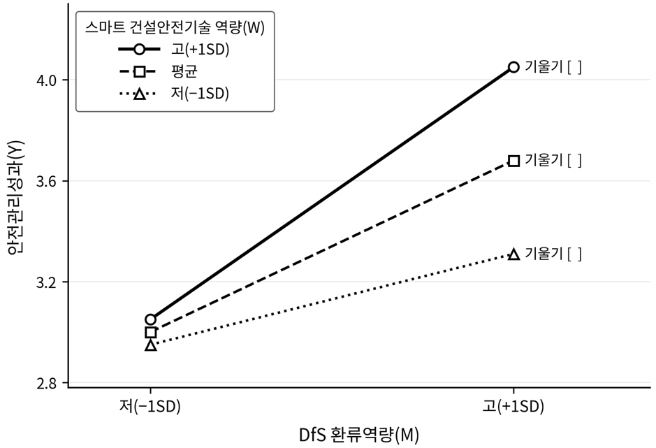

<!-- hwpx-p idx=2289 -->

<h1>제 4 장 실증 분석 및 가설 검증</h1>

<!-- /hwpx-p idx=2289 -->

<!-- hwpx-p idx=2290 -->

<!-- /hwpx-p idx=2290 -->

<!-- hwpx-p idx=2291 -->

<h2>제 1 절 표본의 일반적 특성 및 기술통계</h2>

<!-- /hwpx-p idx=2291 -->

<!-- hwpx-p idx=2292 -->

<!-- /hwpx-p idx=2292 -->

<!-- hwpx-p idx=2293 -->

<h3>제 1 항 응답자 특성 및 현장 프로필</h3>

<!-- /hwpx-p idx=2293 -->

<!-- hwpx-p idx=2294 -->

<!-- /hwpx-p idx=2294 -->

<!-- hwpx-p idx=2295 -->

  본 연구의 표본은 국내 도심지 주상복합아파트 공사에서 안전관리 업무를 수행하는 실무자로 구성되어 연구 주제가 요구하는 전문성과 동질성을 확보하였다. 직종별로는 안전관리자와 현장소장·관리감독자가 주를 이루며, 공사·공무 담당자와 설계·기술지원 인력이 함께 포함되었다.

<!-- /hwpx-p idx=2295 -->

<!-- hwpx-p idx=2296 -->

　자료수집은 제3장의 표본 설계 기준에 따라 진행하였으며, 총 &#91;　&#93;부를 배포하여 &#91;　&#93;부를 회수하였다(회수율 &#91;　&#93;%). 회수한 응답 가운데 응답자 일반 특성 문항의 다섯 조건을 충족하지 못한 응답과 불성실 응답을 제거한 뒤 최종적으로 &#91;　&#93;부를 유효표본으로 확정하여 분석에 사용하였다.

<!-- /hwpx-p idx=2296 -->

<!-- hwpx-p idx=2297 -->

　구조방정식모형 분석에 요구되는 최소 표본 크기 기준(제3장 제5절에서 설정한 200부 이상, 목표 300부 내외)을 충족하는지 확인하였으며, 최종 유효표본 &#91;　&#93;부는 구조방정식모형 추정에 적합한 규모로 나타났다&#91;분석 결과에 따라 수정&#93;.

<!-- /hwpx-p idx=2297 -->

<!-- hwpx-p idx=2298 -->

　응답자의 인구통계학적 특성은 설문지의 응답자 일반 특성 문항에 따라 성별, 연령대, 총 건설업 경력, 응답 현장 근무기간, 직종, 소속 조직으로 구분하여 빈도분석을 실시하였다.

<!-- /hwpx-p idx=2298 -->

<!-- hwpx-p idx=2299 -->

　직종은 안전관리자, 현장소장·관리감독자, 공사·공무, 설계·기술지원으로 구분하여 표본이 설계단계 검토 절차와 시공단계 안전관리를 직접 관측할 수 있는 실무자로 구성되었는지 확인하였다. 소속 조직은 발주처, 설계사, 시공사, 감리로 구분하여 표본이 설계·시공·안전관리의 주요 이해관계자를 고르게 포괄하는지 확인하였다. 분석 결과는 &lt;표 4-1&gt;과 같다.

<!-- /hwpx-p idx=2299 -->

<!-- hwpx-p idx=2300 -->

<!-- /hwpx-p idx=2300 -->

<!-- hwpx-p idx=2301 -->

&lt;표 4-1&gt; 응답자의 인구통계학적 특성

<!-- /hwpx-p idx=2301 -->

<!-- hwpx-p idx=2302 -->

<table data-hwpx-table="55">
<tr>
<td rowspan="1" colspan="1" data-row="0" data-col="0">
<!-- hwpx-p idx=2303 -->
구분
<!-- /hwpx-p idx=2303 -->
</td>
<td rowspan="1" colspan="1" data-row="0" data-col="1">
<!-- hwpx-p idx=2304 -->
항목
<!-- /hwpx-p idx=2304 -->
</td>
<td rowspan="1" colspan="1" data-row="0" data-col="2">
<!-- hwpx-p idx=2305 -->
빈도(명)
<!-- /hwpx-p idx=2305 -->
</td>
<td rowspan="1" colspan="1" data-row="0" data-col="3">
<!-- hwpx-p idx=2306 -->
비율(%)
<!-- /hwpx-p idx=2306 -->
</td>
<td rowspan="1" colspan="1" data-row="0" data-col="4">
<!-- hwpx-p idx=2307 -->
구분
<!-- /hwpx-p idx=2307 -->
</td>
<td rowspan="1" colspan="1" data-row="0" data-col="5">
<!-- hwpx-p idx=2308 -->
항목
<!-- /hwpx-p idx=2308 -->
</td>
<td rowspan="1" colspan="1" data-row="0" data-col="6">
<!-- hwpx-p idx=2309 -->
빈도(명)
<!-- /hwpx-p idx=2309 -->
</td>
<td rowspan="1" colspan="1" data-row="0" data-col="7">
<!-- hwpx-p idx=2310 -->
비율(%)
<!-- /hwpx-p idx=2310 -->
</td>
</tr>
<tr>
<td rowspan="2" colspan="1" data-row="1" data-col="0">
<!-- hwpx-p idx=2311 -->
성별
<!-- /hwpx-p idx=2311 -->
</td>
<td rowspan="1" colspan="1" data-row="1" data-col="1">
<!-- hwpx-p idx=2312 -->
남성
<!-- /hwpx-p idx=2312 -->
</td>
<td rowspan="1" colspan="1" data-row="1" data-col="2">
<!-- hwpx-p idx=2313 -->
&#91;  &#93;
<!-- /hwpx-p idx=2313 -->
</td>
<td rowspan="1" colspan="1" data-row="1" data-col="3">
<!-- hwpx-p idx=2314 -->
&#91;  &#93;
<!-- /hwpx-p idx=2314 -->
</td>
<td rowspan="5" colspan="1" data-row="1" data-col="4">
<!-- hwpx-p idx=2315 -->
직종
<!-- /hwpx-p idx=2315 -->
</td>
<td rowspan="1" colspan="1" data-row="1" data-col="5">
<!-- hwpx-p idx=2316 -->
안전관리자
<!-- /hwpx-p idx=2316 -->
</td>
<td rowspan="1" colspan="1" data-row="1" data-col="6">
<!-- hwpx-p idx=2317 -->
&#91;  &#93;
<!-- /hwpx-p idx=2317 -->
</td>
<td rowspan="1" colspan="1" data-row="1" data-col="7">
<!-- hwpx-p idx=2318 -->
&#91;  &#93;
<!-- /hwpx-p idx=2318 -->
</td>
</tr>
<tr>
<td rowspan="1" colspan="1" data-row="2" data-col="1">
<!-- hwpx-p idx=2319 -->
여성
<!-- /hwpx-p idx=2319 -->
</td>
<td rowspan="1" colspan="1" data-row="2" data-col="2">
<!-- hwpx-p idx=2320 -->
&#91;  &#93;
<!-- /hwpx-p idx=2320 -->
</td>
<td rowspan="1" colspan="1" data-row="2" data-col="3">
<!-- hwpx-p idx=2321 -->
&#91;  &#93;
<!-- /hwpx-p idx=2321 -->
</td>
<td rowspan="1" colspan="1" data-row="2" data-col="5">
<!-- hwpx-p idx=2322 -->
현장소장·관리감독자
<!-- /hwpx-p idx=2322 -->
</td>
<td rowspan="1" colspan="1" data-row="2" data-col="6">
<!-- hwpx-p idx=2323 -->
&#91;  &#93;
<!-- /hwpx-p idx=2323 -->
</td>
<td rowspan="1" colspan="1" data-row="2" data-col="7">
<!-- hwpx-p idx=2324 -->
&#91;  &#93;
<!-- /hwpx-p idx=2324 -->
</td>
</tr>
<tr>
<td rowspan="5" colspan="1" data-row="3" data-col="0">
<!-- hwpx-p idx=2325 -->
연령대
<!-- /hwpx-p idx=2325 -->
</td>
<td rowspan="1" colspan="1" data-row="3" data-col="1">
<!-- hwpx-p idx=2326 -->
20대
<!-- /hwpx-p idx=2326 -->
</td>
<td rowspan="1" colspan="1" data-row="3" data-col="2">
<!-- hwpx-p idx=2327 -->
&#91;  &#93;
<!-- /hwpx-p idx=2327 -->
</td>
<td rowspan="1" colspan="1" data-row="3" data-col="3">
<!-- hwpx-p idx=2328 -->
&#91;  &#93;
<!-- /hwpx-p idx=2328 -->
</td>
<td rowspan="1" colspan="1" data-row="3" data-col="5">
<!-- hwpx-p idx=2329 -->
공사·공무
<!-- /hwpx-p idx=2329 -->
</td>
<td rowspan="1" colspan="1" data-row="3" data-col="6">
<!-- hwpx-p idx=2330 -->
&#91;  &#93;
<!-- /hwpx-p idx=2330 -->
</td>
<td rowspan="1" colspan="1" data-row="3" data-col="7">
<!-- hwpx-p idx=2331 -->
&#91;  &#93;
<!-- /hwpx-p idx=2331 -->
</td>
</tr>
<tr>
<td rowspan="1" colspan="1" data-row="4" data-col="1">
<!-- hwpx-p idx=2332 -->
30대
<!-- /hwpx-p idx=2332 -->
</td>
<td rowspan="1" colspan="1" data-row="4" data-col="2">
<!-- hwpx-p idx=2333 -->
&#91;  &#93;
<!-- /hwpx-p idx=2333 -->
</td>
<td rowspan="1" colspan="1" data-row="4" data-col="3">
<!-- hwpx-p idx=2334 -->
&#91;  &#93;
<!-- /hwpx-p idx=2334 -->
</td>
<td rowspan="1" colspan="1" data-row="4" data-col="5">
<!-- hwpx-p idx=2335 -->
설계·기술지원
<!-- /hwpx-p idx=2335 -->
</td>
<td rowspan="1" colspan="1" data-row="4" data-col="6">
<!-- hwpx-p idx=2336 -->
&#91;  &#93;
<!-- /hwpx-p idx=2336 -->
</td>
<td rowspan="1" colspan="1" data-row="4" data-col="7">
<!-- hwpx-p idx=2337 -->
&#91;  &#93;
<!-- /hwpx-p idx=2337 -->
</td>
</tr>
<tr>
<td rowspan="1" colspan="1" data-row="5" data-col="1">
<!-- hwpx-p idx=2338 -->
40대
<!-- /hwpx-p idx=2338 -->
</td>
<td rowspan="1" colspan="1" data-row="5" data-col="2">
<!-- hwpx-p idx=2339 -->
&#91;  &#93;
<!-- /hwpx-p idx=2339 -->
</td>
<td rowspan="1" colspan="1" data-row="5" data-col="3">
<!-- hwpx-p idx=2340 -->
&#91;  &#93;
<!-- /hwpx-p idx=2340 -->
</td>
<td rowspan="1" colspan="1" data-row="5" data-col="5">
<!-- hwpx-p idx=2341 -->
기타
<!-- /hwpx-p idx=2341 -->
</td>
<td rowspan="1" colspan="1" data-row="5" data-col="6">
<!-- hwpx-p idx=2342 -->
&#91;  &#93;
<!-- /hwpx-p idx=2342 -->
</td>
<td rowspan="1" colspan="1" data-row="5" data-col="7">
<!-- hwpx-p idx=2343 -->
&#91;  &#93;
<!-- /hwpx-p idx=2343 -->
</td>
</tr>
<tr>
<td rowspan="1" colspan="1" data-row="6" data-col="1">
<!-- hwpx-p idx=2344 -->
50대
<!-- /hwpx-p idx=2344 -->
</td>
<td rowspan="1" colspan="1" data-row="6" data-col="2">
<!-- hwpx-p idx=2345 -->
&#91;  &#93;
<!-- /hwpx-p idx=2345 -->
</td>
<td rowspan="1" colspan="1" data-row="6" data-col="3">
<!-- hwpx-p idx=2346 -->
&#91;  &#93;
<!-- /hwpx-p idx=2346 -->
</td>
<td rowspan="4" colspan="1" data-row="6" data-col="4">
<!-- hwpx-p idx=2347 -->
직급
<!-- /hwpx-p idx=2347 -->
</td>
<td rowspan="1" colspan="1" data-row="6" data-col="5">
<!-- hwpx-p idx=2348 -->
사원·대리급
<!-- /hwpx-p idx=2348 -->
</td>
<td rowspan="1" colspan="1" data-row="6" data-col="6">
<!-- hwpx-p idx=2349 -->
&#91;  &#93;
<!-- /hwpx-p idx=2349 -->
</td>
<td rowspan="1" colspan="1" data-row="6" data-col="7">
<!-- hwpx-p idx=2350 -->
&#91;  &#93;
<!-- /hwpx-p idx=2350 -->
</td>
</tr>
<tr>
<td rowspan="1" colspan="1" data-row="7" data-col="1">
<!-- hwpx-p idx=2351 -->
60대 이상
<!-- /hwpx-p idx=2351 -->
</td>
<td rowspan="1" colspan="1" data-row="7" data-col="2">
<!-- hwpx-p idx=2352 -->
&#91;  &#93;
<!-- /hwpx-p idx=2352 -->
</td>
<td rowspan="1" colspan="1" data-row="7" data-col="3">
<!-- hwpx-p idx=2353 -->
&#91;  &#93;
<!-- /hwpx-p idx=2353 -->
</td>
<td rowspan="1" colspan="1" data-row="7" data-col="5">
<!-- hwpx-p idx=2354 -->
과장·차장급
<!-- /hwpx-p idx=2354 -->
</td>
<td rowspan="1" colspan="1" data-row="7" data-col="6">
<!-- hwpx-p idx=2355 -->
&#91;  &#93;
<!-- /hwpx-p idx=2355 -->
</td>
<td rowspan="1" colspan="1" data-row="7" data-col="7">
<!-- hwpx-p idx=2356 -->
&#91;  &#93;
<!-- /hwpx-p idx=2356 -->
</td>
</tr>
<tr>
<td rowspan="5" colspan="1" data-row="8" data-col="0">
<!-- hwpx-p idx=2357 -->
총 건설업 경력
<!-- /hwpx-p idx=2357 -->
</td>
<td rowspan="1" colspan="1" data-row="8" data-col="1">
<!-- hwpx-p idx=2358 -->
5년 미만
<!-- /hwpx-p idx=2358 -->
</td>
<td rowspan="1" colspan="1" data-row="8" data-col="2">
<!-- hwpx-p idx=2359 -->
&#91;  &#93;
<!-- /hwpx-p idx=2359 -->
</td>
<td rowspan="1" colspan="1" data-row="8" data-col="3">
<!-- hwpx-p idx=2360 -->
&#91;  &#93;
<!-- /hwpx-p idx=2360 -->
</td>
<td rowspan="1" colspan="1" data-row="8" data-col="5">
<!-- hwpx-p idx=2361 -->
부장급 이상
<!-- /hwpx-p idx=2361 -->
</td>
<td rowspan="1" colspan="1" data-row="8" data-col="6">
<!-- hwpx-p idx=2362 -->
&#91;  &#93;
<!-- /hwpx-p idx=2362 -->
</td>
<td rowspan="1" colspan="1" data-row="8" data-col="7">
<!-- hwpx-p idx=2363 -->
&#91;  &#93;
<!-- /hwpx-p idx=2363 -->
</td>
</tr>
<tr>
<td rowspan="1" colspan="1" data-row="9" data-col="1">
<!-- hwpx-p idx=2364 -->
5년&#126;10년 미만
<!-- /hwpx-p idx=2364 -->
</td>
<td rowspan="1" colspan="1" data-row="9" data-col="2">
<!-- hwpx-p idx=2365 -->
&#91;  &#93;
<!-- /hwpx-p idx=2365 -->
</td>
<td rowspan="1" colspan="1" data-row="9" data-col="3">
<!-- hwpx-p idx=2366 -->
&#91;  &#93;
<!-- /hwpx-p idx=2366 -->
</td>
<td rowspan="1" colspan="1" data-row="9" data-col="5">
<!-- hwpx-p idx=2367 -->
기타(기능·기술직 등)
<!-- /hwpx-p idx=2367 -->
</td>
<td rowspan="1" colspan="1" data-row="9" data-col="6">
<!-- hwpx-p idx=2368 -->
&#91;  &#93;
<!-- /hwpx-p idx=2368 -->
</td>
<td rowspan="1" colspan="1" data-row="9" data-col="7">
<!-- hwpx-p idx=2369 -->
&#91;  &#93;
<!-- /hwpx-p idx=2369 -->
</td>
</tr>
<tr>
<td rowspan="1" colspan="1" data-row="10" data-col="1">
<!-- hwpx-p idx=2370 -->
10년&#126;15년 미만
<!-- /hwpx-p idx=2370 -->
</td>
<td rowspan="1" colspan="1" data-row="10" data-col="2">
<!-- hwpx-p idx=2371 -->
&#91;  &#93;
<!-- /hwpx-p idx=2371 -->
</td>
<td rowspan="1" colspan="1" data-row="10" data-col="3">
<!-- hwpx-p idx=2372 -->
&#91;  &#93;
<!-- /hwpx-p idx=2372 -->
</td>
<td rowspan="5" colspan="1" data-row="10" data-col="4">
<!-- hwpx-p idx=2373 -->
소속 조직
<!-- /hwpx-p idx=2373 -->
</td>
<td rowspan="1" colspan="1" data-row="10" data-col="5">
<!-- hwpx-p idx=2374 -->
발주처
<!-- /hwpx-p idx=2374 -->
</td>
<td rowspan="1" colspan="1" data-row="10" data-col="6">
<!-- hwpx-p idx=2375 -->
&#91;  &#93;
<!-- /hwpx-p idx=2375 -->
</td>
<td rowspan="1" colspan="1" data-row="10" data-col="7">
<!-- hwpx-p idx=2376 -->
&#91;  &#93;
<!-- /hwpx-p idx=2376 -->
</td>
</tr>
<tr>
<td rowspan="1" colspan="1" data-row="11" data-col="1">
<!-- hwpx-p idx=2377 -->
15년&#126;20년 미만
<!-- /hwpx-p idx=2377 -->
</td>
<td rowspan="1" colspan="1" data-row="11" data-col="2">
<!-- hwpx-p idx=2378 -->
&#91;  &#93;
<!-- /hwpx-p idx=2378 -->
</td>
<td rowspan="1" colspan="1" data-row="11" data-col="3">
<!-- hwpx-p idx=2379 -->
&#91;  &#93;
<!-- /hwpx-p idx=2379 -->
</td>
<td rowspan="1" colspan="1" data-row="11" data-col="5">
<!-- hwpx-p idx=2380 -->
설계사
<!-- /hwpx-p idx=2380 -->
</td>
<td rowspan="1" colspan="1" data-row="11" data-col="6">
<!-- hwpx-p idx=2381 -->
&#91;  &#93;
<!-- /hwpx-p idx=2381 -->
</td>
<td rowspan="1" colspan="1" data-row="11" data-col="7">
<!-- hwpx-p idx=2382 -->
&#91;  &#93;
<!-- /hwpx-p idx=2382 -->
</td>
</tr>
<tr>
<td rowspan="1" colspan="1" data-row="12" data-col="1">
<!-- hwpx-p idx=2383 -->
20년 이상
<!-- /hwpx-p idx=2383 -->
</td>
<td rowspan="1" colspan="1" data-row="12" data-col="2">
<!-- hwpx-p idx=2384 -->
&#91;  &#93;
<!-- /hwpx-p idx=2384 -->
</td>
<td rowspan="1" colspan="1" data-row="12" data-col="3">
<!-- hwpx-p idx=2385 -->
&#91;  &#93;
<!-- /hwpx-p idx=2385 -->
</td>
<td rowspan="1" colspan="1" data-row="12" data-col="5">
<!-- hwpx-p idx=2386 -->
시공사
<!-- /hwpx-p idx=2386 -->
</td>
<td rowspan="1" colspan="1" data-row="12" data-col="6">
<!-- hwpx-p idx=2387 -->
&#91;  &#93;
<!-- /hwpx-p idx=2387 -->
</td>
<td rowspan="1" colspan="1" data-row="12" data-col="7">
<!-- hwpx-p idx=2388 -->
&#91;  &#93;
<!-- /hwpx-p idx=2388 -->
</td>
</tr>
<tr>
<td rowspan="5" colspan="1" data-row="13" data-col="0">
<!-- hwpx-p idx=2389 -->
응답 현장 근무기간
<!-- /hwpx-p idx=2389 -->
</td>
<td rowspan="1" colspan="1" data-row="13" data-col="1">
<!-- hwpx-p idx=2390 -->
6개월 미만
<!-- /hwpx-p idx=2390 -->
</td>
<td rowspan="1" colspan="1" data-row="13" data-col="2">
<!-- hwpx-p idx=2391 -->
&#91;  &#93;
<!-- /hwpx-p idx=2391 -->
</td>
<td rowspan="1" colspan="1" data-row="13" data-col="3">
<!-- hwpx-p idx=2392 -->
&#91;  &#93;
<!-- /hwpx-p idx=2392 -->
</td>
<td rowspan="1" colspan="1" data-row="13" data-col="5">
<!-- hwpx-p idx=2393 -->
감리
<!-- /hwpx-p idx=2393 -->
</td>
<td rowspan="1" colspan="1" data-row="13" data-col="6">
<!-- hwpx-p idx=2394 -->
&#91;  &#93;
<!-- /hwpx-p idx=2394 -->
</td>
<td rowspan="1" colspan="1" data-row="13" data-col="7">
<!-- hwpx-p idx=2395 -->
&#91;  &#93;
<!-- /hwpx-p idx=2395 -->
</td>
</tr>
<tr>
<td rowspan="1" colspan="1" data-row="14" data-col="1">
<!-- hwpx-p idx=2396 -->
6개월&#126;1년 미만
<!-- /hwpx-p idx=2396 -->
</td>
<td rowspan="1" colspan="1" data-row="14" data-col="2">
<!-- hwpx-p idx=2397 -->
&#91;  &#93;
<!-- /hwpx-p idx=2397 -->
</td>
<td rowspan="1" colspan="1" data-row="14" data-col="3">
<!-- hwpx-p idx=2398 -->
&#91;  &#93;
<!-- /hwpx-p idx=2398 -->
</td>
<td rowspan="1" colspan="1" data-row="14" data-col="5">
<!-- hwpx-p idx=2399 -->
기타(협력업체 등)
<!-- /hwpx-p idx=2399 -->
</td>
<td rowspan="1" colspan="1" data-row="14" data-col="6">
<!-- hwpx-p idx=2400 -->
&#91;  &#93;
<!-- /hwpx-p idx=2400 -->
</td>
<td rowspan="1" colspan="1" data-row="14" data-col="7">
<!-- hwpx-p idx=2401 -->
&#91;  &#93;
<!-- /hwpx-p idx=2401 -->
</td>
</tr>
<tr>
<td rowspan="1" colspan="1" data-row="15" data-col="1">
<!-- hwpx-p idx=2402 -->
1년&#126;2년 미만
<!-- /hwpx-p idx=2402 -->
</td>
<td rowspan="1" colspan="1" data-row="15" data-col="2">
<!-- hwpx-p idx=2403 -->
&#91;  &#93;
<!-- /hwpx-p idx=2403 -->
</td>
<td rowspan="1" colspan="1" data-row="15" data-col="3">
<!-- hwpx-p idx=2404 -->
&#91;  &#93;
<!-- /hwpx-p idx=2404 -->
</td>
<td rowspan="1" colspan="1" data-row="15" data-col="4">
<!-- hwpx-p idx=2405 -->

<!-- /hwpx-p idx=2405 -->
</td>
<td rowspan="1" colspan="1" data-row="15" data-col="5">
<!-- hwpx-p idx=2406 -->

<!-- /hwpx-p idx=2406 -->
</td>
<td rowspan="1" colspan="1" data-row="15" data-col="6">
<!-- hwpx-p idx=2407 -->

<!-- /hwpx-p idx=2407 -->
</td>
<td rowspan="1" colspan="1" data-row="15" data-col="7">
<!-- hwpx-p idx=2408 -->

<!-- /hwpx-p idx=2408 -->
</td>
</tr>
<tr>
<td rowspan="1" colspan="1" data-row="16" data-col="1">
<!-- hwpx-p idx=2409 -->
2년&#126;3년 미만
<!-- /hwpx-p idx=2409 -->
</td>
<td rowspan="1" colspan="1" data-row="16" data-col="2">
<!-- hwpx-p idx=2410 -->
&#91;  &#93;
<!-- /hwpx-p idx=2410 -->
</td>
<td rowspan="1" colspan="1" data-row="16" data-col="3">
<!-- hwpx-p idx=2411 -->
&#91;  &#93;
<!-- /hwpx-p idx=2411 -->
</td>
<td rowspan="1" colspan="1" data-row="16" data-col="4">
<!-- hwpx-p idx=2412 -->

<!-- /hwpx-p idx=2412 -->
</td>
<td rowspan="1" colspan="1" data-row="16" data-col="5">
<!-- hwpx-p idx=2413 -->

<!-- /hwpx-p idx=2413 -->
</td>
<td rowspan="1" colspan="1" data-row="16" data-col="6">
<!-- hwpx-p idx=2414 -->

<!-- /hwpx-p idx=2414 -->
</td>
<td rowspan="1" colspan="1" data-row="16" data-col="7">
<!-- hwpx-p idx=2415 -->

<!-- /hwpx-p idx=2415 -->
</td>
</tr>
<tr>
<td rowspan="1" colspan="1" data-row="17" data-col="1">
<!-- hwpx-p idx=2416 -->
3년 이상
<!-- /hwpx-p idx=2416 -->
</td>
<td rowspan="1" colspan="1" data-row="17" data-col="2">
<!-- hwpx-p idx=2417 -->
&#91;  &#93;
<!-- /hwpx-p idx=2417 -->
</td>
<td rowspan="1" colspan="1" data-row="17" data-col="3">
<!-- hwpx-p idx=2418 -->
&#91;  &#93;
<!-- /hwpx-p idx=2418 -->
</td>
<td rowspan="1" colspan="1" data-row="17" data-col="4">
<!-- hwpx-p idx=2419 -->

<!-- /hwpx-p idx=2419 -->
</td>
<td rowspan="1" colspan="1" data-row="17" data-col="5">
<!-- hwpx-p idx=2420 -->

<!-- /hwpx-p idx=2420 -->
</td>
<td rowspan="1" colspan="1" data-row="17" data-col="6">
<!-- hwpx-p idx=2421 -->

<!-- /hwpx-p idx=2421 -->
</td>
<td rowspan="1" colspan="1" data-row="17" data-col="7">
<!-- hwpx-p idx=2422 -->

<!-- /hwpx-p idx=2422 -->
</td>
</tr>
<tr>
<td rowspan="1" colspan="1" data-row="18" data-col="0">
<!-- hwpx-p idx=2423 -->
합계
<!-- /hwpx-p idx=2423 -->
</td>
<td rowspan="1" colspan="6" data-row="18" data-col="1">
<!-- hwpx-p idx=2424 -->
–
<!-- /hwpx-p idx=2424 -->
</td>
<td rowspan="1" colspan="1" data-row="18" data-col="7">
<!-- hwpx-p idx=2425 -->
100.0
<!-- /hwpx-p idx=2425 -->
</td>
</tr>
</table>

<!-- /hwpx-p idx=2302 -->

<!-- hwpx-p idx=2426 -->

<!-- /hwpx-p idx=2426 -->

<!-- hwpx-p idx=2427 -->

자료: 연구자 작성

<!-- /hwpx-p idx=2427 -->

<!-- hwpx-p idx=2428 -->

<!-- /hwpx-p idx=2428 -->

<!-- hwpx-p idx=2429 -->

  응답자가 참여한 현장의 프로필은 공사금액과 현장 유형으로 구분하여 정리하였다. 현장 프로필은 응답 적격성 조건과 함께 본 연구의 대상이 도심지 주상복합아파트라는 공간적·대상적 범위에 부합하는지 확인하는 근거로 활용하였으며, 표본이 특정 규모나 유형에 편중되지 않고 분포하는지 함께 검토하였다. 분석 결과는 &lt;표 4-2&gt;와 같다.

<!-- /hwpx-p idx=2429 -->

<!-- hwpx-p idx=2430 -->

<!-- /hwpx-p idx=2430 -->

<!-- hwpx-p idx=2431 -->

&lt;표 4-2&gt; 응답자의 현장 프로필

<!-- /hwpx-p idx=2431 -->

<!-- hwpx-p idx=2432 -->

<table data-hwpx-table="56">
<tr>
<td rowspan="1" colspan="1" data-row="0" data-col="0">
<!-- hwpx-p idx=2433 -->
구분
<!-- /hwpx-p idx=2433 -->
</td>
<td rowspan="1" colspan="1" data-row="0" data-col="1">
<!-- hwpx-p idx=2434 -->
항목
<!-- /hwpx-p idx=2434 -->
</td>
<td rowspan="1" colspan="1" data-row="0" data-col="2">
<!-- hwpx-p idx=2435 -->
빈도(명)
<!-- /hwpx-p idx=2435 -->
</td>
<td rowspan="1" colspan="1" data-row="0" data-col="3">
<!-- hwpx-p idx=2436 -->
비율(%)
<!-- /hwpx-p idx=2436 -->
</td>
</tr>
<tr>
<td rowspan="1" colspan="1" data-row="1" data-col="0">
<!-- hwpx-p idx=2437 -->
공사금액
<!-- /hwpx-p idx=2437 -->
</td>
<td rowspan="1" colspan="1" data-row="1" data-col="1">
<!-- hwpx-p idx=2438 -->
50억&#126;100억 원 미만
<!-- /hwpx-p idx=2438 -->
</td>
<td rowspan="1" colspan="1" data-row="1" data-col="2">
<!-- hwpx-p idx=2439 -->
&#91;  &#93;
<!-- /hwpx-p idx=2439 -->
</td>
<td rowspan="1" colspan="1" data-row="1" data-col="3">
<!-- hwpx-p idx=2440 -->
&#91;  &#93;
<!-- /hwpx-p idx=2440 -->
</td>
</tr>
<tr>
<td rowspan="1" colspan="1" data-row="2" data-col="0">
<!-- hwpx-p idx=2441 -->

<!-- /hwpx-p idx=2441 -->
</td>
<td rowspan="1" colspan="1" data-row="2" data-col="1">
<!-- hwpx-p idx=2442 -->
100억&#126;300억 원 미만
<!-- /hwpx-p idx=2442 -->
</td>
<td rowspan="1" colspan="1" data-row="2" data-col="2">
<!-- hwpx-p idx=2443 -->
&#91;  &#93;
<!-- /hwpx-p idx=2443 -->
</td>
<td rowspan="1" colspan="1" data-row="2" data-col="3">
<!-- hwpx-p idx=2444 -->
&#91;  &#93;
<!-- /hwpx-p idx=2444 -->
</td>
</tr>
<tr>
<td rowspan="1" colspan="1" data-row="3" data-col="0">
<!-- hwpx-p idx=2445 -->

<!-- /hwpx-p idx=2445 -->
</td>
<td rowspan="1" colspan="1" data-row="3" data-col="1">
<!-- hwpx-p idx=2446 -->
300억&#126;500억 원 미만
<!-- /hwpx-p idx=2446 -->
</td>
<td rowspan="1" colspan="1" data-row="3" data-col="2">
<!-- hwpx-p idx=2447 -->
&#91;  &#93;
<!-- /hwpx-p idx=2447 -->
</td>
<td rowspan="1" colspan="1" data-row="3" data-col="3">
<!-- hwpx-p idx=2448 -->
&#91;  &#93;
<!-- /hwpx-p idx=2448 -->
</td>
</tr>
<tr>
<td rowspan="1" colspan="1" data-row="4" data-col="0">
<!-- hwpx-p idx=2449 -->

<!-- /hwpx-p idx=2449 -->
</td>
<td rowspan="1" colspan="1" data-row="4" data-col="1">
<!-- hwpx-p idx=2450 -->
500억&#126;1,000억 원 미만
<!-- /hwpx-p idx=2450 -->
</td>
<td rowspan="1" colspan="1" data-row="4" data-col="2">
<!-- hwpx-p idx=2451 -->
&#91;  &#93;
<!-- /hwpx-p idx=2451 -->
</td>
<td rowspan="1" colspan="1" data-row="4" data-col="3">
<!-- hwpx-p idx=2452 -->
&#91;  &#93;
<!-- /hwpx-p idx=2452 -->
</td>
</tr>
<tr>
<td rowspan="1" colspan="1" data-row="5" data-col="0">
<!-- hwpx-p idx=2453 -->

<!-- /hwpx-p idx=2453 -->
</td>
<td rowspan="1" colspan="1" data-row="5" data-col="1">
<!-- hwpx-p idx=2454 -->
1,000억 원 이상
<!-- /hwpx-p idx=2454 -->
</td>
<td rowspan="1" colspan="1" data-row="5" data-col="2">
<!-- hwpx-p idx=2455 -->
&#91;  &#93;
<!-- /hwpx-p idx=2455 -->
</td>
<td rowspan="1" colspan="1" data-row="5" data-col="3">
<!-- hwpx-p idx=2456 -->
&#91;  &#93;
<!-- /hwpx-p idx=2456 -->
</td>
</tr>
<tr>
<td rowspan="1" colspan="1" data-row="6" data-col="0">
<!-- hwpx-p idx=2457 -->
현장 유형
<!-- /hwpx-p idx=2457 -->
</td>
<td rowspan="1" colspan="1" data-row="6" data-col="1">
<!-- hwpx-p idx=2458 -->
주상복합
<!-- /hwpx-p idx=2458 -->
</td>
<td rowspan="1" colspan="1" data-row="6" data-col="2">
<!-- hwpx-p idx=2459 -->
&#91;  &#93;
<!-- /hwpx-p idx=2459 -->
</td>
<td rowspan="1" colspan="1" data-row="6" data-col="3">
<!-- hwpx-p idx=2460 -->
&#91;  &#93;
<!-- /hwpx-p idx=2460 -->
</td>
</tr>
<tr>
<td rowspan="1" colspan="1" data-row="7" data-col="0">
<!-- hwpx-p idx=2461 -->

<!-- /hwpx-p idx=2461 -->
</td>
<td rowspan="1" colspan="1" data-row="7" data-col="1">
<!-- hwpx-p idx=2462 -->
공동주택
<!-- /hwpx-p idx=2462 -->
</td>
<td rowspan="1" colspan="1" data-row="7" data-col="2">
<!-- hwpx-p idx=2463 -->
&#91;  &#93;
<!-- /hwpx-p idx=2463 -->
</td>
<td rowspan="1" colspan="1" data-row="7" data-col="3">
<!-- hwpx-p idx=2464 -->
&#91;  &#93;
<!-- /hwpx-p idx=2464 -->
</td>
</tr>
<tr>
<td rowspan="1" colspan="1" data-row="8" data-col="0">
<!-- hwpx-p idx=2465 -->

<!-- /hwpx-p idx=2465 -->
</td>
<td rowspan="1" colspan="1" data-row="8" data-col="1">
<!-- hwpx-p idx=2466 -->
업무·상업시설
<!-- /hwpx-p idx=2466 -->
</td>
<td rowspan="1" colspan="1" data-row="8" data-col="2">
<!-- hwpx-p idx=2467 -->
&#91;  &#93;
<!-- /hwpx-p idx=2467 -->
</td>
<td rowspan="1" colspan="1" data-row="8" data-col="3">
<!-- hwpx-p idx=2468 -->
&#91;  &#93;
<!-- /hwpx-p idx=2468 -->
</td>
</tr>
<tr>
<td rowspan="1" colspan="1" data-row="9" data-col="0">
<!-- hwpx-p idx=2469 -->

<!-- /hwpx-p idx=2469 -->
</td>
<td rowspan="1" colspan="1" data-row="9" data-col="1">
<!-- hwpx-p idx=2470 -->
기타
<!-- /hwpx-p idx=2470 -->
</td>
<td rowspan="1" colspan="1" data-row="9" data-col="2">
<!-- hwpx-p idx=2471 -->
&#91;  &#93;
<!-- /hwpx-p idx=2471 -->
</td>
<td rowspan="1" colspan="1" data-row="9" data-col="3">
<!-- hwpx-p idx=2472 -->
&#91;  &#93;
<!-- /hwpx-p idx=2472 -->
</td>
</tr>
<tr>
<td rowspan="1" colspan="1" data-row="10" data-col="0">
<!-- hwpx-p idx=2473 -->
공정 단계
<!-- /hwpx-p idx=2473 -->
</td>
<td rowspan="1" colspan="1" data-row="10" data-col="1">
<!-- hwpx-p idx=2474 -->
굴착·기초
<!-- /hwpx-p idx=2474 -->
</td>
<td rowspan="1" colspan="1" data-row="10" data-col="2">
<!-- hwpx-p idx=2475 -->
&#91;  &#93;
<!-- /hwpx-p idx=2475 -->
</td>
<td rowspan="1" colspan="1" data-row="10" data-col="3">
<!-- hwpx-p idx=2476 -->
&#91;  &#93;
<!-- /hwpx-p idx=2476 -->
</td>
</tr>
<tr>
<td rowspan="1" colspan="1" data-row="11" data-col="0">
<!-- hwpx-p idx=2477 -->

<!-- /hwpx-p idx=2477 -->
</td>
<td rowspan="1" colspan="1" data-row="11" data-col="1">
<!-- hwpx-p idx=2478 -->
골조
<!-- /hwpx-p idx=2478 -->
</td>
<td rowspan="1" colspan="1" data-row="11" data-col="2">
<!-- hwpx-p idx=2479 -->
&#91;  &#93;
<!-- /hwpx-p idx=2479 -->
</td>
<td rowspan="1" colspan="1" data-row="11" data-col="3">
<!-- hwpx-p idx=2480 -->
&#91;  &#93;
<!-- /hwpx-p idx=2480 -->
</td>
</tr>
<tr>
<td rowspan="1" colspan="1" data-row="12" data-col="0">
<!-- hwpx-p idx=2481 -->

<!-- /hwpx-p idx=2481 -->
</td>
<td rowspan="1" colspan="1" data-row="12" data-col="1">
<!-- hwpx-p idx=2482 -->
마감
<!-- /hwpx-p idx=2482 -->
</td>
<td rowspan="1" colspan="1" data-row="12" data-col="2">
<!-- hwpx-p idx=2483 -->
&#91;  &#93;
<!-- /hwpx-p idx=2483 -->
</td>
<td rowspan="1" colspan="1" data-row="12" data-col="3">
<!-- hwpx-p idx=2484 -->
&#91;  &#93;
<!-- /hwpx-p idx=2484 -->
</td>
</tr>
<tr>
<td rowspan="1" colspan="1" data-row="13" data-col="0">
<!-- hwpx-p idx=2485 -->

<!-- /hwpx-p idx=2485 -->
</td>
<td rowspan="1" colspan="1" data-row="13" data-col="1">
<!-- hwpx-p idx=2486 -->
기타
<!-- /hwpx-p idx=2486 -->
</td>
<td rowspan="1" colspan="1" data-row="13" data-col="2">
<!-- hwpx-p idx=2487 -->
&#91;  &#93;
<!-- /hwpx-p idx=2487 -->
</td>
<td rowspan="1" colspan="1" data-row="13" data-col="3">
<!-- hwpx-p idx=2488 -->
&#91;  &#93;
<!-- /hwpx-p idx=2488 -->
</td>
</tr>
<tr>
<td rowspan="1" colspan="1" data-row="14" data-col="0">
<!-- hwpx-p idx=2489 -->
합계
<!-- /hwpx-p idx=2489 -->
</td>
<td rowspan="1" colspan="1" data-row="14" data-col="1">
<!-- hwpx-p idx=2490 -->

<!-- /hwpx-p idx=2490 -->
</td>
<td rowspan="1" colspan="1" data-row="14" data-col="2">
<!-- hwpx-p idx=2491 -->
&#91;  &#93;
<!-- /hwpx-p idx=2491 -->
</td>
<td rowspan="1" colspan="1" data-row="14" data-col="3">
<!-- hwpx-p idx=2492 -->
100.0
<!-- /hwpx-p idx=2492 -->
</td>
</tr>
</table>

<!-- /hwpx-p idx=2432 -->

<!-- hwpx-p idx=2493 -->

<!-- /hwpx-p idx=2493 -->

<!-- hwpx-p idx=2494 -->

자료: 연구자 작성

<!-- /hwpx-p idx=2494 -->

<!-- hwpx-p idx=2495 -->

<!-- /hwpx-p idx=2495 -->

<!-- hwpx-p idx=2496 -->

  스마트 안전기술·장비 사용 경험은 복수응답 문항으로 별도 집계하였으며, 그 결과는 &lt;표 4-3&gt;과 같다.

<!-- /hwpx-p idx=2496 -->

<!-- hwpx-p idx=2497 -->

&lt;표 4-3&gt; 응답자의 스마트 안전기술·장비 사용 경험(복수응답)

<!-- /hwpx-p idx=2497 -->

<!-- hwpx-p idx=2498 -->

<table data-hwpx-table="57">
<tr>
<td rowspan="1" colspan="1" data-row="0" data-col="0">
<!-- hwpx-p idx=2499 -->
항목
<!-- /hwpx-p idx=2499 -->
</td>
<td rowspan="1" colspan="1" data-row="0" data-col="1">
<!-- hwpx-p idx=2500 -->
빈도(명)
<!-- /hwpx-p idx=2500 -->
</td>
<td rowspan="1" colspan="1" data-row="0" data-col="2">
<!-- hwpx-p idx=2501 -->
비율(%)
<!-- /hwpx-p idx=2501 -->
</td>
</tr>
<tr>
<td rowspan="1" colspan="1" data-row="1" data-col="0">
<!-- hwpx-p idx=2502 -->
IoT 센서
<!-- /hwpx-p idx=2502 -->
</td>
<td rowspan="1" colspan="1" data-row="1" data-col="1">
<!-- hwpx-p idx=2503 -->
&#91;  &#93;
<!-- /hwpx-p idx=2503 -->
</td>
<td rowspan="1" colspan="1" data-row="1" data-col="2">
<!-- hwpx-p idx=2504 -->
&#91;  &#93;
<!-- /hwpx-p idx=2504 -->
</td>
</tr>
<tr>
<td rowspan="1" colspan="1" data-row="2" data-col="0">
<!-- hwpx-p idx=2505 -->
AI CCTV(지능형 영상분석)
<!-- /hwpx-p idx=2505 -->
</td>
<td rowspan="1" colspan="1" data-row="2" data-col="1">
<!-- hwpx-p idx=2506 -->
&#91;  &#93;
<!-- /hwpx-p idx=2506 -->
</td>
<td rowspan="1" colspan="1" data-row="2" data-col="2">
<!-- hwpx-p idx=2507 -->
&#91;  &#93;
<!-- /hwpx-p idx=2507 -->
</td>
</tr>
<tr>
<td rowspan="1" colspan="1" data-row="3" data-col="0">
<!-- hwpx-p idx=2508 -->
BIM
<!-- /hwpx-p idx=2508 -->
</td>
<td rowspan="1" colspan="1" data-row="3" data-col="1">
<!-- hwpx-p idx=2509 -->
&#91;  &#93;
<!-- /hwpx-p idx=2509 -->
</td>
<td rowspan="1" colspan="1" data-row="3" data-col="2">
<!-- hwpx-p idx=2510 -->
&#91;  &#93;
<!-- /hwpx-p idx=2510 -->
</td>
</tr>
<tr>
<td rowspan="1" colspan="1" data-row="4" data-col="0">
<!-- hwpx-p idx=2511 -->
4D 시뮬레이션
<!-- /hwpx-p idx=2511 -->
</td>
<td rowspan="1" colspan="1" data-row="4" data-col="1">
<!-- hwpx-p idx=2512 -->
&#91;  &#93;
<!-- /hwpx-p idx=2512 -->
</td>
<td rowspan="1" colspan="1" data-row="4" data-col="2">
<!-- hwpx-p idx=2513 -->
&#91;  &#93;
<!-- /hwpx-p idx=2513 -->
</td>
</tr>
<tr>
<td rowspan="1" colspan="1" data-row="5" data-col="0">
<!-- hwpx-p idx=2514 -->
1,000억 원 이상
<!-- /hwpx-p idx=2514 -->
</td>
<td rowspan="1" colspan="1" data-row="5" data-col="1">
<!-- hwpx-p idx=2515 -->
&#91;  &#93;
<!-- /hwpx-p idx=2515 -->
</td>
<td rowspan="1" colspan="1" data-row="5" data-col="2">
<!-- hwpx-p idx=2516 -->
&#91;  &#93;
<!-- /hwpx-p idx=2516 -->
</td>
</tr>
<tr>
<td rowspan="1" colspan="1" data-row="6" data-col="0">
<!-- hwpx-p idx=2517 -->
통합관제 플랫폼
<!-- /hwpx-p idx=2517 -->
</td>
<td rowspan="1" colspan="1" data-row="6" data-col="1">
<!-- hwpx-p idx=2518 -->
&#91;  &#93;
<!-- /hwpx-p idx=2518 -->
</td>
<td rowspan="1" colspan="1" data-row="6" data-col="2">
<!-- hwpx-p idx=2519 -->
&#91;  &#93;
<!-- /hwpx-p idx=2519 -->
</td>
</tr>
<tr>
<td rowspan="1" colspan="1" data-row="7" data-col="0">
<!-- hwpx-p idx=2520 -->
스마트워치·태그
<!-- /hwpx-p idx=2520 -->
</td>
<td rowspan="1" colspan="1" data-row="7" data-col="1">
<!-- hwpx-p idx=2521 -->
&#91;  &#93;
<!-- /hwpx-p idx=2521 -->
</td>
<td rowspan="1" colspan="1" data-row="7" data-col="2">
<!-- hwpx-p idx=2522 -->
&#91;  &#93;
<!-- /hwpx-p idx=2522 -->
</td>
</tr>
<tr>
<td rowspan="1" colspan="1" data-row="8" data-col="0">
<!-- hwpx-p idx=2523 -->
기타
<!-- /hwpx-p idx=2523 -->
</td>
<td rowspan="1" colspan="1" data-row="8" data-col="1">
<!-- hwpx-p idx=2524 -->
&#91;  &#93;
<!-- /hwpx-p idx=2524 -->
</td>
<td rowspan="1" colspan="1" data-row="8" data-col="2">
<!-- hwpx-p idx=2525 -->
100.0
<!-- /hwpx-p idx=2525 -->
</td>
</tr>
</table>

<!-- /hwpx-p idx=2498 -->

<!-- hwpx-p idx=2526 -->

<!-- /hwpx-p idx=2526 -->

<!-- hwpx-p idx=2527 -->

주) 비율은 유효표본 수 대비이며, 복수응답이므로 합계가 100%를 초과할 수 있다.

<!-- /hwpx-p idx=2527 -->

<!-- hwpx-p idx=2528 -->

자료: 연구자 작성

<!-- /hwpx-p idx=2528 -->

<!-- hwpx-p idx=2529 -->

<!-- /hwpx-p idx=2529 -->

<!-- hwpx-p idx=2530 -->

  이상의 결과로 볼 때 본 연구의 표본은 도심지 주상복합아파트 건설의 안전관리 업무를 직접 수행하는 실무자로 구성되어 응답의 신뢰성과 표본의 동질성을 확보하였다. 직종 구성과 현장 프로필이 특정 집단에 과도하게 치우치지 않고 분포하여, 설계단계 위험요인과 안전관리성과에 대한 인식을 폭넓게 반영할 수 있는 표본으로 나타났다&#91;분석 결과에 따라 수정&#93;

<!-- /hwpx-p idx=2530 -->

<!-- hwpx-p idx=2531 -->

<!-- /hwpx-p idx=2531 -->

<!-- hwpx-p idx=2532 -->

<!-- /hwpx-p idx=2532 -->

<!-- hwpx-p idx=2533 -->

<!-- /hwpx-p idx=2533 -->

<!-- hwpx-p idx=2534 -->

<!-- /hwpx-p idx=2534 -->

<!-- hwpx-p idx=2535 -->

<!-- /hwpx-p idx=2535 -->

<!-- hwpx-p idx=2536 -->

<h3>제 2 항 기술통계량 및 정규성 검토</h3>

<!-- /hwpx-p idx=2536 -->

<!-- hwpx-p idx=2537 -->

<!-- /hwpx-p idx=2537 -->

<!-- hwpx-p idx=2538 -->

　본 연구의 측정변수는 정규분포 가정을 충족하여 최대우도법(Maximum Likelihood, ML) 기반 구조방정식모형 분석에 적합한 것으로 나타났다&#91;분석 결과에 따라 수정&#93;. 네 잠재변수는 각각 다섯 개 하위요인으로 구성되며, 외생변수와 내생변수는 하위요인마다 5개 문항, 매개변수는 3개 문항으로 측정하고 조절변수는 하위요인마다 1개 문항으로 측정한다. 추정 단계에서는 2차 요인 세 변수에 하위요인별 문항 평균을 관측지표로 투입하는 문항꾸러미 방식을 적용하므로(제3장 제5절), 기술통계량은 관측지표 20개를 단위로 산출하였다.

<!-- /hwpx-p idx=2538 -->

<!-- hwpx-p idx=2539 -->

　정규성 판단 기준으로는 제3장 제5절의 분석 절차와 동일하게 왜도의 절댓값이 2, 첨도의 절댓값이 7을 초과하지 않는 경우 정규성이 심각하게 훼손되지 않은 것으로 보는 기준을 적용하였다(West, Finch, &amp; Curran, 1995). 하위요인별 문항 수와 평균, 표준편차, 왜도, 첨도는 &lt;표 4-4&gt;와 같다.

<!-- /hwpx-p idx=2539 -->

<!-- hwpx-p idx=2540 -->

<!-- /hwpx-p idx=2540 -->

<!-- hwpx-p idx=2541 -->

<!-- /hwpx-p idx=2541 -->

<!-- hwpx-p idx=2542 -->

<!-- /hwpx-p idx=2542 -->

<!-- hwpx-p idx=2543 -->

<!-- /hwpx-p idx=2543 -->

<!-- hwpx-p idx=2544 -->

<!-- /hwpx-p idx=2544 -->

<!-- hwpx-p idx=2545 -->

<!-- /hwpx-p idx=2545 -->

<!-- hwpx-p idx=2546 -->

<!-- /hwpx-p idx=2546 -->

<!-- hwpx-p idx=2547 -->

<!-- /hwpx-p idx=2547 -->

<!-- hwpx-p idx=2548 -->

<!-- /hwpx-p idx=2548 -->

<!-- hwpx-p idx=2549 -->

<!-- /hwpx-p idx=2549 -->

<!-- hwpx-p idx=2550 -->

<!-- /hwpx-p idx=2550 -->

<!-- hwpx-p idx=2551 -->

<!-- /hwpx-p idx=2551 -->

<!-- hwpx-p idx=2552 -->

<!-- /hwpx-p idx=2552 -->

<!-- hwpx-p idx=2553 -->

<!-- /hwpx-p idx=2553 -->

<!-- hwpx-p idx=2554 -->

<!-- /hwpx-p idx=2554 -->

<!-- hwpx-p idx=2555 -->

<!-- /hwpx-p idx=2555 -->

<!-- hwpx-p idx=2556 -->

&lt;표 4-4&gt; 하위요인별 기술통계량

<!-- /hwpx-p idx=2556 -->

<!-- hwpx-p idx=2557 -->

<table data-hwpx-table="58">
<tr>
<td rowspan="1" colspan="1" data-row="0" data-col="0">
<!-- hwpx-p idx=2558 -->
하위요인
<!-- /hwpx-p idx=2558 -->
</td>
<td rowspan="1" colspan="1" data-row="0" data-col="1">
<!-- hwpx-p idx=2559 -->
문항 수
<!-- /hwpx-p idx=2559 -->
</td>
<td rowspan="1" colspan="1" data-row="0" data-col="2">
<!-- hwpx-p idx=2560 -->
평균
<!-- /hwpx-p idx=2560 -->
</td>
<td rowspan="1" colspan="1" data-row="0" data-col="3">
<!-- hwpx-p idx=2561 -->
표준편차
<!-- /hwpx-p idx=2561 -->
</td>
<td rowspan="1" colspan="1" data-row="0" data-col="4">
<!-- hwpx-p idx=2562 -->
왜도
<!-- /hwpx-p idx=2562 -->
</td>
<td rowspan="1" colspan="1" data-row="0" data-col="5">
<!-- hwpx-p idx=2563 -->
첨도
<!-- /hwpx-p idx=2563 -->
</td>
</tr>
<tr>
<td rowspan="1" colspan="1" data-row="1" data-col="0">
<!-- hwpx-p idx=2564 -->
X1 도심지 인접 대지 간섭위험
<!-- /hwpx-p idx=2564 -->
</td>
<td rowspan="1" colspan="1" data-row="1" data-col="1">
<!-- hwpx-p idx=2565 -->
5
<!-- /hwpx-p idx=2565 -->
</td>
<td rowspan="1" colspan="1" data-row="1" data-col="2">
<!-- hwpx-p idx=2566 -->
&#91;  &#93;
<!-- /hwpx-p idx=2566 -->
</td>
<td rowspan="1" colspan="1" data-row="1" data-col="3">
<!-- hwpx-p idx=2567 -->
&#91;  &#93;
<!-- /hwpx-p idx=2567 -->
</td>
<td rowspan="1" colspan="1" data-row="1" data-col="4">
<!-- hwpx-p idx=2568 -->
&#91;  &#93;
<!-- /hwpx-p idx=2568 -->
</td>
<td rowspan="1" colspan="1" data-row="1" data-col="5">
<!-- hwpx-p idx=2569 -->
&#91;  &#93;
<!-- /hwpx-p idx=2569 -->
</td>
</tr>
<tr>
<td rowspan="1" colspan="1" data-row="2" data-col="0">
<!-- hwpx-p idx=2570 -->
X2 초고층 가설 및 구조위험
<!-- /hwpx-p idx=2570 -->
</td>
<td rowspan="1" colspan="1" data-row="2" data-col="1">
<!-- hwpx-p idx=2571 -->
5
<!-- /hwpx-p idx=2571 -->
</td>
<td rowspan="1" colspan="1" data-row="2" data-col="2">
<!-- hwpx-p idx=2572 -->
&#91;  &#93;
<!-- /hwpx-p idx=2572 -->
</td>
<td rowspan="1" colspan="1" data-row="2" data-col="3">
<!-- hwpx-p idx=2573 -->
&#91;  &#93;
<!-- /hwpx-p idx=2573 -->
</td>
<td rowspan="1" colspan="1" data-row="2" data-col="4">
<!-- hwpx-p idx=2574 -->
&#91;  &#93;
<!-- /hwpx-p idx=2574 -->
</td>
<td rowspan="1" colspan="1" data-row="2" data-col="5">
<!-- hwpx-p idx=2575 -->
&#91;  &#93;
<!-- /hwpx-p idx=2575 -->
</td>
</tr>
<tr>
<td rowspan="1" colspan="1" data-row="3" data-col="0">
<!-- hwpx-p idx=2576 -->
X3 양중 및 고소작업 동선위험
<!-- /hwpx-p idx=2576 -->
</td>
<td rowspan="1" colspan="1" data-row="3" data-col="1">
<!-- hwpx-p idx=2577 -->
5
<!-- /hwpx-p idx=2577 -->
</td>
<td rowspan="1" colspan="1" data-row="3" data-col="2">
<!-- hwpx-p idx=2578 -->
&#91;  &#93;
<!-- /hwpx-p idx=2578 -->
</td>
<td rowspan="1" colspan="1" data-row="3" data-col="3">
<!-- hwpx-p idx=2579 -->
&#91;  &#93;
<!-- /hwpx-p idx=2579 -->
</td>
<td rowspan="1" colspan="1" data-row="3" data-col="4">
<!-- hwpx-p idx=2580 -->
&#91;  &#93;
<!-- /hwpx-p idx=2580 -->
</td>
<td rowspan="1" colspan="1" data-row="3" data-col="5">
<!-- hwpx-p idx=2581 -->
&#91;  &#93;
<!-- /hwpx-p idx=2581 -->
</td>
</tr>
<tr>
<td rowspan="1" colspan="1" data-row="4" data-col="0">
<!-- hwpx-p idx=2582 -->
X4 복합용도 인터페이스 위험
<!-- /hwpx-p idx=2582 -->
</td>
<td rowspan="1" colspan="1" data-row="4" data-col="1">
<!-- hwpx-p idx=2583 -->
5
<!-- /hwpx-p idx=2583 -->
</td>
<td rowspan="1" colspan="1" data-row="4" data-col="2">
<!-- hwpx-p idx=2584 -->
&#91;  &#93;
<!-- /hwpx-p idx=2584 -->
</td>
<td rowspan="1" colspan="1" data-row="4" data-col="3">
<!-- hwpx-p idx=2585 -->
&#91;  &#93;
<!-- /hwpx-p idx=2585 -->
</td>
<td rowspan="1" colspan="1" data-row="4" data-col="4">
<!-- hwpx-p idx=2586 -->
&#91;  &#93;
<!-- /hwpx-p idx=2586 -->
</td>
<td rowspan="1" colspan="1" data-row="4" data-col="5">
<!-- hwpx-p idx=2587 -->
&#91;  &#93;
<!-- /hwpx-p idx=2587 -->
</td>
</tr>
<tr>
<td rowspan="1" colspan="1" data-row="5" data-col="0">
<!-- hwpx-p idx=2588 -->
X5 도심지 민원 및 규제위험
<!-- /hwpx-p idx=2588 -->
</td>
<td rowspan="1" colspan="1" data-row="5" data-col="1">
<!-- hwpx-p idx=2589 -->
5
<!-- /hwpx-p idx=2589 -->
</td>
<td rowspan="1" colspan="1" data-row="5" data-col="2">
<!-- hwpx-p idx=2590 -->
&#91;  &#93;
<!-- /hwpx-p idx=2590 -->
</td>
<td rowspan="1" colspan="1" data-row="5" data-col="3">
<!-- hwpx-p idx=2591 -->
&#91;  &#93;
<!-- /hwpx-p idx=2591 -->
</td>
<td rowspan="1" colspan="1" data-row="5" data-col="4">
<!-- hwpx-p idx=2592 -->
&#91;  &#93;
<!-- /hwpx-p idx=2592 -->
</td>
<td rowspan="1" colspan="1" data-row="5" data-col="5">
<!-- hwpx-p idx=2593 -->
&#91;  &#93;
<!-- /hwpx-p idx=2593 -->
</td>
</tr>
<tr>
<td rowspan="1" colspan="1" data-row="6" data-col="0">
<!-- hwpx-p idx=2594 -->
M1 위험요인 저감 설계 반영도
<!-- /hwpx-p idx=2594 -->
</td>
<td rowspan="1" colspan="1" data-row="6" data-col="1">
<!-- hwpx-p idx=2595 -->
5
<!-- /hwpx-p idx=2595 -->
</td>
<td rowspan="1" colspan="1" data-row="6" data-col="2">
<!-- hwpx-p idx=2596 -->
&#91;  &#93;
<!-- /hwpx-p idx=2596 -->
</td>
<td rowspan="1" colspan="1" data-row="6" data-col="3">
<!-- hwpx-p idx=2597 -->
&#91;  &#93;
<!-- /hwpx-p idx=2597 -->
</td>
<td rowspan="1" colspan="1" data-row="6" data-col="4">
<!-- hwpx-p idx=2598 -->
&#91;  &#93;
<!-- /hwpx-p idx=2598 -->
</td>
<td rowspan="1" colspan="1" data-row="6" data-col="5">
<!-- hwpx-p idx=2599 -->
&#91;  &#93;
<!-- /hwpx-p idx=2599 -->
</td>
</tr>
<tr>
<td rowspan="1" colspan="1" data-row="7" data-col="0">
<!-- hwpx-p idx=2600 -->
M2 설계-시공 전문가 협업도
<!-- /hwpx-p idx=2600 -->
</td>
<td rowspan="1" colspan="1" data-row="7" data-col="1">
<!-- hwpx-p idx=2601 -->
5
<!-- /hwpx-p idx=2601 -->
</td>
<td rowspan="1" colspan="1" data-row="7" data-col="2">
<!-- hwpx-p idx=2602 -->
&#91;  &#93;
<!-- /hwpx-p idx=2602 -->
</td>
<td rowspan="1" colspan="1" data-row="7" data-col="3">
<!-- hwpx-p idx=2603 -->
&#91;  &#93;
<!-- /hwpx-p idx=2603 -->
</td>
<td rowspan="1" colspan="1" data-row="7" data-col="4">
<!-- hwpx-p idx=2604 -->
&#91;  &#93;
<!-- /hwpx-p idx=2604 -->
</td>
<td rowspan="1" colspan="1" data-row="7" data-col="5">
<!-- hwpx-p idx=2605 -->
&#91;  &#93;
<!-- /hwpx-p idx=2605 -->
</td>
</tr>
<tr>
<td rowspan="1" colspan="1" data-row="8" data-col="0">
<!-- hwpx-p idx=2606 -->
M3 안전보건 예산 환류성
<!-- /hwpx-p idx=2606 -->
</td>
<td rowspan="1" colspan="1" data-row="8" data-col="1">
<!-- hwpx-p idx=2607 -->
5
<!-- /hwpx-p idx=2607 -->
</td>
<td rowspan="1" colspan="1" data-row="8" data-col="2">
<!-- hwpx-p idx=2608 -->
&#91;  &#93;
<!-- /hwpx-p idx=2608 -->
</td>
<td rowspan="1" colspan="1" data-row="8" data-col="3">
<!-- hwpx-p idx=2609 -->
&#91;  &#93;
<!-- /hwpx-p idx=2609 -->
</td>
<td rowspan="1" colspan="1" data-row="8" data-col="4">
<!-- hwpx-p idx=2610 -->
&#91;  &#93;
<!-- /hwpx-p idx=2610 -->
</td>
<td rowspan="1" colspan="1" data-row="8" data-col="5">
<!-- hwpx-p idx=2611 -->
&#91;  &#93;
<!-- /hwpx-p idx=2611 -->
</td>
</tr>
<tr>
<td rowspan="1" colspan="1" data-row="9" data-col="0">
<!-- hwpx-p idx=2612 -->
M4 시공단계 정보 이행도
<!-- /hwpx-p idx=2612 -->
</td>
<td rowspan="1" colspan="1" data-row="9" data-col="1">
<!-- hwpx-p idx=2613 -->
5
<!-- /hwpx-p idx=2613 -->
</td>
<td rowspan="1" colspan="1" data-row="9" data-col="2">
<!-- hwpx-p idx=2614 -->
&#91;  &#93;
<!-- /hwpx-p idx=2614 -->
</td>
<td rowspan="1" colspan="1" data-row="9" data-col="3">
<!-- hwpx-p idx=2615 -->
&#91;  &#93;
<!-- /hwpx-p idx=2615 -->
</td>
<td rowspan="1" colspan="1" data-row="9" data-col="4">
<!-- hwpx-p idx=2616 -->
&#91;  &#93;
<!-- /hwpx-p idx=2616 -->
</td>
<td rowspan="1" colspan="1" data-row="9" data-col="5">
<!-- hwpx-p idx=2617 -->
&#91;  &#93;
<!-- /hwpx-p idx=2617 -->
</td>
</tr>
<tr>
<td rowspan="1" colspan="1" data-row="10" data-col="0">
<!-- hwpx-p idx=2618 -->
M5 시공경험의 설계 환류
<!-- /hwpx-p idx=2618 -->
</td>
<td rowspan="1" colspan="1" data-row="10" data-col="1">
<!-- hwpx-p idx=2619 -->
5
<!-- /hwpx-p idx=2619 -->
</td>
<td rowspan="1" colspan="1" data-row="10" data-col="2">
<!-- hwpx-p idx=2620 -->
&#91;  &#93;
<!-- /hwpx-p idx=2620 -->
</td>
<td rowspan="1" colspan="1" data-row="10" data-col="3">
<!-- hwpx-p idx=2621 -->
&#91;  &#93;
<!-- /hwpx-p idx=2621 -->
</td>
<td rowspan="1" colspan="1" data-row="10" data-col="4">
<!-- hwpx-p idx=2622 -->
&#91;  &#93;
<!-- /hwpx-p idx=2622 -->
</td>
<td rowspan="1" colspan="1" data-row="10" data-col="5">
<!-- hwpx-p idx=2623 -->
&#91;  &#93;
<!-- /hwpx-p idx=2623 -->
</td>
</tr>
<tr>
<td rowspan="1" colspan="1" data-row="11" data-col="0">
<!-- hwpx-p idx=2624 -->
W1 BIM 기반 3D 간섭 체크 역량
<!-- /hwpx-p idx=2624 -->
</td>
<td rowspan="1" colspan="1" data-row="11" data-col="1">
<!-- hwpx-p idx=2625 -->
5
<!-- /hwpx-p idx=2625 -->
</td>
<td rowspan="1" colspan="1" data-row="11" data-col="2">
<!-- hwpx-p idx=2626 -->
&#91;  &#93;
<!-- /hwpx-p idx=2626 -->
</td>
<td rowspan="1" colspan="1" data-row="11" data-col="3">
<!-- hwpx-p idx=2627 -->
&#91;  &#93;
<!-- /hwpx-p idx=2627 -->
</td>
<td rowspan="1" colspan="1" data-row="11" data-col="4">
<!-- hwpx-p idx=2628 -->
&#91;  &#93;
<!-- /hwpx-p idx=2628 -->
</td>
<td rowspan="1" colspan="1" data-row="11" data-col="5">
<!-- hwpx-p idx=2629 -->
&#91;  &#93;
<!-- /hwpx-p idx=2629 -->
</td>
</tr>
<tr>
<td rowspan="1" colspan="1" data-row="12" data-col="0">
<!-- hwpx-p idx=2630 -->
W2 4D 시뮬레이션 활용 역량
<!-- /hwpx-p idx=2630 -->
</td>
<td rowspan="1" colspan="1" data-row="12" data-col="1">
<!-- hwpx-p idx=2631 -->
5
<!-- /hwpx-p idx=2631 -->
</td>
<td rowspan="1" colspan="1" data-row="12" data-col="2">
<!-- hwpx-p idx=2632 -->
&#91;  &#93;
<!-- /hwpx-p idx=2632 -->
</td>
<td rowspan="1" colspan="1" data-row="12" data-col="3">
<!-- hwpx-p idx=2633 -->
&#91;  &#93;
<!-- /hwpx-p idx=2633 -->
</td>
<td rowspan="1" colspan="1" data-row="12" data-col="4">
<!-- hwpx-p idx=2634 -->
&#91;  &#93;
<!-- /hwpx-p idx=2634 -->
</td>
<td rowspan="1" colspan="1" data-row="12" data-col="5">
<!-- hwpx-p idx=2635 -->
&#91;  &#93;
<!-- /hwpx-p idx=2635 -->
</td>
</tr>
<tr>
<td rowspan="1" colspan="1" data-row="13" data-col="0">
<!-- hwpx-p idx=2636 -->
W3 IoT/AI 기반 실시간 모니터링 역량
<!-- /hwpx-p idx=2636 -->
</td>
<td rowspan="1" colspan="1" data-row="13" data-col="1">
<!-- hwpx-p idx=2637 -->
5
<!-- /hwpx-p idx=2637 -->
</td>
<td rowspan="1" colspan="1" data-row="13" data-col="2">
<!-- hwpx-p idx=2638 -->
&#91;  &#93;
<!-- /hwpx-p idx=2638 -->
</td>
<td rowspan="1" colspan="1" data-row="13" data-col="3">
<!-- hwpx-p idx=2639 -->
&#91;  &#93;
<!-- /hwpx-p idx=2639 -->
</td>
<td rowspan="1" colspan="1" data-row="13" data-col="4">
<!-- hwpx-p idx=2640 -->
&#91;  &#93;
<!-- /hwpx-p idx=2640 -->
</td>
<td rowspan="1" colspan="1" data-row="13" data-col="5">
<!-- hwpx-p idx=2641 -->
&#91;  &#93;
<!-- /hwpx-p idx=2641 -->
</td>
</tr>
<tr>
<td rowspan="1" colspan="1" data-row="14" data-col="0">
<!-- hwpx-p idx=2642 -->
W4 스마트 데이터 통합 플랫폼 역량
<!-- /hwpx-p idx=2642 -->
</td>
<td rowspan="1" colspan="1" data-row="14" data-col="1">
<!-- hwpx-p idx=2643 -->
5
<!-- /hwpx-p idx=2643 -->
</td>
<td rowspan="1" colspan="1" data-row="14" data-col="2">
<!-- hwpx-p idx=2644 -->
&#91;  &#93;
<!-- /hwpx-p idx=2644 -->
</td>
<td rowspan="1" colspan="1" data-row="14" data-col="3">
<!-- hwpx-p idx=2645 -->
&#91;  &#93;
<!-- /hwpx-p idx=2645 -->
</td>
<td rowspan="1" colspan="1" data-row="14" data-col="4">
<!-- hwpx-p idx=2646 -->
&#91;  &#93;
<!-- /hwpx-p idx=2646 -->
</td>
<td rowspan="1" colspan="1" data-row="14" data-col="5">
<!-- hwpx-p idx=2647 -->
&#91;  &#93;
<!-- /hwpx-p idx=2647 -->
</td>
</tr>
<tr>
<td rowspan="1" colspan="1" data-row="15" data-col="0">
<!-- hwpx-p idx=2648 -->
W5 조직의 스마트 기술 수용도
<!-- /hwpx-p idx=2648 -->
</td>
<td rowspan="1" colspan="1" data-row="15" data-col="1">
<!-- hwpx-p idx=2649 -->
5
<!-- /hwpx-p idx=2649 -->
</td>
<td rowspan="1" colspan="1" data-row="15" data-col="2">
<!-- hwpx-p idx=2650 -->
&#91;  &#93;
<!-- /hwpx-p idx=2650 -->
</td>
<td rowspan="1" colspan="1" data-row="15" data-col="3">
<!-- hwpx-p idx=2651 -->
&#91;  &#93;
<!-- /hwpx-p idx=2651 -->
</td>
<td rowspan="1" colspan="1" data-row="15" data-col="4">
<!-- hwpx-p idx=2652 -->
&#91;  &#93;
<!-- /hwpx-p idx=2652 -->
</td>
<td rowspan="1" colspan="1" data-row="15" data-col="5">
<!-- hwpx-p idx=2653 -->
&#91;  &#93;
<!-- /hwpx-p idx=2653 -->
</td>
</tr>
<tr>
<td rowspan="1" colspan="1" data-row="16" data-col="0">
<!-- hwpx-p idx=2654 -->
Y1 설계 변경 및 공기 안정성
<!-- /hwpx-p idx=2654 -->
</td>
<td rowspan="1" colspan="1" data-row="16" data-col="1">
<!-- hwpx-p idx=2655 -->
5
<!-- /hwpx-p idx=2655 -->
</td>
<td rowspan="1" colspan="1" data-row="16" data-col="2">
<!-- hwpx-p idx=2656 -->
&#91;  &#93;
<!-- /hwpx-p idx=2656 -->
</td>
<td rowspan="1" colspan="1" data-row="16" data-col="3">
<!-- hwpx-p idx=2657 -->
&#91;  &#93;
<!-- /hwpx-p idx=2657 -->
</td>
<td rowspan="1" colspan="1" data-row="16" data-col="4">
<!-- hwpx-p idx=2658 -->
&#91;  &#93;
<!-- /hwpx-p idx=2658 -->
</td>
<td rowspan="1" colspan="1" data-row="16" data-col="5">
<!-- hwpx-p idx=2659 -->
&#91;  &#93;
<!-- /hwpx-p idx=2659 -->
</td>
</tr>
<tr>
<td rowspan="1" colspan="1" data-row="17" data-col="0">
<!-- hwpx-p idx=2660 -->
Y2 고위험 공정 추락·낙하 제어
<!-- /hwpx-p idx=2660 -->
</td>
<td rowspan="1" colspan="1" data-row="17" data-col="1">
<!-- hwpx-p idx=2661 -->
5
<!-- /hwpx-p idx=2661 -->
</td>
<td rowspan="1" colspan="1" data-row="17" data-col="2">
<!-- hwpx-p idx=2662 -->
&#91;  &#93;
<!-- /hwpx-p idx=2662 -->
</td>
<td rowspan="1" colspan="1" data-row="17" data-col="3">
<!-- hwpx-p idx=2663 -->
&#91;  &#93;
<!-- /hwpx-p idx=2663 -->
</td>
<td rowspan="1" colspan="1" data-row="17" data-col="4">
<!-- hwpx-p idx=2664 -->
&#91;  &#93;
<!-- /hwpx-p idx=2664 -->
</td>
<td rowspan="1" colspan="1" data-row="17" data-col="5">
<!-- hwpx-p idx=2665 -->
&#91;  &#93;
<!-- /hwpx-p idx=2665 -->
</td>
</tr>
<tr>
<td rowspan="1" colspan="1" data-row="18" data-col="0">
<!-- hwpx-p idx=2666 -->
Y3 관리자 위험 인지·대응
<!-- /hwpx-p idx=2666 -->
</td>
<td rowspan="1" colspan="1" data-row="18" data-col="1">
<!-- hwpx-p idx=2667 -->
5
<!-- /hwpx-p idx=2667 -->
</td>
<td rowspan="1" colspan="1" data-row="18" data-col="2">
<!-- hwpx-p idx=2668 -->
&#91;  &#93;
<!-- /hwpx-p idx=2668 -->
</td>
<td rowspan="1" colspan="1" data-row="18" data-col="3">
<!-- hwpx-p idx=2669 -->
&#91;  &#93;
<!-- /hwpx-p idx=2669 -->
</td>
<td rowspan="1" colspan="1" data-row="18" data-col="4">
<!-- hwpx-p idx=2670 -->
&#91;  &#93;
<!-- /hwpx-p idx=2670 -->
</td>
<td rowspan="1" colspan="1" data-row="18" data-col="5">
<!-- hwpx-p idx=2671 -->
&#91;  &#93;
<!-- /hwpx-p idx=2671 -->
</td>
</tr>
<tr>
<td rowspan="1" colspan="1" data-row="19" data-col="0">
<!-- hwpx-p idx=2672 -->
Y4 근로자 행동안전 및 참여
<!-- /hwpx-p idx=2672 -->
</td>
<td rowspan="1" colspan="1" data-row="19" data-col="1">
<!-- hwpx-p idx=2673 -->
5
<!-- /hwpx-p idx=2673 -->
</td>
<td rowspan="1" colspan="1" data-row="19" data-col="2">
<!-- hwpx-p idx=2674 -->
&#91;  &#93;
<!-- /hwpx-p idx=2674 -->
</td>
<td rowspan="1" colspan="1" data-row="19" data-col="3">
<!-- hwpx-p idx=2675 -->
&#91;  &#93;
<!-- /hwpx-p idx=2675 -->
</td>
<td rowspan="1" colspan="1" data-row="19" data-col="4">
<!-- hwpx-p idx=2676 -->
&#91;  &#93;
<!-- /hwpx-p idx=2676 -->
</td>
<td rowspan="1" colspan="1" data-row="19" data-col="5">
<!-- hwpx-p idx=2677 -->
&#91;  &#93;
<!-- /hwpx-p idx=2677 -->
</td>
</tr>
<tr>
<td rowspan="1" colspan="1" data-row="20" data-col="0">
<!-- hwpx-p idx=2678 -->
Y5 정량적·정성적 통합성과
<!-- /hwpx-p idx=2678 -->
</td>
<td rowspan="1" colspan="1" data-row="20" data-col="1">
<!-- hwpx-p idx=2679 -->
5
<!-- /hwpx-p idx=2679 -->
</td>
<td rowspan="1" colspan="1" data-row="20" data-col="2">
<!-- hwpx-p idx=2680 -->
&#91;  &#93;
<!-- /hwpx-p idx=2680 -->
</td>
<td rowspan="1" colspan="1" data-row="20" data-col="3">
<!-- hwpx-p idx=2681 -->
&#91;  &#93;
<!-- /hwpx-p idx=2681 -->
</td>
<td rowspan="1" colspan="1" data-row="20" data-col="4">
<!-- hwpx-p idx=2682 -->
&#91;  &#93;
<!-- /hwpx-p idx=2682 -->
</td>
<td rowspan="1" colspan="1" data-row="20" data-col="5">
<!-- hwpx-p idx=2683 -->
&#91;  &#93;
<!-- /hwpx-p idx=2683 -->
</td>
</tr>
</table>

<!-- /hwpx-p idx=2557 -->

<!-- hwpx-p idx=2684 -->

<!-- /hwpx-p idx=2684 -->

<!-- hwpx-p idx=2685 -->

주) X1&#126;X5는 설계단계 위험요인(X), M1&#126;M5는 DfS 환류역량(M), W1&#126;W5는 스마트 건설안전기술 역량(W), Y1&#126;Y5는 안전관리성과(Y)의 하위요인이다. 평균과 표준편차는 외생변수와 내생변수는 각 하위요인 5개 문항, 매개변수는 3개 문항의 평균값을 기준으로, 조절변수는 각 하위요인에 대응하는 1개 문항의 값을 기준으로 산출하였다.

<!-- /hwpx-p idx=2685 -->

<!-- hwpx-p idx=2686 -->

자료: 연구자 작성

<!-- /hwpx-p idx=2686 -->

<!-- hwpx-p idx=2687 -->

<h2>제 2 절 측정모형의 신뢰도 및 타당도 검증</h2>

<!-- /hwpx-p idx=2687 -->

<!-- hwpx-p idx=2688 -->

<!-- /hwpx-p idx=2688 -->

<!-- hwpx-p idx=2689 -->

<h3>제 1 항 신뢰도 및 수렴타당도 분석</h3>

<!-- /hwpx-p idx=2689 -->

<!-- hwpx-p idx=2690 -->

<!-- /hwpx-p idx=2690 -->

<!-- hwpx-p idx=2691 -->

  측정모형은 2차 요인 세 변수의 하위요인 15개와 조절변수 5문항 척도, 상위 개념 4개 전반에서 신뢰도와 수렴타당도를 확보한 것으로 나타났다&#91;분석 결과에 따라 수정&#93;. 본 연구의 측정구조는 외생·매개·내생변수에서 하위요인을 1차 요인, 상위 개념을 2차 요인으로 두는 2차 요인 구조이고 조절변수는 다섯 지표를 갖는 단일 요인 구조이므로, 신뢰도와 수렴타당도를 하위요인 단위로 먼저 확인한 뒤 상위 개념 단위로 종합하였다(제3장 제5절 제2항). 하위요인별 지표는 외생변수와 내생변수는 각 하위요인 5개 문항, 매개변수는 3개 문항으로부터, 상위 개념별 지표는 다섯 개 하위요인의 2차 요인적재량으로부터 산출하였으며(조절변수는 단일 요인이므로 다섯 문항의 요인적재량으로 산출하였다), 그 결과는 〈표 4-4〉와 같다.

<!-- /hwpx-p idx=2691 -->

<!-- hwpx-p idx=2692 -->

　신뢰도와 수렴타당도의 판정 기준은 통상적으로 사용되는 임계값을 적용하였다. 내적일관성 신뢰도(Cronbach's α)는 .70 이상(Nunnally, 1978), 합성신뢰도(CR)는 .70 이상(Fornell &amp; Larcker, 1981; Bagozzi &amp; Yi, 1988)을 확보 기준으로 삼았고, 평균분산추출(AVE)은 .50 이상을 수렴타당도 확보 기준으로 삼았다(Fornell &amp; Larcker, 1981).

<!-- /hwpx-p idx=2692 -->

<!-- hwpx-p idx=2693 -->

　먼저 하위요인 단위의 분석 결과, 2차 요인 세 변수의 15개 하위요인과 조절변수 5문항 척도의 Cronbach's α는 &#91;　&#93;&#126;&#91;　&#93;, CR은 &#91;　&#93;&#126;&#91;　&#93;, AVE는 &#91;　&#93;&#126;&#91;　&#93;의 범위로 나타나 모두 기준값을 충족하였다&#91;분석 결과에 따라 수정&#93;. 아울러 문항-총점 상관은 &#91;　&#93;&#126;&#91;　&#93;로 나타나 각 하위요인의 문항이 동일한 구성개념을 측정함을 확인하였다&#91;분석 결과에 따라 수정&#93;.

<!-- /hwpx-p idx=2693 -->

<!-- hwpx-p idx=2694 -->

　이어 상위 개념 단위의 분석 결과, 네 잠재변수의 Cronbach's α는 &#91;　&#93;&#126;&#91;　&#93;, CR은 &#91;　&#93;&#126;&#91;　&#93;로 기준값 .70을 상회하였고 AVE는 &#91;　&#93;&#126;&#91;　&#93;로 .50을 상회하여 2차 요인 수준에서도 신뢰도와 수렴타당도를 확보하였다&#91;분석 결과에 따라 수정&#93;. 기준에 미달하는 문항이나 하위요인이 확인될 경우 그 제거 과정과 근거를 본 항에 추가한다&#91;분석 결과에 따라 수정: 기준 미달 문항·하위요인 제거 여부&#93;.

<!-- /hwpx-p idx=2694 -->

<!-- hwpx-p idx=2695 -->

<!-- /hwpx-p idx=2695 -->

<!-- hwpx-p idx=2696 -->

&lt;표 4-5&gt; 신뢰도 및 수렴타당도

<!-- /hwpx-p idx=2696 -->

<!-- hwpx-p idx=2697 -->

<table data-hwpx-table="59">
<tr>
<td rowspan="1" colspan="1" data-row="0" data-col="0">
<!-- hwpx-p idx=2698 -->
상위 개념
<!-- /hwpx-p idx=2698 -->
</td>
<td rowspan="1" colspan="1" data-row="0" data-col="1">
<!-- hwpx-p idx=2699 -->
하위요인
<!-- /hwpx-p idx=2699 -->
</td>
<td rowspan="1" colspan="1" data-row="0" data-col="2">
<!-- hwpx-p idx=2700 -->
Cronbach's α
<!-- /hwpx-p idx=2700 -->
</td>
<td rowspan="1" colspan="1" data-row="0" data-col="3">
<!-- hwpx-p idx=2701 -->
CR
<!-- /hwpx-p idx=2701 -->
</td>
<td rowspan="1" colspan="1" data-row="0" data-col="4">
<!-- hwpx-p idx=2702 -->
AVE
<!-- /hwpx-p idx=2702 -->
</td>
</tr>
<tr>
<td rowspan="6" colspan="1" data-row="1" data-col="0">
<!-- hwpx-p idx=2703 -->
설계단계 위험요인(X)
<!-- /hwpx-p idx=2703 -->
</td>
<td rowspan="1" colspan="1" data-row="1" data-col="1">
<!-- hwpx-p idx=2704 -->
X1 도심지 인접 대지 간섭위험
<!-- /hwpx-p idx=2704 -->
</td>
<td rowspan="1" colspan="1" data-row="1" data-col="2">
<!-- hwpx-p idx=2705 -->
&#91;  &#93;
<!-- /hwpx-p idx=2705 -->
</td>
<td rowspan="1" colspan="1" data-row="1" data-col="3">
<!-- hwpx-p idx=2706 -->
&#91;  &#93;
<!-- /hwpx-p idx=2706 -->
</td>
<td rowspan="1" colspan="1" data-row="1" data-col="4">
<!-- hwpx-p idx=2707 -->
&#91;  &#93;
<!-- /hwpx-p idx=2707 -->
</td>
</tr>
<tr>
<td rowspan="1" colspan="1" data-row="2" data-col="1">
<!-- hwpx-p idx=2708 -->
X2 초고층 가설 및 구조위험
<!-- /hwpx-p idx=2708 -->
</td>
<td rowspan="1" colspan="1" data-row="2" data-col="2">
<!-- hwpx-p idx=2709 -->
&#91;  &#93;
<!-- /hwpx-p idx=2709 -->
</td>
<td rowspan="1" colspan="1" data-row="2" data-col="3">
<!-- hwpx-p idx=2710 -->
&#91;  &#93;
<!-- /hwpx-p idx=2710 -->
</td>
<td rowspan="1" colspan="1" data-row="2" data-col="4">
<!-- hwpx-p idx=2711 -->
&#91;  &#93;
<!-- /hwpx-p idx=2711 -->
</td>
</tr>
<tr>
<td rowspan="1" colspan="1" data-row="3" data-col="1">
<!-- hwpx-p idx=2712 -->
X3 양중 및 고소작업 동선위험
<!-- /hwpx-p idx=2712 -->
</td>
<td rowspan="1" colspan="1" data-row="3" data-col="2">
<!-- hwpx-p idx=2713 -->
&#91;  &#93;
<!-- /hwpx-p idx=2713 -->
</td>
<td rowspan="1" colspan="1" data-row="3" data-col="3">
<!-- hwpx-p idx=2714 -->
&#91;  &#93;
<!-- /hwpx-p idx=2714 -->
</td>
<td rowspan="1" colspan="1" data-row="3" data-col="4">
<!-- hwpx-p idx=2715 -->
&#91;  &#93;
<!-- /hwpx-p idx=2715 -->
</td>
</tr>
<tr>
<td rowspan="1" colspan="1" data-row="4" data-col="1">
<!-- hwpx-p idx=2716 -->
X4 복합용도 인터페이스 위험
<!-- /hwpx-p idx=2716 -->
</td>
<td rowspan="1" colspan="1" data-row="4" data-col="2">
<!-- hwpx-p idx=2717 -->
&#91;  &#93;
<!-- /hwpx-p idx=2717 -->
</td>
<td rowspan="1" colspan="1" data-row="4" data-col="3">
<!-- hwpx-p idx=2718 -->
&#91;  &#93;
<!-- /hwpx-p idx=2718 -->
</td>
<td rowspan="1" colspan="1" data-row="4" data-col="4">
<!-- hwpx-p idx=2719 -->
&#91;  &#93;
<!-- /hwpx-p idx=2719 -->
</td>
</tr>
<tr>
<td rowspan="1" colspan="1" data-row="5" data-col="1">
<!-- hwpx-p idx=2720 -->
X5 도심지 민원 및 규제위험
<!-- /hwpx-p idx=2720 -->
</td>
<td rowspan="1" colspan="1" data-row="5" data-col="2">
<!-- hwpx-p idx=2721 -->
&#91;  &#93;
<!-- /hwpx-p idx=2721 -->
</td>
<td rowspan="1" colspan="1" data-row="5" data-col="3">
<!-- hwpx-p idx=2722 -->
&#91;  &#93;
<!-- /hwpx-p idx=2722 -->
</td>
<td rowspan="1" colspan="1" data-row="5" data-col="4">
<!-- hwpx-p idx=2723 -->
&#91;  &#93;
<!-- /hwpx-p idx=2723 -->
</td>
</tr>
<tr>
<td rowspan="1" colspan="1" data-row="6" data-col="1">
<!-- hwpx-p idx=2724 -->
2차 요인(X 전체)
<!-- /hwpx-p idx=2724 -->
</td>
<td rowspan="1" colspan="1" data-row="6" data-col="2">
<!-- hwpx-p idx=2725 -->
&#91;  &#93;
<!-- /hwpx-p idx=2725 -->
</td>
<td rowspan="1" colspan="1" data-row="6" data-col="3">
<!-- hwpx-p idx=2726 -->
&#91;  &#93;
<!-- /hwpx-p idx=2726 -->
</td>
<td rowspan="1" colspan="1" data-row="6" data-col="4">
<!-- hwpx-p idx=2727 -->
&#91;  &#93;
<!-- /hwpx-p idx=2727 -->
</td>
</tr>
<tr>
<td rowspan="6" colspan="1" data-row="7" data-col="0">
<!-- hwpx-p idx=2728 -->
DfS 환류역량(M)
<!-- /hwpx-p idx=2728 -->
</td>
<td rowspan="1" colspan="1" data-row="7" data-col="1">
<!-- hwpx-p idx=2729 -->
M1 위험요인 저감 설계 반영도
<!-- /hwpx-p idx=2729 -->
</td>
<td rowspan="1" colspan="1" data-row="7" data-col="2">
<!-- hwpx-p idx=2730 -->
&#91;  &#93;
<!-- /hwpx-p idx=2730 -->
</td>
<td rowspan="1" colspan="1" data-row="7" data-col="3">
<!-- hwpx-p idx=2731 -->
&#91;  &#93;
<!-- /hwpx-p idx=2731 -->
</td>
<td rowspan="1" colspan="1" data-row="7" data-col="4">
<!-- hwpx-p idx=2732 -->
&#91;  &#93;
<!-- /hwpx-p idx=2732 -->
</td>
</tr>
<tr>
<td rowspan="1" colspan="1" data-row="8" data-col="1">
<!-- hwpx-p idx=2733 -->
M2 설계-시공 전문가 협업도
<!-- /hwpx-p idx=2733 -->
</td>
<td rowspan="1" colspan="1" data-row="8" data-col="2">
<!-- hwpx-p idx=2734 -->
&#91;  &#93;
<!-- /hwpx-p idx=2734 -->
</td>
<td rowspan="1" colspan="1" data-row="8" data-col="3">
<!-- hwpx-p idx=2735 -->
&#91;  &#93;
<!-- /hwpx-p idx=2735 -->
</td>
<td rowspan="1" colspan="1" data-row="8" data-col="4">
<!-- hwpx-p idx=2736 -->
&#91;  &#93;
<!-- /hwpx-p idx=2736 -->
</td>
</tr>
<tr>
<td rowspan="1" colspan="1" data-row="9" data-col="1">
<!-- hwpx-p idx=2737 -->
M3 안전보건 예산 환류성
<!-- /hwpx-p idx=2737 -->
</td>
<td rowspan="1" colspan="1" data-row="9" data-col="2">
<!-- hwpx-p idx=2738 -->
&#91;  &#93;
<!-- /hwpx-p idx=2738 -->
</td>
<td rowspan="1" colspan="1" data-row="9" data-col="3">
<!-- hwpx-p idx=2739 -->
&#91;  &#93;
<!-- /hwpx-p idx=2739 -->
</td>
<td rowspan="1" colspan="1" data-row="9" data-col="4">
<!-- hwpx-p idx=2740 -->
&#91;  &#93;
<!-- /hwpx-p idx=2740 -->
</td>
</tr>
<tr>
<td rowspan="1" colspan="1" data-row="10" data-col="1">
<!-- hwpx-p idx=2741 -->
M4 시공단계 정보 이행도
<!-- /hwpx-p idx=2741 -->
</td>
<td rowspan="1" colspan="1" data-row="10" data-col="2">
<!-- hwpx-p idx=2742 -->
&#91;  &#93;
<!-- /hwpx-p idx=2742 -->
</td>
<td rowspan="1" colspan="1" data-row="10" data-col="3">
<!-- hwpx-p idx=2743 -->
&#91;  &#93;
<!-- /hwpx-p idx=2743 -->
</td>
<td rowspan="1" colspan="1" data-row="10" data-col="4">
<!-- hwpx-p idx=2744 -->
&#91;  &#93;
<!-- /hwpx-p idx=2744 -->
</td>
</tr>
<tr>
<td rowspan="1" colspan="1" data-row="11" data-col="1">
<!-- hwpx-p idx=2745 -->
M5 시공경험의 설계 환류
<!-- /hwpx-p idx=2745 -->
</td>
<td rowspan="1" colspan="1" data-row="11" data-col="2">
<!-- hwpx-p idx=2746 -->
&#91;  &#93;
<!-- /hwpx-p idx=2746 -->
</td>
<td rowspan="1" colspan="1" data-row="11" data-col="3">
<!-- hwpx-p idx=2747 -->
&#91;  &#93;
<!-- /hwpx-p idx=2747 -->
</td>
<td rowspan="1" colspan="1" data-row="11" data-col="4">
<!-- hwpx-p idx=2748 -->
&#91;  &#93;
<!-- /hwpx-p idx=2748 -->
</td>
</tr>
<tr>
<td rowspan="1" colspan="1" data-row="12" data-col="1">
<!-- hwpx-p idx=2749 -->
2차 요인(M 전체)
<!-- /hwpx-p idx=2749 -->
</td>
<td rowspan="1" colspan="1" data-row="12" data-col="2">
<!-- hwpx-p idx=2750 -->
&#91;  &#93;
<!-- /hwpx-p idx=2750 -->
</td>
<td rowspan="1" colspan="1" data-row="12" data-col="3">
<!-- hwpx-p idx=2751 -->
&#91;  &#93;
<!-- /hwpx-p idx=2751 -->
</td>
<td rowspan="1" colspan="1" data-row="12" data-col="4">
<!-- hwpx-p idx=2752 -->
&#91;  &#93;
<!-- /hwpx-p idx=2752 -->
</td>
</tr>
<tr>
<td rowspan="6" colspan="1" data-row="13" data-col="0">
<!-- hwpx-p idx=2753 -->
스마트 건설안전기술 역량(W)
<!-- /hwpx-p idx=2753 -->
</td>
<td rowspan="1" colspan="1" data-row="13" data-col="1">
<!-- hwpx-p idx=2754 -->
W1 BIM 기반 3D 간섭 체크 역량
<!-- /hwpx-p idx=2754 -->
</td>
<td rowspan="1" colspan="1" data-row="13" data-col="2">
<!-- hwpx-p idx=2755 -->
&#91;  &#93;
<!-- /hwpx-p idx=2755 -->
</td>
<td rowspan="1" colspan="1" data-row="13" data-col="3">
<!-- hwpx-p idx=2756 -->
&#91;  &#93;
<!-- /hwpx-p idx=2756 -->
</td>
<td rowspan="1" colspan="1" data-row="13" data-col="4">
<!-- hwpx-p idx=2757 -->
&#91;  &#93;
<!-- /hwpx-p idx=2757 -->
</td>
</tr>
<tr>
<td rowspan="1" colspan="1" data-row="14" data-col="1">
<!-- hwpx-p idx=2758 -->
W2 4D 시뮬레이션 활용 역량
<!-- /hwpx-p idx=2758 -->
</td>
<td rowspan="1" colspan="1" data-row="14" data-col="2">
<!-- hwpx-p idx=2759 -->
&#91;  &#93;
<!-- /hwpx-p idx=2759 -->
</td>
<td rowspan="1" colspan="1" data-row="14" data-col="3">
<!-- hwpx-p idx=2760 -->
&#91;  &#93;
<!-- /hwpx-p idx=2760 -->
</td>
<td rowspan="1" colspan="1" data-row="14" data-col="4">
<!-- hwpx-p idx=2761 -->
&#91;  &#93;
<!-- /hwpx-p idx=2761 -->
</td>
</tr>
<tr>
<td rowspan="1" colspan="1" data-row="15" data-col="1">
<!-- hwpx-p idx=2762 -->
W3 IoT/AI 기반 실시간 모니터링 역량
<!-- /hwpx-p idx=2762 -->
</td>
<td rowspan="1" colspan="1" data-row="15" data-col="2">
<!-- hwpx-p idx=2763 -->
&#91;  &#93;
<!-- /hwpx-p idx=2763 -->
</td>
<td rowspan="1" colspan="1" data-row="15" data-col="3">
<!-- hwpx-p idx=2764 -->
&#91;  &#93;
<!-- /hwpx-p idx=2764 -->
</td>
<td rowspan="1" colspan="1" data-row="15" data-col="4">
<!-- hwpx-p idx=2765 -->
&#91;  &#93;
<!-- /hwpx-p idx=2765 -->
</td>
</tr>
<tr>
<td rowspan="1" colspan="1" data-row="16" data-col="1">
<!-- hwpx-p idx=2766 -->
W4 스마트 데이터 통합 플랫폼 역량
<!-- /hwpx-p idx=2766 -->
</td>
<td rowspan="1" colspan="1" data-row="16" data-col="2">
<!-- hwpx-p idx=2767 -->
&#91;  &#93;
<!-- /hwpx-p idx=2767 -->
</td>
<td rowspan="1" colspan="1" data-row="16" data-col="3">
<!-- hwpx-p idx=2768 -->
&#91;  &#93;
<!-- /hwpx-p idx=2768 -->
</td>
<td rowspan="1" colspan="1" data-row="16" data-col="4">
<!-- hwpx-p idx=2769 -->
&#91;  &#93;
<!-- /hwpx-p idx=2769 -->
</td>
</tr>
<tr>
<td rowspan="1" colspan="1" data-row="17" data-col="1">
<!-- hwpx-p idx=2770 -->
W5 조직의 스마트 기술 수용도
<!-- /hwpx-p idx=2770 -->
</td>
<td rowspan="1" colspan="1" data-row="17" data-col="2">
<!-- hwpx-p idx=2771 -->
&#91;  &#93;
<!-- /hwpx-p idx=2771 -->
</td>
<td rowspan="1" colspan="1" data-row="17" data-col="3">
<!-- hwpx-p idx=2772 -->
&#91;  &#93;
<!-- /hwpx-p idx=2772 -->
</td>
<td rowspan="1" colspan="1" data-row="17" data-col="4">
<!-- hwpx-p idx=2773 -->
&#91;  &#93;
<!-- /hwpx-p idx=2773 -->
</td>
</tr>
<tr>
<td rowspan="1" colspan="1" data-row="18" data-col="1">
<!-- hwpx-p idx=2774 -->
2차 요인(W 전체)
<!-- /hwpx-p idx=2774 -->
</td>
<td rowspan="1" colspan="1" data-row="18" data-col="2">
<!-- hwpx-p idx=2775 -->
&#91;  &#93;
<!-- /hwpx-p idx=2775 -->
</td>
<td rowspan="1" colspan="1" data-row="18" data-col="3">
<!-- hwpx-p idx=2776 -->
&#91;  &#93;
<!-- /hwpx-p idx=2776 -->
</td>
<td rowspan="1" colspan="1" data-row="18" data-col="4">
<!-- hwpx-p idx=2777 -->
&#91;  &#93;
<!-- /hwpx-p idx=2777 -->
</td>
</tr>
<tr>
<td rowspan="6" colspan="1" data-row="19" data-col="0">
<!-- hwpx-p idx=2778 -->
안전관리성과(Y)
<!-- /hwpx-p idx=2778 -->
</td>
<td rowspan="1" colspan="1" data-row="19" data-col="1">
<!-- hwpx-p idx=2779 -->
Y1 설계 변경 및 공기 안정성
<!-- /hwpx-p idx=2779 -->
</td>
<td rowspan="1" colspan="1" data-row="19" data-col="2">
<!-- hwpx-p idx=2780 -->
&#91;  &#93;
<!-- /hwpx-p idx=2780 -->
</td>
<td rowspan="1" colspan="1" data-row="19" data-col="3">
<!-- hwpx-p idx=2781 -->
&#91;  &#93;
<!-- /hwpx-p idx=2781 -->
</td>
<td rowspan="1" colspan="1" data-row="19" data-col="4">
<!-- hwpx-p idx=2782 -->
&#91;  &#93;
<!-- /hwpx-p idx=2782 -->
</td>
</tr>
<tr>
<td rowspan="1" colspan="1" data-row="20" data-col="1">
<!-- hwpx-p idx=2783 -->
Y2 고위험 공정 추락·낙하 제어
<!-- /hwpx-p idx=2783 -->
</td>
<td rowspan="1" colspan="1" data-row="20" data-col="2">
<!-- hwpx-p idx=2784 -->
&#91;  &#93;
<!-- /hwpx-p idx=2784 -->
</td>
<td rowspan="1" colspan="1" data-row="20" data-col="3">
<!-- hwpx-p idx=2785 -->
&#91;  &#93;
<!-- /hwpx-p idx=2785 -->
</td>
<td rowspan="1" colspan="1" data-row="20" data-col="4">
<!-- hwpx-p idx=2786 -->
&#91;  &#93;
<!-- /hwpx-p idx=2786 -->
</td>
</tr>
<tr>
<td rowspan="1" colspan="1" data-row="21" data-col="1">
<!-- hwpx-p idx=2787 -->
Y3 관리자 위험 인지·대응
<!-- /hwpx-p idx=2787 -->
</td>
<td rowspan="1" colspan="1" data-row="21" data-col="2">
<!-- hwpx-p idx=2788 -->
&#91;  &#93;
<!-- /hwpx-p idx=2788 -->
</td>
<td rowspan="1" colspan="1" data-row="21" data-col="3">
<!-- hwpx-p idx=2789 -->
&#91;  &#93;
<!-- /hwpx-p idx=2789 -->
</td>
<td rowspan="1" colspan="1" data-row="21" data-col="4">
<!-- hwpx-p idx=2790 -->
&#91;  &#93;
<!-- /hwpx-p idx=2790 -->
</td>
</tr>
<tr>
<td rowspan="1" colspan="1" data-row="22" data-col="1">
<!-- hwpx-p idx=2791 -->
Y4 근로자 행동안전 및 참여
<!-- /hwpx-p idx=2791 -->
</td>
<td rowspan="1" colspan="1" data-row="22" data-col="2">
<!-- hwpx-p idx=2792 -->
&#91;  &#93;
<!-- /hwpx-p idx=2792 -->
</td>
<td rowspan="1" colspan="1" data-row="22" data-col="3">
<!-- hwpx-p idx=2793 -->
&#91;  &#93;
<!-- /hwpx-p idx=2793 -->
</td>
<td rowspan="1" colspan="1" data-row="22" data-col="4">
<!-- hwpx-p idx=2794 -->
&#91;  &#93;
<!-- /hwpx-p idx=2794 -->
</td>
</tr>
<tr>
<td rowspan="1" colspan="1" data-row="23" data-col="1">
<!-- hwpx-p idx=2795 -->
Y5 정량적·정성적 통합성과
<!-- /hwpx-p idx=2795 -->
</td>
<td rowspan="1" colspan="1" data-row="23" data-col="2">
<!-- hwpx-p idx=2796 -->
&#91;  &#93;
<!-- /hwpx-p idx=2796 -->
</td>
<td rowspan="1" colspan="1" data-row="23" data-col="3">
<!-- hwpx-p idx=2797 -->
&#91;  &#93;
<!-- /hwpx-p idx=2797 -->
</td>
<td rowspan="1" colspan="1" data-row="23" data-col="4">
<!-- hwpx-p idx=2798 -->
&#91;  &#93;
<!-- /hwpx-p idx=2798 -->
</td>
</tr>
<tr>
<td rowspan="1" colspan="1" data-row="24" data-col="1">
<!-- hwpx-p idx=2799 -->
2차 요인(Y 전체)
<!-- /hwpx-p idx=2799 -->
</td>
<td rowspan="1" colspan="1" data-row="24" data-col="2">
<!-- hwpx-p idx=2800 -->
&#91;  &#93;
<!-- /hwpx-p idx=2800 -->
</td>
<td rowspan="1" colspan="1" data-row="24" data-col="3">
<!-- hwpx-p idx=2801 -->
&#91;  &#93;
<!-- /hwpx-p idx=2801 -->
</td>
<td rowspan="1" colspan="1" data-row="24" data-col="4">
<!-- hwpx-p idx=2802 -->
&#91;  &#93;
<!-- /hwpx-p idx=2802 -->
</td>
</tr>
</table>

<!-- /hwpx-p idx=2697 -->

<!-- hwpx-p idx=2803 -->

<!-- /hwpx-p idx=2803 -->

<!-- hwpx-p idx=2804 -->

주) "2차 요인" 행은 다섯 개 하위요인이 수렴하는 상위 개념 수준의 값이다.

<!-- /hwpx-p idx=2804 -->

<!-- hwpx-p idx=2805 -->

자료: 연구자 작성

<!-- /hwpx-p idx=2805 -->

<!-- hwpx-p idx=2806 -->

<h3>제 2 항 판별타당도 검증</h3>

<!-- /hwpx-p idx=2806 -->

<!-- hwpx-p idx=2807 -->

<!-- /hwpx-p idx=2807 -->

<!-- hwpx-p idx=2808 -->

측정모형은 판별타당도 분석 결과 네 잠재변수가 서로 구별되는 독립적 구성개념임을 확인하였다&#91;분석 결과에 따라 수정&#93;. 판별타당도는 Fornell-Larcker 기준과 이질-특성 비율(Heterotrait-Monotrait ratio, HTMT)을 병행하여 검증하였다. Fornell-Larcker 기준은 각 잠재변수의 AVE 제곱근(√AVE)이 해당 개념과 다른 개념 간의 상관계수보다 큰 경우 판별타당도가 확보된 것으로 판정한다(Fornell &amp; Larcker, 1981). 잠재변수 간 상관관계 행렬과 √AVE는 &lt;표 4-6&gt;과 같다.

<!-- /hwpx-p idx=2808 -->

<!-- hwpx-p idx=2809 -->

<!-- /hwpx-p idx=2809 -->

<!-- hwpx-p idx=2810 -->

&lt;표 4-6&gt; 상관관계 및 판별타당도

<!-- /hwpx-p idx=2810 -->

<!-- hwpx-p idx=2811 -->

<table data-hwpx-table="60">
<tr>
<td rowspan="1" colspan="1" data-row="0" data-col="0">
<!-- hwpx-p idx=2812 -->
구분
<!-- /hwpx-p idx=2812 -->
</td>
<td rowspan="1" colspan="1" data-row="0" data-col="1">
<!-- hwpx-p idx=2813 -->
X
<!-- /hwpx-p idx=2813 -->
</td>
<td rowspan="1" colspan="1" data-row="0" data-col="2">
<!-- hwpx-p idx=2814 -->
M
<!-- /hwpx-p idx=2814 -->
</td>
<td rowspan="1" colspan="1" data-row="0" data-col="3">
<!-- hwpx-p idx=2815 -->
W
<!-- /hwpx-p idx=2815 -->
</td>
<td rowspan="1" colspan="1" data-row="0" data-col="4">
<!-- hwpx-p idx=2816 -->
Y
<!-- /hwpx-p idx=2816 -->
</td>
</tr>
<tr>
<td rowspan="1" colspan="1" data-row="1" data-col="0">
<!-- hwpx-p idx=2817 -->
설계단계 위험요인(X)
<!-- /hwpx-p idx=2817 -->
</td>
<td rowspan="1" colspan="1" data-row="1" data-col="1">
<!-- hwpx-p idx=2818 -->
&#91;√AVE&#93;
<!-- /hwpx-p idx=2818 -->
</td>
<td rowspan="1" colspan="1" data-row="1" data-col="2">
<!-- hwpx-p idx=2819 -->

<!-- /hwpx-p idx=2819 -->
</td>
<td rowspan="1" colspan="1" data-row="1" data-col="3">
<!-- hwpx-p idx=2820 -->

<!-- /hwpx-p idx=2820 -->
</td>
<td rowspan="1" colspan="1" data-row="1" data-col="4">
<!-- hwpx-p idx=2821 -->

<!-- /hwpx-p idx=2821 -->
</td>
</tr>
<tr>
<td rowspan="1" colspan="1" data-row="2" data-col="0">
<!-- hwpx-p idx=2822 -->
DfS 환류역량(M)
<!-- /hwpx-p idx=2822 -->
</td>
<td rowspan="1" colspan="1" data-row="2" data-col="1">
<!-- hwpx-p idx=2823 -->
&#91;  &#93;
<!-- /hwpx-p idx=2823 -->
</td>
<td rowspan="1" colspan="1" data-row="2" data-col="2">
<!-- hwpx-p idx=2824 -->
&#91;√AVE&#93;
<!-- /hwpx-p idx=2824 -->
</td>
<td rowspan="1" colspan="1" data-row="2" data-col="3">
<!-- hwpx-p idx=2825 -->

<!-- /hwpx-p idx=2825 -->
</td>
<td rowspan="1" colspan="1" data-row="2" data-col="4">
<!-- hwpx-p idx=2826 -->

<!-- /hwpx-p idx=2826 -->
</td>
</tr>
<tr>
<td rowspan="1" colspan="1" data-row="3" data-col="0">
<!-- hwpx-p idx=2827 -->
스마트 건설안전기술 역량(W)
<!-- /hwpx-p idx=2827 -->
</td>
<td rowspan="1" colspan="1" data-row="3" data-col="1">
<!-- hwpx-p idx=2828 -->
&#91;  &#93;
<!-- /hwpx-p idx=2828 -->
</td>
<td rowspan="1" colspan="1" data-row="3" data-col="2">
<!-- hwpx-p idx=2829 -->
&#91;  &#93;
<!-- /hwpx-p idx=2829 -->
</td>
<td rowspan="1" colspan="1" data-row="3" data-col="3">
<!-- hwpx-p idx=2830 -->
&#91;√AVE&#93;
<!-- /hwpx-p idx=2830 -->
</td>
<td rowspan="1" colspan="1" data-row="3" data-col="4">
<!-- hwpx-p idx=2831 -->

<!-- /hwpx-p idx=2831 -->
</td>
</tr>
<tr>
<td rowspan="1" colspan="1" data-row="4" data-col="0">
<!-- hwpx-p idx=2832 -->
안전관리성과(Y)
<!-- /hwpx-p idx=2832 -->
</td>
<td rowspan="1" colspan="1" data-row="4" data-col="1">
<!-- hwpx-p idx=2833 -->
&#91;  &#93;
<!-- /hwpx-p idx=2833 -->
</td>
<td rowspan="1" colspan="1" data-row="4" data-col="2">
<!-- hwpx-p idx=2834 -->
&#91;  &#93;
<!-- /hwpx-p idx=2834 -->
</td>
<td rowspan="1" colspan="1" data-row="4" data-col="3">
<!-- hwpx-p idx=2835 -->
&#91;  &#93;
<!-- /hwpx-p idx=2835 -->
</td>
<td rowspan="1" colspan="1" data-row="4" data-col="4">
<!-- hwpx-p idx=2836 -->
&#91;√AVE&#93;
<!-- /hwpx-p idx=2836 -->
</td>
</tr>
</table>

<!-- /hwpx-p idx=2811 -->

<!-- hwpx-p idx=2837 -->

<!-- /hwpx-p idx=2837 -->

<!-- hwpx-p idx=2838 -->

주) 대각선의 굵은 값은 각 잠재변수 AVE의 제곱근(√AVE)이며, 하삼각의 값은 잠재변수 간 상관계수이다. AVE는 각 잠재변수를 구성하는 다섯 개 하위요인의 2차 요인적재량으로부터 산출한다.

<!-- /hwpx-p idx=2838 -->

<!-- hwpx-p idx=2839 -->

자료: 연구자 작성

<!-- /hwpx-p idx=2839 -->

<!-- hwpx-p idx=2840 -->

<!-- /hwpx-p idx=2840 -->

<!-- hwpx-p idx=2841 -->

<!-- /hwpx-p idx=2841 -->

<!-- hwpx-p idx=2842 -->

　분석 결과 각 잠재변수의 √AVE 값(&#91;　&#93;&#126;&#91;　&#93;)이 잠재변수 간 상관계수의 최댓값(&#91;　&#93;)보다 크게 나타나 Fornell-Larcker 기준을 충족하였다&#91;분석 결과에 따라 수정&#93;. 아울러 잠재변수 간 상관계수가 판별타당도를 훼손하거나 다중공선성을 유발할 수준(통상 .85 또는 .90 이상)에 이르지 않아, 구조모형 추정에서 다중공선성 문제가 발생할 가능성이 낮은 것으로 나타났다&#91;분석 결과에 따라 수정&#93;. 특히 설계단계 위험요인은 다섯 하위요인을 구조모형에 개별 투입하므로 하위요인 간 다중공선성을 따로 진단하였다. 하위요인 X1&#126;X5의 분산팽창지수(VIF)는 &#91;　&#93;&#126;&#91;　&#93;, 공차한계는 &#91;　&#93;&#126;&#91;　&#93;로 나타나 판단 기준(VIF 10 미만, 공차한계 .1 초과)을 충족하였다&#91;분석 결과에 따라 수정&#93;. 진단 결과는 &lt;표 4-8&gt;과 같다. 기준을 넘는 하위요인이 있을 경우에는 제3장 제5절 제2항이 정한 대로 해당 하위요인을 단독 투입한 개별 모형을 보조 분석으로 함께 제시한다.

<!-- /hwpx-p idx=2842 -->

<!-- hwpx-p idx=2843 -->

　HTMT 분석은 두 구성개념 간 지표(하위요인별 문항 평균)의 이질-특성 상관과 동일-특성 상관의 비율로 판별타당도를 평가하는 방법으로, 그 값이 .85 미만이면 판별타당도가 확보된 것으로 판정한다(Henseler, Ringle, &amp; Sarstedt, 2015). Henseler et al.(2015)는 개념적으로 구별되는 구성개념에는 .85, 유사한 구성개념에는 .90의 기준을 제시하며, 본 연구는 보수적 기준인 .85를 적용한다.

<!-- /hwpx-p idx=2843 -->

<!-- hwpx-p idx=2844 -->

　분석 결과 모든 잠재변수 쌍의 HTMT 값이 &#91;　&#93;&#126;&#91;　&#93;로 나타나 기준값 .85를 하회하여 판별타당도를 재확인하였다&#91;분석 결과에 따라 수정&#93;. HTMT 분석 결과는 &lt;표 4-7&gt;과 같다.

<!-- /hwpx-p idx=2844 -->

<!-- hwpx-p idx=2845 -->

<!-- /hwpx-p idx=2845 -->

<!-- hwpx-p idx=2846 -->

&lt;표 4-7&gt; HTMT 분석

<!-- /hwpx-p idx=2846 -->

<!-- hwpx-p idx=2847 -->

<table data-hwpx-table="61">
<tr>
<td rowspan="1" colspan="1" data-row="0" data-col="0">
<!-- hwpx-p idx=2848 -->
구분
<!-- /hwpx-p idx=2848 -->
</td>
<td rowspan="1" colspan="1" data-row="0" data-col="1">
<!-- hwpx-p idx=2849 -->
X
<!-- /hwpx-p idx=2849 -->
</td>
<td rowspan="1" colspan="1" data-row="0" data-col="2">
<!-- hwpx-p idx=2850 -->
M
<!-- /hwpx-p idx=2850 -->
</td>
<td rowspan="1" colspan="1" data-row="0" data-col="3">
<!-- hwpx-p idx=2851 -->
W
<!-- /hwpx-p idx=2851 -->
</td>
<td rowspan="1" colspan="1" data-row="0" data-col="4">
<!-- hwpx-p idx=2852 -->
Y
<!-- /hwpx-p idx=2852 -->
</td>
</tr>
<tr>
<td rowspan="1" colspan="1" data-row="1" data-col="0">
<!-- hwpx-p idx=2853 -->
설계단계 위험요인(X)
<!-- /hwpx-p idx=2853 -->
</td>
<td rowspan="1" colspan="1" data-row="1" data-col="1">
<!-- hwpx-p idx=2854 -->
—
<!-- /hwpx-p idx=2854 -->
</td>
<td rowspan="1" colspan="1" data-row="1" data-col="2">
<!-- hwpx-p idx=2855 -->

<!-- /hwpx-p idx=2855 -->
</td>
<td rowspan="1" colspan="1" data-row="1" data-col="3">
<!-- hwpx-p idx=2856 -->

<!-- /hwpx-p idx=2856 -->
</td>
<td rowspan="1" colspan="1" data-row="1" data-col="4">
<!-- hwpx-p idx=2857 -->

<!-- /hwpx-p idx=2857 -->
</td>
</tr>
<tr>
<td rowspan="1" colspan="1" data-row="2" data-col="0">
<!-- hwpx-p idx=2858 -->
DfS 환류역량(M)
<!-- /hwpx-p idx=2858 -->
</td>
<td rowspan="1" colspan="1" data-row="2" data-col="1">
<!-- hwpx-p idx=2859 -->
&#91;  &#93;
<!-- /hwpx-p idx=2859 -->
</td>
<td rowspan="1" colspan="1" data-row="2" data-col="2">
<!-- hwpx-p idx=2860 -->
—
<!-- /hwpx-p idx=2860 -->
</td>
<td rowspan="1" colspan="1" data-row="2" data-col="3">
<!-- hwpx-p idx=2861 -->

<!-- /hwpx-p idx=2861 -->
</td>
<td rowspan="1" colspan="1" data-row="2" data-col="4">
<!-- hwpx-p idx=2862 -->

<!-- /hwpx-p idx=2862 -->
</td>
</tr>
<tr>
<td rowspan="1" colspan="1" data-row="3" data-col="0">
<!-- hwpx-p idx=2863 -->
스마트 건설안전기술 역량(W)
<!-- /hwpx-p idx=2863 -->
</td>
<td rowspan="1" colspan="1" data-row="3" data-col="1">
<!-- hwpx-p idx=2864 -->
&#91;  &#93;
<!-- /hwpx-p idx=2864 -->
</td>
<td rowspan="1" colspan="1" data-row="3" data-col="2">
<!-- hwpx-p idx=2865 -->
&#91;  &#93;
<!-- /hwpx-p idx=2865 -->
</td>
<td rowspan="1" colspan="1" data-row="3" data-col="3">
<!-- hwpx-p idx=2866 -->
—
<!-- /hwpx-p idx=2866 -->
</td>
<td rowspan="1" colspan="1" data-row="3" data-col="4">
<!-- hwpx-p idx=2867 -->

<!-- /hwpx-p idx=2867 -->
</td>
</tr>
<tr>
<td rowspan="1" colspan="1" data-row="4" data-col="0">
<!-- hwpx-p idx=2868 -->
안전관리성과(Y)
<!-- /hwpx-p idx=2868 -->
</td>
<td rowspan="1" colspan="1" data-row="4" data-col="1">
<!-- hwpx-p idx=2869 -->
&#91;  &#93;
<!-- /hwpx-p idx=2869 -->
</td>
<td rowspan="1" colspan="1" data-row="4" data-col="2">
<!-- hwpx-p idx=2870 -->
&#91;  &#93;
<!-- /hwpx-p idx=2870 -->
</td>
<td rowspan="1" colspan="1" data-row="4" data-col="3">
<!-- hwpx-p idx=2871 -->
&#91;  &#93;
<!-- /hwpx-p idx=2871 -->
</td>
<td rowspan="1" colspan="1" data-row="4" data-col="4">
<!-- hwpx-p idx=2872 -->
—
<!-- /hwpx-p idx=2872 -->
</td>
</tr>
</table>

<!-- /hwpx-p idx=2847 -->

<!-- hwpx-p idx=2873 -->

<!-- /hwpx-p idx=2873 -->

<!-- hwpx-p idx=2874 -->

주) 판정 기준은 HTMT &lt; .85이다(Henseler et al., 2015).

<!-- /hwpx-p idx=2874 -->

<!-- hwpx-p idx=2875 -->

자료: 연구자 작성

<!-- /hwpx-p idx=2875 -->

<!-- hwpx-p idx=2876 -->

&lt;표 4-8&gt; 외생변수 하위요인의 다중공선성 진단

<!-- /hwpx-p idx=2876 -->

<!-- hwpx-p idx=2877 -->

<table data-hwpx-table="62">
<tr>
<td rowspan="1" colspan="1" data-row="0" data-col="0">
<!-- hwpx-p idx=2878 -->
하위요인
<!-- /hwpx-p idx=2878 -->
</td>
<td rowspan="1" colspan="1" data-row="0" data-col="1">
<!-- hwpx-p idx=2879 -->
공차한계(Tolerance)
<!-- /hwpx-p idx=2879 -->
</td>
<td rowspan="1" colspan="1" data-row="0" data-col="2">
<!-- hwpx-p idx=2880 -->
VIF
<!-- /hwpx-p idx=2880 -->
</td>
<td rowspan="1" colspan="1" data-row="0" data-col="3">
<!-- hwpx-p idx=2881 -->
판정
<!-- /hwpx-p idx=2881 -->
</td>
</tr>
<tr>
<td rowspan="1" colspan="1" data-row="1" data-col="0">
<!-- hwpx-p idx=2882 -->
도심지 인접 대지 간섭위험(X1)
<!-- /hwpx-p idx=2882 -->
</td>
<td rowspan="1" colspan="1" data-row="1" data-col="1">
<!-- hwpx-p idx=2883 -->
&#91;　&#93;
<!-- /hwpx-p idx=2883 -->
</td>
<td rowspan="1" colspan="1" data-row="1" data-col="2">
<!-- hwpx-p idx=2884 -->
&#91;　&#93;
<!-- /hwpx-p idx=2884 -->
</td>
<td rowspan="1" colspan="1" data-row="1" data-col="3">
<!-- hwpx-p idx=2885 -->
&#91;　&#93;
<!-- /hwpx-p idx=2885 -->
</td>
</tr>
<tr>
<td rowspan="1" colspan="1" data-row="2" data-col="0">
<!-- hwpx-p idx=2886 -->
초고층 가설 및 구조위험(X2)
<!-- /hwpx-p idx=2886 -->
</td>
<td rowspan="1" colspan="1" data-row="2" data-col="1">
<!-- hwpx-p idx=2887 -->
&#91;　&#93;
<!-- /hwpx-p idx=2887 -->
</td>
<td rowspan="1" colspan="1" data-row="2" data-col="2">
<!-- hwpx-p idx=2888 -->
&#91;　&#93;
<!-- /hwpx-p idx=2888 -->
</td>
<td rowspan="1" colspan="1" data-row="2" data-col="3">
<!-- hwpx-p idx=2889 -->
&#91;　&#93;
<!-- /hwpx-p idx=2889 -->
</td>
</tr>
<tr>
<td rowspan="1" colspan="1" data-row="3" data-col="0">
<!-- hwpx-p idx=2890 -->
양중 및 고소작업 동선위험(X3)
<!-- /hwpx-p idx=2890 -->
</td>
<td rowspan="1" colspan="1" data-row="3" data-col="1">
<!-- hwpx-p idx=2891 -->
&#91;　&#93;
<!-- /hwpx-p idx=2891 -->
</td>
<td rowspan="1" colspan="1" data-row="3" data-col="2">
<!-- hwpx-p idx=2892 -->
&#91;　&#93;
<!-- /hwpx-p idx=2892 -->
</td>
<td rowspan="1" colspan="1" data-row="3" data-col="3">
<!-- hwpx-p idx=2893 -->
&#91;　&#93;
<!-- /hwpx-p idx=2893 -->
</td>
</tr>
<tr>
<td rowspan="1" colspan="1" data-row="4" data-col="0">
<!-- hwpx-p idx=2894 -->
복합용도 인터페이스 위험(X4)
<!-- /hwpx-p idx=2894 -->
</td>
<td rowspan="1" colspan="1" data-row="4" data-col="1">
<!-- hwpx-p idx=2895 -->
&#91;　&#93;
<!-- /hwpx-p idx=2895 -->
</td>
<td rowspan="1" colspan="1" data-row="4" data-col="2">
<!-- hwpx-p idx=2896 -->
&#91;　&#93;
<!-- /hwpx-p idx=2896 -->
</td>
<td rowspan="1" colspan="1" data-row="4" data-col="3">
<!-- hwpx-p idx=2897 -->
&#91;　&#93;
<!-- /hwpx-p idx=2897 -->
</td>
</tr>
<tr>
<td rowspan="1" colspan="1" data-row="5" data-col="0">
<!-- hwpx-p idx=2898 -->
도심지 민원 및 규제위험(X5)
<!-- /hwpx-p idx=2898 -->
</td>
<td rowspan="1" colspan="1" data-row="5" data-col="1">
<!-- hwpx-p idx=2899 -->
&#91;　&#93;
<!-- /hwpx-p idx=2899 -->
</td>
<td rowspan="1" colspan="1" data-row="5" data-col="2">
<!-- hwpx-p idx=2900 -->
&#91;　&#93;
<!-- /hwpx-p idx=2900 -->
</td>
<td rowspan="1" colspan="1" data-row="5" data-col="3">
<!-- hwpx-p idx=2901 -->
&#91;　&#93;
<!-- /hwpx-p idx=2901 -->
</td>
</tr>
</table>

<!-- /hwpx-p idx=2877 -->

<!-- hwpx-p idx=2902 -->

주) 판단 기준은 VIF 10 미만·공차한계 .1 초과이며, 보수적 기준인 VIF 5 미만을 함께 참고한다. 기준을 넘는 하위요인은 단독 투입 개별 모형을 보조 분석으로 제시한다(제3장 제5절 제2항). 설계단계 위험요인만 하위요인을 구조모형에 개별 투입하므로 진단 대상도 X1&#126;X5에 한정된다.

<!-- /hwpx-p idx=2902 -->

<!-- hwpx-p idx=2903 -->

자료: 연구자 작성

<!-- /hwpx-p idx=2903 -->

<!-- hwpx-p idx=2904 -->

<!-- /hwpx-p idx=2904 -->

<!-- hwpx-p idx=2905 -->

<!-- /hwpx-p idx=2905 -->

<!-- hwpx-p idx=2906 -->

<!-- /hwpx-p idx=2906 -->

<!-- hwpx-p idx=2907 -->

<!-- /hwpx-p idx=2907 -->

<!-- hwpx-p idx=2908 -->

<!-- /hwpx-p idx=2908 -->

<!-- hwpx-p idx=2909 -->

<!-- /hwpx-p idx=2909 -->

<!-- hwpx-p idx=2910 -->

<!-- /hwpx-p idx=2910 -->

<!-- hwpx-p idx=2911 -->

<!-- /hwpx-p idx=2911 -->

<!-- hwpx-p idx=2912 -->

<!-- /hwpx-p idx=2912 -->

<!-- hwpx-p idx=2913 -->

<!-- /hwpx-p idx=2913 -->

<!-- hwpx-p idx=2914 -->

<!-- /hwpx-p idx=2914 -->

<!-- hwpx-p idx=2915 -->

<!-- /hwpx-p idx=2915 -->

<!-- hwpx-p idx=2916 -->

<h3>제 3 항 확인적 요인분석 및 적합도 검정</h3>

<!-- /hwpx-p idx=2916 -->

<!-- hwpx-p idx=2917 -->

<!-- /hwpx-p idx=2917 -->

<!-- hwpx-p idx=2918 -->

  측정모형(설계단계 위험요인·DfS 환류역량·안전관리성과는 2차 요인, 스마트 건설안전기술 역량은 단일 요인, 본문항 70문항)은 확인적 요인분석 결과 적합도와 구성개념 타당도를 확보한 것으로 나타났다&#91;분석 결과에 따라 수정&#93;. 본 항의 분석은 제3장 제5절 제2항이 정한 순서를 따른다.

<!-- /hwpx-p idx=2918 -->

<!-- hwpx-p idx=2919 -->

　첫째, 2차 요인 세 변수의 하위요인 15개와 조절변수 5문항 척도에 대하여 Cronbach's α와 문항-총점 상관을 확인하고 탐색적 요인분석으로 단일차원성을 점검하여 부적합 문항을 정제하였다(제1항). 조절변수의 다섯 지표는 각각 단일 문항이어서 지표 단위의 내적일관성을 산출할 수 없으므로 척도 전체를 하나의 단위로 확인하였다. 둘째, 2차 요인 세 변수는 상위 개념별로 다섯 개 하위요인이 수렴하는 2차 요인 확인적 요인분석을 최대우도법으로 추정하여 1차 요인적재량(문항 → 하위요인)과 2차 요인적재량(하위요인 → 상위 개념)을 함께 검증하였다. 셋째, 하위요인별 문항 평균을 관측지표로 산출하여 네 상위 잠재변수의 상관을 허용한 측정모형의 적합도 지수(χ², χ²/df, CFI, TLI, RMSEA, SRMR)를 확인하였다.

<!-- /hwpx-p idx=2919 -->

<!-- hwpx-p idx=2920 -->

　요인적재량은 통상 .50 이상, 권장 수준으로 .70 이상을 판정 기준으로 적용하였다(Hair et al., 2010).

<!-- /hwpx-p idx=2920 -->

<!-- hwpx-p idx=2921 -->

　먼저 각 문항이 해당 하위요인을, 각 하위요인이 해당 상위 개념을 적절히 측정하는지를 표준화 요인적재량으로 확인하였으며, 그 결과는 &lt;표 4-9&gt;와 같다.

<!-- /hwpx-p idx=2921 -->

<!-- hwpx-p idx=2922 -->

<!-- /hwpx-p idx=2922 -->

<!-- hwpx-p idx=2923 -->

<!-- /hwpx-p idx=2923 -->

<!-- hwpx-p idx=2924 -->

<!-- /hwpx-p idx=2924 -->

<!-- hwpx-p idx=2925 -->

<!-- /hwpx-p idx=2925 -->

<!-- hwpx-p idx=2926 -->

<!-- /hwpx-p idx=2926 -->

<!-- hwpx-p idx=2927 -->

<!-- /hwpx-p idx=2927 -->

<!-- hwpx-p idx=2928 -->

<!-- /hwpx-p idx=2928 -->

<!-- hwpx-p idx=2929 -->

&lt;표 4-9&gt; 표준화 요인적재량

<!-- /hwpx-p idx=2929 -->

<!-- hwpx-p idx=2930 -->

<table data-hwpx-table="63">
<tr>
<td rowspan="1" colspan="1" data-row="0" data-col="0">
<!-- hwpx-p idx=2931 -->
상위 개념
<!-- /hwpx-p idx=2931 -->
</td>
<td rowspan="1" colspan="1" data-row="0" data-col="1">
<!-- hwpx-p idx=2932 -->
하위요인
<!-- /hwpx-p idx=2932 -->
</td>
<td rowspan="1" colspan="1" data-row="0" data-col="2">
<!-- hwpx-p idx=2933 -->
1차 적재량(범위)
<!-- /hwpx-p idx=2933 -->
</td>
<td rowspan="1" colspan="1" data-row="0" data-col="3">
<!-- hwpx-p idx=2934 -->
2차 적재량
<!-- /hwpx-p idx=2934 -->
</td>
<td rowspan="1" colspan="1" data-row="0" data-col="4">
<!-- hwpx-p idx=2935 -->
S.E.
<!-- /hwpx-p idx=2935 -->
</td>
<td rowspan="1" colspan="1" data-row="0" data-col="5">
<!-- hwpx-p idx=2936 -->
t값
<!-- /hwpx-p idx=2936 -->
</td>
</tr>
<tr>
<td rowspan="5" colspan="1" data-row="1" data-col="0">
<!-- hwpx-p idx=2937 -->
설계단계 위험요인
<!-- /hwpx-p idx=2937 -->
<!-- hwpx-p idx=2938 -->
(X)
<!-- /hwpx-p idx=2938 -->
</td>
<td rowspan="1" colspan="1" data-row="1" data-col="1">
<!-- hwpx-p idx=2939 -->
X1 도심지 인접 대지 간섭위험
<!-- /hwpx-p idx=2939 -->
</td>
<td rowspan="1" colspan="1" data-row="1" data-col="2">
<!-- hwpx-p idx=2940 -->
&#91;  &#93;&#126;&#91;  &#93;
<!-- /hwpx-p idx=2940 -->
</td>
<td rowspan="1" colspan="1" data-row="1" data-col="3">
<!-- hwpx-p idx=2941 -->
&#91;  &#93;
<!-- /hwpx-p idx=2941 -->
</td>
<td rowspan="1" colspan="1" data-row="1" data-col="4">
<!-- hwpx-p idx=2942 -->
&#91;  &#93;
<!-- /hwpx-p idx=2942 -->
</td>
<td rowspan="1" colspan="1" data-row="1" data-col="5">
<!-- hwpx-p idx=2943 -->
&#91;  &#93;
<!-- /hwpx-p idx=2943 -->
</td>
</tr>
<tr>
<td rowspan="1" colspan="1" data-row="2" data-col="1">
<!-- hwpx-p idx=2944 -->
X2 초고층 가설 및 구조위험
<!-- /hwpx-p idx=2944 -->
</td>
<td rowspan="1" colspan="1" data-row="2" data-col="2">
<!-- hwpx-p idx=2945 -->
&#91;  &#93;&#126;&#91;  &#93;
<!-- /hwpx-p idx=2945 -->
</td>
<td rowspan="1" colspan="1" data-row="2" data-col="3">
<!-- hwpx-p idx=2946 -->
&#91;  &#93;
<!-- /hwpx-p idx=2946 -->
</td>
<td rowspan="1" colspan="1" data-row="2" data-col="4">
<!-- hwpx-p idx=2947 -->
&#91;  &#93;
<!-- /hwpx-p idx=2947 -->
</td>
<td rowspan="1" colspan="1" data-row="2" data-col="5">
<!-- hwpx-p idx=2948 -->
&#91;  &#93;
<!-- /hwpx-p idx=2948 -->
</td>
</tr>
<tr>
<td rowspan="1" colspan="1" data-row="3" data-col="1">
<!-- hwpx-p idx=2949 -->
X3 양중 및 고소작업 동선위험
<!-- /hwpx-p idx=2949 -->
</td>
<td rowspan="1" colspan="1" data-row="3" data-col="2">
<!-- hwpx-p idx=2950 -->
&#91;  &#93;&#126;&#91;  &#93;
<!-- /hwpx-p idx=2950 -->
</td>
<td rowspan="1" colspan="1" data-row="3" data-col="3">
<!-- hwpx-p idx=2951 -->
&#91;  &#93;
<!-- /hwpx-p idx=2951 -->
</td>
<td rowspan="1" colspan="1" data-row="3" data-col="4">
<!-- hwpx-p idx=2952 -->
&#91;  &#93;
<!-- /hwpx-p idx=2952 -->
</td>
<td rowspan="1" colspan="1" data-row="3" data-col="5">
<!-- hwpx-p idx=2953 -->
&#91;  &#93;
<!-- /hwpx-p idx=2953 -->
</td>
</tr>
<tr>
<td rowspan="1" colspan="1" data-row="4" data-col="1">
<!-- hwpx-p idx=2954 -->
X4 복합용도 인터페이스 위험
<!-- /hwpx-p idx=2954 -->
</td>
<td rowspan="1" colspan="1" data-row="4" data-col="2">
<!-- hwpx-p idx=2955 -->
&#91;  &#93;&#126;&#91;  &#93;
<!-- /hwpx-p idx=2955 -->
</td>
<td rowspan="1" colspan="1" data-row="4" data-col="3">
<!-- hwpx-p idx=2956 -->
&#91;  &#93;
<!-- /hwpx-p idx=2956 -->
</td>
<td rowspan="1" colspan="1" data-row="4" data-col="4">
<!-- hwpx-p idx=2957 -->
&#91;  &#93;
<!-- /hwpx-p idx=2957 -->
</td>
<td rowspan="1" colspan="1" data-row="4" data-col="5">
<!-- hwpx-p idx=2958 -->
&#91;  &#93;
<!-- /hwpx-p idx=2958 -->
</td>
</tr>
<tr>
<td rowspan="1" colspan="1" data-row="5" data-col="1">
<!-- hwpx-p idx=2959 -->
X5 도심지 민원 및 규제위험
<!-- /hwpx-p idx=2959 -->
</td>
<td rowspan="1" colspan="1" data-row="5" data-col="2">
<!-- hwpx-p idx=2960 -->
&#91;  &#93;&#126;&#91;  &#93;
<!-- /hwpx-p idx=2960 -->
</td>
<td rowspan="1" colspan="1" data-row="5" data-col="3">
<!-- hwpx-p idx=2961 -->
&#91;  &#93;
<!-- /hwpx-p idx=2961 -->
</td>
<td rowspan="1" colspan="1" data-row="5" data-col="4">
<!-- hwpx-p idx=2962 -->
&#91;  &#93;
<!-- /hwpx-p idx=2962 -->
</td>
<td rowspan="1" colspan="1" data-row="5" data-col="5">
<!-- hwpx-p idx=2963 -->
&#91;  &#93;
<!-- /hwpx-p idx=2963 -->
</td>
</tr>
<tr>
<td rowspan="5" colspan="1" data-row="6" data-col="0">
<!-- hwpx-p idx=2964 -->
DfS 환류역량
<!-- /hwpx-p idx=2964 -->
<!-- hwpx-p idx=2965 -->
(M)
<!-- /hwpx-p idx=2965 -->
</td>
<td rowspan="1" colspan="1" data-row="6" data-col="1">
<!-- hwpx-p idx=2966 -->
M1 위험요인 저감 설계 반영도
<!-- /hwpx-p idx=2966 -->
</td>
<td rowspan="1" colspan="1" data-row="6" data-col="2">
<!-- hwpx-p idx=2967 -->
&#91;  &#93;&#126;&#91;  &#93;
<!-- /hwpx-p idx=2967 -->
</td>
<td rowspan="1" colspan="1" data-row="6" data-col="3">
<!-- hwpx-p idx=2968 -->
&#91;  &#93;
<!-- /hwpx-p idx=2968 -->
</td>
<td rowspan="1" colspan="1" data-row="6" data-col="4">
<!-- hwpx-p idx=2969 -->
&#91;  &#93;
<!-- /hwpx-p idx=2969 -->
</td>
<td rowspan="1" colspan="1" data-row="6" data-col="5">
<!-- hwpx-p idx=2970 -->
&#91;  &#93;
<!-- /hwpx-p idx=2970 -->
</td>
</tr>
<tr>
<td rowspan="1" colspan="1" data-row="7" data-col="1">
<!-- hwpx-p idx=2971 -->
M2 설계-시공 전문가 협업도
<!-- /hwpx-p idx=2971 -->
</td>
<td rowspan="1" colspan="1" data-row="7" data-col="2">
<!-- hwpx-p idx=2972 -->
&#91;  &#93;&#126;&#91;  &#93;
<!-- /hwpx-p idx=2972 -->
</td>
<td rowspan="1" colspan="1" data-row="7" data-col="3">
<!-- hwpx-p idx=2973 -->
&#91;  &#93;
<!-- /hwpx-p idx=2973 -->
</td>
<td rowspan="1" colspan="1" data-row="7" data-col="4">
<!-- hwpx-p idx=2974 -->
&#91;  &#93;
<!-- /hwpx-p idx=2974 -->
</td>
<td rowspan="1" colspan="1" data-row="7" data-col="5">
<!-- hwpx-p idx=2975 -->
&#91;  &#93;
<!-- /hwpx-p idx=2975 -->
</td>
</tr>
<tr>
<td rowspan="1" colspan="1" data-row="8" data-col="1">
<!-- hwpx-p idx=2976 -->
M3 안전보건 예산 환류성
<!-- /hwpx-p idx=2976 -->
</td>
<td rowspan="1" colspan="1" data-row="8" data-col="2">
<!-- hwpx-p idx=2977 -->
&#91;  &#93;&#126;&#91;  &#93;
<!-- /hwpx-p idx=2977 -->
</td>
<td rowspan="1" colspan="1" data-row="8" data-col="3">
<!-- hwpx-p idx=2978 -->
&#91;  &#93;
<!-- /hwpx-p idx=2978 -->
</td>
<td rowspan="1" colspan="1" data-row="8" data-col="4">
<!-- hwpx-p idx=2979 -->
&#91;  &#93;
<!-- /hwpx-p idx=2979 -->
</td>
<td rowspan="1" colspan="1" data-row="8" data-col="5">
<!-- hwpx-p idx=2980 -->
&#91;  &#93;
<!-- /hwpx-p idx=2980 -->
</td>
</tr>
<tr>
<td rowspan="1" colspan="1" data-row="9" data-col="1">
<!-- hwpx-p idx=2981 -->
M4 시공단계 정보 이행도
<!-- /hwpx-p idx=2981 -->
</td>
<td rowspan="1" colspan="1" data-row="9" data-col="2">
<!-- hwpx-p idx=2982 -->
&#91;  &#93;&#126;&#91;  &#93;
<!-- /hwpx-p idx=2982 -->
</td>
<td rowspan="1" colspan="1" data-row="9" data-col="3">
<!-- hwpx-p idx=2983 -->
&#91;  &#93;
<!-- /hwpx-p idx=2983 -->
</td>
<td rowspan="1" colspan="1" data-row="9" data-col="4">
<!-- hwpx-p idx=2984 -->
&#91;  &#93;
<!-- /hwpx-p idx=2984 -->
</td>
<td rowspan="1" colspan="1" data-row="9" data-col="5">
<!-- hwpx-p idx=2985 -->
&#91;  &#93;
<!-- /hwpx-p idx=2985 -->
</td>
</tr>
<tr>
<td rowspan="1" colspan="1" data-row="10" data-col="1">
<!-- hwpx-p idx=2986 -->
M5 시공경험의 설계 환류
<!-- /hwpx-p idx=2986 -->
</td>
<td rowspan="1" colspan="1" data-row="10" data-col="2">
<!-- hwpx-p idx=2987 -->
&#91;  &#93;&#126;&#91;  &#93;
<!-- /hwpx-p idx=2987 -->
</td>
<td rowspan="1" colspan="1" data-row="10" data-col="3">
<!-- hwpx-p idx=2988 -->
&#91;  &#93;
<!-- /hwpx-p idx=2988 -->
</td>
<td rowspan="1" colspan="1" data-row="10" data-col="4">
<!-- hwpx-p idx=2989 -->
&#91;  &#93;
<!-- /hwpx-p idx=2989 -->
</td>
<td rowspan="1" colspan="1" data-row="10" data-col="5">
<!-- hwpx-p idx=2990 -->
&#91;  &#93;
<!-- /hwpx-p idx=2990 -->
</td>
</tr>
<tr>
<td rowspan="5" colspan="1" data-row="11" data-col="0">
<!-- hwpx-p idx=2991 -->
스마트 건설안전기술 역량(W)
<!-- /hwpx-p idx=2991 -->
</td>
<td rowspan="1" colspan="1" data-row="11" data-col="1">
<!-- hwpx-p idx=2992 -->
W1 BIM 기반 3D 간섭 체크 역량
<!-- /hwpx-p idx=2992 -->
</td>
<td rowspan="1" colspan="1" data-row="11" data-col="2">
<!-- hwpx-p idx=2993 -->
&#91;  &#93;&#126;&#91;  &#93;
<!-- /hwpx-p idx=2993 -->
</td>
<td rowspan="1" colspan="1" data-row="11" data-col="3">
<!-- hwpx-p idx=2994 -->
&#91;  &#93;
<!-- /hwpx-p idx=2994 -->
</td>
<td rowspan="1" colspan="1" data-row="11" data-col="4">
<!-- hwpx-p idx=2995 -->
&#91;  &#93;
<!-- /hwpx-p idx=2995 -->
</td>
<td rowspan="1" colspan="1" data-row="11" data-col="5">
<!-- hwpx-p idx=2996 -->
&#91;  &#93;
<!-- /hwpx-p idx=2996 -->
</td>
</tr>
<tr>
<td rowspan="1" colspan="1" data-row="12" data-col="1">
<!-- hwpx-p idx=2997 -->
W2 4D 시뮬레이션 활용 역량
<!-- /hwpx-p idx=2997 -->
</td>
<td rowspan="1" colspan="1" data-row="12" data-col="2">
<!-- hwpx-p idx=2998 -->
&#91;  &#93;&#126;&#91;  &#93;
<!-- /hwpx-p idx=2998 -->
</td>
<td rowspan="1" colspan="1" data-row="12" data-col="3">
<!-- hwpx-p idx=2999 -->
&#91;  &#93;
<!-- /hwpx-p idx=2999 -->
</td>
<td rowspan="1" colspan="1" data-row="12" data-col="4">
<!-- hwpx-p idx=3000 -->
&#91;  &#93;
<!-- /hwpx-p idx=3000 -->
</td>
<td rowspan="1" colspan="1" data-row="12" data-col="5">
<!-- hwpx-p idx=3001 -->
&#91;  &#93;
<!-- /hwpx-p idx=3001 -->
</td>
</tr>
<tr>
<td rowspan="1" colspan="1" data-row="13" data-col="1">
<!-- hwpx-p idx=3002 -->
W3 IoT/AI 기반 실시간 모니터링 역량
<!-- /hwpx-p idx=3002 -->
</td>
<td rowspan="1" colspan="1" data-row="13" data-col="2">
<!-- hwpx-p idx=3003 -->
&#91;  &#93;&#126;&#91;  &#93;
<!-- /hwpx-p idx=3003 -->
</td>
<td rowspan="1" colspan="1" data-row="13" data-col="3">
<!-- hwpx-p idx=3004 -->
&#91;  &#93;
<!-- /hwpx-p idx=3004 -->
</td>
<td rowspan="1" colspan="1" data-row="13" data-col="4">
<!-- hwpx-p idx=3005 -->
&#91;  &#93;
<!-- /hwpx-p idx=3005 -->
</td>
<td rowspan="1" colspan="1" data-row="13" data-col="5">
<!-- hwpx-p idx=3006 -->
&#91;  &#93;
<!-- /hwpx-p idx=3006 -->
</td>
</tr>
<tr>
<td rowspan="1" colspan="1" data-row="14" data-col="1">
<!-- hwpx-p idx=3007 -->
W4 스마트 데이터 통합 플랫폼 역량
<!-- /hwpx-p idx=3007 -->
</td>
<td rowspan="1" colspan="1" data-row="14" data-col="2">
<!-- hwpx-p idx=3008 -->
&#91;  &#93;&#126;&#91;  &#93;
<!-- /hwpx-p idx=3008 -->
</td>
<td rowspan="1" colspan="1" data-row="14" data-col="3">
<!-- hwpx-p idx=3009 -->
&#91;  &#93;
<!-- /hwpx-p idx=3009 -->
</td>
<td rowspan="1" colspan="1" data-row="14" data-col="4">
<!-- hwpx-p idx=3010 -->
&#91;  &#93;
<!-- /hwpx-p idx=3010 -->
</td>
<td rowspan="1" colspan="1" data-row="14" data-col="5">
<!-- hwpx-p idx=3011 -->
&#91;  &#93;
<!-- /hwpx-p idx=3011 -->
</td>
</tr>
<tr>
<td rowspan="1" colspan="1" data-row="15" data-col="1">
<!-- hwpx-p idx=3012 -->
W5 조직의 스마트 기술 수용도
<!-- /hwpx-p idx=3012 -->
</td>
<td rowspan="1" colspan="1" data-row="15" data-col="2">
<!-- hwpx-p idx=3013 -->
&#91;  &#93;&#126;&#91;  &#93;
<!-- /hwpx-p idx=3013 -->
</td>
<td rowspan="1" colspan="1" data-row="15" data-col="3">
<!-- hwpx-p idx=3014 -->
&#91;  &#93;
<!-- /hwpx-p idx=3014 -->
</td>
<td rowspan="1" colspan="1" data-row="15" data-col="4">
<!-- hwpx-p idx=3015 -->
&#91;  &#93;
<!-- /hwpx-p idx=3015 -->
</td>
<td rowspan="1" colspan="1" data-row="15" data-col="5">
<!-- hwpx-p idx=3016 -->
&#91;  &#93;
<!-- /hwpx-p idx=3016 -->
</td>
</tr>
<tr>
<td rowspan="5" colspan="1" data-row="16" data-col="0">
<!-- hwpx-p idx=3017 -->
안전관리성과(Y)
<!-- /hwpx-p idx=3017 -->
</td>
<td rowspan="1" colspan="1" data-row="16" data-col="1">
<!-- hwpx-p idx=3018 -->
Y1 설계 변경 및 공기 안정성
<!-- /hwpx-p idx=3018 -->
</td>
<td rowspan="1" colspan="1" data-row="16" data-col="2">
<!-- hwpx-p idx=3019 -->
&#91;  &#93;&#126;&#91;  &#93;
<!-- /hwpx-p idx=3019 -->
</td>
<td rowspan="1" colspan="1" data-row="16" data-col="3">
<!-- hwpx-p idx=3020 -->
&#91;  &#93;
<!-- /hwpx-p idx=3020 -->
</td>
<td rowspan="1" colspan="1" data-row="16" data-col="4">
<!-- hwpx-p idx=3021 -->
&#91;  &#93;
<!-- /hwpx-p idx=3021 -->
</td>
<td rowspan="1" colspan="1" data-row="16" data-col="5">
<!-- hwpx-p idx=3022 -->
&#91;  &#93;
<!-- /hwpx-p idx=3022 -->
</td>
</tr>
<tr>
<td rowspan="1" colspan="1" data-row="17" data-col="1">
<!-- hwpx-p idx=3023 -->
Y2 고위험 공정 추락·낙하 제어
<!-- /hwpx-p idx=3023 -->
</td>
<td rowspan="1" colspan="1" data-row="17" data-col="2">
<!-- hwpx-p idx=3024 -->
&#91;  &#93;&#126;&#91;  &#93;
<!-- /hwpx-p idx=3024 -->
</td>
<td rowspan="1" colspan="1" data-row="17" data-col="3">
<!-- hwpx-p idx=3025 -->
&#91;  &#93;
<!-- /hwpx-p idx=3025 -->
</td>
<td rowspan="1" colspan="1" data-row="17" data-col="4">
<!-- hwpx-p idx=3026 -->
&#91;  &#93;
<!-- /hwpx-p idx=3026 -->
</td>
<td rowspan="1" colspan="1" data-row="17" data-col="5">
<!-- hwpx-p idx=3027 -->
&#91;  &#93;
<!-- /hwpx-p idx=3027 -->
</td>
</tr>
<tr>
<td rowspan="1" colspan="1" data-row="18" data-col="1">
<!-- hwpx-p idx=3028 -->
Y3 관리자 위험 인지·대응
<!-- /hwpx-p idx=3028 -->
</td>
<td rowspan="1" colspan="1" data-row="18" data-col="2">
<!-- hwpx-p idx=3029 -->
&#91;  &#93;&#126;&#91;  &#93;
<!-- /hwpx-p idx=3029 -->
</td>
<td rowspan="1" colspan="1" data-row="18" data-col="3">
<!-- hwpx-p idx=3030 -->
&#91;  &#93;
<!-- /hwpx-p idx=3030 -->
</td>
<td rowspan="1" colspan="1" data-row="18" data-col="4">
<!-- hwpx-p idx=3031 -->
&#91;  &#93;
<!-- /hwpx-p idx=3031 -->
</td>
<td rowspan="1" colspan="1" data-row="18" data-col="5">
<!-- hwpx-p idx=3032 -->
&#91;  &#93;
<!-- /hwpx-p idx=3032 -->
</td>
</tr>
<tr>
<td rowspan="1" colspan="1" data-row="19" data-col="1">
<!-- hwpx-p idx=3033 -->
Y4 근로자 행동안전 및 참여
<!-- /hwpx-p idx=3033 -->
</td>
<td rowspan="1" colspan="1" data-row="19" data-col="2">
<!-- hwpx-p idx=3034 -->
&#91;  &#93;&#126;&#91;  &#93;
<!-- /hwpx-p idx=3034 -->
</td>
<td rowspan="1" colspan="1" data-row="19" data-col="3">
<!-- hwpx-p idx=3035 -->
&#91;  &#93;
<!-- /hwpx-p idx=3035 -->
</td>
<td rowspan="1" colspan="1" data-row="19" data-col="4">
<!-- hwpx-p idx=3036 -->
&#91;  &#93;
<!-- /hwpx-p idx=3036 -->
</td>
<td rowspan="1" colspan="1" data-row="19" data-col="5">
<!-- hwpx-p idx=3037 -->
&#91;  &#93;
<!-- /hwpx-p idx=3037 -->
</td>
</tr>
<tr>
<td rowspan="1" colspan="1" data-row="20" data-col="1">
<!-- hwpx-p idx=3038 -->
Y5 정량적·정성적 통합성과
<!-- /hwpx-p idx=3038 -->
</td>
<td rowspan="1" colspan="1" data-row="20" data-col="2">
<!-- hwpx-p idx=3039 -->
&#91;  &#93;&#126;&#91;  &#93;
<!-- /hwpx-p idx=3039 -->
</td>
<td rowspan="1" colspan="1" data-row="20" data-col="3">
<!-- hwpx-p idx=3040 -->
&#91;  &#93;
<!-- /hwpx-p idx=3040 -->
</td>
<td rowspan="1" colspan="1" data-row="20" data-col="4">
<!-- hwpx-p idx=3041 -->
&#91;  &#93;
<!-- /hwpx-p idx=3041 -->
</td>
<td rowspan="1" colspan="1" data-row="20" data-col="5">
<!-- hwpx-p idx=3042 -->
&#91;  &#93;
<!-- /hwpx-p idx=3042 -->
</td>
</tr>
</table>

<!-- /hwpx-p idx=2930 -->

<!-- hwpx-p idx=3043 -->

<!-- /hwpx-p idx=3043 -->

<!-- hwpx-p idx=3044 -->

주) 1차 적재량은 각 하위요인 5개 문항의 표준화 적재량 범위이며, 2차 적재량은 해당 하위요인이 상위 개념에 대해 갖는 표준화 적재량이다. S.E.와 t값은 2차 적재량에 대한 값이다.

<!-- /hwpx-p idx=3044 -->

<!-- hwpx-p idx=3045 -->

자료: 연구자 작성

<!-- /hwpx-p idx=3045 -->

<!-- hwpx-p idx=3046 -->

  분석 결과 70개 문항의 1차 표준화 적재량은 &#91;　&#93;&#126;&#91;　&#93;, 15개 하위요인의 2차 표준화 적재량은 &#91;　&#93;&#126;&#91;　&#93;로 나타나 권장 기준 .70을 상회하였으며, 모든 적재량이 통계적으로 유의하였다&#91;분석 결과에 따라 수정&#93;. 이로써 다섯 개 하위요인이 하나의 상위 개념으로 수렴하는 2차 요인 구조가 자료에서 지지됨을 확인하였다&#91;분석 결과에 따라 수정&#93;.

<!-- /hwpx-p idx=3046 -->

<!-- hwpx-p idx=3047 -->

　측정모형의 적합도는 하위요인별 문항 평균을 관측지표로 투입한 측정모형을 대상으로 절대적합지수와 증분적합지수를 함께 평가하였으며, 그 결과는 &lt;표 4-10&gt;과 같다.

<!-- /hwpx-p idx=3047 -->

<!-- hwpx-p idx=3048 -->

<!-- /hwpx-p idx=3048 -->

<!-- hwpx-p idx=3049 -->

&lt;표 4-10&gt; 측정모형의 적합도 지수

<!-- /hwpx-p idx=3049 -->

<!-- hwpx-p idx=3050 -->

<table data-hwpx-table="64">
<tr>
<td rowspan="1" colspan="1" data-row="0" data-col="0">
<!-- hwpx-p idx=3051 -->
적합도 지수
<!-- /hwpx-p idx=3051 -->
</td>
<td rowspan="1" colspan="1" data-row="0" data-col="1">
<!-- hwpx-p idx=3052 -->
χ²(df)
<!-- /hwpx-p idx=3052 -->
</td>
<td rowspan="1" colspan="1" data-row="0" data-col="2">
<!-- hwpx-p idx=3053 -->
χ²/df
<!-- /hwpx-p idx=3053 -->
</td>
<td rowspan="1" colspan="1" data-row="0" data-col="3">
<!-- hwpx-p idx=3054 -->
CFI
<!-- /hwpx-p idx=3054 -->
</td>
<td rowspan="1" colspan="1" data-row="0" data-col="4">
<!-- hwpx-p idx=3055 -->
TLI
<!-- /hwpx-p idx=3055 -->
</td>
<td rowspan="1" colspan="1" data-row="0" data-col="5">
<!-- hwpx-p idx=3056 -->
RMSEA
<!-- /hwpx-p idx=3056 -->
</td>
<td rowspan="1" colspan="1" data-row="0" data-col="6">
<!-- hwpx-p idx=3057 -->
SRMR
<!-- /hwpx-p idx=3057 -->
</td>
</tr>
<tr>
<td rowspan="1" colspan="1" data-row="1" data-col="0">
<!-- hwpx-p idx=3058 -->
산출값
<!-- /hwpx-p idx=3058 -->
</td>
<td rowspan="1" colspan="1" data-row="1" data-col="1">
<!-- hwpx-p idx=3059 -->
&#91;  &#93;(&#91;  &#93;)
<!-- /hwpx-p idx=3059 -->
</td>
<td rowspan="1" colspan="1" data-row="1" data-col="2">
<!-- hwpx-p idx=3060 -->
&#91;  &#93;
<!-- /hwpx-p idx=3060 -->
</td>
<td rowspan="1" colspan="1" data-row="1" data-col="3">
<!-- hwpx-p idx=3061 -->
&#91;  &#93;
<!-- /hwpx-p idx=3061 -->
</td>
<td rowspan="1" colspan="1" data-row="1" data-col="4">
<!-- hwpx-p idx=3062 -->
&#91;  &#93;
<!-- /hwpx-p idx=3062 -->
</td>
<td rowspan="1" colspan="1" data-row="1" data-col="5">
<!-- hwpx-p idx=3063 -->
&#91;  &#93;
<!-- /hwpx-p idx=3063 -->
</td>
<td rowspan="1" colspan="1" data-row="1" data-col="6">
<!-- hwpx-p idx=3064 -->
&#91;  &#93;
<!-- /hwpx-p idx=3064 -->
</td>
</tr>
<tr>
<td rowspan="1" colspan="1" data-row="2" data-col="0">
<!-- hwpx-p idx=3065 -->
수용 기준
<!-- /hwpx-p idx=3065 -->
</td>
<td rowspan="1" colspan="1" data-row="2" data-col="1">
<!-- hwpx-p idx=3066 -->
—
<!-- /hwpx-p idx=3066 -->
</td>
<td rowspan="1" colspan="1" data-row="2" data-col="2">
<!-- hwpx-p idx=3067 -->
≤ 3.0
<!-- /hwpx-p idx=3067 -->
</td>
<td rowspan="1" colspan="1" data-row="2" data-col="3">
<!-- hwpx-p idx=3068 -->
≥ .90
<!-- /hwpx-p idx=3068 -->
</td>
<td rowspan="1" colspan="1" data-row="2" data-col="4">
<!-- hwpx-p idx=3069 -->
≥ .90
<!-- /hwpx-p idx=3069 -->
</td>
<td rowspan="1" colspan="1" data-row="2" data-col="5">
<!-- hwpx-p idx=3070 -->
≤ .08
<!-- /hwpx-p idx=3070 -->
</td>
<td rowspan="1" colspan="1" data-row="2" data-col="6">
<!-- hwpx-p idx=3071 -->
≤ .08
<!-- /hwpx-p idx=3071 -->
</td>
</tr>
<tr>
<td rowspan="1" colspan="1" data-row="3" data-col="0">
<!-- hwpx-p idx=3072 -->
판정
<!-- /hwpx-p idx=3072 -->
</td>
<td rowspan="1" colspan="1" data-row="3" data-col="1">
<!-- hwpx-p idx=3073 -->
—
<!-- /hwpx-p idx=3073 -->
</td>
<td rowspan="1" colspan="1" data-row="3" data-col="2">
<!-- hwpx-p idx=3074 -->
&#91;  &#93;
<!-- /hwpx-p idx=3074 -->
</td>
<td rowspan="1" colspan="1" data-row="3" data-col="3">
<!-- hwpx-p idx=3075 -->
&#91;  &#93;
<!-- /hwpx-p idx=3075 -->
</td>
<td rowspan="1" colspan="1" data-row="3" data-col="4">
<!-- hwpx-p idx=3076 -->
&#91;  &#93;
<!-- /hwpx-p idx=3076 -->
</td>
<td rowspan="1" colspan="1" data-row="3" data-col="5">
<!-- hwpx-p idx=3077 -->
&#91;  &#93;
<!-- /hwpx-p idx=3077 -->
</td>
<td rowspan="1" colspan="1" data-row="3" data-col="6">
<!-- hwpx-p idx=3078 -->
&#91;  &#93;
<!-- /hwpx-p idx=3078 -->
</td>
</tr>
</table>

<!-- /hwpx-p idx=3050 -->

<!-- hwpx-p idx=3079 -->

<!-- /hwpx-p idx=3079 -->

<!-- hwpx-p idx=3080 -->

자료: 연구자 작성

<!-- /hwpx-p idx=3080 -->

<!-- hwpx-p idx=3081 -->

주) 수용 기준의 출처는 CFI·TLI는 Bentler &amp; Bonett(1980)과 Bentler(1990), RMSEA는 Browne &amp; Cudeck(1993), SRMR은 Hu &amp; Bentler(1999), χ²/df는 Carmines &amp; McIver(1981)이다.

<!-- /hwpx-p idx=3081 -->

<!-- hwpx-p idx=3082 -->

<!-- /hwpx-p idx=3082 -->

<!-- hwpx-p idx=3083 -->

  분석 결과 χ²/df는 &#91;　&#93;, CFI는 &#91;　&#93;, TLI는 &#91;　&#93;, RMSEA는 &#91;　&#93;, SRMR은 &#91;　&#93;로 나타나 모든 적합도 지수가 수용 기준을 충족하였다&#91;분석 결과에 따라 수정&#93;.

<!-- /hwpx-p idx=3083 -->

<!-- hwpx-p idx=3084 -->

　이상의 결과로 측정모형의 적합도와 구성개념 타당도가 확보되었으므로, 제3절에서는 하위요인별 문항 평균을 관측지표로 하는 네 잠재변수의 구조모형 분석과 가설 검증을 진행한다.

<!-- /hwpx-p idx=3084 -->

<!-- hwpx-p idx=3085 -->

<!-- /hwpx-p idx=3085 -->

<!-- hwpx-p idx=3086 -->

<!-- /hwpx-p idx=3086 -->

<!-- hwpx-p idx=3087 -->

<h2>제 3 절 구조모형 분석 및 가설 검증</h2>

<!-- /hwpx-p idx=3087 -->

<!-- hwpx-p idx=3088 -->

<!-- /hwpx-p idx=3088 -->

<!-- hwpx-p idx=3089 -->

<h3>제 1 항 구조모형의 적합도 평가</h3>

<!-- /hwpx-p idx=3089 -->

<!-- hwpx-p idx=3090 -->

<!-- /hwpx-p idx=3090 -->

<!-- hwpx-p idx=3091 -->

  구조방정식모형의 적합도는 주요 지수 전반에서 수용 기준을 충족하여 모형이 자료를 적절히 설명하는 것으로 나타났다&#91;분석 결과에 따라 수정&#93;. 모형 적합도는 절대적합지수와 증분적합지수를 함께 평가하였으며, χ² 및 자유도(df), 정규화 카이제곱(χ²/df), 비교적합지수(CFI), 터커-루이스지수(TLI), 근사원소평균제곱오차(RMSEA), 표준화 잔차평균제곱근(SRMR)을 산출하였다.

<!-- /hwpx-p idx=3091 -->

<!-- hwpx-p idx=3092 -->

　구조모형의 관측지표는 DfS 환류역량과 안전관리성과는 제2절에서 단일차원성을 확인한 하위요인별 문항 평균(문항꾸러미)을 사용하고, 설계단계 위험요인은 다섯 하위요인을 각각 1차 요인으로 두어 하위요인마다 5개 문항을 지표로, 조절변수는 다섯 문항을 지표로 사용하였다. 이에 따라 관측지표는 모두 40개다. 모형 추정은 최대우도법(ML)을 적용하였고, χ² 통계량은 표본 크기에 민감하여 표본이 클 경우 사소한 차이에도 유의하게 나타나는 한계가 있으므로 절대적합지수와 증분적합지수를 함께 검토하였다.

<!-- /hwpx-p idx=3092 -->

<!-- hwpx-p idx=3093 -->

　적합도의 수용 기준은 제2절 제3항에서 측정모형에 적용한 기준을 동일하게 적용하였으며, Hu &amp; Bentler(1999)가 제안한 보다 엄격한 대안 기준(CFI ≥ .95, RMSEA ≤ .06)을 함께 참고하였다. 적합도가 수용 기준을 충족하는 것을 먼저 확인한 뒤 개별 경로계수의 유의성을 해석하는 순서로 분석을 진행하였으며, 이는 모형 수준의 자료 설명력이 확보되지 않은 상태에서 경로계수를 해석하는 오류를 방지하기 위함이다. 적합도 분석 결과는 &lt;표 4-11&gt;과 같다.

<!-- /hwpx-p idx=3093 -->

<!-- hwpx-p idx=3094 -->

<!-- /hwpx-p idx=3094 -->

<!-- hwpx-p idx=3095 -->

<!-- /hwpx-p idx=3095 -->

<!-- hwpx-p idx=3096 -->

<!-- /hwpx-p idx=3096 -->

<!-- hwpx-p idx=3097 -->

<!-- /hwpx-p idx=3097 -->

<!-- hwpx-p idx=3098 -->

<!-- /hwpx-p idx=3098 -->

<!-- hwpx-p idx=3099 -->

<!-- /hwpx-p idx=3099 -->

<!-- hwpx-p idx=3100 -->

<!-- /hwpx-p idx=3100 -->

<!-- hwpx-p idx=3101 -->

<!-- /hwpx-p idx=3101 -->

<!-- hwpx-p idx=3102 -->

&lt;표 4-11&gt; 구조모형의 적합도 지수

<!-- /hwpx-p idx=3102 -->

<!-- hwpx-p idx=3103 -->

<table data-hwpx-table="65">
<tr>
<td rowspan="1" colspan="1" data-row="0" data-col="0">
<!-- hwpx-p idx=3104 -->
적합도 지수
<!-- /hwpx-p idx=3104 -->
</td>
<td rowspan="1" colspan="1" data-row="0" data-col="1">
<!-- hwpx-p idx=3105 -->
χ²(df)
<!-- /hwpx-p idx=3105 -->
</td>
<td rowspan="1" colspan="1" data-row="0" data-col="2">
<!-- hwpx-p idx=3106 -->
χ²/df
<!-- /hwpx-p idx=3106 -->
</td>
<td rowspan="1" colspan="1" data-row="0" data-col="3">
<!-- hwpx-p idx=3107 -->
CFI
<!-- /hwpx-p idx=3107 -->
</td>
<td rowspan="1" colspan="1" data-row="0" data-col="4">
<!-- hwpx-p idx=3108 -->
TLI
<!-- /hwpx-p idx=3108 -->
</td>
<td rowspan="1" colspan="1" data-row="0" data-col="5">
<!-- hwpx-p idx=3109 -->
RMSEA
<!-- /hwpx-p idx=3109 -->
</td>
<td rowspan="1" colspan="1" data-row="0" data-col="6">
<!-- hwpx-p idx=3110 -->
SRMR
<!-- /hwpx-p idx=3110 -->
</td>
</tr>
<tr>
<td rowspan="1" colspan="1" data-row="1" data-col="0">
<!-- hwpx-p idx=3111 -->
산출값
<!-- /hwpx-p idx=3111 -->
</td>
<td rowspan="1" colspan="1" data-row="1" data-col="1">
<!-- hwpx-p idx=3112 -->
&#91;  &#93;(&#91;  &#93;)
<!-- /hwpx-p idx=3112 -->
</td>
<td rowspan="1" colspan="1" data-row="1" data-col="2">
<!-- hwpx-p idx=3113 -->
&#91;  &#93;
<!-- /hwpx-p idx=3113 -->
</td>
<td rowspan="1" colspan="1" data-row="1" data-col="3">
<!-- hwpx-p idx=3114 -->
&#91;  &#93;
<!-- /hwpx-p idx=3114 -->
</td>
<td rowspan="1" colspan="1" data-row="1" data-col="4">
<!-- hwpx-p idx=3115 -->
&#91;  &#93;
<!-- /hwpx-p idx=3115 -->
</td>
<td rowspan="1" colspan="1" data-row="1" data-col="5">
<!-- hwpx-p idx=3116 -->
&#91;  &#93;
<!-- /hwpx-p idx=3116 -->
</td>
<td rowspan="1" colspan="1" data-row="1" data-col="6">
<!-- hwpx-p idx=3117 -->
&#91;  &#93;
<!-- /hwpx-p idx=3117 -->
</td>
</tr>
<tr>
<td rowspan="1" colspan="1" data-row="2" data-col="0">
<!-- hwpx-p idx=3118 -->
수용 기준
<!-- /hwpx-p idx=3118 -->
</td>
<td rowspan="1" colspan="1" data-row="2" data-col="1">
<!-- hwpx-p idx=3119 -->
—
<!-- /hwpx-p idx=3119 -->
</td>
<td rowspan="1" colspan="1" data-row="2" data-col="2">
<!-- hwpx-p idx=3120 -->
≤ 3.0
<!-- /hwpx-p idx=3120 -->
</td>
<td rowspan="1" colspan="1" data-row="2" data-col="3">
<!-- hwpx-p idx=3121 -->
≥ .90
<!-- /hwpx-p idx=3121 -->
</td>
<td rowspan="1" colspan="1" data-row="2" data-col="4">
<!-- hwpx-p idx=3122 -->
≥ .90
<!-- /hwpx-p idx=3122 -->
</td>
<td rowspan="1" colspan="1" data-row="2" data-col="5">
<!-- hwpx-p idx=3123 -->
≤ .08
<!-- /hwpx-p idx=3123 -->
</td>
<td rowspan="1" colspan="1" data-row="2" data-col="6">
<!-- hwpx-p idx=3124 -->
≤ .08
<!-- /hwpx-p idx=3124 -->
</td>
</tr>
<tr>
<td rowspan="1" colspan="1" data-row="3" data-col="0">
<!-- hwpx-p idx=3125 -->
판정
<!-- /hwpx-p idx=3125 -->
</td>
<td rowspan="1" colspan="1" data-row="3" data-col="1">
<!-- hwpx-p idx=3126 -->
—
<!-- /hwpx-p idx=3126 -->
</td>
<td rowspan="1" colspan="1" data-row="3" data-col="2">
<!-- hwpx-p idx=3127 -->
&#91;  &#93;
<!-- /hwpx-p idx=3127 -->
</td>
<td rowspan="1" colspan="1" data-row="3" data-col="3">
<!-- hwpx-p idx=3128 -->
&#91;  &#93;
<!-- /hwpx-p idx=3128 -->
</td>
<td rowspan="1" colspan="1" data-row="3" data-col="4">
<!-- hwpx-p idx=3129 -->
&#91;  &#93;
<!-- /hwpx-p idx=3129 -->
</td>
<td rowspan="1" colspan="1" data-row="3" data-col="5">
<!-- hwpx-p idx=3130 -->
&#91;  &#93;
<!-- /hwpx-p idx=3130 -->
</td>
<td rowspan="1" colspan="1" data-row="3" data-col="6">
<!-- hwpx-p idx=3131 -->
&#91;  &#93;
<!-- /hwpx-p idx=3131 -->
</td>
</tr>
</table>

<!-- /hwpx-p idx=3103 -->

<!-- hwpx-p idx=3132 -->

<!-- /hwpx-p idx=3132 -->

<!-- hwpx-p idx=3133 -->

주) 수용 기준의 출처는 〈표 4-10〉와 같다.

<!-- /hwpx-p idx=3133 -->

<!-- hwpx-p idx=3134 -->

자료: 연구자 작성

<!-- /hwpx-p idx=3134 -->

<!-- hwpx-p idx=3135 -->

<!-- /hwpx-p idx=3135 -->

<!-- hwpx-p idx=3136 -->

　분석 결과 χ²/df는 &#91;　&#93;, CFI는 &#91;　&#93;, TLI는 &#91;　&#93;, RMSEA는 &#91;　&#93;, SRMR은 &#91;　&#93;로 나타나 모든 적합도 지수가 수용 기준을 충족하였다&#91;분석 결과에 따라 수정&#93;. 이에 따라 본 연구의 구조모형은 가설 검증에 적합한 것으로 확인하였다.

<!-- /hwpx-p idx=3136 -->

<!-- hwpx-p idx=3137 -->

<!-- /hwpx-p idx=3137 -->

<!-- hwpx-p idx=3138 -->

<!-- /hwpx-p idx=3138 -->

<!-- hwpx-p idx=3139 -->

<!-- /hwpx-p idx=3139 -->

<!-- hwpx-p idx=3140 -->

<!-- /hwpx-p idx=3140 -->

<!-- hwpx-p idx=3141 -->

<!-- /hwpx-p idx=3141 -->

<!-- hwpx-p idx=3142 -->

<!-- /hwpx-p idx=3142 -->

<!-- hwpx-p idx=3143 -->

<!-- /hwpx-p idx=3143 -->

<!-- hwpx-p idx=3144 -->

<!-- /hwpx-p idx=3144 -->

<!-- hwpx-p idx=3145 -->

<!-- /hwpx-p idx=3145 -->

<!-- hwpx-p idx=3146 -->

<!-- /hwpx-p idx=3146 -->

<!-- hwpx-p idx=3147 -->

<!-- /hwpx-p idx=3147 -->

<!-- hwpx-p idx=3148 -->

<!-- /hwpx-p idx=3148 -->

<!-- hwpx-p idx=3149 -->

<h3>제 2 항 직접효과 및 매개효과 검증</h3>

<!-- /hwpx-p idx=3149 -->

<!-- hwpx-p idx=3150 -->

<!-- /hwpx-p idx=3150 -->

<!-- hwpx-p idx=3151 -->

  구조모형의 경로 분석 결과, 설계단계 위험요인(X), DfS 환류역량(M), 안전관리성과(Y) 간의 직접효과와 매개효과에 관한 가설이 검증되었다&#91;분석 결과에 따라 수정&#93;. 본 항은 직접효과에 해당하는 연구가설 1-1&#126;1-5와 매개효과에 해당하는 연구가설 2-1&#126;2-5, 그리고 스마트 건설안전기술 역량(W)이 DfS 환류역량(M)에 미치는 직접효과를 함께 검증한다(연구문제 3에서 조절효과와 함께 추정하는 경로다). 이 경로는 조절효과와 같은 모형에 투입하되 상호작용항과 분리하여 추정하므로, 기술역량이 환류 활동을 직접 높이는 몫과 환류의 성과 전환 효율을 바꾸는 몫을 구분할 수 있다. 조절효과(연구가설 3-1&#126;3-5)와 조절된 매개효과(연구가설 4-1)는 각각 제3항과 제4항에서 검증한다.

<!-- /hwpx-p idx=3151 -->

<!-- hwpx-p idx=3152 -->

　먼저 직접효과와 매개경로의 표준화 경로계수(β), 표준오차(S.E.), 임계비(t), 유의확률(p)을 산출하였다. 연구가설 1-1&#126;1-5는 설계단계 위험요인의 다섯 하위요인(X1&#126;X5)이 각각 안전관리성과(Y)에 미치는 직접효과에 해당하며, X1&#126;X5가 각각 DfS 환류역량(M)에 미치는 효과와 M이 Y에 미치는 효과는 연구문제 2의 매개효과를 구성하는 전제 경로로 함께 추정하였다. 각 경로의 부호와 유의성은 제3장 제2절에서 설정한 가설의 방향(연구가설 1-1&#126;1-5: 부(−), M→Y: 정(+))과 대조하여 하위요인별로 채택 여부를 판정하였으며, 그 결과는 &lt;표 4-12&gt;와 같다.

<!-- /hwpx-p idx=3152 -->

<!-- hwpx-p idx=3153 -->

<!-- /hwpx-p idx=3153 -->

<!-- hwpx-p idx=3154 -->

<!-- /hwpx-p idx=3154 -->

<!-- hwpx-p idx=3155 -->

<!-- /hwpx-p idx=3155 -->

<!-- hwpx-p idx=3156 -->

<!-- /hwpx-p idx=3156 -->

<!-- hwpx-p idx=3157 -->

<!-- /hwpx-p idx=3157 -->

<!-- hwpx-p idx=3158 -->

<!-- /hwpx-p idx=3158 -->

<!-- hwpx-p idx=3159 -->

<!-- /hwpx-p idx=3159 -->

<!-- hwpx-p idx=3160 -->

<!-- /hwpx-p idx=3160 -->

<!-- hwpx-p idx=3161 -->

<!-- /hwpx-p idx=3161 -->

<!-- hwpx-p idx=3162 -->

&lt;표 4-12&gt; 경로계수 및 가설 검증

<!-- /hwpx-p idx=3162 -->

<!-- hwpx-p idx=3163 -->

<table data-hwpx-table="66">
<tr>
<td rowspan="1" colspan="1" data-row="0" data-col="0">
<!-- hwpx-p idx=3164 -->
가설
<!-- /hwpx-p idx=3164 -->
</td>
<td rowspan="1" colspan="1" data-row="0" data-col="1">
<!-- hwpx-p idx=3165 -->
경로
<!-- /hwpx-p idx=3165 -->
</td>
<td rowspan="1" colspan="1" data-row="0" data-col="2">
<!-- hwpx-p idx=3166 -->
가설 방향
<!-- /hwpx-p idx=3166 -->
</td>
<td rowspan="1" colspan="1" data-row="0" data-col="3">
<!-- hwpx-p idx=3167 -->
표준화 계수(β)
<!-- /hwpx-p idx=3167 -->
</td>
<td rowspan="1" colspan="1" data-row="0" data-col="4">
<!-- hwpx-p idx=3168 -->
S.E.
<!-- /hwpx-p idx=3168 -->
</td>
<td rowspan="1" colspan="1" data-row="0" data-col="5">
<!-- hwpx-p idx=3169 -->
t값
<!-- /hwpx-p idx=3169 -->
</td>
<td rowspan="1" colspan="1" data-row="0" data-col="6">
<!-- hwpx-p idx=3170 -->
p
<!-- /hwpx-p idx=3170 -->
</td>
<td rowspan="1" colspan="1" data-row="0" data-col="7">
<!-- hwpx-p idx=3171 -->
채택 여부
<!-- /hwpx-p idx=3171 -->
</td>
</tr>
<tr>
<td rowspan="1" colspan="1" data-row="1" data-col="0">
<!-- hwpx-p idx=3172 -->
1-1
<!-- /hwpx-p idx=3172 -->
</td>
<td rowspan="1" colspan="1" data-row="1" data-col="1">
<!-- hwpx-p idx=3173 -->
도심지 인접 대지 간섭위험(X1) → 안전관리성과(Y)
<!-- /hwpx-p idx=3173 -->
</td>
<td rowspan="1" colspan="1" data-row="1" data-col="2">
<!-- hwpx-p idx=3174 -->
부(−)
<!-- /hwpx-p idx=3174 -->
</td>
<td rowspan="1" colspan="1" data-row="1" data-col="3">
<!-- hwpx-p idx=3175 -->
&#91;　&#93;
<!-- /hwpx-p idx=3175 -->
</td>
<td rowspan="1" colspan="1" data-row="1" data-col="4">
<!-- hwpx-p idx=3176 -->
&#91;　&#93;
<!-- /hwpx-p idx=3176 -->
</td>
<td rowspan="1" colspan="1" data-row="1" data-col="5">
<!-- hwpx-p idx=3177 -->
&#91;　&#93;
<!-- /hwpx-p idx=3177 -->
</td>
<td rowspan="1" colspan="1" data-row="1" data-col="6">
<!-- hwpx-p idx=3178 -->
&#91;　&#93;
<!-- /hwpx-p idx=3178 -->
</td>
<td rowspan="1" colspan="1" data-row="1" data-col="7">
<!-- hwpx-p idx=3179 -->
&#91;　&#93;
<!-- /hwpx-p idx=3179 -->
</td>
</tr>
<tr>
<td rowspan="1" colspan="1" data-row="2" data-col="0">
<!-- hwpx-p idx=3180 -->
1-2
<!-- /hwpx-p idx=3180 -->
</td>
<td rowspan="1" colspan="1" data-row="2" data-col="1">
<!-- hwpx-p idx=3181 -->
초고층 가설 및 구조위험(X2) → 안전관리성과(Y)
<!-- /hwpx-p idx=3181 -->
</td>
<td rowspan="1" colspan="1" data-row="2" data-col="2">
<!-- hwpx-p idx=3182 -->
부(−)
<!-- /hwpx-p idx=3182 -->
</td>
<td rowspan="1" colspan="1" data-row="2" data-col="3">
<!-- hwpx-p idx=3183 -->
&#91;　&#93;
<!-- /hwpx-p idx=3183 -->
</td>
<td rowspan="1" colspan="1" data-row="2" data-col="4">
<!-- hwpx-p idx=3184 -->
&#91;　&#93;
<!-- /hwpx-p idx=3184 -->
</td>
<td rowspan="1" colspan="1" data-row="2" data-col="5">
<!-- hwpx-p idx=3185 -->
&#91;　&#93;
<!-- /hwpx-p idx=3185 -->
</td>
<td rowspan="1" colspan="1" data-row="2" data-col="6">
<!-- hwpx-p idx=3186 -->
&#91;　&#93;
<!-- /hwpx-p idx=3186 -->
</td>
<td rowspan="1" colspan="1" data-row="2" data-col="7">
<!-- hwpx-p idx=3187 -->
&#91;　&#93;
<!-- /hwpx-p idx=3187 -->
</td>
</tr>
<tr>
<td rowspan="1" colspan="1" data-row="3" data-col="0">
<!-- hwpx-p idx=3188 -->
1-3
<!-- /hwpx-p idx=3188 -->
</td>
<td rowspan="1" colspan="1" data-row="3" data-col="1">
<!-- hwpx-p idx=3189 -->
양중 및 고소작업 동선위험(X3) → 안전관리성과(Y)
<!-- /hwpx-p idx=3189 -->
</td>
<td rowspan="1" colspan="1" data-row="3" data-col="2">
<!-- hwpx-p idx=3190 -->
부(−)
<!-- /hwpx-p idx=3190 -->
</td>
<td rowspan="1" colspan="1" data-row="3" data-col="3">
<!-- hwpx-p idx=3191 -->
&#91;　&#93;
<!-- /hwpx-p idx=3191 -->
</td>
<td rowspan="1" colspan="1" data-row="3" data-col="4">
<!-- hwpx-p idx=3192 -->
&#91;　&#93;
<!-- /hwpx-p idx=3192 -->
</td>
<td rowspan="1" colspan="1" data-row="3" data-col="5">
<!-- hwpx-p idx=3193 -->
&#91;　&#93;
<!-- /hwpx-p idx=3193 -->
</td>
<td rowspan="1" colspan="1" data-row="3" data-col="6">
<!-- hwpx-p idx=3194 -->
&#91;　&#93;
<!-- /hwpx-p idx=3194 -->
</td>
<td rowspan="1" colspan="1" data-row="3" data-col="7">
<!-- hwpx-p idx=3195 -->
&#91;　&#93;
<!-- /hwpx-p idx=3195 -->
</td>
</tr>
<tr>
<td rowspan="1" colspan="1" data-row="4" data-col="0">
<!-- hwpx-p idx=3196 -->
1-4
<!-- /hwpx-p idx=3196 -->
</td>
<td rowspan="1" colspan="1" data-row="4" data-col="1">
<!-- hwpx-p idx=3197 -->
복합용도 인터페이스 위험(X4) → 안전관리성과(Y)
<!-- /hwpx-p idx=3197 -->
</td>
<td rowspan="1" colspan="1" data-row="4" data-col="2">
<!-- hwpx-p idx=3198 -->
부(−)
<!-- /hwpx-p idx=3198 -->
</td>
<td rowspan="1" colspan="1" data-row="4" data-col="3">
<!-- hwpx-p idx=3199 -->
&#91;　&#93;
<!-- /hwpx-p idx=3199 -->
</td>
<td rowspan="1" colspan="1" data-row="4" data-col="4">
<!-- hwpx-p idx=3200 -->
&#91;　&#93;
<!-- /hwpx-p idx=3200 -->
</td>
<td rowspan="1" colspan="1" data-row="4" data-col="5">
<!-- hwpx-p idx=3201 -->
&#91;　&#93;
<!-- /hwpx-p idx=3201 -->
</td>
<td rowspan="1" colspan="1" data-row="4" data-col="6">
<!-- hwpx-p idx=3202 -->
&#91;　&#93;
<!-- /hwpx-p idx=3202 -->
</td>
<td rowspan="1" colspan="1" data-row="4" data-col="7">
<!-- hwpx-p idx=3203 -->
&#91;　&#93;
<!-- /hwpx-p idx=3203 -->
</td>
</tr>
<tr>
<td rowspan="1" colspan="1" data-row="5" data-col="0">
<!-- hwpx-p idx=3204 -->
1-5
<!-- /hwpx-p idx=3204 -->
</td>
<td rowspan="1" colspan="1" data-row="5" data-col="1">
<!-- hwpx-p idx=3205 -->
도심지 민원 및 규제위험(X5) → 안전관리성과(Y)
<!-- /hwpx-p idx=3205 -->
</td>
<td rowspan="1" colspan="1" data-row="5" data-col="2">
<!-- hwpx-p idx=3206 -->
부(−)
<!-- /hwpx-p idx=3206 -->
</td>
<td rowspan="1" colspan="1" data-row="5" data-col="3">
<!-- hwpx-p idx=3207 -->
&#91;　&#93;
<!-- /hwpx-p idx=3207 -->
</td>
<td rowspan="1" colspan="1" data-row="5" data-col="4">
<!-- hwpx-p idx=3208 -->
&#91;　&#93;
<!-- /hwpx-p idx=3208 -->
</td>
<td rowspan="1" colspan="1" data-row="5" data-col="5">
<!-- hwpx-p idx=3209 -->
&#91;　&#93;
<!-- /hwpx-p idx=3209 -->
</td>
<td rowspan="1" colspan="1" data-row="5" data-col="6">
<!-- hwpx-p idx=3210 -->
&#91;　&#93;
<!-- /hwpx-p idx=3210 -->
</td>
<td rowspan="1" colspan="1" data-row="5" data-col="7">
<!-- hwpx-p idx=3211 -->
&#91;　&#93;
<!-- /hwpx-p idx=3211 -->
</td>
</tr>
<tr>
<td rowspan="1" colspan="1" data-row="6" data-col="0">
<!-- hwpx-p idx=3212 -->
전제
<!-- /hwpx-p idx=3212 -->
</td>
<td rowspan="1" colspan="1" data-row="6" data-col="1">
<!-- hwpx-p idx=3213 -->
도심지 인접 대지 간섭위험(X1) → DfS 환류역량(M)
<!-- /hwpx-p idx=3213 -->
</td>
<td rowspan="1" colspan="1" data-row="6" data-col="2">
<!-- hwpx-p idx=3214 -->
부(−)
<!-- /hwpx-p idx=3214 -->
</td>
<td rowspan="1" colspan="1" data-row="6" data-col="3">
<!-- hwpx-p idx=3215 -->
&#91;　&#93;
<!-- /hwpx-p idx=3215 -->
</td>
<td rowspan="1" colspan="1" data-row="6" data-col="4">
<!-- hwpx-p idx=3216 -->
&#91;　&#93;
<!-- /hwpx-p idx=3216 -->
</td>
<td rowspan="1" colspan="1" data-row="6" data-col="5">
<!-- hwpx-p idx=3217 -->
&#91;　&#93;
<!-- /hwpx-p idx=3217 -->
</td>
<td rowspan="1" colspan="1" data-row="6" data-col="6">
<!-- hwpx-p idx=3218 -->
&#91;　&#93;
<!-- /hwpx-p idx=3218 -->
</td>
<td rowspan="1" colspan="1" data-row="6" data-col="7">
<!-- hwpx-p idx=3219 -->
—
<!-- /hwpx-p idx=3219 -->
</td>
</tr>
<tr>
<td rowspan="1" colspan="1" data-row="7" data-col="0">
<!-- hwpx-p idx=3220 -->
전제
<!-- /hwpx-p idx=3220 -->
</td>
<td rowspan="1" colspan="1" data-row="7" data-col="1">
<!-- hwpx-p idx=3221 -->
초고층 가설 및 구조위험(X2) → DfS 환류역량(M)
<!-- /hwpx-p idx=3221 -->
</td>
<td rowspan="1" colspan="1" data-row="7" data-col="2">
<!-- hwpx-p idx=3222 -->
부(−)
<!-- /hwpx-p idx=3222 -->
</td>
<td rowspan="1" colspan="1" data-row="7" data-col="3">
<!-- hwpx-p idx=3223 -->
&#91;　&#93;
<!-- /hwpx-p idx=3223 -->
</td>
<td rowspan="1" colspan="1" data-row="7" data-col="4">
<!-- hwpx-p idx=3224 -->
&#91;　&#93;
<!-- /hwpx-p idx=3224 -->
</td>
<td rowspan="1" colspan="1" data-row="7" data-col="5">
<!-- hwpx-p idx=3225 -->
&#91;　&#93;
<!-- /hwpx-p idx=3225 -->
</td>
<td rowspan="1" colspan="1" data-row="7" data-col="6">
<!-- hwpx-p idx=3226 -->
&#91;　&#93;
<!-- /hwpx-p idx=3226 -->
</td>
<td rowspan="1" colspan="1" data-row="7" data-col="7">
<!-- hwpx-p idx=3227 -->
—
<!-- /hwpx-p idx=3227 -->
</td>
</tr>
<tr>
<td rowspan="1" colspan="1" data-row="8" data-col="0">
<!-- hwpx-p idx=3228 -->
전제
<!-- /hwpx-p idx=3228 -->
</td>
<td rowspan="1" colspan="1" data-row="8" data-col="1">
<!-- hwpx-p idx=3229 -->
양중 및 고소작업 동선위험(X3) → DfS 환류역량(M)
<!-- /hwpx-p idx=3229 -->
</td>
<td rowspan="1" colspan="1" data-row="8" data-col="2">
<!-- hwpx-p idx=3230 -->
부(−)
<!-- /hwpx-p idx=3230 -->
</td>
<td rowspan="1" colspan="1" data-row="8" data-col="3">
<!-- hwpx-p idx=3231 -->
&#91;　&#93;
<!-- /hwpx-p idx=3231 -->
</td>
<td rowspan="1" colspan="1" data-row="8" data-col="4">
<!-- hwpx-p idx=3232 -->
&#91;　&#93;
<!-- /hwpx-p idx=3232 -->
</td>
<td rowspan="1" colspan="1" data-row="8" data-col="5">
<!-- hwpx-p idx=3233 -->
&#91;　&#93;
<!-- /hwpx-p idx=3233 -->
</td>
<td rowspan="1" colspan="1" data-row="8" data-col="6">
<!-- hwpx-p idx=3234 -->
&#91;　&#93;
<!-- /hwpx-p idx=3234 -->
</td>
<td rowspan="1" colspan="1" data-row="8" data-col="7">
<!-- hwpx-p idx=3235 -->
—
<!-- /hwpx-p idx=3235 -->
</td>
</tr>
<tr>
<td rowspan="1" colspan="1" data-row="9" data-col="0">
<!-- hwpx-p idx=3236 -->
전제
<!-- /hwpx-p idx=3236 -->
</td>
<td rowspan="1" colspan="1" data-row="9" data-col="1">
<!-- hwpx-p idx=3237 -->
복합용도 인터페이스 위험(X4) → DfS 환류역량(M)
<!-- /hwpx-p idx=3237 -->
</td>
<td rowspan="1" colspan="1" data-row="9" data-col="2">
<!-- hwpx-p idx=3238 -->
부(−)
<!-- /hwpx-p idx=3238 -->
</td>
<td rowspan="1" colspan="1" data-row="9" data-col="3">
<!-- hwpx-p idx=3239 -->
&#91;　&#93;
<!-- /hwpx-p idx=3239 -->
</td>
<td rowspan="1" colspan="1" data-row="9" data-col="4">
<!-- hwpx-p idx=3240 -->
&#91;　&#93;
<!-- /hwpx-p idx=3240 -->
</td>
<td rowspan="1" colspan="1" data-row="9" data-col="5">
<!-- hwpx-p idx=3241 -->
&#91;　&#93;
<!-- /hwpx-p idx=3241 -->
</td>
<td rowspan="1" colspan="1" data-row="9" data-col="6">
<!-- hwpx-p idx=3242 -->
&#91;　&#93;
<!-- /hwpx-p idx=3242 -->
</td>
<td rowspan="1" colspan="1" data-row="9" data-col="7">
<!-- hwpx-p idx=3243 -->
—
<!-- /hwpx-p idx=3243 -->
</td>
</tr>
<tr>
<td rowspan="1" colspan="1" data-row="10" data-col="0">
<!-- hwpx-p idx=3244 -->
전제
<!-- /hwpx-p idx=3244 -->
</td>
<td rowspan="1" colspan="1" data-row="10" data-col="1">
<!-- hwpx-p idx=3245 -->
도심지 민원 및 규제위험(X5) → DfS 환류역량(M)
<!-- /hwpx-p idx=3245 -->
</td>
<td rowspan="1" colspan="1" data-row="10" data-col="2">
<!-- hwpx-p idx=3246 -->
부(−)
<!-- /hwpx-p idx=3246 -->
</td>
<td rowspan="1" colspan="1" data-row="10" data-col="3">
<!-- hwpx-p idx=3247 -->
&#91;　&#93;
<!-- /hwpx-p idx=3247 -->
</td>
<td rowspan="1" colspan="1" data-row="10" data-col="4">
<!-- hwpx-p idx=3248 -->
&#91;　&#93;
<!-- /hwpx-p idx=3248 -->
</td>
<td rowspan="1" colspan="1" data-row="10" data-col="5">
<!-- hwpx-p idx=3249 -->
&#91;　&#93;
<!-- /hwpx-p idx=3249 -->
</td>
<td rowspan="1" colspan="1" data-row="10" data-col="6">
<!-- hwpx-p idx=3250 -->
&#91;　&#93;
<!-- /hwpx-p idx=3250 -->
</td>
<td rowspan="1" colspan="1" data-row="10" data-col="7">
<!-- hwpx-p idx=3251 -->
—
<!-- /hwpx-p idx=3251 -->
</td>
</tr>
<tr>
<td rowspan="1" colspan="1" data-row="11" data-col="0">
<!-- hwpx-p idx=3252 -->
전제
<!-- /hwpx-p idx=3252 -->
</td>
<td rowspan="1" colspan="1" data-row="11" data-col="1">
<!-- hwpx-p idx=3253 -->
DfS 환류역량(M) → 안전관리성과(Y)
<!-- /hwpx-p idx=3253 -->
</td>
<td rowspan="1" colspan="1" data-row="11" data-col="2">
<!-- hwpx-p idx=3254 -->
정(+)
<!-- /hwpx-p idx=3254 -->
</td>
<td rowspan="1" colspan="1" data-row="11" data-col="3">
<!-- hwpx-p idx=3255 -->
&#91;　&#93;
<!-- /hwpx-p idx=3255 -->
</td>
<td rowspan="1" colspan="1" data-row="11" data-col="4">
<!-- hwpx-p idx=3256 -->
&#91;　&#93;
<!-- /hwpx-p idx=3256 -->
</td>
<td rowspan="1" colspan="1" data-row="11" data-col="5">
<!-- hwpx-p idx=3257 -->
&#91;　&#93;
<!-- /hwpx-p idx=3257 -->
</td>
<td rowspan="1" colspan="1" data-row="11" data-col="6">
<!-- hwpx-p idx=3258 -->
&#91;　&#93;
<!-- /hwpx-p idx=3258 -->
</td>
<td rowspan="1" colspan="1" data-row="11" data-col="7">
<!-- hwpx-p idx=3259 -->
—
<!-- /hwpx-p idx=3259 -->
</td>
</tr>
<tr>
<td rowspan="1" colspan="1" data-row="12" data-col="0">
<!-- hwpx-p idx=3260 -->
W→M
<!-- /hwpx-p idx=3260 -->
</td>
<td rowspan="1" colspan="1" data-row="12" data-col="1">
<!-- hwpx-p idx=3261 -->
스마트 건설안전기술 역량(W) → DfS 환류역량(M)
<!-- /hwpx-p idx=3261 -->
</td>
<td rowspan="1" colspan="1" data-row="12" data-col="2">
<!-- hwpx-p idx=3262 -->
정(+)
<!-- /hwpx-p idx=3262 -->
</td>
<td rowspan="1" colspan="1" data-row="12" data-col="3">
<!-- hwpx-p idx=3263 -->
&#91;　&#93;
<!-- /hwpx-p idx=3263 -->
</td>
<td rowspan="1" colspan="1" data-row="12" data-col="4">
<!-- hwpx-p idx=3264 -->
&#91;　&#93;
<!-- /hwpx-p idx=3264 -->
</td>
<td rowspan="1" colspan="1" data-row="12" data-col="5">
<!-- hwpx-p idx=3265 -->
&#91;　&#93;
<!-- /hwpx-p idx=3265 -->
</td>
<td rowspan="1" colspan="1" data-row="12" data-col="6">
<!-- hwpx-p idx=3266 -->
&#91;　&#93;
<!-- /hwpx-p idx=3266 -->
</td>
<td rowspan="1" colspan="1" data-row="12" data-col="7">
<!-- hwpx-p idx=3267 -->
&#91;　&#93;
<!-- /hwpx-p idx=3267 -->
</td>
</tr>
</table>

<!-- /hwpx-p idx=3163 -->

<!-- hwpx-p idx=3268 -->

<!-- /hwpx-p idx=3268 -->

<!-- hwpx-p idx=3269 -->

주) &#42;p&lt;.05, &#42;&#42;p&lt;.01, &#42;&#42;&#42;p&lt;.001

<!-- /hwpx-p idx=3269 -->

<!-- hwpx-p idx=3270 -->

자료: 연구자 작성

<!-- /hwpx-p idx=3270 -->

<!-- hwpx-p idx=3271 -->

<!-- /hwpx-p idx=3271 -->

<!-- hwpx-p idx=3272 -->

　분석 결과 X1&#126;X5 → Y 경로의 표준화 계수는 &#91;　&#93;&#126;&#91;　&#93;(t=&#91;　&#93;&#126;&#91;　&#93;, p&#91;　&#93;), X1&#126;X5 → M 경로는 &#91;　&#93;&#126;&#91;　&#93;(t=&#91;　&#93;&#126;&#91;　&#93;, p&#91;　&#93;), M→Y 경로는 &#91;　&#93;(t=&#91;　&#93;, p&#91;　&#93;)로 나타났다&#91;분석 결과에 따라 수정&#93;. 각 경로계수의 유의성과 방향에 근거하여 연구가설 1-1&#126;1-5의 채택 여부를 하위요인별로 판정하였다. 하위요인별로 계수의 크기가 다르게 나타나면 어느 설계단계 위험이 안전관리성과를 더 크게 떨어뜨리는지를 구분하여 해석하며, 이는 제5장의 위험요인 관리 우선순위 제안에 직접 연결된다.

<!-- /hwpx-p idx=3272 -->

<!-- hwpx-p idx=3273 -->

　매개효과(연구가설 2-1&#126;2-5)는 설계단계 위험요인의 다섯 하위요인(X1&#126;X5)이 각각 DfS 환류역량(M)을 거쳐 안전관리성과(Y)에 이르는 간접효과의 통계적 유의성을 부트스트래핑(Bootstrapping)으로 검증하였다. 부트스트래핑은 5,000회 재표집을 적용하였으며, 95% 편의수정 신뢰구간(Bias-corrected Confidence Interval)이 0을 포함하지 않을 경우 간접효과가 유의한 것으로 판정한다. 직접효과·간접효과·총효과와 신뢰구간은 &lt;표 4-13&gt;과 같다.

<!-- /hwpx-p idx=3273 -->

<!-- hwpx-p idx=3274 -->

<!-- /hwpx-p idx=3274 -->

<!-- hwpx-p idx=3275 -->

<!-- /hwpx-p idx=3275 -->

<!-- hwpx-p idx=3276 -->

<!-- /hwpx-p idx=3276 -->

<!-- hwpx-p idx=3277 -->

<!-- /hwpx-p idx=3277 -->

<!-- hwpx-p idx=3278 -->

<!-- /hwpx-p idx=3278 -->

<!-- hwpx-p idx=3279 -->

&lt;표 4-13&gt; 매개효과 부트스트래핑 검증

<!-- /hwpx-p idx=3279 -->

<!-- hwpx-p idx=3280 -->

<table data-hwpx-table="67">
<tr>
<td rowspan="1" colspan="1" data-row="0" data-col="0">
<!-- hwpx-p idx=3281 -->
효과 구분
<!-- /hwpx-p idx=3281 -->
</td>
<td rowspan="1" colspan="1" data-row="0" data-col="1">
<!-- hwpx-p idx=3282 -->
경로
<!-- /hwpx-p idx=3282 -->
</td>
<td rowspan="1" colspan="1" data-row="0" data-col="2">
<!-- hwpx-p idx=3283 -->
효과 크기
<!-- /hwpx-p idx=3283 -->
</td>
<td rowspan="1" colspan="1" data-row="0" data-col="3">
<!-- hwpx-p idx=3284 -->
S.E.
<!-- /hwpx-p idx=3284 -->
</td>
<td rowspan="1" colspan="1" data-row="0" data-col="4">
<!-- hwpx-p idx=3285 -->
95% CI 하한
<!-- /hwpx-p idx=3285 -->
</td>
<td rowspan="1" colspan="1" data-row="0" data-col="5">
<!-- hwpx-p idx=3286 -->
95% CI 상한
<!-- /hwpx-p idx=3286 -->
</td>
<td rowspan="1" colspan="1" data-row="0" data-col="6">
<!-- hwpx-p idx=3287 -->
유의성
<!-- /hwpx-p idx=3287 -->
</td>
</tr>
<tr>
<td rowspan="1" colspan="1" data-row="1" data-col="0">
<!-- hwpx-p idx=3288 -->
직접효과
<!-- /hwpx-p idx=3288 -->
</td>
<td rowspan="1" colspan="1" data-row="1" data-col="1">
<!-- hwpx-p idx=3289 -->
X1 → Y
<!-- /hwpx-p idx=3289 -->
</td>
<td rowspan="1" colspan="1" data-row="1" data-col="2">
<!-- hwpx-p idx=3290 -->
&#91;　&#93;
<!-- /hwpx-p idx=3290 -->
</td>
<td rowspan="1" colspan="1" data-row="1" data-col="3">
<!-- hwpx-p idx=3291 -->
&#91;　&#93;
<!-- /hwpx-p idx=3291 -->
</td>
<td rowspan="1" colspan="1" data-row="1" data-col="4">
<!-- hwpx-p idx=3292 -->
&#91;　&#93;
<!-- /hwpx-p idx=3292 -->
</td>
<td rowspan="1" colspan="1" data-row="1" data-col="5">
<!-- hwpx-p idx=3293 -->
&#91;　&#93;
<!-- /hwpx-p idx=3293 -->
</td>
<td rowspan="1" colspan="1" data-row="1" data-col="6">
<!-- hwpx-p idx=3294 -->
&#91;　&#93;
<!-- /hwpx-p idx=3294 -->
</td>
</tr>
<tr>
<td rowspan="1" colspan="1" data-row="2" data-col="0">
<!-- hwpx-p idx=3295 -->
직접효과
<!-- /hwpx-p idx=3295 -->
</td>
<td rowspan="1" colspan="1" data-row="2" data-col="1">
<!-- hwpx-p idx=3296 -->
X2 → Y
<!-- /hwpx-p idx=3296 -->
</td>
<td rowspan="1" colspan="1" data-row="2" data-col="2">
<!-- hwpx-p idx=3297 -->
&#91;　&#93;
<!-- /hwpx-p idx=3297 -->
</td>
<td rowspan="1" colspan="1" data-row="2" data-col="3">
<!-- hwpx-p idx=3298 -->
&#91;　&#93;
<!-- /hwpx-p idx=3298 -->
</td>
<td rowspan="1" colspan="1" data-row="2" data-col="4">
<!-- hwpx-p idx=3299 -->
&#91;　&#93;
<!-- /hwpx-p idx=3299 -->
</td>
<td rowspan="1" colspan="1" data-row="2" data-col="5">
<!-- hwpx-p idx=3300 -->
&#91;　&#93;
<!-- /hwpx-p idx=3300 -->
</td>
<td rowspan="1" colspan="1" data-row="2" data-col="6">
<!-- hwpx-p idx=3301 -->
&#91;　&#93;
<!-- /hwpx-p idx=3301 -->
</td>
</tr>
<tr>
<td rowspan="1" colspan="1" data-row="3" data-col="0">
<!-- hwpx-p idx=3302 -->
직접효과
<!-- /hwpx-p idx=3302 -->
</td>
<td rowspan="1" colspan="1" data-row="3" data-col="1">
<!-- hwpx-p idx=3303 -->
X3 → Y
<!-- /hwpx-p idx=3303 -->
</td>
<td rowspan="1" colspan="1" data-row="3" data-col="2">
<!-- hwpx-p idx=3304 -->
&#91;　&#93;
<!-- /hwpx-p idx=3304 -->
</td>
<td rowspan="1" colspan="1" data-row="3" data-col="3">
<!-- hwpx-p idx=3305 -->
&#91;　&#93;
<!-- /hwpx-p idx=3305 -->
</td>
<td rowspan="1" colspan="1" data-row="3" data-col="4">
<!-- hwpx-p idx=3306 -->
&#91;　&#93;
<!-- /hwpx-p idx=3306 -->
</td>
<td rowspan="1" colspan="1" data-row="3" data-col="5">
<!-- hwpx-p idx=3307 -->
&#91;　&#93;
<!-- /hwpx-p idx=3307 -->
</td>
<td rowspan="1" colspan="1" data-row="3" data-col="6">
<!-- hwpx-p idx=3308 -->
&#91;　&#93;
<!-- /hwpx-p idx=3308 -->
</td>
</tr>
<tr>
<td rowspan="1" colspan="1" data-row="4" data-col="0">
<!-- hwpx-p idx=3309 -->
직접효과
<!-- /hwpx-p idx=3309 -->
</td>
<td rowspan="1" colspan="1" data-row="4" data-col="1">
<!-- hwpx-p idx=3310 -->
X4 → Y
<!-- /hwpx-p idx=3310 -->
</td>
<td rowspan="1" colspan="1" data-row="4" data-col="2">
<!-- hwpx-p idx=3311 -->
&#91;　&#93;
<!-- /hwpx-p idx=3311 -->
</td>
<td rowspan="1" colspan="1" data-row="4" data-col="3">
<!-- hwpx-p idx=3312 -->
&#91;　&#93;
<!-- /hwpx-p idx=3312 -->
</td>
<td rowspan="1" colspan="1" data-row="4" data-col="4">
<!-- hwpx-p idx=3313 -->
&#91;　&#93;
<!-- /hwpx-p idx=3313 -->
</td>
<td rowspan="1" colspan="1" data-row="4" data-col="5">
<!-- hwpx-p idx=3314 -->
&#91;　&#93;
<!-- /hwpx-p idx=3314 -->
</td>
<td rowspan="1" colspan="1" data-row="4" data-col="6">
<!-- hwpx-p idx=3315 -->
&#91;　&#93;
<!-- /hwpx-p idx=3315 -->
</td>
</tr>
<tr>
<td rowspan="1" colspan="1" data-row="5" data-col="0">
<!-- hwpx-p idx=3316 -->
직접효과
<!-- /hwpx-p idx=3316 -->
</td>
<td rowspan="1" colspan="1" data-row="5" data-col="1">
<!-- hwpx-p idx=3317 -->
X5 → Y
<!-- /hwpx-p idx=3317 -->
</td>
<td rowspan="1" colspan="1" data-row="5" data-col="2">
<!-- hwpx-p idx=3318 -->
&#91;　&#93;
<!-- /hwpx-p idx=3318 -->
</td>
<td rowspan="1" colspan="1" data-row="5" data-col="3">
<!-- hwpx-p idx=3319 -->
&#91;　&#93;
<!-- /hwpx-p idx=3319 -->
</td>
<td rowspan="1" colspan="1" data-row="5" data-col="4">
<!-- hwpx-p idx=3320 -->
&#91;　&#93;
<!-- /hwpx-p idx=3320 -->
</td>
<td rowspan="1" colspan="1" data-row="5" data-col="5">
<!-- hwpx-p idx=3321 -->
&#91;　&#93;
<!-- /hwpx-p idx=3321 -->
</td>
<td rowspan="1" colspan="1" data-row="5" data-col="6">
<!-- hwpx-p idx=3322 -->
&#91;　&#93;
<!-- /hwpx-p idx=3322 -->
</td>
</tr>
<tr>
<td rowspan="1" colspan="1" data-row="6" data-col="0">
<!-- hwpx-p idx=3323 -->
간접효과
<!-- /hwpx-p idx=3323 -->
</td>
<td rowspan="1" colspan="1" data-row="6" data-col="1">
<!-- hwpx-p idx=3324 -->
X1 → M → Y
<!-- /hwpx-p idx=3324 -->
</td>
<td rowspan="1" colspan="1" data-row="6" data-col="2">
<!-- hwpx-p idx=3325 -->
&#91;　&#93;
<!-- /hwpx-p idx=3325 -->
</td>
<td rowspan="1" colspan="1" data-row="6" data-col="3">
<!-- hwpx-p idx=3326 -->
&#91;　&#93;
<!-- /hwpx-p idx=3326 -->
</td>
<td rowspan="1" colspan="1" data-row="6" data-col="4">
<!-- hwpx-p idx=3327 -->
&#91;　&#93;
<!-- /hwpx-p idx=3327 -->
</td>
<td rowspan="1" colspan="1" data-row="6" data-col="5">
<!-- hwpx-p idx=3328 -->
&#91;　&#93;
<!-- /hwpx-p idx=3328 -->
</td>
<td rowspan="1" colspan="1" data-row="6" data-col="6">
<!-- hwpx-p idx=3329 -->
&#91;　&#93;
<!-- /hwpx-p idx=3329 -->
</td>
</tr>
<tr>
<td rowspan="1" colspan="1" data-row="7" data-col="0">
<!-- hwpx-p idx=3330 -->
간접효과
<!-- /hwpx-p idx=3330 -->
</td>
<td rowspan="1" colspan="1" data-row="7" data-col="1">
<!-- hwpx-p idx=3331 -->
X2 → M → Y
<!-- /hwpx-p idx=3331 -->
</td>
<td rowspan="1" colspan="1" data-row="7" data-col="2">
<!-- hwpx-p idx=3332 -->
&#91;　&#93;
<!-- /hwpx-p idx=3332 -->
</td>
<td rowspan="1" colspan="1" data-row="7" data-col="3">
<!-- hwpx-p idx=3333 -->
&#91;　&#93;
<!-- /hwpx-p idx=3333 -->
</td>
<td rowspan="1" colspan="1" data-row="7" data-col="4">
<!-- hwpx-p idx=3334 -->
&#91;　&#93;
<!-- /hwpx-p idx=3334 -->
</td>
<td rowspan="1" colspan="1" data-row="7" data-col="5">
<!-- hwpx-p idx=3335 -->
&#91;　&#93;
<!-- /hwpx-p idx=3335 -->
</td>
<td rowspan="1" colspan="1" data-row="7" data-col="6">
<!-- hwpx-p idx=3336 -->
&#91;　&#93;
<!-- /hwpx-p idx=3336 -->
</td>
</tr>
<tr>
<td rowspan="1" colspan="1" data-row="8" data-col="0">
<!-- hwpx-p idx=3337 -->
간접효과
<!-- /hwpx-p idx=3337 -->
</td>
<td rowspan="1" colspan="1" data-row="8" data-col="1">
<!-- hwpx-p idx=3338 -->
X3 → M → Y
<!-- /hwpx-p idx=3338 -->
</td>
<td rowspan="1" colspan="1" data-row="8" data-col="2">
<!-- hwpx-p idx=3339 -->
&#91;　&#93;
<!-- /hwpx-p idx=3339 -->
</td>
<td rowspan="1" colspan="1" data-row="8" data-col="3">
<!-- hwpx-p idx=3340 -->
&#91;　&#93;
<!-- /hwpx-p idx=3340 -->
</td>
<td rowspan="1" colspan="1" data-row="8" data-col="4">
<!-- hwpx-p idx=3341 -->
&#91;　&#93;
<!-- /hwpx-p idx=3341 -->
</td>
<td rowspan="1" colspan="1" data-row="8" data-col="5">
<!-- hwpx-p idx=3342 -->
&#91;　&#93;
<!-- /hwpx-p idx=3342 -->
</td>
<td rowspan="1" colspan="1" data-row="8" data-col="6">
<!-- hwpx-p idx=3343 -->
&#91;　&#93;
<!-- /hwpx-p idx=3343 -->
</td>
</tr>
<tr>
<td rowspan="1" colspan="1" data-row="9" data-col="0">
<!-- hwpx-p idx=3344 -->
간접효과
<!-- /hwpx-p idx=3344 -->
</td>
<td rowspan="1" colspan="1" data-row="9" data-col="1">
<!-- hwpx-p idx=3345 -->
X4 → M → Y
<!-- /hwpx-p idx=3345 -->
</td>
<td rowspan="1" colspan="1" data-row="9" data-col="2">
<!-- hwpx-p idx=3346 -->
&#91;　&#93;
<!-- /hwpx-p idx=3346 -->
</td>
<td rowspan="1" colspan="1" data-row="9" data-col="3">
<!-- hwpx-p idx=3347 -->
&#91;　&#93;
<!-- /hwpx-p idx=3347 -->
</td>
<td rowspan="1" colspan="1" data-row="9" data-col="4">
<!-- hwpx-p idx=3348 -->
&#91;　&#93;
<!-- /hwpx-p idx=3348 -->
</td>
<td rowspan="1" colspan="1" data-row="9" data-col="5">
<!-- hwpx-p idx=3349 -->
&#91;　&#93;
<!-- /hwpx-p idx=3349 -->
</td>
<td rowspan="1" colspan="1" data-row="9" data-col="6">
<!-- hwpx-p idx=3350 -->
&#91;　&#93;
<!-- /hwpx-p idx=3350 -->
</td>
</tr>
<tr>
<td rowspan="1" colspan="1" data-row="10" data-col="0">
<!-- hwpx-p idx=3351 -->
간접효과
<!-- /hwpx-p idx=3351 -->
</td>
<td rowspan="1" colspan="1" data-row="10" data-col="1">
<!-- hwpx-p idx=3352 -->
X5 → M → Y
<!-- /hwpx-p idx=3352 -->
</td>
<td rowspan="1" colspan="1" data-row="10" data-col="2">
<!-- hwpx-p idx=3353 -->
&#91;　&#93;
<!-- /hwpx-p idx=3353 -->
</td>
<td rowspan="1" colspan="1" data-row="10" data-col="3">
<!-- hwpx-p idx=3354 -->
&#91;　&#93;
<!-- /hwpx-p idx=3354 -->
</td>
<td rowspan="1" colspan="1" data-row="10" data-col="4">
<!-- hwpx-p idx=3355 -->
&#91;　&#93;
<!-- /hwpx-p idx=3355 -->
</td>
<td rowspan="1" colspan="1" data-row="10" data-col="5">
<!-- hwpx-p idx=3356 -->
&#91;　&#93;
<!-- /hwpx-p idx=3356 -->
</td>
<td rowspan="1" colspan="1" data-row="10" data-col="6">
<!-- hwpx-p idx=3357 -->
&#91;　&#93;
<!-- /hwpx-p idx=3357 -->
</td>
</tr>
<tr>
<td rowspan="1" colspan="1" data-row="11" data-col="0">
<!-- hwpx-p idx=3358 -->
총효과
<!-- /hwpx-p idx=3358 -->
</td>
<td rowspan="1" colspan="1" data-row="11" data-col="1">
<!-- hwpx-p idx=3359 -->
X1 → Y (총)
<!-- /hwpx-p idx=3359 -->
</td>
<td rowspan="1" colspan="1" data-row="11" data-col="2">
<!-- hwpx-p idx=3360 -->
&#91;　&#93;
<!-- /hwpx-p idx=3360 -->
</td>
<td rowspan="1" colspan="1" data-row="11" data-col="3">
<!-- hwpx-p idx=3361 -->
&#91;　&#93;
<!-- /hwpx-p idx=3361 -->
</td>
<td rowspan="1" colspan="1" data-row="11" data-col="4">
<!-- hwpx-p idx=3362 -->
&#91;　&#93;
<!-- /hwpx-p idx=3362 -->
</td>
<td rowspan="1" colspan="1" data-row="11" data-col="5">
<!-- hwpx-p idx=3363 -->
&#91;　&#93;
<!-- /hwpx-p idx=3363 -->
</td>
<td rowspan="1" colspan="1" data-row="11" data-col="6">
<!-- hwpx-p idx=3364 -->
&#91;　&#93;
<!-- /hwpx-p idx=3364 -->
</td>
</tr>
<tr>
<td rowspan="1" colspan="1" data-row="12" data-col="0">
<!-- hwpx-p idx=3365 -->
총효과
<!-- /hwpx-p idx=3365 -->
</td>
<td rowspan="1" colspan="1" data-row="12" data-col="1">
<!-- hwpx-p idx=3366 -->
X2 → Y (총)
<!-- /hwpx-p idx=3366 -->
</td>
<td rowspan="1" colspan="1" data-row="12" data-col="2">
<!-- hwpx-p idx=3367 -->
&#91;　&#93;
<!-- /hwpx-p idx=3367 -->
</td>
<td rowspan="1" colspan="1" data-row="12" data-col="3">
<!-- hwpx-p idx=3368 -->
&#91;　&#93;
<!-- /hwpx-p idx=3368 -->
</td>
<td rowspan="1" colspan="1" data-row="12" data-col="4">
<!-- hwpx-p idx=3369 -->
&#91;　&#93;
<!-- /hwpx-p idx=3369 -->
</td>
<td rowspan="1" colspan="1" data-row="12" data-col="5">
<!-- hwpx-p idx=3370 -->
&#91;　&#93;
<!-- /hwpx-p idx=3370 -->
</td>
<td rowspan="1" colspan="1" data-row="12" data-col="6">
<!-- hwpx-p idx=3371 -->
&#91;　&#93;
<!-- /hwpx-p idx=3371 -->
</td>
</tr>
<tr>
<td rowspan="1" colspan="1" data-row="13" data-col="0">
<!-- hwpx-p idx=3372 -->
총효과
<!-- /hwpx-p idx=3372 -->
</td>
<td rowspan="1" colspan="1" data-row="13" data-col="1">
<!-- hwpx-p idx=3373 -->
X3 → Y (총)
<!-- /hwpx-p idx=3373 -->
</td>
<td rowspan="1" colspan="1" data-row="13" data-col="2">
<!-- hwpx-p idx=3374 -->
&#91;　&#93;
<!-- /hwpx-p idx=3374 -->
</td>
<td rowspan="1" colspan="1" data-row="13" data-col="3">
<!-- hwpx-p idx=3375 -->
&#91;　&#93;
<!-- /hwpx-p idx=3375 -->
</td>
<td rowspan="1" colspan="1" data-row="13" data-col="4">
<!-- hwpx-p idx=3376 -->
&#91;　&#93;
<!-- /hwpx-p idx=3376 -->
</td>
<td rowspan="1" colspan="1" data-row="13" data-col="5">
<!-- hwpx-p idx=3377 -->
&#91;　&#93;
<!-- /hwpx-p idx=3377 -->
</td>
<td rowspan="1" colspan="1" data-row="13" data-col="6">
<!-- hwpx-p idx=3378 -->
&#91;　&#93;
<!-- /hwpx-p idx=3378 -->
</td>
</tr>
<tr>
<td rowspan="1" colspan="1" data-row="14" data-col="0">
<!-- hwpx-p idx=3379 -->
총효과
<!-- /hwpx-p idx=3379 -->
</td>
<td rowspan="1" colspan="1" data-row="14" data-col="1">
<!-- hwpx-p idx=3380 -->
X4 → Y (총)
<!-- /hwpx-p idx=3380 -->
</td>
<td rowspan="1" colspan="1" data-row="14" data-col="2">
<!-- hwpx-p idx=3381 -->
&#91;　&#93;
<!-- /hwpx-p idx=3381 -->
</td>
<td rowspan="1" colspan="1" data-row="14" data-col="3">
<!-- hwpx-p idx=3382 -->
&#91;　&#93;
<!-- /hwpx-p idx=3382 -->
</td>
<td rowspan="1" colspan="1" data-row="14" data-col="4">
<!-- hwpx-p idx=3383 -->
&#91;　&#93;
<!-- /hwpx-p idx=3383 -->
</td>
<td rowspan="1" colspan="1" data-row="14" data-col="5">
<!-- hwpx-p idx=3384 -->
&#91;　&#93;
<!-- /hwpx-p idx=3384 -->
</td>
<td rowspan="1" colspan="1" data-row="14" data-col="6">
<!-- hwpx-p idx=3385 -->
&#91;　&#93;
<!-- /hwpx-p idx=3385 -->
</td>
</tr>
<tr>
<td rowspan="1" colspan="1" data-row="15" data-col="0">
<!-- hwpx-p idx=3386 -->
총효과
<!-- /hwpx-p idx=3386 -->
</td>
<td rowspan="1" colspan="1" data-row="15" data-col="1">
<!-- hwpx-p idx=3387 -->
X5 → Y (총)
<!-- /hwpx-p idx=3387 -->
</td>
<td rowspan="1" colspan="1" data-row="15" data-col="2">
<!-- hwpx-p idx=3388 -->
&#91;　&#93;
<!-- /hwpx-p idx=3388 -->
</td>
<td rowspan="1" colspan="1" data-row="15" data-col="3">
<!-- hwpx-p idx=3389 -->
&#91;　&#93;
<!-- /hwpx-p idx=3389 -->
</td>
<td rowspan="1" colspan="1" data-row="15" data-col="4">
<!-- hwpx-p idx=3390 -->
&#91;　&#93;
<!-- /hwpx-p idx=3390 -->
</td>
<td rowspan="1" colspan="1" data-row="15" data-col="5">
<!-- hwpx-p idx=3391 -->
&#91;　&#93;
<!-- /hwpx-p idx=3391 -->
</td>
<td rowspan="1" colspan="1" data-row="15" data-col="6">
<!-- hwpx-p idx=3392 -->
&#91;　&#93;
<!-- /hwpx-p idx=3392 -->
</td>
</tr>
</table>

<!-- /hwpx-p idx=3280 -->

<!-- hwpx-p idx=3393 -->

<!-- /hwpx-p idx=3393 -->

<!-- hwpx-p idx=3394 -->

주) 부트스트래핑 5,000회, 95% 편의수정 신뢰구간(Bias-corrected CI). 신뢰구간이 0을 포함하지 않으면 유의한 것으로 판정한다.

<!-- /hwpx-p idx=3394 -->

<!-- hwpx-p idx=3395 -->

자료: 연구자 작성

<!-- /hwpx-p idx=3395 -->

<!-- hwpx-p idx=3396 -->

<!-- /hwpx-p idx=3396 -->

<!-- hwpx-p idx=3397 -->

　분석 결과 X1&#126;X5 → M → Y의 간접효과는 &#91;　&#93;&#126;&#91;　&#93;(95% CI &#91;&#91;　&#93;, &#91;　&#93;&#93;&#126;&#91;&#91;　&#93;, &#91;　&#93;&#93;)로 나타났으며, 신뢰구간이 0을 포함하지 않는 하위요인에서 매개효과가 통계적으로 유의한 것으로 확인하였다&#91;분석 결과에 따라 수정&#93;. 하위요인별로 매개 성립 여부가 갈리는 경우 어떤 설계단계 위험이 DfS 환류의 공백을 통해 성과 저하로 전이되는지를 구분하여 해석한다. 직접효과의 유의성 여부에 따라 완전매개와 부분매개를 구분하여 판정하였으며, 직접효과가 유의한 경우 부분매개, 유의하지 않은 경우 완전매개로 해석하였다&#91;분석 결과에 따라 수정: 완전매개/부분매개 판정&#93;.

<!-- /hwpx-p idx=3397 -->

<!-- hwpx-p idx=3398 -->

　아울러 총효과 대비 간접효과의 비율(매개비율)을 산출하여 DfS 환류역량이 설계단계 위험요인과 안전관리성과의 관계를 설명하는 정도를 확인하였다. 매개비율은 &#91;　&#93;로 나타나, 설계단계 위험요인이 안전관리성과에 미치는 전체 영향 가운데 DfS 환류역량을 경유하는 경로가 차지하는 비중을 정량적으로 제시하였다&#91;분석 결과에 따라 수정&#93;. 직접효과·간접효과·총효과의 부호가 일관되는지도 함께 검토하여, 억제효과(Suppression) 여부를 확인하였다&#91;분석 결과에 따라 수정&#93;.

<!-- /hwpx-p idx=3398 -->

<!-- hwpx-p idx=3399 -->

<!-- /hwpx-p idx=3399 -->

<!-- hwpx-p idx=3400 -->

<!-- /hwpx-p idx=3400 -->

<!-- hwpx-p idx=3401 -->

<!-- /hwpx-p idx=3401 -->

<!-- hwpx-p idx=3402 -->

<!-- /hwpx-p idx=3402 -->

<!-- hwpx-p idx=3403 -->

<!-- /hwpx-p idx=3403 -->

<!-- hwpx-p idx=3404 -->

<!-- /hwpx-p idx=3404 -->

<!-- hwpx-p idx=3405 -->

<!-- /hwpx-p idx=3405 -->

<!-- hwpx-p idx=3406 -->

<!-- /hwpx-p idx=3406 -->

<!-- hwpx-p idx=3407 -->

<!-- /hwpx-p idx=3407 -->

<!-- hwpx-p idx=3408 -->

<!-- /hwpx-p idx=3408 -->

<!-- hwpx-p idx=3409 -->

<!-- /hwpx-p idx=3409 -->

<!-- hwpx-p idx=3410 -->

<!-- /hwpx-p idx=3410 -->

<!-- hwpx-p idx=3411 -->

<!-- /hwpx-p idx=3411 -->

<!-- hwpx-p idx=3412 -->

<h3>제 3 항 조절효과 및 단순기울기 분석</h3>

<!-- /hwpx-p idx=3412 -->

<!-- hwpx-p idx=3413 -->

<!-- /hwpx-p idx=3413 -->

<!-- hwpx-p idx=3414 -->

  스마트 건설안전기술 역량(W)은 DfS 환류역량(M)과 안전관리성과(Y)의 관계를 조절하는 것으로 나타났다&#91;분석 결과에 따라 수정&#93;. 조절효과(연구가설 3-1&#126;3-5)는 제3장 제5절 제2항에서 제시한 절차에 따라 조절변수를 연속형으로 유지한 상태에서 검증하였다. 스마트 건설안전기술 역량은 다섯 하위요인을 각각 하나의 문항으로 측정하므로, 하위요인(W1&#126;W5)별로 조절효과를 개별 검정하였다. 상호작용항 생성 과정에서 발생할 수 있는 다중공선성을 완화하기 위하여 DfS 환류역량(M)과 각 하위요인(W1&#126;W5)을 평균중심화(Mean Centering)한 뒤 다섯 개의 상호작용항(M×W1 &#126; M×W5)을 생성하여 모형에 투입하였다. 조절효과 검증 결과는 &lt;표 4-14&gt;와 같다.

<!-- /hwpx-p idx=3414 -->

<!-- hwpx-p idx=3415 -->

<!-- /hwpx-p idx=3415 -->

<!-- hwpx-p idx=3416 -->

&lt;표 4-14&gt; 조절효과(상호작용) 검증

<!-- /hwpx-p idx=3416 -->

<!-- hwpx-p idx=3417 -->

<table data-hwpx-table="68">
<tr>
<td rowspan="1" colspan="1" data-row="0" data-col="0">
<!-- hwpx-p idx=3418 -->
가설
<!-- /hwpx-p idx=3418 -->
</td>
<td rowspan="1" colspan="1" data-row="0" data-col="1">
<!-- hwpx-p idx=3419 -->
경로
<!-- /hwpx-p idx=3419 -->
</td>
<td rowspan="1" colspan="1" data-row="0" data-col="2">
<!-- hwpx-p idx=3420 -->
가설 방향
<!-- /hwpx-p idx=3420 -->
</td>
<td rowspan="1" colspan="1" data-row="0" data-col="3">
<!-- hwpx-p idx=3421 -->
표준화 계수(β)
<!-- /hwpx-p idx=3421 -->
</td>
<td rowspan="1" colspan="1" data-row="0" data-col="4">
<!-- hwpx-p idx=3422 -->
S.E.
<!-- /hwpx-p idx=3422 -->
</td>
<td rowspan="1" colspan="1" data-row="0" data-col="5">
<!-- hwpx-p idx=3423 -->
t값
<!-- /hwpx-p idx=3423 -->
</td>
<td rowspan="1" colspan="1" data-row="0" data-col="6">
<!-- hwpx-p idx=3424 -->
p
<!-- /hwpx-p idx=3424 -->
</td>
<td rowspan="1" colspan="1" data-row="0" data-col="7">
<!-- hwpx-p idx=3425 -->
ΔR²
<!-- /hwpx-p idx=3425 -->
</td>
<td rowspan="1" colspan="1" data-row="0" data-col="8">
<!-- hwpx-p idx=3426 -->
채택 여부
<!-- /hwpx-p idx=3426 -->
</td>
</tr>
<tr>
<td rowspan="1" colspan="1" data-row="1" data-col="0">
<!-- hwpx-p idx=3427 -->
—
<!-- /hwpx-p idx=3427 -->
</td>
<td rowspan="1" colspan="1" data-row="1" data-col="1">
<!-- hwpx-p idx=3428 -->
DfS 환류역량(M) → 안전관리성과(Y)
<!-- /hwpx-p idx=3428 -->
</td>
<td rowspan="1" colspan="1" data-row="1" data-col="2">
<!-- hwpx-p idx=3429 -->
정(+)
<!-- /hwpx-p idx=3429 -->
</td>
<td rowspan="1" colspan="1" data-row="1" data-col="3">
<!-- hwpx-p idx=3430 -->
&#91;　&#93;
<!-- /hwpx-p idx=3430 -->
</td>
<td rowspan="1" colspan="1" data-row="1" data-col="4">
<!-- hwpx-p idx=3431 -->
&#91;　&#93;
<!-- /hwpx-p idx=3431 -->
</td>
<td rowspan="1" colspan="1" data-row="1" data-col="5">
<!-- hwpx-p idx=3432 -->
&#91;　&#93;
<!-- /hwpx-p idx=3432 -->
</td>
<td rowspan="1" colspan="1" data-row="1" data-col="6">
<!-- hwpx-p idx=3433 -->
&#91;　&#93;
<!-- /hwpx-p idx=3433 -->
</td>
<td rowspan="1" colspan="1" data-row="1" data-col="7">
<!-- hwpx-p idx=3434 -->
—
<!-- /hwpx-p idx=3434 -->
</td>
<td rowspan="1" colspan="1" data-row="1" data-col="8">
<!-- hwpx-p idx=3435 -->
—
<!-- /hwpx-p idx=3435 -->
</td>
</tr>
<tr>
<td rowspan="1" colspan="1" data-row="2" data-col="0">
<!-- hwpx-p idx=3436 -->
—
<!-- /hwpx-p idx=3436 -->
</td>
<td rowspan="1" colspan="1" data-row="2" data-col="1">
<!-- hwpx-p idx=3437 -->
BIM 기반 3D 간섭 체크 역량(W1) → 안전관리성과(Y)
<!-- /hwpx-p idx=3437 -->
</td>
<td rowspan="1" colspan="1" data-row="2" data-col="2">
<!-- hwpx-p idx=3438 -->
—
<!-- /hwpx-p idx=3438 -->
</td>
<td rowspan="1" colspan="1" data-row="2" data-col="3">
<!-- hwpx-p idx=3439 -->
&#91;　&#93;
<!-- /hwpx-p idx=3439 -->
</td>
<td rowspan="1" colspan="1" data-row="2" data-col="4">
<!-- hwpx-p idx=3440 -->
&#91;　&#93;
<!-- /hwpx-p idx=3440 -->
</td>
<td rowspan="1" colspan="1" data-row="2" data-col="5">
<!-- hwpx-p idx=3441 -->
&#91;　&#93;
<!-- /hwpx-p idx=3441 -->
</td>
<td rowspan="1" colspan="1" data-row="2" data-col="6">
<!-- hwpx-p idx=3442 -->
&#91;　&#93;
<!-- /hwpx-p idx=3442 -->
</td>
<td rowspan="1" colspan="1" data-row="2" data-col="7">
<!-- hwpx-p idx=3443 -->
—
<!-- /hwpx-p idx=3443 -->
</td>
<td rowspan="1" colspan="1" data-row="2" data-col="8">
<!-- hwpx-p idx=3444 -->
—
<!-- /hwpx-p idx=3444 -->
</td>
</tr>
<tr>
<td rowspan="1" colspan="1" data-row="3" data-col="0">
<!-- hwpx-p idx=3445 -->
—
<!-- /hwpx-p idx=3445 -->
</td>
<td rowspan="1" colspan="1" data-row="3" data-col="1">
<!-- hwpx-p idx=3446 -->
4D 시뮬레이션 활용 역량(W2) → 안전관리성과(Y)
<!-- /hwpx-p idx=3446 -->
</td>
<td rowspan="1" colspan="1" data-row="3" data-col="2">
<!-- hwpx-p idx=3447 -->
—
<!-- /hwpx-p idx=3447 -->
</td>
<td rowspan="1" colspan="1" data-row="3" data-col="3">
<!-- hwpx-p idx=3448 -->
&#91;　&#93;
<!-- /hwpx-p idx=3448 -->
</td>
<td rowspan="1" colspan="1" data-row="3" data-col="4">
<!-- hwpx-p idx=3449 -->
&#91;　&#93;
<!-- /hwpx-p idx=3449 -->
</td>
<td rowspan="1" colspan="1" data-row="3" data-col="5">
<!-- hwpx-p idx=3450 -->
&#91;　&#93;
<!-- /hwpx-p idx=3450 -->
</td>
<td rowspan="1" colspan="1" data-row="3" data-col="6">
<!-- hwpx-p idx=3451 -->
&#91;　&#93;
<!-- /hwpx-p idx=3451 -->
</td>
<td rowspan="1" colspan="1" data-row="3" data-col="7">
<!-- hwpx-p idx=3452 -->
—
<!-- /hwpx-p idx=3452 -->
</td>
<td rowspan="1" colspan="1" data-row="3" data-col="8">
<!-- hwpx-p idx=3453 -->
—
<!-- /hwpx-p idx=3453 -->
</td>
</tr>
<tr>
<td rowspan="1" colspan="1" data-row="4" data-col="0">
<!-- hwpx-p idx=3454 -->
—
<!-- /hwpx-p idx=3454 -->
</td>
<td rowspan="1" colspan="1" data-row="4" data-col="1">
<!-- hwpx-p idx=3455 -->
IoT/AI 기반 실시간 모니터링 역량(W3) → 안전관리성과(Y)
<!-- /hwpx-p idx=3455 -->
</td>
<td rowspan="1" colspan="1" data-row="4" data-col="2">
<!-- hwpx-p idx=3456 -->
—
<!-- /hwpx-p idx=3456 -->
</td>
<td rowspan="1" colspan="1" data-row="4" data-col="3">
<!-- hwpx-p idx=3457 -->
&#91;　&#93;
<!-- /hwpx-p idx=3457 -->
</td>
<td rowspan="1" colspan="1" data-row="4" data-col="4">
<!-- hwpx-p idx=3458 -->
&#91;　&#93;
<!-- /hwpx-p idx=3458 -->
</td>
<td rowspan="1" colspan="1" data-row="4" data-col="5">
<!-- hwpx-p idx=3459 -->
&#91;　&#93;
<!-- /hwpx-p idx=3459 -->
</td>
<td rowspan="1" colspan="1" data-row="4" data-col="6">
<!-- hwpx-p idx=3460 -->
&#91;　&#93;
<!-- /hwpx-p idx=3460 -->
</td>
<td rowspan="1" colspan="1" data-row="4" data-col="7">
<!-- hwpx-p idx=3461 -->
—
<!-- /hwpx-p idx=3461 -->
</td>
<td rowspan="1" colspan="1" data-row="4" data-col="8">
<!-- hwpx-p idx=3462 -->
—
<!-- /hwpx-p idx=3462 -->
</td>
</tr>
<tr>
<td rowspan="1" colspan="1" data-row="5" data-col="0">
<!-- hwpx-p idx=3463 -->
—
<!-- /hwpx-p idx=3463 -->
</td>
<td rowspan="1" colspan="1" data-row="5" data-col="1">
<!-- hwpx-p idx=3464 -->
스마트 데이터 통합 플랫폼 역량(W4) → 안전관리성과(Y)
<!-- /hwpx-p idx=3464 -->
</td>
<td rowspan="1" colspan="1" data-row="5" data-col="2">
<!-- hwpx-p idx=3465 -->
—
<!-- /hwpx-p idx=3465 -->
</td>
<td rowspan="1" colspan="1" data-row="5" data-col="3">
<!-- hwpx-p idx=3466 -->
&#91;　&#93;
<!-- /hwpx-p idx=3466 -->
</td>
<td rowspan="1" colspan="1" data-row="5" data-col="4">
<!-- hwpx-p idx=3467 -->
&#91;　&#93;
<!-- /hwpx-p idx=3467 -->
</td>
<td rowspan="1" colspan="1" data-row="5" data-col="5">
<!-- hwpx-p idx=3468 -->
&#91;　&#93;
<!-- /hwpx-p idx=3468 -->
</td>
<td rowspan="1" colspan="1" data-row="5" data-col="6">
<!-- hwpx-p idx=3469 -->
&#91;　&#93;
<!-- /hwpx-p idx=3469 -->
</td>
<td rowspan="1" colspan="1" data-row="5" data-col="7">
<!-- hwpx-p idx=3470 -->
—
<!-- /hwpx-p idx=3470 -->
</td>
<td rowspan="1" colspan="1" data-row="5" data-col="8">
<!-- hwpx-p idx=3471 -->
—
<!-- /hwpx-p idx=3471 -->
</td>
</tr>
<tr>
<td rowspan="1" colspan="1" data-row="6" data-col="0">
<!-- hwpx-p idx=3472 -->
—
<!-- /hwpx-p idx=3472 -->
</td>
<td rowspan="1" colspan="1" data-row="6" data-col="1">
<!-- hwpx-p idx=3473 -->
조직의 스마트 기술 수용도(W5) → 안전관리성과(Y)
<!-- /hwpx-p idx=3473 -->
</td>
<td rowspan="1" colspan="1" data-row="6" data-col="2">
<!-- hwpx-p idx=3474 -->
—
<!-- /hwpx-p idx=3474 -->
</td>
<td rowspan="1" colspan="1" data-row="6" data-col="3">
<!-- hwpx-p idx=3475 -->
&#91;　&#93;
<!-- /hwpx-p idx=3475 -->
</td>
<td rowspan="1" colspan="1" data-row="6" data-col="4">
<!-- hwpx-p idx=3476 -->
&#91;　&#93;
<!-- /hwpx-p idx=3476 -->
</td>
<td rowspan="1" colspan="1" data-row="6" data-col="5">
<!-- hwpx-p idx=3477 -->
&#91;　&#93;
<!-- /hwpx-p idx=3477 -->
</td>
<td rowspan="1" colspan="1" data-row="6" data-col="6">
<!-- hwpx-p idx=3478 -->
&#91;　&#93;
<!-- /hwpx-p idx=3478 -->
</td>
<td rowspan="1" colspan="1" data-row="6" data-col="7">
<!-- hwpx-p idx=3479 -->
—
<!-- /hwpx-p idx=3479 -->
</td>
<td rowspan="1" colspan="1" data-row="6" data-col="8">
<!-- hwpx-p idx=3480 -->
—
<!-- /hwpx-p idx=3480 -->
</td>
</tr>
<tr>
<td rowspan="1" colspan="1" data-row="7" data-col="0">
<!-- hwpx-p idx=3481 -->
3-1
<!-- /hwpx-p idx=3481 -->
</td>
<td rowspan="1" colspan="1" data-row="7" data-col="1">
<!-- hwpx-p idx=3482 -->
M × W1 → 안전관리성과(Y)
<!-- /hwpx-p idx=3482 -->
</td>
<td rowspan="1" colspan="1" data-row="7" data-col="2">
<!-- hwpx-p idx=3483 -->
정(+)
<!-- /hwpx-p idx=3483 -->
</td>
<td rowspan="1" colspan="1" data-row="7" data-col="3">
<!-- hwpx-p idx=3484 -->
&#91;　&#93;
<!-- /hwpx-p idx=3484 -->
</td>
<td rowspan="1" colspan="1" data-row="7" data-col="4">
<!-- hwpx-p idx=3485 -->
&#91;　&#93;
<!-- /hwpx-p idx=3485 -->
</td>
<td rowspan="1" colspan="1" data-row="7" data-col="5">
<!-- hwpx-p idx=3486 -->
&#91;　&#93;
<!-- /hwpx-p idx=3486 -->
</td>
<td rowspan="1" colspan="1" data-row="7" data-col="6">
<!-- hwpx-p idx=3487 -->
&#91;　&#93;
<!-- /hwpx-p idx=3487 -->
</td>
<td rowspan="1" colspan="1" data-row="7" data-col="7">
<!-- hwpx-p idx=3488 -->
&#91;　&#93;
<!-- /hwpx-p idx=3488 -->
</td>
<td rowspan="1" colspan="1" data-row="7" data-col="8">
<!-- hwpx-p idx=3489 -->
&#91;　&#93;
<!-- /hwpx-p idx=3489 -->
</td>
</tr>
<tr>
<td rowspan="1" colspan="1" data-row="8" data-col="0">
<!-- hwpx-p idx=3490 -->
3-2
<!-- /hwpx-p idx=3490 -->
</td>
<td rowspan="1" colspan="1" data-row="8" data-col="1">
<!-- hwpx-p idx=3491 -->
M × W2 → 안전관리성과(Y)
<!-- /hwpx-p idx=3491 -->
</td>
<td rowspan="1" colspan="1" data-row="8" data-col="2">
<!-- hwpx-p idx=3492 -->
정(+)
<!-- /hwpx-p idx=3492 -->
</td>
<td rowspan="1" colspan="1" data-row="8" data-col="3">
<!-- hwpx-p idx=3493 -->
&#91;　&#93;
<!-- /hwpx-p idx=3493 -->
</td>
<td rowspan="1" colspan="1" data-row="8" data-col="4">
<!-- hwpx-p idx=3494 -->
&#91;　&#93;
<!-- /hwpx-p idx=3494 -->
</td>
<td rowspan="1" colspan="1" data-row="8" data-col="5">
<!-- hwpx-p idx=3495 -->
&#91;　&#93;
<!-- /hwpx-p idx=3495 -->
</td>
<td rowspan="1" colspan="1" data-row="8" data-col="6">
<!-- hwpx-p idx=3496 -->
&#91;　&#93;
<!-- /hwpx-p idx=3496 -->
</td>
<td rowspan="1" colspan="1" data-row="8" data-col="7">
<!-- hwpx-p idx=3497 -->
&#91;　&#93;
<!-- /hwpx-p idx=3497 -->
</td>
<td rowspan="1" colspan="1" data-row="8" data-col="8">
<!-- hwpx-p idx=3498 -->
&#91;　&#93;
<!-- /hwpx-p idx=3498 -->
</td>
</tr>
<tr>
<td rowspan="1" colspan="1" data-row="9" data-col="0">
<!-- hwpx-p idx=3499 -->
3-3
<!-- /hwpx-p idx=3499 -->
</td>
<td rowspan="1" colspan="1" data-row="9" data-col="1">
<!-- hwpx-p idx=3500 -->
M × W3 → 안전관리성과(Y)
<!-- /hwpx-p idx=3500 -->
</td>
<td rowspan="1" colspan="1" data-row="9" data-col="2">
<!-- hwpx-p idx=3501 -->
정(+)
<!-- /hwpx-p idx=3501 -->
</td>
<td rowspan="1" colspan="1" data-row="9" data-col="3">
<!-- hwpx-p idx=3502 -->
&#91;　&#93;
<!-- /hwpx-p idx=3502 -->
</td>
<td rowspan="1" colspan="1" data-row="9" data-col="4">
<!-- hwpx-p idx=3503 -->
&#91;　&#93;
<!-- /hwpx-p idx=3503 -->
</td>
<td rowspan="1" colspan="1" data-row="9" data-col="5">
<!-- hwpx-p idx=3504 -->
&#91;　&#93;
<!-- /hwpx-p idx=3504 -->
</td>
<td rowspan="1" colspan="1" data-row="9" data-col="6">
<!-- hwpx-p idx=3505 -->
&#91;　&#93;
<!-- /hwpx-p idx=3505 -->
</td>
<td rowspan="1" colspan="1" data-row="9" data-col="7">
<!-- hwpx-p idx=3506 -->
&#91;　&#93;
<!-- /hwpx-p idx=3506 -->
</td>
<td rowspan="1" colspan="1" data-row="9" data-col="8">
<!-- hwpx-p idx=3507 -->
&#91;　&#93;
<!-- /hwpx-p idx=3507 -->
</td>
</tr>
<tr>
<td rowspan="1" colspan="1" data-row="10" data-col="0">
<!-- hwpx-p idx=3508 -->
3-4
<!-- /hwpx-p idx=3508 -->
</td>
<td rowspan="1" colspan="1" data-row="10" data-col="1">
<!-- hwpx-p idx=3509 -->
M × W4 → 안전관리성과(Y)
<!-- /hwpx-p idx=3509 -->
</td>
<td rowspan="1" colspan="1" data-row="10" data-col="2">
<!-- hwpx-p idx=3510 -->
정(+)
<!-- /hwpx-p idx=3510 -->
</td>
<td rowspan="1" colspan="1" data-row="10" data-col="3">
<!-- hwpx-p idx=3511 -->
&#91;　&#93;
<!-- /hwpx-p idx=3511 -->
</td>
<td rowspan="1" colspan="1" data-row="10" data-col="4">
<!-- hwpx-p idx=3512 -->
&#91;　&#93;
<!-- /hwpx-p idx=3512 -->
</td>
<td rowspan="1" colspan="1" data-row="10" data-col="5">
<!-- hwpx-p idx=3513 -->
&#91;　&#93;
<!-- /hwpx-p idx=3513 -->
</td>
<td rowspan="1" colspan="1" data-row="10" data-col="6">
<!-- hwpx-p idx=3514 -->
&#91;　&#93;
<!-- /hwpx-p idx=3514 -->
</td>
<td rowspan="1" colspan="1" data-row="10" data-col="7">
<!-- hwpx-p idx=3515 -->
&#91;　&#93;
<!-- /hwpx-p idx=3515 -->
</td>
<td rowspan="1" colspan="1" data-row="10" data-col="8">
<!-- hwpx-p idx=3516 -->
&#91;　&#93;
<!-- /hwpx-p idx=3516 -->
</td>
</tr>
<tr>
<td rowspan="1" colspan="1" data-row="11" data-col="0">
<!-- hwpx-p idx=3517 -->
3-5
<!-- /hwpx-p idx=3517 -->
</td>
<td rowspan="1" colspan="1" data-row="11" data-col="1">
<!-- hwpx-p idx=3518 -->
M × W5 → 안전관리성과(Y)
<!-- /hwpx-p idx=3518 -->
</td>
<td rowspan="1" colspan="1" data-row="11" data-col="2">
<!-- hwpx-p idx=3519 -->
정(+)
<!-- /hwpx-p idx=3519 -->
</td>
<td rowspan="1" colspan="1" data-row="11" data-col="3">
<!-- hwpx-p idx=3520 -->
&#91;　&#93;
<!-- /hwpx-p idx=3520 -->
</td>
<td rowspan="1" colspan="1" data-row="11" data-col="4">
<!-- hwpx-p idx=3521 -->
&#91;　&#93;
<!-- /hwpx-p idx=3521 -->
</td>
<td rowspan="1" colspan="1" data-row="11" data-col="5">
<!-- hwpx-p idx=3522 -->
&#91;　&#93;
<!-- /hwpx-p idx=3522 -->
</td>
<td rowspan="1" colspan="1" data-row="11" data-col="6">
<!-- hwpx-p idx=3523 -->
&#91;　&#93;
<!-- /hwpx-p idx=3523 -->
</td>
<td rowspan="1" colspan="1" data-row="11" data-col="7">
<!-- hwpx-p idx=3524 -->
&#91;　&#93;
<!-- /hwpx-p idx=3524 -->
</td>
<td rowspan="1" colspan="1" data-row="11" data-col="8">
<!-- hwpx-p idx=3525 -->
&#91;　&#93;
<!-- /hwpx-p idx=3525 -->
</td>
</tr>
</table>

<!-- /hwpx-p idx=3417 -->

<!-- hwpx-p idx=3526 -->

<!-- /hwpx-p idx=3526 -->

<!-- hwpx-p idx=3527 -->

주) ΔR²은 상호작용항 투입에 따른 설명력 증가분이다. W1&#126;W5의 Y에 대한 주효과는 가설로 설정하지 않았으며, 상호작용항 해석을 위해 모형에 투입한 경로이다. 각 하위요인은 단일 문항으로 측정하므로 측정오차를 분리하지 않은 관측변수로 투입하였다.

<!-- /hwpx-p idx=3527 -->

<!-- hwpx-p idx=3528 -->

자료: 연구자 작성

<!-- /hwpx-p idx=3528 -->

<!-- hwpx-p idx=3529 -->

<!-- /hwpx-p idx=3529 -->

<!-- hwpx-p idx=3530 -->

분석 결과 다섯 상호작용항(M×W1 &#126; M×W5)이 안전관리성과(Y)에 미치는 표준화 계수는 &#91;　&#93;&#126;&#91;　&#93;(t=&#91;　&#93;&#126;&#91;　&#93;, p&#91;　&#93;)로 나타났으며, 상호작용항 투입에 따른 설명력 증가분(ΔR²)은 &#91;　&#93;&#126;&#91;　&#93;로 확인되었다&#91;분석 결과에 따라 수정&#93;. 각 상호작용항의 유의성과 부호가 가설의 방향(정(+))과 일치하는지에 근거하여 연구가설 3-1&#126;3-5의 채택 여부를 하위요인별로 판정하였다. 하위요인별로 결과가 갈리는 경우에는 어떤 기술 역량이 환류의 성과 전환을 실제로 강화하는지를 구분하여 해석하며, 이는 제5장의 기술 투자 우선순위 제안에 직접 연결된다.

<!-- /hwpx-p idx=3530 -->

<!-- hwpx-p idx=3531 -->

　유의한 조절효과에 대해서는 단순기울기(Simple Slope) 분석을 실시하여 조절효과의 방향성과 크기를 확인하였다. 조절효과가 유의한 하위요인별로 그 수준을 평균±1 표준편차(±1SD)로 구분하여 저집단, 평균집단, 고집단에서 DfS 환류역량(M)이 안전관리성과(Y)에 미치는 단순기울기를 산출하였으며, 그 결과는 &lt;표 4-15&gt;와 같다.

<!-- /hwpx-p idx=3531 -->

<!-- hwpx-p idx=3532 -->

<!-- /hwpx-p idx=3532 -->

<!-- hwpx-p idx=3533 -->

&lt;표 4-15&gt; 단순기울기 분석

<!-- /hwpx-p idx=3533 -->

<!-- hwpx-p idx=3534 -->

<table data-hwpx-table="69">
<tr>
<td rowspan="1" colspan="1" data-row="0" data-col="0">
<!-- hwpx-p idx=3535 -->
하위요인 · 수준
<!-- /hwpx-p idx=3535 -->
</td>
<td rowspan="1" colspan="1" data-row="0" data-col="1">
<!-- hwpx-p idx=3536 -->
단순기울기(M→Y)
<!-- /hwpx-p idx=3536 -->
</td>
<td rowspan="1" colspan="1" data-row="0" data-col="2">
<!-- hwpx-p idx=3537 -->
S.E.
<!-- /hwpx-p idx=3537 -->
</td>
<td rowspan="1" colspan="1" data-row="0" data-col="3">
<!-- hwpx-p idx=3538 -->
t값
<!-- /hwpx-p idx=3538 -->
</td>
<td rowspan="1" colspan="1" data-row="0" data-col="4">
<!-- hwpx-p idx=3539 -->
p
<!-- /hwpx-p idx=3539 -->
</td>
<td rowspan="1" colspan="1" data-row="0" data-col="5">
<!-- hwpx-p idx=3540 -->
유의성
<!-- /hwpx-p idx=3540 -->
</td>
</tr>
<tr>
<td rowspan="1" colspan="1" data-row="1" data-col="0">
<!-- hwpx-p idx=3541 -->
W1 저(−1SD)
<!-- /hwpx-p idx=3541 -->
</td>
<td rowspan="1" colspan="1" data-row="1" data-col="1">
<!-- hwpx-p idx=3542 -->
&#91;　&#93;
<!-- /hwpx-p idx=3542 -->
</td>
<td rowspan="1" colspan="1" data-row="1" data-col="2">
<!-- hwpx-p idx=3543 -->
&#91;　&#93;
<!-- /hwpx-p idx=3543 -->
</td>
<td rowspan="1" colspan="1" data-row="1" data-col="3">
<!-- hwpx-p idx=3544 -->
&#91;　&#93;
<!-- /hwpx-p idx=3544 -->
</td>
<td rowspan="1" colspan="1" data-row="1" data-col="4">
<!-- hwpx-p idx=3545 -->
&#91;　&#93;
<!-- /hwpx-p idx=3545 -->
</td>
<td rowspan="1" colspan="1" data-row="1" data-col="5">
<!-- hwpx-p idx=3546 -->
&#91;　&#93;
<!-- /hwpx-p idx=3546 -->
</td>
</tr>
<tr>
<td rowspan="1" colspan="1" data-row="2" data-col="0">
<!-- hwpx-p idx=3547 -->
W1 평균(Mean)
<!-- /hwpx-p idx=3547 -->
</td>
<td rowspan="1" colspan="1" data-row="2" data-col="1">
<!-- hwpx-p idx=3548 -->
&#91;　&#93;
<!-- /hwpx-p idx=3548 -->
</td>
<td rowspan="1" colspan="1" data-row="2" data-col="2">
<!-- hwpx-p idx=3549 -->
&#91;　&#93;
<!-- /hwpx-p idx=3549 -->
</td>
<td rowspan="1" colspan="1" data-row="2" data-col="3">
<!-- hwpx-p idx=3550 -->
&#91;　&#93;
<!-- /hwpx-p idx=3550 -->
</td>
<td rowspan="1" colspan="1" data-row="2" data-col="4">
<!-- hwpx-p idx=3551 -->
&#91;　&#93;
<!-- /hwpx-p idx=3551 -->
</td>
<td rowspan="1" colspan="1" data-row="2" data-col="5">
<!-- hwpx-p idx=3552 -->
&#91;　&#93;
<!-- /hwpx-p idx=3552 -->
</td>
</tr>
<tr>
<td rowspan="1" colspan="1" data-row="3" data-col="0">
<!-- hwpx-p idx=3553 -->
W1 고(+1SD)
<!-- /hwpx-p idx=3553 -->
</td>
<td rowspan="1" colspan="1" data-row="3" data-col="1">
<!-- hwpx-p idx=3554 -->
&#91;　&#93;
<!-- /hwpx-p idx=3554 -->
</td>
<td rowspan="1" colspan="1" data-row="3" data-col="2">
<!-- hwpx-p idx=3555 -->
&#91;　&#93;
<!-- /hwpx-p idx=3555 -->
</td>
<td rowspan="1" colspan="1" data-row="3" data-col="3">
<!-- hwpx-p idx=3556 -->
&#91;　&#93;
<!-- /hwpx-p idx=3556 -->
</td>
<td rowspan="1" colspan="1" data-row="3" data-col="4">
<!-- hwpx-p idx=3557 -->
&#91;　&#93;
<!-- /hwpx-p idx=3557 -->
</td>
<td rowspan="1" colspan="1" data-row="3" data-col="5">
<!-- hwpx-p idx=3558 -->
&#91;　&#93;
<!-- /hwpx-p idx=3558 -->
</td>
</tr>
<tr>
<td rowspan="1" colspan="1" data-row="4" data-col="0">
<!-- hwpx-p idx=3559 -->
W2 저(−1SD)
<!-- /hwpx-p idx=3559 -->
</td>
<td rowspan="1" colspan="1" data-row="4" data-col="1">
<!-- hwpx-p idx=3560 -->
&#91;　&#93;
<!-- /hwpx-p idx=3560 -->
</td>
<td rowspan="1" colspan="1" data-row="4" data-col="2">
<!-- hwpx-p idx=3561 -->
&#91;　&#93;
<!-- /hwpx-p idx=3561 -->
</td>
<td rowspan="1" colspan="1" data-row="4" data-col="3">
<!-- hwpx-p idx=3562 -->
&#91;　&#93;
<!-- /hwpx-p idx=3562 -->
</td>
<td rowspan="1" colspan="1" data-row="4" data-col="4">
<!-- hwpx-p idx=3563 -->
&#91;　&#93;
<!-- /hwpx-p idx=3563 -->
</td>
<td rowspan="1" colspan="1" data-row="4" data-col="5">
<!-- hwpx-p idx=3564 -->
&#91;　&#93;
<!-- /hwpx-p idx=3564 -->
</td>
</tr>
<tr>
<td rowspan="1" colspan="1" data-row="5" data-col="0">
<!-- hwpx-p idx=3565 -->
W2 평균(Mean)
<!-- /hwpx-p idx=3565 -->
</td>
<td rowspan="1" colspan="1" data-row="5" data-col="1">
<!-- hwpx-p idx=3566 -->
&#91;　&#93;
<!-- /hwpx-p idx=3566 -->
</td>
<td rowspan="1" colspan="1" data-row="5" data-col="2">
<!-- hwpx-p idx=3567 -->
&#91;　&#93;
<!-- /hwpx-p idx=3567 -->
</td>
<td rowspan="1" colspan="1" data-row="5" data-col="3">
<!-- hwpx-p idx=3568 -->
&#91;　&#93;
<!-- /hwpx-p idx=3568 -->
</td>
<td rowspan="1" colspan="1" data-row="5" data-col="4">
<!-- hwpx-p idx=3569 -->
&#91;　&#93;
<!-- /hwpx-p idx=3569 -->
</td>
<td rowspan="1" colspan="1" data-row="5" data-col="5">
<!-- hwpx-p idx=3570 -->
&#91;　&#93;
<!-- /hwpx-p idx=3570 -->
</td>
</tr>
<tr>
<td rowspan="1" colspan="1" data-row="6" data-col="0">
<!-- hwpx-p idx=3571 -->
W2 고(+1SD)
<!-- /hwpx-p idx=3571 -->
</td>
<td rowspan="1" colspan="1" data-row="6" data-col="1">
<!-- hwpx-p idx=3572 -->
&#91;　&#93;
<!-- /hwpx-p idx=3572 -->
</td>
<td rowspan="1" colspan="1" data-row="6" data-col="2">
<!-- hwpx-p idx=3573 -->
&#91;　&#93;
<!-- /hwpx-p idx=3573 -->
</td>
<td rowspan="1" colspan="1" data-row="6" data-col="3">
<!-- hwpx-p idx=3574 -->
&#91;　&#93;
<!-- /hwpx-p idx=3574 -->
</td>
<td rowspan="1" colspan="1" data-row="6" data-col="4">
<!-- hwpx-p idx=3575 -->
&#91;　&#93;
<!-- /hwpx-p idx=3575 -->
</td>
<td rowspan="1" colspan="1" data-row="6" data-col="5">
<!-- hwpx-p idx=3576 -->
&#91;　&#93;
<!-- /hwpx-p idx=3576 -->
</td>
</tr>
<tr>
<td rowspan="1" colspan="1" data-row="7" data-col="0">
<!-- hwpx-p idx=3577 -->
W3 저(−1SD)
<!-- /hwpx-p idx=3577 -->
</td>
<td rowspan="1" colspan="1" data-row="7" data-col="1">
<!-- hwpx-p idx=3578 -->
&#91;　&#93;
<!-- /hwpx-p idx=3578 -->
</td>
<td rowspan="1" colspan="1" data-row="7" data-col="2">
<!-- hwpx-p idx=3579 -->
&#91;　&#93;
<!-- /hwpx-p idx=3579 -->
</td>
<td rowspan="1" colspan="1" data-row="7" data-col="3">
<!-- hwpx-p idx=3580 -->
&#91;　&#93;
<!-- /hwpx-p idx=3580 -->
</td>
<td rowspan="1" colspan="1" data-row="7" data-col="4">
<!-- hwpx-p idx=3581 -->
&#91;　&#93;
<!-- /hwpx-p idx=3581 -->
</td>
<td rowspan="1" colspan="1" data-row="7" data-col="5">
<!-- hwpx-p idx=3582 -->
&#91;　&#93;
<!-- /hwpx-p idx=3582 -->
</td>
</tr>
<tr>
<td rowspan="1" colspan="1" data-row="8" data-col="0">
<!-- hwpx-p idx=3583 -->
W3 평균(Mean)
<!-- /hwpx-p idx=3583 -->
</td>
<td rowspan="1" colspan="1" data-row="8" data-col="1">
<!-- hwpx-p idx=3584 -->
&#91;　&#93;
<!-- /hwpx-p idx=3584 -->
</td>
<td rowspan="1" colspan="1" data-row="8" data-col="2">
<!-- hwpx-p idx=3585 -->
&#91;　&#93;
<!-- /hwpx-p idx=3585 -->
</td>
<td rowspan="1" colspan="1" data-row="8" data-col="3">
<!-- hwpx-p idx=3586 -->
&#91;　&#93;
<!-- /hwpx-p idx=3586 -->
</td>
<td rowspan="1" colspan="1" data-row="8" data-col="4">
<!-- hwpx-p idx=3587 -->
&#91;　&#93;
<!-- /hwpx-p idx=3587 -->
</td>
<td rowspan="1" colspan="1" data-row="8" data-col="5">
<!-- hwpx-p idx=3588 -->
&#91;　&#93;
<!-- /hwpx-p idx=3588 -->
</td>
</tr>
<tr>
<td rowspan="1" colspan="1" data-row="9" data-col="0">
<!-- hwpx-p idx=3589 -->
W3 고(+1SD)
<!-- /hwpx-p idx=3589 -->
</td>
<td rowspan="1" colspan="1" data-row="9" data-col="1">
<!-- hwpx-p idx=3590 -->
&#91;　&#93;
<!-- /hwpx-p idx=3590 -->
</td>
<td rowspan="1" colspan="1" data-row="9" data-col="2">
<!-- hwpx-p idx=3591 -->
&#91;　&#93;
<!-- /hwpx-p idx=3591 -->
</td>
<td rowspan="1" colspan="1" data-row="9" data-col="3">
<!-- hwpx-p idx=3592 -->
&#91;　&#93;
<!-- /hwpx-p idx=3592 -->
</td>
<td rowspan="1" colspan="1" data-row="9" data-col="4">
<!-- hwpx-p idx=3593 -->
&#91;　&#93;
<!-- /hwpx-p idx=3593 -->
</td>
<td rowspan="1" colspan="1" data-row="9" data-col="5">
<!-- hwpx-p idx=3594 -->
&#91;　&#93;
<!-- /hwpx-p idx=3594 -->
</td>
</tr>
<tr>
<td rowspan="1" colspan="1" data-row="10" data-col="0">
<!-- hwpx-p idx=3595 -->
W4 저(−1SD)
<!-- /hwpx-p idx=3595 -->
</td>
<td rowspan="1" colspan="1" data-row="10" data-col="1">
<!-- hwpx-p idx=3596 -->
&#91;　&#93;
<!-- /hwpx-p idx=3596 -->
</td>
<td rowspan="1" colspan="1" data-row="10" data-col="2">
<!-- hwpx-p idx=3597 -->
&#91;　&#93;
<!-- /hwpx-p idx=3597 -->
</td>
<td rowspan="1" colspan="1" data-row="10" data-col="3">
<!-- hwpx-p idx=3598 -->
&#91;　&#93;
<!-- /hwpx-p idx=3598 -->
</td>
<td rowspan="1" colspan="1" data-row="10" data-col="4">
<!-- hwpx-p idx=3599 -->
&#91;　&#93;
<!-- /hwpx-p idx=3599 -->
</td>
<td rowspan="1" colspan="1" data-row="10" data-col="5">
<!-- hwpx-p idx=3600 -->
&#91;　&#93;
<!-- /hwpx-p idx=3600 -->
</td>
</tr>
<tr>
<td rowspan="1" colspan="1" data-row="11" data-col="0">
<!-- hwpx-p idx=3601 -->
W4 평균(Mean)
<!-- /hwpx-p idx=3601 -->
</td>
<td rowspan="1" colspan="1" data-row="11" data-col="1">
<!-- hwpx-p idx=3602 -->
&#91;　&#93;
<!-- /hwpx-p idx=3602 -->
</td>
<td rowspan="1" colspan="1" data-row="11" data-col="2">
<!-- hwpx-p idx=3603 -->
&#91;　&#93;
<!-- /hwpx-p idx=3603 -->
</td>
<td rowspan="1" colspan="1" data-row="11" data-col="3">
<!-- hwpx-p idx=3604 -->
&#91;　&#93;
<!-- /hwpx-p idx=3604 -->
</td>
<td rowspan="1" colspan="1" data-row="11" data-col="4">
<!-- hwpx-p idx=3605 -->
&#91;　&#93;
<!-- /hwpx-p idx=3605 -->
</td>
<td rowspan="1" colspan="1" data-row="11" data-col="5">
<!-- hwpx-p idx=3606 -->
&#91;　&#93;
<!-- /hwpx-p idx=3606 -->
</td>
</tr>
<tr>
<td rowspan="1" colspan="1" data-row="12" data-col="0">
<!-- hwpx-p idx=3607 -->
W4 고(+1SD)
<!-- /hwpx-p idx=3607 -->
</td>
<td rowspan="1" colspan="1" data-row="12" data-col="1">
<!-- hwpx-p idx=3608 -->
&#91;　&#93;
<!-- /hwpx-p idx=3608 -->
</td>
<td rowspan="1" colspan="1" data-row="12" data-col="2">
<!-- hwpx-p idx=3609 -->
&#91;　&#93;
<!-- /hwpx-p idx=3609 -->
</td>
<td rowspan="1" colspan="1" data-row="12" data-col="3">
<!-- hwpx-p idx=3610 -->
&#91;　&#93;
<!-- /hwpx-p idx=3610 -->
</td>
<td rowspan="1" colspan="1" data-row="12" data-col="4">
<!-- hwpx-p idx=3611 -->
&#91;　&#93;
<!-- /hwpx-p idx=3611 -->
</td>
<td rowspan="1" colspan="1" data-row="12" data-col="5">
<!-- hwpx-p idx=3612 -->
&#91;　&#93;
<!-- /hwpx-p idx=3612 -->
</td>
</tr>
<tr>
<td rowspan="1" colspan="1" data-row="13" data-col="0">
<!-- hwpx-p idx=3613 -->
W5 저(−1SD)
<!-- /hwpx-p idx=3613 -->
</td>
<td rowspan="1" colspan="1" data-row="13" data-col="1">
<!-- hwpx-p idx=3614 -->
&#91;　&#93;
<!-- /hwpx-p idx=3614 -->
</td>
<td rowspan="1" colspan="1" data-row="13" data-col="2">
<!-- hwpx-p idx=3615 -->
&#91;　&#93;
<!-- /hwpx-p idx=3615 -->
</td>
<td rowspan="1" colspan="1" data-row="13" data-col="3">
<!-- hwpx-p idx=3616 -->
&#91;　&#93;
<!-- /hwpx-p idx=3616 -->
</td>
<td rowspan="1" colspan="1" data-row="13" data-col="4">
<!-- hwpx-p idx=3617 -->
&#91;　&#93;
<!-- /hwpx-p idx=3617 -->
</td>
<td rowspan="1" colspan="1" data-row="13" data-col="5">
<!-- hwpx-p idx=3618 -->
&#91;　&#93;
<!-- /hwpx-p idx=3618 -->
</td>
</tr>
<tr>
<td rowspan="1" colspan="1" data-row="14" data-col="0">
<!-- hwpx-p idx=3619 -->
W5 평균(Mean)
<!-- /hwpx-p idx=3619 -->
</td>
<td rowspan="1" colspan="1" data-row="14" data-col="1">
<!-- hwpx-p idx=3620 -->
&#91;　&#93;
<!-- /hwpx-p idx=3620 -->
</td>
<td rowspan="1" colspan="1" data-row="14" data-col="2">
<!-- hwpx-p idx=3621 -->
&#91;　&#93;
<!-- /hwpx-p idx=3621 -->
</td>
<td rowspan="1" colspan="1" data-row="14" data-col="3">
<!-- hwpx-p idx=3622 -->
&#91;　&#93;
<!-- /hwpx-p idx=3622 -->
</td>
<td rowspan="1" colspan="1" data-row="14" data-col="4">
<!-- hwpx-p idx=3623 -->
&#91;　&#93;
<!-- /hwpx-p idx=3623 -->
</td>
<td rowspan="1" colspan="1" data-row="14" data-col="5">
<!-- hwpx-p idx=3624 -->
&#91;　&#93;
<!-- /hwpx-p idx=3624 -->
</td>
</tr>
<tr>
<td rowspan="1" colspan="1" data-row="15" data-col="0">
<!-- hwpx-p idx=3625 -->
W5 고(+1SD)
<!-- /hwpx-p idx=3625 -->
</td>
<td rowspan="1" colspan="1" data-row="15" data-col="1">
<!-- hwpx-p idx=3626 -->
&#91;　&#93;
<!-- /hwpx-p idx=3626 -->
</td>
<td rowspan="1" colspan="1" data-row="15" data-col="2">
<!-- hwpx-p idx=3627 -->
&#91;　&#93;
<!-- /hwpx-p idx=3627 -->
</td>
<td rowspan="1" colspan="1" data-row="15" data-col="3">
<!-- hwpx-p idx=3628 -->
&#91;　&#93;
<!-- /hwpx-p idx=3628 -->
</td>
<td rowspan="1" colspan="1" data-row="15" data-col="4">
<!-- hwpx-p idx=3629 -->
&#91;　&#93;
<!-- /hwpx-p idx=3629 -->
</td>
<td rowspan="1" colspan="1" data-row="15" data-col="5">
<!-- hwpx-p idx=3630 -->
&#91;　&#93;
<!-- /hwpx-p idx=3630 -->
</td>
</tr>
</table>

<!-- /hwpx-p idx=3534 -->

<!-- hwpx-p idx=3631 -->

<!-- /hwpx-p idx=3631 -->

<!-- hwpx-p idx=3632 -->

주) W1&#126;W5는 각각 평균중심화한 값을 기준으로 ±1 표준편차 지점에서 단순기울기를 산출하였다. 조절효과가 유의하지 않은 하위요인은 단순기울기를 해석하지 않는다.

<!-- /hwpx-p idx=3632 -->

<!-- hwpx-p idx=3633 -->

자료: 연구자 작성

<!-- /hwpx-p idx=3633 -->

<!-- hwpx-p idx=3634 -->

<!-- /hwpx-p idx=3634 -->

<!-- hwpx-p idx=3635 -->

  분석 결과 조절효과가 유의한 하위요인에서 역량이 높은 집단(+1SD)의 M→Y 단순기울기는 &#91;　&#93;&#126;&#91;　&#93;(t=&#91;　&#93;&#126;&#91;　&#93;, p&#91;　&#93;)로, 낮은 집단(−1SD)의 기울기 &#91;　&#93;&#126;&#91;　&#93;(t=&#91;　&#93;&#126;&#91;　&#93;, p&#91;　&#93;)보다 크게 나타났다&#91;분석 결과에 따라 수정&#93;. 이는 스마트 건설안전기술 역량이 높을수록 DfS 환류역량이 안전관리성과로 전환되는 정도가 강화됨을 의미하며, 상호작용 양상을 시각적으로 제시한 결과는 〈그림 4-1〉과 같다. 방향성과 크기에 대한 상세 해석은 제5절에서 다룬다.

<!-- /hwpx-p idx=3635 -->

<!-- hwpx-p idx=3636 -->

<!-- /hwpx-p idx=3636 -->

<!-- hwpx-p idx=3637 -->

<!-- /hwpx-p idx=3637 -->

<!-- hwpx-p idx=3638 -->

<!-- /hwpx-p idx=3638 -->

<!-- hwpx-p idx=3639 -->

&lt;그림 4-1&gt; 스마트 건설안전기술 역량 수준별 단순기울기

<!-- /hwpx-p idx=3639 -->

<!-- hwpx-p idx=3640 -->

<!-- /hwpx-p idx=3640 -->

<!-- hwpx-p idx=3641 -->

<figure data-hwpx-picture="5">

원본 그림 객체 설명
<pre>그림입니다.
원본 그림의 이름: CLP00003f6c0001.bmp
원본 그림의 크기: 가로 939pixel, 세로 641pixel</pre>
</figure>

<!-- /hwpx-p idx=3641 -->

<!-- hwpx-p idx=3642 -->

<!-- /hwpx-p idx=3642 -->

<!-- hwpx-p idx=3643 -->

주) 기울기는 조절효과가 유의한 각 하위요인(W1&#126;W5)의 수준(평균, ±1SD)에서 DfS 환류역량(M)이 안전관리성과(Y)에 미치는 비표준화 단순기울기임. 유의한 하위요인이 둘 이상이면 패널을 나누어 제시한다.

<!-- /hwpx-p idx=3643 -->

<!-- hwpx-p idx=3644 -->

자료: 연구자 작

<!-- /hwpx-p idx=3644 -->

<!-- hwpx-p idx=3645 -->

<h3>제 4 항 조절된 매개효과 검증</h3>

<!-- /hwpx-p idx=3645 -->

<!-- hwpx-p idx=3646 -->

<!-- /hwpx-p idx=3646 -->

<!-- hwpx-p idx=3647 -->

  조절된 매개효과(연구가설 4-1)는 스마트 건설안전기술 역량(W)의 수준에 따라 설계단계 위험요인(X)이 DfS 환류역량(M)을 거쳐 안전관리성과(Y)에 이르는 조건부 간접효과가 달라지는지를 검증한 결과 확인되었다&#91;분석 결과에 따라 수정&#93;. 검증은 조절된 매개지수(Index of Moderated Mediation)와 W 수준별 조건부 간접효과의 부트스트래핑 신뢰구간으로 수행하였다.

<!-- /hwpx-p idx=3647 -->

<!-- hwpx-p idx=3648 -->

　조절된 매개지수는 상호작용항의 계수와 매개경로 계수의 곱으로 산출되는 지표로, 그 부트스트래핑 95% 신뢰구간이 0을 포함하지 않을 경우 조절된 매개효과가 유의한 것으로 판정한다. 아울러 스마트 건설안전기술 역량(W)의 수준을 저(−1SD)·중(평균)·고(+1SD)로 구분하여 각 수준에서의 조건부 간접효과(X→M→Y)를 산출하였으며, 그 결과는&lt;표 4-16&gt;과 같다.

<!-- /hwpx-p idx=3648 -->

<!-- hwpx-p idx=3649 -->

<!-- /hwpx-p idx=3649 -->

<!-- hwpx-p idx=3650 -->

&lt;표 4-16&gt; 조건부 간접효과 및 조절된 매개지수

<!-- /hwpx-p idx=3650 -->

<!-- hwpx-p idx=3651 -->

<table data-hwpx-table="70">
<tr>
<td rowspan="1" colspan="1" data-row="0" data-col="0">
<!-- hwpx-p idx=3652 -->
구분
<!-- /hwpx-p idx=3652 -->
</td>
<td rowspan="1" colspan="1" data-row="0" data-col="1">
<!-- hwpx-p idx=3653 -->
W 수준
<!-- /hwpx-p idx=3653 -->
</td>
<td rowspan="1" colspan="1" data-row="0" data-col="2">
<!-- hwpx-p idx=3654 -->
조건부 간접효과(X→M→Y)
<!-- /hwpx-p idx=3654 -->
</td>
<td rowspan="1" colspan="1" data-row="0" data-col="3">
<!-- hwpx-p idx=3655 -->
S.E.
<!-- /hwpx-p idx=3655 -->
</td>
<td rowspan="1" colspan="1" data-row="0" data-col="4">
<!-- hwpx-p idx=3656 -->
95% CI 하한
<!-- /hwpx-p idx=3656 -->
</td>
<td rowspan="1" colspan="1" data-row="0" data-col="5">
<!-- hwpx-p idx=3657 -->
95% CI 상한
<!-- /hwpx-p idx=3657 -->
</td>
<td rowspan="1" colspan="1" data-row="0" data-col="6">
<!-- hwpx-p idx=3658 -->
유의성
<!-- /hwpx-p idx=3658 -->
</td>
</tr>
<tr>
<td rowspan="3" colspan="1" data-row="1" data-col="0">
<!-- hwpx-p idx=3659 -->
조건부 간접효과
<!-- /hwpx-p idx=3659 -->
</td>
<td rowspan="1" colspan="1" data-row="1" data-col="1">
<!-- hwpx-p idx=3660 -->
저(−1SD)
<!-- /hwpx-p idx=3660 -->
</td>
<td rowspan="1" colspan="1" data-row="1" data-col="2">
<!-- hwpx-p idx=3661 -->
&#91;  &#93;
<!-- /hwpx-p idx=3661 -->
</td>
<td rowspan="1" colspan="1" data-row="1" data-col="3">
<!-- hwpx-p idx=3662 -->
&#91;  &#93;
<!-- /hwpx-p idx=3662 -->
</td>
<td rowspan="1" colspan="1" data-row="1" data-col="4">
<!-- hwpx-p idx=3663 -->
&#91;  &#93;
<!-- /hwpx-p idx=3663 -->
</td>
<td rowspan="1" colspan="1" data-row="1" data-col="5">
<!-- hwpx-p idx=3664 -->
&#91;  &#93;
<!-- /hwpx-p idx=3664 -->
</td>
<td rowspan="1" colspan="1" data-row="1" data-col="6">
<!-- hwpx-p idx=3665 -->
&#91;  &#93;
<!-- /hwpx-p idx=3665 -->
</td>
</tr>
<tr>
<td rowspan="1" colspan="1" data-row="2" data-col="1">
<!-- hwpx-p idx=3666 -->
중(Mean)
<!-- /hwpx-p idx=3666 -->
</td>
<td rowspan="1" colspan="1" data-row="2" data-col="2">
<!-- hwpx-p idx=3667 -->
&#91;  &#93;
<!-- /hwpx-p idx=3667 -->
</td>
<td rowspan="1" colspan="1" data-row="2" data-col="3">
<!-- hwpx-p idx=3668 -->
&#91;  &#93;
<!-- /hwpx-p idx=3668 -->
</td>
<td rowspan="1" colspan="1" data-row="2" data-col="4">
<!-- hwpx-p idx=3669 -->
&#91;  &#93;
<!-- /hwpx-p idx=3669 -->
</td>
<td rowspan="1" colspan="1" data-row="2" data-col="5">
<!-- hwpx-p idx=3670 -->
&#91;  &#93;
<!-- /hwpx-p idx=3670 -->
</td>
<td rowspan="1" colspan="1" data-row="2" data-col="6">
<!-- hwpx-p idx=3671 -->
&#91;  &#93;
<!-- /hwpx-p idx=3671 -->
</td>
</tr>
<tr>
<td rowspan="1" colspan="1" data-row="3" data-col="1">
<!-- hwpx-p idx=3672 -->
고(+1SD)
<!-- /hwpx-p idx=3672 -->
</td>
<td rowspan="1" colspan="1" data-row="3" data-col="2">
<!-- hwpx-p idx=3673 -->
&#91;  &#93;
<!-- /hwpx-p idx=3673 -->
</td>
<td rowspan="1" colspan="1" data-row="3" data-col="3">
<!-- hwpx-p idx=3674 -->
&#91;  &#93;
<!-- /hwpx-p idx=3674 -->
</td>
<td rowspan="1" colspan="1" data-row="3" data-col="4">
<!-- hwpx-p idx=3675 -->
&#91;  &#93;
<!-- /hwpx-p idx=3675 -->
</td>
<td rowspan="1" colspan="1" data-row="3" data-col="5">
<!-- hwpx-p idx=3676 -->
&#91;  &#93;
<!-- /hwpx-p idx=3676 -->
</td>
<td rowspan="1" colspan="1" data-row="3" data-col="6">
<!-- hwpx-p idx=3677 -->
&#91;  &#93;
<!-- /hwpx-p idx=3677 -->
</td>
</tr>
<tr>
<td rowspan="1" colspan="1" data-row="4" data-col="0">
<!-- hwpx-p idx=3678 -->
조절된 매개지수
<!-- /hwpx-p idx=3678 -->
</td>
<td rowspan="1" colspan="1" data-row="4" data-col="1">
<!-- hwpx-p idx=3679 -->
Index of Moderated Mediation
<!-- /hwpx-p idx=3679 -->
</td>
<td rowspan="1" colspan="1" data-row="4" data-col="2">
<!-- hwpx-p idx=3680 -->
&#91;  &#93;
<!-- /hwpx-p idx=3680 -->
</td>
<td rowspan="1" colspan="1" data-row="4" data-col="3">
<!-- hwpx-p idx=3681 -->
&#91;  &#93;
<!-- /hwpx-p idx=3681 -->
</td>
<td rowspan="1" colspan="1" data-row="4" data-col="4">
<!-- hwpx-p idx=3682 -->
&#91;  &#93;
<!-- /hwpx-p idx=3682 -->
</td>
<td rowspan="1" colspan="1" data-row="4" data-col="5">
<!-- hwpx-p idx=3683 -->
&#91;  &#93;
<!-- /hwpx-p idx=3683 -->
</td>
<td rowspan="1" colspan="1" data-row="4" data-col="6">
<!-- hwpx-p idx=3684 -->
&#91;  &#93;
<!-- /hwpx-p idx=3684 -->
</td>
</tr>
</table>

<!-- /hwpx-p idx=3651 -->

<!-- hwpx-p idx=3685 -->

<!-- /hwpx-p idx=3685 -->

<!-- hwpx-p idx=3686 -->

주) 부트스트래핑 5,000회, 95% 편의수정 신뢰구간. 신뢰구간이 0을 포함하지 않으면 유의한 것으로 판정한다.

<!-- /hwpx-p idx=3686 -->

<!-- hwpx-p idx=3687 -->

자료: 연구자 작성

<!-- /hwpx-p idx=3687 -->

<!-- hwpx-p idx=3688 -->

<!-- /hwpx-p idx=3688 -->

<!-- hwpx-p idx=3689 -->

분석 결과 조절된 매개지수는 &#91;　&#93;(95% CI &#91;&#91;　&#93;, &#91;　&#93;&#93;)로 나타나 신뢰구간이 0을 포함하지 않았다. W가 높은 수준에서의 조건부 간접효과는 &#91;　&#93;(95% CI &#91;&#91;　&#93;, &#91;　&#93;&#93;), 낮은 수준에서는 &#91;　&#93;(95% CI &#91;&#91;　&#93;, &#91;　&#93;&#93;)로, W 수준에 따라 간접효과의 크기가 체계적으로 달라지는 것을 확인하였다&#91;분석 결과에 따라 수정&#93;.

<!-- /hwpx-p idx=3689 -->

<!-- hwpx-p idx=3690 -->

　이상의 직접효과·매개효과·조절효과·조절된 매개효과 검증 결과를 종합한 가설 검증 결과는 &lt;표 4-17&gt;과 같다. 각 연구가설의 채택 여부는 분석 결과 확정 후 기입한다.

<!-- /hwpx-p idx=3690 -->

<!-- hwpx-p idx=3691 -->

<!-- /hwpx-p idx=3691 -->

<!-- hwpx-p idx=3692 -->

&lt;표 4-17&gt; 가설 검증 결과 종합

<!-- /hwpx-p idx=3692 -->

<!-- hwpx-p idx=3693 -->

<table data-hwpx-table="71">
<tr>
<td rowspan="1" colspan="1" data-row="0" data-col="0">
<!-- hwpx-p idx=3694 -->
연구문제
<!-- /hwpx-p idx=3694 -->
</td>
<td rowspan="1" colspan="1" data-row="0" data-col="1">
<!-- hwpx-p idx=3695 -->
연구가설
<!-- /hwpx-p idx=3695 -->
</td>
<td rowspan="1" colspan="1" data-row="0" data-col="2">
<!-- hwpx-p idx=3696 -->
검정결과
<!-- /hwpx-p idx=3696 -->
</td>
</tr>
<tr>
<td rowspan="5" colspan="1" data-row="1" data-col="0">
<!-- hwpx-p idx=3697 -->
연구문제 1. 설계단계 위험요인은 안전관리성과에 영향을 미치는가
<!-- /hwpx-p idx=3697 -->
</td>
<td rowspan="1" colspan="1" data-row="1" data-col="1">
<!-- hwpx-p idx=3698 -->
연구가설 1-1. 도심지 인접 대지 간섭위험(X1)은 안전관리성과(Y)에 부(−)의 영향을 미칠 것이다
<!-- /hwpx-p idx=3698 -->
</td>
<td rowspan="1" colspan="1" data-row="1" data-col="2">
<!-- hwpx-p idx=3699 -->
&#91;채택/기각: 분석 후 기입&#93;
<!-- /hwpx-p idx=3699 -->
</td>
</tr>
<tr>
<td rowspan="1" colspan="1" data-row="2" data-col="1">
<!-- hwpx-p idx=3700 -->
연구가설 1-2. 초고층 가설 및 구조위험(X2)은 안전관리성과(Y)에 부(−)의 영향을 미칠 것이다
<!-- /hwpx-p idx=3700 -->
</td>
<td rowspan="1" colspan="1" data-row="2" data-col="2">
<!-- hwpx-p idx=3701 -->
&#91;채택/기각: 분석 후 기입&#93;
<!-- /hwpx-p idx=3701 -->
</td>
</tr>
<tr>
<td rowspan="1" colspan="1" data-row="3" data-col="1">
<!-- hwpx-p idx=3702 -->
연구가설 1-3. 양중 및 고소작업 동선위험(X3)은 안전관리성과(Y)에 부(−)의 영향을 미칠 것이다
<!-- /hwpx-p idx=3702 -->
</td>
<td rowspan="1" colspan="1" data-row="3" data-col="2">
<!-- hwpx-p idx=3703 -->
&#91;채택/기각: 분석 후 기입&#93;
<!-- /hwpx-p idx=3703 -->
</td>
</tr>
<tr>
<td rowspan="1" colspan="1" data-row="4" data-col="1">
<!-- hwpx-p idx=3704 -->
연구가설 1-4. 복합용도 인터페이스 위험(X4)은 안전관리성과(Y)에 부(−)의 영향을 미칠 것이다
<!-- /hwpx-p idx=3704 -->
</td>
<td rowspan="1" colspan="1" data-row="4" data-col="2">
<!-- hwpx-p idx=3705 -->
&#91;채택/기각: 분석 후 기입&#93;
<!-- /hwpx-p idx=3705 -->
</td>
</tr>
<tr>
<td rowspan="1" colspan="1" data-row="5" data-col="1">
<!-- hwpx-p idx=3706 -->
연구가설 1-5. 도심지 민원 및 규제위험(X5)은 안전관리성과(Y)에 부(−)의 영향을 미칠 것이다
<!-- /hwpx-p idx=3706 -->
</td>
<td rowspan="1" colspan="1" data-row="5" data-col="2">
<!-- hwpx-p idx=3707 -->
&#91;채택/기각: 분석 후 기입&#93;
<!-- /hwpx-p idx=3707 -->
</td>
</tr>
<tr>
<td rowspan="5" colspan="1" data-row="6" data-col="0">
<!-- hwpx-p idx=3708 -->
연구문제 2. 설계단계 위험요인은 DfS 환류역량을 매개로 안전관리성과에 영향을 미치는가
<!-- /hwpx-p idx=3708 -->
</td>
<td rowspan="1" colspan="1" data-row="6" data-col="1">
<!-- hwpx-p idx=3709 -->
연구가설 2-1. 도심지 인접 대지 간섭위험(X1)은 DfS 환류역량(M)을 매개로 안전관리성과(Y)에 부(−)의 영향을 미칠 것이다
<!-- /hwpx-p idx=3709 -->
</td>
<td rowspan="1" colspan="1" data-row="6" data-col="2">
<!-- hwpx-p idx=3710 -->
&#91;채택/기각: 분석 후 기입&#93;
<!-- /hwpx-p idx=3710 -->
</td>
</tr>
<tr>
<td rowspan="1" colspan="1" data-row="7" data-col="1">
<!-- hwpx-p idx=3711 -->
연구가설 2-2. 초고층 가설 및 구조위험(X2)은 DfS 환류역량(M)을 매개로 안전관리성과(Y)에 부(−)의 영향을 미칠 것이다
<!-- /hwpx-p idx=3711 -->
</td>
<td rowspan="1" colspan="1" data-row="7" data-col="2">
<!-- hwpx-p idx=3712 -->
&#91;채택/기각: 분석 후 기입&#93;
<!-- /hwpx-p idx=3712 -->
</td>
</tr>
<tr>
<td rowspan="1" colspan="1" data-row="8" data-col="1">
<!-- hwpx-p idx=3713 -->
연구가설 2-3. 양중 및 고소작업 동선위험(X3)은 DfS 환류역량(M)을 매개로 안전관리성과(Y)에 부(−)의 영향을 미칠 것이다
<!-- /hwpx-p idx=3713 -->
</td>
<td rowspan="1" colspan="1" data-row="8" data-col="2">
<!-- hwpx-p idx=3714 -->
&#91;채택/기각: 분석 후 기입&#93;
<!-- /hwpx-p idx=3714 -->
</td>
</tr>
<tr>
<td rowspan="1" colspan="1" data-row="9" data-col="1">
<!-- hwpx-p idx=3715 -->
연구가설 2-4. 복합용도 인터페이스 위험(X4)은 DfS 환류역량(M)을 매개로 안전관리성과(Y)에 부(−)의 영향을 미칠 것이다
<!-- /hwpx-p idx=3715 -->
</td>
<td rowspan="1" colspan="1" data-row="9" data-col="2">
<!-- hwpx-p idx=3716 -->
&#91;채택/기각: 분석 후 기입&#93;
<!-- /hwpx-p idx=3716 -->
</td>
</tr>
<tr>
<td rowspan="1" colspan="1" data-row="10" data-col="1">
<!-- hwpx-p idx=3717 -->
연구가설 2-5. 도심지 민원 및 규제위험(X5)은 DfS 환류역량(M)을 매개로 안전관리성과(Y)에 부(−)의 영향을 미칠 것이다
<!-- /hwpx-p idx=3717 -->
</td>
<td rowspan="1" colspan="1" data-row="10" data-col="2">
<!-- hwpx-p idx=3718 -->
&#91;채택/기각: 분석 후 기입&#93;
<!-- /hwpx-p idx=3718 -->
</td>
</tr>
<tr>
<td rowspan="6" colspan="1" data-row="11" data-col="0">
<!-- hwpx-p idx=3719 -->
연구문제 3. 스마트 건설안전기술 역량은 DfS 환류역량과 안전관리성과의 관계에서 조절효과가 있는가
<!-- /hwpx-p idx=3719 -->
</td>
<td rowspan="1" colspan="1" data-row="11" data-col="1">
<!-- hwpx-p idx=3720 -->
연구가설 3-1. BIM 기반 3D 간섭 체크 역량(W1)은 DfS 환류역량(M)과 안전관리성과(Y)의 관계에 정(+)의 조절효과를 미칠 것이다
<!-- /hwpx-p idx=3720 -->
</td>
<td rowspan="1" colspan="1" data-row="11" data-col="2">
<!-- hwpx-p idx=3721 -->
&#91;채택/기각: 분석 후 기입&#93;
<!-- /hwpx-p idx=3721 -->
</td>
</tr>
<tr>
<td rowspan="1" colspan="1" data-row="12" data-col="1">
<!-- hwpx-p idx=3722 -->
연구가설 3-2. 4D 시뮬레이션 활용 역량(W2)은 DfS 환류역량(M)과 안전관리성과(Y)의 관계에 정(+)의 조절효과를 미칠 것이다
<!-- /hwpx-p idx=3722 -->
</td>
<td rowspan="1" colspan="1" data-row="12" data-col="2">
<!-- hwpx-p idx=3723 -->
&#91;채택/기각: 분석 후 기입&#93;
<!-- /hwpx-p idx=3723 -->
</td>
</tr>
<tr>
<td rowspan="1" colspan="1" data-row="13" data-col="1">
<!-- hwpx-p idx=3724 -->
연구가설 3-3. IoT/AI 기반 실시간 모니터링 역량(W3)은 DfS 환류역량(M)과 안전관리성과(Y)의 관계에 정(+)의 조절효과를 미칠 것이다
<!-- /hwpx-p idx=3724 -->
</td>
<td rowspan="1" colspan="1" data-row="13" data-col="2">
<!-- hwpx-p idx=3725 -->
&#91;채택/기각: 분석 후 기입&#93;
<!-- /hwpx-p idx=3725 -->
</td>
</tr>
<tr>
<td rowspan="1" colspan="1" data-row="14" data-col="1">
<!-- hwpx-p idx=3726 -->
연구가설 3-4. 스마트 데이터 통합 플랫폼 역량(W4)은 DfS 환류역량(M)과 안전관리성과(Y)의 관계에 정(+)의 조절효과를 미칠 것이다
<!-- /hwpx-p idx=3726 -->
</td>
<td rowspan="1" colspan="1" data-row="14" data-col="2">
<!-- hwpx-p idx=3727 -->
&#91;채택/기각: 분석 후 기입&#93;
<!-- /hwpx-p idx=3727 -->
</td>
</tr>
<tr>
<td rowspan="1" colspan="1" data-row="15" data-col="1">
<!-- hwpx-p idx=3728 -->
연구가설 3-5. 조직의 스마트 기술 수용도(W5)는 DfS 환류역량(M)과 안전관리성과(Y)의 관계에 정(+)의 조절효과를 미칠 것이다
<!-- /hwpx-p idx=3728 -->
</td>
<td rowspan="1" colspan="1" data-row="15" data-col="2">
<!-- hwpx-p idx=3729 -->
&#91;채택/기각: 분석 후 기입&#93;
<!-- /hwpx-p idx=3729 -->
</td>
</tr>
<tr>
<td rowspan="1" colspan="1" data-row="16" data-col="1">
<!-- hwpx-p idx=3730 -->
(함께 추정) 스마트 건설안전기술 역량(W)은 DfS 환류역량(M)에 정(+)의 영향을 미칠 것이다
<!-- /hwpx-p idx=3730 -->
</td>
<td rowspan="1" colspan="1" data-row="16" data-col="2">
<!-- hwpx-p idx=3731 -->
&#91;채택/기각: 분석 후 기입&#93;
<!-- /hwpx-p idx=3731 -->
</td>
</tr>
<tr>
<td rowspan="1" colspan="1" data-row="17" data-col="0">
<!-- hwpx-p idx=3732 -->
연구문제 4. 스마트 건설안전기술 역량은 설계단계 위험요인이 DfS 환류역량을 거쳐 안전관리성과에 이르는 매개효과를 조절하는가
<!-- /hwpx-p idx=3732 -->
</td>
<td rowspan="1" colspan="1" data-row="17" data-col="1">
<!-- hwpx-p idx=3733 -->
연구가설 4-1. 스마트 건설안전기술 역량(W)은 설계단계 위험요인(X)이 DfS 환류역량(M)을 거쳐 안전관리성과(Y)에 이르는 부(−)의 간접효과를 강화하는 조절효과를 미칠 것이다
<!-- /hwpx-p idx=3733 -->
</td>
<td rowspan="1" colspan="1" data-row="17" data-col="2">
<!-- hwpx-p idx=3734 -->
&#91;채택/기각: 분석 후 기입&#93;
<!-- /hwpx-p idx=3734 -->
</td>
</tr>
</table>

<!-- /hwpx-p idx=3693 -->

<!-- hwpx-p idx=3735 -->

<!-- /hwpx-p idx=3735 -->

<!-- hwpx-p idx=3736 -->

주) 연구문제와 연구가설의 문구·번호·방향은 제3장 제2절과 일치시켰다.

<!-- /hwpx-p idx=3736 -->

<!-- hwpx-p idx=3737 -->

자료: 연구자 작성

<!-- /hwpx-p idx=3737 -->

<!-- hwpx-p idx=3738 -->

<h2>제 4 절 주상복합 사고사례 분석</h2>

<!-- /hwpx-p idx=3738 -->

<!-- hwpx-p idx=3739 -->

<!-- /hwpx-p idx=3739 -->

<!-- hwpx-p idx=3740 -->

<h3>제 1 항 사례 분석의 틀</h3>

<!-- /hwpx-p idx=3740 -->

<!-- hwpx-p idx=3741 -->

<!-- /hwpx-p idx=3741 -->

<!-- hwpx-p idx=3742 -->

  본 절은 양적 분석에서 규명한 구조적 인과관계가 실제 사고 현장에서 어떻게 작동하였는지를 확인하기 위하여 사고사례 2건을 심층 분석한다. 분석은 Trigger-Process-Moderation의 3단계 틀로 사고를 해부하며, 이는 본 연구의 변수 구조를 사례에 대응시킨 분석 도구이다. 사고의 출발점인 설계단계 위험요인(X)을 Trigger, 그 위험이 시공단계로 전이·확대되는 DfS 환류의 공백(M)을 Process, 사고를 예방하거나 완화할 수 있었던 스마트 건설안전기술의 부재(W)를 Moderation의 실패로 규정한다. 분석의 틀은  &lt;표 4-18&gt;과 같다

<!-- /hwpx-p idx=3742 -->

<!-- hwpx-p idx=3743 -->

.

<!-- /hwpx-p idx=3743 -->

<!-- hwpx-p idx=3744 -->

&lt;표 4-18&gt; 사례 분석의 틀

<!-- /hwpx-p idx=3744 -->

<!-- hwpx-p idx=3745 -->

<table data-hwpx-table="72">
<tr>
<td rowspan="1" colspan="1" data-row="0" data-col="0">
<!-- hwpx-p idx=3746 -->
단계
<!-- /hwpx-p idx=3746 -->
</td>
<td rowspan="1" colspan="1" data-row="0" data-col="1">
<!-- hwpx-p idx=3747 -->
대응 변수
<!-- /hwpx-p idx=3747 -->
</td>
<td rowspan="1" colspan="1" data-row="0" data-col="2">
<!-- hwpx-p idx=3748 -->
분석 초점
<!-- /hwpx-p idx=3748 -->
</td>
</tr>
<tr>
<td rowspan="1" colspan="1" data-row="1" data-col="0">
<!-- hwpx-p idx=3749 -->
Trigger(방아쇠)
<!-- /hwpx-p idx=3749 -->
</td>
<td rowspan="1" colspan="1" data-row="1" data-col="1">
<!-- hwpx-p idx=3750 -->
설계단계 위험요인(X)
<!-- /hwpx-p idx=3750 -->
</td>
<td rowspan="1" colspan="1" data-row="1" data-col="2">
<!-- hwpx-p idx=3751 -->
사고를 촉발한 설계단계 기인 위험요인의 식별
<!-- /hwpx-p idx=3751 -->
</td>
</tr>
<tr>
<td rowspan="1" colspan="1" data-row="2" data-col="0">
<!-- hwpx-p idx=3752 -->
Process(전이·확대)
<!-- /hwpx-p idx=3752 -->
</td>
<td rowspan="1" colspan="1" data-row="2" data-col="1">
<!-- hwpx-p idx=3753 -->
DfS 환류역량(M)
<!-- /hwpx-p idx=3753 -->
</td>
<td rowspan="1" colspan="1" data-row="2" data-col="2">
<!-- hwpx-p idx=3754 -->
설계 위험정보가 시공단계로 환류·이행되지 못한 공백의 확인
<!-- /hwpx-p idx=3754 -->
</td>
</tr>
<tr>
<td rowspan="1" colspan="1" data-row="3" data-col="0">
<!-- hwpx-p idx=3755 -->
Moderation(완화 실패)
<!-- /hwpx-p idx=3755 -->
</td>
<td rowspan="1" colspan="1" data-row="3" data-col="1">
<!-- hwpx-p idx=3756 -->
스마트 건설안전기술 역량(W)
<!-- /hwpx-p idx=3756 -->
</td>
<td rowspan="1" colspan="1" data-row="3" data-col="2">
<!-- hwpx-p idx=3757 -->
사고를 예방·완화할 수 있었던 스마트 기술의 부재와 그 한계
<!-- /hwpx-p idx=3757 -->
</td>
</tr>
</table>

<!-- /hwpx-p idx=3745 -->

<!-- hwpx-p idx=3758 -->

<!-- /hwpx-p idx=3758 -->

<!-- hwpx-p idx=3759 -->

자료: 연구자 작성

<!-- /hwpx-p idx=3759 -->

<!-- hwpx-p idx=3760 -->

<!-- /hwpx-p idx=3760 -->

<!-- hwpx-p idx=3761 -->

  본 절에서 사용하는 X1&#126;X5, M1&#126;M5, W1&#126;W5의 코드는 제2장에서 도출하고 제3장에서 측정도구로 구성한 각 변수의 하위요인을 가리키며, 사례의 인과 사슬을 각 변수의 하위요인에 대응시키는 분석의 렌즈로 사용한다.

<!-- /hwpx-p idx=3761 -->

<!-- hwpx-p idx=3762 -->

　사례 분석에 사용한 자료원은 공공 사고조사 보고서(국토교통부 건설사고조사위원회 및 지방자치단체 사고조사위원회의 조사 결과)와 법원 판례이다. 사례 선정 기준은 첫째, 도심지 주상복합아파트 또는 이에 준하는 도심지 초고층 복합건축물 현장일 것, 둘째, 사고의 원인이 설계단계 위험요인에 기인할 것, 셋째, 재해 경위와 원인에 관한 자료 접근이 가능할 것의 세 가지이다.

<!-- /hwpx-p idx=3762 -->

<!-- hwpx-p idx=3763 -->

　사례 B의 원인시설은 저층 다세대주택으로 첫째 기준을 문면 그대로 충족하지는 않는다. 그러나 본 연구는 도심지 인접 대지 밀착 굴착이라는 X1 위험의 전형적 발현 메커니즘, 설계 결함이 공식 조사로 확인된 설계단계 귀속의 명확성, 그리고 사고조사위원회 보고서와 1·2심 판결이라는 1차 자료의 완결성을 종합하여 사례 B를 선정하였다. 이는 현장의 용도·규모보다 위험 메커니즘의 대표성을 우선한 선택이다.

<!-- /hwpx-p idx=3763 -->

<!-- hwpx-p idx=3764 -->

　본 절의 사례 서술에서 사고의 일시·장소·경위·피해·사건번호·판례번호 등 사실관계는 공공 사고조사 보고서와 법원 판례에서 확인한 내용을 기준으로 기술한다. 사고에 대한 인과적 해석은 앞서 정의한 분석 틀에 근거한 논증이며, 사실관계와 분석 논리를 문장 단위로 구분하여 서술한다.

<!-- /hwpx-p idx=3764 -->

<!-- hwpx-p idx=3765 -->

<!-- /hwpx-p idx=3765 -->

<!-- hwpx-p idx=3766 -->

<!-- /hwpx-p idx=3766 -->

<!-- hwpx-p idx=3767 -->

<!-- /hwpx-p idx=3767 -->

<!-- hwpx-p idx=3768 -->

<!-- /hwpx-p idx=3768 -->

<!-- hwpx-p idx=3769 -->

<!-- /hwpx-p idx=3769 -->

<!-- hwpx-p idx=3770 -->

<!-- /hwpx-p idx=3770 -->

<!-- hwpx-p idx=3771 -->

<!-- /hwpx-p idx=3771 -->

<!-- hwpx-p idx=3772 -->

<!-- /hwpx-p idx=3772 -->

<!-- hwpx-p idx=3773 -->

<!-- /hwpx-p idx=3773 -->

<!-- hwpx-p idx=3774 -->

<!-- /hwpx-p idx=3774 -->

<!-- hwpx-p idx=3775 -->

<!-- /hwpx-p idx=3775 -->

<!-- hwpx-p idx=3776 -->

<!-- /hwpx-p idx=3776 -->

<!-- hwpx-p idx=3777 -->

<!-- /hwpx-p idx=3777 -->

<!-- hwpx-p idx=3778 -->

<h3>제 2 항 사례 A: 초고층 구조물 붕괴</h3>

<!-- /hwpx-p idx=3778 -->

<!-- hwpx-p idx=3779 -->

<!-- /hwpx-p idx=3779 -->

<!-- hwpx-p idx=3780 -->

  사례 A는 초고층 주상복합의 가설·구조 시스템이 정식 구조검토 없이 변경되어 구조물 붕괴로 이어진 사례로, 설계단계의 구조·가설 위험이 시공단계 재해로 전이되는 경로를 전형적으로 보여준다. 2022년 1월 11일 15시 46분경 광주광역시 서구 화정동 화정아이파크 신축공사 현장(201동)에서 39층 바닥슬래브 콘크리트 타설 직후 하부 PIT층 바닥슬래브가 붕괴하여 23층까지 16개 층에 걸쳐 슬래브·외벽·기둥이 연속 파손되었으며, 작업 중이던 근로자 6명이 사망하고 1명이 부상하였다.

<!-- /hwpx-p idx=3780 -->

<!-- hwpx-p idx=3781 -->

　국토교통부 건설사고조사위원회는 2022년 3월 14일 조사결과를 발표하며 사고 원인으로 무단 구조·공법 변경, 가설지지대(동바리)의 조기 철거, 콘크리트 강도 부족, 감리 부실을 제시하였다. 본 연구가 사례 A를 선정한 근거는 세 가지이다. 첫째, 화정아이파크는 광주 도심지의 초고층 주상복합 현장(아파트·오피스텔·상업시설의 복합용도, 지상 39층)으로 사례 선정 기준을 문면 그대로 충족한다.

<!-- /hwpx-p idx=3781 -->

<!-- hwpx-p idx=3782 -->

　둘째, 사고조사위원회가 지목한 무단 구조·공법 변경은 초고층 가설·구조 시스템의 안전성을 좌우하는 핵심 설계 의사결정을 정식 구조검토 절차 없이 변경한 것으로, 설계 변경 관리의 실패라는 관점에서 설계단계에 귀속되는 위험으로 해석할 수 있다. 셋째, 사고조사위원회의 조사결과 발표와 형사재판 판결이라는 1차 자료에 접근할 수 있어 자료의 완결성을 확보할 수 있다. 사고의 개요는 &lt;표 4-19&gt;와 같다.

<!-- /hwpx-p idx=3782 -->

<!-- hwpx-p idx=3783 -->

<!-- /hwpx-p idx=3783 -->

<!-- hwpx-p idx=3784 -->

<!-- /hwpx-p idx=3784 -->

<!-- hwpx-p idx=3785 -->

<!-- /hwpx-p idx=3785 -->

<!-- hwpx-p idx=3786 -->

<!-- /hwpx-p idx=3786 -->

<!-- hwpx-p idx=3787 -->

<!-- /hwpx-p idx=3787 -->

<!-- hwpx-p idx=3788 -->

<!-- /hwpx-p idx=3788 -->

<!-- hwpx-p idx=3789 -->

<!-- /hwpx-p idx=3789 -->

<!-- hwpx-p idx=3790 -->

&lt;표 4-19&gt; 사례 A 사고 개요

<!-- /hwpx-p idx=3790 -->

<!-- hwpx-p idx=3791 -->

<table data-hwpx-table="73">
<tr>
<td rowspan="1" colspan="1" data-row="0" data-col="0">
<!-- hwpx-p idx=3792 -->
항목
<!-- /hwpx-p idx=3792 -->
</td>
<td rowspan="1" colspan="1" data-row="0" data-col="1">
<!-- hwpx-p idx=3793 -->
내용
<!-- /hwpx-p idx=3793 -->
</td>
</tr>
<tr>
<td rowspan="1" colspan="1" data-row="1" data-col="0">
<!-- hwpx-p idx=3794 -->
사고 일시
<!-- /hwpx-p idx=3794 -->
</td>
<td rowspan="1" colspan="1" data-row="1" data-col="1">
<!-- hwpx-p idx=3795 -->
2022년 1월 11일 15시 46분경
<!-- /hwpx-p idx=3795 -->
</td>
</tr>
<tr>
<td rowspan="1" colspan="1" data-row="2" data-col="0">
<!-- hwpx-p idx=3796 -->
사고 장소·현장 개요
<!-- /hwpx-p idx=3796 -->
</td>
<td rowspan="1" colspan="1" data-row="2" data-col="1">
<!-- hwpx-p idx=3797 -->
광주광역시 서구 화정동 화정아이파크 신축공사 현장(도심지 주상복합, 붕괴 동은 201동), 원도급사 HDC현대산업개발, 타설 하도급사 가현건설산업
<!-- /hwpx-p idx=3797 -->
</td>
</tr>
<tr>
<td rowspan="1" colspan="1" data-row="3" data-col="0">
<!-- hwpx-p idx=3798 -->
공사 규모
<!-- /hwpx-p idx=3798 -->
</td>
<td rowspan="1" colspan="1" data-row="3" data-col="1">
<!-- hwpx-p idx=3799 -->
지상 39층 규모의 초고층 주상복합, 사고 당시 공정률 약 60%
<!-- /hwpx-p idx=3799 -->
</td>
</tr>
<tr>
<td rowspan="1" colspan="1" data-row="4" data-col="0">
<!-- hwpx-p idx=3800 -->
재해 유형 및 피해
<!-- /hwpx-p idx=3800 -->
</td>
<td rowspan="1" colspan="1" data-row="4" data-col="1">
<!-- hwpx-p idx=3801 -->
39층 바닥슬래브 콘크리트 타설 직후 하부 PIT층 바닥슬래브 붕괴, 23층까지 16개 층에 걸쳐 슬래브·외벽·기둥 연속 파손, 근로자 6명 사망·1명 부상
<!-- /hwpx-p idx=3801 -->
</td>
</tr>
<tr>
<td rowspan="1" colspan="1" data-row="5" data-col="0">
<!-- hwpx-p idx=3802 -->
사건번호
<!-- /hwpx-p idx=3802 -->
</td>
<td rowspan="1" colspan="1" data-row="5" data-col="1">
<!-- hwpx-p idx=3803 -->
1심 광주지방법원 제11형사부 2025.1.20. 선고(현장소장 등 5명 실형, 6명 집행유예, 원·하청 경영진 등 6명 무죄, 법인 3곳 벌금). 검찰과 일부 피고인의 쌍방 항소로 광주고등법원 형사1부에서 항소심 계속 중
<!-- /hwpx-p idx=3803 -->
<!-- hwpx-p idx=3804 -->
(2026년 &#91;　&#93;월 기준)
<!-- /hwpx-p idx=3804 -->
</td>
</tr>
<tr>
<td rowspan="1" colspan="1" data-row="6" data-col="0">
<!-- hwpx-p idx=3805 -->
자료원
<!-- /hwpx-p idx=3805 -->
</td>
<td rowspan="1" colspan="1" data-row="6" data-col="1">
<!-- hwpx-p idx=3806 -->
국토교통부 건설사고조사위원회 조사결과 발표 브리핑·보도자료(2022.3.14), 법원 판례)
<!-- /hwpx-p idx=3806 -->
</td>
</tr>
</table>

<!-- /hwpx-p idx=3791 -->

<!-- hwpx-p idx=3807 -->

<!-- /hwpx-p idx=3807 -->

<!-- hwpx-p idx=3808 -->

자료: 국토교통부 건설사고조사위원회(2022) 및 법원 판례를 바탕으로 연구자 재구성

<!-- /hwpx-p idx=3808 -->

<!-- hwpx-p idx=3809 -->

<!-- /hwpx-p idx=3809 -->

<!-- hwpx-p idx=3810 -->

　사례 A의 Trigger, 즉 설계단계 위험요인(X)은 초고층 가설 및 구조위험(X2)이다. 사고조사위원회에 따르면 시공사는 39층 바닥의 시공법과 지지방식을 당초 설계도와 다르게 임의로 변경하여, 가설지지대(동바리) 대신 콘크리트 가벽으로 지지방식을 바꾸고 일반 슬래브를 데크 슬래브로 변경하여 작용 하중이 설계 대비 약 2.24배로 증가하였으며, PIT층 하부 3개 층의 가설지지대를 조기에 철거하였다.

<!-- /hwpx-p idx=3810 -->

<!-- hwpx-p idx=3811 -->

　이러한 사실관계를 분석 틀에 대응시키면, 초고층 구조물의 가설·구조 시스템이 정식 구조검토 없이 변경되어 하중 지지 능력이 약화된 상태에서 상부 하중이 집중되면 구조물 붕괴로 이어지는 인과 사슬이 형성된다. 즉 X2의 설계단계 위험이 사고를 촉발한 근본 원인으로 작동한 것으로 해석할 수 있다.

<!-- /hwpx-p idx=3811 -->

<!-- hwpx-p idx=3812 -->

　주목할 점은 무단 구조·공법 변경이 시공 과정에서 이루어졌으나, 그 본질은 구조안전성을 결정하는 설계 의사결정을 정식 구조검토 절차 없이 바꾼 데 있다는 것이다. 사고조사위원회는 채취한 콘크리트 시험체의 대다수(17개 층 중 15개 층)가 설계기준강도의 85% 수준에 미달하였고, 감리자가 관계전문기술자와의 업무협력을 이행하지 않아 변경된 콘크리트 가벽의 구조안전성을 확보하지 못하였다고 제시하였다.

<!-- /hwpx-p idx=3812 -->

<!-- hwpx-p idx=3813 -->

　이는 사실의 층위에서는 시공단계의 문제이나, 해석의 층위에서는 초고층 가설·구조의 안전성을 좌우하는 설계·구조 검토가 제 기능을 하지 못한 설계 변경 관리의 실패로 볼 수 있다. 이처럼 정식 구조검토 없는 설계 변경이 붕괴를 촉발한 구조는 연구가설 1-1&#126;1-5의 인과 논리와 정합적이다. 다만 1심 재판부는 콘크리트 강도 부족을 붕괴의 직접 원인으로 인정하지 않았고 검찰이 이를 다투어 항소하였으므로, 사고조사위원회가 제시한 원인과 법원이 인정한 원인의 범위에는 차이가 있음을 구분하여 서술한다.

<!-- /hwpx-p idx=3813 -->

<!-- hwpx-p idx=3814 -->

　사례 A의 Process, 즉 DfS 환류의 공백(M)은 시공단계 정보 이행도(M4)에서 나타나며, 설계-시공 전문가 협업도(M2)의 문제가 이를 보조한다. 설계도서가 정한 지지방식과 시공법이 시공단계에서 그대로 이행되지 못하고 임의로 변경된 정황은, 설계단계에서 확정한 구조·안전 정보가 현장 작업으로 왜곡 없이 이어지지 못하였음을 보여준다. 본 사례의 무단 변경은 M4로 대표되는 정보 이행의 단절이 사고의 전이 과정으로 작동하였음을 시사한다.

<!-- /hwpx-p idx=3814 -->

<!-- hwpx-p idx=3815 -->

　시공단계 정보 이행도의 공백은 설계와 시공의 주체가 분리된 도급 구조에서 더욱 두드러진다. 본 사례에서 지지방식·시공법의 변경이 구조기술자의 공동검토를 거치지 않았고 감리자가 변경된 구조의 안전성을 확인하지 못한 정황은, 설계자·시공자·안전관리자의 공동검토(M2)가 실질적으로 작동하지 못하였음을 보여준다. 설계자가 확정한 구조·안전 정보가 원도급과 하도급 사이에서 정식 검토와 이행으로 연결되지 못한 이 지점이, 설계단계의 위험 저감 의도가 시공단계에서 소멸한 환류 단절의 실증적 근거가 된다.

<!-- /hwpx-p idx=3815 -->

<!-- hwpx-p idx=3816 -->

　사례 A의 Moderation 실패, 즉 스마트 기술의 부재(W)는 4D 시뮬레이션 활용 역량(W2)에서 나타난다. 4D 시뮬레이션은 BIM에 공정 일정을 연계하여 시공순서와 가설지지대의 존치·해체 시점, 콘크리트 타설·양생 공정을 사전에 시각화하고, 공법·공정 변경이 구조 안전에 미치는 영향을 가상으로 검증할 수 있는 수단이다.

<!-- /hwpx-p idx=3816 -->

<!-- hwpx-p idx=3817 -->

　사례 A에서 이러한 기술이 활용되었다면 지지방식 변경과 가설지지대 조기 철거가 초래하는 하중 집중의 위험을 시공 이전에 확인할 수 있었을 것이나, 사고 현장의 스마트 기술 활용에 관한 언급은 사고조사위원회의 발표자료와 브리핑에서 확인되지 않는다. 이는 설계단계 위험이 시공단계로 전이되는 과정을 완화할 조절 기제가 작동하지 못한 것으로 해석할 수 있으며, 스마트 건설안전기술 역량이 DfS 환류의 효과를 안전관리성과로 전환하는 조절변수로 기능한다는 본 연구의 논리와 정합적이다.

<!-- /hwpx-p idx=3817 -->

<!-- hwpx-p idx=3818 -->

　주목할 점은 4D 시뮬레이션의 부재가 위험을 새로 만드는 것이 아니라, 이미 존재하는 설계·구조 변경의 위험(X2)이 재해로 귀결되는 것을 차단하지 못한다는 데 있다. 이는 조절변수가 매개경로의 효과 크기를 조정하는 조절된 매개의 구조와 부합하며, 스마트 건설안전기술 역량이 낮은 조건에서 설계단계 위험의 간접효과가 억제되지 못하고 증폭되는 양적 분석의 결과(연구가설 4-1)와 논리적으로 연결된다. 사례 A의 분석을 종합하면 &lt;표 4-20&gt;과 같다.

<!-- /hwpx-p idx=3818 -->

<!-- hwpx-p idx=3819 -->

<!-- /hwpx-p idx=3819 -->

<!-- hwpx-p idx=3820 -->

&lt;표 4-20&gt; 사례 A 분석 종합

<!-- /hwpx-p idx=3820 -->

<!-- hwpx-p idx=3821 -->

<table data-hwpx-table="74">
<tr>
<td rowspan="1" colspan="1" data-row="0" data-col="0">
<!-- hwpx-p idx=3822 -->
단계
<!-- /hwpx-p idx=3822 -->
</td>
<td rowspan="1" colspan="1" data-row="0" data-col="1">
<!-- hwpx-p idx=3823 -->
대응 변수
<!-- /hwpx-p idx=3823 -->
</td>
<td rowspan="1" colspan="1" data-row="0" data-col="2">
<!-- hwpx-p idx=3824 -->
사실관계
<!-- /hwpx-p idx=3824 -->
</td>
<td rowspan="1" colspan="1" data-row="0" data-col="3">
<!-- hwpx-p idx=3825 -->
분석 논리
<!-- /hwpx-p idx=3825 -->
</td>
</tr>
<tr>
<td rowspan="1" colspan="1" data-row="1" data-col="0">
<!-- hwpx-p idx=3826 -->
Trigger
<!-- /hwpx-p idx=3826 -->
</td>
<td rowspan="1" colspan="1" data-row="1" data-col="1">
<!-- hwpx-p idx=3827 -->
초고층 가설 및 구조위험(X2)
<!-- /hwpx-p idx=3827 -->
</td>
<td rowspan="1" colspan="1" data-row="1" data-col="2">
<!-- hwpx-p idx=3828 -->
무단 구조·공법 변경(동바리→콘크리트 가벽), 가설지지대 조기 철거, 콘크리트 강도 부족
<!-- /hwpx-p idx=3828 -->
</td>
<td rowspan="1" colspan="1" data-row="1" data-col="3">
<!-- hwpx-p idx=3829 -->
정식 구조검토 없는 설계 변경 관리 실패가 구조물 붕괴를 촉발
<!-- /hwpx-p idx=3829 -->
</td>
</tr>
<tr>
<td rowspan="1" colspan="1" data-row="2" data-col="0">
<!-- hwpx-p idx=3830 -->
Process
<!-- /hwpx-p idx=3830 -->
</td>
<td rowspan="1" colspan="1" data-row="2" data-col="1">
<!-- hwpx-p idx=3831 -->
시공단계 정보 이행도(M4) 중심, 설계-시공 전문가 협업도(M2) 보조
<!-- /hwpx-p idx=3831 -->
</td>
<td rowspan="1" colspan="1" data-row="2" data-col="2">
<!-- hwpx-p idx=3832 -->
설계 지지방식·시공법이 시공단계에서 무단 변경, 구조 공동검토·감리 확인 공백
<!-- /hwpx-p idx=3832 -->
</td>
<td rowspan="1" colspan="1" data-row="2" data-col="3">
<!-- hwpx-p idx=3833 -->
설계 안전정보가 시공단계로 이행·검토되지 못해 위험이 현재화
<!-- /hwpx-p idx=3833 -->
</td>
</tr>
<tr>
<td rowspan="1" colspan="1" data-row="3" data-col="0">
<!-- hwpx-p idx=3834 -->
Moderation 실패
<!-- /hwpx-p idx=3834 -->
</td>
<td rowspan="1" colspan="1" data-row="3" data-col="1">
<!-- hwpx-p idx=3835 -->
4D 시뮬레이션 활용 역량(W2)
<!-- /hwpx-p idx=3835 -->
</td>
<td rowspan="1" colspan="1" data-row="3" data-col="2">
<!-- hwpx-p idx=3836 -->
시공순서·동바리 존치 및 공법변경의 안전영향 사전검증 부재
<!-- /hwpx-p idx=3836 -->
</td>
<td rowspan="1" colspan="1" data-row="3" data-col="3">
<!-- hwpx-p idx=3837 -->
공정·구조 시뮬레이션 부재로 위험 전이를 완화하지 못함
<!-- /hwpx-p idx=3837 -->
</td>
</tr>
</table>

<!-- /hwpx-p idx=3821 -->

<!-- hwpx-p idx=3838 -->

<!-- /hwpx-p idx=3838 -->

<!-- hwpx-p idx=3839 -->

자료: 연구자 작성

<!-- /hwpx-p idx=3839 -->

<!-- hwpx-p idx=3840 -->

<h3>제 3 항 사례 B: 흙막이 붕괴</h3>

<!-- /hwpx-p idx=3840 -->

<!-- hwpx-p idx=3841 -->

<!-- /hwpx-p idx=3841 -->

<!-- hwpx-p idx=3842 -->

  사례 B는 도심지 인접 대지 밀착 굴착에서 설계단계 결함이 흙막이 붕괴와 인접 시설 피해로 발현된 전형적 사례이다. 2018년 9월 6일 23시 22분경 서울 동작구 상도동의 다세대주택 신축공사장에서 소일네일링 공법으로 시공한 흙막이 가시설이 붕괴하여 지반이 약화되었고, 인근 서울상도유치원 건물이 약 10도 기울어졌다. 심야에 발생하여 인명피해는 없었으며, 기울어진 유치원 건물 일부를 철거하였다. 사고의 개요는 &lt;표 4-21&gt;과 같다.

<!-- /hwpx-p idx=3842 -->

<!-- hwpx-p idx=3843 -->

&lt;표 4-21&gt; 사례 B 사고 개요

<!-- /hwpx-p idx=3843 -->

<!-- hwpx-p idx=3844 -->

<table data-hwpx-table="75">
<tr>
<td rowspan="1" colspan="1" data-row="0" data-col="0">
<!-- hwpx-p idx=3845 -->
항목
<!-- /hwpx-p idx=3845 -->
</td>
<td rowspan="1" colspan="1" data-row="0" data-col="1">
<!-- hwpx-p idx=3846 -->
내용
<!-- /hwpx-p idx=3846 -->
</td>
</tr>
<tr>
<td rowspan="1" colspan="1" data-row="1" data-col="0">
<!-- hwpx-p idx=3847 -->
사고 일시
<!-- /hwpx-p idx=3847 -->
</td>
<td rowspan="1" colspan="1" data-row="1" data-col="1">
<!-- hwpx-p idx=3848 -->
2018년 9월 6일 23시 22분경
<!-- /hwpx-p idx=3848 -->
</td>
</tr>
<tr>
<td rowspan="1" colspan="1" data-row="2" data-col="0">
<!-- hwpx-p idx=3849 -->
사고 장소·현장 개요
<!-- /hwpx-p idx=3849 -->
</td>
<td rowspan="1" colspan="1" data-row="2" data-col="1">
<!-- hwpx-p idx=3850 -->
서울 동작구 상도동, 서울상도유치원 인접 다세대주택 신축공사장(소일네일링 공법 흙막이 가시설)
<!-- /hwpx-p idx=3850 -->
</td>
</tr>
<tr>
<td rowspan="1" colspan="1" data-row="3" data-col="0">
<!-- hwpx-p idx=3851 -->
공사규모
<!-- /hwpx-p idx=3851 -->
</td>
<td rowspan="1" colspan="1" data-row="3" data-col="1">
<!-- hwpx-p idx=3852 -->
저층 다세대주택 신축공사
<!-- /hwpx-p idx=3852 -->
</td>
</tr>
<tr>
<td rowspan="1" colspan="1" data-row="4" data-col="0">
<!-- hwpx-p idx=3853 -->
재해 유형 및 피해
<!-- /hwpx-p idx=3853 -->
</td>
<td rowspan="1" colspan="1" data-row="4" data-col="1">
<!-- hwpx-p idx=3854 -->
흙막이 가시설 붕괴에 따른 지반 약화 및 인접 서울상도유치원 건물 약 10도 기울어짐(인명피해 없음, 기운 건물 일부 철거)
<!-- /hwpx-p idx=3854 -->
</td>
</tr>
<tr>
<td rowspan="1" colspan="1" data-row="5" data-col="0">
<!-- hwpx-p idx=3855 -->
사건번호
<!-- /hwpx-p idx=3855 -->
</td>
<td rowspan="1" colspan="1" data-row="5" data-col="1">
<!-- hwpx-p idx=3856 -->
1심 서울중앙지방법원 형사2단독 2023.10.30. 선고 2021고단6906 판결, 2심 서울중앙지방법원 형사항소9부 2025.1.16. 선고 2023노3369 판결. 2심에서 감형되어 현장소장 징역 1년·집행유예 2년·벌금 800만 원, 감리단장 징역 6개월·집행유예 2년
<!-- /hwpx-p idx=3856 -->
</td>
</tr>
<tr>
<td rowspan="1" colspan="1" data-row="6" data-col="0">
<!-- hwpx-p idx=3857 -->
자료원
<!-- /hwpx-p idx=3857 -->
</td>
<td rowspan="1" colspan="1" data-row="6" data-col="1">
<!-- hwpx-p idx=3858 -->
상도유치원 사고 진상조사위원회 보고서(동작구청 주관, 2018.12.27), 법원 판례(1심 2023.10.30, 2심 2025.1.16)
<!-- /hwpx-p idx=3858 -->
</td>
</tr>
</table>

<!-- /hwpx-p idx=3844 -->

<!-- hwpx-p idx=3859 -->

<!-- /hwpx-p idx=3859 -->

<!-- hwpx-p idx=3860 -->

자료: 상도유치원 사고 진상조사위원회(2018) 및 법원 판례를 바탕으로 연구자 재구성

<!-- /hwpx-p idx=3860 -->

<!-- hwpx-p idx=3861 -->

<!-- /hwpx-p idx=3861 -->

<!-- hwpx-p idx=3862 -->

　사례 B의 Trigger, 즉 설계단계 위험요인(X)은 도심지 인접 대지 간섭위험(X1)이며, 도심지 민원 및 규제위험(X5)이 이를 보조한다. 상도유치원 사고 진상조사위원회(2018.12)와 경찰 수사결과(2019.1)는 사고 원인으로 시공 전 지반조사의 부정확, 설계 시 소일네일 길이의 불충분, 안전계측 관리의 부실을 제시하였다.

<!-- /hwpx-p idx=3862 -->

<!-- hwpx-p idx=3863 -->

　이 가운데 지반조사 부정확과 소일네일 길이 부족은 설계단계에 귀속되는 결함으로, 인접 대지에 밀착한 굴착 조건에서 흙막이가 인접 지반의 거동을 지지하지 못하고 붕괴에 이른 근본 원인으로 작동하였다. 즉 X1의 설계단계 위험이 사고를 촉발한 것으로 해석할 수 있다.

<!-- /hwpx-p idx=3863 -->

<!-- hwpx-p idx=3864 -->

　민원·규제위험(X5)은 위험을 직접 유발하기보다 사전 경고가 행정·시공 대응으로 이어지지 못한 대응 체계의 공백으로 나타났다. 유치원 측은 2018년 3월 31일부터 동작구청 등에 공사의 위험성을 건의하였으나 이 경고는 설계·시공의 개선으로 반영되지 못하였고, 공사는 무등록업자에게 재하도급되었다. 이처럼 X1을 중심으로 X5가 결합한 설계단계 위험이 사고를 촉발한 구조는 연구가설 1-1&#126;1-5의 인과 논리와 정합적이다.

<!-- /hwpx-p idx=3864 -->

<!-- hwpx-p idx=3865 -->

　사례 B의 Process, 즉 DfS 환류의 공백(M)은 시공경험의 설계 환류(M5)에서 나타나며, 안전보건 예산 환류성(M3)의 문제가 이를 보조한다. 유치원 측의 반복된 위험 경고를 공사업체가 무시하고 무등록업자에게 재하도급이 이루어진 정황은 안전 관련 제도와 절차가 실질적으로 이행되지 못하고 형식적으로만 작동하였음을 보여준다. 경고 묵살과 무등록 재하도급은 위험정보가 설계·시공 조직 내에서 저감 조치로 전환되지 못한 제도적 순응의 실패로, M5의 결핍을 드러낸다.

<!-- /hwpx-p idx=3865 -->

<!-- hwpx-p idx=3866 -->

　안전보건 예산 환류성(M3)의 측면에서, 부정확한 지반조사와 부실한 안전계측 관리는 위험 저감에 필요한 자원이 시공단계로 충분히 투입되지 못한 정황과 연결되며, 이는 정밀 지반조사와 계측·보강에 필요한 예산이 위험 수준에 맞추어 환류되지 못하였음을 시사한다.

<!-- /hwpx-p idx=3866 -->

<!-- hwpx-p idx=3867 -->

　이 Process는 설계단계 위험요인이 DfS 환류역량을 저해하고 그 환류역량이 안전관리성과로 이어지는 두 전제 경로가 단절될 때 위험이 재해로 전이됨을 보여주는 매개효과 가설(연구가설 2-1&#126;2-5)의 논리와 정합적이다.

<!-- /hwpx-p idx=3867 -->

<!-- hwpx-p idx=3868 -->

　사례 B의 Moderation 실패, 즉 스마트 기술의 부재(W)는 IoT/AI 기반 실시간 모니터링 역량(W3)에서 나타나며, 스마트 데이터 통합 플랫폼 역량(W4)의 부재가 이를 보조한다. 안전계측 관리의 부실은 인접 지반과 흙막이의 변위를 실시간으로 감지·경보하는 계측 체계가 실효적으로 작동하지 못하였음을 의미한다.

<!-- /hwpx-p idx=3868 -->

<!-- hwpx-p idx=3869 -->

　IoT 계측 센서가 지반 변위의 전조를 실시간으로 포착하고 임계치 초과 시 자동으로 경보하였다면 붕괴 이전에 대피와 보강의 시간을 확보할 수 있었다는 점에서, W3의 부재는 사고를 완화할 조절 기제의 공백으로 작동하였다.

<!-- /hwpx-p idx=3869 -->

<!-- hwpx-p idx=3870 -->

　스마트 데이터 통합 플랫폼 역량(W4)의 부재는 계측 정보가 관계자 사이에서 공유되어 대응 의사결정으로 연결되는 체계의 공백으로 나타난다. 계측 데이터가 시공사·감리·행정기관 사이에서 통합·공유되고 작업 중지와 보강 결정으로 이어지지 않으면, 계측은 사고 예방으로 연결되지 못한다. 위험 정보가 대응 의사결정으로 전환되지 못한 정황은 스마트 건설안전기술 역량이 단순 도입 여부가 아니라 데이터의 활용·공유 체계 수준에서 조절 기능을 발휘함을 보여준다.

<!-- /hwpx-p idx=3870 -->

<!-- hwpx-p idx=3871 -->

　실시간 계측과 데이터 공유 체계의 부재로 위험 전조에 조기 대응하지 못한 이 조절 실패는, 스마트 건설안전기술 역량이 낮은 조건에서 설계단계 위험의 간접효과가 억제되지 못하고 증폭된다는 조절효과(연구가설 3-1&#126;3-5)와 조절된 매개효과(연구가설 4-1)의 논리와 연결된다. 사례 B의 분석을 종합하면 &lt;표 4-22&gt;와 같다.

<!-- /hwpx-p idx=3871 -->

<!-- hwpx-p idx=3872 -->

<!-- /hwpx-p idx=3872 -->

<!-- hwpx-p idx=3873 -->

&lt;표 4-22&gt; 사례 B 분석 종합

<!-- /hwpx-p idx=3873 -->

<!-- hwpx-p idx=3874 -->

<table data-hwpx-table="76">
<tr>
<td rowspan="1" colspan="1" data-row="0" data-col="0">
<!-- hwpx-p idx=3875 -->
단계
<!-- /hwpx-p idx=3875 -->
</td>
<td rowspan="1" colspan="1" data-row="0" data-col="1">
<!-- hwpx-p idx=3876 -->
대응 변수
<!-- /hwpx-p idx=3876 -->
</td>
<td rowspan="1" colspan="1" data-row="0" data-col="2">
<!-- hwpx-p idx=3877 -->
사실관계
<!-- /hwpx-p idx=3877 -->
</td>
<td rowspan="1" colspan="1" data-row="0" data-col="3">
<!-- hwpx-p idx=3878 -->
분석 논리
<!-- /hwpx-p idx=3878 -->
</td>
</tr>
<tr>
<td rowspan="1" colspan="1" data-row="1" data-col="0">
<!-- hwpx-p idx=3879 -->
Trigger
<!-- /hwpx-p idx=3879 -->
</td>
<td rowspan="1" colspan="1" data-row="1" data-col="1">
<!-- hwpx-p idx=3880 -->
인접 대지 간섭위험(X1) 중심, 민원·규제위험(X5) 보조
<!-- /hwpx-p idx=3880 -->
</td>
<td rowspan="1" colspan="1" data-row="1" data-col="2">
<!-- hwpx-p idx=3881 -->
부정확한 지반조사·소일네일 길이 부족의 설계 결함, 유치원 측 사전 경고 미반영
<!-- /hwpx-p idx=3881 -->
</td>
<td rowspan="1" colspan="1" data-row="1" data-col="3">
<!-- hwpx-p idx=3882 -->
인접 대지 밀착 굴착에서 설계단계 결함이 흙막이 붕괴를 촉발, 민원·규제 대응 공백이 위험을 방치
<!-- /hwpx-p idx=3882 -->
</td>
</tr>
<tr>
<td rowspan="1" colspan="1" data-row="2" data-col="0">
<!-- hwpx-p idx=3883 -->
Process
<!-- /hwpx-p idx=3883 -->
</td>
<td rowspan="1" colspan="1" data-row="2" data-col="1">
<!-- hwpx-p idx=3884 -->
시공경험의 설계 환류(M5) 중심, 안전보건 예산 환류성(M3) 보조
<!-- /hwpx-p idx=3884 -->
</td>
<td rowspan="1" colspan="1" data-row="2" data-col="2">
<!-- hwpx-p idx=3885 -->
반복된 경고 묵살, 무등록 재하도급, 안전계측 관리 부실
<!-- /hwpx-p idx=3885 -->
</td>
<td rowspan="1" colspan="1" data-row="2" data-col="3">
<!-- hwpx-p idx=3886 -->
형식적 제도 이행과 자원 환류 공백으로 위험 저감이 미실행
<!-- /hwpx-p idx=3886 -->
</td>
</tr>
<tr>
<td rowspan="1" colspan="1" data-row="3" data-col="0">
<!-- hwpx-p idx=3887 -->
Moderation 실패
<!-- /hwpx-p idx=3887 -->
</td>
<td rowspan="1" colspan="1" data-row="3" data-col="1">
<!-- hwpx-p idx=3888 -->
IoT/AI 실시간 모니터링(W3) 중심, 데이터 통합 플랫폼(W4) 보조
<!-- /hwpx-p idx=3888 -->
</td>
<td rowspan="1" colspan="1" data-row="3" data-col="2">
<!-- hwpx-p idx=3889 -->
실시간 계측·경보 체계 부재, 계측 데이터 공유·대응 체계 부재
<!-- /hwpx-p idx=3889 -->
</td>
<td rowspan="1" colspan="1" data-row="3" data-col="3">
<!-- hwpx-p idx=3890 -->
실시간 계측·데이터 공유 부재로 붕괴 전조에 조기 대응 실패
<!-- /hwpx-p idx=3890 -->
</td>
</tr>
</table>

<!-- /hwpx-p idx=3874 -->

<!-- hwpx-p idx=3891 -->

<!-- /hwpx-p idx=3891 -->

<!-- hwpx-p idx=3892 -->

자료: 연구자 작성

<!-- /hwpx-p idx=3892 -->

<!-- hwpx-p idx=3893 -->

<h2>제 5 절 양적·질적 결과의 통합 논의</h2>

<!-- /hwpx-p idx=3893 -->

<!-- hwpx-p idx=3894 -->

<!-- /hwpx-p idx=3894 -->

<!-- hwpx-p idx=3895 -->

<h3>제 1 항 실증 결과와 사례의 합치성</h3>

<!-- /hwpx-p idx=3895 -->

<!-- hwpx-p idx=3896 -->

<!-- /hwpx-p idx=3896 -->

<!-- hwpx-p idx=3897 -->

  본 연구의 양적 실증 결과와 질적 사례 분석 결과는 동일한 인과 구조를 서로 다른 자료원에서 확인하여 상호 수렴하는 것으로 나타났다&#91;분석 결과에 따라 수정&#93;. 본 항은 제1절부터 제4절까지 보고한 결과에 대한 해석과 논의를 다루며, 삼각검증(Triangulation)의 관점에서 구조방정식모형에서 유의하게 나타난 경로가 실제 사고 사례의 인과 사슬과 일치하는지를 대조하였다.

<!-- /hwpx-p idx=3897 -->

<!-- hwpx-p idx=3898 -->

　구조모형 분석에서 설계단계 위험요인(X)이 안전관리성과(Y)에 미치는 하위요인별 직접효과(연구가설 1-1&#126;1-5)와 DfS 환류역량(M)을 경유하는 매개효과(연구가설 2-1&#126;2-5)가 확인되었으며, 이는 사례 A와 사례 B에서 설계단계 위험(Trigger)이 DfS 환류의 공백(Process)을 통해 재해로 전이된 경로와 정성적으로 합치한다&#91;분석 결과에 따라 수정&#93;.

<!-- /hwpx-p idx=3898 -->

<!-- hwpx-p idx=3899 -->

　또한 스마트 건설안전기술 역량(W)의 조절효과(연구가설 3-1&#126;3-5)와 조절된 매개효과(연구가설 4-1)는 두 사례에서 스마트 기술의 부재(Moderation 실패)가 위험 전이를 완화하지 못한 정황과 일치한다. 양적·질적 결과의 합치성을 정리하면 &lt;표 4-23&gt;과 같다.

<!-- /hwpx-p idx=3899 -->

<!-- hwpx-p idx=3900 -->

<!-- /hwpx-p idx=3900 -->

<!-- hwpx-p idx=3901 -->

&lt;표 4-23&gt; 유의경로와 사례의 합치성

<!-- /hwpx-p idx=3901 -->

<!-- hwpx-p idx=3902 -->

<table data-hwpx-table="77">
<tr>
<td rowspan="1" colspan="1" data-row="0" data-col="0">
<!-- hwpx-p idx=3903 -->
구조모형 경로(가설)
<!-- /hwpx-p idx=3903 -->
</td>
<td rowspan="1" colspan="1" data-row="0" data-col="1">
<!-- hwpx-p idx=3904 -->
양적 결과
<!-- /hwpx-p idx=3904 -->
</td>
<td rowspan="1" colspan="1" data-row="0" data-col="2">
<!-- hwpx-p idx=3905 -->
사례 A 대응
<!-- /hwpx-p idx=3905 -->
</td>
<td rowspan="1" colspan="1" data-row="0" data-col="3">
<!-- hwpx-p idx=3906 -->
사례 B 대응
<!-- /hwpx-p idx=3906 -->
</td>
</tr>
<tr>
<td rowspan="1" colspan="1" data-row="1" data-col="0">
<!-- hwpx-p idx=3907 -->
X1&#126;X5 → Y 직접효과(연구가설 1-1&#126;1-5)
<!-- /hwpx-p idx=3907 -->
</td>
<td rowspan="1" colspan="1" data-row="1" data-col="1">
<!-- hwpx-p idx=3908 -->
&#91;　&#93;
<!-- /hwpx-p idx=3908 -->
</td>
<td rowspan="1" colspan="1" data-row="1" data-col="2">
<!-- hwpx-p idx=3909 -->
X2 위험(무단 구조·공법 변경)이 붕괴로 직접 연결
<!-- /hwpx-p idx=3909 -->
</td>
<td rowspan="1" colspan="1" data-row="1" data-col="3">
<!-- hwpx-p idx=3910 -->
X1 중심(X5 보조) 위험이 재해로 직접 연결
<!-- /hwpx-p idx=3910 -->
</td>
</tr>
<tr>
<td rowspan="1" colspan="1" data-row="2" data-col="0">
<!-- hwpx-p idx=3911 -->
X1&#126;X5 → M → Y 매개효과(연구가설 2-1&#126;2-5)
<!-- /hwpx-p idx=3911 -->
</td>
<td rowspan="1" colspan="1" data-row="2" data-col="1">
<!-- hwpx-p idx=3912 -->
&#91;　&#93;
<!-- /hwpx-p idx=3912 -->
</td>
<td rowspan="1" colspan="1" data-row="2" data-col="2">
<!-- hwpx-p idx=3913 -->
M4 중심(M2 보조) 환류 공백을 통한 전이
<!-- /hwpx-p idx=3913 -->
</td>
<td rowspan="1" colspan="1" data-row="2" data-col="3">
<!-- hwpx-p idx=3914 -->
M5 중심(M3 보조) 환류 공백을 통한 전이
<!-- /hwpx-p idx=3914 -->
</td>
</tr>
<tr>
<td rowspan="1" colspan="1" data-row="3" data-col="0">
<!-- hwpx-p idx=3915 -->
W의 조절효과(연구가설 3-1&#126;3-5)
<!-- /hwpx-p idx=3915 -->
</td>
<td rowspan="1" colspan="1" data-row="3" data-col="1">
<!-- hwpx-p idx=3916 -->
&#91;　&#93;
<!-- /hwpx-p idx=3916 -->
</td>
<td rowspan="1" colspan="1" data-row="3" data-col="2">
<!-- hwpx-p idx=3917 -->
W2 부재로 완화 실패
<!-- /hwpx-p idx=3917 -->
</td>
<td rowspan="1" colspan="1" data-row="3" data-col="3">
<!-- hwpx-p idx=3918 -->
W3 중심(W4 보조) 부재로 완화 실패
<!-- /hwpx-p idx=3918 -->
</td>
</tr>
<tr>
<td rowspan="1" colspan="1" data-row="4" data-col="0">
<!-- hwpx-p idx=3919 -->
조절된 매개효과(연구가설 4-1)
<!-- /hwpx-p idx=3919 -->
</td>
<td rowspan="1" colspan="1" data-row="4" data-col="1">
<!-- hwpx-p idx=3920 -->
&#91;　&#93;
<!-- /hwpx-p idx=3920 -->
</td>
<td rowspan="1" colspan="1" data-row="4" data-col="2">
<!-- hwpx-p idx=3921 -->
W 부재 시 간접효과 증폭
<!-- /hwpx-p idx=3921 -->
</td>
<td rowspan="1" colspan="1" data-row="4" data-col="3">
<!-- hwpx-p idx=3922 -->
W 부재 시 간접효과 증폭
<!-- /hwpx-p idx=3922 -->
</td>
</tr>
</table>

<!-- /hwpx-p idx=3902 -->

<!-- hwpx-p idx=3923 -->

자료: 연구자 작성

<!-- /hwpx-p idx=3923 -->

<!-- hwpx-p idx=3924 -->

  두 사례를 함께 놓고 보면 문제의 자리는 문서의 부재가 아니었다. 현행 제도는 「건설기술 진흥법」에 따른 설계안전성검토와 「산업안전보건법」 제67조에 따른 계획·설계·시공 단계별 안전보건대장으로 설계단계의 위험요인을 문서로 남기고 그 이행을 확인하도록 요구하며, 두 사례에서도 이러한 요구가 비어 있지는 않았다.

<!-- /hwpx-p idx=3924 -->

<!-- hwpx-p idx=3925 -->

　사례 A는 설계도서가 지지방식과 시공법을 정하고 있었고 감리자와 관계전문기술자의 업무협력이라는 검토 고리가 제도로 주어져 있었으며, 사례 B는 흙막이 가시설의 설계와 안전계측 관리라는 절차를 요구받고 있었다.

<!-- /hwpx-p idx=3925 -->

<!-- hwpx-p idx=3926 -->

　끊긴 것은 문서가 실행으로 이어졌는지, 그리고 그 결과가 다시 설계로 되돌아왔는지를 확인하는 고리였다. 계획(Plan)·실행(Do)·확인(Check)·조치(Act)의 PDCA 순환으로 읽으면, 두 사례 모두 계획은 문서로 존재하였으나 실행을 확인하고 그 결과로 계획을 고치는 국면이 돌지 않았다. 사례 A에서 변경된 지지방식과 시공법이 구조기술자의 공동검토와 감리 확인을 거치지 않은 정황, 사례 B에서 유치원 측의 반복된 위험 경고가 설계·시공의 개선으로 반영되지 못한 정황이 그 단절을 보여준다.

<!-- /hwpx-p idx=3926 -->

<!-- hwpx-p idx=3927 -->

　이 지점이 본 연구가 DfS의 이행 여부가 아니라 환류역량을 매개변수로 설정한 이유이다. 문서를 작성하고 검토를 실시하였는지를 묻는 이행 여부는 계획 국면에 머무른다. 이에 비해 환류역량은 그 계획이 현장에서 실행되고 확인되어 다시 설계로 되돌아오는 한 바퀴가 실제로 도는 수준을 묻는다. 본 연구의 하위요인 M1부터 M5까지가 이 순환의 각 국면에 대응하며(제2장 제3절 제1항), 두 사례의 Process 공백이 사례 A의 M4·M2와 사례 B의 M5·M3으로 나타난 것은 그 고리의 어느 대목이 끊겼는지를 지시한다.

<!-- /hwpx-p idx=3927 -->

<!-- hwpx-p idx=3928 -->

　이어 본 연구의 결과를 선행연구와 비교하여 논의하였다. 설계단계 위험요인이 안전관리성과에 미치는 직접효과가 확인된 결과는 &#91;　&#93;의 연구결과를 지지하며, DfS 환류역량의 매개효과가 확인된 결과는 &#91;　&#93;의 연구결과와 맥을 같이한다&#91;분석 결과에 따라 수정&#93;. 한편 스마트 건설안전기술 역량의 조절효과에 관한 본 연구의 결과는 &#91;　&#93;의 연구결과와 대조적일 수 있으며, 이 경우 표본의 특성·측정도구·분석방법의 차이에서 그 원인을 규명한다&#91;분석 결과에 따라 수정&#93;

<!-- /hwpx-p idx=3928 -->

<!-- hwpx-p idx=3929 -->

<!-- /hwpx-p idx=3929 -->

<!-- hwpx-p idx=3930 -->

<!-- /hwpx-p idx=3930 -->

<!-- hwpx-p idx=3931 -->

<!-- /hwpx-p idx=3931 -->

<!-- hwpx-p idx=3932 -->

<!-- /hwpx-p idx=3932 -->

<!-- hwpx-p idx=3933 -->

<!-- /hwpx-p idx=3933 -->

<!-- hwpx-p idx=3934 -->

<!-- /hwpx-p idx=3934 -->

<!-- hwpx-p idx=3935 -->

<!-- /hwpx-p idx=3935 -->

<!-- hwpx-p idx=3936 -->

<!-- /hwpx-p idx=3936 -->

<!-- hwpx-p idx=3937 -->

<!-- /hwpx-p idx=3937 -->

<!-- hwpx-p idx=3938 -->

<!-- /hwpx-p idx=3938 -->

<!-- hwpx-p idx=3939 -->

<!-- /hwpx-p idx=3939 -->

<!-- hwpx-p idx=3940 -->

<!-- /hwpx-p idx=3940 -->

<!-- hwpx-p idx=3941 -->

<!-- /hwpx-p idx=3941 -->

<!-- hwpx-p idx=3942 -->

<!-- /hwpx-p idx=3942 -->

<!-- hwpx-p idx=3943 -->

<!-- /hwpx-p idx=3943 -->

<!-- hwpx-p idx=3944 -->

<!-- /hwpx-p idx=3944 -->

<!-- hwpx-p idx=3945 -->

<!-- /hwpx-p idx=3945 -->

<!-- hwpx-p idx=3946 -->

<h3>제 2 항 핵심 성공 요인(CSF) 도출</h3>

<!-- /hwpx-p idx=3946 -->

<!-- hwpx-p idx=3947 -->

<!-- /hwpx-p idx=3947 -->

<!-- hwpx-p idx=3948 -->

  본 연구는 실증 분석과 사례 분석 결과에 근거하여 도심지 주상복합아파트 안전관리를 위한 핵심 성공 요인(Critical Success Factor, CSF)을 도출한다. CSF 도출은 다음 세 원칙을 따른다. 첫째, 구조모형에서 통계적으로 유의하게 나타난 경로와 효과 크기에 근거한다. 둘째, 질적 사례 분석에서 사고의 Trigger-Process-Moderation으로 확인된 요인과 교차 검증한다. 셋째, 양적·질적 결과에서 공통으로 지지되는 요인만을 선정하며, 분석 결과에 근거가 없는 요인은 포함하지 않는다.

<!-- /hwpx-p idx=3948 -->

<!-- hwpx-p idx=3949 -->

　이러한 원칙에 따라 설계단계 위험요인의 사전 관리, DfS 환류역량의 강화, 스마트 건설안전기술 역량의 확보라는 세 축을 중심으로 CSF를 도출하였으며, 그 결과는 &lt;표 4-24&gt;와 같다. 각 영역의 근거 경로와 근거 사례는 제3절의 가설 검증 결과와 제4절의 사례 분석 결과에 각각 대응한다.

<!-- /hwpx-p idx=3949 -->

<!-- hwpx-p idx=3950 -->

<!-- /hwpx-p idx=3950 -->

<!-- hwpx-p idx=3951 -->

&lt;표 4-24&gt; 안전관리 핵심 성공 요인(CSF)

<!-- /hwpx-p idx=3951 -->

<!-- hwpx-p idx=3952 -->

<table data-hwpx-table="78">
<tr>
<td rowspan="1" colspan="1" data-row="0" data-col="0">
<!-- hwpx-p idx=3953 -->
CSF 영역
<!-- /hwpx-p idx=3953 -->
</td>
<td rowspan="1" colspan="1" data-row="0" data-col="1">
<!-- hwpx-p idx=3954 -->
핵심 성공 요인
<!-- /hwpx-p idx=3954 -->
</td>
<td rowspan="1" colspan="1" data-row="0" data-col="2">
<!-- hwpx-p idx=3955 -->
근거 경로/효과
<!-- /hwpx-p idx=3955 -->
</td>
<td rowspan="1" colspan="1" data-row="0" data-col="3">
<!-- hwpx-p idx=3956 -->
근거 사례
<!-- /hwpx-p idx=3956 -->
</td>
</tr>
<tr>
<td rowspan="1" colspan="1" data-row="1" data-col="0">
<!-- hwpx-p idx=3957 -->
설계단계 위험요인 사전 관리
<!-- /hwpx-p idx=3957 -->
</td>
<td rowspan="1" colspan="1" data-row="1" data-col="1">
<!-- hwpx-p idx=3958 -->
&#91;　&#93;
<!-- /hwpx-p idx=3958 -->
</td>
<td rowspan="1" colspan="1" data-row="1" data-col="2">
<!-- hwpx-p idx=3959 -->
연구가설 1-1&#126;1-5(X→Y) · X→M 전제 경로 / &#91;　&#93;
<!-- /hwpx-p idx=3959 -->
</td>
<td rowspan="1" colspan="1" data-row="1" data-col="3">
<!-- hwpx-p idx=3960 -->
사례 A: 초고층 가설 및 구조위험(X2)
<!-- /hwpx-p idx=3960 -->
<!-- hwpx-p idx=3961 -->
사례 B: 인접 대지 간섭위험(X1), 민원·규제위험(X5)
<!-- /hwpx-p idx=3961 -->
</td>
</tr>
<tr>
<td rowspan="1" colspan="1" data-row="2" data-col="0">
<!-- hwpx-p idx=3962 -->
DfS 환류역량 강화
<!-- /hwpx-p idx=3962 -->
</td>
<td rowspan="1" colspan="1" data-row="2" data-col="1">
<!-- hwpx-p idx=3963 -->
&#91;　&#93;
<!-- /hwpx-p idx=3963 -->
</td>
<td rowspan="1" colspan="1" data-row="2" data-col="2">
<!-- hwpx-p idx=3964 -->
M→Y 전제 경로 · 연구가설 2-1&#126;2-5(X→M→Y) / &#91;　&#93;
<!-- /hwpx-p idx=3964 -->
</td>
<td rowspan="1" colspan="1" data-row="2" data-col="3">
<!-- hwpx-p idx=3965 -->
사례 A: 시공단계 정보 이행도(M4), 설계-시공 전문가 협업도(M2)
<!-- /hwpx-p idx=3965 -->
<!-- hwpx-p idx=3966 -->
사례 B: 시공경험의 설계 환류(M5), 안전보건 예산 환류성(M3)
<!-- /hwpx-p idx=3966 -->
</td>
</tr>
<tr>
<td rowspan="1" colspan="1" data-row="3" data-col="0">
<!-- hwpx-p idx=3967 -->
스마트 건설안전기술 역량 확보
<!-- /hwpx-p idx=3967 -->
</td>
<td rowspan="1" colspan="1" data-row="3" data-col="1">
<!-- hwpx-p idx=3968 -->
&#91;　&#93;
<!-- /hwpx-p idx=3968 -->
</td>
<td rowspan="1" colspan="1" data-row="3" data-col="2">
<!-- hwpx-p idx=3969 -->
연구가설 3-1&#126;3-5(조절) · 4-1(조절된 매개) · W→M 직접효과 / &#91;　&#93;
<!-- /hwpx-p idx=3969 -->
</td>
<td rowspan="1" colspan="1" data-row="3" data-col="3">
<!-- hwpx-p idx=3970 -->
사례 A: 4D 시뮬레이션 활용 역량(W2)
<!-- /hwpx-p idx=3970 -->
<!-- hwpx-p idx=3971 -->
사례 B: IoT/AI 실시간 모니터링(W3), 데이터 통합 플랫폼(W4)
<!-- /hwpx-p idx=3971 -->
</td>
</tr>
</table>

<!-- /hwpx-p idx=3952 -->

<!-- hwpx-p idx=3972 -->

<!-- /hwpx-p idx=3972 -->

<!-- hwpx-p idx=3973 -->

자료: 연구자 작성

<!-- /hwpx-p idx=3973 -->

<!-- hwpx-p idx=3974 -->

<!-- /hwpx-p idx=3974 -->

<!-- hwpx-p idx=3975 -->

  세 영역은 본 연구의 인과 구조를 그대로 따른다. 설계단계 위험요인의 사전 관리는 위험이 발생하는 지점을 다루고, DfS 환류역량의 강화는 그 위험이 시공단계로 전이되는 경로를 차단하며, 스마트 건설안전기술 역량의 확보는 전이가 재해로 귀결되는 정도를 완화한다. 각 CSF의 구체적 항목과 효과 크기는 분석 결과가 확정된 뒤 기입하며, 본 항에서 도출한 CSF는 제5장의 실무적·정책적 시사점으로 연결한다.

<!-- /hwpx-p idx=3975 -->

<!-- hwpx-p idx=3976 -->

　이상의 실증 분석과 사례 분석 결과를 바탕으로, 제5장에서는 연구 결과를 요약하고 학술적·실무적·정책적 시사점과 연구의 한계 및 향후 연구 과제를 제시하고자 한다.

<!-- /hwpx-p idx=3976 -->

<!-- hwpx-p idx=3977 -->

<!-- /hwpx-p idx=3977 -->

<!-- hwpx-p idx=3978 -->

<!-- /hwpx-p idx=3978 -->

<!-- hwpx-p idx=3979 -->

<!-- /hwpx-p idx=3979 -->

<!-- hwpx-p idx=3980 -->

<!-- /hwpx-p idx=3980 -->

<!-- hwpx-p idx=3981 -->

<!-- /hwpx-p idx=3981 -->

<!-- hwpx-p idx=3982 -->

<!-- /hwpx-p idx=3982 -->

<!-- hwpx-p idx=3983 -->

<!-- /hwpx-p idx=3983 -->

<!-- hwpx-p idx=3984 -->

<!-- /hwpx-p idx=3984 -->

<!-- hwpx-p idx=3985 -->

<!-- /hwpx-p idx=3985 -->

<!-- hwpx-p idx=3986 -->

<!-- /hwpx-p idx=3986 -->

<!-- hwpx-p idx=3987 -->

<!-- /hwpx-p idx=3987 -->

<!-- hwpx-p idx=3988 -->

<!-- /hwpx-p idx=3988 -->

<!-- hwpx-p idx=3989 -->

<!-- /hwpx-p idx=3989 -->

<!-- hwpx-p idx=3990 -->

<!-- /hwpx-p idx=3990 -->

<!-- hwpx-p idx=3991 -->

<!-- /hwpx-p idx=3991 -->

<!-- hwpx-p idx=3992 -->

<!-- /hwpx-p idx=3992 -->

<!-- hwpx-p idx=3993 -->

<!-- /hwpx-p idx=3993 -->

<!-- hwpx-p idx=3994 -->

<!-- /hwpx-p idx=3994 -->

<!-- hwpx-p idx=3995 -->

<!-- /hwpx-p idx=3995 -->

<!-- hwpx-p idx=3996 -->

<!-- /hwpx-p idx=3996 -->

