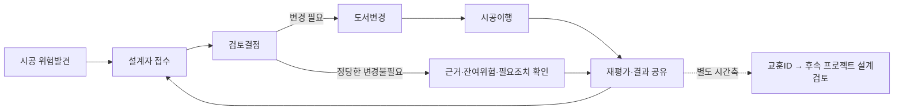

# DfS 환류의 정의·설문측정·검증방안 종합분석

## 결론부터 쉽게 말하면

**연구주제의 큰 방향은 유지해도 됩니다. 다만 ‘환류가 무엇인지’와 ‘설문에서 무엇을 물을지’를 맞추는 방향 조정은 필요합니다.** 현재는 1~3장까지 작성한 단계이므로, 분석 결과가 없다는 점을 문제로 볼 것이 아니라 앞으로 검증할 수 있는 계획인지 살펴봐야 합니다.

DfS는 ‘안전을 고려한 설계’입니다. 여기서 환류는 현장에서 발견한 문제를 설계자에게 돌려보내 설계 검토와 조치에 쓰는 과정입니다. 현재 문항에는 정보 전달·협업·예산 집행도 함께 들어 있어, 점수가 높아도 실제로 현장 문제가 설계에 되돌아갔는지는 분명하지 않을 수 있습니다.

**추천 방향은 주제를 바꾸기보다, 같은 현장의 문제가 설계 검토·조치로 이어지는 과정을 중심에 두고 문항을 보완하는 것입니다.** 다음 공사의 설계에 경험을 활용하는 문제는 따로 구분합니다. 설문으로 활동에 대한 응답을 조사할 수 있고, 실제 작동까지 확인하려면 설계자 답변·변경 도면·현장 적용 기록을 함께 보는 계획을 세우면 됩니다.

## 방향 판단: 무엇을 유지하고 무엇을 조정할 것인가

**판정: 연구주제는 유지, 개념과 측정의 연결은 조정. 현재 단계에서 연구 전체를 폐기하거나 다른 주제로 바꿀 근거는 없다.** 다만 연구의 타당성이나 학위논문으로서의 최종 성립을 보장한다는 뜻은 아니다. 아래 판단은 제1~3장의 이론·문항·연구방법에 대한 사전 검토이다.

| 판단 | 지금 정할 방향 | 이유 |
|---|---|---|
| 유지 | 설계와 시공 사이의 안전정보·경험이 어떻게 연결되는지를 연구 | 기존 원고와 확인된 해외 문헌에 연구대상의 근거가 있음 |
| 유지하되 명확화 | 설문을 활용한 연구 | 설문으로 응답자가 보고하는 환류 활동이나 역량 인식을 측정할 수 있음. 이를 실제 사건의 완결·사고 감소와 구분해야 함 |
| 우선 조정 | 정보 전달·협업·자원 지원과 시공→설계 환류의 역할 구분 | M1~M4의 지원·실행 활동을 모두 역방향 환류 자체로 부르면 정의와 측정이 어긋남 |
| 우선 조정 | M3의 ‘예산 환류성’ | 현 문항은 편성·배분·집행에 가까움. 자원지원으로 개명·분리하거나 현장 검토 결과에 따른 예산 조정을 묻도록 재설계 |
| 우선 조정 | M5의 요청·접수·검토·반영과 기준 시점 | 설계자에게 보냈다는 것과 검토·반영됐다는 것은 다름. 같은 사업의 개선과 다음 사업의 학습도 구분 필요 |
| 제3장에 구체화 | 문항 검토, 응답자 선정, 측정모형 선택 이유, 가능한 문서·사례 검증의 절차 | 아직 검증 결과가 없는 것은 자연스러움. 이후 어떤 증거로 판단할지는 지금 설명해야 함 |
| 이후 판단 | 척도의 통계적 타당성, 매개·조절 경로의 성립, 효과 크기 | 실제 자료를 수집·분석한 뒤 판단할 사항. 현재 검증 실패로 판정하지 않음 |

### 선택 가능한 두 방향과 권고

1. **환류를 중심에 두는 방향 — 우선 권고:** 같은 프로젝트의 시공정보가 설계 검토·조치로 돌아가는 과정을 핵심으로 좁힌다. M5를 정교하게 만들고 M1~M4는 핵심 환류와 어떤 관계인지 다시 정한다. 모두 삭제하거나 곧바로 독립변수로 옮긴다는 뜻은 아니며, 역할과 모형 변경은 이론적 근거를 갖춰 결정한다. 다음 프로젝트 학습은 별도 항목·사례로 둔다.
2. **넓은 DfS 실행체계를 연구하는 방향 — 대안:** 기존 다섯 활동 전체가 관심 대상이면 ‘DfS 실행체계’처럼 넓은 이름과 정의를 검토하고, 환류는 그중 한 영역으로 둔다. 문항을 유지하기 쉬울 수 있지만 제목·연구목적·가설도 그 범위에 맞춰야 하며, 이름 변경만으로 측정타당도가 확보되지는 않는다.

사용자가 제기한 핵심 질문이 ‘환류는 어떻게 확인하는가’이므로 첫 번째 방향을 우선 권고한다. 설문만 가능한 경우에는 자기보고 활동·역량 인식과 성과 인식 사이의 관계를 연구하도록 목적을 제한할 수 있다. 실제 환류 과정까지 연구목적에 포함하려면 문서·사례를 연결하는 방안을 제3장에 추가한다. 연구 전체를 대규모 종단실험으로 바꾸는 것을 필수조건으로 삼지는 않는다.

작성 기준: 2026-10-05 18:13 한국시간. 대상: 성주희 박사논문 현행 MD 제1~3장과 본문항 70개. 이 문서는 세 세부보고서를 종합한 **검토·설계 제안**이다. 원고·설문을 수정하지 않았고, 실제 효과를 입증하거나 최종 척도를 확정한 문서가 아니다.

**집필 단계에 관한 사용자 확인:** 현재 제3장까지 작성된 상태이다. 이 검토는 미작성된 제4장 분석결과나 제5장 결론을 평가하지 않으며, 뒤 장의 파일명이나 목차가 있더라도 작성 완료의 근거로 삼지 않는다. 집필 단계와 자료수집 진행상태는 별개이므로 조사 착수·완료 여부는 추정하지 않는다. 본문에서 ‘검증 필요’라고 한 부분은 향후 검증계획에 관한 요구사항이며, 아직 결과가 없다는 이유로 논문을 부적합하다고 판정한 것이 아니다.

요청에서 사용한 DSF는 Design for Safety를 뜻하는 **DfS**로 통일한다. Markdown은 고정 쪽수가 없으므로 ‘첫 페이지’는 아래 핵심판정 블록을 뜻하며 실제 인쇄 조판을 검증한 것은 아니다.

## 첫 페이지 핵심판정

**DfS 환류를 연구대상으로 삼는 방향은 유지할 수 있다. 다만 현재 M1~M5의 15문항이 넓은 실행체계를 측정할지, 실제 환류 과정을 측정할지를 제1~3장에서 분명히 정할 필요가 있다.** 설계→시공의 전달·실행, 시공→설계의 역방향 정보, 다음 프로젝트 조직학습이 같은 변수 안에 들어 있기 때문이다. 높은 설문 평균이나 2차 요인의 적합도만으로 실제 환류 고리 또는 위험저감 효과를 확인할 수 없다.

현재 정의는 DfS 관리 전 과정에 좁은 역방향 환류를 결합한 **연구자의 확장 조작화**로 볼 수 있다. 이런 확장 자체가 불가능한 것은 아니다. 다만 그 구성·측정이 국제적으로 확정된 표준척도라는 주장에는 별도 증거가 필요하다.

| 결정할 사항 | 종합 권고 |
|---|---|
| 주 분석의 대상 | **동일 프로젝트 안에서 시공의 위험정보를 설계 검토·결정·후속조치로 연결한 실행수준**. 설문만 있으면 ‘자기보고 환류 실행수준’으로 명명 |
| 별도로 둘 대상 | 다음 프로젝트로의 조직학습은 회사/프로젝트 쌍 단위의 별도 블록·사례. ‘할 수 있는 능력’에 대한 지각도 실제 실행과 분리 |
| 최우선 설계 | 동일 현장·동일 기간의 설문 + 사건ID별 문서추적. 위험발견→설계자 접수→검토결정→도서변경→시공이행→재평가를 연결 |
| 환류 성공의 뜻 | 접수, 검토, 반영, 이행, 효과를 분리. 정당한 반영불필요 결정도 기록하되 설계변경 성과나 위험저감으로 합산하지 않음 |
| 척도의 지위 | 해외 개념·실무 근거와 국내 신규 조작화를 구별. 본 문서의 초안도 내용·구조 타당화 전의 제안 |
| 현재 집필 단계의 우선순위 | 제3장까지의 정의·문항·자료수집·검증계획을 정비. 실제 신뢰도·타당도 및 가설 검정 결과는 이후 분석 단계에서 보고 |
| 이번 검토가 확인한 것 | 원고의 정의·시간논리·측정 사이 간극. 환류의 실증 효과, 인과적 매개, 국제 표준척도의 존재/부재를 확정한 것은 아님 |

**Why:** 순방향 전달을 환류라고 부르면 되먹임이 없는 현장도 높은 환류 점수를 받을 수 있다. **How:** 현행 문장의 방향·시간·주체를 실제 MD 행과 문항코드로 대조하고, 확인된 해외 근거의 범위에 맞춰 설문과 사건기록을 분리한다. **What:** 프로젝트 내 실행을 주 분석으로 좁히고, 역량 인식·고리 완결·위험변화·후속 프로젝트 학습을 각각 별도 증거로 검증하는 방안을 제시한다.

## 1. 근거 범위와 세 보고서의 결합

세부 근거는 다음 문서에 있다. 이 종합분석은 아래 세 문서를 읽지 않아도 판단과 실행안을 이해할 수 있도록 작성했다.

- [원고와 설문 DfS 환류 검토 근거](./261005_1808_원고와설문_DfS환류_검토근거.md): 현행 제1~3장·70문항의 행번호, 15개 M 문항 전문 및 내용 감사.
- [해외 선행연구 DfS 환류 근거 검토](./261005_1806_해외선행연구_DfS환류_근거검토.md): 실제 검색·서지 확인, 8개 해외 자료의 직접성·확인 수준·접근 한계.
- [DfS 환류 측정과 검증설계 제안](./261005_1804_DfS환류_측정과검증설계_제안.md): 역량 인식 초안 P/L, 사건 증거대장, 단계 분모와 세 수준 설계.

세 번째 보고서의 P1~P8은 ‘수행할 수 있는 체계’에 대한 **지각된 역량** 초안이다. 본 종합안의 주 분석은 원고 B:2941·C:276이 의도한 **실행수준**에 맞추므로, 7절에 행동 중심 Q1~Q8을 새로 제안한다. 두 초안은 측정대상이 달라 함께 섞거나 동등한 척도로 취급하지 않는다. P는 역량 연구를 별도 수행할 때의 대안이며 Q는 이번 종합 권고의 주 분석 후보이다.

아래 행번호는 HTML 주석을 포함한 실제 MD 줄번호이며 인쇄 쪽수가 아니다. 문항코드는 하위요인-요인 내 순번으로 대응했다. S의 M 문항 연번 1~15는 M1-1~M5-3에 해당한다.

| 약칭 | 원고·설문 파일(이 문서 기준 상대경로) |
|---|---|
| A | [제1장 서론](<../01. md변환/00. 논문(md)/01_제1장_서론.md>) |
| B | [제2장 이론적 고찰 및 선행연구 검토](<../01. md변환/00. 논문(md)/02_제2장_이론적_고찰_및_선행연구_검토.md>) |
| C | [제3장 연구방법](<../01. md변환/00. 논문(md)/03_제3장_연구방법.md>) |
| S | [70문항 설문](<../01. md변환/01. 설문(md)/02_설문지_70문항.md>) |

`CLAUDE.md`와 교수 논문작성요령의 구성개념→문항 연결, 두괄식, 출처표기, Why–How–What 원칙을 적용했다. 이론만으로 공변성을 확보하거나 목적표집만으로 교란을 제거했다는 주장은 채택하지 않았다. 선행 세부보고서의 검증 증거를 활용하고 종합 과정에서 연결되는 원고 행과 새 산출물의 정합성을 점검했다.

## 2. DfS/PtD, 좁은 환류, 확장된 환류체계는 무엇이 다른가

| 개념 | 방향·범위 | 설문·기록에서 구별할 기준 |
|---|---|---|
| 통상 DfS / Safety in Design / PtD | 설계에서 생애주기 위험을 제거·최소화하는 접근. PtD는 건설 외 작업·장비·공정도 포함 | 초기 검토뿐 아니라 재설계·지속 개선도 가능하므로 ‘DfS는 원래 단방향뿐’이라고 단정하지 않음 |
| 순방향 전달·이행 | 설계 위험정보·대책→도서→시공 작업 | M1·M4의 상당 부분이 해당. DfS 활동이지만 역방향 환류 자체는 아님 |
| 좁은 역방향 환류 | 시공 중 관찰·위험·대책 결과→책임 있는 설계자 접수·검토 | 단순 자료 저장·발신을 접수·검토와 구별. 최소 정보 환류의 발생과 후속 완료를 따로 판정 |
| 확장된 환류체계 | 수집·협업·자원·검토·설계판단·현장 이행·재평가가 연결된 체계 | M1~M5를 포함할 수 있으나 구성 활동의 높은 평균과 사건 고리의 완결을 구분 |
| 프로젝트 간 조직학습 | P사업 경험→조직 기준/교훈→Q사업 설계에서 검토·사용 | 회사·프로젝트 쌍의 시간연결 필요. 전달·저장과 실제 사용을 별도 확인 |
| 이중고리 학습 | 조치뿐 아니라 기존 목표·가정·판단기준을 재검토 | 정보가 왕복하거나 도서가 개정되었다는 사실만으로 성립하지 않음 |

DfS/PtD의 넓은 범위와 경험 교훈의 설계검토 투입은 NIOSH의 [PtD 과정 설명](https://www.cdc.gov/niosh/ptd/process/index.html), 운영경험의 향후 설계 반영은 WorkSafe NZ의 [설계안전 지침](https://www.worksafe.govt.nz/topic-and-industry/health-and-safety-by-design/health-and-safety-by-design-gpg/)에서 확인된다. 표의 좁은 환류·폐쇄고리 기준은 문헌을 비교하고 본 연구를 조작화하기 위한 **분석자의 작업상 정의**이며 국제 공통 척도 정의라고 제시하지 않는다.

법규상 정보파일 작성·갱신, 지침상 경험 공유, 회사 내부 학습, 조직 간 다음 신규 프로젝트의 재설계는 서로 다른 행위이다. 영국 CDM 2015 제12조 (5)는 후속 공사에서 필요할 정보를 담는 안전보건파일, (6)은 작업·변경에 따른 검토·갱신, (7)은 주시공자의 주설계자에 대한 관련 정보 제공을 규정한다. 이는 정보관리 경로의 근거이나 조직 간 다음 신규 프로젝트의 설계기준 재사용과 효과평가 전체의 의무를 직접 입증하지는 않는다. [공식 법규 원문, 제12조](https://www.legislation.gov.uk/uksi/2015/51/data.xht)

해당 조항은 코디네이터가 확인한 자료를 제공했고 종합 작성자가 공식 원문의 관련 문구를 다시 대조했다. 이는 영국 조항의 좁은 확인이며 국내 법령 전수 검토는 아니다. 국내 제도에 환류 통로가 전무하다는 사실로 일반화하지 않고 A:57·B:2865의 국내 제도 공백 단정은 **관련 조문 확인 전 판단 유보**로 남긴다. 지침의 권고도 곧바로 법적 의무로 바꾸지 않는다.

도식의 되돌아가는 화살표는 결과를 설계자에게 공유하고 필요하면 다시 검토하는 과정이다. 모든 사건에서 반복 변경이 필요하다는 뜻은 아니다.

## 3. 제1~3장 정의·인과·측정의 행번호 감사

| 실제 위치 | 확인되는 내용 | 종합 판단·수정 방향 |
|---|---|---|
| A:63 | 실행 확인 결과를 다시 설계·시공에 반영하는 순환 | 환류의 방향은 명확함. 프로젝트와 완료 조건을 추가하면 핵심 정의로 유지 가능 |
| A:260 | 설계 위험정보를 시공단계까지 ‘환류’ | 순방향 전달을 환류로 사용. A:63과 구별하여 전달·이행으로 표현 |
| A:57 / B:2865 | 환류 단계의 제도적 공백, 잔여위험 이행 확인 | 이행 확인 부재와 확인 결과의 설계 환류 부재를 혼동하지 않음. 법규 검증 별도 |
| B:569 | 현장 지식이 문서로 되돌아오지 않으면 일방향 | 원고 내부의 환류 판정 기준으로 유효. M1~M4만으로 부족한 이유 |
| B:2871 / C:812 | 전이·활용을 정의하고 후속 설계 순환을 연결 | ‘후속 설계’가 동일 사업 개정인지 다음 사업인지 명시해야 함 |
| B:2935 / B:6256 | 기존 국제 활동이라고 설명하면서 문항 직접 개발 명시 | 논리적 모순으로 단정할 필요 없음. 개념 선행근거와 신규 5차원 조작화·문항 검증의 다른 지위 명시 |
| B:2941 / C:276 | 사전 보유능력이 아니라 해당 사업의 실제 실행수준 | ‘역량’이라는 명칭 및 능력 문항과 구별. 주 분석을 자기보고 실행수준으로 개명 권고 |
| B:3069 / S:1095·1118·1141 | 학습 결과의 자원배분이라는 근거와 편성·우선배분·계획 집행 문항 | 환류에 의한 재배분이 문항에 직접 없음. M3 재개발 또는 지원요인으로 분리 |
| B:3439 / C:1449 | M3 관측 어려움 지적, 개별 문항 CVR은 계획 | CVR을 계획으로 제시하는 것은 현 단계에 부합. 이후 문항별 평가·수정 이력을 확보하도록 절차를 구체화 |
| B:3463 / B:3469 / C:145 | 모든 단계가 필요하다고 하면서 수렴하는 2차 요인·문항 평균 사용 | 과정의 필수단계와 반영적 잠재구인의 가정 구별; 6절 참조 |
| B:4045 / S:1315·1338·1361 | M5를 앞 네 요인과 다른 되먹임으로 명시 | M5를 별도 식별하되 요청·반영·다음 사업 전달을 분리 |
| C:270 | 이론적 근거로 공변성 확보 | 이론은 공변성의 예상 근거. 실제 공변성은 자료로 확인 |
| C:282 | 설계→시공 순서로 역인과 배제 | 공정 순서가 동시 설문 X·M·Y의 측정 순서를 보장하지 않음 |
| C:133 / S:1427~1519 | W를 착수 전 조건으로 규정하지만 현재 활용·회사 인식 질문 | W의 도입·측정 시점이 없으면 선행성이나 X의 영향 부재 확정 불가 |
| C:288 | 표본 제한과 일반특성 통제로 교란 대응 | 선별·통제는 부분 대응. 사고경험·공정·기초위험·조직체계 등의 잔여 교란 가능 |
| C:139 / C:1905·1911·1917 | X 다섯 1차 요인과 ‘2차 요인 세 변수’, ‘네 잠재변수’ 표현 병존 | 실제 추정식·그림·가설·측정모형을 일치시켜야 함 |
| C:1773 / S:39·2329·2365 | 업무수행자의 관측가능성 단정과 대체 현장·과거 장비 경험 질문 | 직함만으로 전체 예산·설계회신·차기 사업을 알 수 없음. 지정 현장 적격성과 자료 접근을 직접 확인 |

### M1~M5 유지·개명·분리 권고

| 기존 하위요인·문항코드 / S행 | 현재 측정내용 | 수집 전 권고 | 수집 완료 시 해석 |
|---|---|---|---|
| M1 저감 설계 반영도: M1-1~3 / 875·898·921 | 대책 선정, 최초 도서 반영, 설계변경과 위험저감 평가 | 초기 DfS 활동은 별도 배경/지원 블록으로 유지. 주 환류에는 ‘시공정보에 따른 재검토·개정’만 포함하고 안전 확보 결과를 분리 | 자기보고 저감설계 실행으로 기술. 환류로 인한 변경인지 미확인 |
| M2 전문가 협업도: M2-1~3 / 985·1008·1031 | 초기 공동검토, 공유, 사전 조정 | 초기 협업은 선행/지원 조건. 시공 중 사건의 공동검토·결정·회신은 주 실행 블록에 유지 | 일반 협업수준이며 역방향 환류 완료는 아님 |
| M3 안전보건 예산 환류성: M3-1~3 / 1095·1118·1141 | 위험별 편성·우선배분·계획 집행 | ‘안전 자원 배분·집행’으로 개명·분리. 환류를 보려면 검토 결과에 따른 추가·재배분의 근거를 새로 측정 | 예산지원/집행 수준. 명칭만 환류로 바꾸어 재해석하지 않음 |
| M4 시공단계 정보 이행도: M4-1~3 / 1205·1228·1251 | 설계정보 전달·실행·이행 점검 | 순방향 이행은 지원 블록. 사건과 연결된 변경 이행·재평가·설계자 회신을 주 실행에 포함; Y와 중복 정리 | 자기보고 전달·이행·점검수준. 효과 및 되먹임 미확인 |
| M5 시공경험 설계 환류: M5-1~3 / 1315·1338·1361 | 설계자 요청, ‘이후 설계’ 반영, 차기 사업 전달 | M5-1 개시 유지·접수/회신 추가. M5-2 동일 사업 개정으로 한정. M5-3은 프로젝트 간 학습으로 분리 | M5 보조 프로파일을 제시하되 요청=반영 또는 차기 전달=실제 학습으로 확대하지 않음 |

따라서 M1~M5를 모두 없앨 필요는 없다. 확장된 DfS 실행체계의 배경·지원 활동으로 보존할 수 있다. 다만 주 매개변수에 초기 지원조건, 현재 실행, 미래 조직학습을 한꺼번에 넣는 구성은 정리해야 한다. 재구성이 완료되기 전까지 기존의 5요인 15문항과 제안된 주 실행 블록이 같다고 표현하지 않는다.

### M과 Y의 내용 중복 및 부호 해석

M4-2(S:1228)의 실제 실행과 Y2의 방호 상태(S:1767~1836), Y4-1(S:2056)의 절차 준수는 같은 이행을 반복 평가할 수 있다. M4-3(S:1251)의 확인은 Y3-5(S:1992)의 시정결과 확인과 특히 가깝다. M은 특정 위험사건을 처리하는 과정, Y는 그 뒤의 안전 상태·위험노출·행동 결과로 내용·시점·정보원을 구분한다. 예방·행동성과를 Y에서 무조건 제외하자는 뜻은 아니다.

Y1-2(S:1611)의 ‘불필요한’ 설계변경 감소는 안전상 필요한 변경 증가와 구별해야 한다. Y5-1(S:2212)의 정량지표가 우수하다는 응답은 실제 재해율이 아니라 주관평정이다. X1-4(S:159)의 공법 변경, X4-4(S:627)의 불일치 발견은 대응·탐지 능력도 반영할 수 있고, X3·X5에는 시공 운영과 사업 도중 사건이 포함되어 있다. 높은 X를 설계 부실로 단정하거나 모두 착수 전 위험으로 취급하지 않는다.

원고의 X→M을 a<0, M→Y를 b>0, M×W→Y를 d>0으로 두면 조건부 간접효과는 a(b+dW), 조절된 매개지수는 ad<0이다. C:490~496은 음의 간접효과 강화 의미를 이미 설명하므로 부호 오류라고 단정하지 않는다. 다만 이를 기술의 ‘완충 효과’라고 바꾸어 설명하면 모형과 어긋난다. 위험이 클수록 검토·예산이 강화되어 M이 높아지는 경쟁 설명도 함께 검토해야 한다.

## 4. 해외 핵심 근거: 개념·경험연구·척도검증을 구분한다

확인수준은 선행 해외 근거보고서의 검증 기록을 따른다. **A=기관 HTML/PDF의 관련 본문 직접 확인, B=출판사 검색 노출 본문·표 일부 확인(직접 열기 제한), C=출판사 또는 출판사 등록 초록 확인**이다. A도 PDF 전체 정독을 뜻하지 않는다. 이 종합 작업에서 모든 원문을 새로 열었다고 주장하지 않는다.

| 문헌 | Why–How–What의 짧은 요약 | 본 연구에 쓸 근거 / 쓰면 안 되는 주장 | 수준·DOI·직접 URL |
|---|---|---|---|
| Henderson 등(2013) | 단계 간 학습 문제를 산업 실무 설문으로 조사하여 환류 개선 필요를 논의 | 설계–시공 환류의 개념·실태. 안전 전용 15문항 척도의 검증 근거는 아님 | C; [DOI 10.1108/09699981311324014](https://doi.org/10.1108/09699981311324014); [등록 초록](https://api.crossref.org/works/10.1108/09699981311324014) |
| Sacks 등(2015) | VR에서 설계자–시공전문가 대화를 통해 위험 이해·설계대안 제안을 관찰 | 현장지식의 안전설계 투입. 제안의 관찰을 실제 현장 적용·재해 감소와 구별 | B; [DOI 10.1080/01446193.2015.1029504](https://doi.org/10.1080/01446193.2015.1029504); [출판사 본문](https://www.tandfonline.com/doi/full/10.1080/01446193.2015.1029504) |
| Edwin(2023) | 면담으로 사고경험 공유와 초기 설계자에게 정보가 도달하지 않는 문제를 조사 | 접수·정보단절을 검증해야 할 근거. 공유 수준 분류는 검증된 조직역량 척도와 다름 | B; [DOI 10.1080/10803548.2022.2118983](https://doi.org/10.1080/10803548.2022.2118983); [출판사 본문](https://www.tandfonline.com/doi/full/10.1080/10803548.2022.2118983) |
| Chua & Goh(2004) | 사고인과모형을 사고자료에 적용하고 후속 안전계획 환류를 시연 | 사건 분류와 재사용의 공통 구조. 안전계획을 영구구조물 설계변경이나 후속 사업 효과시험과 동일시하지 않음 | C; [DOI 10.1061/(ASCE)0733-9364(2004)130:4(542)](https://doi.org/10.1061/%28ASCE%290733-9364%282004%29130%3A4%28542%29); [출판사 초록](https://ascelibrary.org/doi/10.1061/%28ASCE%290733-9364%282004%29130%3A4%28542%29) |
| Hallowell & Hansen(2016) | 설계자의 위험인지 수행을 실제 위험목록과 대조 | 자기평가 외 수행 준거의 필요. 인지능력은 조직 환류의 일부이며 전체 체계가 아님 | C; [DOI 10.1016/j.ssci.2015.09.005](https://doi.org/10.1016/j.ssci.2015.09.005); [출판사 초록](https://www.sciencedirect.com/science/article/abs/pii/S0925753515002349) |
| WorkSafe NZ(2018) | 준공 후·이용자 경험을 향후 설계 개선에 활용하도록 권고 | 후속 설계 학습의 실무근거. 법령 의무·이행효과·측정척도 검증으로 확대하지 않음 | A; DOI 없음; [공식 PDF](https://www.worksafe.govt.nz/dmsdocument/3951-health-and-safety-by-design-an-introduction/), 인쇄 p.36 |
| NIOSH(2025) | 설계 안전검토에 여러 역할의 경험 교훈을 투입하는 PtD 과정 설명 | PtD의 재설계·지속 개선 범위. 과정 표준과 표준화된 설문척도는 별개 | A; DOI 없음; [공식 HTML](https://www.cdc.gov/niosh/ptd/process/index.html) |
| Che Ibrahim 등(2026) | 문헌고찰로 산학관 DfS 협력 및 적응학습 틀을 제시 | 환류의 개념적 선행근거. 현장자료로 새 척도를 확증한 연구가 아님 | C + 도입부 일부; [DOI 10.1016/j.ssci.2025.107040](https://doi.org/10.1016/j.ssci.2025.107040); [출판사 초록](https://www.sciencedirect.com/science/article/pii/S0925753525002656) |
| Maxwell & Cole(2007) | 시간에 걸친 매개를 횡단자료로 추정할 때 종단 모수에 편향이 생길 수 있음을 검토 | 횡단 간접경로를 시간적 기제의 증명으로 읽지 않을 방법론 근거. DfS 척도 개발 연구는 아님 | C; [DOI 10.1037/1082-989X.12.1.23](https://doi.org/10.1037/1082-989X.12.1.23); [저자 초록·서지](https://pubmed.ncbi.nlm.nih.gov/17402810/) |

확인된 문헌은 환류라는 활동의 선행근거를 지지한다. 그러나 다섯 차원이 하나의 반영적 2차 요인을 이루고 해당 15문항이 이를 타당하게 측정한다는 것은 **본 연구가 새로 검증해야 하는 명제**이다. 국제 공통 척도가 확인되었다고도, 전 세계에 없다고도 단정하지 않는다. 목적지향 검색이므로 체계적 전수검색의 결론을 대신하지 않는다.

원고 B:4154의 Henderson 관련 문장은 ‘여덟 편 중’이라는 표 내부의 한정 판단이다. 이를 원고가 전 세계에서 유일한 연구라고 주장한 것으로 읽어서는 안 된다. 비평은 해당 표의 직접성 분류와 Henderson의 필요·장애 설문을 검증된 환류역량 척도로 볼 수 있는지에 한정한다. 현재 확보한 초록으로는 원 설문의 요인구조·타당화 여부를 확정할 수 없다.

## 5. 시간단위와 설문으로 가능한 주장

### 현재 프로젝트와 다음 프로젝트의 충돌

동일 프로젝트의 시간은 ‘기초 위험조건 X → 위험 발견·환류 실행 M → 해당 작업의 후속 결과 Y’로 설정한다. 초기 협업은 X나 이후 실행에 영향을 주는 선행 조건일 수 있고, 안전사고나 좋지 않은 Y가 추가 검토 M을 촉발하는 역방향도 가능하다. 현재 한 번의 회고 설문으로 모든 화살표의 방향을 확정할 수 없다.

프로젝트 간 학습은 ‘P사업 사건 → 교훈/기준 갱신 → Q사업 설계검토 → Q사업 적용·결과’라는 별도 시간축이다. P의 현재 Y 뒤에 생기는 Q의 적용을 P의 동시점 매개 M에 넣으면 시간 논리가 깨진다. M5-2의 ‘이후’는 P의 개정으로 좁히고, M5-3은 Q로 분리하는 것이 우선안이다.

| 자료 | 가능한 측정·주장 | 불가능하거나 추가 증거가 필요한 주장 |
|---|---|---|
| 같은 시점 자기보고 실행 설문 | 지정 기간에 자신이 관찰했다고 보고한 활동 수준, 인식 간 관련성 | 설계자 실제 수신, 도서 개정, 현장 적용, 위험저감, 인과적 매개의 확정 |
| 지각된 역량 P 설문 | 체계가 갖추어져 있다고 평가하는 정도 | 사건이 실제 있었다는 주장, 활동 기회 없이도 완료율이 높다는 주장 |
| 문서가 연결된 사건추적 | 어떤 단계까지 확인되는지, 지연·중단 지점, 정당한 불필요 결정 | 기록이 없는 활동의 부재 단정, 비교대상 없는 순수 효과 |
| 전후 재평가 | 동일 시나리오의 관찰된 위험 변화 | 공정·노출·동시조치가 다른 상태에서 환류만의 효과 확정 |
| 시간 순서를 갖춘 반복·비교 자료 | 선행수준을 고려한 변화와 관련성, 가정 아래 더 강한 기제 검토 | 관찰자료라는 이유만으로 남는 교란·선택·이탈이 자동 제거되었다는 주장 |

같은 응답자·같은 시점에 M과 Y를 묻는 공통방법 문제는 정보원을 나누고 원문항 내용을 분리해 줄인다. 단일요인 검사나 유의한 부트스트랩 구간 하나로 해결되었다고 쓰지 않는다. 설문에 실제 실행을 묻더라도 그 자료의 지위는 자기보고이다.

## 6. 반영적 2차 요인과 PDCA 단계 평균화 문제

B:3463의 ‘한 단계라도 끊기면 완결되지 않는다’는 논리는 필요한 단계의 **결합 조건**이다. 반영적 2차 요인은 상위 잠재특성이 하위요인들의 공분산을 설명한다는 측정 가정이다. 둘은 같지 않다. 설명용 가상값으로 M1~M4=5, M5=1이면 평균은 4.2지만 역방향 환류가 충분하거나 고리가 닫혔다고 할 수 없다. 이는 실제 자료가 아니라 평균의 보상성에 대한 반례이다.

| 판단 대상 | 권고 측정 |
|---|---|
| 연속적인 자기보고 실행수준 | 우선 문항·단계별 프로파일. 공통 잠재성향 가설이 있으면 반영형 구조를 내용·자료로 검토 |
| 사건 고리의 완결 | 적용 가능한 필수 단계의 증거 충족 여부를 사건 단위로 판정. 일부 높은 점수로 누락 단계를 보상하지 않음 |
| 넓은 실행체계의 구성 | 합성지수를 쓰려면 구성개념·가중치·누락 처리·외적 준거를 사전 결정. 형성적 모형이나 PLS가 자동 정답은 아님 |
| 위험저감 | 이행 후 독립적인 결과 측정. 실행 점수와 같은 문구·증거를 재사용하지 않음 |

하위요인 평균 다섯 개를 한 잠재요인에 연결한 모형은 원문항→1차 요인→2차 요인을 명시한 모형과 다르다. 평균 문항꾸러미로 내용 중복을 가리지 않고 원문항 수준부터 검토한다. 높은 요인상관은 2차 요인 채택의 충분조건이 아니며, 2차 요인 설정이 적합도 상승·다중공선성 해결을 보장하지 않는다.

전문가에게 관련성뿐 아니라 환류 방향·시점·필수성·관찰 가능성·Y와 중복을 평가하게 한다. 인지면접, 예비조사, 구조 탐색과 확인, 외적 기록과의 대조를 이어가되 실제 자료에서 하지 않은 검증을 완료형으로 쓰지 않는다. 내적일관성이 낮다는 이유만으로 필요한 비동질 단계를 삭제하지 않는다. 표본수·군집수·적합도·CVR 임계값은 임의 확정하지 않고 목적, 실제 패널, 응답 분포, 모형 식별과 정밀도/검정력에 근거해 정한다.

## 7. 권고 설문 초안: 프로젝트 내 실행 8개 + 조직학습 2개

**아래는 종합분석에서 새로 만든 미검증 초안이며 기존 70문항이나 세부보고서 P 문항과 동등하지 않다.** Q1~Q8이 주 분석 후보이고 L1~L2는 별도 회사·프로젝트 쌍 모듈이다. 10개를 하나의 총점으로 합산하지 않는다.

공통 안내: “지정한 현장 [현장코드]의 [시작일~종료일]에 실제 관찰하거나 기록으로 확인한 설계 관련 위험처리 경험을 기준으로 답해 주십시오.” 각 문항은 해당 단계의 기회가 있었는지를 먼저 확인하고, 있었을 때 ‘전혀 이루어지지 않음–드물게–때때로–대체로–항상 이루어짐’의 순서형 응답을 받는다. ‘기회 없음’과 ‘직접 확인 불가’는 점수 범주 밖에서 따로 기록한다. 빈도 문구의 해석과 응답 가능한 사건 범위는 인지면접에서 정비하며 임의 숫자 비율로 환산하지 않는다.

| 코드 | 문항 초안 | 전제 기회·관측 주체 | 기존 문항과 연결 |
|---|---|---|---|
| Q1 | 우리 현장은 시공 중 발견한 설계 관련 위험의 검토를 담당 설계자에게 요청했다. | 적격 위험 발견; 요청 참여자 | M5-1 |
| Q2 | 우리 현장은 요청한 위험정보를 담당 설계자가 접수했는지 확인했다. | 검토 요청; 발신·수신 확인자 | M5-1 보완 |
| Q3 | 우리 현장은 해당 위험에 대한 설계 검토결정의 근거를 확인했다. | 접수 후 검토 단계; 검토기록 접근자 | M2·M5 보완 |
| Q4 | 우리 현장은 검토결정에 필요한 자원을 확보할 책임자를 정했다. | 자원 확보 필요 결정; 담당자·공무 | M3의 일반 편성/집행과 분리 |
| Q5 | 우리 현장은 설계변경이 필요하다고 결정된 위험을 변경 설계도서에서 확인했다. | 변경 필요 결정; 개정도서 접근자 | M1-2·M5-2의 동일 사업 버전 |
| Q6 | 우리 현장은 변경 설계 내용이 해당 작업에 적용되었는지 확인했다. | 승인 변경·적용 공정 도래; 현장 검측자 | M4-2·3과 연결하되 과정 측정 |
| Q7 | 우리 현장은 조치 후 해당 위험을 다시 평가했다. | 조치 이행·재평가 시점 도래; 평가 참여자 | M4의 단순 이행 확인과 구별 |
| Q8 | 우리 현장은 재평가 결과를 담당 설계자에게 전달했다. | 재평가 실시; 발신·수신 확인자 | M5의 되먹임 확장 |
| L1 | 우리 회사는 이전 프로젝트의 설계 관련 위험사례를 지정한 후속 프로젝트의 설계담당자에게 전달했다. | 특정 P→Q 전이 기회; 회사 담당자 | M5-3 분리 |
| L2 | 우리 회사는 전달한 위험사례가 지정한 후속 프로젝트의 설계검토에 사용되었는지 확인했다. | Q의 검토 시점 도래; 후속 검토기록 접근자 | M5-2·3의 후속 사업 부분 |

Q1~Q8은 단계별 조건부 실행 프로파일이다. Q5~Q6은 정당한 변경불필요 사건에서 비적용일 수 있으므로 문항 평균을 바로 폐쇄고리 점수로 쓰지 않는다. Q8의 자기보고 전달도 실제 수신을 증명하지 못한다. 폐쇄고리 판정은 사건대장에 별도로 둔다. L1~L2만으로 잠재요인 식별·타당화가 확보되었다고 주장하지 않는다.

배경정보는 응답자 역할·직접 참여·관련 기록 접근, 현장/회사 익명코드, 근무·관찰기간, 대상 공정, 단계별 기회 유무를 포함한다. 설계·예산·현장 이행을 한 직종이 모두 알 것이라고 가정하지 않는다. 회사 질문은 해당 업무를 아는 정보원에게 배정한다. 개인 인식을 현장 수준으로 집계하려면 현장 내 합의와 현장 간 변동을 검토하며, 응답자 수를 독립 현장 수로 바꾸어 세지 않는다.

## 8. 실제 사건추적 표와 분모 규칙

### 최소 증거사슬

| 단계 | 사건ID로 묶을 증거 | 이 단계만으로 말할 수 없는 것 |
|---|---|---|
| 1 위험발견 | 날짜·구역·공종·위험 시나리오·발견경로·기초 위험 | 경보만으로 유효 위험 확정 |
| 2 설계자 접수 | 책임 설계자 수신·배정·접수번호 | 발신만으로 접수, 접수만으로 반영 |
| 3 검토결정 | 대안·채택/불필요/보류 사유·권한 있는 승인·회신 | ‘검토 완료’ 표시만으로 기술적 정당성 |
| 4 도서변경 | 변경 전후 도서번호·개정번호·승인·배포 및 사건 연결 | 회의 합의만으로 발행·현장 실행 |
| 5 시공이행 | 해당 구역 검측·사진·작업확인·실제 적용일 | 도서 배포·교육만으로 적용 |
| 6 재평가·결과 공유 | 같은 시나리오의 전후 평가·노출·동시조치, 설계자/현장 책임자 수신 | 완료 표기만으로 위험저감 또는 인과효과 |

최소 정보 환류의 **발생**은 현장 위험정보의 책임 설계자 접수로 판정한다. **검토 환류**, **설계반영**, **폐쇄고리 종결**은 그 뒤의 구분된 상태이다. 변경 경로의 폐쇄고리는 적용 가능한 1~6단계와 결과 공유까지 확인된 경우이다. 위험이 줄지 않았더라도 과정은 종결될 수 있으므로 효과는 별도 보고한다.

**복사해 사용할 사건 증거대장 양식 — 한 행은 사건의 단계·회차이다.**

| 회사ID/현장ID | 사건ID/원본신고ID | 위험·구역·공종 | 단계/회차 | 실제 발생일/기록일 | 책임자 | 문서ID·버전·쪽·보관 위치 | 결정·사유 | 확인/자료없음/상충 | 단계 기회·기한·기준일 상태 | 검토자 |
|---|---|---|---|---|---|---|---|---|---|---|
| 기입 | 기입 | 기입 | 기입 | 기입 | 역할코드 | 기입 | 기입 | 기입 | 기입 | 기입 |

**위험 재평가 양식 — 한 행은 비교 가능한 사건의 전후 평가이다.**

| 사건ID | 조치 전 날짜·위험등급·방법 | 변경·이행일 | 조치 후 날짜·위험등급·방법 | 노출량·작업량 전후 | 동시 안전조치·공정변화 | 감소/불변/증가 | 신규·전이 위험 | 결과 공유 증거 | 한계 |
|---|---|---|---|---|---|---|---|---|---|
| 기입 | 평가자·증거 포함 | 기입 | 평가자·증거 포함 | 기입 | 기입 | 사전 기준 적용 | 기입 | 문서ID·수신일 | 기입 |

시나리오·평가방법이 다른 전후 점수를 억지로 뺄셈하지 않는다. 서열형 위험등급은 이동을 우선 보고한다. 사고 건수는 작업량·노출시간·공정과 함께 해석하며, 무사고를 곧 위험저감으로 인정하지 않는다. 독립 판정자의 일부 중복 코딩과 불일치 해결 기록으로 판정 일관성을 점검한다.

### 변경불필요와 미완료 처리

정당한 반영불필요 J는 설계자의 기술근거, 잔여위험 검토, 권한 있는 승인, 현장 회신이 있어야 한다. 필요하다면 설계 외 현장조치의 이행과 재평가까지 확인한다. J는 검토 성과이나 변경 성공은 아니다. ‘추가 검토’, 근거 없는 거절, 책임 없는 타 부서 이관은 J로 종결하지 않는다. 설계 외 조치로 이관한 경우 인수자·기한·후속 결과를 추적한다.

| 지표 | 분자/분모 | 함께 제시할 사항 |
|---|---|---|
| 접수 확인 | 접수 확인 R / 기간 내 적격 등록사건 E | 미접수·대기·자료없음 구별 |
| 검토결정 | 최종 결정 V / R | 변경 필요 C, 정당한 J, 정당성 미확인 구별; 보류는 V 제외 |
| 도서변경 | 승인 변경 D / C | 기한 전·초과·문서없음; J는 분모 제외하되 E에 남김 |
| 시공이행 | 확인 이행 I / 승인 변경 중 적용 공정 도래 H | 공정 미도래 수 별도 |
| 재평가 확보 | 비교 가능한 평가 A / 이행 후 재평가 시점 도래 B | 자료 누락·미도래 수 별도 |
| 관측 위험저감 | 저감 기준 충족 G / A | 불변·악화, 전체 B 대비 G/B와 자료확보 한계 병기 |
| 전체 고리 종결 | 변경 경로 종결 + J 경로 종결 / E | 두 경로를 중복 없이 별도 제시; 효과와 분리 |

등록기간·기준일·완료기한·대상 공정을 수집 전에 정한다. E는 성공 여부와 무관하게 적격 위험을 등록하며 회의록·RFI·점검자료를 대조한다. 중복 신고는 하나의 사건으로 묶고 분할·병합 이력을 남긴다. 미완료는 필요한 절차가 끝나지 않은 상태, 자료없음은 실행 여부가 확인되지 않는 상태, 비적용은 단계가 논리적으로 필요 없는 상태이다. 서로 바꾸어 코딩하지 않는다.

확인 불가 사건은 성공 분자에 넣지 않으며 알려진 대상 분모에서 지우지도 않는다. 적용 여부 자체가 불명인 사건은 미확정 수와 포함/제외에 따른 범위를 보고한다. 분모가 0이면 ‘산출 불가’이다. 미완료 사건의 처리시간은 검열 상태를 남기고 완료자 평균만으로 전체 속도를 설명하지 않는다. 후속 프로젝트가 없는 L은 적용기회 미도래이지 실패가 아니다.

## 9. 제3장에 반영할 검증계획과 자료수집 단계별 참고

**우선안은 단계별 설문과 제한된 문서추적의 결합이다.** 문서 접근이 가능한 현장을 선정하되 선택·거절 이유를 남기고, 선정 현장 안에서는 사전 기간의 적격 사건을 성공 여부와 무관하게 등록한다. Q 설문과 사건자료의 현장·기간을 맞추고 설문 응답자가 접수·결정·이행을 모두 자기평가하는 구조를 줄인다.

| 접근 수준 | 최소 실행 | 주 결과 | 주장 한계 |
|---|---|---|---|
| 1 설문뿐 | 동일 현장·기간·역할, Q와 Y 내용 분리, 기회 없음/모름 분리, 현장 군집 식별 | 자기보고 실행 프로파일과 지각된 성과의 연관성 | 실제 환류·고리 완결·효과·시간적 매개 입증 불가 |
| 2 설문+문서 — 우선 | 수준 1 + 사건대장·설계자 수신·결정·개정도서·검측 및 확보 가능한 재평가 | 지각과 문서의 일치/불일치, 단계 전환·지연·정당한 J·부정 사례 | 문서선택 편향·불완전 기록, 비교 없는 변화의 대안 설명 |
| 3 종단 가능 | 대상 공정 전 X·기초 Y·W/실행조건 → 진행 중 M → 이행 후 Y, 가능한 P/Q/Y 반복과 후속 사업 추적 | 기초수준과 시간차를 고려한 변화·기제 검토 | 비무작위 선택·시간변화 교란·이탈의 가정과 한계 존속 |

단계 간 간격은 임의로 몇 개월이라고 정하지 않고 위험발견→설계검토→시공의 실제 처리주기로 정한다. 과거 문서의 날짜를 추적하는 것은 후향적 사건추적이며 전향 종단조사와 구별한다. 회사→현장→응답자/사건의 군집을 보존하고 자료 규모·분포가 지지하는 다층 또는 군집 조정을 선택한다. 회사 학습 L을 여러 현장에 복제해 독립 표본처럼 세지 않는다.

현재 확인된 상태는 **제3장까지 집필**이다. 아래 표는 자료수집 진행상태가 별도로 확인될 때 적용할 참고이며, 수집 완료를 전제로 현재 논문을 평가하는 표가 아니다.

| 자료수집 단계별 참고 | 실행 권고 |
|---|---|
| 아직 수집 전 | 정의·시점·정보원부터 고정하고 Q/P 중 목적에 맞는 블록 선택, 전문가·인지면접·예비조사 후 본 조사 |
| 수집 중 | 문항 변경 버전을 분리하고 변경일·배포대상 기록. 서로 다른 척도의 점수를 검토 없이 합치지 않음 |
| 수집 완료 | 기존 응답 보존. M의 의미를 자기보고 DfS 실행체계로 제한하고 M5 별도 프로파일·중복 민감도 분석을 사후 탐색으로 표시. 신규 문항은 후속 조사 |
| 현재: 제3장까지 집필 | 정의·문항·검증계획의 정합성을 우선 검토. 자료수집 진행상태는 별도 확인 대상으로 남김 |

설문이 완료되었다고 해서 M5 하나로 새 매개모형을 사후 확정하는 것도 피한다. 원래 분석과 탐색 분석을 구별한다. 공개 사고사례 2건은 가능한 실패경로를 설명하지만 일반 환류 효과나 해당 설문 표본의 시간 순서를 증명하지 못한다. 같은 등록기준의 완료·부분·미완결·정당한 불필요 사례 비교가 과정 검증에 더 직접적이다.

## 10. 제1장 목적·제2장 정의·제3장 조작화의 대체문장

아래 문장은 **수집 전 재설계를 채택하는 경우의 제안문**이며 원고 반영본이 아니다. 자료 확보 여부에 따라 미래형·범위를 조정해야 한다.

**제1장 연구목적 — A:63·260과 연결**

> 본 연구는 도심지 주상복합 건설현장에서 시공 중 확인된 설계 관련 위험정보가 설계자의 검토와 결정으로 연결되는 프로젝트 내 DfS 환류 실행수준을 살펴보고, 이 실행수준과 안전관리성과의 관계를 분석하고자 한다. 설문으로 보고된 실행과 문서로 확인되는 사건 처리과정을 구분하며, 자료가 허용하는 범위에서 설계반영·현장 이행·위험 재평가의 연결을 검토한다. 후속 프로젝트로의 경험 전이는 현재 프로젝트 성과와 시간단위가 다르므로 별도 조직학습 항목과 사례로 다룬다.

**제2장 개념 정의 — B:2871·2935·2941·4045와 연결**

> 본 연구에서 프로젝트 내 DfS 환류 실행은 시공 중 발견한 설계 관련 위험정보가 책임 있는 설계자에게 접수되고, 검토결정과 필요한 후속조치 및 결과 공유로 이어지는 과정을 말한다. 설계정보의 시공 전달·이행은 이 과정의 기반이지만 그 자체를 역방향 환류로 보지는 않는다. 검토 결과 설계변경이 불필요하다고 정당하게 판단한 사건도 별도로 기록한다. 해외 연구와 지침은 이러한 학습·정보환류의 개념적 근거를 제공하지만, 본 연구의 문항 구성과 측정모형은 국내 현장 맥락에서 별도로 검증해야 한다.

**제3장 조작적 정의·해석 범위 — C:145·276·282·812와 연결**

> 설문은 지정 현장과 기준기간에 관찰한 환류 활동의 실행수준을 자기보고로 측정한다. 단계별 활동 기회가 없거나 응답자가 직접 확인할 수 없는 경우는 낮은 실행 점수와 구별한다. 문서 접근이 가능한 경우 사건ID를 기준으로 접수·검토결정·도서변경·시공이행·재평가를 연결하고, 절차 종결 여부와 위험변화를 각각 판정한다. 설문 평균이나 잠재요인 점수는 사건 고리의 완결을 대신하지 않는다. 횡단자료의 간접경로는 설정한 모형 아래의 통계적 관련성으로 해석하며 시간적·인과적 매개의 확정 근거로 사용하지 않는다.

**추후 설문자료만 확보된 경우의 해석 참고문안 — 현재 집필 단계의 평가가 아님**

> 본 연구는 기존 설문으로 수집한 설계위험 인식, DfS 실행에 대한 자기보고 및 안전관리성과 인식 사이의 관련성을 분석한다. 시공경험의 설계 환류 문항은 별도 보조 프로파일로 제시하되, 실제 설계자 접수·설계반영·위험저감이나 다음 프로젝트의 학습 효과를 확인한 것으로 해석하지 않는다. 새 측정안은 후속 연구 제안으로 구분한다.

## 11. 심사문답

| 예상 질문 | 방어 가능한 답 |
|---|---|
| DfS 환류는 새로 만든 개념인가 | 설계–시공 학습과 현장정보의 설계 투입은 선행연구가 있다. 다만 이 연구의 5차원·15문항 조작화는 별도의 신규 측정 검증 대상이다. |
| 일반 DfS와 무엇이 다른가 | 넓은 DfS 중 시공에서 설계로 돌아가는 정보의 접수·결정·후속 처리를 주 대상으로 좁혔다. |
| 설문으로 실제 환류를 측정했는가 | 설문은 관찰했다고 보고한 실행수준이다. 실제 사건은 수신·개정·이행 기록을 대조한 범위에서만 확인한다. |
| M1~M4가 높으면 환류가 좋은 것 아닌가 | 지원·순방향 실행이 좋을 수 있으나 M5가 약하면 되먹임이 끊길 수 있다. 단계 프로파일과 사건 완결을 따로 본다. |
| 2차 요인이 적합하면 순환이 증명되는가 | 공분산 구조의 적합성과 사건의 시간적 연결은 다른 증거이다. |
| 설계변경이 없으면 실패인가 | 정당한 불필요 결정을 별도로 인정한다. 변경률 극대화가 목표가 아니며 기술근거·잔여위험·회신·필요조치가 있어야 한다. |
| 다음 사업 학습도 현재 M에 넣어야 하지 않는가 | 중요하지만 현재 Y 이후의 사건일 수 있다. 프로젝트 쌍과 기간을 분리해야 시간 역전을 피한다. |
| 매개가 유의하면 인과가 증명되는가 | 아니다. 횡단자료는 시간적 우선성·역인과·미측정 교란을 해결하지 못한다. |
| 회사당 여러 현장의 응답은 독립인가 | 회사·현장 코드를 보존하고 군집을 고려한다. 개인 수를 현장 수로 해석하지 않는다. |
| 해외 법규가 다음 프로젝트 환류를 의무화했는가 | 이번 확인 자료만으로 그 범위까지 단정하지 않는다. 파일 갱신·경험공유와 다음 신규 사업 재설계 의무는 별도 조문 검토 대상이다. |
| 원고의 가장 현실적인 개선은 무엇인가 | 현재 프로젝트 실행으로 정의를 좁히고 M5의 시점을 명확히 하며, 문서가 가능한 사건부터 접수·결정·반영을 연결하는 것이다. |

## 12. 현재의 설계 보완 순서와 이후 실증 단계의 완료 조건

1. **제1~3장 개념·범위 고정:** 프로젝트 내 실행을 주 대상으로 정하고 능력·실행·결과·다음 사업 학습의 경계를 명시한다.
2. **장간 표현 정비:** A:260의 순방향 환류, B:2871·C:812의 후속 설계, B:2941·C:276의 역량/실행 명칭을 일치시킨다.
3. **문항 정비:** M3 지원자원과 M5 다음 사업을 분리하고 M4/Y 중복을 해결한다. 이미 수집한 응답은 유지한다.
4. **내용·관찰 가능성 검증:** 전문가 판단·인지면접·예비조사에서 방향·주체·시점·기회·모름 처리를 확인한다. 기존 FGI와 문항 타당도를 구별한다.
5. **사건대장 적용:** 적격사건 전체 등록, 설계자 수신 확인, 결정·도서·현장·재평가 연결, J·자료없음·미완료 처리 기준 확정.
6. **분석·해석 정비:** 실제 모형 식별과 문항구조를 검토하고 개인·현장·회사 군집을 고려한다. 표본·임계치를 관행 숫자로 확정하지 않는다.
7. **주장 수준 점검:** 설문 연관성, 기록된 과정, 전후 변화, 인과효과를 구분하여 초록·목적·결론까지 표현을 맞춘다.

연구의 실증 완료 조건은 원하는 가설의 채택이 아니다. 문항 정제 이력, 문서 접근·누락 기록, 단계별 분모, 실패·불필요 결정 사례, 불확실성, 분석 재현자료를 남겨 무엇을 확인하고 무엇을 확인하지 못했는지 설명할 수 있어야 한다.

## 13. 한계와 참고문헌

이번 분석은 제3장까지 작성된 논문의 연구 방향·설계 검토와 확인된 문헌의 범위 내 종합이다. 아직 실증 결과가 없다는 사실은 현 단계의 결함으로 평가하지 않는다. 새 Q/L 문항, 단계 완결 기준과 분모는 신규 제안이며 전문가 내용타당도·요인구조·사건 판정 신뢰도·안전효과를 아직 검증하지 않았다. 법규의 포괄적 검토와 해외 문헌 전수검색도 수행하지 않았다. 일부 학술문헌은 초록·검색 노출 본문 수준이므로 원 설문·통계표의 전용 가능성을 확정할 수 없다.

아래 학술·기관 서지는 세부보고서에서 실제 검색·등록정보 대조를 마친 자료만 수록했다. 권호·쪽/논문번호 기준이며, DOI·직접 접근 경로와 확인 수준은 4절에 함께 제시했다. 공식 법규는 코디네이터 확인자료를 2절에서 추가 대조했다. 원고에 등장했지만 이번 확인목록에 없는 문헌을 추가 참고문헌으로 채택하지 않았다.

1. Henderson, J. R., Ruikar, K. D., & Dainty, A. R. J. (2013). The need to improve double-loop learning and design-construction feedback loops: A survey of industry practice. *Engineering, Construction and Architectural Management, 20*(3), 290–306. DOI: 10.1108/09699981311324014.
2. Sacks, R., Whyte, J., Swissa, D., Raviv, G., Zhou, W., & Shapira, A. (2015). Safety by design: dialogues between designers and builders using virtual reality. *Construction Management and Economics, 33*(1), 55–72. DOI: 10.1080/01446193.2015.1029504.
3. Edwin, K. W. (2023). Sharing incident experiences: a roadmap towards collective safety information in the Norwegian construction industry. *International Journal of Occupational Safety and Ergonomics, 29*(3), 1241–1251. DOI: 10.1080/10803548.2022.2118983. 온라인 선게재 2022, 권호 2023.
4. Chua, D. K. H., & Goh, Y. M. (2004). Incident causation model for improving feedback of safety knowledge. *Journal of Construction Engineering and Management, 130*(4), 542–551. DOI: 10.1061/(ASCE)0733-9364(2004)130:4(542).
5. Hallowell, M. R., & Hansen, D. (2016). Measuring and improving designer hazard recognition skill: Critical competency to enable prevention through design. *Safety Science, 82*, 254–263. DOI: 10.1016/j.ssci.2015.09.005.
6. WorkSafe New Zealand. (2018, August). *Health and Safety by Design: An introduction*. Good Practice Guidelines. DOI 없음.
7. National Institute for Occupational Safety and Health. (2025, January 6). *Prevention through Design Process*. Centers for Disease Control and Prevention. DOI 없음.
8. Che Ibrahim, C. K. I., Manu, P., Belayutham, S., Cheung, C., Mohammad, M. Z., Yunusa-Kaltungo, A., Ismail, S., Samsudin, N. S., Prabhakaran, A., Perez, P., Mahamadu, A.-M., & Hussain, A. (2026). Tripartite collaboration for design for safety in construction: A co-creation framework integrating academia, industry, and government. *Safety Science, 194*, 107040. DOI: 10.1016/j.ssci.2025.107040.
9. Maxwell, S. E., & Cole, D. A. (2007). Bias in cross-sectional analyses of longitudinal mediation. *Psychological Methods, 12*(1), 23–44. DOI: 10.1037/1082-989X.12.1.23.
10. United Kingdom. (2015). *The Construction (Design and Management) Regulations 2015*, SI 2015/51, regulation 12(5)–(7). [공식 원문](https://www.legislation.gov.uk/uksi/2015/51/data.xht). DOI 없음. 관련 조항 텍스트 확인이며 전체 법률 자문은 아님.

## 14. 산출물 검증 기록

| 검토 항목 | 검증 내용 |
|---|---|
| 입력 범위 | 이번 Run의 원고·설문, 해외 근거, 측정·검증설계 보고서 세 개를 종합. 별도의 직접/매개효과 보고서는 본 종합의 입력에 포함하지 않음 |
| 원고 행 연결 | A·B·C 핵심 행의 실제 텍스트와 종합 감사표를 대조. S 문항은 원고·설문 보고서의 70문항 행 매핑과 대응 |
| 내용 통합 | 실행수준을 주 분석으로 선택하면서 기존 설계보고서의 P 능력 초안과 새 Q 행동 초안의 차이를 명시 |
| 신규 제안 표시 | Q1~Q8·L1~L2, 사건 완결 기준, 대체문장을 미검증 제안으로 표시 |
| 문헌 범위 | 이미 확인된 해외 8개 + 방법론 1개, 추가 제공·대조한 공식 법규 1개. A/B/C 확인수준과 직접 URL·DOI를 연결 |
| 결과물 형식 | UTF-8 Markdown 한 파일. 저장 후 엄격 디코딩, 깨짐 대체문자, 가짜 내부 웹 인용코드, 상대링크 대상을 점검 |
| 원고 보호 | 제1~3장·설문은 읽기 전용. 선행 보고서에 제시된 원본 해시와 대조하여 무수정 여부 확인 |

저장 후 검증 결과: UTF-8 엄격 디코딩 통과, 초안 10개(Q 8개·L 2개), 상대링크 7개 모두 실제 파일로 연결, 명시적 A/B/C/S 행 참조 54개 모두 실제 비어 있지 않은 행으로 연결됨을 확인했다. 핵심 행의 의미와 문항코드는 앞선 내용 대조로 확인했으며 행 존재 검사만으로 의미를 검증했다고 보지 않는다. 깨짐 대체문자·가짜 내부 웹 인용코드는 0개이고 간단 환류 도식을 포함했다. 제1~3장과 설문의 SHA-256은 선행 원고감사 보고서의 값과 모두 일치했다. 이 형식·정합성 검증은 척도나 효과의 실증 검증을 대신하지 않는다.
