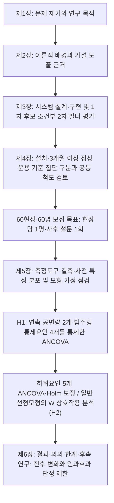
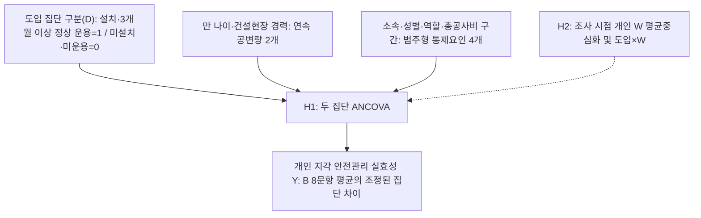

# MD → blocks 변환 리포트 (T2)

`python tools/hwpx_transfer/md_to_blocks.py` 실행 산출물이다. 8개 원고 MD를 verbatim 블록 JSON으로 변환하고, 모든 비어있지 않은 원본 행이 블록 텍스트 또는 excluded에 존재하는지 자기검증한 결과를 담는다.

처리 방침(코디네이터 승인, 2026-07-25): 코드펜스 ASCII 다이어그램 3곳과 "본문 아님"/"내부 관리용" 명시 h2 섹션 2곳은 excluded(원문 전문 보존), 부록2 h6 제목은 h1로 매핑, `<div>` 단독 행은 excluded(html_tag), `<br>`·`&emsp;`는 verbatim 보존 후 아래 '조립기 처리 목록'에 인계한다.

## 1. 파일별 블록 통계

| 파일 | h1 | h2 | h3 | h4 | p | 표 캡션 | 표 | 표 행(데이터) | 그림 캡션 | 그림 자리 | excluded |
|---|---:|---:|---:|---:|---:|---:|---:|---:|---:|---:|---:|
| 01_서론.md | 1 | 3 | 0 | 0 | 19 | 3 | 2 | 14 | 1 | 0 | 42 |
| 02_이론적배경.md | 1 | 6 | 15 | 0 | 65 | 5 | 5 | 34 | 0 | 0 | 114 |
| 03_시스템개발.md | 1 | 5 | 14 | 0 | 74 | 12 | 9 | 60 | 5 | 0 | 121 |
| 04_연구설계.md | 1 | 5 | 6 | 0 | 64 | 7 | 6 | 47 | 1 | 0 | 88 |
| 05_실증분석결과.md | 1 | 5 | 8 | 0 | 74 | 9 | 20 | 120 | 0 | 0 | 128 |
| 06_결론.md | 1 | 0 | 0 | 0 | 10 | 0 | 0 | 0 | 0 | 0 | 10 |
| 부록1_설문지_양식.md | 3 | 8 | 0 | 0 | 67 | 0 | 4 | 24 | 0 | 0 | 99 |
| 부록2_설문항목_근거매핑.md | 1 | 8 | 0 | 0 | 12 | 0 | 7 | 93 | 0 | 0 | 42 |

## 2. 커버리지 자기검증

모든 비어있지 않은 원본 행에 대해 (a) 블록 text/runs/cell 포함 또는 (b) excluded 기록을 확인했다. 비교 전 리스트 글머리와 마커 문자(`#`, `|`, `**`, 백틱, `-`, `\`, `>`)·공백을 정규화했다. '마커뿐'은 정규화 후 내용이 남지 않는 행(수평선·표 구분행 등)이다.

| 파일 | 총 행 | 비어있지 않은 행 | 내용 대조 통과 | 마커뿐(자동 통과) | 누락 |
|---|---:|---:|---:|---:|---:|
| 01_서론.md | 106 | 70 | 63 | 7 | 0 |
| 02_이론적배경.md | 257 | 152 | 139 | 13 | 0 |
| 03_시스템개발.md | 310 | 190 | 181 | 9 | 0 |
| 04_연구설계.md | 238 | 151 | 144 | 7 | 0 |
| 05_실증분석결과.md | 387 | 265 | 239 | 26 | 0 |
| 06_결론.md | 21 | 11 | 11 | 0 | 0 |
| 부록1_설문지_양식.md | 242 | 163 | 148 | 15 | 0 |
| 부록2_설문항목_근거매핑.md | 176 | 144 | 131 | 13 | 0 |

**누락 0 — 8개 파일 전체에서 커버리지 목표를 충족했다.**

## 3. 제외 블록 전체 목록 (파일별, 사유·행 범위·전문)

빈 줄(blank)은 개수만 표기하고, 그 외 모든 제외 블록은 원문 전문을 기록한다.

### 01_서론.md

- 빈 줄 35개 (excluded에 `{"reason": "blank", "text": ""}`로 기록)
- **editorial_blockquote** (blockquote(편집 메모)) — 3~4행

````
> **작성 상태:** 2026.09.13 지도의 현장 작동성 논지를 유지하고, 2026.10.04 지도에 따라 제1절을 '주장 → 근거(표) → 문제점·필요성 → 개발' 4단으로, 제2절을 목적 문장으로 끝나는 6문단으로, 제3절을 범위·방법과 장별 구성표로 다시 썼다(2026.10.07).
> **분량 목표:** 제1절 2p, 제2절 1p, 제3절 2p(표·흐름도 포함).
````
- **horizontal_rule** (수평선(---)) — 6행

````
---
````
- **horizontal_rule** (수평선(---)) — 37행

````
---
````
- **horizontal_rule** (수평선(---)) — 53행

````
---
````
- **ascii_diagram** (코드펜스 ASCII 다이어그램) — 80~90행

````

````
- **horizontal_rule** (수평선(---)) — 96행

````
---
````
- **editorial_section** (본문 아님 명시 섹션) — 98~106행

````
## 작성 메모(제출 전 확인 사항 — 본문 아님)

- [ ] **윤영석 발행연도 재확인(2026-09-30):** 원문에서 2025학년도와 2025년 12월 제출·인준을 확인하였다(경기대학교 공학대학원 건축·안전공학전공 석사학위논문, 지도교수 박종용). 과거에는 제출일만으로 인용 연도를 2025로 확정했으나, 학위수여·발행연도는 공식 서지에서 추가 확인해야 한다. [확정 필요: 윤영석 학위수여·발행연도 — 현행 2025 표기는 잠정 유지]
- [x] **박종학 인용 연도 재확정(2026-07-12 표지·제출면 재대조):** 표지는 "2024학년도 석사학위논문"이나 제출면이 "2025년 6월"이므로 인용 연도는 수여·발행 연도 기준 **박종학(2025)**로 최종 확정(경기대학교 공학대학원 건축·안전공학전공, 지도교수 문유미). 이전 "2024 확정" 기록은 표지 학년도만 본 오판이었음. 전 장 표기를 2025로 통일 완료(학회논문 참고문헌 [05]의 2025와도 일치)
- [ ] [확정 필요: 실제 미도입 현장 확보 수, 측정 구조 확인 방법을 제4장과 동시에 확정]
- [x] 배경 통계는 고용노동부(2025) 원문 추출자료에서 확인한 2024년 건설업 업무상사고 사망자 328명과 <표 1-1>의 공사금액 규모별 구성비(120억 원 미만 71.6%, 3억 원 미만 34.8%), 같은 자료의 공사금액별 사망만인율(3억 원 미만 4.92‱, 1,000억 원 이상 0.80‱)을 사용한다. 만인율은 전체 사망자 기준이어서 <표 1-1>과 분모가 다르다는 점을 본문에 밝혔다. 전 산업의 50인 미만 사업장 통계는 건설업 규모별 근거로 사용하지 않았다(2026-10-10 현행화).
- [x] 상황실 구축 1,200만 원은 국토교통부·국토안전관리원(2024) 가이드라인 인쇄 23쪽(PDF 27쪽)에서 서버·네트워크·방송시설 포함 단가로 확인하였다. 월간 요금의 출처와 대안별 총비용 비교의 잔여 확인 사항은 제3장 <표 3-9>를 따른다.
- [x] 연구흐름도(&lt;그림 1-1&gt;)의 구 ANCOVA PNG 연결을 당시 혼합모형 Mermaid 도식으로 대체함(2026-09-13 MD 수정). 2026-10-03에는 현장당 1명·60명과 ANCOVA를 반영하여 위 Mermaid 도식을 수정하였다. HWPX 반영은 별도 작업이다.
- [x] **2026-10-04 지도 반영(2026-10-07 MD 수정):** <표 1-1>을 '건설업 공사금액 규모별 업무상사고 사망자 분포(2024년)'로 교체하였다(고용노동부 2025 인쇄 336쪽 원표, 비율은 연구자 계산, 120억 원 미만 누적 71.6%). 이로써 종전 표 주에 남아 있던 규모별 원표 확인 표기(CITE_TODO)를 해소하였다. 김석기(2026)의 2023년 68.5%는 재인용하지 않는다. 제1절은 인용 없는 주장 문단으로 시작하고 선행연구 인용 9건을 요약 서술로 바꾸었으며(해당 문헌은 제2장에 있음), Zhou et al.(2023)의 통계 불일치 논평은 제2장 <표 2-5>·작성 메모로 넘겼다. 제2절은 6문단으로 바꾸고 마지막 문단을 확정 목적 문장으로 시작하였다. 제3절은 공간·시간·내용 범위와 <표 1-2> 장별 구성을 신설하고 흐름도의 제1장·제2장 노드를 분리하였다. 한계 서술은 제6장으로 넘기고 두 문장만 남겼다. HWPX 반영과 00_목차의 표 목차·초록 목적 문장 동기화는 별도 작업이다.
````

### 02_이론적배경.md

- 빈 줄 105개 (excluded에 `{"reason": "blank", "text": ""}`로 기록)
- **editorial_blockquote** (blockquote(편집 메모)) — 3~5행

````
> **역할:** 논문 주제를 뒷받침하는 개념과 선행연구를 고찰하여 서론의 논리(연구 필요성·목적)를 이론적으로 지지하고, 제4장 연구 모형·연구 가설 설정의 근거를 마련한다. 시스템의 구현 사실과 기술 성능 선행연구는 제3장에서 다룬다.
>
> **구조:** 제1절 연구 대상 기술의 개념 — 제2절 시스템 기술 특성 — 제3절 종속변수(안전관리 실효성)와 하위요인 — 제4절 상호작용 변수(안전관리 예산 제약성) — 제5절 선행연구와 연구 가설 도출 근거 — 제6절 소결.
````
- **horizontal_rule** (수평선(---)) — 7행

````
---
````
- **horizontal_rule** (수평선(---)) — 31행

````
---
````
- **horizontal_rule** (수평선(---)) — 95행

````
---
````
- **horizontal_rule** (수평선(---)) — 170행

````
---
````
- **horizontal_rule** (수평선(---)) — 190행

````
---
````
- **horizontal_rule** (수평선(---)) — 238행

````
---
````
- **horizontal_rule** (수평선(---)) — 250행

````
---
````
- **editorial_blockquote** (blockquote(편집 메모)) — 252~257행

````
> **[집필 메모 — 본문 아님]**
> - 해결됨(2026-07-12 원문 대조 완료): MonitorVLM 저자 표기는 arXiv:2510.03666 원문 대조로 **Wu et al.(2025)** 확정. ref 03은 **박종학(2025)**(기존 "문유미"는 지도교수명 오기), ref 05는 **김현수(2026)**, ref 29의 저자명은 윤영석으로 확인하였으나 **2025년 표기는 발행연도 확인 전 잠정 유지**한다[확정 필요: 윤영석 학위논문 발행연도].
> - 해결됨(2026-07-12): 표 번호를 등장 순서대로 재부여 — 구 <표 2-3>(단일 YOLO vs 캐스케이드 비교) → <표 2-2>, 구 <표 2-2>(하위요인 선행연구 요약) → <표 2-3>. 00_목차.md 표 목차 동기화 완료.
> - 2026-09-12 서지 재검증에 따라 문헌 06·18(이창남, 2025), 19(Mi, 2025), 22(김용선, 2022), 28(조도빈, 2026), 32(류정·박인선, 2025)의 저자·연도를 반영하였다. 06·18은 동일 문헌이며 대표 번호는 06이다. Tiwari·Herstatt의 정확한 문헌 식별과 개별 주장·인용 쪽수의 미확정 범위는 유지한다. 문헌 09의 서지는 유지하며 문헌 04의 저자는 2026-09-30 원문 대조로 김태헌(2026)으로 교정하였다. 이형도 학위논문은 발행연도 2024년으로 교정하였다.
> - 2026-09-30 팩트체크 수정: 본문의 선행연구 수치·조건을 보유 원문 표와 대조하였다. MonitorVLM의 상대증가율과 비교 모델, Chong의 기기별 유의성, 류수영의 평가 조건을 구분하고 원문에서 확인하지 못한 24시간 안정성 주장을 삭제하였다. Zhou의 통계 보고 불일치는 강한 효과 입증의 근거로 사용하지 않는다.
> - 2026-10-07 재편(10월 4일 지도 반영): '변수=절, 하위요인=항' 구조로 재편하였다. 구 제1절 제2항(기술 선행연구와 구 <표 2-1> 매트릭스)은 제3장 제1절 제3항(<표 3-2>)으로 옮겼고, 구 제3절 경보 피로도는 제1절 제2항으로 흡수하였다. 구 제1절 제3항의 소절 4개는 제2절 제1∼4항으로 승격하고, 제3장과 겹치는 구현 사실(가속 경로 자동 선택, 반복 알림 억제 시간값, 1차 신뢰도 설정값, 메신저 채널)과 구 <표 2-2>(단일 YOLO vs 캐스케이드)·구 <표 2-4>(비용 비교, 제3장 <표 3-9>와 중복)를 삭제하였다. 구 제2절은 제3절 도입부와 하위요인 5항으로 나누고, 구 제2절 제1항의 채점 규칙 문단은 측정 설계이므로 삭제하여 제4장 제3절 제1항으로 이관 완료(2026-10-07)으로 넘겼다. 굵은 가설 진술은 삭제하고 가설 문장의 단일 위치를 제4장으로 정하였다. 표 번호: 구 2-3→2-1, 구 2-6→2-2, 신설 2-3(하위요인 선행연구), 구 2-5→2-4, 구 2-7→2-5. 하위요인별 근거 부족은 CITE_TODO 표기로 본문에 남겼다.
````

### 03_시스템개발.md

- 빈 줄 120개 (excluded에 `{"reason": "blank", "text": ""}`로 기록)
- **editorial_blockquote** (blockquote(편집 메모)) — 3행

````
> 본 장은 연구자가 직접 개발한 AI CCTV Viewer(YOLO-LLM 하이브리드 안전관제 시스템)의 개발 목적·설계 원리·구현·성능 검증을 서술한다. 개발 내용의 원천은 `프로그램 기술분석서.md`와 협력 현장 운영 로그이며, 성능 수치는 본 연구에서 직접 수행한 개발·검증 실험으로 산출하였다. 본 장은 제2장 제2절에서 선정한 네 가지 기술 특성의 개념을 다시 설명하지 않고, 관련 기술 선행연구와 각 특성의 구현·조건부 오경보 필터링 평가를 제시한다. 이 내용은 제4장의 도입 집단 전용 참고 문항(Part D)의 근거를 이룬다.
````

### 04_연구설계.md

- 빈 줄 87개 (excluded에 `{"reason": "blank", "text": ""}`로 기록)
- **ascii_diagram** (코드펜스 ASCII 다이어그램) — 33~40행

````

````

### 05_실증분석결과.md

- 빈 줄 122개 (excluded에 `{"reason": "blank", "text": ""}`로 기록)
- **editorial_blockquote** (blockquote(편집 메모)) — 3~5행

````
> **작성 상태:** 설문 데이터 수집 전 골격 단계이다. 분석 완료 후 수치와 판정만 채울 수 있도록 미확정 결과는 표 셀과 본문의 단일 수치 자리를 `실험전`으로, 결과에 근거한 서술이 필요한 자리를 `[DATA PENDING: ...]`으로 표시하였다.
>
> **분석 기준:** 본 장은 제4장의 사후 횡단 비교 설계를 따른다. 설치와 응답일 현재 3개월 이상 정상 운용이 확인된 현장을 도입(=1), 미설치·미운용이 확인된 현장을 미도입(=0)으로 구분하며 정상 운용 중 무알림 현장도 도입에 포함한다. 공통 B·C의 기준기간은 두 집단 모두 설문 응답일 직전 1개월이다. 현장당 1명의 응답을 jamovi 공분산분석(ANCOVA)으로 분석한다. 만 나이·건설현장 경력(년)은 연속 공변량으로, 소속 구분·성별·역할·총공사비 구간은 범주형 통제요인으로 조정한다.
````
- **horizontal_rule** (수평선(---)) — 11행

````
---
````
- **horizontal_rule** (수평선(---)) — 80행

````
---
````
- **horizontal_rule** (수평선(---)) — 117행

````
---
````
- **horizontal_rule** (수평선(---)) — 201행

````
---
````
- **horizontal_rule** (수평선(---)) — 348행

````
---
````

### 06_결론.md

- 빈 줄 10개 (excluded에 `{"reason": "blank", "text": ""}`로 기록)

### 부록1_설문지_양식.md

- 빈 줄 76개 (excluded에 `{"reason": "blank", "text": ""}`로 기록)
- **editorial_blockquote** (blockquote(편집 메모)) — 3~5행

````
> **동기화 기준 메모:** 본 설문지는 두 집단 공분산분석(ANCOVA) 설계를 기준으로 작성한다. 본 문서(부록1)를 문항 문구와 번호의 단일 원본으로 삼으며, `01.docs/04_연구설계.md` 제4절 제2항의 <표 4-4>와는 블록별 구성(변수·문항 수·문항 번호)만 대조한다. 설문은 전체 응답자가 작성하는 공통부 21문항과 설치 및 응답일 현재 3개월 이상 정상 운용을 확인한 도입 현장 응답자가 문항별 경험에 따라 작성하는 전용부 12문항으로 구성한다. 집단은 연구자가 현장 명부로 판정하므로 응답자 자기보고 분기 문항을 두지 않는다.
>
> **2026-10-09 변경:** 미도입 현장 응답자의 참조 기준 부재 편향에 대응하여 공통부 Part A에 현장 운영 특성 사실 문항 A-7∼A-9(위험 인지 경로·시점·지시 전달 소요시간)를 두 양식에 같게 추가하고 Part A 제목을 바꾸었다(공통부 18→21문항, 도입 집단 30→33문항). Part B 안내 둘째 문장은 순찰 사이와 담당자 부재 시간대의 위험 상황까지 포함하도록 평가 상황을 고정하였다. A-7∼A-9는 Y·W·공변량에 투입하지 않는 참고 변수이며, A-7·A-8은 운용 실태 확인 지표, A-9는 과정 지표이다. 같은 날 Part A 안내 첫 문장과 A-7의 ‘안전관리 담당자’ 정의 안내도 고쳤다.
````
- **editorial_blockquote** (blockquote(편집 메모)) — 7~11행

````
> **양식 구성 메모(2026-08-29):** 부록은 도입 현장용과 미도입 현장용 **두 벌**로 나누어 싣는다. 도입 현장용은 표지에 이어 공통부 Part A·B·C와 전용부 Part D·E를, 미도입 현장용은 표지에 이어 공통부 Part A·B·C만 담는다. 각 표지와 Part는 별도 쪽에서 시작한다.
>
> 이 문서는 문항을 한 번만 적는다. 같은 문항을 두 곳에 두면 한쪽만 고칠 위험이 있기 때문이다. hwpx 본문에는 공통부가 두 벌로 실제 복제되어 있으므로, 문항을 고칠 때는 이 문서 한 곳을 고친 뒤 hwpx의 도입 벌과 미도입 벌 **두 곳 모두**에 반영한다.
>
> **리커트 표 표기:** 아래 마크다운 표는 Google Forms에 반영할 문항과 보기의 확인용이다. B·C는 ①∼⑤만 사용하고, D·E에는 같은 5점 척도와 별도로 점수가 아닌 비해당 선택지를 둔다.
````
- **horizontal_rule** (수평선(---)) — 13행

````
---
````
- **html_tag** (단독 HTML 태그 행) — 32행

````
<div align="right">
````
- **html_tag** (단독 HTML 태그 행) — 41행

````
</div>
````
- **editorial_blockquote** (blockquote(편집 메모)) — 43행

````
> 도입 현장용은 이 표지에 이어 공통부 Part A·B·C와 도입 현장 전용부 Part D·E를 싣는다.
````
- **horizontal_rule** (수평선(---)) — 45행

````
---
````
- **html_tag** (단독 HTML 태그 행) — 64행

````
<div align="right">
````
- **html_tag** (단독 HTML 태그 행) — 73행

````
</div>
````
- **editorial_blockquote** (blockquote(편집 메모)) — 75행

````
> 미도입 현장용은 이 표지에 이어 공통부 Part A·B·C만 싣는다. 전용부 Part D·E는 넣지 않는다.
````
- **editorial_blockquote** (blockquote(편집 메모)) — 77행

````
> **방법론적 주석:** 두 집단의 인사말과 공통부 응답 안내는 동일하게 유지한다. 시스템 경험에 관한 응답 안내는 도입 현장 전용부 D·E에만 둔다.
````
- **horizontal_rule** (수평선(---)) — 79행

````
---
````
- **horizontal_rule** (수평선(---)) — 133행

````
---
````
- **horizontal_rule** (수평선(---)) — 163행

````
---
````
- **html_tag** (단독 HTML 태그 행) — 165행

````
<div align="center">
````
- **html_tag** (단독 HTML 태그 행) — 169행

````
</div>
````
- **editorial_blockquote** (blockquote(편집 메모)) — 171행

````
> 미도입 현장용 양식은 여기서 끝난다. 도입 현장용 양식은 이어서 전용부를 싣는다.
````
- **horizontal_rule** (수평선(---)) — 173행

````
---
````
- **horizontal_rule** (수평선(---)) — 205행

````
---
````
- **html_tag** (단독 HTML 태그 행) — 207행

````
<div align="center">
````
- **html_tag** (단독 HTML 태그 행) — 211행

````
</div>
````
- **horizontal_rule** (수평선(---)) — 213행

````
---
````
- **editorial_section** (본문 아님 명시 섹션) — 215~242행

````
## [내부 관리용 — 배포본에서 삭제] 구성 대조표

| 블록 | 변수 | 문항 수 | 문항 번호 | 응답 대상 | 제4장 <표 4-4> 대조 |
|:---:|:---|:---:|:---:|:---:|:---|
| 공통부 A | 인구통계학적 특성 및 현장 운영 특성 | 9 | A-1∼A-9 | 전체 | 일치. 소속·성별·만 나이·건설현장 경력·역할·총공사비 구간, 위험 인지 경로·시점·지시 전달 소요시간(A-7∼A-9, 참고 변수) |
| 공통부 B | 안전관리 실효성 | 8 | B-1∼B-8 | 전체 | 일치. 조기인지·대응 신속성·원격 파악·순찰부담 경감·위험 통제력 |
| 공통부 C | 안전관리 예산 제약성 | 4 | C-1∼C-4 | 전체 | 일치. 예산 부족과 제도적·조직적 지원 제약 |
| **공통부 소계** | | **21** | | **전체** | **04장 <표 4-4> 공통부 소계 21문항과 일치** |
| 전용부 D | 시스템 특성 인식(참고용 기술 척도) | 8 | D-1∼D-8 | 도입 집단 | 일치. 범용성·안정성·오탐 필터링·알림 전파 |
| 전용부 E | 경보 피로도 완화 인식(참고용 기술 척도) | 4 | E-1∼E-4 | 도입 집단 | 일치. 스트레스·둔감화·확인 부담 완화 |
| **전용부 소계** | | **12** | | **도입 집단** | **04장 <표 4-4> 전용부 소계 12문항과 일치** |
| **현행안 합계** | 미도입 집단 21문항, 도입 집단 33문항 | **21 또는 33** | | | **04장 <표 4-4> 현행안 합계와 일치** |

- 집단 구분은 연구자가 현장 명부로 판정하며, 설문지에 응답자 자기보고 분기 문항을 두지 않는다.
- 조사 목표는 도입 30개 현장과 미도입 30개 현장에서 현장당 1명씩 총 60명이다. 기관 산하 조사대상 건설현장을 모집하며 총공사비 120억 원 이상도 포함한다. 제목의 중소규모 현장은 시스템 개발의 주된 대상이며, 조사 표본 전체를 중소규모 현장으로 정의하지 않는다. A-6의 네 구간은 조사용 범주이며 법적 규모 분류를 뜻하지 않는다.
- 미도입 집단은 공통부 A·B·C 21문항에 응답하고, 도입 집단은 공통부 A·B·C 21문항과 전용부 D·E 12문항에 응답한다.
- 21·33문항은 측정 문항 수이며, 조사 관리용 배포코드·성명 2개 입력 항목은 제외한다. 두 항목은 점수나 공변량으로 투입하지 않는다.
- B·C·D·E 문항 문구의 단일 원본은 본 문서(부록1)이며, `04_연구설계.md` 제4절 제2항의 <표 4-4>와는 구성(문항 수·문항 번호)만 대조한다.

- 도입=1은 설치 및 응답일 현재 3개월 이상 정상 운용 확인, 미도입=0은 미설치·미운용 확인으로 판정한다. 이 요건을 충족한 무알림 현장도 도입에 포함한다. 설치했으나 정상 운용 기간이 3개월 미만인 현장은 도입 모집 요건 미충족으로 기록하고 미도입으로 바꾸지 않는다. 정상 운용 미확인·중단·장애 현장은 미도입으로 바꾸지 않고 분류 유보 사유를 기록한다. 정상 운용 확인 자료가 없거나 객관 자료와 현장 담당자 확인이 일치하지 않으면 분류를 유보한다.
- 두 집단의 응답자 직무 범위는 시공사 현장소장·안전관리자·관리감독자와 발주청 공사감독·감리원으로 동일하게 적용한다. 두 집단 모두 담당 현장의 안전관리 예산을 알고 C-1∼C-4의 예산·지원 여건을 판단할 수 있는 사람을 모집한다. 배포 전에 예산 파악 여부와 참여 기준 충족 여부를 확인하여 명부에 기록하며, 이는 점수화한 설문 문항에 포함하지 않는다. 배포코드는 조사 명부의 현장 ID와 연결하며, 명부에는 설치·가동 시작일과 기간·정상 가동 확인·실제 알림 수신·응답자의 현 시스템 알림 확인 경험·같은 현장의 도입 전 자동 알림 방식과 확인 경험·중단 및 장애 이력을 구분한다. 정상 운용은 해당 기간의 가동 기록·로그 등 객관 자료와 현장 담당자 확인을 대조하며, 자료의 참조 위치·포괄 기간·확인일·확인 결과를 명부에 기록한다. 배포코드·성명으로 원응답과 명부를 대조하여 중복 제출을 확인한 뒤, 통계분석용 사본에서 성명을 제거한다. 코드·성명 대응표와 현장 명부는 이 사본과 분리하여 보관·관리한다.
- 현장 ID는 명부 연결과 중복 방지에 사용한다. 같은 현장의 복수 응답과 여러 현장을 담당하는 동일인의 중복 응답을 모집·회수 단계에서 확인한다. 현장당 1명의 응답을 사용하므로 현장 임의효과·현장 더미·현장 군집 표준오차는 적용하지 않으며, 응답자 한 명의 지각을 객관적인 현장 실효성의 완전한 대표값으로 해석하지 않는다.
- 미도입 집단에는 CCTV가 없는 현장도 포함되므로, 명부에는 전 현장의 기존 CCTV 보유 여부·대수, 원격 열람, 다른 스마트 안전장비, 공종과 가능한 경우 안전관리 담당 인력을, 도입 현장의 활성 탐지 클래스, 1차 검출 가중치 판본, 2차 검증 모델 ID, 프롬프트 판본, RAG 사용 여부, 쿨다운 키와 시간, 알림 채널, 운용 기간(설치일·운용 개시일), 설정 변경일을 기록한다. 이 기록은 모집 제외나 공변량 추가에 쓰지 않으며 보고 범위는 제4장 제5절을 따른다.
- 확인된 현장 명부에 따라 도입·미도입용 Google Forms 링크를 안내하고 응답자가 직접 입력·선택하여 제출하도록 한다. Google 계정 로그인을 요구하지 않으며, 응답자 이메일 문항을 두지 않고 이메일 수집 기능을 사용하지 않도록 설정할 계획이다. 배포코드·성명과 집단별 적용 문항을 필수로 설정하되 조건부 ‘기타’ 기재와 D·E 비해당은 위 안내를 따르며, 제출 전 중단을 허용한다. 필수 입력 설정과 별개로 결측·이상값을 검토한다. 성명이 포함된 원응답·CSV 원자료와 코드·성명 대응표·현장 명부는 연구자 본인만 열람하도록 관리하며, 완전한 익명성을 보장한다고 안내하지 않는다. [확정 필요: Google Forms 관리 계정·권한의 구체 설정, 성명을 제거한 통계분석용 사본의 이용 범위, 자료 보관 기간]
- 주 분석은 jamovi의 두 집단 공분산분석(ANCOVA)이다. A-3 만 나이(세)와 A-4 건설현장 경력(년)은 연속 공변량으로, A-1 소속·A-2 성별·A-5 역할·A-6 총공사비 구간은 범주형 통제요인으로 처리한다. A-4는 응답한 년에 개월/12를 더해 연수로 환산하며, A-6의 구간 코드를 연속값으로 처리하지 않는다. Y는 B 8문항 전부 응답 시 동일 가중 평균, W는 C 4문항 전부 응답 시 동일 가중 평균으로 채점한다. 세부 모형과 완전사례 기준은 제4장 제5절을 따른다.
- A-7∼A-9 현장 운영 특성은 Y·W에 넣지 않고 공변량이나 범주형 통제요인으로도 투입하지 않는 참고 변수이다. 위험 인지 경로·시점·지시 전달 소요시간은 시스템 도입의 결과이자 기제일 수 있어, 통제하면 추정하려는 집단 차이를 스스로 지우기 때문이다. 집단별 빈도·비율 교차표와 Fisher 정확검정 참고값으로만 보고하며 α는 산출하지 않는다. A-7·A-8은 운용 실태 확인 지표로서 집단 차이가 설계상 예상되므로 실효성의 근거나 H1 판별 조합에 쓰지 않고, A-9만 과정 지표로 H1 결과와 짝지어 해석한다(제4장 제5절 <표 4-6>). 도입 집단에서 A-7이 ③ 또는 ④이고 A-8이 ③이면 시스템 경로가 작동한 것으로 보고, A-7이 ①·②이거나 A-8이 ③이 아니면 시스템이 그 관리자의 위험 인지 경로가 되지 못한 현장으로 기록하되, 정상 운용 확인 결과와 함께 읽고 미도입으로 재분류하지 않는다. 이 현장을 제외한 H1 재추정은 사전 지정한 참고용 민감도 분석이며 주 결과는 전체 표본이다.
- D·E는 주 분석에 투입하지 않는 참고용 기술 척도이다. 문항별 유효 응답 수·비해당 수·일반 무응답 수를 구분하여 기술통계를 보고한다. 정상 운용 무알림 도입자의 경험 없는 문항은 비해당이다. 비해당은 1∼5점과 구분되는 응답 상태로서 0점이나 6점으로 채점하지 않는다. 이를 불성실 응답·주 분석 결측으로 처리하거나 공통부 유효 응답을 제외하지 않는다.
- [확정 필요: 예비조사 후 집단별 설문 길이를 반영한 불성실 응답 기준을 본 조사 전에 확정] 일렬응답만으로 자동 제외하지 않는다. 응답 소요시간은 별도로 타당하게 수집한 경우에만 활용하며 Google Forms의 기본 제출시각을 소요시간으로 사용하지 않는다.
````

### 부록2_설문항목_근거매핑.md

- 빈 줄 32개 (excluded에 `{"reason": "blank", "text": ""}`로 기록)
- **editorial_blockquote** (blockquote(편집 메모)) — 3행

````
> **위상 메모(2026-08-29):** 본 자료는 논문 본문에 수록하지 않는다. 지도교수와 문항 근거를 논의하고 심사에서 문항 출처 질문에 답하기 위한 내부 근거 자료로 `01.docs/`에 보존한다. 목차와 hwpx 본문의 부록은 설문지(도입 현장·미도입 현장) 두 양식뿐이다.
````
- **editorial_blockquote** (blockquote(편집 메모)) — 5~11행

````
> 본 문서는 두 집단 공분산분석(ANCOVA) 설계의 리커트 24문항과 2026-10-09에 추가한 공통부 현장 운영 특성 사실 문항 3개(A-7∼A-9)를 근거 PDF의 페이지·요약으로 매핑한 자료이다. 공통부 B·C 12문항과 도입 현장 전용부 D·E 12문항, A-7∼A-9를 포함하며, 인구통계 A-1∼A-6은 연구자 구성 문항이므로 매핑 대상에서 제외한다.
> A-3은 응답일 기준 만 나이(세)를, A-4는 겹치는 기간을 중복 합산하지 않은 건설현장 근무 기간을 년·개월로 수집한다. A-4의 연수는 년+개월/12로 환산하며, 만 나이와 건설현장 경력은 연속 공변량으로 처리한다. 소속·성별·역할과 총공사비 4개 구간은 범주형 통제요인이다. A-6의 총공사비는 조사 대상으로 정한 현장 전체의 응답일 현재 최신 확정 금액(부가가치세와 관급자재비 포함)을 기준으로 하며, 확정된 변경 사항을 반영한다. 구간 보기와 응답 양식은 부록1을, 분석 설계는 제4장 제5절을 따른다. B·C·D·E의 번호·문항 수와 아래 근거 매핑은 유지한다. D-3·D-6은 2026-10-03 사용자 결정에 따라 내부 작동 기제에 대한 표현을 덜어내고, 응답자가 경험한 작동 안정성과 정상 작업의 오경보를 묻도록 간소화하였다.
> 두 집단 모두 담당 현장의 안전관리 예산을 알고 C-1∼C-4의 예산·지원 여건을 판단할 수 있는 사람을 모집한다. 모집 전 확인 결과는 조사 명부에 기록하며 C-1∼C-4의 문구와 5점 척도는 유지한다.
> 문항 번호·문항 문구는 `01.docs/부록1_설문지_양식.md`를 단일 원본으로 따른다(2026-10-07 제4장 문항표 삭제, 제4장은 <표 4-4> 최종 구성과 제3절 제2항 출처 서술만 둔다). 2026-10-07에 삭제한 제4장 문항표는 2026-09-30부터 근거를 저자·연도로 표기했으며, 본 자료는 추적용 내부 PDF 번호를 유지한다. 번호와 저자·연도의 대응은 `01.docs/07_참조번호목록.md`를 따르며, 33은 김민기·박성호(2026)이다.
> 페이지와 근거 요약은 기존 매핑에서 확인된 값만 이전하였다. 기존 매핑에 페이지가 없거나 추정으로 표시된 경우에는 그 표기를 보존하고 문서 말미의 `[확정 필요]` 목록에 남겼다. 원문 직접 인용은 사용하지 않고 한국어 요약으로 통일하였다.
> **서지 교정(2026-09-12):** 06은 이창남(2025)이며 18은 동일 파일의 중복 번호이므로 현행 근거는 06으로 통합한다. 08은 Kim et al.(2025), 22는 김용선(2022), 28은 조도빈(2026), 36은 국토교통부·국토안전관리원(2024)이다. 서지 확정은 아래 근거 요약과 인용 쪽수의 확정을 뜻하지 않는다.
> 구 체계 매핑은 `논문구조_백업_2026-07-12/06b_설문항목_근거매핑.md`에 보존되어 있다. 본 문서의 비고 열에는 신구 문항의 이전 경로를 남겨 심사 시 추적할 수 있도록 하였다.
````
- **horizontal_rule** (수평선(---)) — 13행

````
---
````
- **editorial_blockquote** (blockquote(편집 메모)) — 15행

````
> 수용·채택 의도 연구는 문항의 개념적 연결 근거이며 실제 안전성과나 현행 척도의 타당도 입증과 구분한다. 2026-09-30 원문 대조로 확인한 행의 페이지와 근거 요약을 교정하였으며, 확인하지 않은 페이지·요약의 미확정 표기는 유지한다. Cvach(2012)는 의료 경보 피로도에 관한 종설로, E 문항의 검증된 원척도가 아니다. 본 매핑은 연구자가 문항을 수정·개발할 때 참고한 개념과 구현 사례를 추적하기 위한 자료이다.
````
- **horizontal_rule** (수평선(---)) — 27행

````
---
````
- **horizontal_rule** (수평선(---)) — 57행

````
---
````
- **horizontal_rule** (수평선(---)) — 76행

````
---
````
- **horizontal_rule** (수평선(---)) — 104행

````
---
````
- **horizontal_rule** (수평선(---)) — 120행

````
---
````
- **editorial_blockquote** (blockquote(편집 메모)) — 176행

````
> 위 목록은 문항 자체의 신규 근거를 뜻하지 않는다. 기존 매핑에서 페이지가 확정되지 않은 항목을 추적하기 위한 표기이다.
````

## 4. 마커 처리 집계

### 표 셀 굵게 마커 제거(텍스트 보존) — 18건

- 04_연구설계.md:163 — `**공통부 소계**`
- 04_연구설계.md:163 — `**전체**`
- 04_연구설계.md:163 — `**21**`
- 04_연구설계.md:166 — `**전용부 소계**`
- 04_연구설계.md:166 — `**도입 집단**`
- 04_연구설계.md:166 — `**12**`
- 04_연구설계.md:167 — `**현행안 합계**`
- 04_연구설계.md:167 — `**21 또는 33**`
- 05_실증분석결과.md:41 — `**합계**`
- 05_실증분석결과.md:41 — `**실험전**`
- 05_실증분석결과.md:41 — `**100.0**`
- 05_실증분석결과.md:41 — `**실험전**`
- 05_실증분석결과.md:41 — `**100.0**`
- 05_실증분석결과.md:41 — `**실험전**`
- 05_실증분석결과.md:41 — `**100.0**`
- 부록2_설문항목_근거매핑.md:163 — `**합계**`
- 부록2_설문항목_근거매핑.md:163 — `**27**`
- 부록2_설문항목_근거매핑.md:163 — `**60**`

### 인라인 백틱 마커 제거(텍스트 보존) — 64건

- 03_시스템개발.md:126 — `2차 검증기의 입출력 구조는 단순하되 실용적으로 설계하였다. LLM은 1차 검출 결과의 알람 메타데이터(카메라명·warning_key·warning_message), 원본 프레임 이미지, 카메라별 사용자 교정 샘플을 입력받아 검출 영역을 자연어로 지목·해석한다. 이어 발송·차단 판정('result': SEND/BLOCK)과 한국어 자연어 사유('reason': 80자 이하) 두 필드만으로 구성된 JSON을 출력한다. 'reason' 필드는 그대로 알림 앱 메시지로 활용되므로 별도의 요약 단계가 필요 없다. 이 입출력 구조와 판정 흐름은 <그림 3-2>와 같다.`
- 03_시스템개발.md:126 — `2차 검증기의 입출력 구조는 단순하되 실용적으로 설계하였다. LLM은 1차 검출 결과의 알람 메타데이터(카메라명·warning_key·warning_message), 원본 프레임 이미지, 카메라별 사용자 교정 샘플을 입력받아 검출 영역을 자연어로 지목·해석한다. 이어 발송·차단 판정('result': SEND/BLOCK)과 한국어 자연어 사유('reason': 80자 이하) 두 필드만으로 구성된 JSON을 출력한다. 'reason' 필드는 그대로 알림 앱 메시지로 활용되므로 별도의 요약 단계가 필요 없다. 이 입출력 구조와 판정 흐름은 <그림 3-2>와 같다.`
- 03_시스템개발.md:126 — `2차 검증기의 입출력 구조는 단순하되 실용적으로 설계하였다. LLM은 1차 검출 결과의 알람 메타데이터(카메라명·warning_key·warning_message), 원본 프레임 이미지, 카메라별 사용자 교정 샘플을 입력받아 검출 영역을 자연어로 지목·해석한다. 이어 발송·차단 판정('result': SEND/BLOCK)과 한국어 자연어 사유('reason': 80자 이하) 두 필드만으로 구성된 JSON을 출력한다. 'reason' 필드는 그대로 알림 앱 메시지로 활용되므로 별도의 요약 단계가 필요 없다. 이 입출력 구조와 판정 흐름은 <그림 3-2>와 같다.`
- 03_시스템개발.md:126 — `2차 검증기의 입출력 구조는 단순하되 실용적으로 설계하였다. LLM은 1차 검출 결과의 알람 메타데이터(카메라명·warning_key·warning_message), 원본 프레임 이미지, 카메라별 사용자 교정 샘플을 입력받아 검출 영역을 자연어로 지목·해석한다. 이어 발송·차단 판정('result': SEND/BLOCK)과 한국어 자연어 사유('reason': 80자 이하) 두 필드만으로 구성된 JSON을 출력한다. 'reason' 필드는 그대로 알림 앱 메시지로 활용되므로 별도의 요약 단계가 필요 없다. 이 입출력 구조와 판정 흐름은 <그림 3-2>와 같다.`
- 03_시스템개발.md:126 — `2차 검증기의 입출력 구조는 단순하되 실용적으로 설계하였다. LLM은 1차 검출 결과의 알람 메타데이터(카메라명·warning_key·warning_message), 원본 프레임 이미지, 카메라별 사용자 교정 샘플을 입력받아 검출 영역을 자연어로 지목·해석한다. 이어 발송·차단 판정('result': SEND/BLOCK)과 한국어 자연어 사유('reason': 80자 이하) 두 필드만으로 구성된 JSON을 출력한다. 'reason' 필드는 그대로 알림 앱 메시지로 활용되므로 별도의 요약 단계가 필요 없다. 이 입출력 구조와 판정 흐름은 <그림 3-2>와 같다.`
- 03_시스템개발.md:126 — `2차 검증기의 입출력 구조는 단순하되 실용적으로 설계하였다. LLM은 1차 검출 결과의 알람 메타데이터(카메라명·warning_key·warning_message), 원본 프레임 이미지, 카메라별 사용자 교정 샘플을 입력받아 검출 영역을 자연어로 지목·해석한다. 이어 발송·차단 판정('result': SEND/BLOCK)과 한국어 자연어 사유('reason': 80자 이하) 두 필드만으로 구성된 JSON을 출력한다. 'reason' 필드는 그대로 알림 앱 메시지로 활용되므로 별도의 요약 단계가 필요 없다. 이 입출력 구조와 판정 흐름은 <그림 3-2>와 같다.`
- 03_시스템개발.md:156 — `확정된 경보는 다중 수신자에게 자동 분류 라우팅되어 동시에 전파된다. 수신자가 알림만으로도 상황을 직관적으로 파악할 수 있도록, 전파 메시지에는 LLM이 출력한 한국어 자연어 사유('reason' 필드)와 검출 프레임 이미지를 함께 담았다.`
- 03_시스템개발.md:156 — `확정된 경보는 다중 수신자에게 자동 분류 라우팅되어 동시에 전파된다. 수신자가 알림만으로도 상황을 직관적으로 파악할 수 있도록, 전파 메시지에는 LLM이 출력한 한국어 자연어 사유('reason' 필드)와 검출 프레임 이미지를 함께 담았다.`
- 부록2_설문항목_근거매핑.md:126 — `2026-10-09 공통부 Part A의 현장 운영 특성 사실 문항으로 신설하였다. 대응하는 구 문항은 없다(배경과 문안은 '설문항목_작업이력.md').`
- 부록2_설문항목_근거매핑.md:126 — `2026-10-09 공통부 Part A의 현장 운영 특성 사실 문항으로 신설하였다. 대응하는 구 문항은 없다(배경과 문안은 '설문항목_작업이력.md').`
- 부록2_설문항목_근거매핑.md:127 — `2026-10-09 공통부 Part A의 현장 운영 특성 사실 문항으로 신설하였다. 대응하는 구 문항은 없다(배경과 문안은 '설문항목_작업이력.md').`
- 부록2_설문항목_근거매핑.md:127 — `2026-10-09 공통부 Part A의 현장 운영 특성 사실 문항으로 신설하였다. 대응하는 구 문항은 없다(배경과 문안은 '설문항목_작업이력.md').`
- 부록2_설문항목_근거매핑.md:128 — `2026-10-09 공통부 Part A의 현장 운영 특성 사실 문항으로 신설하였다. 대응하는 구 문항은 없다(배경과 문안은 '설문항목_작업이력.md').`
- 부록2_설문항목_근거매핑.md:128 — `2026-10-09 공통부 Part A의 현장 운영 특성 사실 문항으로 신설하였다. 대응하는 구 문항은 없다(배경과 문안은 '설문항목_작업이력.md').`
- 부록2_설문항목_근거매핑.md:129 — `시스템 귀속형 표현을 현장 일반형 조기인지 표현으로 전환하였다. 기존 Y-1 매핑을 이전하였다. 2026-09-30 한국어 표현 점검에 따라 문구를 다시 다듬었다(옛 문구와 사유는 '설문항목_작업이력.md').`
- 부록2_설문항목_근거매핑.md:129 — `시스템 귀속형 표현을 현장 일반형 조기인지 표현으로 전환하였다. 기존 Y-1 매핑을 이전하였다. 2026-09-30 한국어 표현 점검에 따라 문구를 다시 다듬었다(옛 문구와 사유는 '설문항목_작업이력.md').`
- 부록2_설문항목_근거매핑.md:130 — `시스템 귀속형 표현을 현장 일반형 초동 대응 지시 표현으로 전환하였다. 기존 Y-2 매핑을 이전하였다. 2026-09-30 한국어 표현 점검에 따라 문구를 다시 다듬었다(옛 문구와 사유는 '설문항목_작업이력.md').`
- 부록2_설문항목_근거매핑.md:130 — `시스템 귀속형 표현을 현장 일반형 초동 대응 지시 표현으로 전환하였다. 기존 Y-2 매핑을 이전하였다. 2026-09-30 한국어 표현 점검에 따라 문구를 다시 다듬었다(옛 문구와 사유는 '설문항목_작업이력.md').`
- 부록2_설문항목_근거매핑.md:131 — `시스템 귀속형 표현을 현장 부재 시 원격 파악 일반형으로 전환하였다. 2026-09-30 전담 안전관리자가 없는 현장도 응답할 수 있도록 ‘안전관리자’를 ‘안전관리 담당자’로 교정하였다. 기존 Y-3 매핑을 이전하였다. 2026-09-30 한국어 표현 점검에 따라 문구를 다시 다듬었다(옛 문구와 사유는 '설문항목_작업이력.md').`
- 부록2_설문항목_근거매핑.md:131 — `시스템 귀속형 표현을 현장 부재 시 원격 파악 일반형으로 전환하였다. 2026-09-30 전담 안전관리자가 없는 현장도 응답할 수 있도록 ‘안전관리자’를 ‘안전관리 담당자’로 교정하였다. 기존 Y-3 매핑을 이전하였다. 2026-09-30 한국어 표현 점검에 따라 문구를 다시 다듬었다(옛 문구와 사유는 '설문항목_작업이력.md').`
- 부록2_설문항목_근거매핑.md:132 — `시스템 귀속형 표현을 현장 간 위험 정보·조치사항 공유 일반형으로 전환하였다. 기존 Y-4 매핑을 이전하였다. 2026-09-30 한국어 표현 점검에 따라 문구를 다시 다듬었다(옛 문구와 사유는 '설문항목_작업이력.md').`
- 부록2_설문항목_근거매핑.md:132 — `시스템 귀속형 표현을 현장 간 위험 정보·조치사항 공유 일반형으로 전환하였다. 기존 Y-4 매핑을 이전하였다. 2026-09-30 한국어 표현 점검에 따라 문구를 다시 다듬었다(옛 문구와 사유는 '설문항목_작업이력.md').`
- 부록2_설문항목_근거매핑.md:133 — `시스템 귀속형 표현을 제한 인력의 순찰·위험 확인 효율 일반형으로 전환하였다. 기존 Y-5 매핑을 이전하였다. 2026-09-30 한국어 표현 점검에 따라 문구를 다시 다듬었다(옛 문구와 사유는 '설문항목_작업이력.md').`
- 부록2_설문항목_근거매핑.md:133 — `시스템 귀속형 표현을 제한 인력의 순찰·위험 확인 효율 일반형으로 전환하였다. 기존 Y-5 매핑을 이전하였다. 2026-09-30 한국어 표현 점검에 따라 문구를 다시 다듬었다(옛 문구와 사유는 '설문항목_작업이력.md').`
- 부록2_설문항목_근거매핑.md:134 — `시스템 귀속형 표현을 불필요한 확인 업무 감소와 실제 대응 집중 일반형으로 전환하였다. 기존 Y-6 매핑을 이전하였다. 2026-09-30 한국어 표현 점검에 따라 문구를 다시 다듬었다(옛 문구와 사유는 '설문항목_작업이력.md').`
- 부록2_설문항목_근거매핑.md:134 — `시스템 귀속형 표현을 불필요한 확인 업무 감소와 실제 대응 집중 일반형으로 전환하였다. 기존 Y-6 매핑을 이전하였다. 2026-09-30 한국어 표현 점검에 따라 문구를 다시 다듬었다(옛 문구와 사유는 '설문항목_작업이력.md').`
- 부록2_설문항목_근거매핑.md:135 — `시스템 귀속형 표현을 시정·작업중지 등 통제 조치 일반형으로 전환하였다. 기존 Y-7 매핑을 이전하였다. 2026-09-30 한국어 표현 점검에 따라 문구를 다시 다듬었다(옛 문구와 사유는 '설문항목_작업이력.md').`
- 부록2_설문항목_근거매핑.md:135 — `시스템 귀속형 표현을 시정·작업중지 등 통제 조치 일반형으로 전환하였다. 기존 Y-7 매핑을 이전하였다. 2026-09-30 한국어 표현 점검에 따라 문구를 다시 다듬었다(옛 문구와 사유는 '설문항목_작업이력.md').`
- 부록2_설문항목_근거매핑.md:136 — `시스템 귀속형 표현을 위험요인 실질 통제 일반형으로 전환하였다. 기존 Y-8 매핑을 이전하였다. 2026-09-30 한국어 표현 점검에 따라 문구를 다시 다듬었다(옛 문구와 사유는 '설문항목_작업이력.md').`
- 부록2_설문항목_근거매핑.md:136 — `시스템 귀속형 표현을 위험요인 실질 통제 일반형으로 전환하였다. 기존 Y-8 매핑을 이전하였다. 2026-09-30 한국어 표현 점검에 따라 문구를 다시 다듬었다(옛 문구와 사유는 '설문항목_작업이력.md').`
- 부록2_설문항목_근거매핑.md:137 — `구 W-1 문구와 근거 매핑을 그대로 이전하였다. 2026-09-30 한국어 표현 점검에 따라 문구를 다시 다듬었다(옛 문구와 사유는 '설문항목_작업이력.md').`
- 부록2_설문항목_근거매핑.md:137 — `구 W-1 문구와 근거 매핑을 그대로 이전하였다. 2026-09-30 한국어 표현 점검에 따라 문구를 다시 다듬었다(옛 문구와 사유는 '설문항목_작업이력.md').`
- 부록2_설문항목_근거매핑.md:138 — `구 W-2 문구와 근거 매핑을 그대로 이전하였다. 2026-09-30 한국어 표현 점검에 따라 문구를 다시 다듬었다(옛 문구와 사유는 '설문항목_작업이력.md').`
- 부록2_설문항목_근거매핑.md:138 — `구 W-2 문구와 근거 매핑을 그대로 이전하였다. 2026-09-30 한국어 표현 점검에 따라 문구를 다시 다듬었다(옛 문구와 사유는 '설문항목_작업이력.md').`
- 부록2_설문항목_근거매핑.md:139 — `구 W-3 문구와 근거 매핑을 그대로 이전하였다. 2026-09-30 한국어 표현 점검에 따라 문구를 다시 다듬었다(옛 문구와 사유는 '설문항목_작업이력.md').`
- 부록2_설문항목_근거매핑.md:139 — `구 W-3 문구와 근거 매핑을 그대로 이전하였다. 2026-09-30 한국어 표현 점검에 따라 문구를 다시 다듬었다(옛 문구와 사유는 '설문항목_작업이력.md').`
- 부록2_설문항목_근거매핑.md:140 — `괄호 표기 "소속 기관(본사 또는 발주처)으로부터"를 "소속 기관인 본사 또는 발주처로부터"로 다듬었다. 근거 매핑은 구 W-4에서 그대로 이전하였다. 2026-09-30 한국어 표현 점검에 따라 문구를 다시 다듬었다(옛 문구와 사유는 '설문항목_작업이력.md').`
- 부록2_설문항목_근거매핑.md:140 — `괄호 표기 "소속 기관(본사 또는 발주처)으로부터"를 "소속 기관인 본사 또는 발주처로부터"로 다듬었다. 근거 매핑은 구 W-4에서 그대로 이전하였다. 2026-09-30 한국어 표현 점검에 따라 문구를 다시 다듬었다(옛 문구와 사유는 '설문항목_작업이력.md').`
- 부록2_설문항목_근거매핑.md:141 — `구 X1-1 매핑을 그대로 이전하였다. 2026-09-30 한국어 표현 점검에 따라 문구를 다시 다듬었다(옛 문구와 사유는 '설문항목_작업이력.md').`
- 부록2_설문항목_근거매핑.md:141 — `구 X1-1 매핑을 그대로 이전하였다. 2026-09-30 한국어 표현 점검에 따라 문구를 다시 다듬었다(옛 문구와 사유는 '설문항목_작업이력.md').`
- 부록2_설문항목_근거매핑.md:142 — `괄호 안의 "(ONVIF 표준)" 표기를 삭제하였다. 근거 매핑은 구 X1-2에서 그대로 이전하였다. 2026-09-30 한국어 표현 점검에 따라 문구를 다시 다듬었다(옛 문구와 사유는 '설문항목_작업이력.md').`
- 부록2_설문항목_근거매핑.md:142 — `괄호 안의 "(ONVIF 표준)" 표기를 삭제하였다. 근거 매핑은 구 X1-2에서 그대로 이전하였다. 2026-09-30 한국어 표현 점검에 따라 문구를 다시 다듬었다(옛 문구와 사유는 '설문항목_작업이력.md').`
- 부록2_설문항목_근거매핑.md:143 — `구 X2-1 매핑을 그대로 이전하였다. 2026-09-30 한국어 표현 점검에 따라 문구를 다시 다듬었다. 2026-10-03에는 반복 발송 제한 기제를 묻는 부분을 덜어내고 알림 집중 상황의 작동 안정성을 묻도록 간소화하였다(옛 문구와 사유는 '설문항목_작업이력.md').`
- 부록2_설문항목_근거매핑.md:143 — `구 X2-1 매핑을 그대로 이전하였다. 2026-09-30 한국어 표현 점검에 따라 문구를 다시 다듬었다. 2026-10-03에는 반복 발송 제한 기제를 묻는 부분을 덜어내고 알림 집중 상황의 작동 안정성을 묻도록 간소화하였다(옛 문구와 사유는 '설문항목_작업이력.md').`
- 부록2_설문항목_근거매핑.md:144 — `구 X2-2 매핑을 그대로 이전하였다. 2026-09-30 한국어 표현 점검에 따라 문구를 다시 다듬었다(옛 문구와 사유는 '설문항목_작업이력.md').`
- 부록2_설문항목_근거매핑.md:144 — `구 X2-2 매핑을 그대로 이전하였다. 2026-09-30 한국어 표현 점검에 따라 문구를 다시 다듬었다(옛 문구와 사유는 '설문항목_작업이력.md').`
- 부록2_설문항목_근거매핑.md:145 — `예시 표기 "(나무·자재 등)"을 삭제하였다. 근거 매핑은 구 X3-1에서 그대로 이전하였다. 2026-09-30 한국어 표현 점검에 따라 문구를 다시 다듬었다(옛 문구와 사유는 '설문항목_작업이력.md').`
- 부록2_설문항목_근거매핑.md:145 — `예시 표기 "(나무·자재 등)"을 삭제하였다. 근거 매핑은 구 X3-1에서 그대로 이전하였다. 2026-09-30 한국어 표현 점검에 따라 문구를 다시 다듬었다(옛 문구와 사유는 '설문항목_작업이력.md').`
- 부록2_설문항목_근거매핑.md:146 — `2026-09-30 LLM이 영상의 시간적 전후가 아니라 입력 프레임 이미지를 판단한다는 점에 맞춰 ‘캡처 이미지의 전후 맥락’을 ‘캡처 이미지에 나타난 작업 상황의 맥락’으로 교정하였다. 근거 매핑은 구 X3-2에서 그대로 이전하였다. 2026-09-30 한국어 표현 점검에 따라 문구를 다시 다듬었다(옛 문구와 사유는 '설문항목_작업이력.md'). 2026-10-03에는 작업 상황의 맥락을 파악하는 내부 기제를 묻는 표현을 삭제하고 정상 작업의 오경보를 경험에 따라 판단하도록 간소화하였다.`
- 부록2_설문항목_근거매핑.md:146 — `2026-09-30 LLM이 영상의 시간적 전후가 아니라 입력 프레임 이미지를 판단한다는 점에 맞춰 ‘캡처 이미지의 전후 맥락’을 ‘캡처 이미지에 나타난 작업 상황의 맥락’으로 교정하였다. 근거 매핑은 구 X3-2에서 그대로 이전하였다. 2026-09-30 한국어 표현 점검에 따라 문구를 다시 다듬었다(옛 문구와 사유는 '설문항목_작업이력.md'). 2026-10-03에는 작업 상황의 맥락을 파악하는 내부 기제를 묻는 표현을 삭제하고 정상 작업의 오경보를 경험에 따라 판단하도록 간소화하였다.`
- 부록2_설문항목_근거매핑.md:148 — `구 X4-2 매핑을 그대로 이전하였다. 2026-09-30 한국어 표현 점검에 따라 문구를 다시 다듬었다(옛 문구와 사유는 '설문항목_작업이력.md').`
- 부록2_설문항목_근거매핑.md:148 — `구 X4-2 매핑을 그대로 이전하였다. 2026-09-30 한국어 표현 점검에 따라 문구를 다시 다듬었다(옛 문구와 사유는 '설문항목_작업이력.md').`
- 부록2_설문항목_근거매핑.md:149 — `구 M-1 매핑을 그대로 이전하였다. 2026-09-30 한국어 표현 점검에 따라 문구를 다시 다듬었다(옛 문구와 사유는 '설문항목_작업이력.md').`
- 부록2_설문항목_근거매핑.md:149 — `구 M-1 매핑을 그대로 이전하였다. 2026-09-30 한국어 표현 점검에 따라 문구를 다시 다듬었다(옛 문구와 사유는 '설문항목_작업이력.md').`
- 부록2_설문항목_근거매핑.md:150 — `구 M-2 매핑을 그대로 이전하였다. 2026-09-30 한국어 표현 점검에 따라 문구를 다시 다듬었다(옛 문구와 사유는 '설문항목_작업이력.md').`
- 부록2_설문항목_근거매핑.md:150 — `구 M-2 매핑을 그대로 이전하였다. 2026-09-30 한국어 표현 점검에 따라 문구를 다시 다듬었다(옛 문구와 사유는 '설문항목_작업이력.md').`
- 부록2_설문항목_근거매핑.md:151 — `전문 용어 표기 "(Cry Wolf)"를 삭제하였다. 근거 매핑은 구 M-3에서 그대로 이전하였다. 2026-09-30 한국어 표현 점검에 따라 문구를 다시 다듬었다(옛 문구와 사유는 '설문항목_작업이력.md').`
- 부록2_설문항목_근거매핑.md:151 — `전문 용어 표기 "(Cry Wolf)"를 삭제하였다. 근거 매핑은 구 M-3에서 그대로 이전하였다. 2026-09-30 한국어 표현 점검에 따라 문구를 다시 다듬었다(옛 문구와 사유는 '설문항목_작업이력.md').`
- 부록2_설문항목_근거매핑.md:152 — `구 M-4 매핑을 그대로 이전하였다. 2026-09-30 한국어 표현 점검에 따라 문구를 다시 다듬었다(옛 문구와 사유는 '설문항목_작업이력.md').`
- 부록2_설문항목_근거매핑.md:152 — `구 M-4 매핑을 그대로 이전하였다. 2026-09-30 한국어 표현 점검에 따라 문구를 다시 다듬었다(옛 문구와 사유는 '설문항목_작업이력.md').`
- 부록2_설문항목_근거매핑.md:167 — `기존 매핑에 'p.-' 또는 '추정'으로 남아 있던 페이지는 새 페이지를 만들지 않고 아래와 같이 확인 대상으로 유지한다.`
- 부록2_설문항목_근거매핑.md:167 — `기존 매핑에 'p.-' 또는 '추정'으로 남아 있던 페이지는 새 페이지를 만들지 않고 아래와 같이 확인 대상으로 유지한다.`
- 부록2_설문항목_근거매핑.md:167 — `기존 매핑에 'p.-' 또는 '추정'으로 남아 있던 페이지는 새 페이지를 만들지 않고 아래와 같이 확인 대상으로 유지한다.`
- 부록2_설문항목_근거매핑.md:167 — `기존 매핑에 'p.-' 또는 '추정'으로 남아 있던 페이지는 새 페이지를 만들지 않고 아래와 같이 확인 대상으로 유지한다.`

### 리스트 글머리(- ) 제거(텍스트 보존) — 12건

- 04_연구설계.md:145 — `- **1단계. 선행연구 고찰 및 초기 문항 풀 구성.** 제2장의 이론적 배경과 제3절의 조작적 정의를 토대로 변수별 초기 문항 풀을 구성한다. 기존 문항은 새 집단 비교 맥락에 맞게 수정하되 문항별 출처를 유지한다. 두 집단 공통의 현장 운영 특성 A-7∼A-9는 지각이 아닌 사실을 묻는 문항으로 문항 풀에 함께 포함하고, 제2장 제3절의 현장 작동성 관점과 제3장 제1절 제2항의 현장 요구사항에서 도출한다.`
- 04_연구설계.md:146 — `- **2단계. 국내 관계 법령 및 건설 실무 지표 대조.** 초기 문항을 산업안전보건법령의 산업안전보건관리비 기준과 스마트 안전장비 활용 가이드라인 등 국내 제도·실무 지표와 대조하여 현장 용어에 맞게 정비한다(국토교통부·국토안전관리원, 2024).`
- 04_연구설계.md:147 — `- **3단계. 전문가 필수성 평정.** 시공사 안전관리 담당자, 발주청 공사감독, 안전보건 전문가와 지도교수로 양 집단의 실무를 대표하는 전문가 집단을 구성한다. 전문가는 리커트 24문항과 현장 운영 특성 사실 문항 3개(A-7∼A-9)를 각각 ‘필수적’, ‘유용하나 필수적이지 않음’, ‘불필요’로 평정하고, 연구자는 문항별 내용타당도 비율(CVR)을 산출하여 전문가 인원수에 맞는 채택 기준과 비교한다(Lawshe, 1975). 사실 문항은 보기 범주와 A-9의 시간 구간이 현장 실무에 맞는지에 대한 의견도 함께 받는다. 표적집단면접에서는 평정과 함께 수집한 문구 의견을 검토한다. [확정 필요: 전문가 수·구성과 그 인원수에 따른 CVR 채택 기준] 현 단계에서는 24개 리커트 문항과 3개 사실 문항의 번호와 문항 수를 유지하며, 검토 결과에 따른 문항 변경은 별도 이력으로 관리한다.`
- 04_연구설계.md:148 — `- **4단계. 인지면접·예비조사 및 채점안 고정.** 도입·미도입 집단별로 소수의 응답자에게 문항을 읽고 이해한 뜻을 말하게 하는 인지면접을 실시한다. 공통부를 시스템 경험이 아닌 담당 현장의 현재 업무 수준으로 이해하는지, B-3의 ‘안전관리 담당자’와 D·E의 비해당 안내를 의도대로 해석하는지 확인한다. A-7∼A-9의 보기 경계와 Part B 안내에 고정한 평가 상황(순찰 사이·담당자 부재 시간대 포함)을 두 집단이 같은 뜻으로 이해하는지도 확인한다. 이어 본 조사 대상과 동질적인 응답자 약 30명에게 예비조사를 실시하여 천장·바닥효과, 문항 변별력, Cronbach's α를 점검한다. A-7∼A-9는 척도가 아닌 사실 문항이므로 α 산출 대상에서 제외하고 보기별 응답 분포만 점검한다. 응답 소요 시간은 별도로 측정한 경우에 한해 검토한다. α만으로 단일차원성이나 타당도·측정동일성 확보를 선언하지 않는다. 본 조사 자료를 확인하기 전에 최종 문항, Y·W 채점 규칙, 결측·비해당·불성실 응답 기준을 문서로 고정하고 고정일을 기록한다. 고정 후 변경이 필요한 경우에는 그 사유와 시점을 기록하고, 이를 결과와 함께 공개한다. [확정 필요: 인지면접 대상 수, 예비조사 일정과 채점안 고정일]`
- 부록1_설문지_양식.md:91 — `- 배포코드: [입력]`
- 부록1_설문지_양식.md:92 — `- 성명: [입력]`
- 부록2_설문항목_근거매핑.md:169 — `- [확정 필요: 문헌 04의 B-1·B-2 근거 페이지 확인].`
- 부록2_설문항목_근거매핑.md:170 — `- [확정 필요: 문헌 06(구 18 중복 포함)의 B-3·B-5 근거 페이지가 추정 표기이므로 본문 확인]. 같은 쪽수를 재사용한 A-7·A-8에도 적용한다.`
- 부록2_설문항목_근거매핑.md:171 — `- [확정 필요: 문헌 22의 B-5 및 C-2 근거 페이지 확인]. A-8은 B-5의 쪽수를 재사용하였다.`
- 부록2_설문항목_근거매핑.md:172 — `- 문헌 23의 B-6은 인쇄 6–7쪽으로 확인하였다. 다만 해당 근거는 탐지 성능 보완이며 확인 업무 부담의 직접 측정은 아니다(2026-09-30).`
- 부록2_설문항목_근거매핑.md:173 — `- [확정 필요: 문헌 28·29·39의 C-1∼C-4 근거 페이지 확인].`
- 부록2_설문항목_근거매핑.md:174 — `- [확정 필요: 문헌 44의 B-4·B-7·B-8 근거 페이지가 추정 표기이므로 본문 확인].`

### h5/h6 헤딩을 h1로 매핑 — 1건

- 부록2_설문항목_근거매핑.md:1 — `h6→h1: 부록2. 설문 문항 근거 매핑`

### 단독 HTML 태그 행 제외 — 8건

- 부록1_설문지_양식.md:32 — `<div align="right">`
- 부록1_설문지_양식.md:41 — `</div>`
- 부록1_설문지_양식.md:64 — `<div align="right">`
- 부록1_설문지_양식.md:73 — `</div>`
- 부록1_설문지_양식.md:165 — `<div align="center">`
- 부록1_설문지_양식.md:169 — `</div>`
- 부록1_설문지_양식.md:207 — `<div align="center">`
- 부록1_설문지_양식.md:211 — `</div>`

## 5. 조립기 처리 목록 (T3 인계)

파서는 아래 항목을 verbatim으로 보존만 했다. hwpx 조립 시 다음 변환·재구성이 필요하다.

### 5-1. `<br>` → 셀 내 줄바꿈 변환 대상 (4개 행)

- 부록1_설문지_양식.md:140 (리커트 척도 표 헤더 셀)
- 부록1_설문지_양식.md:156 (리커트 척도 표 헤더 셀)
- 부록1_설문지_양식.md:182 (리커트 척도 표 헤더 셀)
- 부록1_설문지_양식.md:198 (리커트 척도 표 헤더 셀)

### 5-2. `&emsp;` → 전각 공백 변환 대상 (15개 행)

- 부록1_설문지_양식.md:101
- 부록1_설문지_양식.md:104
- 부록1_설문지_양식.md:107
- 부록1_설문지_양식.md:110
- 부록1_설문지_양식.md:114
- 부록1_설문지_양식.md:117
- 부록1_설문지_양식.md:118
- 부록1_설문지_양식.md:122
- 부록1_설문지_양식.md:123
- 부록1_설문지_양식.md:126
- 부록1_설문지_양식.md:129
- 부록1_설문지_양식.md:138
- 부록1_설문지_양식.md:154
- 부록1_설문지_양식.md:180
- 부록1_설문지_양식.md:196

### 5-3. ASCII 다이어그램 → 그림 개체 재구성 대상

- 01_서론.md:80~90행 — excluded(ascii_diagram)에 전문 보존. 캡션 블록이 삽입 자리를 표시한다.
- 04_연구설계.md:33~40행 — excluded(ascii_diagram)에 전문 보존. 캡션 블록이 삽입 자리를 표시한다.

부록1 표지 박스(부록1_설문지_양식.md:10~20행)는 그림이 아니라 설문지 표지 텍스트이므로, 조립 시 메인이 별도 서식(가운데 정렬 박스)으로 재구성해야 한다. 원문 전문은 위 제3절 부록1 항목에 있다.

### 5-4. 제외된 편집용 섹션·HTML 태그 (본문에 넣지 말 것)

- 01_서론.md:98~106행 — 본문 아님 명시 섹션 — `## 작성 메모(제출 전 확인 사항 — 본문 아님)`
- 부록1_설문지_양식.md:32행 — 단독 HTML 태그 행 — `<div align="right">`
- 부록1_설문지_양식.md:41행 — 단독 HTML 태그 행 — `</div>`
- 부록1_설문지_양식.md:64행 — 단독 HTML 태그 행 — `<div align="right">`
- 부록1_설문지_양식.md:73행 — 단독 HTML 태그 행 — `</div>`
- 부록1_설문지_양식.md:165행 — 단독 HTML 태그 행 — `<div align="center">`
- 부록1_설문지_양식.md:169행 — 단독 HTML 태그 행 — `</div>`
- 부록1_설문지_양식.md:207행 — 단독 HTML 태그 행 — `<div align="center">`
- 부록1_설문지_양식.md:211행 — 단독 HTML 태그 행 — `</div>`
- 부록1_설문지_양식.md:215~242행 — 본문 아님 명시 섹션 — `## [내부 관리용 — 배포본에서 삭제] 구성 대조표`

### 5-5. 기타 계약 참고

- 부록2 첫 행 `######`(h6) 제목은 승인에 따라 h1로 매핑했다(제4절 집계 참조).
- 표 구분행(`|:---:|…`)은 표 구조로 소비했고 excluded에는 넣지 않았다(내용 문자 없음 검증 통과).
- `[DATA PENDING…]`·`[확정 필요…]`·`[그림 삽입 예정…]` 표시는 본문의 일부로 그대로 유지했다.

