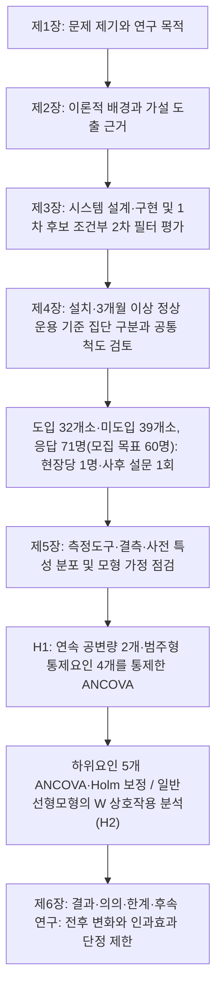
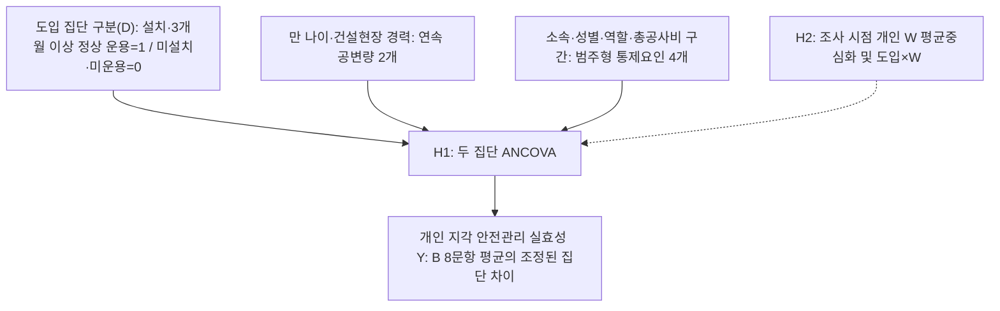

# MD → blocks 변환 리포트 (T2)

`python tools/hwpx_transfer/md_to_blocks.py` 실행 산출물이다. 8개 원고 MD를 verbatim 블록 JSON으로 변환하고, 모든 비어있지 않은 원본 행이 블록 텍스트 또는 excluded에 존재하는지 자기검증한 결과를 담는다.

처리 방침(코디네이터 승인, 2026-07-25): 코드펜스 ASCII 다이어그램 3곳과 "본문 아님"/"내부 관리용" 명시 h2 섹션 2곳은 excluded(원문 전문 보존), 부록2 h6 제목은 h1로 매핑, `<div>` 단독 행은 excluded(html_tag), `<br>`·`&emsp;`는 verbatim 보존 후 아래 '조립기 처리 목록'에 인계한다.

## 1. 파일별 블록 통계

| 파일 | h1 | h2 | h3 | h4 | p | 표 캡션 | 표 | 표 행(데이터) | 그림 캡션 | 그림 자리 | excluded |
|---|---:|---:|---:|---:|---:|---:|---:|---:|---:|---:|---:|
| 01_서론.md | 1 | 3 | 0 | 0 | 18 | 2 | 2 | 14 | 1 | 0 | 40 |
| 02_이론적배경.md | 1 | 6 | 15 | 0 | 60 | 5 | 5 | 34 | 0 | 0 | 109 |
| 03_시스템개발.md | 1 | 5 | 14 | 0 | 76 | 10 | 9 | 60 | 4 | 0 | 120 |
| 04_연구설계.md | 1 | 5 | 6 | 0 | 57 | 6 | 6 | 47 | 1 | 0 | 83 |
| 05_실증분석결과.md | 1 | 5 | 8 | 0 | 79 | 9 | 21 | 140 | 0 | 0 | 132 |
| 06_결론.md | 1 | 0 | 0 | 0 | 10 | 0 | 0 | 0 | 0 | 0 | 10 |
| 부록1_설문지_양식.md | 3 | 8 | 0 | 0 | 72 | 0 | 4 | 24 | 0 | 0 | 101 |
| 부록2_설문항목_근거매핑.md | 1 | 8 | 0 | 0 | 12 | 0 | 7 | 93 | 0 | 0 | 42 |

## 2. 커버리지 자기검증

모든 비어있지 않은 원본 행에 대해 (a) 블록 text/runs/cell 포함 또는 (b) excluded 기록을 확인했다. 비교 전 리스트 글머리와 마커 문자(`#`, `|`, `**`, 백틱, `-`, `\`, `>`)·공백을 정규화했다. '마커뿐'은 정규화 후 내용이 남지 않는 행(수평선·표 구분행 등)이다.

| 파일 | 총 행 | 비어있지 않은 행 | 내용 대조 통과 | 마커뿐(자동 통과) | 누락 |
|---|---:|---:|---:|---:|---:|
| 01_서론.md | 102 | 68 | 61 | 7 | 0 |
| 02_이론적배경.md | 247 | 147 | 134 | 13 | 0 |
| 03_시스템개발.md | 308 | 189 | 180 | 9 | 0 |
| 04_연구설계.md | 225 | 143 | 136 | 7 | 0 |
| 05_실증분석결과.md | 416 | 289 | 263 | 26 | 0 |
| 06_결론.md | 21 | 11 | 11 | 0 | 0 |
| 부록1_설문지_양식.md | 233 | 154 | 139 | 15 | 0 |
| 부록2_설문항목_근거매핑.md | 176 | 144 | 131 | 13 | 0 |

**누락 0 — 8개 파일 전체에서 커버리지 목표를 충족했다.**

## 3. 제외 블록 전체 목록 (파일별, 사유·행 범위·전문)

빈 줄(blank)은 개수만 표기하고, 그 외 모든 제외 블록은 원문 전문을 기록한다.

### 01_서론.md

- 빈 줄 33개 (excluded에 `{"reason": "blank", "text": ""}`로 기록)
- **editorial_blockquote** (blockquote(편집 메모)) — 3~4행

````
> **작성 상태:** 2026.09.13 지도의 현장 작동성 논지를 유지하고, 2026.10.04 지도에 따라 제1절을 '주장 → 근거(표) → 문제점·필요성 → 개발' 4단으로, 제2절을 목적 문장으로 끝나는 6문단으로, 제3절을 범위·방법과 장별 구성표로 다시 썼다(2026.10.07).
> **분량 목표:** 제1절 2p, 제2절 1p, 제3절 2p(표·흐름도 포함).
````
- **horizontal_rule** (수평선(---)) — 6행

````
---
````
- **horizontal_rule** (수평선(---)) — 37행

````
---
````
- **horizontal_rule** (수평선(---)) — 51행

````
---
````
- **ascii_diagram** (코드펜스 ASCII 다이어그램) — 76~86행

````

```mermaid
flowchart TD
  A1["제1장: 문제 제기와 연구 목적"] --> A2["제2장: 이론적 배경과 가설 도출 근거"]
  A2 --> B["제3장: 시스템 설계·구현 및 1차 후보 조건부 2차 필터 평가"]
  B --> C["제4장: 설치·3개월 이상 정상 운용 기준 집단 구분과 공통 척도 검토"]
  C --> D["도입 32개소·미도입 39개소, 응답 71명(모집 목표 60명): 현장당 1명·사후 설문 1회"]
  D --> E["제5장: 측정도구·결측·사전 특성 분포 및 모형 가정 점검"]
  E --> F["H1: 연속 공변량 2개·범주형 통제요인 4개를 통제한 ANCOVA"]
  F --> G["하위요인 5개 ANCOVA·Holm 보정 / 일반선형모형의 W 상호작용 분석(H2)"]
  G --> H["제6장: 결과·의의·한계·후속 연구: 전후 변화와 인과효과 단정 제한"]
```
````
- **horizontal_rule** (수평선(---)) — 92행

````
---
````
- **editorial_section** (본문 아님 명시 섹션) — 94~102행

````
## 작성 메모(제출 전 확인 사항 — 본문 아님)

- [ ] **윤영석 발행연도 재확인(2026-09-30):** 원문에서 2025학년도와 2025년 12월 제출·인준을 확인하였다(경기대학교 공학대학원 건축·안전공학전공 석사학위논문, 지도교수 박종용). 과거에는 제출일만으로 인용 연도를 2025로 확정했으나, 학위수여·발행연도는 공식 서지에서 추가 확인해야 한다. [확정 필요: 윤영석 학위수여·발행연도 — 현행 2025 표기는 잠정 유지]
- [x] **박종학 인용 연도 재확정(2026-07-12 표지·제출면 재대조):** 표지는 "2024학년도 석사학위논문"이나 제출면이 "2025년 6월"이므로 인용 연도는 수여·발행 연도 기준 **박종학(2025)**로 최종 확정(경기대학교 공학대학원 건축·안전공학전공, 지도교수 문유미). 이전 "2024 확정" 기록은 표지 학년도만 본 오판이었음. 전 장 표기를 2025로 통일 완료(학회논문 참고문헌 [05]의 2025와도 일치)
- [x] 실제 미도입 현장 확보 수(39개소)와 측정 구조 확인 방법(탐색적 요인분석)을 제4장·제5장과 함께 확정하였다(2026-10-24).
- [x] 배경 통계는 고용노동부(2025) 원문 추출자료에서 확인한 2024년 건설업 업무상사고 사망자 328명과 <표 1-1>의 공사금액 규모별 구성비(120억 원 미만 71.6%, 3억 원 미만 34.8%), 같은 자료의 공사금액별 사망만인율(3억 원 미만 4.92‱, 1,000억 원 이상 0.80‱)을 사용한다. 만인율은 전체 사망자 기준이어서 <표 1-1>과 분모가 다르다는 점을 본문에 밝혔다. 전 산업의 50인 미만 사업장 통계는 건설업 규모별 근거로 사용하지 않았다(2026-10-10 현행화).
- [x] 상황실 구축 1,200만 원은 국토교통부·국토안전관리원(2024) 가이드라인 인쇄 23쪽(PDF 27쪽)에서 서버·네트워크·방송시설 포함 단가로 확인하였다. 월간 요금의 출처와 대안별 총비용 비교의 잔여 확인 사항은 제3장 <표 3-9>를 따른다.
- [x] 연구흐름도(&lt;그림 1-1&gt;)의 구 ANCOVA PNG 연결을 당시 혼합모형 Mermaid 도식으로 대체함(2026-09-13 MD 수정). 2026-10-03에는 현장당 1명·60명과 ANCOVA를 반영하여 위 Mermaid 도식을 수정하였다. HWPX 반영은 별도 작업이다.
- [x] **2026-10-04 지도 반영(2026-10-07 MD 수정):** <표 1-1>을 '건설업 공사금액 규모별 업무상사고 사망자 분포(2024년)'로 교체하였다(고용노동부 2025 인쇄 336쪽 원표, 비율은 연구자 계산, 120억 원 미만 누적 71.6%). 이로써 종전 표 주에 남아 있던 규모별 원표 확인 표기(CITE_TODO)를 해소하였다. 김석기(2026)의 2023년 68.5%는 재인용하지 않는다. 제1절은 인용 없는 주장 문단으로 시작하고 선행연구 인용 9건을 요약 서술로 바꾸었으며(해당 문헌은 제2장에 있음), Zhou et al.(2023)의 통계 불일치 논평은 제2장 <표 2-5>·작성 메모로 넘겼다. 제2절은 6문단으로 바꾸고 마지막 문단을 확정 목적 문장으로 시작하였다. 제3절은 공간·시간·내용 범위와 <표 1-2> 장별 구성을 신설하고 흐름도의 제1장·제2장 노드를 분리하였다. 한계 서술은 제6장으로 넘기고 두 문장만 남겼다. HWPX 반영과 00_목차의 표 목차·초록 목적 문장 동기화는 별도 작업이다.
````

### 02_이론적배경.md

- 빈 줄 100개 (excluded에 `{"reason": "blank", "text": ""}`로 기록)
- **editorial_blockquote** (blockquote(편집 메모)) — 3~5행

````
> **역할:** 논문 주제를 뒷받침하는 개념과 선행연구를 고찰하여 서론의 논리(연구 필요성·목적)를 이론적으로 지지하고, 제4장 연구 모형·연구 가설 설정의 근거를 마련한다. 시스템의 구현 사실과 기술 성능 선행연구는 제3장에서 다룬다.
>
> **구조:** 제1절 연구 대상 기술의 개념 — 제2절 시스템 기술 특성 — 제3절 종속변수(안전관리 실효성)와 하위요인 — 제4절 상호작용 변수(안전관리 예산 제약성) — 제5절 선행연구와 연구 가설 도출 근거 — 제6절 소결.
````
- **horizontal_rule** (수평선(---)) — 7행

````
---
````
- **horizontal_rule** (수평선(---)) — 29행

````
---
````
- **horizontal_rule** (수평선(---)) — 91행

````
---
````
- **horizontal_rule** (수평선(---)) — 164행

````
---
````
- **horizontal_rule** (수평선(---)) — 184행

````
---
````
- **horizontal_rule** (수평선(---)) — 230행

````
---
````
- **horizontal_rule** (수평선(---)) — 240행

````
---
````
- **editorial_blockquote** (blockquote(편집 메모)) — 242~247행

````
> **[집필 메모 — 본문 아님]**
> - 해결됨(2026-07-12 원문 대조 완료): MonitorVLM 저자 표기는 arXiv:2510.03666 원문 대조로 **Wu et al.(2025)** 확정. ref 03은 **박종학(2025)**(기존 "문유미"는 지도교수명 오기), ref 05는 **김현수(2026)**, ref 29의 저자명은 윤영석으로 확인하였으나 **2025년 표기는 발행연도 확인 전 잠정 유지**한다[확정 필요: 윤영석 학위논문 발행연도].
> - 해결됨(2026-07-12): 표 번호를 등장 순서대로 재부여 — 구 <표 2-3>(단일 YOLO vs 캐스케이드 비교) → <표 2-2>, 구 <표 2-2>(하위요인 선행연구 요약) → <표 2-3>. 00_목차.md 표 목차 동기화 완료.
> - 2026-09-12 서지 재검증에 따라 문헌 06·18(이창남, 2025), 19(Mi, 2025), 22(김용선, 2022), 28(조도빈, 2026), 32(류정·박인선, 2025)의 저자·연도를 반영하였다. 06·18은 동일 문헌이며 대표 번호는 06이다. Tiwari·Herstatt의 정확한 문헌 식별과 개별 주장·인용 쪽수의 미확정 범위는 유지한다. 문헌 09의 서지는 유지하며 문헌 04의 저자는 2026-09-30 원문 대조로 김태헌(2026)으로 교정하였다. 이형도 학위논문은 발행연도 2024년으로 교정하였다.
> - 2026-09-30 팩트체크 수정: 본문의 선행연구 수치·조건을 보유 원문 표와 대조하였다. MonitorVLM의 상대증가율과 비교 모델, Chong의 기기별 유의성, 류수영의 평가 조건을 구분하고 원문에서 확인하지 못한 24시간 안정성 주장을 삭제하였다. Zhou의 통계 보고 불일치는 강한 효과 입증의 근거로 사용하지 않는다.
> - 2026-10-07 재편(10월 4일 지도 반영): '변수=절, 하위요인=항' 구조로 재편하였다. 구 제1절 제2항(기술 선행연구와 구 <표 2-1> 매트릭스)은 제3장 제1절 제3항(<표 3-2>)으로 옮겼고, 구 제3절 경보 피로도는 제1절 제2항으로 흡수하였다. 구 제1절 제3항의 소절 4개는 제2절 제1∼4항으로 승격하고, 제3장과 겹치는 구현 사실(가속 경로 자동 선택, 반복 알림 억제 시간값, 1차 신뢰도 설정값, 메신저 채널)과 구 <표 2-2>(단일 YOLO vs 캐스케이드)·구 <표 2-4>(비용 비교, 제3장 <표 3-9>와 중복)를 삭제하였다. 구 제2절은 제3절 도입부와 하위요인 5항으로 나누고, 구 제2절 제1항의 채점 규칙 문단은 측정 설계이므로 삭제하여 제4장 제3절 제1항으로 이관 완료(2026-10-07)으로 넘겼다. 굵은 가설 진술은 삭제하고 가설 문장의 단일 위치를 제4장으로 정하였다. 표 번호: 구 2-3→2-1, 구 2-6→2-2, 신설 2-3(하위요인 선행연구), 구 2-5→2-4, 구 2-7→2-5. 하위요인별 근거 부족은 CITE_TODO 표기로 본문에 남겼다.
````

### 03_시스템개발.md

- 빈 줄 119개 (excluded에 `{"reason": "blank", "text": ""}`로 기록)
- **editorial_blockquote** (blockquote(편집 메모)) — 3행

````
> 본 장은 연구자가 직접 개발한 AI CCTV Viewer(YOLO-LLM 하이브리드 안전관제 시스템)의 개발 목적·설계 원리·구현·성능 검증을 서술한다. 이 내용은 제4장의 도입 집단 전용 참고 문항(Part D)의 근거를 이룬다.
````

### 04_연구설계.md

- 빈 줄 82개 (excluded에 `{"reason": "blank", "text": ""}`로 기록)
- **ascii_diagram** (코드펜스 ASCII 다이어그램) — 33~40행

````

```mermaid
flowchart TB
  D["도입 집단 구분(D): 설치·3개월 이상 정상 운용=1 / 미설치·미운용=0"] --> M["H1: 두 집단 ANCOVA"]
  C["만 나이·건설현장 경력: 연속 공변량 2개"] --> M
  Z["소속·성별·역할·총공사비 구간: 범주형 통제요인 4개"] --> M
  M --> Y["개인 지각 안전관리 실효성 Y: B 8문항 평균의 조정된 집단 차이"]
  W["H2: 조사 시점 개인 W 평균중심화 및 도입×W"] -.-> M
```
````

### 05_실증분석결과.md

- 빈 줄 127개 (excluded에 `{"reason": "blank", "text": ""}`로 기록)
- **horizontal_rule** (수평선(---)) — 7행

````
---
````
- **horizontal_rule** (수평선(---)) — 76행

````
---
````
- **horizontal_rule** (수평선(---)) — 111행

````
---
````
- **horizontal_rule** (수평선(---)) — 195행

````
---
````
- **horizontal_rule** (수평선(---)) — 379행

````
---
````

### 06_결론.md

- 빈 줄 10개 (excluded에 `{"reason": "blank", "text": ""}`로 기록)

### 부록1_설문지_양식.md

- 빈 줄 78개 (excluded에 `{"reason": "blank", "text": ""}`로 기록)
- **editorial_blockquote** (blockquote(편집 메모)) — 3~5행

````
> **동기화 기준 메모:** 본 설문지는 두 집단 공분산분석(ANCOVA) 설계를 기준으로 작성한다. 본 문서(부록1)를 문항 문구와 번호의 단일 원본으로 삼으며, `01.docs/04_연구설계.md` 제4절 제2항의 <표 4-4>와는 블록별 구성(변수·문항 수·문항 번호)만 대조한다. 설문은 전체 응답자가 작성하는 공통부 21문항과 설치 및 응답일 현재 3개월 이상 정상 운용을 확인한 도입 현장 응답자가 문항별 경험에 따라 작성하는 전용부 12문항으로 구성한다. 단일 Google Forms의 첫 섹션 첫 질문에서 ‘CCTV YOLO-LLM 안전알림 도입 현장’ 또는 ‘CCTV YOLO-LLM 안전알림 미도입 현장’을 선택하여 해당 문항으로 이동한다. 이 선택은 문항 분기에 쓰이며, 응답자가 선택한 현장 구분을 분석 집단으로 확정한다.
>
> **2026-10-09 변경:** 미도입 현장 응답자의 참조 기준 부재 편향에 대응하여 공통부 Part A에 현장 운영 특성 사실 문항 A-7∼A-9(위험 인지 경로·시점·지시 전달 소요시간)를 두 양식에 같게 추가하고 Part A 제목을 바꾸었다(공통부 18→21문항, 도입 집단 30→33문항). Part B 안내 둘째 문장은 순찰 사이와 담당자 부재 시간대의 위험 상황까지 포함하도록 평가 상황을 고정하였다. A-7∼A-9는 Y·W·공변량에 투입하지 않는 참고 변수이며, A-7·A-8은 운용 실태 확인 지표, A-9는 과정 지표이다. 같은 날 Part A 안내 첫 문장과 A-7의 ‘안전관리 담당자’ 정의 안내도 고쳤다.
````
- **editorial_blockquote** (blockquote(편집 메모)) — 7~11행

````
> **양식 구성 메모(2026-08-29):** 부록은 도입 현장용과 미도입 현장용 **두 벌**로 나누어 싣는다. 도입 현장용은 표지에 이어 공통부 Part A·B·C와 전용부 Part D·E를, 미도입 현장용은 표지에 이어 공통부 Part A·B·C만 담는다. 각 표지와 Part는 별도 쪽에서 시작한다.
>
> 이 문서는 문항을 한 번만 적는다. 같은 문항을 두 곳에 두면 한쪽만 고칠 위험이 있기 때문이다. hwpx 본문에는 공통부가 두 벌로 실제 복제되어 있으므로, 문항을 고칠 때는 이 문서 한 곳을 고친 뒤 hwpx의 도입 벌과 미도입 벌 **두 곳 모두**에 반영한다.
>
> **리커트 표 표기:** 아래 마크다운 표는 Google Forms에 반영할 문항과 보기의 확인용이다. B·C·D·E는 ①∼⑤의 5점 척도만 사용한다.
````
- **horizontal_rule** (수평선(---)) — 13행

````
---
````
- **html_tag** (단독 HTML 태그 행) — 32행

````
<div align="right">
````
- **html_tag** (단독 HTML 태그 행) — 41행

````
</div>
````
- **editorial_blockquote** (blockquote(편집 메모)) — 43행

````
> 도입 현장용은 이 표지에 이어 공통부 Part A·B·C와 도입 현장 전용부 Part D·E를 싣는다.
````
- **horizontal_rule** (수평선(---)) — 45행

````
---
````
- **html_tag** (단독 HTML 태그 행) — 64행

````
<div align="right">
````
- **html_tag** (단독 HTML 태그 행) — 73행

````
</div>
````
- **editorial_blockquote** (blockquote(편집 메모)) — 75행

````
> 미도입 현장용은 이 표지에 이어 공통부 Part A·B·C만 싣는다. 전용부 Part D·E는 넣지 않는다.
````
- **editorial_blockquote** (blockquote(편집 메모)) — 77행

````
> **방법론적 주석:** 두 집단의 인사말과 공통부 응답 안내는 동일하게 유지한다. 시스템 경험에 관한 응답 안내는 도입 현장 전용부 D·E에만 둔다.
````
- **horizontal_rule** (수평선(---)) — 79행

````
---
````
- **horizontal_rule** (수평선(---)) — 136행

````
---
````
- **horizontal_rule** (수평선(---)) — 166행

````
---
````
- **html_tag** (단독 HTML 태그 행) — 168행

````
<div align="center">
````
- **html_tag** (단독 HTML 태그 행) — 172행

````
</div>
````
- **editorial_blockquote** (blockquote(편집 메모)) — 174행

````
> 미도입 현장용 양식은 여기서 끝난다. 도입 현장용 양식은 이어서 전용부를 싣는다.
````
- **horizontal_rule** (수평선(---)) — 176행

````
---
````
- **horizontal_rule** (수평선(---)) — 212행

````
---
````
- **html_tag** (단독 HTML 태그 행) — 214행

````
<div align="center">
````
- **html_tag** (단독 HTML 태그 행) — 218행

````
</div>
````
- **horizontal_rule** (수평선(---)) — 220행

````
---
````
- **editorial_section** (본문 아님 명시 섹션) — 222~233행

````
## [내부 관리용 — 배포본에서 삭제] 구성 대조표

| 블록 | 변수 | 문항 수 | 문항 번호 | 응답 대상 | 제4장 <표 4-4> 대조 |
|:---:|:---|:---:|:---:|:---:|:---|
| 공통부 A | 인구통계학적 특성 및 현장 운영 특성 | 9 | A-1∼A-9 | 전체 | 일치. 소속·성별·만 나이·건설현장 경력·역할·총공사비 구간, 위험 인지 경로·시점·지시 전달 소요시간(A-7∼A-9, 참고 변수) |
| 공통부 B | 안전관리 실효성 | 8 | B-1∼B-8 | 전체 | 일치. 조기인지·대응 신속성·원격 파악·순찰부담 경감·위험 통제력 |
| 공통부 C | 안전관리 예산 제약성 | 4 | C-1∼C-4 | 전체 | 일치. 예산 부족과 제도적·조직적 지원 제약 |
| **공통부 소계** | | **21** | | **전체** | **04장 <표 4-4> 공통부 소계 21문항과 일치** |
| 전용부 D | 시스템 특성 인식(참고용 기술 척도) | 8 | D-1∼D-8 | 도입 집단 | 일치. 범용성·안정성·오탐 필터링·알림 전파 |
| 전용부 E | 경보 피로도 완화 인식(참고용 기술 척도) | 4 | E-1∼E-4 | 도입 집단 | 일치. 스트레스·둔감화·확인 부담 완화 |
| **전용부 소계** | | **12** | | **도입 집단** | **04장 <표 4-4> 전용부 소계 12문항과 일치** |
| **현행안 합계** | 미도입 집단 21문항, 도입 집단 33문항 | **21 또는 33** | | | **04장 <표 4-4> 현행안 합계와 일치** |
````

### 부록2_설문항목_근거매핑.md

- 빈 줄 32개 (excluded에 `{"reason": "blank", "text": ""}`로 기록)
- **editorial_blockquote** (blockquote(편집 메모)) — 3행

````
> **위상 메모(2026-08-29):** 본 자료는 논문 본문에 수록하지 않는다. 지도교수와 문항 근거를 논의하고 심사에서 문항 출처 질문에 답하기 위한 내부 근거 자료로 `01.docs/`에 보존한다. 목차와 hwpx 본문의 부록은 설문지(도입 현장·미도입 현장) 두 양식뿐이다.
````
- **editorial_blockquote** (blockquote(편집 메모)) — 5~11행

````
> 본 문서는 두 집단 공분산분석(ANCOVA) 설계의 리커트 24문항과 2026-10-09에 추가한 공통부 현장 운영 특성 사실 문항 3개(A-7∼A-9)를 근거 PDF의 페이지·요약으로 매핑한 자료이다. 공통부 B·C 12문항과 도입 현장 전용부 D·E 12문항, A-7∼A-9를 포함하며, 인구통계 A-1∼A-6은 연구자 구성 문항이므로 매핑 대상에서 제외한다.
> A-3은 응답일 기준 만 나이(세)를, A-4는 겹치는 기간을 중복 합산하지 않은 건설현장 근무 기간을 연 단위 정수(1년 미만 0, 6개월 이상 올림)로 수집한다. 만 나이와 건설현장 경력은 연속 공변량으로 처리한다. 소속·성별·역할과 총공사비 4개 구간은 범주형 통제요인이다. A-6의 총공사비는 조사 대상으로 정한 현장 전체의 응답일 현재 최신 확정 금액(부가가치세와 관급자재비 포함)을 기준으로 하며, 확정된 변경 사항을 반영한다. 구간 보기와 응답 양식은 부록1을, 분석 설계는 제4장 제5절을 따른다. B·C·D·E의 번호·문항 수와 아래 근거 매핑은 유지한다. D-3·D-6은 2026-10-03 사용자 결정에 따라 내부 작동 기제에 대한 표현을 덜어내고, 응답자가 경험한 작동 안정성과 정상 작업의 오경보를 묻도록 간소화하였다.
> 두 집단 모두 담당 현장의 안전관리 예산을 알고 C-1∼C-4의 예산·지원 여건을 판단할 수 있는 사람을 모집한다. 모집 전 확인 결과는 조사 명부에 기록하며 C-1∼C-4의 문구와 5점 척도는 유지한다.
> 문항 번호·문항 문구는 `01.docs/부록1_설문지_양식.md`를 단일 원본으로 따른다(2026-10-07 제4장 문항표 삭제, 제4장은 <표 4-4> 최종 구성과 제3절 제2항 출처 서술만 둔다). 2026-10-07에 삭제한 제4장 문항표는 2026-09-30부터 근거를 저자·연도로 표기했으며, 본 자료는 추적용 내부 PDF 번호를 유지한다. 번호와 저자·연도의 대응은 `01.docs/07_참조번호목록.md`를 따르며, 33은 김민기·박성호(2026)이다.
> 페이지와 근거 요약은 기존 매핑에서 확인된 값만 이전하였다. 기존 매핑에 페이지가 없거나 추정으로 표시된 경우에는 그 표기를 보존하고 문서 말미의 `[확정 필요]` 목록에 남겼다. 원문 직접 인용은 사용하지 않고 한국어 요약으로 통일하였다.
> **서지 교정(2026-09-12):** 06은 이창남(2025)이며 18은 동일 파일의 중복 번호이므로 현행 근거는 06으로 통합한다. 08은 Kim et al.(2025), 22는 김용선(2022), 28은 조도빈(2026), 36은 국토교통부·국토안전관리원(2024)이다. 서지 확정은 아래 근거 요약과 인용 쪽수의 확정을 뜻하지 않는다.
> 구 체계 매핑은 `논문구조_백업_2026-07-12/06b_설문항목_근거매핑.md`에 보존되어 있다. 본 문서의 비고 열에는 신구 문항의 이전 경로를 남겨 심사 시 추적할 수 있도록 하였다.
````
- **horizontal_rule** (수평선(---)) — 13행

````
---
````
- **editorial_blockquote** (blockquote(편집 메모)) — 15행

````
> 수용·채택 의도 연구는 문항의 개념적 연결 근거이며 실제 안전성과나 현행 척도의 타당도 입증과 구분한다. 2026-09-30 원문 대조로 확인한 행의 페이지와 근거 요약을 교정하였으며, 확인하지 않은 페이지·요약의 미확정 표기는 유지한다. Cvach(2012)는 의료 경보 피로도에 관한 종설로, E 문항의 검증된 원척도가 아니다. 본 매핑은 연구자가 문항을 수정·개발할 때 참고한 개념과 구현 사례를 추적하기 위한 자료이다.
````
- **horizontal_rule** (수평선(---)) — 27행

````
---
````
- **horizontal_rule** (수평선(---)) — 57행

````
---
````
- **horizontal_rule** (수평선(---)) — 76행

````
---
````
- **horizontal_rule** (수평선(---)) — 104행

````
---
````
- **horizontal_rule** (수평선(---)) — 120행

````
---
````
- **editorial_blockquote** (blockquote(편집 메모)) — 176행

````
> 위 목록은 문항 자체의 신규 근거를 뜻하지 않는다. 기존 매핑에서 페이지가 확정되지 않은 항목을 추적하기 위한 표기이다.
````

## 4. 마커 처리 집계

### 표 셀 굵게 마커 제거(텍스트 보존) — 18건

- 04_연구설계.md:152 — `**공통부 소계**`
- 04_연구설계.md:152 — `**전체**`
- 04_연구설계.md:152 — `**21**`
- 04_연구설계.md:155 — `**전용부 소계**`
- 04_연구설계.md:155 — `**도입 집단**`
- 04_연구설계.md:155 — `**12**`
- 04_연구설계.md:156 — `**현행안 합계**`
- 04_연구설계.md:156 — `**21 또는 33**`
- 05_실증분석결과.md:37 — `**합계**`
- 05_실증분석결과.md:37 — `**32**`
- 05_실증분석결과.md:37 — `**100.0**`
- 05_실증분석결과.md:37 — `**39**`
- 05_실증분석결과.md:37 — `**100.0**`
- 05_실증분석결과.md:37 — `**71**`
- 05_실증분석결과.md:37 — `**100.0**`
- 부록2_설문항목_근거매핑.md:163 — `**합계**`
- 부록2_설문항목_근거매핑.md:163 — `**27**`
- 부록2_설문항목_근거매핑.md:163 — `**60**`

### 인라인 백틱 마커 제거(텍스트 보존) — 64건

- 03_시스템개발.md:126 — `LLM은 1차 검출 결과의 알람 메타데이터(카메라명·warning_key·warning_message), 원본 프레임 이미지, 카메라별 사용자 교정 샘플을 입력받아 검출 영역을 자연어로 지목·해석한다. 이어 발송·차단 판정('result': SEND/BLOCK)과 한국어 자연어 사유('reason': 80자 이하) 두 필드만으로 구성된 JSON을 출력한다. 'reason' 필드는 그대로 알림 앱 메시지로 활용되므로 별도의 요약 단계가 필요 없다. 이 입출력 구조와 판정 흐름은 <그림 3-2>와 같다.`
- 03_시스템개발.md:126 — `LLM은 1차 검출 결과의 알람 메타데이터(카메라명·warning_key·warning_message), 원본 프레임 이미지, 카메라별 사용자 교정 샘플을 입력받아 검출 영역을 자연어로 지목·해석한다. 이어 발송·차단 판정('result': SEND/BLOCK)과 한국어 자연어 사유('reason': 80자 이하) 두 필드만으로 구성된 JSON을 출력한다. 'reason' 필드는 그대로 알림 앱 메시지로 활용되므로 별도의 요약 단계가 필요 없다. 이 입출력 구조와 판정 흐름은 <그림 3-2>와 같다.`
- 03_시스템개발.md:126 — `LLM은 1차 검출 결과의 알람 메타데이터(카메라명·warning_key·warning_message), 원본 프레임 이미지, 카메라별 사용자 교정 샘플을 입력받아 검출 영역을 자연어로 지목·해석한다. 이어 발송·차단 판정('result': SEND/BLOCK)과 한국어 자연어 사유('reason': 80자 이하) 두 필드만으로 구성된 JSON을 출력한다. 'reason' 필드는 그대로 알림 앱 메시지로 활용되므로 별도의 요약 단계가 필요 없다. 이 입출력 구조와 판정 흐름은 <그림 3-2>와 같다.`
- 03_시스템개발.md:126 — `LLM은 1차 검출 결과의 알람 메타데이터(카메라명·warning_key·warning_message), 원본 프레임 이미지, 카메라별 사용자 교정 샘플을 입력받아 검출 영역을 자연어로 지목·해석한다. 이어 발송·차단 판정('result': SEND/BLOCK)과 한국어 자연어 사유('reason': 80자 이하) 두 필드만으로 구성된 JSON을 출력한다. 'reason' 필드는 그대로 알림 앱 메시지로 활용되므로 별도의 요약 단계가 필요 없다. 이 입출력 구조와 판정 흐름은 <그림 3-2>와 같다.`
- 03_시스템개발.md:126 — `LLM은 1차 검출 결과의 알람 메타데이터(카메라명·warning_key·warning_message), 원본 프레임 이미지, 카메라별 사용자 교정 샘플을 입력받아 검출 영역을 자연어로 지목·해석한다. 이어 발송·차단 판정('result': SEND/BLOCK)과 한국어 자연어 사유('reason': 80자 이하) 두 필드만으로 구성된 JSON을 출력한다. 'reason' 필드는 그대로 알림 앱 메시지로 활용되므로 별도의 요약 단계가 필요 없다. 이 입출력 구조와 판정 흐름은 <그림 3-2>와 같다.`
- 03_시스템개발.md:126 — `LLM은 1차 검출 결과의 알람 메타데이터(카메라명·warning_key·warning_message), 원본 프레임 이미지, 카메라별 사용자 교정 샘플을 입력받아 검출 영역을 자연어로 지목·해석한다. 이어 발송·차단 판정('result': SEND/BLOCK)과 한국어 자연어 사유('reason': 80자 이하) 두 필드만으로 구성된 JSON을 출력한다. 'reason' 필드는 그대로 알림 앱 메시지로 활용되므로 별도의 요약 단계가 필요 없다. 이 입출력 구조와 판정 흐름은 <그림 3-2>와 같다.`
- 03_시스템개발.md:154 — `확정된 경보는 다중 수신자에게 자동 분류 라우팅되어 동시에 전파된다. 수신자가 알림만으로도 상황을 직관적으로 파악할 수 있도록, 전파 메시지에는 LLM이 출력한 한국어 자연어 사유('reason' 필드)와 검출 프레임 이미지를 함께 담았다.`
- 03_시스템개발.md:154 — `확정된 경보는 다중 수신자에게 자동 분류 라우팅되어 동시에 전파된다. 수신자가 알림만으로도 상황을 직관적으로 파악할 수 있도록, 전파 메시지에는 LLM이 출력한 한국어 자연어 사유('reason' 필드)와 검출 프레임 이미지를 함께 담았다.`
- 부록2_설문항목_근거매핑.md:126 — `2026-10-09 공통부 Part A의 현장 운영 특성 사실 문항으로 신설하였다. 대응하는 구 문항은 없다(배경과 문안은 '설문항목_작업이력.md').`
- 부록2_설문항목_근거매핑.md:126 — `2026-10-09 공통부 Part A의 현장 운영 특성 사실 문항으로 신설하였다. 대응하는 구 문항은 없다(배경과 문안은 '설문항목_작업이력.md').`
- 부록2_설문항목_근거매핑.md:127 — `2026-10-09 공통부 Part A의 현장 운영 특성 사실 문항으로 신설하였다. 대응하는 구 문항은 없다(배경과 문안은 '설문항목_작업이력.md').`
- 부록2_설문항목_근거매핑.md:127 — `2026-10-09 공통부 Part A의 현장 운영 특성 사실 문항으로 신설하였다. 대응하는 구 문항은 없다(배경과 문안은 '설문항목_작업이력.md').`
- 부록2_설문항목_근거매핑.md:128 — `2026-10-09 공통부 Part A의 현장 운영 특성 사실 문항으로 신설하였다. 대응하는 구 문항은 없다(배경과 문안은 '설문항목_작업이력.md').`
- 부록2_설문항목_근거매핑.md:128 — `2026-10-09 공통부 Part A의 현장 운영 특성 사실 문항으로 신설하였다. 대응하는 구 문항은 없다(배경과 문안은 '설문항목_작업이력.md').`
- 부록2_설문항목_근거매핑.md:129 — `시스템 귀속형 표현을 현장 일반형 조기인지 표현으로 전환하였다. 기존 Y-1 매핑을 이전하였다. 2026-09-30 한국어 표현 점검에 따라 문구를 다시 다듬었다(옛 문구와 사유는 '설문항목_작업이력.md').`
- 부록2_설문항목_근거매핑.md:129 — `시스템 귀속형 표현을 현장 일반형 조기인지 표현으로 전환하였다. 기존 Y-1 매핑을 이전하였다. 2026-09-30 한국어 표현 점검에 따라 문구를 다시 다듬었다(옛 문구와 사유는 '설문항목_작업이력.md').`
- 부록2_설문항목_근거매핑.md:130 — `시스템 귀속형 표현을 현장 일반형 초동 대응 지시 표현으로 전환하였다. 기존 Y-2 매핑을 이전하였다. 2026-09-30 한국어 표현 점검에 따라 문구를 다시 다듬었다(옛 문구와 사유는 '설문항목_작업이력.md').`
- 부록2_설문항목_근거매핑.md:130 — `시스템 귀속형 표현을 현장 일반형 초동 대응 지시 표현으로 전환하였다. 기존 Y-2 매핑을 이전하였다. 2026-09-30 한국어 표현 점검에 따라 문구를 다시 다듬었다(옛 문구와 사유는 '설문항목_작업이력.md').`
- 부록2_설문항목_근거매핑.md:131 — `시스템 귀속형 표현을 현장 부재 시 원격 파악 일반형으로 전환하였다. 2026-09-30 전담 안전관리자가 없는 현장도 응답할 수 있도록 ‘안전관리자’를 ‘안전관리 담당자’로 교정하였다. 기존 Y-3 매핑을 이전하였다. 2026-09-30 한국어 표현 점검에 따라 문구를 다시 다듬었다(옛 문구와 사유는 '설문항목_작업이력.md').`
- 부록2_설문항목_근거매핑.md:131 — `시스템 귀속형 표현을 현장 부재 시 원격 파악 일반형으로 전환하였다. 2026-09-30 전담 안전관리자가 없는 현장도 응답할 수 있도록 ‘안전관리자’를 ‘안전관리 담당자’로 교정하였다. 기존 Y-3 매핑을 이전하였다. 2026-09-30 한국어 표현 점검에 따라 문구를 다시 다듬었다(옛 문구와 사유는 '설문항목_작업이력.md').`
- 부록2_설문항목_근거매핑.md:132 — `시스템 귀속형 표현을 현장 간 위험 정보·조치사항 공유 일반형으로 전환하였다. 기존 Y-4 매핑을 이전하였다. 2026-09-30 한국어 표현 점검에 따라 문구를 다시 다듬었다(옛 문구와 사유는 '설문항목_작업이력.md').`
- 부록2_설문항목_근거매핑.md:132 — `시스템 귀속형 표현을 현장 간 위험 정보·조치사항 공유 일반형으로 전환하였다. 기존 Y-4 매핑을 이전하였다. 2026-09-30 한국어 표현 점검에 따라 문구를 다시 다듬었다(옛 문구와 사유는 '설문항목_작업이력.md').`
- 부록2_설문항목_근거매핑.md:133 — `시스템 귀속형 표현을 제한 인력의 순찰·위험 확인 효율 일반형으로 전환하였다. 기존 Y-5 매핑을 이전하였다. 2026-09-30 한국어 표현 점검에 따라 문구를 다시 다듬었다(옛 문구와 사유는 '설문항목_작업이력.md').`
- 부록2_설문항목_근거매핑.md:133 — `시스템 귀속형 표현을 제한 인력의 순찰·위험 확인 효율 일반형으로 전환하였다. 기존 Y-5 매핑을 이전하였다. 2026-09-30 한국어 표현 점검에 따라 문구를 다시 다듬었다(옛 문구와 사유는 '설문항목_작업이력.md').`
- 부록2_설문항목_근거매핑.md:134 — `시스템 귀속형 표현을 불필요한 확인 업무 감소와 실제 대응 집중 일반형으로 전환하였다. 기존 Y-6 매핑을 이전하였다. 2026-09-30 한국어 표현 점검에 따라 문구를 다시 다듬었다(옛 문구와 사유는 '설문항목_작업이력.md').`
- 부록2_설문항목_근거매핑.md:134 — `시스템 귀속형 표현을 불필요한 확인 업무 감소와 실제 대응 집중 일반형으로 전환하였다. 기존 Y-6 매핑을 이전하였다. 2026-09-30 한국어 표현 점검에 따라 문구를 다시 다듬었다(옛 문구와 사유는 '설문항목_작업이력.md').`
- 부록2_설문항목_근거매핑.md:135 — `시스템 귀속형 표현을 시정·작업중지 등 통제 조치 일반형으로 전환하였다. 기존 Y-7 매핑을 이전하였다. 2026-09-30 한국어 표현 점검에 따라 문구를 다시 다듬었다(옛 문구와 사유는 '설문항목_작업이력.md').`
- 부록2_설문항목_근거매핑.md:135 — `시스템 귀속형 표현을 시정·작업중지 등 통제 조치 일반형으로 전환하였다. 기존 Y-7 매핑을 이전하였다. 2026-09-30 한국어 표현 점검에 따라 문구를 다시 다듬었다(옛 문구와 사유는 '설문항목_작업이력.md').`
- 부록2_설문항목_근거매핑.md:136 — `시스템 귀속형 표현을 위험요인 실질 통제 일반형으로 전환하였다. 기존 Y-8 매핑을 이전하였다. 2026-09-30 한국어 표현 점검에 따라 문구를 다시 다듬었다(옛 문구와 사유는 '설문항목_작업이력.md').`
- 부록2_설문항목_근거매핑.md:136 — `시스템 귀속형 표현을 위험요인 실질 통제 일반형으로 전환하였다. 기존 Y-8 매핑을 이전하였다. 2026-09-30 한국어 표현 점검에 따라 문구를 다시 다듬었다(옛 문구와 사유는 '설문항목_작업이력.md').`
- 부록2_설문항목_근거매핑.md:137 — `구 W-1 문구와 근거 매핑을 그대로 이전하였다. 2026-09-30 한국어 표현 점검에 따라 문구를 다시 다듬었다(옛 문구와 사유는 '설문항목_작업이력.md').`
- 부록2_설문항목_근거매핑.md:137 — `구 W-1 문구와 근거 매핑을 그대로 이전하였다. 2026-09-30 한국어 표현 점검에 따라 문구를 다시 다듬었다(옛 문구와 사유는 '설문항목_작업이력.md').`
- 부록2_설문항목_근거매핑.md:138 — `구 W-2 문구와 근거 매핑을 그대로 이전하였다. 2026-09-30 한국어 표현 점검에 따라 문구를 다시 다듬었다(옛 문구와 사유는 '설문항목_작업이력.md').`
- 부록2_설문항목_근거매핑.md:138 — `구 W-2 문구와 근거 매핑을 그대로 이전하였다. 2026-09-30 한국어 표현 점검에 따라 문구를 다시 다듬었다(옛 문구와 사유는 '설문항목_작업이력.md').`
- 부록2_설문항목_근거매핑.md:139 — `구 W-3 문구와 근거 매핑을 그대로 이전하였다. 2026-09-30 한국어 표현 점검에 따라 문구를 다시 다듬었다(옛 문구와 사유는 '설문항목_작업이력.md').`
- 부록2_설문항목_근거매핑.md:139 — `구 W-3 문구와 근거 매핑을 그대로 이전하였다. 2026-09-30 한국어 표현 점검에 따라 문구를 다시 다듬었다(옛 문구와 사유는 '설문항목_작업이력.md').`
- 부록2_설문항목_근거매핑.md:140 — `괄호 표기 "소속 기관(본사 또는 발주처)으로부터"를 "소속 기관인 본사 또는 발주처로부터"로 다듬었다. 근거 매핑은 구 W-4에서 그대로 이전하였다. 2026-09-30 한국어 표현 점검에 따라 문구를 다시 다듬었다(옛 문구와 사유는 '설문항목_작업이력.md').`
- 부록2_설문항목_근거매핑.md:140 — `괄호 표기 "소속 기관(본사 또는 발주처)으로부터"를 "소속 기관인 본사 또는 발주처로부터"로 다듬었다. 근거 매핑은 구 W-4에서 그대로 이전하였다. 2026-09-30 한국어 표현 점검에 따라 문구를 다시 다듬었다(옛 문구와 사유는 '설문항목_작업이력.md').`
- 부록2_설문항목_근거매핑.md:141 — `구 X1-1 매핑을 그대로 이전하였다. 2026-09-30 한국어 표현 점검에 따라 문구를 다시 다듬었다(옛 문구와 사유는 '설문항목_작업이력.md').`
- 부록2_설문항목_근거매핑.md:141 — `구 X1-1 매핑을 그대로 이전하였다. 2026-09-30 한국어 표현 점검에 따라 문구를 다시 다듬었다(옛 문구와 사유는 '설문항목_작업이력.md').`
- 부록2_설문항목_근거매핑.md:142 — `괄호 안의 "(ONVIF 표준)" 표기를 삭제하였다. 근거 매핑은 구 X1-2에서 그대로 이전하였다. 2026-09-30 한국어 표현 점검에 따라 문구를 다시 다듬었다(옛 문구와 사유는 '설문항목_작업이력.md').`
- 부록2_설문항목_근거매핑.md:142 — `괄호 안의 "(ONVIF 표준)" 표기를 삭제하였다. 근거 매핑은 구 X1-2에서 그대로 이전하였다. 2026-09-30 한국어 표현 점검에 따라 문구를 다시 다듬었다(옛 문구와 사유는 '설문항목_작업이력.md').`
- 부록2_설문항목_근거매핑.md:143 — `구 X2-1 매핑을 그대로 이전하였다. 2026-09-30 한국어 표현 점검에 따라 문구를 다시 다듬었다. 2026-10-03에는 반복 발송 제한 기제를 묻는 부분을 덜어내고 알림 집중 상황의 작동 안정성을 묻도록 간소화하였다(옛 문구와 사유는 '설문항목_작업이력.md').`
- 부록2_설문항목_근거매핑.md:143 — `구 X2-1 매핑을 그대로 이전하였다. 2026-09-30 한국어 표현 점검에 따라 문구를 다시 다듬었다. 2026-10-03에는 반복 발송 제한 기제를 묻는 부분을 덜어내고 알림 집중 상황의 작동 안정성을 묻도록 간소화하였다(옛 문구와 사유는 '설문항목_작업이력.md').`
- 부록2_설문항목_근거매핑.md:144 — `구 X2-2 매핑을 그대로 이전하였다. 2026-09-30 한국어 표현 점검에 따라 문구를 다시 다듬었다(옛 문구와 사유는 '설문항목_작업이력.md').`
- 부록2_설문항목_근거매핑.md:144 — `구 X2-2 매핑을 그대로 이전하였다. 2026-09-30 한국어 표현 점검에 따라 문구를 다시 다듬었다(옛 문구와 사유는 '설문항목_작업이력.md').`
- 부록2_설문항목_근거매핑.md:145 — `예시 표기 "(나무·자재 등)"을 삭제하였다. 근거 매핑은 구 X3-1에서 그대로 이전하였다. 2026-09-30 한국어 표현 점검에 따라 문구를 다시 다듬었다(옛 문구와 사유는 '설문항목_작업이력.md').`
- 부록2_설문항목_근거매핑.md:145 — `예시 표기 "(나무·자재 등)"을 삭제하였다. 근거 매핑은 구 X3-1에서 그대로 이전하였다. 2026-09-30 한국어 표현 점검에 따라 문구를 다시 다듬었다(옛 문구와 사유는 '설문항목_작업이력.md').`
- 부록2_설문항목_근거매핑.md:146 — `2026-09-30 LLM이 영상의 시간적 전후가 아니라 입력 프레임 이미지를 판단한다는 점에 맞춰 ‘캡처 이미지의 전후 맥락’을 ‘캡처 이미지에 나타난 작업 상황의 맥락’으로 교정하였다. 근거 매핑은 구 X3-2에서 그대로 이전하였다. 2026-09-30 한국어 표현 점검에 따라 문구를 다시 다듬었다(옛 문구와 사유는 '설문항목_작업이력.md'). 2026-10-03에는 작업 상황의 맥락을 파악하는 내부 기제를 묻는 표현을 삭제하고 정상 작업의 오경보를 경험에 따라 판단하도록 간소화하였다.`
- 부록2_설문항목_근거매핑.md:146 — `2026-09-30 LLM이 영상의 시간적 전후가 아니라 입력 프레임 이미지를 판단한다는 점에 맞춰 ‘캡처 이미지의 전후 맥락’을 ‘캡처 이미지에 나타난 작업 상황의 맥락’으로 교정하였다. 근거 매핑은 구 X3-2에서 그대로 이전하였다. 2026-09-30 한국어 표현 점검에 따라 문구를 다시 다듬었다(옛 문구와 사유는 '설문항목_작업이력.md'). 2026-10-03에는 작업 상황의 맥락을 파악하는 내부 기제를 묻는 표현을 삭제하고 정상 작업의 오경보를 경험에 따라 판단하도록 간소화하였다.`
- 부록2_설문항목_근거매핑.md:148 — `구 X4-2 매핑을 그대로 이전하였다. 2026-09-30 한국어 표현 점검에 따라 문구를 다시 다듬었다(옛 문구와 사유는 '설문항목_작업이력.md').`
- 부록2_설문항목_근거매핑.md:148 — `구 X4-2 매핑을 그대로 이전하였다. 2026-09-30 한국어 표현 점검에 따라 문구를 다시 다듬었다(옛 문구와 사유는 '설문항목_작업이력.md').`
- 부록2_설문항목_근거매핑.md:149 — `구 M-1 매핑을 그대로 이전하였다. 2026-09-30 한국어 표현 점검에 따라 문구를 다시 다듬었다(옛 문구와 사유는 '설문항목_작업이력.md').`
- 부록2_설문항목_근거매핑.md:149 — `구 M-1 매핑을 그대로 이전하였다. 2026-09-30 한국어 표현 점검에 따라 문구를 다시 다듬었다(옛 문구와 사유는 '설문항목_작업이력.md').`
- 부록2_설문항목_근거매핑.md:150 — `구 M-2 매핑을 그대로 이전하였다. 2026-09-30 한국어 표현 점검에 따라 문구를 다시 다듬었다(옛 문구와 사유는 '설문항목_작업이력.md').`
- 부록2_설문항목_근거매핑.md:150 — `구 M-2 매핑을 그대로 이전하였다. 2026-09-30 한국어 표현 점검에 따라 문구를 다시 다듬었다(옛 문구와 사유는 '설문항목_작업이력.md').`
- 부록2_설문항목_근거매핑.md:151 — `전문 용어 표기 "(Cry Wolf)"를 삭제하였다. 근거 매핑은 구 M-3에서 그대로 이전하였다. 2026-09-30 한국어 표현 점검에 따라 문구를 다시 다듬었다(옛 문구와 사유는 '설문항목_작업이력.md').`
- 부록2_설문항목_근거매핑.md:151 — `전문 용어 표기 "(Cry Wolf)"를 삭제하였다. 근거 매핑은 구 M-3에서 그대로 이전하였다. 2026-09-30 한국어 표현 점검에 따라 문구를 다시 다듬었다(옛 문구와 사유는 '설문항목_작업이력.md').`
- 부록2_설문항목_근거매핑.md:152 — `구 M-4 매핑을 그대로 이전하였다. 2026-09-30 한국어 표현 점검에 따라 문구를 다시 다듬었다(옛 문구와 사유는 '설문항목_작업이력.md').`
- 부록2_설문항목_근거매핑.md:152 — `구 M-4 매핑을 그대로 이전하였다. 2026-09-30 한국어 표현 점검에 따라 문구를 다시 다듬었다(옛 문구와 사유는 '설문항목_작업이력.md').`
- 부록2_설문항목_근거매핑.md:167 — `기존 매핑에 'p.-' 또는 '추정'으로 남아 있던 페이지는 새 페이지를 만들지 않고 아래와 같이 확인 대상으로 유지한다.`
- 부록2_설문항목_근거매핑.md:167 — `기존 매핑에 'p.-' 또는 '추정'으로 남아 있던 페이지는 새 페이지를 만들지 않고 아래와 같이 확인 대상으로 유지한다.`
- 부록2_설문항목_근거매핑.md:167 — `기존 매핑에 'p.-' 또는 '추정'으로 남아 있던 페이지는 새 페이지를 만들지 않고 아래와 같이 확인 대상으로 유지한다.`
- 부록2_설문항목_근거매핑.md:167 — `기존 매핑에 'p.-' 또는 '추정'으로 남아 있던 페이지는 새 페이지를 만들지 않고 아래와 같이 확인 대상으로 유지한다.`

### 리스트 글머리(- ) 제거(텍스트 보존) — 11건

- 부록1_설문지_양식.md:91 — `- 현장 구분(전자 설문 첫 질문): ① CCTV YOLO-LLM 안전알림 도입 현장 ② CCTV YOLO-LLM 안전알림 미도입 현장`
- 부록1_설문지_양식.md:92 — `- 현장명: [입력]`
- 부록1_설문지_양식.md:93 — `  - 현재 담당하시는 현장명을 적어 주십시오.`
- 부록1_설문지_양식.md:94 — `  - 예시 : 00지구 수리시설개보수사업`
- 부록1_설문지_양식.md:95 — `- 성명: [입력]`
- 부록2_설문항목_근거매핑.md:169 — `- [확정 필요: 문헌 04의 B-1·B-2 근거 페이지 확인].`
- 부록2_설문항목_근거매핑.md:170 — `- [확정 필요: 문헌 06(구 18 중복 포함)의 B-3·B-5 근거 페이지가 추정 표기이므로 본문 확인]. 같은 쪽수를 재사용한 A-7·A-8에도 적용한다.`
- 부록2_설문항목_근거매핑.md:171 — `- [확정 필요: 문헌 22의 B-5 및 C-2 근거 페이지 확인]. A-8은 B-5의 쪽수를 재사용하였다.`
- 부록2_설문항목_근거매핑.md:172 — `- 문헌 23의 B-6은 인쇄 6–7쪽으로 확인하였다. 다만 해당 근거는 탐지 성능 보완이며 확인 업무 부담의 직접 측정은 아니다(2026-09-30).`
- 부록2_설문항목_근거매핑.md:173 — `- [확정 필요: 문헌 28·29·39의 C-1∼C-4 근거 페이지 확인].`
- 부록2_설문항목_근거매핑.md:174 — `- [확정 필요: 문헌 44의 B-4·B-7·B-8 근거 페이지가 추정 표기이므로 본문 확인].`

### h5/h6 헤딩을 h1로 매핑 — 1건

- 부록2_설문항목_근거매핑.md:1 — `h6→h1: 부록2. 설문 문항 근거 매핑`

### 단독 HTML 태그 행 제외 — 8건

- 부록1_설문지_양식.md:32 — `<div align="right">`
- 부록1_설문지_양식.md:41 — `</div>`
- 부록1_설문지_양식.md:64 — `<div align="right">`
- 부록1_설문지_양식.md:73 — `</div>`
- 부록1_설문지_양식.md:168 — `<div align="center">`
- 부록1_설문지_양식.md:172 — `</div>`
- 부록1_설문지_양식.md:214 — `<div align="center">`
- 부록1_설문지_양식.md:218 — `</div>`

## 5. 조립기 처리 목록 (T3 인계)

파서는 아래 항목을 verbatim으로 보존만 했다. hwpx 조립 시 다음 변환·재구성이 필요하다.

### 5-1. `<br>` → 셀 내 줄바꿈 변환 대상 (4개 행)

- 부록1_설문지_양식.md:143 (리커트 척도 표 헤더 셀)
- 부록1_설문지_양식.md:159 (리커트 척도 표 헤더 셀)
- 부록1_설문지_양식.md:187 (리커트 척도 표 헤더 셀)
- 부록1_설문지_양식.md:205 (리커트 척도 표 헤더 셀)

### 5-2. `&emsp;` → 전각 공백 변환 대상 (15개 행)

- 부록1_설문지_양식.md:104
- 부록1_설문지_양식.md:107
- 부록1_설문지_양식.md:110
- 부록1_설문지_양식.md:113
- 부록1_설문지_양식.md:117
- 부록1_설문지_양식.md:120
- 부록1_설문지_양식.md:121
- 부록1_설문지_양식.md:125
- 부록1_설문지_양식.md:126
- 부록1_설문지_양식.md:129
- 부록1_설문지_양식.md:132
- 부록1_설문지_양식.md:141
- 부록1_설문지_양식.md:157
- 부록1_설문지_양식.md:185
- 부록1_설문지_양식.md:203

### 5-3. ASCII 다이어그램 → 그림 개체 재구성 대상

- 01_서론.md:76~86행 — excluded(ascii_diagram)에 전문 보존. 캡션 블록이 삽입 자리를 표시한다.
- 04_연구설계.md:33~40행 — excluded(ascii_diagram)에 전문 보존. 캡션 블록이 삽입 자리를 표시한다.

부록1 표지 박스(부록1_설문지_양식.md:10~20행)는 그림이 아니라 설문지 표지 텍스트이므로, 조립 시 메인이 별도 서식(가운데 정렬 박스)으로 재구성해야 한다. 원문 전문은 위 제3절 부록1 항목에 있다.

### 5-4. 제외된 편집용 섹션·HTML 태그 (본문에 넣지 말 것)

- 01_서론.md:94~102행 — 본문 아님 명시 섹션 — `## 작성 메모(제출 전 확인 사항 — 본문 아님)`
- 부록1_설문지_양식.md:32행 — 단독 HTML 태그 행 — `<div align="right">`
- 부록1_설문지_양식.md:41행 — 단독 HTML 태그 행 — `</div>`
- 부록1_설문지_양식.md:64행 — 단독 HTML 태그 행 — `<div align="right">`
- 부록1_설문지_양식.md:73행 — 단독 HTML 태그 행 — `</div>`
- 부록1_설문지_양식.md:168행 — 단독 HTML 태그 행 — `<div align="center">`
- 부록1_설문지_양식.md:172행 — 단독 HTML 태그 행 — `</div>`
- 부록1_설문지_양식.md:214행 — 단독 HTML 태그 행 — `<div align="center">`
- 부록1_설문지_양식.md:218행 — 단독 HTML 태그 행 — `</div>`
- 부록1_설문지_양식.md:222~233행 — 본문 아님 명시 섹션 — `## [내부 관리용 — 배포본에서 삭제] 구성 대조표`

### 5-5. 기타 계약 참고

- 부록2 첫 행 `######`(h6) 제목은 승인에 따라 h1로 매핑했다(제4절 집계 참조).
- 표 구분행(`|:---:|…`)은 표 구조로 소비했고 excluded에는 넣지 않았다(내용 문자 없음 검증 통과).
- `[DATA PENDING…]`·`[확정 필요…]`·`[그림 삽입 예정…]` 표시는 본문의 일부로 그대로 유지했다.

